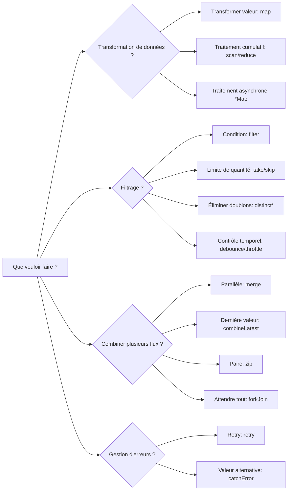
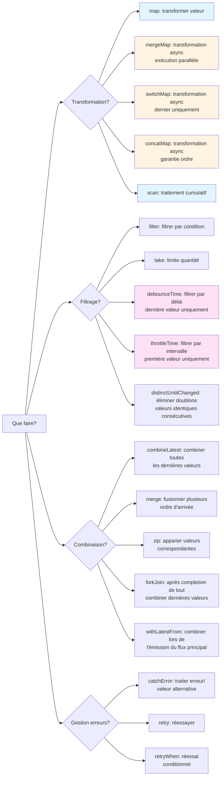
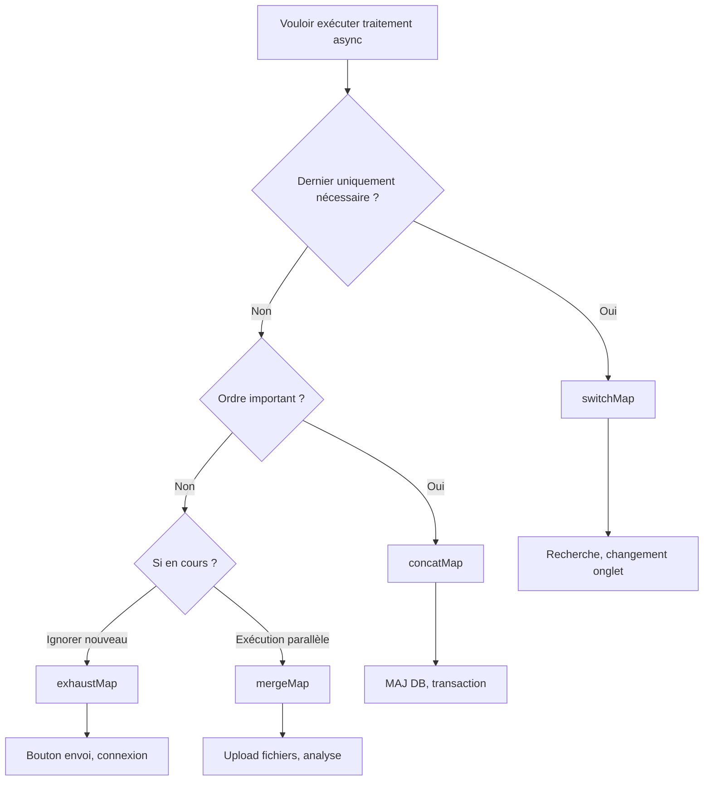

<style scoped>
.comparison-cards {
  display: grid;
  grid-template-columns: 1fr 1fr;
  gap: 1rem;
  margin-bottom: 2rem;
}

@media (max-width: 768px) {
  .comparison-cards {
    grid-template-columns: 1fr;
  }
}

/* Augmenter la taille de police de la partie titre */
.comparison-cards .tip .custom-block-title {
  font-size: 1.1rem;
  font-weight: 600;
}
</style>

# Les hésitations dans la sélection d'opérateurs

RxJS a plus de 100 types d'opérateurs, et **hésiter sur lequel utiliser** est une difficulté que tout le monde rencontre. Cette page fournit des critères de sélection pratiques et des diagrammes de flux.

## Critères pour choisir parmi plus de 100 opérateurs

### Problème : Trop de choix

```typescript
// Vouloir transformer un tableau... map? scan? reduce? toArray?
// Vouloir appeler plusieurs APIs... mergeMap? switchMap? concatMap? exhaustMap?
// Vouloir filtrer des valeurs... filter? take? first? distinctUntilChanged?
// Vouloir combiner plusieurs flux... merge? combineLatest? zip? forkJoin?
```

### Solution : Affiner par catégorie + objectif



### Diagramme de flux de sélection plus détaillé

Le diagramme de flux suivant montre la procédure pour choisir les opérateurs selon l'objectif spécifique.



## 1. Opérateurs de transformation (Transformation)

**Quand utiliser ?** Vouloir changer la forme des données, appeler un traitement asynchrone

| Opérateur | Usage | Cas d'usage courants |
|---|---|---|
| **map** | Transformer valeur 1:1 | Obtenir propriété, calcul, conversion de type |
| **scan** | Traitement cumulatif (flux valeurs intermédiaires) | Compteur, total, historique |
| **reduce** | Traitement cumulatif (valeur finale uniquement) | Total tableau, valeur max |
| **mergeMap** | Exécution parallèle traitement async | Appels API multiples en parallèle |
| **switchMap** | Basculer traitement async | API recherche (dernier uniquement) |
| **concatMap** | Exécution séquentielle traitement async | Traitement où ordre est important |
| **exhaustMap** | Ignorer nouveaux traitements en cours | Prévention double-clic (bouton envoi) |

### Exemple pratique : Sélection par cas d'usage

#### Cas d'usage 1 : Obtenir une propriété
```typescript
import { of } from 'rxjs';
import { map } from 'rxjs';

interface User { id: number; name: string; }

of({ id: 1, name: 'Alice' }).pipe(
  map(user => user.name) // Transformer valeur 1:1 → map
).subscribe(name => console.log(name)); // 'Alice'
```

#### Cas d'usage 2 : Compteur
```typescript
import { fromEvent } from 'rxjs';
import { scan } from 'rxjs';

const button = document.querySelector('button')!;

fromEvent(button, 'click').pipe(
  scan(count => count + 1, 0) // Traitement cumulatif → scan
).subscribe(count => console.log(`Nombre de clics: ${count}`));
```

#### Cas d'usage 3 : Appel API de recherche
```typescript
import { fromEvent } from 'rxjs';
import { debounceTime, map, switchMap } from 'rxjs';

const searchInput = document.querySelector('input')!;

fromEvent(searchInput, 'input').pipe(
  debounceTime(300),
  map(e => (e.target as HTMLInputElement).value),
  switchMap(query => searchAPI(query)) // Dernier uniquement → switchMap
).subscribe(results => console.log(results));
```

## 2. Opérateurs de filtrage (Filtering)

### Quand utiliser ?
Vouloir sélectionner des valeurs, contrôler le timing

| Opérateur | Usage | Cas d'usage courants |
|---|---|---|
| **filter** | Laisser passer seulement valeurs conformes | Nombres pairs uniquement, valeurs non-null uniquement |
| **take** | Seulement les N premiers | Obtenir les 5 premiers |
| **first** | Seulement le premier | Obtenir première valeur |
| **distinctUntilChanged** | Seulement valeurs différentes de la précédente | Élimination doublons |
| **debounceTime** | Déclencher après écoulement temps | Saisie recherche (après fin saisie) |
| **throttleTime** | Espacer à intervalles réguliers | Événement scroll |

### Exemple pratique : Sélection par cas d'usage

#### Cas d'usage 1 : Obtenir seulement nombres pairs
```typescript
import { of } from 'rxjs';
import { filter } from 'rxjs';

of(1, 2, 3, 4, 5).pipe(
  filter(n => n % 2 === 0) // Seulement valeurs conformes → filter
).subscribe(console.log); // 2, 4
```

#### Cas d'usage 2 : Optimisation saisie recherche
```typescript
import { fromEvent } from 'rxjs';
import { debounceTime, distinctUntilChanged, map } from 'rxjs';

const input = document.querySelector('input')!;

fromEvent(input, 'input').pipe(
  debounceTime(300),              // Attendre fin de saisie → debounceTime
  map(e => (e.target as HTMLInputElement).value),
  distinctUntilChanged()          // Éliminer doublons → distinctUntilChanged
).subscribe(query => console.log('Recherche:', query));
```

#### Cas d'usage 3 : Espacer événements scroll
```typescript
import { fromEvent } from 'rxjs';
import { throttleTime } from 'rxjs';

fromEvent(window, 'scroll').pipe(
  throttleTime(200) // Seulement 1 fois par 200ms → throttleTime
).subscribe(() => console.log('Position scroll:', window.scrollY));
```

## 3. Opérateurs de combinaison (Combination)

### Quand utiliser ?
Vouloir combiner plusieurs flux

| Opérateur | Usage | Cas d'usage courants |
|---|---|---|
| **merge** | Parallèle plusieurs flux | Surveiller plusieurs événements |
| **combineLatest** | Combiner toutes dernières valeurs | Validation formulaire |
| **zip** | Apparier valeurs correspondantes | Associer résultats de 2 APIs |
| **forkJoin** | Tableau résultats après completion de tout | Exécution parallèle plusieurs APIs |
| **withLatestFrom** | Flux principal + valeur auxiliaire | Événement + état actuel |

### Exemple pratique : Sélection par cas d'usage

#### Cas d'usage 1 : Surveiller plusieurs événements
```typescript
import { fromEvent, merge } from 'rxjs';

const clicks$ = fromEvent(document, 'click');
const keypresses$ = fromEvent(document, 'keypress');

merge(clicks$, keypresses$).pipe() // Surveillance parallèle → merge
  .subscribe(() => console.log('Un événement s\'est produit'));
```

#### Cas d'usage 2 : Validation formulaire
```typescript
import { combineLatest } from 'rxjs';
import { map } from 'rxjs';

const email$ = getFormControl('email');
const password$ = getFormControl('password');

combineLatest([email$, password$]).pipe( // Toutes dernières valeurs → combineLatest
  map(([email, password]) => email.length > 0 && password.length > 7)
).subscribe(isValid => console.log('Formulaire valide:', isValid));
```

#### Cas d'usage 3 : Exécution parallèle plusieurs APIs
```typescript
import { forkJoin } from 'rxjs';

forkJoin({
  user: getUserAPI(),
  posts: getPostsAPI(),
  comments: getCommentsAPI()
}).subscribe(({ user, posts, comments }) => { // Attendre completion totale → forkJoin
  console.log('Toutes données obtenues', { user, posts, comments });
});
```

## Top 20 des opérateurs les plus utilisés

Voici les opérateurs **les plus fréquemment utilisés** en pratique. Commencez par maîtriser ces 20.

<div class="comparison-cards">

::: tip 🥇 Les plus fréquents (essentiels)
1. **map** - Transformer valeur
2. **filter** - Filtrer par condition
3. **switchMap** - Recherche, etc., dernier uniquement nécessaire
4. **tap** - Débogage, effets secondaires
5. **take** - Les N premiers
6. **first** - Le premier
7. **catchError** - Gestion erreurs
8. **takeUntil** - Désinscription
:::

::: tip 🥈 Fréquents (souvent utilisés)
9. **mergeMap** - Traitement async parallèle
10. **debounceTime** - Attendre fin saisie
11. **distinctUntilChanged** - Éliminer doublons
12. **combineLatest** - Combiner plusieurs valeurs
13. **startWith** - Définir valeur initiale
14. **scan** - Traitement cumulatif
15. **shareReplay** - Mettre en cache résultats
:::

::: tip 🥉 Souvent utilisés (à connaître)
16. **concatMap** - Traitement séquentiel
17. **throttleTime** - Espacer événements
18. **withLatestFrom** - Obtenir valeur auxiliaire
19. **forkJoin** - Attendre plusieurs APIs
20. **retry** - Traitement réessai
:::

</div>


## switchMap vs mergeMap vs concatMap vs exhaustMap

Ces quatre sont les opérateurs **les plus facilement confondus**. Comprenons clairement les différences.

### Tableau comparatif

| Opérateur | Méthode exécution | Traitement précédent | Nouveau traitement | Quand utiliser |
|---|---|---|---|---|
| **switchMap** | Basculer | **Annuler** | Démarrer immédiatement | Recherche, autocomplétion |
| **mergeMap** | Exécution parallèle | Continuer | Démarrer immédiatement | Upload fichiers, analyse |
| **concatMap** | Exécution séquentielle | Attendre completion | **Démarrer après attente** | Traitement où ordre important |
| **exhaustMap** | Ignorer pendant exécution | Continuer | **Ignorer** | Prévention double-clic bouton |

### Comparaison avec Marble Diagrams

```
Extérieur: ----A----B----C----|

Intérieur: A → --1--2|
           B → --3--4|
           C → --5--6|

switchMap:  ----1--3--5--6|  (A annulé avant 2, B annulé avant 4)
mergeMap:   ----1-23-45-6|   (tout exécuté en parallèle)
concatMap:  ----1--2--3--4--5--6|  (exécution séquentielle)
exhaustMap: ----1--2|            (B, C ignorés)
```

### Exemple pratique : Différences des 4 pour même traitement

**Situation** : Appeler API (1 seconde) à chaque clic bouton. Utilisateur clique toutes les 0,5 secondes.

#### switchMap - Optimal pour recherche

```typescript
import { fromEvent } from 'rxjs';
import { switchMap } from 'rxjs';

fromEvent(button, 'click').pipe(
  switchMap(() => searchAPI()) // Exécuter dernier uniquement, annuler anciennes requêtes
).subscribe(result => console.log(result));

// 0.0s: Clic1 → API1 démarre
// 0.5s: Clic2 → API1 annulé, API2 démarre
// 1.0s: Clic3 → API2 annulé, API3 démarre
// 2.0s: API3 complète → Afficher résultat (API3 uniquement)
```

::: tip 💡 Quand utiliser
- **Recherche/autocomplétion** : Seulement dernière valeur saisie nécessaire
- **Changement onglet** : Seulement données onglet affiché nécessaires
- **Pagination** : Afficher seulement dernière page
:::

#### mergeMap - Optimal pour traitement parallèle

```typescript
import { fromEvent } from 'rxjs';
import { mergeMap } from 'rxjs';

fromEvent(button, 'click').pipe(
  mergeMap(() => uploadFileAPI()) // Tout exécuter en parallèle
).subscribe(result => console.log(result));

// 0.0s: Clic1 → API1 démarre
// 0.5s: Clic2 → API2 démarre (API1 continue)
// 1.0s: Clic3 → API3 démarre (API1, API2 continuent)
// 1.0s: API1 complète → Afficher résultat
// 1.5s: API2 complète → Afficher résultat
// 2.0s: API3 complète → Afficher résultat
```

::: tip 💡 Quand utiliser
- **Upload fichiers** : Upload simultané plusieurs fichiers
- **Analyse/envoi logs** : Exécution parallèle traitements indépendants
- **Système notifications** : Traiter simultanément plusieurs notifications
:::

#### concatMap - Optimal pour traitement où ordre important

```typescript
import { fromEvent } from 'rxjs';
import { concatMap } from 'rxjs';

fromEvent(button, 'click').pipe(
  concatMap(() => updateDatabaseAPI()) // Exécution séquentielle (attendre completion précédent)
).subscribe(result => console.log(result));

// 0.0s: Clic1 → API1 démarre
// 0.5s: Clic2 → Attendre (ajouté à la file)
// 1.0s: Clic3 → Attendre (ajouté à la file)
// 1.0s: API1 complète → Afficher résultat, API2 démarre
// 2.0s: API2 complète → Afficher résultat, API3 démarre
// 3.0s: API3 complète → Afficher résultat
```

::: tip 💡 Quand utiliser
- **Mise à jour base de données** : Traitement écriture où ordre important
- **Transaction** : Utiliser résultat traitement précédent dans le suivant
- **Animation** : Traitements à exécuter dans l'ordre
:::

#### exhaustMap - Optimal pour prévention double-clic

```typescript
import { fromEvent } from 'rxjs';
import { exhaustMap } from 'rxjs';

fromEvent(button, 'click').pipe(
  exhaustMap(() => submitFormAPI()) // Ignorer nouvelles requêtes pendant exécution
).subscribe(result => console.log(result));

// 0.0s: Clic1 → API1 démarre
// 0.5s: Clic2 → Ignoré (API1 en cours)
// 1.0s: Clic3 → Ignoré (API1 en cours)
// 1.0s: API1 complète → Afficher résultat
// 1.5s: Clic4 → API4 démarre (précédent complété)
```

::: tip 💡 Quand utiliser
- **Bouton envoi** : Prévention double envoi
- **Traitement connexion** : Prévention erreurs par double-clic
- **Traitement paiement** : Empêcher exécution en double
:::

### Diagramme de flux de sélection



## Critères de jugement en pratique

### Étape 1 : Clarifier ce qu'on veut accomplir

```typescript
// ❌ Mauvais exemple : Utiliser mergeMap sans réfléchir
observable$.pipe(
  mergeMap(value => someAPI(value))
);

// ✅ Bon exemple : Choisir après avoir clarifié l'objectif
// Objectif : Pour saisie recherche utilisateur, afficher seulement dernier résultat
// → Annuler anciennes requêtes → switchMap
searchInput$.pipe(
  switchMap(query => searchAPI(query))
);
```

### Étape 2 : Considérer les performances

#### Choix debounceTime vs throttleTime

```typescript
// Saisie recherche : Exécuter après "fin" saisie utilisateur
searchInput$.pipe(
  debounceTime(300), // Exécuter si pas de saisie pendant 300ms
  switchMap(query => searchAPI(query))
);

// Scroll : Exécuter à intervalles réguliers (éviter trop haute fréquence)
scroll$.pipe(
  throttleTime(200), // Seulement 1 fois par 200ms
  tap(() => loadMoreItems())
);
```

### Étape 3 : Intégrer gestion erreurs

```typescript
import { of } from 'rxjs';
import { catchError, retry, switchMap } from 'rxjs';

searchInput$.pipe(
  debounceTime(300),
  switchMap(query =>
    searchAPI(query).pipe(
      retry(2),                          // Réessayer jusqu'à 2 fois
      catchError(err => {
        console.error('Erreur recherche:', err);
        return of([]);                   // Retourner tableau vide
      })
    )
  )
).subscribe(results => console.log(results));
```

### Étape 4 : Prévenir fuites mémoire

```typescript
import { Subject } from 'rxjs';
import { switchMap, takeUntil } from 'rxjs';

class SearchComponent {
  private destroy$ = new Subject<void>();

  ngOnInit() {
    searchInput$.pipe(
      debounceTime(300),
      switchMap(query => searchAPI(query)),
      takeUntil(this.destroy$)           // Annuler lors destruction composant
    ).subscribe(results => console.log(results));
  }

  ngOnDestroy() {
    this.destroy$.next();
    this.destroy$.complete();
  }
}
```

## Liste de vérification de la compréhension

Vérifiez si vous pouvez répondre aux questions suivantes.

```markdown
## Compréhension de base
- [ ] Pouvoir classer opérateurs par catégorie (transformation, filtrage, combinaison)
- [ ] Pouvoir expliquer 10+ des 20 opérateurs les plus utilisés
- [ ] Pouvoir expliquer différences entre switchMap, mergeMap, concatMap, exhaustMap

## Sélection pratique
- [ ] Pouvoir choisir opérateurs adaptés pour fonction recherche (switchMap + debounceTime)
- [ ] Pouvoir choisir opérateurs adaptés pour appels API parallèles (forkJoin ou mergeMap)
- [ ] Pouvoir choisir opérateurs adaptés pour validation formulaire (combineLatest)

## Performance
- [ ] Pouvoir distinguer usage debounceTime et throttleTime
- [ ] Connaître méthode optimisation événements haute fréquence
- [ ] Pouvoir implémenter pattern prévention fuites mémoire

## Gestion erreurs
- [ ] Pouvoir utiliser combinaison catchError et retry
- [ ] Pouvoir implémenter traitement fallback en cas d'erreur
- [ ] Pouvoir donner feedback erreur à l'utilisateur
```

## Prochaines étapes

Après avoir compris sélection opérateurs, apprenez ensuite **timing et ordre**.

→ **Compréhension timing et ordre** (en préparation) - Quand valeurs circulent, compréhension synchrone vs asynchrone

## Pages connexes

- **[Chapitre 4 : Compréhension des opérateurs](/fr/guide/operators/)** - Détails tous opérateurs
- **[Chapitre 13 : Collection patterns pratiques](/fr/guide/)** - Cas d'usage réels (en préparation)
- **[Chapitre 10 : Erreurs courantes et solutions](/fr/guide/anti-patterns/common-mistakes)** - Anti-patterns sélection inappropriée opérateurs

## 🎯 Exercices pratiques

### Problème 1 : Sélectionner opérateur approprié

Choisissez opérateur optimal pour scénarios suivants.

1. Utilisateur saisit dans boîte recherche → Appel API
2. Clic bouton pour uploader plusieurs fichiers
3. Déterminer si tous champs formulaire sont valides
4. Prévenir double-clic bouton envoi

<details>
<summary>Exemple de solution</summary>

**1. Boîte recherche → Appel API**
```typescript
searchInput$.pipe(
  debounceTime(300),      // Attendre fin saisie
  distinctUntilChanged(), // Éliminer doublons
  switchMap(query => searchAPI(query)) // Dernier uniquement
).subscribe(results => displayResults(results));
```
> [!NOTE]Raison
> Recherche nécessite seulement dernier résultat donc `switchMap`. Attendre fin saisie donc `debounceTime`.

---

**2. Uploader plusieurs fichiers**
```typescript
fromEvent(uploadButton, 'click').pipe(
  mergeMap(() => {
    const files = getSelectedFiles();
    return forkJoin(files.map(file => uploadFileAPI(file)));
  })
).subscribe(results => console.log('Tous fichiers uploadés', results));
```
> [!NOTE]Raison
> Upload parallèle plusieurs fichiers donc `forkJoin`. Traitements indépendants donc `mergeMap` aussi OK.

---

**3. Déterminer validité tous champs formulaire**
```typescript
combineLatest([
  emailField$,
  passwordField$,
  agreeTerms$
]).pipe(
  map(([email, password, agreed]) =>
    email.valid && password.valid && agreed
  )
).subscribe(isValid => submitButton.disabled = !isValid);
```

> [!NOTE]Raison
> Combiner dernières valeurs tous champs donc `combineLatest`.

---

**4. Prévention double-clic bouton envoi**
```typescript
fromEvent(submitButton, 'click').pipe(
  exhaustMap(() => submitFormAPI())
).subscribe(result => console.log('Envoi terminé', result));
```
> [!NOTE]Raison
> Protéger traitement en cours et ignorer nouveaux clics donc `exhaustMap`.

</details>

### Problème 2 : Choix switchMap et mergeMap

Code suivant utilise `mergeMap` mais a un problème. Corrigez-le.

```typescript
searchInput$.pipe(
  debounceTime(300),
  mergeMap(query => searchAPI(query))
).subscribe(results => displayResults(results));
```

<details>
<summary>Exemple de solution</summary>

```typescript
searchInput$.pipe(
  debounceTime(300),
  switchMap(query => searchAPI(query)) // mergeMap → switchMap
).subscribe(results => displayResults(results));
```

> [!IMPORTANT] Problème
> - Avec `mergeMap`, toutes requêtes recherche exécutées en parallèle
> - Si utilisateur saisit "a"→"ab"→"abc", 3 requêtes toutes exécutées
> - Ancienne requête (résultat "a") peut revenir après et écraser dernier résultat

> [!NOTE] Raison correction
> - Avec `switchMap`, anciennes requêtes annulées quand nouvelle recherche démarre
> - Toujours seulement dernier résultat recherche affiché

</details>

### Problème 3 : Scénario pratique

Écrivez code satisfaisant exigences suivantes.

> [!NOTE] Points clés
> - Utilisateur clique bouton
> - Obtenir 3 APIs en parallèle (infos utilisateur, liste posts, liste commentaires)
> - Afficher données quand tout complété
> - Si erreur, retourner données vides
> - Annuler souscription lors destruction composant

<details>
<summary>Exemple de solution</summary>

```typescript
import { fromEvent, forkJoin, of, Subject } from 'rxjs';
import { switchMap, catchError, takeUntil } from 'rxjs';

class DataComponent {
  private destroy$ = new Subject<void>();
  private button = document.querySelector('button')!;

  ngOnInit() {
    fromEvent(this.button, 'click').pipe(
      switchMap(() =>
        forkJoin({
          user: this.getUserAPI().pipe(
            catchError(() => of(null))
          ),
          posts: this.getPostsAPI().pipe(
            catchError(() => of([]))
          ),
          comments: this.getCommentsAPI().pipe(
            catchError(() => of([]))
          )
        })
      ),
      takeUntil(this.destroy$)
    ).subscribe(({ user, posts, comments }) => {
      console.log('Obtention données terminée', { user, posts, comments });
    });
  }

  ngOnDestroy() {
    this.destroy$.next();
    this.destroy$.complete();
  }

  private getUserAPI() { /* ... */ }
  private getPostsAPI() { /* ... */ }
  private getCommentsAPI() { /* ... */ }
}
```

> [!NOTE] Points clés
> - `forkJoin` exécute 3 APIs en parallèle et attend completion totale
> - Définir valeur fallback en cas erreur avec `catchError` pour chaque API
> - `switchMap` bascule vers nouvelle requête à chaque clic bouton
> - `takeUntil` annulation automatique lors destruction composant

</details>
