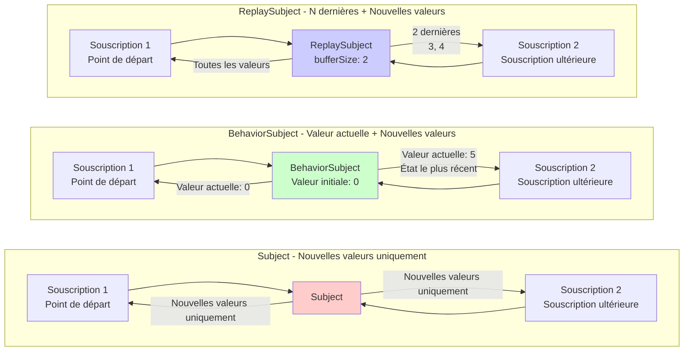

# Difficulté de la gestion d'état

Dans RxJS, **"partager l'état entre plusieurs composants" et "mettre en cache les résultats d'API"** sont des exigences très courantes, mais choisir la méthode appropriée est difficile. Cette page explique les patterns pratiques de gestion d'état et de partage de flux.

## Subject vs BehaviorSubject vs ReplaySubject

### Types et caractéristiques des Subject

| Subject | Valeur initiale | Comportement lors de la souscription | Cas d'usage courants |
|---|---|---|---|
| **Subject** | Aucune | Reçoit uniquement les valeurs après souscription | Bus d'événements, système de notifications |
| **BehaviorSubject** | Obligatoire | Reçoit immédiatement la dernière valeur | État actuel (état de connexion, élément sélectionné) |
| **ReplaySubject** | Aucune | Reçoit les N dernières valeurs | Historique, logs, enregistrement des opérations |
| **AsyncSubject** | Aucune | Reçoit uniquement la valeur finale à la completion | Résultat asynchrone unique (rarement utilisé) |

### Visualisation des différences de comportement des Subject

Le diagramme suivant montre quelles valeurs chaque Subject reçoit lors de la souscription.



> [!TIP] Critères de sélection
> - **Subject**: Notification d'événements (passé non nécessaire)
> - **BehaviorSubject**: Gestion d'état (valeur actuelle nécessaire)
> - **ReplaySubject**: Gestion d'historique (N dernières valeurs nécessaires)

### Exemple pratique 1: Subject (Bus d'événements)

#### ❌ Mauvais exemple: Les valeurs avant souscription ne sont pas reçues
```typescript
import { Subject } from 'rxjs';

const notifications$ = new Subject<string>();

notifications$.next('Notification 1'); // Personne n'est encore souscrit

notifications$.subscribe(msg => {
  console.log('Reçu:', msg);
});

notifications$.next('Notification 2');
notifications$.next('Notification 3');

// Sortie:
// Reçu: Notification 2
// Reçu: Notification 3
// ('Notification 1' n'est pas reçue)
```

#### ✅ Bon exemple: Utilisation comme bus d'événements (traite uniquement les événements après souscription)
```typescript
import { filter, map, Subject } from 'rxjs';

class EventBus {
  private events$ = new Subject<{ type: string; payload: any }>();

  emit(type: string, payload: any) {
    this.events$.next({ type, payload });
  }

  on(type: string) {
    return this.events$.pipe(
      filter(event => event.type === type),
      map(event => event.payload)
    );
  }
}

const bus = new EventBus();

// Début de souscription
bus.on('userLogin').subscribe(user => {
  console.log('Connexion:', user);
});

// Émission d'événement
bus.emit('userLogin', { id: 1, name: 'Alice' }); // ✅ Reçu
// Connexion: {id: 1, name: 'Alice'}id: 1name: "Alice"[[Prototype]]: Object
```

> [!TIP] Quand utiliser Subject
> - **Architecture événementielle**: Communication faiblement couplée entre composants
> - **Système de notifications**: Distribution de notifications en temps réel
> - **Quand le passé est inutile**: Lorsqu'il suffit de traiter les événements après souscription

### Exemple pratique 2: BehaviorSubject (Gestion d'état)

#### ❌ Mauvais exemple: Avec Subject, l'état actuel est inconnu
```typescript
import { Subject } from 'rxjs';

const isLoggedIn$ = new Subject<boolean>();

// L'utilisateur se connecte
isLoggedIn$.next(true);

// Composant souscrivant ultérieurement
isLoggedIn$.subscribe(status => {
  console.log('État de connexion:', status); // Aucune sortie
});
```

#### ✅ Bon exemple: Obtenir immédiatement l'état actuel avec BehaviorSubject
```typescript
import { BehaviorSubject } from 'rxjs';

class AuthService {
  private isLoggedIn$ = new BehaviorSubject<boolean>(false); // Valeur initiale: false

  login(username: string, password: string) {
    // Traitement de connexion...
    this.isLoggedIn$.next(true);
  }

  logout() {
    this.isLoggedIn$.next(false);
  }

  // Exposition en lecture seule à l'extérieur
  get isLoggedIn() {
    return this.isLoggedIn$.asObservable();
  }

  // Obtention synchrone de la valeur actuelle (utilisation dans des cas spéciaux uniquement)
  get currentStatus(): boolean {
    return this.isLoggedIn$.value;
  }
}

const auth = new AuthService();

auth.login('user', 'pass');

// Même en souscrivant ultérieurement, l'état actuel (true) est immédiatement obtenu
auth.isLoggedIn.subscribe(status => {
  console.log('État de connexion:', status); // État de connexion: true
});
```

> [!TIP] Quand utiliser BehaviorSubject
> - **Conservation de l'état actuel**: État de connexion, élément sélectionné, valeurs de configuration
> - **Valeur immédiatement nécessaire lors de la souscription**: Lorsque l'état actuel est nécessaire pour l'affichage initial de l'UI
> - **Surveillance des changements d'état**: Mise à jour réactive lors du changement d'état

### Exemple pratique 3: ReplaySubject (Gestion d'historique)

#### ✅ Bon exemple: Rejouer les N dernières valeurs
```typescript
import { ReplaySubject } from 'rxjs';

class SearchHistoryService {
  // Conserver les 5 dernières recherches
  private history$ = new ReplaySubject<string>(5);

  addSearch(query: string) {
    this.history$.next(query);
  }

  getHistory() {
    return this.history$.asObservable();
  }
}

const searchHistory = new SearchHistoryService();

// Exécution de recherches
searchHistory.addSearch('TypeScript');
searchHistory.addSearch('RxJS');
searchHistory.addSearch('Angular');

// Même en souscrivant ultérieurement, les 3 dernières sont immédiatement obtenues
searchHistory.getHistory().subscribe(query => {
  console.log('Historique de recherche:', query);
});

// Sortie:
// Historique de recherche: TypeScript
// Historique de recherche: RxJS
// Historique de recherche: Angular
```

> [!TIP] Quand utiliser ReplaySubject
> - **Historique des opérations**: Historique de recherche, historique d'édition, historique de navigation
> - **Logs et pistes d'audit**: Enregistrement des opérations passées
> - **Support de Late Subscribe**: Lorsqu'il faut recevoir les valeurs passées même en cas de retard de souscription

## Différenciation entre share et shareReplay

### Problème: Exécution dupliquée d'Observable Cold

#### ❌ Mauvais exemple: L'API est appelée plusieurs fois avec plusieurs souscriptions
```typescript
import { ajax } from 'rxjs/ajax';

const users$ = ajax.getJSON('/api/users');

// Souscription 1
users$.subscribe(users => {
  console.log('Composant A:', users);
});

// Souscription 2
users$.subscribe(users => {
  console.log('Composant B:', users);
});

// Problème: L'API est appelée 2 fois
// GET /api/users (1ère fois)
// GET /api/users (2ème fois)
```

#### ✅ Bon exemple: Conversion en Hot avec share (partage de l'exécution)
```typescript
import { ajax } from 'rxjs/ajax';
import { share } from 'rxjs';

const users$ = ajax.getJSON('/api/users').pipe(
  share() // Partage de l'exécution
);

// Souscription 1
users$.subscribe(users => {
  console.log('Composant A:', users);
});

// Souscription 2 (si souscrite immédiatement)
users$.subscribe(users => {
  console.log('Composant B:', users);
});

// ✅ L'API est appelée une seule fois
// GET /api/users (une fois seulement)
```

> [!WARNING] Piège de share
> Avec `share()`, **le flux est réinitialisé lorsque la dernière souscription est annulée**. Il sera réexécuté lors de la prochaine souscription.
>
> ```typescript
> const data$ = fetchData().pipe(share());
>
> // Souscription 1
> const sub1 = data$.subscribe();
>
> // Souscription 2
> const sub2 = data$.subscribe();
>
> sub1.unsubscribe();
> sub2.unsubscribe(); // Tous désabonnés → Réinitialisation
>
> // Nouvelle souscription → fetchData() est réexécuté
> data$.subscribe();
> ```

### shareReplay: Mettre en cache et réutiliser les résultats

#### ✅ Bon exemple: Mise en cache avec shareReplay
```typescript
import { ajax } from 'rxjs/ajax';
import { shareReplay } from 'rxjs';

const users$ = ajax.getJSON('/api/users').pipe(
  shareReplay({ bufferSize: 1, refCount: true })
  // bufferSize: 1 → Mise en cache de la dernière valeur
  // refCount: true → Effacement du cache lorsque toutes les souscriptions sont annulées
);

// Souscription 1
users$.subscribe(users => {
  console.log('Composant A:', users);
});

// Souscription 2 après 1 seconde (même en souscrivant en retard, obtient depuis le cache)
setTimeout(() => {
  users$.subscribe(users => {
    console.log('Composant B:', users); // Obtient immédiatement depuis le cache
  });
}, 1000);

// ✅ L'API est appelée une seule fois et le résultat est mis en cache
```

### Comparaison share vs shareReplay

| Caractéristique | share() | shareReplay(1) |
|---|---|---|
| **Nouvelle souscription pendant l'exécution** | Partage le même flux | Partage le même flux |
| **Souscription en retard** | Reçoit uniquement les nouvelles valeurs | Reçoit la dernière valeur mise en cache |
| **Après annulation de toutes souscriptions** | Réinitialisation du flux | Conservation du cache (avec refCount: false) |
| **Mémoire** | Ne conserve pas | Conserve le cache |
| **Cas d'usage** | Partage de données en temps réel | Mise en cache de résultats d'API |

#### ✅ Bon exemple: Configuration appropriée de shareReplay
```typescript
import { shareReplay } from 'rxjs';

// Pattern 1: Cache permanent (non recommandé)
const data1$ = fetchData().pipe(
  shareReplay({ bufferSize: 1, refCount: false })
  // refCount: false → Attention aux fuites mémoire
);

// Pattern 2: Cache avec nettoyage automatique (recommandé)
const data2$ = fetchData().pipe(
  shareReplay({ bufferSize: 1, refCount: true })
  // refCount: true → Effacement du cache lors de l'annulation de toutes souscriptions
);

// Pattern 3: Cache avec TTL (RxJS 7.4+)
const data3$ = fetchData().pipe(
  shareReplay({
    bufferSize: 1,
    refCount: true,
    windowTime: 5000 // Suppression du cache après 5 secondes
  })
);
```

> [!IMPORTANT] Attention aux fuites mémoire
> L'utilisation de `shareReplay({ refCount: false })` laisse le cache permanent, ce qui peut causer des fuites mémoire. **Utilisez généralement refCount: true**.

## Différenciation pratique Hot vs Cold

### Caractéristique du Cold: Exécution par souscription

```typescript
import { Observable } from 'rxjs';

const cold$ = new Observable<number>(subscriber => {
  console.log('🔵 Début d\'exécution');
  subscriber.next(Math.random());
  subscriber.complete();
});

cold$.subscribe(v => console.log('Souscription 1:', v));
cold$.subscribe(v => console.log('Souscription 2:', v));

// Sortie:
// 🔵 Début d'exécution
// Souscription 1: 0.123
// 🔵 Début d'exécution
// Souscription 2: 0.456
// (Exécuté 2 fois, valeurs différentes)
```

### Caractéristique du Hot: Partage de l'exécution

```typescript
import { Subject } from 'rxjs';

const hot$ = new Subject<number>();

hot$.subscribe(v => console.log('Souscription 1:', v));
hot$.subscribe(v => console.log('Souscription 2:', v));

hot$.next(Math.random());

// Sortie:
// Souscription 1: 0.789
// Souscription 2: 0.789
// (Partage de la même valeur)
```

### Critères de différenciation

| Exigence | Cold | Hot |
|---|---|---|
| **Exécution indépendante nécessaire** | ✅ | ❌ |
| **Partage de l'exécution souhaité** | ❌ | ✅ |
| **Valeurs différentes par souscripteur** | ✅ | ❌ |
| **Distribution de données en temps réel** | ❌ | ✅ |
| **Partage d'appels API** | ❌ (conversion avec share) | ✅ |

#### ✅ Bon exemple: Conversion appropriée
```typescript
import { interval, fromEvent } from 'rxjs';
import { share, shareReplay } from 'rxjs';

// Cold: Timer indépendant pour chaque souscripteur
const coldTimer$ = interval(1000);

// Cold→Hot: Partage du timer
const hotTimer$ = interval(1000).pipe(share());

// Cold: Événement de clic (enregistrement d'écouteur indépendant par souscription)
const clicks$ = fromEvent(document, 'click');

// Cold→Hot: Mise en cache du résultat d'API
const cachedData$ = ajax.getJSON('/api/data').pipe(
  shareReplay({ bufferSize: 1, refCount: true })
);
```

## Pattern de gestion d'état centralisée

### Pattern 1: Gestion d'état avec classe Service

```typescript
import { BehaviorSubject, Observable } from 'rxjs';
import { map } from 'rxjs';

interface User {
  id: number;
  name: string;
  email: string;
}

class UserStore {
  // BehaviorSubject privé
  private users$ = new BehaviorSubject<User[]>([]);

  // Observable en lecture seule pour l'exposition publique
  get users(): Observable<User[]> {
    return this.users$.asObservable();
  }

  // Obtenir un utilisateur spécifique
  getUser(id: number): Observable<User | undefined> {
    return this.users.pipe(
      map(users => users.find(u => u.id === id))
    );
  }

  // Mettre à jour l'état
  addUser(user: User) {
    const currentUsers = this.users$.value;
    this.users$.next([...currentUsers, user]);
  }

  updateUser(id: number, updates: Partial<User>) {
    const currentUsers = this.users$.value;
    const updatedUsers = currentUsers.map(u =>
      u.id === id ? { ...u, ...updates } : u
    );
    this.users$.next(updatedUsers);
  }

  removeUser(id: number) {
    const currentUsers = this.users$.value;
    this.users$.next(currentUsers.filter(u => u.id !== id));
  }
}

// Utilisation
const store = new UserStore();

// Souscription
store.users.subscribe(users => {
  console.log('Liste d\'utilisateurs:', users);
});

// Mise à jour d'état
store.addUser({ id: 1, name: 'Alice', email: 'alice@example.com' });
store.updateUser(1, { name: 'Alice Smith' });
```

### Pattern 2: Gestion d'état avec scan

```typescript
import { Subject } from 'rxjs';
import { scan, startWith } from 'rxjs';

interface State {
  count: number;
  items: string[];
}

type Action =
  | { type: 'INCREMENT' }
  | { type: 'DECREMENT' }
  | { type: 'ADD_ITEM'; payload: string }
  | { type: 'RESET' };

const actions$ = new Subject<Action>();

const initialState: State = {
  count: 0,
  items: []
};

const state$ = actions$.pipe(
  scan((state, action) => {
    switch (action.type) {
      case 'INCREMENT':
        return { ...state, count: state.count + 1 };
      case 'DECREMENT':
        return { ...state, count: state.count - 1 };
      case 'ADD_ITEM':
        return { ...state, items: [...state.items, action.payload] };
      case 'RESET':
        return initialState;
      default:
        return state;
    }
  }, initialState),
  startWith(initialState)
);

// Souscription
state$.subscribe(state => {
  console.log('État actuel:', state);
});

// Émission d'actions
actions$.next({ type: 'INCREMENT' });
actions$.next({ type: 'ADD_ITEM', payload: 'pomme' });
actions$.next({ type: 'INCREMENT' });

// Sortie:
// État actuel: { count: 0, items: [] }
// État actuel: { count: 1, items: [] }
// État actuel: { count: 1, items: ['pomme'] }
// État actuel: { count: 2, items: ['pomme'] }
```

## Pièges courants

### Piège 1: Exposition externe de Subject

#### ❌ Mauvais exemple: Exposition directe de Subject
```typescript
import { BehaviorSubject } from 'rxjs';

class BadService {
  // ❌ Peut être modifié directement de l'extérieur
  public state$ = new BehaviorSubject<number>(0);
}

const service = new BadService();

// Peut être modifié arbitrairement de l'extérieur
service.state$.next(999); // ❌ Encapsulation violée
```

#### ✅ Bon exemple: Protection avec asObservable()
```typescript
import { BehaviorSubject } from 'rxjs';

class GoodService {
  private _state$ = new BehaviorSubject<number>(0);

  // Exposition en lecture seule
  get state() {
    return this._state$.asObservable();
  }

  // Modification uniquement via méthodes dédiées
  increment() {
    this._state$.next(this._state$.value + 1);
  }

  decrement() {
    this._state$.next(this._state$.value - 1);
  }
}

const service = new GoodService();

// ✅ Lecture seule possible
service.state.subscribe(value => console.log(value));

// ✅ Modification via méthodes dédiées
service.increment();

// ❌ Modification directe impossible (erreur de compilation)
// service.state.next(999); // Error: Property 'next' does not exist
```

### Piège 2: Fuite mémoire avec shareReplay

#### ❌ Mauvais exemple: Fuite mémoire avec refCount: false
```typescript
import { interval } from 'rxjs';
import { shareReplay, take } from 'rxjs';

const data$ = interval(1000).pipe(
  take(100),
  shareReplay({ bufferSize: 1, refCount: false })
  // ❌ refCount: false → Le cache reste éternellement
);

// Même après souscription et désabonnement, le flux continue en interne
const sub = data$.subscribe();
sub.unsubscribe();

// Le cache reste → Fuite mémoire
```

#### ✅ Bon exemple: Nettoyage automatique avec refCount: true
```typescript
import { interval } from 'rxjs';
import { shareReplay, take } from 'rxjs';

const data$ = interval(1000).pipe(
  take(100),
  shareReplay({ bufferSize: 1, refCount: true })
  // ✅ refCount: true → Nettoyage automatique lors de l'annulation de toutes souscriptions
);

const sub1 = data$.subscribe();
const sub2 = data$.subscribe();

sub1.unsubscribe();
sub2.unsubscribe(); // Annulation de toutes souscriptions → Arrêt du flux, effacement du cache
```

### Piège 3: Obtention synchrone de valeurs

#### ❌ Mauvais exemple: Dépendance excessive à value
```typescript
import { BehaviorSubject } from 'rxjs';

class CounterService {
  private count$ = new BehaviorSubject(0);

  increment() {
    // ❌ Trop de dépendance à value
    const current = this.count$.value;
    this.count$.next(current + 1);
  }

  // ❌ Exposition d'obtention synchrone
  getCurrentCount(): number {
    return this.count$.value;
  }
}
```

#### ✅ Bon exemple: Maintien du caractère réactif
```typescript
import { BehaviorSubject } from 'rxjs';
import { map } from 'rxjs';

class CounterService {
  private count$ = new BehaviorSubject(0);

  get count() {
    return this.count$.asObservable();
  }

  increment() {
    // ✅ Utilisation interne de value acceptable
    this.count$.next(this.count$.value + 1);
  }

  // ✅ Retour d'Observable
  isPositive() {
    return this.count$.pipe(
      map(count => count > 0)
    );
  }
}
```

## Checklist de compréhension

Vérifiez si vous pouvez répondre aux questions suivantes.

```markdown
## Compréhension de base
- [ ] Expliquer les différences entre Subject, BehaviorSubject et ReplaySubject
- [ ] Comprendre pourquoi BehaviorSubject nécessite une valeur initiale
- [ ] Comprendre la signification du bufferSize de ReplaySubject

## Hot/Cold
- [ ] Expliquer les différences entre Observable Cold et Hot
- [ ] Expliquer les différences entre share et shareReplay
- [ ] Comprendre le rôle de l'option refCount de shareReplay

## Gestion d'état
- [ ] Protéger Subject sans l'exposer à l'extérieur avec asObservable()
- [ ] Implémenter un pattern de gestion d'état avec BehaviorSubject
- [ ] Comprendre le pattern de gestion d'état avec scan

## Gestion mémoire
- [ ] Connaître comment prévenir les fuites mémoire avec shareReplay
- [ ] Expliquer les différences entre refCount: true et false
- [ ] Effacer le cache au moment approprié
```

## Prochaines étapes

Après avoir compris la gestion d'état et le partage, apprenez ensuite **la combinaison de flux multiples**.

→ **[Combinaison de flux multiples](/fr/guide/overcoming-difficulties/stream-combination)** - Différenciation de combineLatest, zip, withLatestFrom

## Pages connexes

- **[Chapitre 5: Qu'est-ce qu'un Subject](/fr/guide/subjects/what-is-subject)** - Fondamentaux des Subject
- **[Chapitre 5: Types de Subject](/fr/guide/subjects/types-of-subject)** - Détails sur BehaviorSubject et ReplaySubject
- **[Opérateur share()](/fr/guide/operators/multicasting/share)** - Explication détaillée de share
- **[Mauvaise utilisation de shareReplay](/fr/guide/anti-patterns/common-mistakes#4-sharereplay-の誤用)** - Erreurs courantes
- **[Cold vs Hot Observable](/fr/guide/observables/cold-and-hot-observables)** - Détails sur Cold/Hot

## 🎯 Exercices pratiques

### Problème 1: Sélection du Subject approprié

Choisissez le Subject optimal pour les scénarios suivants.

1. **Gestion de l'état de connexion utilisateur** (état initial: déconnecté)
2. **Distribution de messages de notification** (afficher uniquement les messages après souscription)
3. **Conservation des 5 dernières opérations** (voir les 5 dernières même en souscrivant en retard)

<details>
<summary>Exemple de réponse</summary>

**1. État de connexion utilisateur**
```typescript
import { BehaviorSubject } from 'rxjs';

class AuthService {
  private isLoggedIn$ = new BehaviorSubject<boolean>(false);

  get loginStatus() {
    return this.isLoggedIn$.asObservable();
  }

  login() {
    this.isLoggedIn$.next(true);
  }

  logout() {
    this.isLoggedIn$.next(false);
  }
}
```

> [!NOTE] Raison
> Comme l'état actuel est nécessaire immédiatement lors de la souscription, **BehaviorSubject** est optimal.

---

**2. Distribution de messages de notification**
```typescript
import { Subject } from 'rxjs';

class NotificationService {
  private notifications$ = new Subject<string>();

  get messages() {
    return this.notifications$.asObservable();
  }

  notify(message: string) {
    this.notifications$.next(message);
  }
}
```

> [!NOTE] Raison
> Comme il suffit d'afficher les messages après souscription, **Subject** est suffisant.

---

**3. 5 dernières opérations**
```typescript
import { ReplaySubject } from 'rxjs';

class HistoryService {
  private actions$ = new ReplaySubject<string>(5); // Conservation de 5 éléments

  get history() {
    return this.actions$.asObservable();
  }

  addAction(action: string) {
    this.actions$.next(action);
  }
}
```

> [!NOTE] Raison
> Pour conserver les 5 derniers et pouvoir les obtenir même en souscrivant en retard, **ReplaySubject(5)** est optimal.

</details>

### Problème 2: Choix entre share et shareReplay

Choisissez l'opérateur approprié pour le code suivant.

```typescript
import { ajax } from 'rxjs/ajax';

// Scénario 1: Données en temps réel depuis WebSocket
const realTimeData$ = webSocket('ws://example.com/stream');

// Scénario 2: Appel API pour informations utilisateur (vouloir mettre en cache le résultat)
const user$ = ajax.getJSON('/api/user/me');

// Lequel utiliser pour quoi ?
```

<details>
<summary>Exemple de réponse</summary>

**Scénario 1: Données en temps réel depuis WebSocket**
```typescript
import { share } from 'rxjs';

const realTimeData$ = webSocket('ws://example.com/stream').pipe(
  share() // Pas besoin de mise en cache pour données en temps réel
);
```

> [!NOTE] Raison
> Les données en temps réel comme WebSocket n'ont pas besoin de mise en cache des valeurs passées, donc **share()** est utilisé. En cas de souscription en retard, on reçoit les nouvelles données à partir de ce moment.

---

**Scénario 2: Appel API pour informations utilisateur**
```typescript
import { shareReplay } from 'rxjs';

const user$ = ajax.getJSON('/api/user/me').pipe(
  shareReplay({ bufferSize: 1, refCount: true })
);
```

> [!NOTE] Raison
> Pour mettre en cache le résultat d'API et le partager entre plusieurs composants, **shareReplay()** est utilisé. `refCount: true` prévient les fuites mémoire.

</details>

### Problème 3: Correction de fuite mémoire

Le code suivant a un problème de fuite mémoire. Corrigez-le.

```typescript
import { interval } from 'rxjs';
import { shareReplay } from 'rxjs';

const data$ = interval(1000).pipe(
  shareReplay(1) // Problème: équivalent à shareReplay({ bufferSize: 1, refCount: false })
);

const sub = data$.subscribe(v => console.log(v));
sub.unsubscribe();

// Après cela, interval continue à fonctionner → Fuite mémoire
```

<details>
<summary>Exemple de réponse</summary>

**Code corrigé:**
```typescript
import { interval } from 'rxjs';
import { shareReplay } from 'rxjs';

const data$ = interval(1000).pipe(
  shareReplay({ bufferSize: 1, refCount: true })
  // refCount: true → Arrêt du flux lors de l'annulation de toutes souscriptions
);

const sub = data$.subscribe(v => console.log(v));
sub.unsubscribe(); // Le flux est arrêté
```

> [!IMPORTANT] Problème
> - `shareReplay(1)` est l'abréviation de `shareReplay({ bufferSize: 1, refCount: false })`
> - Avec `refCount: false`, le flux continue même après l'annulation de toutes souscriptions
> - interval continue éternellement, causant une fuite mémoire

> [!NOTE] Raison de la correction
> En spécifiant `refCount: true`, le flux s'arrête et le cache est effacé lorsque la dernière souscription est annulée.

</details>

### Problème 4: Implémentation de gestion d'état

Implémentez un TodoStore répondant aux exigences suivantes.

> [!NOTE] Exigences
> - Possibilité d'ajouter, compléter et supprimer des items Todo
> - Obtenir la liste Todo en lecture seule de l'extérieur
> - Possibilité d'obtenir le nombre de Todos complétés

<details>
<summary>Exemple de réponse</summary>

```typescript
import { BehaviorSubject, Observable } from 'rxjs';
import { map } from 'rxjs';

interface Todo {
  id: number;
  text: string;
  completed: boolean;
}

class TodoStore {
  private todos$ = new BehaviorSubject<Todo[]>([]);
  private nextId = 1;

  // Exposition en lecture seule
  get todos(): Observable<Todo[]> {
    return this.todos$.asObservable();
  }

  // Nombre de Todos complétés
  get completedCount(): Observable<number> {
    return this.todos$.pipe(
      map(todos => todos.filter(t => t.completed).length)
    );
  }

  // Ajouter Todo
  addTodo(text: string) {
    const currentTodos = this.todos$.value;
    const newTodo: Todo = {
      id: this.nextId++,
      text,
      completed: false
    };
    this.todos$.next([...currentTodos, newTodo]);
  }

  // Compléter Todo
  toggleTodo(id: number) {
    const currentTodos = this.todos$.value;
    const updatedTodos = currentTodos.map(todo =>
      todo.id === id ? { ...todo, completed: !todo.completed } : todo
    );
    this.todos$.next(updatedTodos);
  }

  // Supprimer Todo
  removeTodo(id: number) {
    const currentTodos = this.todos$.value;
    this.todos$.next(currentTodos.filter(todo => todo.id !== id));
  }
}

// Utilisation
const store = new TodoStore();

store.todos.subscribe(todos => {
  console.log('Liste Todo:', todos);
});

store.completedCount.subscribe(count => {
  console.log('Complétés:', count);
});

store.addTodo('Apprendre RxJS');
store.addTodo('Lire la documentation');
store.toggleTodo(1);
```

> [!NOTE] Points clés
> - Conservation de l'état avec `BehaviorSubject`
> - Exposition en lecture seule à l'extérieur avec `asObservable()`
> - Utilisation de `value` pour obtenir l'état actuel et le mettre à jour
> - Utilisation de `map` pour calculer l'état dérivé (completedCount)

</details>
