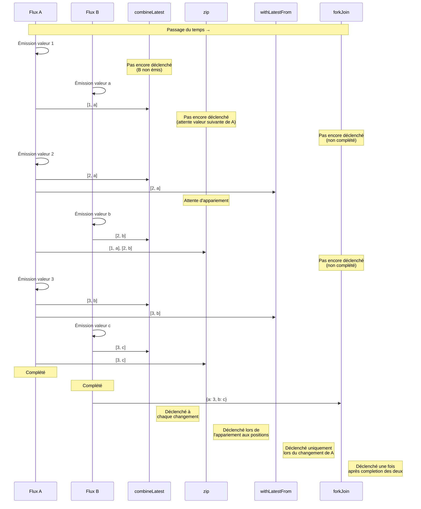
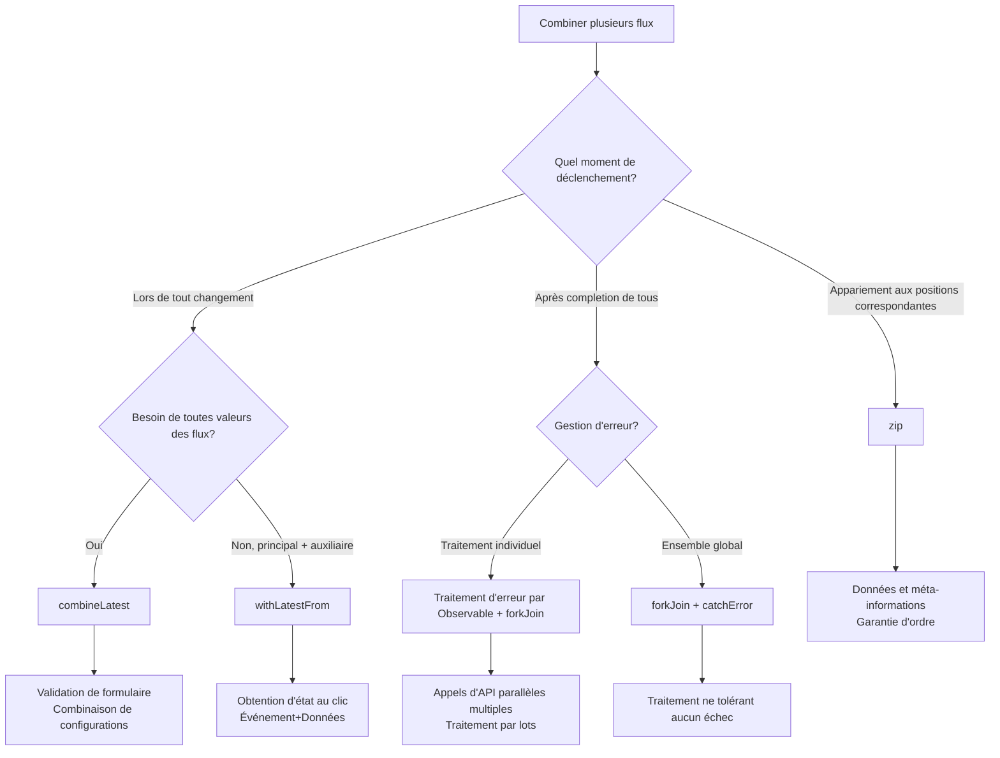

# Combinaison de flux multiples

Dans RxJS, les exigences telles que **"combiner les résultats de 2 API" ou "surveiller tous les champs d'un formulaire"** sont très courantes, mais choisir l'opérateur approprié est difficile. Cette page explique les patterns pratiques de combinaison de flux multiples.

## combineLatest vs zip vs withLatestFrom vs forkJoin

### Comparaison des 4 principaux opérateurs de combinaison

| Opérateur | Moment de déclenchement | Méthode de combinaison de valeurs | Condition de completion | Cas d'usage courants |
|---|---|---|---|---|
| **combineLatest** | Lors de tout changement | Dernières valeurs de chaque flux | Tous les flux complétés | Validation de formulaire, combinaison de configurations |
| **zip** | Lorsque tous les flux émettent une valeur | Appariement des valeurs aux positions correspondantes | L'un des flux complété | Pagination, synchronisation de traitement parallèle |
| **withLatestFrom** | Lors du changement du flux principal | Flux principal + dernière valeur du flux auxiliaire | Le flux principal complété | Événement + état actuel |
| **forkJoin** | Lorsque tous les flux sont complétés | Valeur finale de chaque flux | Tous les flux complétés | Appels d'API parallèles multiples |

### Comparaison avec Marble Diagram

```
A:  --1--2--------3----|
B:  ----a----b------c----|

combineLatest(A, B):
    ----[1,a]-[2,a]-[2,b]-[3,b]-[3,c]|
    (déclenché à chaque changement)

zip(A, B):
    ----[1,a]----[2,b]----[3,c]|
    (appariement aux positions correspondantes)

A.pipe(withLatestFrom(B)):
    ----[1,a]----[2,b]----[3,c]|
    (déclenché uniquement lors du changement de A)

forkJoin({ a: A, b: B }):
    ---------------------------{ a: 3, b: c }|
    (déclenché après completion des deux)
```

### Visualisation du moment de déclenchement

Le diagramme suivant montre quand chaque opérateur de combinaison émet des valeurs.



> [!TIP] Critères de sélection
> - **combineLatest**: Combinaison d'états réactifs (formulaire, configuration)
> - **zip**: Appariement de valeurs correspondantes (pagination, traitement parallèle)
> - **withLatestFrom**: Événement + état actuel (obtention de configuration lors d'un clic)
> - **forkJoin**: Exécution parallèle de plusieurs traitements asynchrones pour obtenir tous les résultats (APIs multiples)

## combineLatest: Combinaison des dernières valeurs

### Caractéristiques
- Déclenché à chaque changement **après que tous les flux aient émis au moins une fois**
- Combine les **dernières valeurs** de chaque flux
- Continue jusqu'à ce que tous les flux soient complétés

### Exemple pratique 1: Validation de formulaire

#### ❌ Mauvais exemple: Souscription individuelle et combinaison manuelle
```typescript
import { BehaviorSubject } from 'rxjs';

const email$ = new BehaviorSubject('');
const password$ = new BehaviorSubject('');
let isValid = false;

email$.subscribe(email => {
  // Besoin de la valeur de password$ mais impossible de l'obtenir
  // Nécessite de gérer avec des variables globales
});

password$.subscribe(password => {
  // Même problème
});
```

#### ✅ Bon exemple: Combinaison automatique avec combineLatest
```typescript
import { BehaviorSubject, combineLatest } from 'rxjs';
import { map } from 'rxjs';

const email$ = new BehaviorSubject('');
const password$ = new BehaviorSubject('');

const isFormValid$ = combineLatest([email$, password$]).pipe(
  map(([email, password]) => {
    const emailValid = email.includes('@') && email.length > 3;
    const passwordValid = password.length >= 8;
    return emailValid && passwordValid;
  })
);

isFormValid$.subscribe(isValid => {
  console.log('Formulaire valide:', isValid);
});

// Changement de valeurs
email$.next('user@example.com');  // Formulaire valide: false (mot de passe trop court)
password$.next('pass1234');       // Formulaire valide: true
```

### Exemple pratique 2: Combinaison de plusieurs valeurs de configuration

```typescript
import { BehaviorSubject, combineLatest } from 'rxjs';
import { map } from 'rxjs';

interface Config {
  theme: 'light' | 'dark';
  language: 'ja' | 'en';
  fontSize: number;
}

const theme$ = new BehaviorSubject<'light' | 'dark'>('light');
const language$ = new BehaviorSubject<'ja' | 'en'>('ja');
const fontSize$ = new BehaviorSubject<number>(14);

const config$ = combineLatest([theme$, language$, fontSize$]).pipe(
  map(([theme, language, fontSize]): Config => ({
    theme,
    language,
    fontSize
  }))
);

config$.subscribe(config => {
  console.log('Mise à jour configuration:', config);
  // Traitement de mise à jour UI
});

theme$.next('dark');      // Mise à jour configuration: { theme: 'dark', language: 'ja', fontSize: 14 }
fontSize$.next(16);       // Mise à jour configuration: { theme: 'dark', language: 'ja', fontSize: 16 }
```

> [!TIP] Quand utiliser combineLatest
> - **Validation de formulaire**: Combiner les dernières valeurs de tous les champs
> - **Surveillance de configuration**: Réagir lorsque plusieurs éléments de configuration changent
> - **Affichage dépendant**: Mettre à jour l'UI selon plusieurs états
> - **Filtrage**: Combiner plusieurs conditions

## zip: Appariement aux positions correspondantes

### Caractéristiques
- Apparie les **valeurs aux positions correspondantes** de chaque flux
- Attend que tous les flux aient émis des valeurs
- Complète lorsque l'un des flux est complété

### Exemple pratique 1: Appariement de données et méta-informations en pagination

#### ❌ Mauvais exemple: Décalage de timing
```typescript
import { interval } from 'rxjs';
import { map, take } from 'rxjs';

// Obtention de données de page (lent)
const pages$ = interval(1000).pipe(
  map(i => `Données page ${i + 1}`),
  take(3)
);

// Obtention de méta-informations (rapide)
const metadata$ = interval(100).pipe(
  map(i => `Méta-info ${i + 1}`),
  take(3)
);

// Souscription individuelle rompt la correspondance
pages$.subscribe(page => console.log('Page:', page));
metadata$.subscribe(meta => console.log('Méta:', meta));

// Sortie:
// Méta: Méta-info 1
// Méta: Méta-info 2
// Méta: Méta-info 3
// Page: Données page 1
// Page: Données page 2
// Page: Données page 3
// (Correspondance désordonnée)
```

#### ✅ Bon exemple: Appariement aux positions correspondantes avec zip
```typescript
import { interval, zip } from 'rxjs';
import { map, take } from 'rxjs';

const pages$ = interval(1000).pipe(
  map(i => `Données page ${i + 1}`),
  take(3)
);

const metadata$ = interval(100).pipe(
  map(i => `Méta-info ${i + 1}`),
  take(3)
);

zip(pages$, metadata$).subscribe(([page, meta]) => {
  console.log(`${page} - ${meta}`);
});

// Sortie (chaque seconde):
// Données page 1 - Méta-info 1
// Données page 2 - Méta-info 2
// Données page 3 - Méta-info 3
```

### Exemple pratique 2: Obtenir les résultats de traitement parallèle dans l'ordre

```typescript
import { of, zip } from 'rxjs';
import { delay, map } from 'rxjs';

// 3 APIs appelées en parallèle mais avec des temps de completion variables
const api1$ = of('Résultat 1').pipe(delay(300));
const api2$ = of('Résultat 2').pipe(delay(100)); // Plus rapide
const api3$ = of('Résultat 3').pipe(delay(200));

zip(api1$, api2$, api3$).pipe(
  map(([r1, r2, r3]) => ({ r1, r2, r3 }))
).subscribe(results => {
  console.log('Tous résultats:', results);
});

// Sortie (après 300ms, une fois tous assemblés):
// Tous résultats: { r1: 'Résultat 1', r2: 'Résultat 2', r3: 'Résultat 3' }
```

> [!TIP] Quand utiliser zip
> - **Ordre important**: Appariement 1er avec 1er, 2ème avec 2ème
> - **Appariement données et méta-informations**: Données de page et numéro de page
> - **Synchronisation de traitement parallèle**: Exécuter plusieurs traitements en parallèle et garantir l'ordre

> [!WARNING] Précautions avec zip
> - Attend le flux le plus lent, donc **le buffer peut s'accumuler**
> - Avec des flux infinis, peut causer des fuites mémoire en étant ralenti par le plus lent

## withLatestFrom: Obtention flux principal + valeur auxiliaire

### Caractéristiques
- Déclenché **uniquement lorsque le flux principal émet une valeur**
- Obtient et combine la **dernière valeur** du flux auxiliaire
- Complète lorsque le flux principal est complété

### Exemple pratique 1: Événement de clic + état actuel

#### ❌ Mauvais exemple: combineLatest déclenche trop souvent
```typescript
import { fromEvent, BehaviorSubject, combineLatest } from 'rxjs';

const button = document.querySelector('button')!;
const clicks$ = fromEvent(button, 'click');
const counter$ = new BehaviorSubject(0);

// ❌ combineLatest déclenche aussi à chaque changement de counter$
combineLatest([clicks$, counter$]).subscribe(([event, count]) => {
  console.log('Compteur au clic:', count);
});

// Déclenche à chaque changement de counter$
setInterval(() => {
  counter$.next(counter$.value + 1); // Déclenchement inutile
}, 1000);
```

#### ✅ Bon exemple: Déclenchement uniquement au clic avec withLatestFrom
```typescript
import { fromEvent, BehaviorSubject } from 'rxjs';
import { withLatestFrom } from 'rxjs';

const button = document.querySelector('button')!;
const clicks$ = fromEvent(button, 'click');
const counter$ = new BehaviorSubject(0);

clicks$.pipe(
  withLatestFrom(counter$)
).subscribe(([event, count]) => {
  console.log('Compteur au clic:', count);
});

// Ne déclenche pas même si counter$ change
setInterval(() => {
  counter$.next(counter$.value + 1); // ✅ Pas de déclenchement
}, 1000);
```

### Exemple pratique 2: Soumission de formulaire + informations utilisateur actuelles

```typescript
import { fromEvent, BehaviorSubject } from 'rxjs';
import { withLatestFrom, map } from 'rxjs';

const submitButton = document.querySelector('#submit')!;
const submit$ = fromEvent(submitButton, 'click');

const currentUser$ = new BehaviorSubject({ id: 1, name: 'Alice' });
const formData$ = new BehaviorSubject({ title: '', content: '' });

submit$.pipe(
  withLatestFrom(currentUser$, formData$),
  map(([event, user, data]) => ({
    ...data,
    authorId: user.id,
    authorName: user.name,
    timestamp: Date.now()
  }))
).subscribe(payload => {
  console.log('Données envoyées:', payload);
  // Envoi vers API...
});
```

> [!TIP] Quand utiliser withLatestFrom
> - **Événement + état**: Obtenir l'état actuel lors d'un clic
> - **Traitement principal + données auxiliaires**: Informations utilisateur lors de la soumission de formulaire
> - **Déclencheur + configuration**: Valeurs de configuration actuelles lors d'un clic de bouton

## forkJoin: Attendre la completion de tous

### Caractéristiques
- Attend **la completion de tous les flux**
- Obtient la **valeur finale** de chaque flux
- Équivalent à `Promise.all()` pour les Promises

### Exemple pratique 1: Appels d'API parallèles multiples

#### ❌ Mauvais exemple: Exécution séquentielle lente
```typescript
import { ajax } from 'rxjs/ajax';

ajax.getJSON('/api/user').subscribe(user => {
  console.log('Utilisateur obtenu:', user);

  ajax.getJSON('/api/posts').subscribe(posts => {
    console.log('Publications obtenues:', posts);

    ajax.getJSON('/api/comments').subscribe(comments => {
      console.log('Commentaires obtenus:', comments);
      // Imbrication profonde
    });
  });
});
```

#### ✅ Bon exemple: Exécution parallèle avec forkJoin
```typescript
import { forkJoin } from 'rxjs';
import { ajax } from 'rxjs/ajax';

forkJoin({
  user: ajax.getJSON('/api/user'),
  posts: ajax.getJSON('/api/posts'),
  comments: ajax.getJSON('/api/comments')
}).subscribe(({ user, posts, comments }) => {
  console.log('Toutes données obtenues:', { user, posts, comments });
  // Les 3 APIs exécutées en parallèle
});
```

### Exemple pratique 2: Téléversement de fichiers multiples

```typescript
import { forkJoin, Observable, of } from 'rxjs';
import { delay } from 'rxjs';

function uploadFile(file: File): Observable<string> {
  return of(`${file.name} téléversement complété`).pipe(
    delay(Math.random() * 2000)
  );
}

const files = [
  new File([''], 'file1.txt'),
  new File([''], 'file2.txt'),
  new File([''], 'file3.txt')
];

forkJoin(files.map(file => uploadFile(file))).subscribe(results => {
  console.log('Téléversement de tous fichiers complété:', results);
  // Affichage après completion de tous les téléversements
});
```

> [!TIP] Quand utiliser forkJoin
> - **Appels d'API parallèles multiples**: Obtention en lot de données initiales
> - **Traitement par lots**: Compléter toutes les tâches
> - **Exécution parallèle de traitements indépendants**: Lorsque chaque traitement est indépendant

> [!WARNING] Précautions avec forkJoin
> - **Ne peut pas être utilisé avec des flux non complétés** (comme interval)
> - Si l'un échoue, tout échoue
> - Impossible d'obtenir les valeurs intermédiaires (valeur finale uniquement)

## Diagramme de flux de sélection



## Patterns pratiques

### Pattern 1: Validation de formulaire

```typescript
import { BehaviorSubject, combineLatest } from 'rxjs';
import { map } from 'rxjs';

interface FormState {
  email: string;
  password: string;
  agreeToTerms: boolean;
}

class RegistrationForm {
  private email$ = new BehaviorSubject('');
  private password$ = new BehaviorSubject('');
  private agreeToTerms$ = new BehaviorSubject(false);

  readonly isValid$ = combineLatest([
    this.email$,
    this.password$,
    this.agreeToTerms$
  ]).pipe(
    map(([email, password, agreed]) => {
      const emailValid = /^[^\s@]+@[^\s@]+\.[^\s@]+$/.test(email);
      const passwordValid = password.length >= 8;
      return emailValid && passwordValid && agreed;
    })
  );

  readonly formState$ = combineLatest([
    this.email$,
    this.password$,
    this.agreeToTerms$
  ]).pipe(
    map(([email, password, agreeToTerms]): FormState => ({
      email,
      password,
      agreeToTerms
    }))
  );

  updateEmail(email: string) {
    this.email$.next(email);
  }

  updatePassword(password: string) {
    this.password$.next(password);
  }

  toggleTerms() {
    this.agreeToTerms$.next(!this.agreeToTerms$.value);
  }
}

// Utilisation
const form = new RegistrationForm();

form.isValid$.subscribe(isValid => {
  console.log('Formulaire valide:', isValid);
});

form.updateEmail('user@example.com');
form.updatePassword('password123');
form.toggleTerms();
```

### Pattern 2: Appels d'API avec dépendances

```typescript
import { forkJoin, of } from 'rxjs';
import { switchMap, map, catchError } from 'rxjs';
import { ajax } from 'rxjs/ajax';

interface User {
  id: number;
  name: string;
}

interface Post {
  id: number;
  userId: number;
  title: string;
}

interface Comment {
  id: number;
  postId: number;
  text: string;
}

// Obtention en parallèle des publications et commentaires de l'utilisateur
function getUserData(userId: number) {
  return ajax.getJSON<User>(`/api/users/${userId}`).pipe(
    switchMap(user =>
      forkJoin({
        user: of(user),
        posts: ajax.getJSON<Post[]>(`/api/users/${userId}/posts`),
        comments: ajax.getJSON<Comment[]>(`/api/users/${userId}/comments`)
      })
    ),
    catchError(error => {
      console.error('Erreur:', error);
      return of({
        user: null,
        posts: [],
        comments: []
      });
    })
  );
}

// Utilisation
getUserData(1).subscribe(({ user, posts, comments }) => {
  console.log('Données utilisateur:', { user, posts, comments });
});
```

### Pattern 3: Filtrage en temps réel

```typescript
import { BehaviorSubject, combineLatest } from 'rxjs';
import { map } from 'rxjs';

interface Product {
  id: number;
  name: string;
  category: string;
  price: number;
}

class ProductFilter {
  private products$ = new BehaviorSubject<Product[]>([
    { id: 1, name: 'PC portable', category: 'electronics', price: 100000 },
    { id: 2, name: 'Souris', category: 'electronics', price: 2000 },
    { id: 3, name: 'Livre', category: 'books', price: 1500 }
  ]);

  private searchQuery$ = new BehaviorSubject('');
  private categoryFilter$ = new BehaviorSubject<string | null>(null);
  private maxPrice$ = new BehaviorSubject<number>(Infinity);

  readonly filteredProducts$ = combineLatest([
    this.products$,
    this.searchQuery$,
    this.categoryFilter$,
    this.maxPrice$
  ]).pipe(
    map(([products, query, category, maxPrice]) => {
      return products.filter(p => {
        const matchesQuery = p.name.toLowerCase().includes(query.toLowerCase());
        const matchesCategory = !category || p.category === category;
        const matchesPrice = p.price <= maxPrice;
        return matchesQuery && matchesCategory && matchesPrice;
      });
    })
  );

  updateSearch(query: string) {
    this.searchQuery$.next(query);
  }

  updateCategory(category: string | null) {
    this.categoryFilter$.next(category);
  }

  updateMaxPrice(price: number) {
    this.maxPrice$.next(price);
  }
}

// Utilisation
const filter = new ProductFilter();

filter.filteredProducts$.subscribe(products => {
  console.log('Produits filtrés:', products);
});

filter.updateSearch('Souris');
filter.updateCategory('electronics');
filter.updateMaxPrice(50000);
```

## Pièges courants

### Piège 1: Premier déclenchement de combineLatest

#### ❌ Mauvais exemple: Flux sans valeur initiale
```typescript
import { Subject, combineLatest } from 'rxjs';

const a$ = new Subject<number>();
const b$ = new Subject<number>();

combineLatest([a$, b$]).subscribe(([a, b]) => {
  console.log('Valeur:', a, b);
});

a$.next(1); // Aucune sortie (b$ n'a pas encore émis de valeur)
b$.next(2); // Première sortie ici: Valeur: 1 2
```

#### ✅ Bon exemple: Définir une valeur initiale avec BehaviorSubject
```typescript
import { BehaviorSubject, combineLatest } from 'rxjs';

const a$ = new BehaviorSubject<number>(0); // Valeur initiale
const b$ = new BehaviorSubject<number>(0);

combineLatest([a$, b$]).subscribe(([a, b]) => {
  console.log('Valeur:', a, b);
});

// Sortie: Valeur: 0 0 (déclenché immédiatement)

a$.next(1); // Sortie: Valeur: 1 0
b$.next(2); // Sortie: Valeur: 1 2
```

### Piège 2: Accumulation de buffer avec zip

#### ❌ Mauvais exemple: Le buffer s'accumule avec un flux lent
```typescript
import { interval, zip } from 'rxjs';
import { take } from 'rxjs';

const fast$ = interval(100).pipe(take(100));  // Rapide
const slow$ = interval(1000).pipe(take(10));  // Lent

zip(fast$, slow$).subscribe(([f, s]) => {
  console.log('Paire:', f, s);
});

// Problème: Les valeurs de fast$ continuent à s'accumuler dans le buffer
// Jusqu'à ce que slow$ émette 10 valeurs, fast$ consomme 100 valeurs de mémoire
```

#### ✅ Bon exemple: Ajuster la vitesse
```typescript
import { interval, combineLatest } from 'rxjs';
import { take } from 'rxjs';

const fast$ = interval(100).pipe(take(100));
const slow$ = interval(1000).pipe(take(10));

// Utiliser combineLatest au lieu de zip
combineLatest([fast$, slow$]).subscribe(([f, s]) => {
  console.log('Dernière combinaison:', f, s);
});

// Ou ajuster fast$ avec throttleTime
```

### Piège 3: Flux infini avec forkJoin

#### ❌ Mauvais exemple: Flux non complété
```typescript
import { interval, forkJoin } from 'rxjs';
import { ajax } from 'rxjs/ajax';

forkJoin({
  timer: interval(1000),  // ❌ Ne complète pas
  user: ajax.getJSON('/api/user')
}).subscribe(result => {
  console.log(result); // Ne sera jamais exécuté
});
```

#### ✅ Bon exemple: Limiter avec take
```typescript
import { interval, forkJoin } from 'rxjs';
import { ajax } from 'rxjs/ajax';
import { take } from 'rxjs';

forkJoin({
  timer: interval(1000).pipe(take(5)), // ✅ Complète après 5 valeurs
  user: ajax.getJSON('/api/user')
}).subscribe(result => {
  console.log('Résultat:', result); // Exécuté après 5 secondes
});
```

## Checklist de compréhension

Vérifiez si vous pouvez répondre aux questions suivantes.

```markdown
## Compréhension de base
- [ ] Expliquer les différences entre combineLatest, zip, withLatestFrom et forkJoin
- [ ] Comprendre le moment de déclenchement de chacun
- [ ] Expliquer quand chaque opérateur complète

## Différenciation
- [ ] Choisir l'opérateur approprié pour la validation de formulaire
- [ ] Choisir l'opérateur approprié pour les appels d'API parallèles multiples
- [ ] Choisir l'opérateur approprié pour la combinaison événement + état

## Précautions
- [ ] Comprendre la condition de premier déclenchement de combineLatest
- [ ] Expliquer le problème d'accumulation de buffer avec zip
- [ ] Comprendre pourquoi forkJoin ne peut pas être utilisé avec des flux infinis

## Pratique
- [ ] Implémenter un pattern de validation de formulaire
- [ ] Implémenter des appels d'API parallèles multiples
- [ ] Implémenter un filtrage en temps réel
```

## Prochaines étapes

Après avoir compris la combinaison de flux multiples, apprenez ensuite **les techniques de débogage**.

→ **[Techniques de débogage](/fr/guide/overcoming-difficulties/debugging-guide)** - Méthodes de débogage de flux complexes

## Pages connexes

- **[Chapitre 3: combineLatest](/fr/guide/creation-functions/combination/combineLatest)** - Détails sur combineLatest
- **[Chapitre 3: zip](/fr/guide/creation-functions/combination/zip)** - Détails sur zip
- **[Chapitre 3: forkJoin](/fr/guide/creation-functions/combination/forkJoin)** - Détails sur forkJoin
- **[withLatestFrom](/fr/guide/operators/combination/withLatestFrom)** - Détails sur withLatestFrom
- **[Chapitre 4: Sélection d'opérateur](/fr/guide/overcoming-difficulties/operator-selection)** - Critères de sélection d'opérateur

## 🎯 Exercices pratiques

### Problème 1: Sélection de l'opérateur approprié

Choisissez l'opérateur optimal pour les scénarios suivants.

1. **Activer le bouton submit lorsque le nom d'utilisateur et l'adresse e-mail sont tous deux saisis**
2. **Envoyer le contenu actuel du panier lors d'un clic de bouton**
3. **Appeler 3 APIs en parallèle et afficher les données une fois toutes complétées**
4. **Appairer le numéro de page et le nombre d'éléments par page**

<details>
<summary>Exemple de réponse</summary>

**1. Activer le bouton submit lorsque le nom d'utilisateur et l'adresse e-mail sont tous deux saisis**
```typescript
import { BehaviorSubject, combineLatest } from 'rxjs';
import { map } from 'rxjs';

const username$ = new BehaviorSubject('');
const email$ = new BehaviorSubject('');

const isSubmitEnabled$ = combineLatest([username$, email$]).pipe(
  map(([username, email]) => username.length > 0 && email.length > 0)
);

isSubmitEnabled$.subscribe(enabled => {
  console.log('Submit activé:', enabled);
});
```

> [!NOTE] Raison
> Comme il faut réévaluer lors de tout changement, **combineLatest** est optimal.

---

**2. Envoyer le contenu actuel du panier lors d'un clic de bouton**
```typescript
import { fromEvent, BehaviorSubject } from 'rxjs';
import { withLatestFrom } from 'rxjs';

const submitButton = document.querySelector('#checkout')!;
const submit$ = fromEvent(submitButton, 'click');
const cart$ = new BehaviorSubject<string[]>([]);

submit$.pipe(
  withLatestFrom(cart$)
).subscribe(([event, cart]) => {
  console.log('Achat:', cart);
  // Envoi vers API...
});
```

> [!NOTE] Raison
> Comme il faut déclencher uniquement lors du clic (flux principal) et obtenir la dernière valeur du panier, **withLatestFrom** est optimal.

---

**3. Appeler 3 APIs en parallèle et afficher les données une fois toutes complétées**
```typescript
import { forkJoin } from 'rxjs';
import { ajax } from 'rxjs/ajax';

forkJoin({
  users: ajax.getJSON('/api/users'),
  products: ajax.getJSON('/api/products'),
  orders: ajax.getJSON('/api/orders')
}).subscribe(({ users, products, orders }) => {
  console.log('Toutes données obtenues:', { users, products, orders });
});
```

> [!NOTE] Raison
> Pour exécuter plusieurs appels d'API en parallèle et attendre la completion de tous, **forkJoin** est optimal.

---

**4. Appairer le numéro de page et le nombre d'éléments par page**
```typescript
import { BehaviorSubject, zip } from 'rxjs';

const pageNumber$ = new BehaviorSubject(1);
const itemsPerPage$ = new BehaviorSubject(10);

zip(pageNumber$, itemsPerPage$).subscribe(([page, items]) => {
  console.log(`Page ${page}: ${items} éléments/page`);
});

pageNumber$.next(2);
itemsPerPage$.next(20);
```

> [!NOTE] Raison
> Pour apparier le numéro de page et le nombre d'éléments aux positions correspondantes, **zip** est optimal.

</details>

### Problème 2: Premier déclenchement de combineLatest

Dans le code suivant, quand la première valeur est-elle émise?

```typescript
import { Subject, BehaviorSubject, combineLatest } from 'rxjs';

const a$ = new Subject<number>();
const b$ = new BehaviorSubject<number>(0);
const c$ = new Subject<number>();

combineLatest([a$, b$, c$]).subscribe(([a, b, c]) => {
  console.log('Valeur:', a, b, c);
});

a$.next(1);
c$.next(3);
```

<details>
<summary>Réponse</summary>

**Réponse: Lorsque `c$.next(3);` est exécuté**

Sortie: `Valeur: 1 0 3`

> [!NOTE] Raison
> `combineLatest` déclenche **après que tous les flux aient émis au moins une fois**.
> - `a$` est un `Subject` sans valeur initiale → obtient une valeur avec `a$.next(1)`
> - `b$` est un `BehaviorSubject` avec valeur initiale `0` → a déjà une valeur
> - `c$` est un `Subject` sans valeur initiale → obtient une valeur avec `c$.next(3)`
>
> C'est seulement lorsque `c$.next(3)` est exécuté que tous les flux ont des valeurs, donc déclenchement à ce moment.

</details>

### Problème 3: Différence entre zip et combineLatest

Prédisez la sortie de zip et combineLatest avec le Marble Diagram suivant.

```
A:  --1--2----3----|
B:  ----a----b-----|

Quelle est la sortie de zip(A, B)?
Quelle est la sortie de combineLatest(A, B)?
```

<details>
<summary>Réponse</summary>

**Sortie de zip(A, B):**
```
----[1,a]----[2,b]-|
```

**Sortie de combineLatest(A, B):**
```
----[1,a]-[2,a]-[2,b]-[3,b]|
```

> [!NOTE] Raison
> - **zip**: Appariement aux positions correspondantes
>   - 1 et a, 2 et b, 3 sans paire donc completion
> - **combineLatest**: Émet la dernière combinaison à chaque changement
>   - a émis → [1,a]
>   - 2 émis → [2,a]
>   - b émis → [2,b]
>   - 3 émis → [3,b]

</details>

### Problème 4: forkJoin avec gestion d'erreur

Écrivez le code pour obtenir les autres données même si certaines échouent lors d'appels d'API multiples.

<details>
<summary>Exemple de réponse</summary>

```typescript
import { forkJoin, of } from 'rxjs';
import { catchError } from 'rxjs';
import { ajax } from 'rxjs/ajax';

forkJoin({
  users: ajax.getJSON('/api/users').pipe(
    catchError(error => {
      console.error('Échec obtention utilisateurs:', error);
      return of([]); // Retourner tableau vide
    })
  ),
  products: ajax.getJSON('/api/products').pipe(
    catchError(error => {
      console.error('Échec obtention produits:', error);
      return of([]);
    })
  ),
  orders: ajax.getJSON('/api/orders').pipe(
    catchError(error => {
      console.error('Échec obtention commandes:', error);
      return of([]);
    })
  )
}).subscribe(({ users, products, orders }) => {
  console.log('Données obtenues:', { users, products, orders });
  // Les APIs échouées deviennent des tableaux vides mais les autres données sont obtenues
});
```

> [!IMPORTANT] Points clés
> - Ajouter `catchError` à chaque Observable
> - Retourner une valeur par défaut (tableau vide, etc.) en cas d'erreur
> - Ainsi, même si certaines échouent, l'ensemble complète
> - Possibilité d'enregistrer les erreurs en log et de notifier l'utilisateur

</details>
