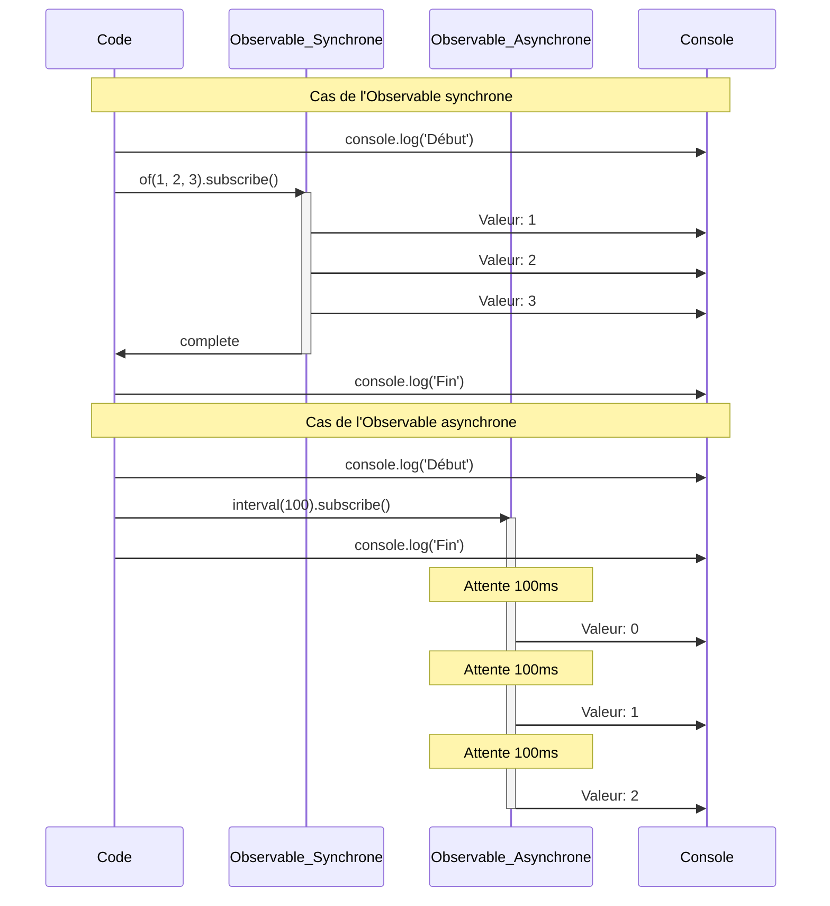
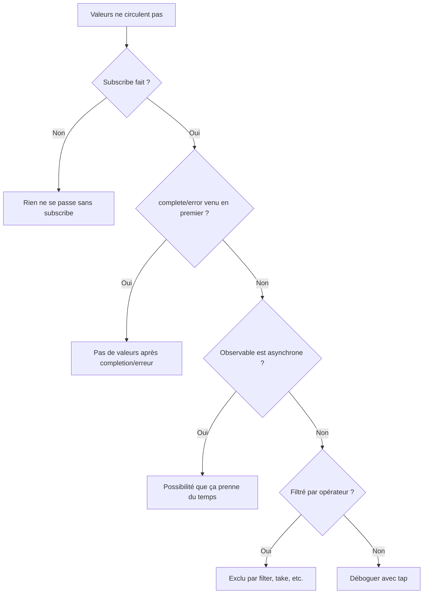

# Compréhension du timing et de l'ordre

Il est très fréquent de rencontrer des problèmes comme **"Pourquoi aucune valeur ne sort ?" "L'ordre est bizarre ?"** avec RxJS. Cette page explique les connaissances de base pour comprendre correctement le timing et l'ordre, ainsi que des techniques pratiques de débogage.

## Quand les valeurs circulent-elles ?

### Problème : Penser que les valeurs sortent immédiatement après subscribe

Une idée fausse dans laquelle tombent de nombreux débutants est "les valeurs sont obtenues immédiatement en faisant subscribe".

#### ❌ Mauvais exemple : S'attendre à obtenir la valeur tout de suite
```typescript
import { of } from 'rxjs';
import { delay } from 'rxjs';

let result: number | undefined;

of(42).pipe(
  delay(100)
).subscribe(value => {
  result = value;
});

console.log(result); // undefined (la valeur n'est pas encore arrivée)
```

#### ✅ Bon exemple : Traiter dans subscribe
```typescript
import { of } from 'rxjs';
import { delay } from 'rxjs';

of(42).pipe(
  delay(100)
).subscribe(value => {
  console.log(value); // 42 est affiché après 100ms
});
```

> [!IMPORTANT] Principe important
> - Un Observable peut être **asynchrone**
> - Le traitement utilisant les valeurs doit être fait **dans subscribe**
> - Ne pas s'attendre à des valeurs en dehors de subscribe

## Compréhension synchrone vs asynchrone

### Observable synchrone vs Observable asynchrone

Dans RxJS, il existe des **Observables qui émettent des valeurs de manière synchrone** et des **Observables qui émettent des valeurs de manière asynchrone**.

#### Exemple d'Observable synchrone

```typescript
import { of } from 'rxjs';

console.log('Début');

of(1, 2, 3).subscribe(value => {
  console.log('Valeur:', value);
});

console.log('Fin');

// Sortie:
// Début
// Valeur: 1
// Valeur: 2
// Valeur: 3
// Fin
```

#### Exemple d'Observable asynchrone

```typescript
import { interval } from 'rxjs';
import { take } from 'rxjs';

console.log('Début');

interval(100).pipe(
  take(3)
).subscribe(value => {
  console.log('Valeur:', value);
});

console.log('Fin');

// Sortie:
// Début
// Fin
// Valeur: 0  (après 100ms)
// Valeur: 1  (après 200ms)
// Valeur: 2  (après 300ms)
```

### Visualisation du flux d'exécution synchrone vs asynchrone

Le diagramme de séquence suivant montre la différence de timing d'exécution entre Observables synchrones et asynchrones.



> [!TIP] Différence de timing
> - **Observable synchrone** : Passe à la ligne suivante après completion du traitement dans subscribe
> - **Observable asynchrone** : subscribe retourne immédiatement, les valeurs arrivent plus tard

### Critères de jugement synchrone/asynchrone

| Observable | Synchrone/Asynchrone | Raison |
|---|---|---|
| `of(1, 2, 3)` | Synchrone | Valeurs déterminées immédiatement |
| `from([1, 2, 3])` | Synchrone | Obtention immédiate depuis tableau |
| `interval(1000)` | Asynchrone | Prend du temps avec timer |
| `fromEvent(button, 'click')` | Asynchrone | Attend action utilisateur |
| `ajax('/api/data')` | Asynchrone | Attend requête HTTP |
| `timer(1000)` | Asynchrone | Déclenche après 1 seconde |
| `of(1).pipe(delay(100))` | Asynchrone | Retardé par delay |

### Problème fréquent : Mélange synchrone et asynchrone

#### ❌ Mauvais exemple : Ordre non garanti
```typescript
import { of } from 'rxjs';
import { delay } from 'rxjs';

console.log('1: Début');

of('Synchrone').subscribe(value => {
  console.log('2:', value);
});

of('Asynchrone').pipe(
  delay(0) // Même avec 0ms, devient asynchrone
).subscribe(value => {
  console.log('3:', value);
});

console.log('4: Fin');

// Sortie:
// 1: Début
// 2: Synchrone
// 4: Fin
// 3: Asynchrone  ← Même avec delay(0), entre dans la file asynchrone
```

#### ✅ Bon exemple : Clarifier l'intention
```typescript
import { of, concat } from 'rxjs';
import { delay } from 'rxjs';

// Si on veut garantir l'ordre, utiliser concat
concat(
  of('Premier'),
  of('Suivant').pipe(delay(100)),
  of('Dernier')
).subscribe(value => {
  console.log(value);
});

// Sortie:
// Premier
// Suivant    (après 100ms)
// Dernier  (après 100ms)
```

## Comment lire les Marble Diagrams

Les Marble Diagrams sont des diagrammes qui visualisent le comportement d'un Observable sur **l'axe temporel**.

### Notation de base

```
Axe temps:  ------a----b----c----|
         ↑     ↑    ↑    ↑    ↑
         Début val.a val.b val.c Completion

Signification symboles:
-  : Écoulement temps (environ 10ms)
a  : Émission valeur (next)
|  : Completion (complete)
#  : Erreur (error)
() : Émission simultanée (a,b)
```

### Exemple pratique 1 : Opérateur map

```
Entrée:  ----1----2----3----|
       map(x => x * 10)
Sortie:  ----10---20---30---|
```

```typescript
import { of } from 'rxjs';
import { map, delay, concatMap } from 'rxjs';

of(1, 2, 3).pipe(
  concatMap(v => of(v).pipe(delay(100))), // Émettre toutes les 100ms
  map(x => x * 10)
).subscribe(value => console.log(value));

// 100ms: 10
// 200ms: 20
// 300ms: 30
```

### Exemple pratique 2 : merge

```
A:     ----a----b----|
B:     --c----d----e----|
       merge(A, B)
Sortie:  --c-a--d-b--e----|
```

```typescript
import { interval, merge } from 'rxjs';
import { map, take } from 'rxjs';

const a$ = interval(200).pipe(
  map(i => `A${i}`),
  take(2)
);

const b$ = interval(150).pipe(
  map(i => `B${i}`),
  take(3)
);

merge(a$, b$).subscribe(value => console.log(value));

// 150ms: B0
// 200ms: A0
// 300ms: B1
// 400ms: A1
// 450ms: B2
```

### Exemple pratique 3 : switchMap (annulation)

```
Extérieur:  ----A------B----C----|
       switchMap(x => intérieur)
Intérieur A: ----1--2|  (annulé par B)
Intérieur B:        ----3--4|  (annulé par C)
Intérieur C:             ----5--6|
Sortie:  ----1------3----5--6|
```

```typescript
import { fromEvent, interval } from 'rxjs';
import { switchMap, map, take } from 'rxjs';

const button = document.querySelector('button')!;

fromEvent(button, 'click').pipe(
  switchMap(() =>
    interval(100).pipe(
      map(i => `Valeur${i}`),
      take(3)
    )
  )
).subscribe(value => console.log(value));

// Clic1 → Valeur0 → Valeur1 → (suivant annulé par Clic2)
// Clic2 → Valeur0 → Valeur1 → Valeur2 → completion
```

## Rôle du Scheduler

Le Scheduler contrôle **quand et comment** un Observable émet des valeurs.

### Types de Scheduler

| Scheduler | Usage | Explication |
|---|---|---|
| **queueScheduler** | Traitement synchrone | Exécution immédiate dans boucle événements actuelle |
| **asapScheduler** | Microtâche | Même timing que Promise.then() |
| **asyncScheduler** | Macrotâche | Même timing que setTimeout() |
| **animationFrameScheduler** | Animation | Même timing que requestAnimationFrame() |

### Exemple pratique : Contrôler le timing avec observeOn

#### ❌ Mauvais exemple : Traitement synchrone bloque l'UI
```typescript
import { range } from 'rxjs';
import { map } from 'rxjs';

console.log('Début');

range(1, 1000000).pipe(
  map(x => x * x)
).subscribe(value => {
  // 1 million de calculs exécutés de manière synchrone → UI gelée
});

console.log('Fin'); // Affiché après fin des calculs
```

#### ✅ Bon exemple : Rendre asynchrone avec asyncScheduler
```typescript
import { range, asyncScheduler } from 'rxjs';
import { map, observeOn } from 'rxjs';

console.log('Début');

range(1, 1000000).pipe(
  map(x => x * x),
  observeOn(asyncScheduler) // Mettre dans file asynchrone
).subscribe(value => {
  // Exécuté de manière asynchrone → UI non bloquée
});

console.log('Fin'); // Affiché immédiatement
```

> [!TIP] Quand utiliser le Scheduler
> - **Calculs lourds** : Rendre asynchrone avec asyncScheduler pour ne pas bloquer l'UI
> - **Animation** : Rendu fluide avec animationFrameScheduler
> - **Tests** : Virtualiser le temps avec TestScheduler

Pour plus de détails, voir **[Chapitre 7 : Utilisation des Schedulers](/fr/guide/schedulers/async-control)**.

## Problèmes fréquents et méthodes de débogage

### Problème 1 : Les valeurs ne circulent pas

#### Liste de vérification



#### Technique de débogage : Utiliser tap

```typescript
import { of } from 'rxjs';
import { map, filter, tap } from 'rxjs';

console.log('Début');

of(1, 2, 3, 4, 5).pipe(
  tap(v => console.log('👁️ Valeur originale:', v)),
  filter(x => x % 2 === 0),
  tap(v => console.log('✅ Passé filter:', v)),
  map(x => x * 10),
  tap(v => console.log('🔄 Après map:', v))
).subscribe(result => {
  console.log('📦 Résultat final:', result);
});

console.log('Fin');

// Sortie:
// Début
// 👁️ Valeur originale: 1
// 👁️ Valeur originale: 2
// ✅ Passé filter: 2
// 🔄 Après map: 20
// 📦 Résultat final: 20
// 👁️ Valeur originale: 3
// 👁️ Valeur originale: 4
// ✅ Passé filter: 4
// 🔄 Après map: 40
// 📦 Résultat final: 40
// 👁️ Valeur originale: 5
// Fin
```

> [!NOTE] Point clé
> `of()` est un Observable synchrone, donc "Fin" est affiché après que tout le traitement dans subscribe soit terminé. En insérant tap à chaque étape, on peut suivre le flux des valeurs.

### Problème 2 : L'ordre est différent de ce qui est attendu

#### ❌ Mauvais exemple : Ordre perturbé avec mergeMap
```typescript
import { of } from 'rxjs';
import { mergeMap, delay } from 'rxjs';

of(1, 2, 3).pipe(
  mergeMap(x =>
    of(x * 10).pipe(
      delay(Math.random() * 100) // Délai aléatoire
    )
  )
).subscribe(value => console.log(value));

// Exemple sortie: 20, 10, 30 (ordre non garanti)
```

#### ✅ Bon exemple : Garantir l'ordre avec concatMap
```typescript
import { of } from 'rxjs';
import { concatMap, delay } from 'rxjs';

of(1, 2, 3).pipe(
  concatMap(x =>
    of(x * 10).pipe(
      delay(Math.random() * 100)
    )
  )
).subscribe(value => console.log(value));

// Sortie: 10, 20, 30 (toujours dans cet ordre)
```

### Problème 3 : Ne se termine pas (flux infini)

#### ❌ Mauvais exemple : Bloqué avec opérateur attendant completion
```typescript
import { interval } from 'rxjs';
import { reduce } from 'rxjs';

interval(1000).pipe(
  reduce((acc, val) => acc + val, 0) // Ne se termine jamais
).subscribe(total => {
  console.log(total); // Cette ligne ne s'exécute pas
});
```

#### ✅ Bon exemple : Découper avec take
```typescript
import { interval } from 'rxjs';
import { reduce, take } from 'rxjs';

interval(1000).pipe(
  take(5),                            // Obtenir seulement 5
  reduce((acc, val) => acc + val, 0) // Total après completion
).subscribe(total => {
  console.log('Total:', total); // "Total: 10" affiché après 5 secondes
});
```

## Outils et techniques de débogage

### 1. Sortie log avec tap

```typescript
import { of } from 'rxjs';
import { map, filter, tap } from 'rxjs';

const debug = <T>(label: string) => tap<T>(value =>
  console.log(`[${label}]`, value)
);

of(1, 2, 3, 4, 5).pipe(
  debug('🔵 Entrée'),
  filter(x => x > 2),
  debug('🟢 Après filter'),
  map(x => x * 10),
  debug('🟡 Après map')
).subscribe();

// [🔵 Entrée] 1
// [🔵 Entrée] 2
// [🔵 Entrée] 3
// [🟢 Après filter] 3
// [🟡 Après map] 30
// [🔵 Entrée] 4
// [🟢 Après filter] 4
// [🟡 Après map] 40
// [🔵 Entrée] 5
// [🟢 Après filter] 5
// [🟡 Après map] 50
```

### 2. RxJS DevTools (extension navigateur)

L'extension Chrome/Edge "RxJS DevTools" permet :

- Surveiller tous les Observables en temps réel
- Visualisation avec Marble Diagrams
- Traçage subscribe/unsubscribe

#### Méthode d'installation
1. Rechercher "RxJS DevTools" dans Chrome Web Store
2. Ajouter l'extension
3. Ouvrir l'onglet "RxJS" dans DevTools

### 3. Opérateur de débogage personnalisé

```typescript
import { interval, map, take, tap, timestamp } from "rxjs";
import { MonoTypeOperatorFunction } from 'rxjs';


function debugWithTime<T>(label: string): MonoTypeOperatorFunction<T> {
  return source => source.pipe(
    timestamp(),
    tap(({ value, timestamp }) => {
      console.log(`[${label}] ${new Date(timestamp).toISOString()}:`, value);
    }),
    map(({ value }) => value)
  );
}

// Utilisation
interval(500).pipe(
  take(3),
  debugWithTime('⏰ Timer'),
  map(x => x * 10),
  debugWithTime('🔄 Après transformation')
).subscribe();

// [⏰ Timer] 2025-10-19T10:20:59.467Z: 0
// [🔄 Après transformation] 2025-10-19T10:20:59.467Z: 0
// [⏰ Timer] 2025-10-19T10:20:59.967Z: 1
// [🔄 Après transformation] 2025-10-19T10:20:59.967Z: 10
// [⏰ Timer] 2025-10-19T10:21:00.467Z: 2
// [🔄 Après transformation] 2025-10-19T10:21:00.468Z: 20
```

### 4. Marble Testing (vérification dans tests)

```typescript
import { TestScheduler } from 'rxjs/testing';
import { map } from 'rxjs';

describe('Test de timing', () => {
  let scheduler: TestScheduler;

  beforeEach(() => {
    scheduler = new TestScheduler((actual, expected) => {
      expect(actual).toEqual(expected);
    });
  });

  it('map transforme les valeurs', () => {
    scheduler.run(({ cold, expectObservable }) => {
      const input$  = cold('--a--b--c--|', { a: 1, b: 2, c: 3 });
      const expected =     '--x--y--z--|';
      const result$ = input$.pipe(map(v => v * 10));

      expectObservable(result$).toBe(expected, { x: 10, y: 20, z: 30 });
    });
  });
});
```

Pour plus de détails, voir **[Chapitre 9 : Marble Testing](/fr/guide/testing/marble-testing)**.

## Liste de vérification de la compréhension

Vérifiez si vous pouvez répondre aux questions suivantes.

```markdown
## Compréhension de base
- [ ] Pouvoir expliquer différence entre Observable synchrone et asynchrone
- [ ] Pouvoir lire notation de base Marble Diagram (-, a, |, #)
- [ ] Comprendre que les valeurs ne circulent pas sans subscribe

## Contrôle du timing
- [ ] Pouvoir expliquer différences delay, debounceTime, throttleTime
- [ ] Comprendre rôle du Scheduler
- [ ] Pouvoir expliquer différences observeOn et subscribeOn

## Débogage
- [ ] Pouvoir déboguer flux de valeurs avec tap
- [ ] Pouvoir identifier cause de non-circulation des valeurs
- [ ] Connaître solution quand ordre différent de l'attendu

## Pratique
- [ ] Pouvoir découper Observable infini avec take
- [ ] Pouvoir implémenter différence d'ordre mergeMap et concatMap
- [ ] Pouvoir contrôler timing en cas d'erreur avec catchError
```

## Prochaines étapes

Après avoir compris timing et ordre, apprenez ensuite **gestion état et partage**.

→ **[Difficulté de la gestion d'état](/fr/guide/overcoming-difficulties/state-and-sharing)** - Utilisation de Subject, share/shareReplay

## Pages connexes

- **[Chapitre 7 : Utilisation des Schedulers](/fr/guide/schedulers/async-control)** - Détails sur Scheduler
- **[Chapitre 9 : Marble Testing](/fr/guide/testing/marble-testing)** - Tester timing avec TestScheduler
- **[Chapitre 8 : Techniques de débogage RxJS](/fr/guide/debugging/)** - Vue d'ensemble du débogage
- **[Les hésitations dans la sélection d'opérateurs](/fr/guide/overcoming-difficulties/operator-selection)** - Comment choisir opérateurs appropriés

## 🎯 Exercices pratiques

### Problème 1 : Distinguer synchrone et asynchrone

Les Observables suivants sont synchrones ou asynchrones ?

```typescript
// A
of(1, 2, 3)

// B
from([1, 2, 3])

// C
of(1, 2, 3).pipe(delay(0))

// D
Promise.resolve(42)

// E
interval(1000).pipe(take(3))
```

<details>
<summary>Réponse</summary>

- **A: Synchrone** - `of` émet valeurs immédiatement
- **B: Synchrone** - `from` déploie tableau immédiatement
- **C: Asynchrone** - Même avec `delay(0)`, entre dans file asynchrone
- **D: Asynchrone** - Promise toujours asynchrone
- **E: Asynchrone** - `interval` basé sur timer

> [!NOTE] Point clé
> `delay(0)` et `Promise` sont traités comme asynchrones même si le délai est de 0 milliseconde.

</details>

### Problème 2 : Lecture Marble Diagram

Prédisez la sortie du Marble Diagram suivant.

```typescript
import { of, zip } from 'rxjs';
import { delay } from 'rxjs';

const a$ = of(1, 2, 3);
const b$ = of('A', 'B', 'C').pipe(delay(100));

zip(a$, b$).subscribe(console.log);
```

```
Marble Diagram:
a$:  (123)|
b$:  -----(ABC)|
     zip(a$, b$)
Sortie: ?
```

<details>
<summary>Réponse</summary>

```typescript
// Sortie en une fois après 100ms:
[1, 'A']
[2, 'B']
[3, 'C']
```

> [!NOTE] Raison
> `zip` attend que les valeurs des deux flux soient disponibles, donc pas de sortie tant que delay(100) de `b$` n'est pas levé. `a$` émet les valeurs de manière synchrone, mais attend `b$` avant de créer les paires.

</details>

### Problème 3 : Garantie d'ordre

Dans le code suivant, quel opérateur utiliser pour garantir l'ordre de sortie ?

```typescript
import { of } from 'rxjs';
import { mergeMap, delay } from 'rxjs';

of('A', 'B', 'C').pipe(
  mergeMap(letter =>
    of(`${letter} terminé`).pipe(
      delay(Math.random() * 100)
    )
  )
).subscribe(console.log);

// Sortie actuelle: Ordre aléatoire (ex: B terminé, A terminé, C terminé)
// Sortie attendue: A terminé, B terminé, C terminé
```

<details>
<summary>Réponse</summary>

**Code corrigé :**
```typescript
import { of } from 'rxjs';
import { concatMap, delay } from 'rxjs';

of('A', 'B', 'C').pipe(
  concatMap(letter =>  // mergeMap → concatMap
    of(`${letter} terminé`).pipe(
      delay(Math.random() * 100)
    )
  )
).subscribe(console.log);

// Sortie: A terminé, B terminé, C terminé (toujours dans cet ordre)
```

> [!NOTE] Raison
> - `mergeMap` : Exécution parallèle, donc ordre de completion non garanti
> - `concatMap` : Exécution séquentielle, donc sortie dans même ordre que l'entrée

</details>

### Problème 4 : Gestion des flux infinis

Identifiez le problème dans le code suivant et corrigez-le.

```typescript
import { interval } from 'rxjs';
import { map, toArray } from 'rxjs';

interval(1000).pipe(
  map(x => x * 2),
  toArray()
).subscribe(arr => {
  console.log('Tableau:', arr); // Cette ligne s'exécute-t-elle ?
});
```

<details>
<summary>Réponse</summary>

**Problème :**
- `interval` émet des valeurs indéfiniment, donc ne se termine pas
- `toArray()` attend le signal de completion, donc les valeurs ne sortent jamais

**Code corrigé :**
```typescript
import { interval } from 'rxjs';
import { map, take, toArray } from 'rxjs';

interval(1000).pipe(
  take(5),          // Obtenir seulement 5 et terminer
  map(x => x * 2),
  toArray()
).subscribe(arr => {
  console.log('Tableau:', arr); // [0, 2, 4, 6, 8]
});
```

> [!IMPORTANT] Point clé
> Quand on utilise des "opérateurs attendant completion" comme `reduce`, `toArray`, `last` sur des flux infinis, il faut absolument découper avec `take`, `first`, `takeUntil`, etc.

</details>
