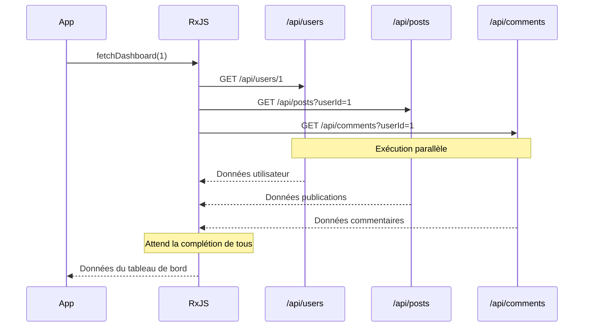
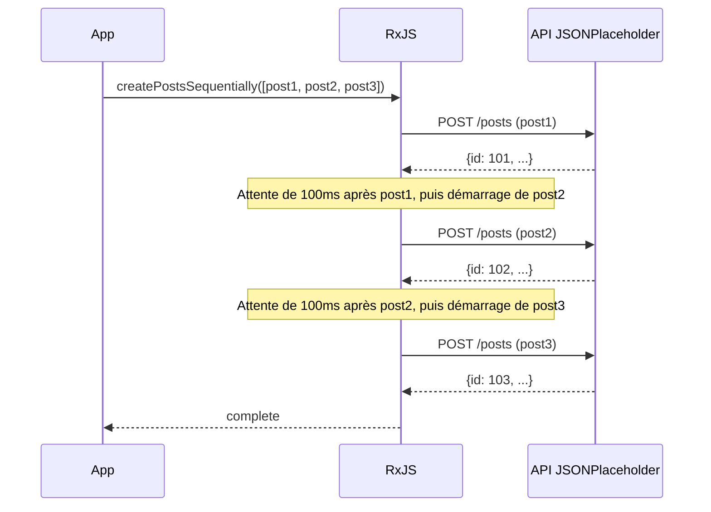
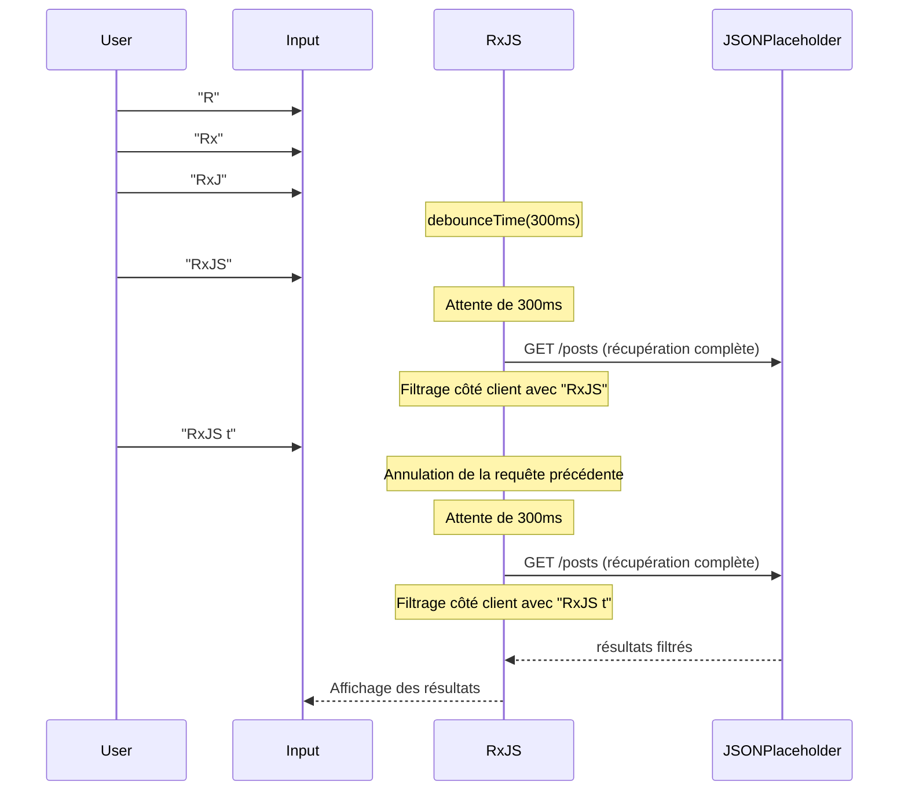

# Modèles d'appels API

Dans le développement web, les appels API sont l'une des tâches les plus fréquemment implémentées. Avec RxJS, vous pouvez implémenter des appels API asynchrones complexes de manière déclarative et robuste.

Cet article explique des modèles d'implémentation concrets pour divers scénarios d'appels API rencontrés en pratique, incluant la gestion des erreurs et l'annulation des requêtes.

## Ce que vous apprendrez dans cet article

- Implémentation de requêtes GET/POST basiques
- Appels API parallèles (forkJoin)
- Requêtes séquentielles nécessitant une exécution ordonnée (concatMap)
- Chaînage de requêtes avec dépendances (switchMap)
- Réessai et gestion des erreurs
- Gestion des timeouts
- Annulation de requêtes

> [!TIP] Connaissances préalables
> Cet article suppose une connaissance du [Chapitre 4: Opérateurs](../operators/index.md) et du [Chapitre 6: Gestion des erreurs](../error-handling/strategies.md).

## Appels API basiques

### Problème : Implémentation d'une simple requête GET

Commençons par le cas le plus basique : implémenter une seule requête GET.

### Exemple d'implémentation

```typescript
import { from, Observable, map, catchError, timeout } from 'rxjs';

// Type User de l'API JSONPlaceholder
// https://jsonplaceholder.typicode.com/users
interface User {
  id: number;
  name: string;
  username: string;
  email: string;
  address: {
    street: string;
    suite: string;
    city: string;
    zipcode: string;
    geo: {
      lat: string;
      lng: string;
    };
  };
  phone: string;
  website: string;
  company: {
    name: string;
    catchPhrase: string;
    bs: string;
  };
}

// Récupération de la liste des utilisateurs
function fetchUsers(): Observable<User[]> {
  return from(
    fetch('https://jsonplaceholder.typicode.com/users')
      .then(response => {
        if (!response.ok) {
          throw new Error(`HTTP error! status: ${response.status}`);
        }
        return response.json();
      })
  ).pipe(
    timeout(5000), // Timeout après 5 secondes
    catchError(err => {
      console.error('Erreur de récupération utilisateur:', err);
      throw err;
    })
  );
}

// Exemple d'utilisation
fetchUsers().subscribe({
  next: users => {
    console.log('Liste des utilisateurs:', users);
    console.log('Premier utilisateur:', users[0].name); // Exemple: "Leanne Graham"
  },
  error: err => console.error('Erreur:', err)
});
```

> [!NOTE] from() vs ajax()
> Dans cet exemple, nous encapsulons `fetch` standard avec `from()`, mais vous pouvez également utiliser `ajax()` officiel de RxJS. `ajax()` est plus riche en fonctionnalités et prend en charge l'annulation de requêtes et le suivi de progression.

### Requête POST

Modèle pour créer de nouvelles données.

```typescript
import { from, Observable, catchError } from 'rxjs';

// Type Post de l'API JSONPlaceholder
// https://jsonplaceholder.typicode.com/posts
interface Post {
  id: number;
  userId: number;
  title: string;
  body: string;
}

interface CreatePostRequest {
  userId: number;
  title: string;
  body: string;
}

function createPost(postData: CreatePostRequest): Observable<Post> {
  return from(
    fetch('https://jsonplaceholder.typicode.com/posts', {
      method: 'POST',
      headers: {
        'Content-Type': 'application/json',
      },
      body: JSON.stringify(postData)
    }).then(response => {
      if (!response.ok) {
        throw new Error(`HTTP error! status: ${response.status}`);
      }
      return response.json();
    })
  ).pipe(
    catchError(err => {
      console.error('Erreur de création de publication:', err);
      throw err;
    })
  );
}

// Exemple d'utilisation
createPost({
  userId: 1,
  title: 'Apprentissage de RxJS',
  body: 'J\'apprends les modèles d\'appels API avec RxJS.'
}).subscribe({
  next: post => {
    console.log('Publication créée:', post);
    console.log('ID de la publication:', post.id); // JSONPlaceholder assigne automatiquement un ID (ex: 101)
  },
  error: err => console.error('Erreur:', err)
});
```

> [!TIP] Conseils pratiques
> - **Sécurité des types** : Définissez clairement les types de réponse
> - **Gestion des erreurs** : Vérifiez correctement les codes d'état HTTP
> - **Timeout** : Prévenez les attentes prolongées

## Requêtes parallèles (forkJoin)

### Problème : Appeler plusieurs API simultanément

Il arrive que vous deviez appeler plusieurs API indépendantes en parallèle et attendre que toutes les réponses soient disponibles avant de continuer.

### Solution : Utiliser forkJoin

`forkJoin` attend que tous les Observables se terminent et retourne tous les résultats dans un tableau (équivalent à Promise.all).

```typescript
import { forkJoin, from, Observable, map } from 'rxjs';

// Type Comment de l'API JSONPlaceholder
// https://jsonplaceholder.typicode.com/comments
interface Comment {
  postId: number;
  id: number;
  name: string;
  email: string;
  body: string;
}
interface Post {
  id: number;
  userId: number;
  title: string;
  body: string;
}
interface User {
  id: number;
  name: string;
  username: string;
  email: string;
  address: {
    street: string;
    suite: string;
    city: string;
    zipcode: string;
    geo: {
      lat: string;
      lng: string;
    };
  };
  phone: string;
  website: string;
  company: {
    name: string;
    catchPhrase: string;
    bs: string;
  };
}
interface Dashboard {
  user: User;
  posts: Post[];
  comments: Comment[];
}

function fetchUserById(id: number): Observable<User> {
  return from(
    fetch(`https://jsonplaceholder.typicode.com/users/${id}`).then(r => r.json())
  );
}

function fetchPostsByUserId(userId: number): Observable<Post[]> {
  return from(
    fetch(`https://jsonplaceholder.typicode.com/posts?userId=${userId}`).then(r => r.json())
  );
}

function fetchCommentsByPostId(postId: number): Observable<Comment[]> {
  return from(
    fetch(`https://jsonplaceholder.typicode.com/comments?postId=${postId}`).then(r => r.json())
  );
}

// Récupération parallèle des données du tableau de bord
function fetchDashboard(userId: number): Observable<Dashboard> {
  return forkJoin({
    user: fetchUserById(userId),
    posts: fetchPostsByUserId(userId),
    comments: fetchCommentsByPostId(1) // Récupération des commentaires pour la publication ID=1
  }).pipe(
    map(({ user, posts, comments }) => ({
      user,
      posts,
      comments
    }))
  );
}

// Exemple d'utilisation
fetchDashboard(1).subscribe({
  next: dashboard => {
    console.log('Utilisateur:', dashboard.user.name); // Exemple: "Leanne Graham"
    console.log('Nombre de publications:', dashboard.posts.length); // Exemple: 10 articles
    console.log('Nombre de commentaires:', dashboard.comments.length); // Exemple: 5 commentaires
  },
  error: err => console.error('Erreur de récupération du tableau de bord:', err)
});
```

#### Flux d'exécution



> [!IMPORTANT] Caractéristiques de forkJoin
> - Attend que tous les Observables se terminent
> - **Si l'un d'eux échoue, l'ensemble échoue**
> - Tous les Observables doivent émettre au moins une valeur

### Renforcer la gestion des erreurs

Dans les requêtes parallèles, il peut être souhaitable de récupérer les autres résultats même si l'un échoue.

```typescript
import { forkJoin, of, catchError } from 'rxjs';

function fetchDashboardWithFallback(userId: number): Observable<Dashboard> {
  return forkJoin({
    user: fetchUserById(userId).pipe(
      catchError(err => {
        console.error('Erreur de récupération utilisateur:', err);
        return of(null); // Retourne null en cas d'erreur
      })
    ),
    posts: fetchPostsByUserId(userId).pipe(
      catchError(err => {
        console.error('Erreur de récupération des publications:', err);
        return of([]); // Retourne un tableau vide en cas d'erreur
      })
    ),
    comments: fetchCommentsByUserId(userId).pipe(
      catchError(err => {
        console.error('Erreur de récupération des commentaires:', err);
        return of([]); // Retourne un tableau vide en cas d'erreur
      })
    )
  }).pipe(
    map(({ user, posts, comments }) => ({
      user: user || { id: userId, name: 'Unknown', email: '' },
      posts,
      comments
    }))
  );
}
```

> [!TIP] Gestion partielle des erreurs
> En appliquant `catchError` à chaque Observable, vous pouvez continuer le traitement global même si l'un échoue.

## Requêtes séquentielles (concatMap)

### Problème : Exécuter des API dans l'ordre

Lorsque vous devez exécuter la requête suivante après la complétion de la précédente (par exemple, télécharger plusieurs fichiers dans l'ordre).

### Solution : Utiliser concatMap

`concatMap` exécute l'Observable suivant après la complétion du précédent.

```typescript
import { from, Observable, concatMap, tap, delay, catchError } from 'rxjs';

// Type Post de l'API JSONPlaceholder
// https://jsonplaceholder.typicode.com/posts
interface Post {
  id: number;
  userId: number;
  title: string;
  body: string;
}

interface CreatePostRequest {
  userId: number;
  title: string;
  body: string;
}

function createPost(postData: CreatePostRequest): Observable<Post> {
  return from(
    fetch('https://jsonplaceholder.typicode.com/posts', {
      method: 'POST',
      headers: {
        'Content-Type': 'application/json',
      },
      body: JSON.stringify(postData)
    }).then(response => {
      if (!response.ok) {
        throw new Error(`HTTP error! status: ${response.status}`);
      }
      return response.json();
    })
  ).pipe(
    catchError(err => {
      console.error('Erreur de création de publication:', err);
      throw err;
    })
  );
}

// Créer plusieurs publications dans l'ordre (en tenant compte des limites de débit API)
function createPostsSequentially(posts: CreatePostRequest[]): Observable<Post> {
  return from(posts).pipe(
    concatMap((postData, index) =>
      createPost(postData).pipe(
        tap(result => console.log(`Publication ${index + 1} créée:`, result.title)),
        delay(100) // Attente de 100ms en tenant compte des limites de débit API
      )
    )
  );
}

// Exemple d'utilisation
const postsToCreate: CreatePostRequest[] = [
  {
    userId: 1,
    title: 'Première publication',
    body: 'Ceci est la première publication.'
  },
  {
    userId: 1,
    title: 'Deuxième publication',
    body: 'Ceci est la deuxième publication.'
  },
  {
    userId: 1,
    title: 'Troisième publication',
    body: 'Ceci est la troisième publication.'
  }
];

const results: Post[] = [];

createPostsSequentially(postsToCreate).subscribe({
  next: post => {
    results.push(post);
    console.log(`Progression: ${results.length}/${postsToCreate.length}`);
  },
  complete: () => {
    console.log('Toutes les publications créées:', results.length, 'articles');
  },
  error: err => console.error('Erreur de création de publication:', err)
});
```

#### Flux d'exécution



> [!NOTE] concatMap vs mergeMap
> - **concatMap** : Exécution ordonnée (suivant après complétion du précédent)
> - **mergeMap** : Exécution parallèle (plusieurs peuvent s'exécuter simultanément)
>
> Utilisez `concatMap` lorsque l'ordre est important, `mergeMap` lorsque l'ordre n'est pas nécessaire et la vitesse est prioritaire.

## Requêtes avec dépendances (switchMap)

### Problème : Appeler l'API suivante avec la réponse de la précédente

L'un des modèles les plus courants, où vous appelez l'API suivante en utilisant le résultat de la première réponse API.

### Solution : Utiliser switchMap

`switchMap` reçoit la valeur de l'Observable précédent et la transforme en un nouvel Observable.

```typescript
import { from, Observable, switchMap, map } from 'rxjs';

interface UserProfile {
  user: User;
  posts: Post[];
}
interface Post {
  id: number;
  userId: number;
  title: string;
  body: string;
}
interface User {
  id: number;
  name: string;
  username: string;
  email: string;
  address: {
    street: string;
    suite: string;
    city: string;
    zipcode: string;
    geo: {
      lat: string;
      lng: string;
    };
  };
  phone: string;
  website: string;
  company: {
    name: string;
    catchPhrase: string;
    bs: string;
  };
}

function fetchUserById(id: number): Observable<User> {
  return from(
    fetch(`https://jsonplaceholder.typicode.com/users/${id}`).then(r => r.json())
  );
}

function fetchPostsByUserId(userId: number): Observable<Post[]> {
  return from(
    fetch(`https://jsonplaceholder.typicode.com/posts?userId=${userId}`).then(r => r.json())
  );
}

// Récupération du profil utilisateur et de ses publications
function fetchUserProfile(userId: number): Observable<UserProfile> {
  return fetchUserById(userId).pipe(
    switchMap(user =>
      // Après récupération des informations utilisateur, récupération de ses publications
      fetchPostsByUserId(user.id).pipe(
        map(posts => ({
          user,
          posts
        }))
      )
    )
  );
}

// Exemple d'utilisation
fetchUserProfile(1).subscribe({
  next: profile => {
    console.log('Utilisateur:', profile.user.name);
    console.log('Publications:', profile.posts);
  },
  error: err => console.error('Erreur:', err)
});
```

### Exemple pratique : Implémentation d'une fonction de recherche

Modèle très courant en pratique où l'API est appelée en fonction de la saisie de recherche de l'utilisateur.

```typescript
import { from, fromEvent, Observable, of, map, debounceTime, distinctUntilChanged, switchMap, catchError } from 'rxjs';

// Utilisation de Post de JSONPlaceholder comme résultat de recherche
interface SearchResult {
  id: number;
  userId: number;
  title: string;
  body: string;
}

function searchAPI(query: string): Observable<SearchResult[]> {
  return from(
    fetch('https://jsonplaceholder.typicode.com/posts')
      .then(response => {
        if (!response.ok) {
          throw new Error(`HTTP error! status: ${response.status}`);
        }
        return response.json();
      })
  ).pipe(
    // Filtrage côté client par titre
    map((posts: SearchResult[]) =>
      posts.filter(post =>
        post.title.toLowerCase().includes(query.toLowerCase())
      )
    )
  );
}

// Approche traditionnelle (commentée pour référence)
// const searchInput = document.querySelector<HTMLInputElement>('#search');

// Auto-contenu : crée dynamiquement le champ de recherche et le conteneur de résultats
const searchInput = document.createElement('input');
searchInput.id = 'search';
searchInput.type = 'text';
searchInput.placeholder = 'Entrez un mot-clé de recherche (2 caractères minimum)';
searchInput.style.padding = '10px';
searchInput.style.margin = '10px';
searchInput.style.width = '400px';
searchInput.style.fontSize = '16px';
searchInput.style.border = '2px solid #ccc';
searchInput.style.borderRadius = '4px';
searchInput.style.display = 'block';
document.body.appendChild(searchInput);

const resultsContainer = document.createElement('div');
resultsContainer.id = 'results';
resultsContainer.style.padding = '10px';
resultsContainer.style.margin = '10px';
resultsContainer.style.minHeight = '100px';
resultsContainer.style.border = '1px solid #ddd';
resultsContainer.style.borderRadius = '4px';
resultsContainer.style.backgroundColor = '#f9f9f9';
document.body.appendChild(resultsContainer);

const search$ = fromEvent(searchInput, 'input').pipe(
  map(event => (event.target as HTMLInputElement).value),
  debounceTime(300),           // Attendre 300ms après la saisie
  distinctUntilChanged(),      // Ignorer si la valeur est identique à la précédente
  switchMap(query => {
    if (query.length < 2) {
      return of([]); // Tableau vide si moins de 2 caractères
    }
    return searchAPI(query).pipe(
      catchError(err => {
        console.error('Erreur de recherche:', err);
        return of([]); // Tableau vide en cas d'erreur
      })
    );
  })
);

search$.subscribe(results => {
  console.log('Résultats de recherche:', results);
  // Afficher les résultats dans l'UI
  displayResults(results, resultsContainer);
});

function displayResults(results: SearchResult[], container: HTMLElement): void {
  // Afficher les résultats dans le DOM
  container.innerHTML = results
    .map(r => `<div style="padding: 8px; margin: 4px; border-bottom: 1px solid #eee;">${r.title}</div>`)
    .join('');

  if (results.length === 0) {
    container.innerHTML = '<div style="padding: 8px; color: #999;">Aucun résultat de recherche</div>';
  }
}
```

> [!TIP] Filtrage côté client
> Comme l'API JSONPlaceholder n'a pas de point de terminaison de recherche, nous récupérons toutes les publications et filtrons côté client. En pratique, utilisez ce modèle lorsqu'il n'y a pas de fonctionnalité de recherche backend ou lorsque la quantité de données est faible.
>
> **Exemples de recherche** :
> - Recherche "sunt" → Plusieurs publications trouvées
> - Recherche "qui est esse" → Titres contenant "qui est esse" trouvés
> - Recherche "zzz" → Aucun résultat de recherche (aucune correspondance)

#### Flux d'exécution



> [!IMPORTANT] Caractéristique importante de switchMap
> **Lorsqu'une nouvelle valeur arrive, l'Observable précédent est automatiquement annulé.**
> Ainsi, même si la réponse d'une ancienne requête API arrive plus tard, elle est ignorée (évite les Race Conditions).

### switchMap vs mergeMap vs concatMap

Utilisation des opérateurs de mapping d'ordre supérieur.

| Opérateur | Comportement | Cas d'utilisation |
|------------|------|-----------|
| `switchMap` | Annule le précédent lorsqu'une nouvelle valeur arrive | **Recherche, autocomplétion** (seul le dernier résultat est nécessaire) |
| `mergeMap` | Exécute tout en parallèle | **Traitement parallèle** (ordre non important, tous les résultats nécessaires) |
| `concatMap` | Exécution ordonnée (suivant après complétion du précédent) | **Traitement où l'ordre est important** (téléchargement de fichiers, etc.) |
| `exhaustMap` | Ignore les nouvelles valeurs jusqu'à complétion du précédent | **Prévention de double soumission** (contre-mesure pour les clics multiples) |

```typescript
// switchMap : Affiche uniquement le dernier résultat de recherche
searchInput$.pipe(
  switchMap(query => searchAPI(query))
);

// mergeMap : Télécharge tous les fichiers en parallèle
from(files).pipe(
  mergeMap(file => uploadFile(file))
);

// concatMap : Télécharge les fichiers dans l'ordre
from(files).pipe(
  concatMap(file => uploadFile(file))
);

// exhaustMap : Prévient la double soumission du formulaire
submitButton$.pipe(
  exhaustMap(() => submitForm())
);
```

## Réessai et gestion des erreurs

### Problème : Gérer les erreurs réseau temporaires

Lorsque des erreurs réseau ou des timeouts se produisent, vous pouvez vouloir réessayer automatiquement.

### Solution : Utiliser retry et retryWhen

```typescript
import { from, Observable, timer } from 'rxjs';
import { retry, retryWhen, mergeMap, catchError, of, timeout } from 'rxjs';

// Type User de l'API JSONPlaceholder
// https://jsonplaceholder.typicode.com/users
interface User {
  id: number;
  name: string;
  username: string;
  email: string;
  address: {
    street: string;
    suite: string;
    city: string;
    zipcode: string;
    geo: {
      lat: string;
      lng: string;
    };
  };
  phone: string;
  website: string;
  company: {
    name: string;
    catchPhrase: string;
    bs: string;
  };
}

function fetchUsers(): Observable<User[]> {
  return from(
    fetch('https://jsonplaceholder.typicode.com/users')
      .then(response => {
        if (!response.ok) {
          throw new Error(`HTTP error! status: ${response.status}`);
        }
        return response.json();
      })
  ).pipe(
    timeout(5000), // Timeout après 5 secondes
    catchError(err => {
      console.error('Erreur de récupération utilisateur:', err);
      throw err;
    })
  );
}

// Réessai simple (jusqu'à 3 fois immédiatement)
function fetchWithSimpleRetry(): Observable<User[]> {
  return fetchUsers().pipe(
    retry(3), // Réessayer jusqu'à 3 fois en cas d'erreur
    catchError(err => {
      console.error('Erreur même après réessai:', err);
      return of([]); // Retourne un tableau vide en cas d'erreur finale
    })
  );
}

// Réessai avec backoff exponentiel
function fetchWithExponentialBackoff(): Observable<User[]> {
  return fetchUsers().pipe(
    retryWhen(errors =>
      errors.pipe(
        mergeMap((error, index) => {
          const retryAttempt = index + 1;

          // Réessayer jusqu'à 3 fois maximum
          if (retryAttempt > 3) {
            throw error;
          }

          // Backoff exponentiel : 1 seconde, 2 secondes, 4 secondes
          const delayMs = Math.pow(2, index) * 1000;
          console.log(`Réessai ${retryAttempt}/3 (après ${delayMs}ms)`);

          return timer(delayMs);
        })
      )
    ),
    catchError(err => {
      console.error('Erreur même après réessai:', err);
      return of([]);
    })
  );
}

// Exemple d'utilisation
fetchWithExponentialBackoff().subscribe({
  next: users => console.log('Récupération utilisateur réussie:', users),
  error: err => console.error('Erreur finale:', err)
});
```

**Exemple d'exécution du backoff exponentiel :**

```
1ère tentative : exécution immédiate
↓ Erreur
2ème tentative : exécution après attente de 1 seconde
↓ Erreur
3ème tentative : exécution après attente de 2 secondes
↓ Erreur
4ème tentative : exécution après attente de 4 secondes
↓ Succès ou erreur finale
```

> [!TIP] Choix de la stratégie de réessai
> - **Réessai immédiat** : `retry(3)` - Simple, efficace pour les coupures réseau
> - **Intervalle fixe** : `retryWhen` + `delay(1000)` - Considère la charge serveur
> - **Backoff exponentiel** : `retryWhen` + `timer` - Bonne pratique AWS, etc.

### Réessayer uniquement certaines erreurs

Toutes les erreurs ne doivent pas être réessayées (ex : 401 Unauthorized n'a pas besoin de réessai).

```typescript
import { throwError } from 'rxjs';

interface HttpError {
  status: number;
  message: string;
}

function shouldRetry(error: HttpError): boolean {
  // Codes d'état à réessayer
  const retryableStatuses = [408, 429, 500, 502, 503, 504];
  return retryableStatuses.includes(error.status);
}

function fetchWithConditionalRetry(): Observable<User[]> {
  return fetchUsers().pipe(
    retryWhen(errors =>
      errors.pipe(
        mergeMap((error: HttpError, index) => {
          const retryAttempt = index + 1;

          // Erreur non réessayable
          if (!shouldRetry(error)) {
            console.error('Erreur non réessayable:', error);
            return throwError(() => error);
          }

          // Maximum 3 fois
          if (retryAttempt > 3) {
            return throwError(() => error);
          }

          const delayMs = Math.pow(2, index) * 1000;
          console.log(`Réessai ${retryAttempt}/3 (status: ${error.status})`);

          return timer(delayMs);
        })
      )
    ),
    catchError(err => {
      console.error('Erreur finale:', err);
      return of([]);
    })
  );
}
```

> [!WARNING] Points d'attention sur le réessai
> - **Requêtes POST** : Risque de création en double si non idempotent
> - **Erreurs d'authentification** : Ne pas réessayer 401/403, inviter à se reconnecter
> - **Erreurs de validation** : 400 ne nécessite pas de réessai, inviter l'utilisateur à corriger

## Gestion des timeouts

### Problème : Gérer les réponses API lentes

Lorsque le réseau est lent ou que le serveur ne répond pas, définir un timeout après un certain temps.

### Solution : Utiliser l'opérateur timeout

```typescript
import { timeout, catchError, of, from, Observable, throwError } from 'rxjs';

// Type User de l'API JSONPlaceholder
// https://jsonplaceholder.typicode.com/users
interface User {
  id: number;
  name: string;
  username: string;
  email: string;
  address: {
    street: string;
    suite: string;
    city: string;
    zipcode: string;
    geo: {
      lat: string;
      lng: string;
    };
  };
  phone: string;
  website: string;
  company: {
    name: string;
    catchPhrase: string;
    bs: string;
  };
}

function fetchUsers(): Observable<User[]> {
  return from(
    fetch('https://jsonplaceholder.typicode.com/users')
      .then(response => {
        if (!response.ok) {
          throw new Error(`HTTP error! status: ${response.status}`);
        }
        return response.json();
      })
  ).pipe(
    timeout(5000), // Timeout après 5 secondes
    catchError(err => {
      console.error('Erreur de récupération utilisateur:', err);
      throw err;
    })
  );
}

// Timeout de 5 secondes
function fetchWithTimeout(): Observable<User[]> {
  return fetchUsers().pipe(
    timeout(5000), // Erreur si pas de réponse dans les 5 secondes
    catchError(err => {
      if (err.name === 'TimeoutError') {
        console.error('La requête a expiré');
        // Traitement de secours en cas de timeout
        return of([]); // Retourne un tableau vide
      }
      throw err; // Re-lancer les autres erreurs
    })
  );
}

// Message de timeout personnalisé
function fetchWithCustomTimeout(): Observable<User[]> {
  return fetchUsers().pipe(
    timeout({
      each: 5000,
      with: () => throwError(() => new Error('Erreur de timeout personnalisée'))
    }),
    catchError(err => {
      console.error('Erreur:', err.message);
      return of([]);
    })
  );
}
```

### Combinaison de réessai et timeout

En pratique, vous combinez timeout et réessai.

```typescript
function fetchWithTimeoutAndRetry(): Observable<User[]> {
  return fetchUsers().pipe(
    timeout(5000),           // Timeout de 5 secondes pour chaque tentative
    retry(3),                // Réessayer 3 fois en cas de timeout
    catchError(err => {
      console.error('Erreur même après timeout et réessai:', err);
      return of([]);
    })
  );
}
```

> [!TIP] Configuration des valeurs de timeout
> - **API normale** : 5-10 secondes
> - **API rapide** : 2-3 secondes
> - **Téléchargement de fichiers** : 30-60 secondes
> - **Traitement en arrière-plan** : 60 secondes ou plus
>
> Configurez en tenant compte de l'équilibre entre expérience utilisateur et charge serveur.

## Annulation de requêtes

### Problème : Annuler les requêtes API devenues inutiles

Annuler les requêtes API en cours lors de la navigation entre pages ou de la destruction de composants.

### Solution : Utiliser takeUntil

```typescript
import { Subject, takeUntil, from, timeout, catchError } from 'rxjs';

// Type User de l'API JSONPlaceholder
// https://jsonplaceholder.typicode.com/users
interface User {
  id: number;
  name: string;
  username: string;
  email: string;
  address: {
    street: string;
    suite: string;
    city: string;
    zipcode: string;
    geo: {
      lat: string;
      lng: string;
    };
  };
  phone: string;
  website: string;
  company: {
    name: string;
    catchPhrase: string;
    bs: string;
  };
}

class UserListManager {
  private destroy$ = new Subject<void>();
  private users: User[] = [];


  fetchUsers(): Observable<User[]> {
    return from(
      fetch('https://jsonplaceholder.typicode.com/users')
        .then(response => {
          if (!response.ok) {
            throw new Error(`HTTP error! status: ${response.status}`);
          }
          return response.json();
        })
    ).pipe(
      timeout(5000), // Timeout après 5 secondes
      catchError(err => {
        console.error('Erreur de récupération utilisateur:', err);
        throw err;
      })
    );
  }

  init(): void {
    // Récupérer la liste des utilisateurs à l'initialisation
    this.fetchUsers().pipe(
      takeUntil(this.destroy$) // Annulation automatique à la destruction de l'instance
    ).subscribe({
      next: (users: User[]) => {
        this.users = users;
        console.log('Récupération utilisateur terminée:', users);
      },
      error: (err: any) => console.error('Erreur:', err)
    });
  }

  destroy(): void {
    // Déclenché à la destruction de l'instance
    this.destroy$.next();
    this.destroy$.complete();
  }
}

// Exemple d'utilisation
const userList = new UserListManager();
userList.init();

// Lorsque le nettoyage est nécessaire
// userList.destroy();
```

### Annulation par action utilisateur

Exemple d'implémentation d'un bouton d'annulation explicite.

```typescript
// Approche traditionnelle (commentée pour référence)
// const cancelButton = document.querySelector<HTMLButtonElement>('#cancel');
// const loadButton = document.querySelector<HTMLButtonElement>('#load');

// Auto-contenu : crée dynamiquement les boutons de chargement et d'annulation
const loadButton = document.createElement('button');
loadButton.id = 'load';
loadButton.textContent = 'Charger les utilisateurs';
loadButton.style.padding = '10px 20px';
loadButton.style.margin = '10px';
loadButton.style.fontSize = '16px';
loadButton.style.fontWeight = 'bold';
loadButton.style.color = '#fff';
loadButton.style.backgroundColor = '#4CAF50';
loadButton.style.border = 'none';
loadButton.style.borderRadius = '4px';
loadButton.style.cursor = 'pointer';
document.body.appendChild(loadButton);

const cancelButton = document.createElement('button');
cancelButton.id = 'cancel';
cancelButton.textContent = 'Annuler';
cancelButton.style.padding = '10px 20px';
cancelButton.style.margin = '10px';
cancelButton.style.fontSize = '16px';
cancelButton.style.fontWeight = 'bold';
cancelButton.style.color = '#fff';
cancelButton.style.backgroundColor = '#f44336';
cancelButton.style.border = 'none';
cancelButton.style.borderRadius = '4px';
cancelButton.style.cursor = 'pointer';
document.body.appendChild(cancelButton);

const statusDisplay = document.createElement('div');
statusDisplay.id = 'status';
statusDisplay.style.padding = '10px';
statusDisplay.style.margin = '10px';
statusDisplay.style.fontSize = '14px';
statusDisplay.style.minHeight = '20px';
document.body.appendChild(statusDisplay);

const cancel$ = fromEvent(cancelButton, 'click');

fromEvent(loadButton, 'click').pipe(
  switchMap(() => {
    statusDisplay.textContent = 'Chargement en cours...';
    statusDisplay.style.color = '#FF9800';
    return fetchUsers().pipe(
      takeUntil(cancel$) // Interruption au clic sur le bouton d'annulation
    );
  })
).subscribe({
  next: users => {
    console.log('Récupération utilisateur terminée:', users);
    statusDisplay.textContent = `Récupération utilisateur terminée: ${users.length} articles`;
    statusDisplay.style.color = '#4CAF50';
  },
  error: err => {
    if (err.name === 'AbortError') {
      console.log('Requête annulée');
      statusDisplay.textContent = 'Requête annulée';
      statusDisplay.style.color = '#999';
    } else {
      console.error('Erreur:', err);
      statusDisplay.textContent = `Erreur: ${err.message}`;
      statusDisplay.style.color = '#f44336';
    }
  }
});
```

> [!IMPORTANT] Bonnes pratiques d'annulation
> - **Toujours implémenter l'annulation** - Prévient les fuites de mémoire et le gaspillage réseau
> - **Utiliser takeUntil** - Plus déclaratif et moins oubliable que unsubscribe()
> - **Lors de la destruction de composants** - Déclencher destroy$ pour annuler tous les abonnements

## Exemple de classe de service pratique

Exemple de classe de service complète utilisable en pratique, combinant tous les modèles précédents.

```typescript
import { Observable, Subject, throwError, timer, catchError, retryWhen, mergeMap, timeout, shareReplay, takeUntil, from } from 'rxjs';

// Type User de l'API JSONPlaceholder
// https://jsonplaceholder.typicode.com/users
interface User {
  id: number;
  name: string;
  username: string;
  email: string;
  address: {
    street: string;
    suite: string;
    city: string;
    zipcode: string;
    geo: {
      lat: string;
      lng: string;
    };
  };
  phone: string;
  website: string;
  company: {
    name: string;
    catchPhrase: string;
    bs: string;
  };
}
interface Post {
  id: number;
  userId: number;
  title: string;
  body: string;
}

export class ApiService {
  private destroy$ = new Subject<void>();
  private cache = new Map<string, Observable<any>>();

  /**
   * Requête GET basique
   */
  get<T>(url: string, options?: RequestOptions): Observable<T> {
    return this.request<T>('GET', url, options);
  }

  /**
   * Requête POST
   */
  post<T>(url: string, body: any, options?: RequestOptions): Observable<T> {
    return this.request<T>('POST', url, { ...options, body });
  }

  /**
   * Requête GET avec cache
   */
  getWithCache<T>(url: string, options?: RequestOptions): Observable<T> {
    const cacheKey = url;

    if (this.cache.has(cacheKey)) {
      return this.cache.get(cacheKey) as Observable<T>;
    }

    const request$ = this.get<T>(url, options).pipe(
      shareReplay(1) // Mise en cache du résultat
    );

    this.cache.set(cacheKey, request$);
    return request$;
  }

  /**
   * Effacement du cache
   */
  clearCache(url?: string): void {
    if (url) {
      this.cache.delete(url);
    } else {
      this.cache.clear();
    }
  }

  /**
   * Traitement de requête basique
   */
  private request<T>(
    method: string,
    url: string,
    options?: RequestOptions
  ): Observable<T> {
    const config: RequestInit = {
      method,
      headers: {
        'Content-Type': 'application/json',
        ...options?.headers
      },
      body: options?.body ? JSON.stringify(options.body) : undefined
    };

    return from(
      fetch(url, config).then(response => {
        if (!response.ok) {
          throw {
            status: response.status,
            message: response.statusText
          };
        }
        return response.json();
      })
    ).pipe(
      timeout(options?.timeout || 10000), // Par défaut 10 secondes
      this.retryStrategy(options?.retry),
      // Les API publiques comme JSONPlaceholder retournent directement les données,
      // donc pas besoin de déballer response.data
      catchError(err => this.handleError(err)),
      takeUntil(this.destroy$) // Annulation automatique à la destruction du service
    );
  }

  /**
   * Stratégie de réessai
   */
  private retryStrategy(retryConfig?: RetryConfig) {
    return retryWhen<any>(errors =>
      errors.pipe(
        mergeMap((error, index) => {
          const retryAttempt = index + 1;
          const maxRetries = retryConfig?.maxRetries || 3;

          // Vérifier si réessayable
          if (!this.shouldRetry(error) || retryAttempt > maxRetries) {
            return throwError(() => error);
          }

          // Backoff exponentiel
          const delayMs = retryConfig?.useExponentialBackoff
            ? Math.pow(2, index) * 1000
            : (retryConfig?.delayMs || 1000);

          console.log(`Réessai ${retryAttempt}/${maxRetries} (après ${delayMs}ms)`);
          return timer(delayMs);
        })
      )
    );
  }

  /**
   * Déterminer si l'erreur doit être réessayée
   */
  private shouldRetry(error: any): boolean {
    if (error.name === 'TimeoutError') {
      return true; // Réessayer en cas de timeout
    }

    // Codes d'état HTTP réessayables
    const retryableStatuses = [408, 429, 500, 502, 503, 504];
    return retryableStatuses.includes(error.status);
  }

  /**
   * Gestion des erreurs
   */
  private handleError(error: any): Observable<never> {
    let errorMessage = 'Une erreur API s\'est produite';

    if (error.name === 'TimeoutError') {
      errorMessage = 'La requête a expiré';
    } else if (error.status) {
      errorMessage = `HTTP ${error.status}: ${error.message}`;
    }

    console.error(errorMessage, error);
    return throwError(() => new Error(errorMessage));
  }

  /**
   * Traitement lors de la destruction du service
   */
  destroy(): void {
    this.destroy$.next();
    this.destroy$.complete();
    this.cache.clear();
  }
}

// Définitions de types
interface RequestOptions {
  headers?: Record<string, string>;
  body?: any;
  timeout?: number;
  retry?: RetryConfig;
}

interface RetryConfig {
  maxRetries?: number;
  delayMs?: number;
  useExponentialBackoff?: boolean;
}

// Note : Le type ApiResponse est utilisé lorsque les réponses API sont encapsulées
// Les API publiques comme JSONPlaceholder retournent directement les données, donc ce type n'est pas nécessaire
// Utilisez-le lorsque votre API personnalisée utilise le format { data: T, status: number }
interface ApiResponse<T> {
  data: T;
  status: number;
}

// Exemple d'utilisation
const apiService = new ApiService();

// GET simple (utilisation de l'API JSONPlaceholder)
apiService.get<User[]>('https://jsonplaceholder.typicode.com/users').subscribe({
  next: users => console.log('Utilisateurs:', users),
  error: err => console.error('Erreur:', err)
});

// POST avec configuration personnalisée (utilisation de l'API JSONPlaceholder)
apiService.post<Post>(
  'https://jsonplaceholder.typicode.com/posts',
  { userId: 1, title: 'Publication de test', body: 'Ceci est une publication de test.' },
  {
    timeout: 5000,
    retry: {
      maxRetries: 3,
      useExponentialBackoff: true
    }
  }
).subscribe({
  next: post => console.log('Publication créée:', post),
  error: err => console.error('Erreur:', err)
});

// GET avec cache
apiService.getWithCache<User[]>('https://jsonplaceholder.typicode.com/users').subscribe({
  next: users => console.log('Utilisateurs (cache):', users)
});

// Lors de la destruction du service
// apiService.destroy();
```

> [!TIP] Conception pratique de service
> - **Configurable** : Configuration flexible du timeout, nombre de réessais, etc.
> - **Fonction de cache** : Prévient les requêtes en double
> - **Gestion des erreurs** : Traitement unifié des erreurs
> - **Nettoyage automatique** : Libération assurée des ressources avec destroy()

## Code de test

Exemple de test des modèles d'appels API.

```typescript
import { TestScheduler } from 'rxjs/testing';
import { of, throwError } from 'rxjs';

describe('ApiService', () => {
  let testScheduler: TestScheduler;
  let apiService: ApiService;

  beforeEach(() => {
    testScheduler = new TestScheduler((actual, expected) => {
      expect(actual).toEqual(expected);
    });
    apiService = new ApiService();
  });

  afterEach(() => {
    apiService.destroy();
  });

  it('should fetch users successfully', () => {
    testScheduler.run(({ expectObservable, cold }) => {
      const mockResponse = { data: [{ id: 1, name: 'Test User', email: 'test@example.com' }] };

      // Mock fetch
      spyOn(window, 'fetch').and.returnValue(
        Promise.resolve({
          ok: true,
          json: () => Promise.resolve(mockResponse)
        } as Response)
      );

      const result$ = apiService.get<User[]>('/api/users');

      expectObservable(result$).toBe('(a|)', {
        a: mockResponse.data
      });
    });
  });

  it('should retry on timeout', () => {
    testScheduler.run(({ expectObservable, cold, flush }) => {
      let callCount = 0;

      spyOn(window, 'fetch').and.callFake(() => {
        callCount++;
        if (callCount < 3) {
          // Timeout pour les 2 premières fois
          return new Promise(() => {}); // Promise qui ne se résout pas
        }
        // Succès la 3ème fois
        return Promise.resolve({
          ok: true,
          json: () => Promise.resolve({ data: [] })
        } as Response);
      });

      const result$ = apiService.get<User[]>('/api/users', {
        timeout: 100,
        retry: { maxRetries: 3, delayMs: 100 }
      });

      // Confirmer que le réessai est exécuté
      flush();
      expect(callCount).toBeGreaterThan(1);
    });
  });
});
```

## Résumé

En maîtrisant les modèles d'appels API avec RxJS, vous pouvez construire des applications robustes et maintenables.

> [!IMPORTANT] Points importants
> - **forkJoin** : Exécuter plusieurs API en parallèle, attendre la complétion de toutes
> - **concatMap** : Exécuter les API dans l'ordre (suivante après complétion de la précédente)
> - **switchMap** : Optimal pour les requêtes avec dépendances, fonction de recherche
> - **retry/retryWhen** : Réessai automatique en cas d'erreur, backoff exponentiel recommandé
> - **timeout** : Toujours définir un timeout
> - **takeUntil** : Annulation automatique à la destruction du composant

> [!TIP] Bonnes pratiques
> - **Sécurité des types** : Définir des types pour toutes les réponses API
> - **Gestion des erreurs** : Implémenter `catchError` pour toutes les requêtes
> - **Annulation** : Nettoyage assuré avec `takeUntil`
> - **Stratégie de réessai** : Réessayer de manière appropriée selon le code d'état
> - **Cache** : Prévenir les requêtes en double avec `shareReplay`

## Prochaines étapes

Après avoir maîtrisé les modèles d'appels API, passez aux modèles suivants.

- [Traitement de formulaires](./form-handling.md) - Validation en temps réel, sauvegarde automatique
- [Traitement d'événements UI](./ui-events.md) - Intégration des événements UI et des appels API
- [Traitement de données en temps réel](./real-time-data.md) - WebSocket, SSE
- [Stratégies de cache](./caching-strategies.md) - Mise en cache des réponses API
- Gestion avancée des erreurs (en préparation) - Stratégies de traitement d'erreurs plus avancées

## Sections connexes

- [Chapitre 4: Opérateurs](../operators/index.md) - Détails sur switchMap, mergeMap, concatMap
- [Chapitre 6: Gestion des erreurs](../error-handling/strategies.md) - Bases de catchError, retry
- [Chapitre 2: Cold/Hot Observable](../observables/cold-and-hot-observables.md) - Compréhension de shareReplay

## Ressources de référence

- [RxJS officiel: ajax](https://rxjs.dev/api/ajax/ajax) - Détails sur ajax()
- [MDN: Fetch API](https://developer.mozilla.org/fr/docs/Web/API/Fetch_API) - Utilisation de fetch()
- [Learn RxJS: Higher-order Observables](https://www.learnrxjs.io/learn-rxjs/operators) - Comparaison de switchMap, etc.
