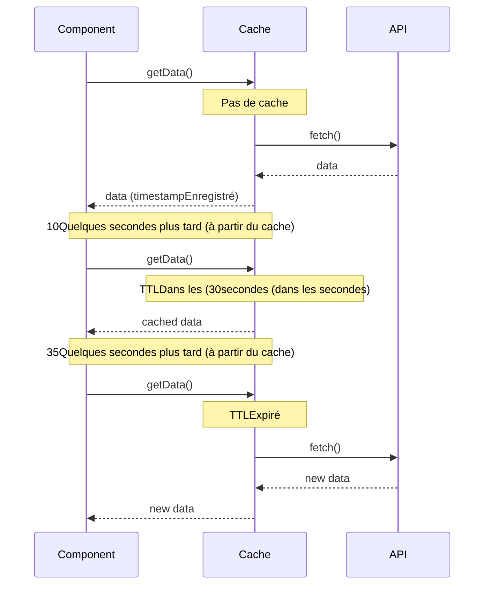

# Modèle de stratégie de trésorerie.

La mise en cache est l'une des techniques les plus importantes en matière d'optimisation des performances, et avec RxJS, vous pouvez mettre en œuvre des stratégies de mise en cache déclaratives et flexibles.

Cet article décrit des modèles spécifiques de stratégies de cache nécessaires dans la pratique, de la mise en cache de base avec shareReplay à la mise en cache avec TTL, l'invalidation du cache et la coopération du stockage local.

## Ce que vous apprendrez dans cet article.

- Mise en cache de base avec shareReplay
- Mise en œuvre de la mise en cache avec TTL (time-to-live)
- Rafraîchissement manuel et invalidation du cache
- Interfaçage avec le stockage local
- Prise en charge hors ligne et repli du cache
- Surveillance et débogage de la mise en cache

APPEL_12___.

> Cet article fait partie du [Chapitre 2 : Observables froids/chauds](../observables/cold-and-hot-observables.md) et [Chapitre 4 : Opérateurs](../operators/index.md). Une compréhension de `shareReplay` et de `share` est particulièrement importante.

## Cache de base (shareReplay)

### Problème : éviter d'appeler la même API plusieurs fois.

Si plusieurs composants ont besoin des mêmes données de l'API, nous voulons éviter les demandes en double.

### Solution : cache avec shareReplay.

```typescript
import { Observable, of, shareReplay, catchError, tap } from 'rxjs';
interface User {
  id: number;
  name: string;
  email: string;
}

class UserService {
  private users$: Observable<User[]> | null = null;

  getUsers(): Observable<User[]> {
    // Retour de la cache si disponible
    if (this.users$) {
      console.log('Retour du cache');
      return this.users$;
    }

    // Créer une nouvelle demande et la mettre en cache
    console.log('Exécuter la nouvelle demande');
    this.users$ = this.fetchUsersFromAPI().pipe(
      tap(() => console.log('APIAppel terminé')),
      shareReplay({ bufferSize: 1, refCount: true }), // Si la dernière valeur1Mettre en cache les deux dernières valeurs (libéré lorsque tous les abonnements sont désabonnés àrefCountet libérée lorsque tous les abonnements sont désabonnés)
      catchError((err: unknown) => {
        // Effacer le cache en cas d'erreur
        this.users$ = null;
        throw err;
      })
    );

    return this.users$;
  }

  clearCache(): void {
    this.users$ = null;
    console.log('Effacer le cache');
  }

  private fetchUsersFromAPI(): Observable<User[]> {
    return of([
      { id: 1, name: 'Taro Yamada', email: 'yamada@example.com' },
      { id: 2, name: 'Hanako Sato', email: 'sato@example.com' }
    ]);
  }
}

// Exemple d'utilisation
const userService = new UserService();

// 1Le deuxième appel (APIExécution)
userService.getUsers().subscribe(users => {
  console.log('Composant1:', users);
});

// 2Deuxième appel (à partir du cache)
userService.getUsers().subscribe(users => {
  console.log('Composant2:', users);
});

// Sortie:
// Exécuter la nouvelle demande
// APIAppel terminé
// Composant1: [...]
// Retour du cache
// Composant2: [...]
```

> - **FUITE DE MÉMOIRE** : maintient le cache en vie même lorsque les abonnements tombent à 0
> - **Partage de type de référence** : les objets sont partagés par référence, de sorte que les changements affectent tous les abonnés
> - **Gestion des erreurs** : il est recommandé de vider le cache en cas d'erreur

### Options de configuration de shareReplay


```typescript
import { shareReplay } from 'rxjs';
// Utilisation de base (format recommandé): (Libérer le cache en désabonnant tout le monde)
source$.pipe(
  shareReplay({ bufferSize: 1, refCount: true }) // Si la dernière valeur1Cache one
);

// Paramètres détaillés
source$.pipe(
  shareReplay({
    bufferSize: 1,        // Nombre de valeurs à mettre en cache
    refCount: true,       // Lorsque le nombre d'abonnés0(facultatif) Rejeter le cache lorsque le nombre d'abonnés est atteint
    windowTime: 5000      // 5Rejeter le cache après (facultatif) secondes
  })
);
```

```typescript
import { Observable, of, shareReplay, catchError, tap } from 'rxjs';
interface User {
  id: number;
  name: string;
  email: string;
}

class UserService {
  private users$: Observable<User[]> | null = null;

  getUsers(): Observable<User[]> {
    // Retour de la cache si disponible
    if (this.users$) {
      console.log('Retour du cache');
      return this.users$;
    }

    // Créer une nouvelle demande et la mettre en cache
    console.log('Exécuter la nouvelle demande');
    this.users$ = this.fetchUsersFromAPI().pipe(
      tap(() => console.log('APIAppel terminé')),
      shareReplay({ bufferSize: 1, refCount: true }), // Si la dernière valeur1Mettre en cache les deux dernières valeurs (libéré lorsque tous les abonnements sont désabonnés àrefCountet libérée lorsque tous les abonnements sont désabonnés)
      catchError((err: unknown) => {
        // Effacer le cache en cas d'erreur
        this.users$ = null;
        throw err;
      })
    );

    return this.users$;
  }

  clearCache(): void {
    this.users$ = null;
    console.log('Effacer le cache');
  }

  private fetchUsersFromAPI(): Observable<User[]> {
    return of([
      { id: 1, name: 'Taro Yamada', email: 'yamada@example.com' },
      { id: 2, name: 'Hanako Sato', email: 'sato@example.com' }
    ]);
  }
}

// Exemple d'utilisation
const userService = new UserService();

// 1Le deuxième appel (APIExécution)
userService.getUsers().subscribe(users => {
  console.log('Composant1:', users);
});

// 2Deuxième appel (à partir du cache)
userService.getUsers().subscribe(users => {
  console.log('Composant2:', users);
});

// Sortie:
// Exécuter la nouvelle demande
// APIAppel terminé
// Composant1: [...]
// Retour du cache
// Composant2: [...]
```

> - `refCount : true` - cache jeté lorsque le nombre d'abonnés atteint 0 (efficacité mémoire ◎)
> - `refCount : false` (default) - cache persistant (bonnes performances).
>
> - `refCount : true` - choisissez en fonction de votre application.

## Cache avec TTL (time to live)

### Problème : Je veux invalider automatiquement les anciens caches.

Je veux détruire automatiquement les caches après une certaine période de temps et récupérer de nouvelles données.

### Solution : combiner les horodatages et les filtres


```typescript
import { Observable, of, shareReplay, map, switchMap } from 'rxjs';
interface CachedData<T> {
  data: T;
  timestamp: number;
}

class TTLCacheService<T> {
  private cache$: Observable<CachedData<T>> | null = null;
  private ttl: number; // Time To Live (millisecondes)

  constructor(ttl: number = 60000) {
    this.ttl = ttl; // Par défaut: 60secondes (facultatif)
  }

  getData(fetchFn: () => Observable<T>): Observable<T> {
    if (this.cache$) {
      // Vérifier si le cache est valide
      return this.cache$.pipe(
        switchMap(cached => {
          const age = Date.now() - cached.timestamp;
          if (age < this.ttl) {
            console.log(`Retour du cache (Jusqu'à la date d'expiration ${(this.ttl - age) / 1000}secondes (facultatif))`);
            return of(cached.data);
          } else {
            console.log('Cache expiré - Nouvelle acquisition');
            this.cache$ = null;
            return this.getData(fetchFn);
          }
        })
      );
    }

    // Acquérir et mettre en cache de nouvelles données
    console.log('Exécuter la nouvelle demande');
    this.cache$ = fetchFn().pipe(
      map(data => ({
        data,
        timestamp: Date.now()
      })),
      shareReplay({ bufferSize: 1, refCount: true })
    );

    return this.cache$.pipe(map(cached => cached.data));
  }

  clearCache(): void {
    this.cache$ = null;
    console.log('Effacer le cache');
  }

  getCacheAge(): number | null {
    // Obtenir le temps écoulé du cache (pour le débogage)
    if (!this.cache$) return null;

    let timestamp = 0;
    this.cache$.subscribe(cached => {
      timestamp = cached.timestamp;
    });

    return Date.now() - timestamp;
  }
}

// Exemple d'utilisation
interface Product {
  id: number;
  name: string;
  price: number;
}

const productCache = new TTLCacheService<Product[]>(30000); // 30secondes (facultatif)TTL

function fetchProducts(): Observable<Product[]> {
  console.log('APIRappel');
  return of([
    { id: 1, name: 'ÉlémentA', price: 1000 },
    { id: 2, name: 'ÉlémentB', price: 2000 }
  ]);
}

// 1Temps (nouvelle acquisition)
productCache.getData(() => fetchProducts()).subscribe(products => {
  console.log('Acquisition:', products);
});

// 10Quelques secondes plus tard (à partir du cache)
setTimeout(() => {
  productCache.getData(() => fetchProducts()).subscribe(products => {
    console.log('10Quelques secondes plus tard (à partir du cache):', products);
    console.log('Temps écoulé dans le cache:', productCache.getCacheAge(), 'ms');
  });
}, 10000);

// 35Après 2,5 secondes (réacquisition après expiration)
setTimeout(() => {
  productCache.getData(() => fetchProducts()).subscribe(products => {
    console.log('35Après quelques secondes (expiration):', products);
  });
}, 35000);
```

**Comportement du cache TTL:***



## Rafraîchissement manuel et invalidation du cache

### Problème : l'utilisateur veut rafraîchir les données de façon arbitraire

Lorsque l'utilisateur clique sur le bouton "Rafraîchir", je souhaite supprimer le cache et obtenir les données les plus récentes.

### Solution : contrôle avec Subject et switch.

```typescript
import { Observable, Subject, merge, of, switchMap, shareReplay, tap } from 'rxjs';
class RefreshableCacheService<T> {
  private refreshTrigger$ = new Subject<void>();
  private cache$: Observable<T>;

  constructor(fetchFn: () => Observable<T>) {
    this.cache$ = merge(
      this.refreshTrigger$.pipe(
        tap(() => console.log('Rafraîchissement manuel'))
      ),
      // Pour l'exécution initiale
      of(undefined).pipe(tap(() => console.log('Lecture initiale')))
    ).pipe(
      switchMap(() => fetchFn()),
      tap(data => console.log('Acquisition de données terminée:', data)),
      shareReplay({ bufferSize: 1, refCount: true })
    );
  }

  getData(): Observable<T> {
    return this.cache$;
  }

  refresh(): void {
    this.refreshTrigger$.next();
  }
}

const refreshButton = document.createElement('button');
refreshButton.id = 'refresh-button';
refreshButton.textContent = 'Nouvelles mises à jour';
refreshButton.style.padding = '10px 20px';
refreshButton.style.margin = '10px';
refreshButton.style.fontSize = '16px';
refreshButton.style.fontWeight = 'bold';
refreshButton.style.color = '#fff';
refreshButton.style.backgroundColor = '#2196F3';
refreshButton.style.border = 'none';
refreshButton.style.borderRadius = '4px';
refreshButton.style.cursor = 'pointer';
document.body.appendChild(refreshButton);

const newsContainer = document.createElement('div');
newsContainer.id = 'news-container';
newsContainer.style.padding = '15px';
newsContainer.style.margin = '10px';
newsContainer.style.border = '2px solid #ccc';
newsContainer.style.borderRadius = '8px';
newsContainer.style.minHeight = '200px';
newsContainer.style.backgroundColor = '#f9f9f9';
document.body.appendChild(newsContainer);

const newsCache = new RefreshableCacheService<string[]>(() =>
  of(['Nouvelles1', 'Nouvelles2', 'Nouvelles3'])
);

// S'abonner aux données
newsCache.getData().subscribe(news => {
  console.log('Liste de nouvelles:', news);
  displayNews(news, newsContainer);
});

// L'utilisateur clique sur le bouton de mise à jour
refreshButton.addEventListener('click', () => {
  console.log('L'utilisateur clique sur le bouton de mise à jour');
  refreshButton.textContent = 'Mise à jour...';
  refreshButton.disabled = true;
  refreshButton.style.backgroundColor = '#999';
  newsCache.refresh();
  setTimeout(() => {
    refreshButton.textContent = 'Nouvelles mises à jour';
    refreshButton.disabled = false;
    refreshButton.style.backgroundColor = '#2196F3';
  }, 1000);
});

function displayNews(news: string[], container: HTMLElement): void {
  container.innerHTML = news
    .map(item => `<div style="padding: 10px; margin: 5px 0; border-bottom: 1px solid #ddd; font-size: 14px;">${item}</div>`)
    .join('');

  if (news.length === 0) {
    container.innerHTML = '<div style="padding: 20px; text-align: center; color: #999;">Il n'y a pas de nouvelles</div>';
  }
}
```

### Invalidation conditionnelle du cache

```typescript
import { BehaviorSubject, Observable, switchMap, shareReplay, distinctUntilChanged, of } from 'rxjs';
interface CacheOptions {
  forceRefresh: boolean;
  userId?: number;
}

class ConditionalCacheService {
  private options$ = new BehaviorSubject<CacheOptions>({
    forceRefresh: false
  });

  data$ = this.options$.pipe(
    distinctUntilChanged((prev, curr) => {
      // forceRefreshouuserIdRécupérer lorsque les
      return !curr.forceRefresh && prev.userId === curr.userId;
    }),
    switchMap(options => {
      console.log('Données récupérées:', options);
      return this.fetchData(options.userId);
    }),
    shareReplay({ bufferSize: 1, refCount: true })
  );

  getData(userId?: number): Observable<any> {
    this.options$.next({
      forceRefresh: false,
      userId
    });
    return this.data$;
  }

  refresh(userId?: number): void {
    this.options$.next({
      forceRefresh: true,
      userId
    });
  }

  private fetchData(userId?: number): Observable<any> {
    console.log('APIRappel - userId:', userId);
    return of({ userId, data: 'sample data' });
  }
}

// Exemple d'utilisation
const conditionalCache = new ConditionalCacheService();

// L'utilisateur1Acquisition de données
conditionalCache.getData(1).subscribe(data => {
  console.log('L'utilisateur1Données de:', data);
});

// du cache car il s'agit du même utilisateur
conditionalCache.getData(1).subscribe(data => {
  console.log('L'utilisateur1Données de (cache):', data);
});

// Re-acquisition car il s'agit d'un autre utilisateur
conditionalCache.getData(2).subscribe(data => {
  console.log('L'utilisateur2Données de:', data);
});

// Rafraîchissement manuel
conditionalCache.refresh(1);
```

## Interfaçage avec le stockage local

### Problème : Je veux conserver le cache après le rechargement d'une page.

Je souhaite mettre en place un cache persistant utilisant le stockage local du navigateur.

### Solution : combiner avec le stockage local

```typescript
import { Observable, of, defer, tap, catchError } from 'rxjs';
interface StorageCacheOptions {
  key: string;
  ttl?: number; // millisecondes
}

interface CachedItem<T> {
  data: T;
  timestamp: number;
}

class LocalStorageCacheService {
  getOrFetch<T>(
    options: StorageCacheOptions,
    fetchFn: () => Observable<T>
  ): Observable<T> {
    return defer(() => {
      // Tentative de récupération à partir de la mémoire locale
      const cached = this.getFromStorage<T>(options.key, options.ttl);

      if (cached) {
        console.log('Acquisition à partir de la mémoire locale:', options.key);
        return of(cached);
      }

      // Nouvelle acquisition car il n'y a pas de cache
      console.log('Nouvelle acquisition:', options.key);
      return fetchFn().pipe(
        tap(data => {
          this.saveToStorage(options.key, data);
        }),
        catchError((err: unknown) => {
          console.error('Erreur d'acquisition:', err);
          throw err;
        })
      );
    });
  }

  private getFromStorage<T>(key: string, ttl?: number): T | null {
    try {
      const item = localStorage.getItem(key);
      if (!item) return null;

      const cached: CachedItem<T> = JSON.parse(item);

      // TTLVérifier.
      if (ttl) {
        const age = Date.now() - cached.timestamp;
        if (age > ttl) {
          console.log('Cache expiré:', key);
          localStorage.removeItem(key);
          return null;
        }
      }

      return cached.data;
    } catch (error) {
      console.error('Erreur de chargement de la mémoire locale:', error);
      return null;
    }
  }

  private saveToStorage<T>(key: string, data: T): void {
    try {
      const item: CachedItem<T> = {
        data,
        timestamp: Date.now()
      };
      localStorage.setItem(key, JSON.stringify(item));
      console.log('Enregistrer dans la mémoire locale:', key);
    } catch (error) {
      console.error('Erreur d'enregistrement dans la mémoire locale:', error);
    }
  }

  clearCache(key?: string): void {
    if (key) {
      localStorage.removeItem(key);
      console.log('Effacer le cache:', key);
    } else {
      localStorage.clear();
      console.log('Effacer tous les caches');
    }
  }

  getCacheSize(): number {
    let size = 0;
    for (const key in localStorage) {
      if (localStorage.hasOwnProperty(key)) {
        size += localStorage[key].length;
      }
    }
    return size;
  }
}

// Exemple d'utilisation
interface Settings {
  theme: string;
  language: string;
  notifications: boolean;
}

const storageCache = new LocalStorageCacheService();

function fetchSettings(): Observable<Settings> {
  console.log('Paramètres.APIRécupérer de');
  return of({
    theme: 'dark',
    language: 'ja',
    notifications: true
  });
}

// Récupérer les paramètres (stockage local ouAPI)
storageCache.getOrFetch(
  { key: 'user-settings', ttl: 3600000 }, // 1HeureTTL
  fetchSettings
).subscribe(settings => {
  console.log('Paramètres:', settings);
  applySettings(settings);
});

// Les mêmes données sont récupérées après le rechargement de la page (TTL(si dans)
// storageCache.getOrFetch(...) // A partir de la mémoire locale

function applySettings(settings: Settings): void {
  document.body.className = `theme-${settings.theme}`;
  console.log('Appliquer les paramètres:', settings);
}
```

### Gestion de la taille du stockage

```typescript
class ManagedStorageCacheService extends LocalStorageCacheService {
  private maxSize = 5 * 1024 * 1024; // 5MB

  saveWithLimit<T>(key: string, data: T): boolean {
    const item: CachedItem<T> = {
      data,
      timestamp: Date.now()
    };

    const itemString = JSON.stringify(item);
    const itemSize = new Blob([itemString]).size;

    // Taille actuelle + Si la taille du nouvel élément dépasse la limite
    if (this.getCacheSize() + itemSize > this.maxSize) {
      console.log('Limite de capacité de stockage - Supprimer l'ancien élément');
      this.removeOldestItem();
    }

    try {
      localStorage.setItem(key, itemString);
      return true;
    } catch (error) {
      console.error('Défaut de stockage:', error);
      return false;
    }
  }

  private removeOldestItem(): void {
    let oldestKey: string | null = null;
    let oldestTimestamp = Date.now();

    for (const key in localStorage) {
      if (localStorage.hasOwnProperty(key)) {
        try {
          const item = JSON.parse(localStorage[key]);
          if (item.timestamp < oldestTimestamp) {
            oldestTimestamp = item.timestamp;
            oldestKey = key;
          }
        } catch (error) {
          // Ignorer l'erreur d'analyse
        }
      }
    }

    if (oldestKey) {
      localStorage.removeItem(oldestKey);
      console.log('Supprimer l'élément le plus ancien:', oldestKey);
    }
  }
}
```

## Support hors ligne

### Problème : Je souhaite afficher les données mises en cache lorsque je suis hors ligne.

Je veux afficher les données mises en cache pour améliorer l'interface utilisateur même en l'absence de connexion réseau.

### Solution : stratégie cache-first

```typescript
import { Observable, of, throwError, fromEvent, merge, map, startWith, distinctUntilChanged, switchMap, catchError, tap } from 'rxjs';
class OfflineFirstCacheService {
  private onlineStatus$ = merge(
    fromEvent(window, 'online').pipe(map(() => true)),
    fromEvent(window, 'offline').pipe(map(() => false))
  ).pipe(
    startWith(navigator.onLine),
    distinctUntilChanged(),
    tap(online => console.log('Statut en ligne:', online))
  );

  getData<T>(
    cacheKey: string,
    fetchFn: () => Observable<T>
  ): Observable<T> {
    return this.onlineStatus$.pipe(
      switchMap(online => {
        if (online) {
          // En ligne: APIRécupéré et mis en cache
          console.log('En ligne - APIRécupérer de');
          return fetchFn().pipe(
            tap(data => {
              this.saveToCache(cacheKey, data);
            }),
            catchError((err: unknown) => {
              console.error('APIErreur d'acquisition - Revenir au cache');
              return this.getFromCache<T>(cacheKey);
            })
          );
        } else {
          // Hors ligne: Récupération du cache
          console.log('Hors ligne - Récupération du cache');
          return this.getFromCache<T>(cacheKey);
        }
      })
    );
  }

  private saveToCache<T>(key: string, data: T): void {
    try {
      localStorage.setItem(key, JSON.stringify(data));
      console.log('Sauvegarde du cache:', key);
    } catch (error) {
      console.error('Échec de l'enregistrement du cache:', error);
    }
  }

  private getFromCache<T>(key: string): Observable<T> {
    try {
      const cached = localStorage.getItem(key);
      if (cached) {
        const data = JSON.parse(cached);
        console.log('Récupération du cache:', key);
        return of(data);
      }
    } catch (error) {
      console.error('Erreur de chargement du cache:', error);
    }

    return throwError(() => new Error('Cache introuvable'));
  }
}

// Traditional approach (commented for reference)
// const container = document.querySelector('#articles');
// const message = document.querySelector('#offline-message');

// Self-contained: creates articles display dynamically
const articlesContainer = document.createElement('div');
articlesContainer.id = 'articles';
articlesContainer.style.padding = '15px';
articlesContainer.style.margin = '10px';
articlesContainer.style.border = '2px solid #ccc';
articlesContainer.style.borderRadius = '8px';
articlesContainer.style.backgroundColor = '#f9f9f9';
document.body.appendChild(articlesContainer);

const offlineMessage = document.createElement('div');
offlineMessage.id = 'offline-message';
offlineMessage.style.padding = '15px';
offlineMessage.style.margin = '10px';
offlineMessage.style.backgroundColor = '#f8d7da';
offlineMessage.style.color = '#721c24';
offlineMessage.style.border = '1px solid #f5c6cb';
offlineMessage.style.borderRadius = '4px';
offlineMessage.style.display = 'none';
offlineMessage.style.textAlign = 'center';
offlineMessage.style.fontWeight = 'bold';
document.body.appendChild(offlineMessage);

// Exemple d'utilisation
const offlineCache = new OfflineFirstCacheService();

function fetchArticles(): Observable<any[]> {
  return of([
    { id: 1, title: 'Article (en anglais)1', content: 'Contenu1' },
    { id: 2, title: 'Article (en anglais)2', content: 'Contenu2' }
  ]);
}

offlineCache.getData('articles', fetchArticles).subscribe({
  next: articles => {
    console.log('Article (en anglais):', articles);
    displayArticles(articles, articlesContainer);
    offlineMessage.style.display = 'none';
  },
  error: err => {
    console.error('Échec de l'acquisition de données:', err);
    showOfflineMessage(offlineMessage);
  }
});

function displayArticles(articles: any[], container: HTMLElement): void {
  container.innerHTML = articles
    .map(a => `
      <article style="padding: 15px; margin: 10px 0; border-bottom: 2px solid #ddd;">
        <h2 style="margin: 0 0 10px 0; font-size: 18px; color: #333;">${a.title}</h2>
        <p style="margin: 0; font-size: 14px; color: #666;">${a.content}</p>
      </article>
    `)
    .join('');

  if (articles.length === 0) {
    container.innerHTML = '<div style="padding: 20px; text-align: center; color: #999;">Aucun article trouvé</div>';
  }
}

function showOfflineMessage(message: HTMLElement): void {
  message.textContent = 'Hors ligne. Pas de données en cache.';
  message.style.display = 'block';
}
```

**Stratégie pour le support hors ligne:**

```typescript
import { Observable, of, shareReplay, catchError, tap } from 'rxjs';
interface User {
  id: number;
  name: string;
  email: string;
}

class UserService {
  private users$: Observable<User[]> | null = null;

  getUsers(): Observable<User[]> {
    // Retour de la cache si disponible
    if (this.users$) {
      console.log('Retour du cache');
      return this.users$;
    }

    // Créer une nouvelle demande et la mettre en cache
    console.log('Exécuter la nouvelle demande');
    this.users$ = this.fetchUsersFromAPI().pipe(
      tap(() => console.log('APIAppel terminé')),
      shareReplay({ bufferSize: 1, refCount: true }), // Si la dernière valeur1Mettre en cache les deux dernières valeurs (libéré lorsque tous les abonnements sont désabonnés àrefCountet libérée lorsque tous les abonnements sont désabonnés)
      catchError((err: unknown) => {
        // Effacer le cache en cas d'erreur
        this.users$ = null;
        throw err;
      })
    );

    return this.users$;
  }

  clearCache(): void {
    this.users$ = null;
    console.log('Effacer le cache');
  }

  private fetchUsersFromAPI(): Observable<User[]> {
    return of([
      { id: 1, name: 'Taro Yamada', email: 'yamada@example.com' },
      { id: 2, name: 'Hanako Sato', email: 'sato@example.com' }
    ]);
  }
}

// Exemple d'utilisation
const userService = new UserService();

// 1Le deuxième appel (APIExécution)
userService.getUsers().subscribe(users => {
  console.log('Composant1:', users);
});

// 2Deuxième appel (à partir du cache)
userService.getUsers().subscribe(users => {
  console.log('Composant2:', users);
});

// Sortie:
// Exécuter la nouvelle demande
// APIAppel terminé
// Composant1: [...]
// Retour du cache
// Composant2: [...]
```

## Surveillance et débogage du cache

### Visualisation de l'état du cache


## Résumé.

La maîtrise du modèle de stratégie de mise en cache peut améliorer de manière significative les performances et l'expérience de l'utilisateur.

> [!IMPORTANT] Points clés

> - **shareReplay** : idéal pour la mise en cache de la mémoire de base
> - **TTL** : invalidation automatique des anciennes données
> - **rafraîchissement manuel** : mise à jour à l'initiative de l'utilisateur
> - **stockage local** : cache persistant
> - **Support hors ligne** : stratégie "cache-first" > - **Surveillance** : stratégie "cache-first
> - **Surveillance** : visibilité des taux de réussite et des tailles

> [!TIP] ベストプラクティス

> - **TTLD approprié** : délai d'expiration en fonction de la nature des données
> - **Effacer en cas d'erreur** : détruire le cache en cas d'erreur
> - **Gestion de la taille** : fixer des limites à la capacité de stockage
> - **Utilisation de refCount** : prévenir les fuites de mémoire
> - **Clé du cache** : utiliser une clé unique et facile à comprendre

## Prochaines étapes.

Une fois que vous aurez maîtrisé le modèle de stratégie de cache, vous pourrez passer aux modèles suivants.

- [traitement des données en temps réel](./real-time-data.md) - Mettre en cache les données en temps réel.
- [appels API](./api-calls.md) - mettre en cache les réponses de l'API
- [Traitement des événements de l'interface utilisateur](./ui-events.md) - mise en cache des données d'événements
- Pratique de gestion des erreurs (en préparation) - Gestion des erreurs de cache

## Sections connexes.

- [Chapitre 2 : Observable froid/chaud](../observables/cold-and-hot-observables.md) - détails de shareReplay.
- [Chapitre 4 : Opérateurs](../operators/multicasting/shareReplay.md) - Comment utiliser shareReplay.
- Chapitre 10 : Anti-patterns](../anti-patterns/common-mistakes.md)) - Mauvaise utilisation de shareReplay

## Ressource de référence.

- [RxJS official : shareReplay](https://rxjs.dev/api/operators/shareReplay) - Plus d'informations sur shareReplay.
- MDN : Web Storage API](https://developer.mozilla.org/ja/docs/Web/API/Web_Storage_API) - Comment utiliser le stockage local.
- [Learn RxJS : Caching](https://www.learnrxjs.io/) - Exemples pratiques de modèles de mise en cache.
