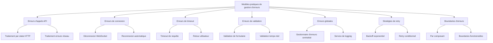

# Modèles pratiques de gestion d'erreurs

Dans les applications RxJS, une gestion appropriée des erreurs est la base pour construire des systèmes fiables. Cet article présente 7 modèles de gestion d'erreurs directement utilisables en production.

## Pourquoi la gestion d'erreurs est-elle importante

Dans les flux Observable, lorsqu'une erreur se produit, le flux se termine et les valeurs suivantes ne sont plus émises. Si vous ne comprenez pas cette caractéristique et négligez la gestion d'erreurs, votre application peut s'arrêter de manière inattendue ou ne pas fournir de retour approprié à l'utilisateur.

**Les 3 objectifs de la gestion d'erreurs** :
1. **Assurer la continuité** - Permettre au flux de continuer après une erreur
2. **Améliorer l'expérience utilisateur** - Fournir des messages d'erreur appropriés et des moyens de récupération
3. **Observabilité du système** - Détection précoce des problèmes par le logging et la surveillance des erreurs

Cet article explique comment appliquer les connaissances de base apprises dans le Chapitre 6 « [Gestion d'erreurs](/fr/guide/error-handling/strategies.md) » à des scénarios pratiques.

## Structure de cet article



## Gestion d'erreurs pour les appels API

Les appels API sont le domaine le plus sujet aux erreurs. Il faut gérer divers scénarios d'erreurs : codes de statut HTTP, erreurs réseau, timeouts, etc.

### Traitement des erreurs par statut HTTP

Effectuez une gestion appropriée des erreurs en fonction des codes de statut HTTP.

```typescript
import { Observable, throwError, catchError, retry, tap } from 'rxjs';
import { ajax, AjaxError } from 'rxjs/ajax';

/**
 * Informations détaillées sur les erreurs HTTP
 */
interface HttpErrorInfo {
  status: number;
  message: string;
  retryable: boolean;
  userMessage: string;
}

/**
 * Service de classification des erreurs HTTP
 */
class HttpErrorClassifier {
  /**
   * Génère les informations d'erreur à partir du code de statut
   */
  classify(error: AjaxError): HttpErrorInfo {
    const status = error.status;

    // 4xx Erreurs client
    if (status >= 400 && status < 500) {
      return this.handleClientError(status, error);
    }

    // 5xx Erreurs serveur
    if (status >= 500) {
      return this.handleServerError(status, error);
    }

    // Erreur réseau (status = 0)
    if (status === 0) {
      return {
        status: 0,
        message: 'Network error',
        retryable: true,
        userMessage: 'Impossible de se connecter au réseau. Veuillez vérifier votre connexion.'
      };
    }

    // Autres erreurs
    return {
      status,
      message: 'Unknown error',
      retryable: false,
      userMessage: 'Une erreur inattendue s\'est produite.'
    };
  }

  private handleClientError(status: number, error: AjaxError): HttpErrorInfo {
    switch (status) {
      case 400:
        return {
          status,
          message: 'Bad Request',
          retryable: false,
          userMessage: 'Le contenu saisi est incorrect.'
        };

      case 401:
        return {
          status,
          message: 'Unauthorized',
          retryable: false,
          userMessage: 'Authentification requise. Veuillez vous connecter.'
        };

      case 403:
        return {
          status,
          message: 'Forbidden',
          retryable: false,
          userMessage: 'Vous n\'avez pas l\'autorisation d\'effectuer cette opération.'
        };

      case 404:
        return {
          status,
          message: 'Not Found',
          retryable: false,
          userMessage: 'Les données n\'ont pas été trouvées.'
        };

      case 422:
        return {
          status,
          message: 'Unprocessable Entity',
          retryable: false,
          userMessage: 'Impossible de traiter les données saisies.'
        };

      case 429:
        return {
          status,
          message: 'Too Many Requests',
          retryable: true, // Retryable (temps d'attente nécessaire)
          userMessage: 'Trop de requêtes. Veuillez réessayer après un moment.'
        };

      default:
        return {
          status,
          message: `Client Error ${status}`,
          retryable: false,
          userMessage: 'Impossible de traiter la requête.'
        };
    }
  }

  private handleServerError(status: number, error: AjaxError): HttpErrorInfo {
    switch (status) {
      case 500:
        return {
          status,
          message: 'Internal Server Error',
          retryable: true,
          userMessage: 'Une erreur serveur s\'est produite. Veuillez réessayer après un moment.'
        };

      case 502:
      case 503:
      case 504:
        return {
          status,
          message: 'Service Unavailable',
          retryable: true,
          userMessage: 'Le serveur est temporairement indisponible. Veuillez réessayer après un moment.'
        };

      default:
        return {
          status,
          message: `Server Error ${status}`,
          retryable: true,
          userMessage: 'Une erreur serveur s\'est produite.'
        };
    }
  }
}

/**
 * Service client HTTP
 */
class HttpClientService {
  private errorClassifier = new HttpErrorClassifier();

  /**
   * Requête GET (avec gestion d'erreurs)
   */
  get<T>(url: string): Observable<T> {
    return ajax.get<T>(url).pipe(
      tap(() => console.log(`GET ${url} - Success`)),
      catchError(error => this.handleError(error, url))
    );
  }

  /**
   * Requête POST (avec gestion d'erreurs)
   */
  post<T>(url: string, body: any): Observable<T> {
    return ajax.post<T>(url, body).pipe(
      tap(() => console.log(`POST ${url} - Success`)),
      catchError(error => this.handleError(error, url))
    );
  }

  /**
   * Gestionnaire d'erreurs unifié
   */
  private handleError(error: any, url: string): Observable<never> {
    console.error(`HTTP Error at ${url}:`, error);

    if (error instanceof AjaxError) {
      const errorInfo = this.errorClassifier.classify(error);

      // Enregistrer les informations d'erreur dans les logs
      this.logError(errorInfo, url);

      // Lancer une erreur compréhensible pour l'utilisateur
      return throwError(() => errorInfo);
    }

    // Erreurs autres qu'AjaxError (erreurs de programmation, etc.)
    return throwError(() => ({
      status: -1,
      message: error.message || 'Unknown error',
      retryable: false,
      userMessage: 'Une erreur inattendue s\'est produite.'
    }));
  }

  private logError(errorInfo: HttpErrorInfo, url: string): void {
    // Envoyer au service de logging (détaillé plus loin)
    console.error('HTTP Error:', {
      url,
      status: errorInfo.status,
      message: errorInfo.message,
      timestamp: new Date().toISOString()
    });
  }
}
```

> [!TIP] Critères de classification des erreurs HTTP
> - **4xx Erreurs client** : Généralement non retryable (correction de saisie nécessaire)
> - **5xx Erreurs serveur** : Retryable (problème temporaire côté serveur)
> - **429 Too Many Requests** : Retryable mais nécessite un temps d'attente
> - **0 (Erreur réseau)** : Retryable (problème de connexion)

### Exemple d'utilisation : Traitement des erreurs par statut

```typescript
import { Component, OnInit } from '@angular/core';
import { Subject, takeUntil } from 'rxjs';

interface User {
  id: number;
  name: string;
  email: string;
}

class UserDetailManager {
  private destroy$ = new Subject<void>();
  private httpClient = new HttpClientService();

  user: User | null = null;
  loading = false;
  errorMessage = '';
  canRetry = false;

  // Callback pour mise à jour UI (optionnel)
  onStateChange?: (state: { user: User | null; loading: boolean; errorMessage: string; canRetry: boolean }) => void;

  init(): void {
    this.loadUser();
  }

  loadUser(): void {
    this.loading = true;
    this.errorMessage = '';
    this.canRetry = false;
    this.updateUI();

    this.httpClient.get<User>('/api/users/1')
      .pipe(takeUntil(this.destroy$))
      .subscribe({
        next: user => {
          this.user = user;
          this.loading = false;
          this.updateUI();
        },
        error: (errorInfo: HttpErrorInfo) => {
          this.loading = false;
          this.errorMessage = errorInfo.userMessage;
          this.canRetry = errorInfo.retryable;
          this.updateUI();

          // Rediriger vers la page de connexion en cas d'erreur d'authentification
          if (errorInfo.status === 401) {
            setTimeout(() => {
              window.location.href = '/login';
            }, 2000);
          }
        }
      });
  }

  private updateUI(): void {
    if (this.onStateChange) {
      this.onStateChange({
        user: this.user,
        loading: this.loading,
        errorMessage: this.errorMessage,
        canRetry: this.canRetry
      });
    }
  }

  destroy(): void {
    this.destroy$.next();
    this.destroy$.complete();
  }
}

// Exemple d'utilisation
const userDetail = new UserDetailManager();
userDetail.onStateChange = (state) => {
  console.log('State updated:', state);
  // Écrire ici le traitement de mise à jour de l'UI
};
userDetail.init();
```

> [!IMPORTANT] Considérations sur l'expérience utilisateur
> - Les messages d'erreur doivent indiquer **ce que l'utilisateur doit faire ensuite**, pas des détails techniques
> - Pour les erreurs retryable, afficher un **bouton de réessai**
> - Pour les erreurs d'authentification, **rediriger automatiquement vers la page de connexion**

## Traitement des erreurs réseau

Les erreurs réseau sont souvent des problèmes temporaires, donc implémentez une stratégie de retry appropriée.

```typescript
import { Observable, timer, throwError, retryWhen, mergeMap, tap } from 'rxjs';
/**
 * Configuration du retry pour les erreurs réseau
 */
interface NetworkRetryConfig {
  maxRetries: number;
  initialDelay: number;
  maxDelay: number;
  backoffMultiplier: number;
}

/**
 * Opérateur de retry réseau
 */
function retryWithBackoff(config: NetworkRetryConfig) {
  const {
    maxRetries = 3,
    initialDelay = 1000,
    maxDelay = 16000,
    backoffMultiplier = 2
  } = config;

  return <T>(source: Observable<T>) => source.pipe(
    retryWhen(errors => errors.pipe(
      mergeMap((error, index) => {
        const retryAttempt = index + 1;

        // Lancer une erreur si le nombre maximum de retry est dépassé
        if (retryAttempt > maxRetries) {
          return throwError(() => ({
            ...error,
            message: `Erreur réseau : échec après ${maxRetries} tentatives`,
            userMessage: 'Impossible de se connecter au réseau. Veuillez réessayer après un moment.'
          }));
        }

        // Calculer le délai avec backoff exponentiel
        const delay = Math.min(
          initialDelay * Math.pow(backoffMultiplier, index),
          maxDelay
        );

        console.log(
          `Retry ${retryAttempt}/${maxRetries} - nouvelle tentative après ${delay}ms...`
        );

        // Retry après le délai
        return timer(delay).pipe(
          tap(() => console.log(`Retry ${retryAttempt} en cours...`))
        );
      })
    ))
  );
}

/**
 * Client HTTP conscient du réseau
 */
class NetworkAwareHttpClient {
  private httpClient = new HttpClientService();
  private errorClassifier = new HttpErrorClassifier();

  /**
   * Requête GET avec gestion des erreurs réseau
   */
  get<T>(url: string, retryConfig?: Partial<NetworkRetryConfig>): Observable<T> {
    const defaultConfig: NetworkRetryConfig = {
      maxRetries: 3,
      initialDelay: 1000,
      maxDelay: 16000,
      backoffMultiplier: 2
    };

    const config = { ...defaultConfig, ...retryConfig };

    return this.httpClient.get<T>(url).pipe(
      catchError(error => {
        // Retry uniquement pour les erreurs réseau (status = 0)
        if (error.status === 0) {
          return throwError(() => error);
        }
        // Ne pas retry pour les autres erreurs, échouer immédiatement
        return throwError(() => error);
      }),
      retryWithBackoff(config)
    );
  }
}
```

### Exemple d'utilisation : Gestion hors ligne

```typescript
import { fromEvent, merge, map, startWith, switchMap, of } from 'rxjs';

/**
 * Gestion de l'état en ligne/hors ligne
 */
class OnlineStatusService {
  /**
   * Observable de l'état en ligne
   */
  online$ = merge(
    fromEvent(window, 'online').pipe(map(() => true)),
    fromEvent(window, 'offline').pipe(map(() => false))
  ).pipe(
    startWith(navigator.onLine)
  );
}

/**
 * Visualiseur de données avec gestion hors ligne
 */
class DataViewerManager {
  private destroy$ = new Subject<void>();
  private networkClient = new NetworkAwareHttpClient();
  private onlineStatus = new OnlineStatusService();

  isOnline$ = this.onlineStatus.online$;
  data: any = null;
  loading = false;
  errorMessage = '';

  // Callback pour mise à jour UI (optionnel)
  onStateChange?: (state: { isOnline: boolean; data: any; loading: boolean; errorMessage: string }) => void;

  init(): void {
    // Charger automatiquement les données lors de la connexion
    this.isOnline$.pipe(
      switchMap(isOnline => {
        this.updateUI(isOnline);
        if (isOnline) {
          return this.loadData();
        }
        return of(null);
      }),
      takeUntil(this.destroy$)
    ).subscribe({
      next: data => {
        if (data) {
          this.data = data;
          this.loading = false;
          this.errorMessage = '';
        }
      },
      error: error => {
        this.loading = false;
        this.errorMessage = error.userMessage;
      }
    });
  }

  private loadData(): Observable<any> {
    this.loading = true;

    return this.networkClient.get('/api/data', {
      maxRetries: 5,
      initialDelay: 2000
    });
  }

  private updateUI(isOnline: boolean): void {
    if (this.onStateChange) {
      this.onStateChange({
        isOnline,
        data: this.data,
        loading: this.loading,
        errorMessage: this.errorMessage
      });
    }
  }

  destroy(): void {
    this.destroy$.next();
    this.destroy$.complete();
  }
}

// Exemple d'utilisation
const dataViewer = new DataViewerManager();
dataViewer.onStateChange = (state) => {
  if (!state.isOnline) {
    console.log('Hors ligne. Veuillez vérifier votre connexion Internet.');
  }
  console.log('State updated:', state);
};
dataViewer.init();
```

> [!TIP] Meilleures pratiques pour la gestion hors ligne
> - **Surveiller l'état en ligne** et retry automatiquement lors du rétablissement de la connexion
> - **Indiquer clairement l'état hors ligne à l'utilisateur** pour réduire la frustration
> - **Combiner avec un cache local** pour fournir des fonctionnalités partielles même hors ligne

## Traitement des erreurs de timeout

Générer une erreur de timeout lorsqu'il n'y a pas de réponse pendant une longue période, et la gérer de manière appropriée.

```typescript
import { timeout, catchError, throwError, Observable } from 'rxjs';

/**
 * Configuration du timeout
 */
interface TimeoutConfig {
  duration: number;
  message: string;
}

/**
 * Client HTTP avec gestion du timeout
 */
class TimeoutAwareHttpClient {
  private networkClient = new NetworkAwareHttpClient();

  /**
   * Requête GET avec timeout
   */
  get<T>(
    url: string,
    timeoutConfig: TimeoutConfig = {
      duration: 30000,
      message: 'La requête a expiré'
    }
  ): Observable<T> {
    return this.networkClient.get<T>(url).pipe(
      timeout({
        each: timeoutConfig.duration,
        with: () => throwError(() => ({
          status: -2, // Statut personnalisé pour indiquer un timeout
          message: 'Timeout',
          retryable: true,
          userMessage: timeoutConfig.message
        }))
      }),
      catchError(error => {
        if (error.status === -2) {
          console.error(`Timeout: ${url} (${timeoutConfig.duration}ms)`);
        }
        return throwError(() => error);
      })
    );
  }

  /**
   * Configuration de timeout appropriée selon le type d'opération
   */
  getWithOperationType<T>(
    url: string,
    operationType: 'fast' | 'normal' | 'slow'
  ): Observable<T> {
    const timeoutConfigs = {
      fast: {
        duration: 5000,
        message: 'La requête a expiré (5 secondes)'
      },
      normal: {
        duration: 30000,
        message: 'La requête a expiré (30 secondes)'
      },
      slow: {
        duration: 60000,
        message: 'La requête a expiré (60 secondes)'
      }
    };

    return this.get<T>(url, timeoutConfigs[operationType]);
  }
}
```

### Exemple d'utilisation : Timeout avec retour utilisateur

```typescript
import { Subject, interval, takeUntil, map, startWith } from 'rxjs';

/**
 * Gestionnaire d'opérations longues
 */
class SlowOperationManager {
  private destroy$ = new Subject<void>();
  private timeoutClient = new TimeoutAwareHttpClient();

  loading = false;
  elapsedTime = 0;
  errorMessage = '';
  result: any = null;

  // Callback pour mise à jour UI (optionnel)
  onStateChange?: (state: {
    loading: boolean;
    elapsedTime: number;
    errorMessage: string;
    result: any;
  }) => void;

  startOperation(): void {
    this.loading = true;
    this.errorMessage = '';
    this.result = null;
    this.updateUI();

    // Compteur de temps écoulé
    const timer$ = interval(1000).pipe(
      map(count => count + 1),
      startWith(0),
      takeUntil(this.destroy$)
    );

    timer$.subscribe(elapsed => {
      this.elapsedTime = elapsed;
      this.updateUI();
    });

    // Opération longue (timeout de 60 secondes)
    this.timeoutClient.getWithOperationType('/api/slow-operation', 'slow')
      .pipe(takeUntil(this.destroy$))
      .subscribe({
        next: result => {
          this.result = result;
          this.loading = false;
          this.destroy$.next(); // Arrêter le timer
          this.updateUI();
        },
        error: error => {
          this.errorMessage = error.userMessage;
          this.loading = false;
          this.destroy$.next(); // Arrêter le timer

          // Afficher un conseil supplémentaire en cas de timeout
          if (error.status === -2) {
            this.errorMessage += ' La charge du serveur peut être élevée.';
          }
          this.updateUI();
        }
      });
  }

  retryOperation(): void {
    this.startOperation();
  }

  private updateUI(): void {
    if (this.onStateChange) {
      this.onStateChange({
        loading: this.loading,
        elapsedTime: this.elapsedTime,
        errorMessage: this.errorMessage,
        result: this.result
      });
    }
  }

  destroy(): void {
    this.destroy$.next();
    this.destroy$.complete();
  }
}

// Exemple d'utilisation
const slowOp = new SlowOperationManager();
slowOp.onStateChange = (state) => {
  if (state.loading) {
    console.log(`Traitement en cours... (${state.elapsedTime} secondes écoulées)`);
    if (state.elapsedTime > 10) {
      console.log('Le traitement prend du temps. Veuillez patienter.');
    }
  }
  if (state.errorMessage) {
    console.error(state.errorMessage);
  }
  if (state.result) {
    console.log('Traitement terminé:', state.result);
  }
};
slowOp.startOperation();
```

> [!WARNING] Configuration de la valeur de timeout
> - **Timeout trop court** : Fait échouer même les traitements normaux
> - **Timeout trop long** : Fait attendre l'utilisateur pendant longtemps
> - Définir une **valeur appropriée selon la nature de l'opération** et afficher le temps écoulé à l'utilisateur

## Gestion globale des erreurs

Gérer centralement les erreurs qui se produisent dans toute l'application, effectuer le logging et la surveillance.

```typescript
import { Subject, Observable, share } from 'rxjs';
/**
 * Niveau de gravité de l'erreur
 */
enum ErrorSeverity {
  Info = 'info',
  Warning = 'warning',
  Error = 'error',
  Critical = 'critical'
}

/**
 * Informations sur les erreurs d'application
 */
interface AppError {
  id: string;
  timestamp: Date;
  severity: ErrorSeverity;
  message: string;
  userMessage: string;
  context?: any;
  stack?: string;
}

/**
 * Service de gestion globale des erreurs
 */
class GlobalErrorHandler {
  private errorSubject = new Subject<AppError>();

  /**
   * Flux de toutes les erreurs
   */
  errors$: Observable<AppError> = this.errorSubject.asObservable().pipe(
    share()
  );

  /**
   * Enregistrer une erreur
   */
  handleError(
    error: any,
    severity: ErrorSeverity = ErrorSeverity.Error,
    context?: any
  ): void {
    const appError: AppError = {
      id: this.generateErrorId(),
      timestamp: new Date(),
      severity,
      message: error.message || 'Unknown error',
      userMessage: error.userMessage || 'Une erreur s\'est produite',
      context,
      stack: error.stack
    };

    // Émettre l'erreur dans le flux
    this.errorSubject.next(appError);

    // Logger dans la console
    this.logToConsole(appError);

    // Envoyer au service de log externe en cas d'erreur critique
    if (severity === ErrorSeverity.Critical || severity === ErrorSeverity.Error) {
      this.sendToLogService(appError);
    }
  }

  private generateErrorId(): string {
    return `err_${Date.now()}_${Math.random().toString(36).substr(2, 9)}`;
  }

  private logToConsole(error: AppError): void {
    const style = this.getConsoleStyle(error.severity);
    console.error(
      `%c[${error.severity.toUpperCase()}] ${error.message}`,
      style,
      {
        id: error.id,
        timestamp: error.timestamp.toISOString(),
        context: error.context,
        stack: error.stack
      }
    );
  }

  private getConsoleStyle(severity: ErrorSeverity): string {
    const styles = {
      [ErrorSeverity.Info]: 'color: #3498db',
      [ErrorSeverity.Warning]: 'color: #f39c12',
      [ErrorSeverity.Error]: 'color: #e74c3c',
      [ErrorSeverity.Critical]: 'color: #fff; background: #c0392b; font-weight: bold'
    };
    return styles[severity];
  }

  private sendToLogService(error: AppError): void {
    // Envoyer au service de log externe (Sentry, LogRocket, etc.)
    // Exemple d'implémentation :
    // Sentry.captureException(error);

    console.log('Erreur envoyée au service de log externe:', error.id);
  }
}

/**
 * Service de notification d'erreurs
 */
class ErrorNotificationService {
  private notificationSubject = new Subject<{
    message: string;
    type: 'info' | 'warning' | 'error'
  }>();

  notifications$ = this.notificationSubject.asObservable();

  constructor(private globalErrorHandler: GlobalErrorHandler) {
    // S'abonner aux erreurs globales pour afficher des notifications
    this.globalErrorHandler.errors$.subscribe(error => {
      this.showNotification(error.userMessage, this.mapSeverityToType(error.severity));
    });
  }

  showNotification(
    message: string,
    type: 'info' | 'warning' | 'error' = 'info'
  ): void {
    this.notificationSubject.next({ message, type });
  }

  private mapSeverityToType(severity: ErrorSeverity): 'info' | 'warning' | 'error' {
    if (severity === ErrorSeverity.Info) return 'info';
    if (severity === ErrorSeverity.Warning) return 'warning';
    return 'error';
  }
}
```

### Exemple d'utilisation : Gestion des erreurs à l'échelle de l'application

```typescript
import { Subject, Observable, of, switchMap, delay, startWith, catchError, throwError } from 'rxjs';

/**
 * Gestionnaire de gestion des erreurs pour toute l'application
 */
class AppErrorManager {
  private destroy$ = new Subject<void>();
  currentNotification$: Observable<any>;

  constructor(
    private errorNotificationService: ErrorNotificationService,
    private globalErrorHandler: GlobalErrorHandler
  ) {
    this.currentNotification$ = this.errorNotificationService.notifications$.pipe(
      switchMap(notification =>
        // Disparaît automatiquement après 5 secondes
        of(notification).pipe(
          delay(5000),
          startWith(notification)
        )
      )
    );
  }

  init(): void {
    // Capturer les rejections de Promise non gérées
    window.addEventListener('unhandledrejection', event => {
      this.globalErrorHandler.handleError(
        { message: event.reason, userMessage: 'Une erreur inattendue s\'est produite' },
        ErrorSeverity.Error,
        { type: 'unhandledRejection' }
      );
    });

    // Capturer les erreurs JavaScript
    window.addEventListener('error', event => {
      this.globalErrorHandler.handleError(
        { message: event.message, stack: event.error?.stack },
        ErrorSeverity.Critical,
        { filename: event.filename, lineno: event.lineno }
      );
    });

    // S'abonner aux notifications pour mettre à jour l'UI
    this.currentNotification$.subscribe(notification => {
      if (notification) {
        console.log(`[${notification.type}] ${notification.message}`);
      }
    });
  }

  dismissNotification(): void {
    // Fermer la notification (implémentation simplifiée)
  }

  destroy(): void {
    this.destroy$.next();
    this.destroy$.complete();
  }
}

/**
 * Service de gestion des données utilisateur
 */
class UserService {
  constructor(
    private httpClient: HttpClientService,
    private globalErrorHandler: GlobalErrorHandler
  ) {}

  loadUser(userId: number): Observable<User> {
    return this.httpClient.get<User>(`/api/users/${userId}`).pipe(
      catchError(error => {
        // Enregistrer dans le gestionnaire d'erreurs global
        this.globalErrorHandler.handleError(
          error,
          ErrorSeverity.Error,
          { userId, operation: 'loadUser' }
        );

        // Re-lancer l'erreur (pour permettre également le traitement par l'appelant)
        return throwError(() => error);
      })
    );
  }
}

// Exemple d'utilisation
const globalErrorHandler = new GlobalErrorHandler();
const errorNotificationService = new ErrorNotificationService(globalErrorHandler);
const appErrorManager = new AppErrorManager(errorNotificationService, globalErrorHandler);
appErrorManager.init();

const userService = new UserService(new HttpClientService(), globalErrorHandler);
```

> [!IMPORTANT] Avantages de la gestion globale des erreurs
> - **Gestion centralisée** : Enregistrement et surveillance de toutes les erreurs en un seul endroit
> - **Amélioration de l'observabilité** : Création de statistiques et de tableaux de bord en s'abonnant au flux d'erreurs
> - **Uniformisation de l'expérience utilisateur** : UI de notification d'erreurs cohérente
> - **Facilitation du debugging** : Enregistrement de l'ID d'erreur, du contexte et du stack trace

## Implémentation des stratégies de retry

Implémentez des stratégies de retry flexibles selon le type et la situation de l'erreur.

```typescript
import { Observable, throwError, timer, range, retryWhen, mergeMap, tap, finalize } from 'rxjs';
/**
 * Types de stratégies de retry
 */
enum RetryStrategy {
  Immediate = 'immediate',      // Retry immédiat
  FixedDelay = 'fixed',        // Intervalle fixe
  ExponentialBackoff = 'exponential', // Backoff exponentiel
  LinearBackoff = 'linear'     // Backoff linéaire
}

/**
 * Configuration du retry
 */
interface RetryConfig {
  strategy: RetryStrategy;
  maxRetries: number;
  initialDelay?: number;
  maxDelay?: number;
  shouldRetry?: (error: any) => boolean;
}

/**
 * Opérateur de retry avancé
 */
function advancedRetry(config: RetryConfig) {
  const {
    strategy,
    maxRetries,
    initialDelay = 1000,
    maxDelay = 32000,
    shouldRetry = () => true
  } = config;

  return <T>(source: Observable<T>) => source.pipe(
    retryWhen(errors => errors.pipe(
      mergeMap((error, index) => {
        const retryAttempt = index + 1;

        // Vérifier si le retry est possible
        if (!shouldRetry(error)) {
          console.log('Erreur non retryable:', error.message);
          return throwError(() => error);
        }

        // Vérifier le nombre maximum de retry
        if (retryAttempt > maxRetries) {
          console.error(`Échec du retry : échec après ${maxRetries} tentatives`);
          return throwError(() => ({
            ...error,
            message: `${error.message} (échec après ${maxRetries} retry)`,
            retriesExhausted: true
          }));
        }

        // Calculer le délai selon la stratégie de retry
        const delay = calculateDelay(strategy, index, initialDelay, maxDelay);

        console.log(
          `Stratégie de retry: ${strategy} | ` +
          `Tentative ${retryAttempt}/${maxRetries} | ` +
          `Nouvelle tentative après ${delay}ms...`
        );

        return timer(delay);
      })
    ))
  );
}

/**
 * Calcul du délai selon la stratégie
 */
function calculateDelay(
  strategy: RetryStrategy,
  attemptIndex: number,
  initialDelay: number,
  maxDelay: number
): number {
  switch (strategy) {
    case RetryStrategy.Immediate:
      return 0;

    case RetryStrategy.FixedDelay:
      return initialDelay;

    case RetryStrategy.ExponentialBackoff:
      return Math.min(
        initialDelay * Math.pow(2, attemptIndex),
        maxDelay
      );

    case RetryStrategy.LinearBackoff:
      return Math.min(
        initialDelay * (attemptIndex + 1),
        maxDelay
      );

    default:
      return initialDelay;
  }
}

/**
 * Exemple de retry conditionnel
 */
class SmartRetryHttpClient {
  private httpClient = new HttpClientService();

  /**
   * Retry selon le type d'erreur
   */
  getWithSmartRetry<T>(url: string): Observable<T> {
    return this.httpClient.get<T>(url).pipe(
      advancedRetry({
        strategy: RetryStrategy.ExponentialBackoff,
        maxRetries: 3,
        initialDelay: 1000,
        maxDelay: 16000,
        shouldRetry: (error) => {
          // Déterminer si l'erreur doit être retryée

          // Erreur réseau -> Retry
          if (error.status === 0) return true;

          // 5xx Erreur serveur -> Retry
          if (error.status >= 500) return true;

          // 429 Too Many Requests -> Retry
          if (error.status === 429) return true;

          // 4xx Erreur client -> Pas de retry
          if (error.status >= 400 && error.status < 500) return false;

          // Autres -> Pas de retry
          return false;
        }
      }),
      tap({
        next: () => console.log('Requête réussie'),
        error: error => {
          if (error.retriesExhausted) {
            console.error('Tous les retry ont échoué');
          }
        }
      })
    );
  }
}
```

### Exemple d'utilisation : Comparaison des stratégies de retry

```typescript
import { Observable, finalize } from 'rxjs';

/**
 * Gestionnaire de test des stratégies de retry
 */
class RetryTestManager {
  strategies = [
    { type: RetryStrategy.Immediate, name: 'Retry immédiat' },
    { type: RetryStrategy.FixedDelay, name: 'Retry à intervalle fixe' },
    { type: RetryStrategy.ExponentialBackoff, name: 'Backoff exponentiel' },
    { type: RetryStrategy.LinearBackoff, name: 'Backoff linéaire' }
  ];

  log = '';

  // Callback pour mise à jour du log (optionnel)
  onLogUpdate?: (log: string) => void;

  testStrategy(strategy: RetryStrategy): void {
    this.log = `Début du test de la stratégie ${strategy}...\n`;
    this.updateLog();

    // Observable qui échoue toujours (pour test)
    const failingRequest$ = new Observable(subscriber => {
      this.log += `Exécution de la requête...\n`;
      this.updateLog();
      setTimeout(() => {
        subscriber.error({ status: 500, message: 'Test error' });
      }, 100);
    });

    const startTime = Date.now();

    failingRequest$.pipe(
      advancedRetry({
        strategy,
        maxRetries: 3,
        initialDelay: 1000,
        maxDelay: 8000
      }),
      finalize(() => {
        const elapsed = Date.now() - startTime;
        this.log += `Terminé (temps écoulé : ${elapsed}ms)\n`;
        this.updateLog();
      })
    ).subscribe({
      error: () => {
        this.log += 'Tous les retry ont échoué\n';
        this.updateLog();
      }
    });
  }

  private updateLog(): void {
    if (this.onLogUpdate) {
      this.onLogUpdate(this.log);
    }
  }
}

// Exemple d'utilisation
const retryTest = new RetryTestManager();
retryTest.onLogUpdate = (log) => {
  console.log('Log:');
  console.log(log);
};
retryTest.testStrategy(RetryStrategy.ExponentialBackoff);
```

> [!TIP] Guide de sélection de la stratégie de retry
> - **Immediate** : Environnement de test ou compétition de lock temporaire
> - **FixedDelay** : Limitation de débit (429) ou charge serveur
> - **ExponentialBackoff** : Erreurs réseau ou erreurs serveur temporaires (recommandé)
> - **LinearBackoff** : Lorsque la récupération est progressive

## Conception des boundaries d'erreurs

Isolez les erreurs par composant ou module pour éviter qu'une défaillance partielle ne se propage à toute l'application.

```typescript
import { Subject } from 'rxjs';

/**
 * Gestionnaire de boundary d'erreurs
 *
 * Capture les erreurs par section et
 * effectue un traitement de fallback
 */
class ErrorBoundaryManager {
  fallbackTitle = 'Une erreur s\'est produite';
  fallbackMessage = 'Impossible de charger cette section. Veuillez réessayer.';

  hasError = false;
  private destroy$ = new Subject<void>();
  private globalErrorHandler: GlobalErrorHandler;

  // Callback pour mise à jour UI (optionnel)
  onStateChange?: (state: { hasError: boolean; fallbackTitle: string; fallbackMessage: string }) => void;
  onErrorOccurred?: (error: any) => void;

  constructor(globalErrorHandler: GlobalErrorHandler, options?: { fallbackTitle?: string; fallbackMessage?: string }) {
    this.globalErrorHandler = globalErrorHandler;
    if (options?.fallbackTitle) this.fallbackTitle = options.fallbackTitle;
    if (options?.fallbackMessage) this.fallbackMessage = options.fallbackMessage;
  }

  /**
   * Capturer une erreur
   */
  catchError(error: any, context?: any): void {
    this.hasError = true;

    // Enregistrer dans le gestionnaire d'erreurs global
    this.globalErrorHandler.handleError(
      error,
      ErrorSeverity.Warning,
      { ...context, boundaryLocation: 'ErrorBoundaryManager' }
    );

    // Notifier le parent
    if (this.onErrorOccurred) {
      this.onErrorOccurred(error);
    }

    this.updateUI();
  }

  /**
   * Réinitialiser l'état d'erreur
   */
  retry(): void {
    this.hasError = false;
    this.updateUI();
  }

  private updateUI(): void {
    if (this.onStateChange) {
      this.onStateChange({
        hasError: this.hasError,
        fallbackTitle: this.fallbackTitle,
        fallbackMessage: this.fallbackMessage
      });
    }
  }

  destroy(): void {
    this.destroy$.next();
    this.destroy$.complete();
  }
}

/**
 * Gestionnaire des sections du tableau de bord
 */
class DashboardManager {
  private userBoundary: ErrorBoundaryManager;
  private statisticsBoundary: ErrorBoundaryManager;
  private notificationsBoundary: ErrorBoundaryManager;

  constructor(globalErrorHandler: GlobalErrorHandler) {
    this.userBoundary = new ErrorBoundaryManager(
      globalErrorHandler,
      { fallbackTitle: 'Impossible de charger les informations utilisateur' }
    );
    this.statisticsBoundary = new ErrorBoundaryManager(
      globalErrorHandler,
      { fallbackTitle: 'Impossible de charger les statistiques' }
    );
    this.notificationsBoundary = new ErrorBoundaryManager(
      globalErrorHandler,
      { fallbackTitle: 'Impossible de charger les notifications' }
    );

    // Traitement des erreurs de la section utilisateur
    this.userBoundary.onErrorOccurred = (error) => {
      console.log('Une erreur s\'est produite dans la section utilisateur:', error);
      // Traitement comme le chargement de données alternatives si nécessaire
    };
  }

  getUserBoundary(): ErrorBoundaryManager {
    return this.userBoundary;
  }

  getStatisticsBoundary(): ErrorBoundaryManager {
    return this.statisticsBoundary;
  }

  getNotificationsBoundary(): ErrorBoundaryManager {
    return this.notificationsBoundary;
  }
}

/**
 * Gestionnaire des informations utilisateur
 */
class UserInfoManager {
  private httpClient = new HttpClientService();
  private errorBoundary?: ErrorBoundaryManager;

  user: User | null = null;
  loading = false;

  // Callback pour mise à jour UI (optionnel)
  onStateChange?: (state: { user: User | null; loading: boolean }) => void;

  constructor(errorBoundary?: ErrorBoundaryManager) {
    this.errorBoundary = errorBoundary;
  }

  init(): void {
    this.loadUser();
  }

  loadUser(): void {
    this.loading = true;
    this.updateUI();

    this.httpClient.get<User>('/api/user/me').subscribe({
      next: user => {
        this.user = user;
        this.loading = false;
        this.updateUI();
      },
      error: error => {
        this.loading = false;
        this.updateUI();

        // Propager l'erreur vers la boundary d'erreurs
        if (this.errorBoundary) {
          this.errorBoundary.catchError(error, {
            component: 'UserInfoManager',
            operation: 'loadUser'
          });
        }
      }
    });
  }

  private updateUI(): void {
    if (this.onStateChange) {
      this.onStateChange({
        user: this.user,
        loading: this.loading
      });
    }
  }
}

// Exemple d'utilisation
const globalErrorHandler = new GlobalErrorHandler();
const dashboard = new DashboardManager(globalErrorHandler);

const userInfo = new UserInfoManager(dashboard.getUserBoundary());
userInfo.onStateChange = (state) => {
  if (state.loading) {
    console.log('Chargement...');
  } else if (state.user) {
    console.log(`Utilisateur : ${state.user.name} (${state.user.email})`);
  }
};
userInfo.init();
```

> [!IMPORTANT] Avantages des boundaries d'erreurs
> - **Localisation des défaillances** : L'erreur d'une section n'affecte pas les autres sections
> - **Amélioration de l'expérience utilisateur** : Fournir une UI partiellement fonctionnelle
> - **Facilitation du debugging** : L'emplacement de l'erreur est clair
> - **Récupération progressive** : Possibilité de réessayer section par section

## Résumé

Cet article a expliqué 7 modèles pratiques de gestion d'erreurs dans les applications RxJS.

### Points importants

> [!TIP] Principes de gestion d'erreurs
> 1. **Anticiper les erreurs** : Identifier à l'avance les scénarios d'erreurs possibles
> 2. **Classifier appropriément** : Implémenter un traitement selon le type d'erreur
> 3. **Considérer l'utilisateur** : Indiquer l'action suivante plutôt que des détails techniques
> 4. **Assurer l'observabilité** : Enregistrer toutes les erreurs dans les logs
> 5. **Établir des boundaries** : Limiter la portée de l'impact des erreurs

### Checklist d'application des modèles

- [ ] Classifier les erreurs HTTP par code de statut
- [ ] Implémenter une stratégie de retry appropriée pour les erreurs réseau
- [ ] Définir la valeur de timeout selon la nature de l'opération
- [ ] Gestion centralisée avec un gestionnaire d'erreurs global
- [ ] Distinguer les erreurs retryable et non retryable
- [ ] Isoler les défaillances par composant avec des boundaries d'erreurs
- [ ] Afficher des messages d'erreur compréhensibles pour l'utilisateur

### Sections connexes

- **[Gestion d'erreurs](/fr/guide/error-handling/strategies.md)** - Stratégies de base du traitement d'erreurs
- **[Modèles d'appels API](/fr/guide/practical-patterns/api-calls.md)** - Modèles de base de communication API
- **[Traitement de données temps réel](/fr/guide/practical-patterns/real-time-data.md)** - Traitement des erreurs de connexion WebSocket
- **[Recueil d'anti-patterns](/fr/guide/anti-patterns/)** - Erreurs courantes dans la gestion d'erreurs

## Code de test

Exemples de code de test pour vérifier le comportement de la gestion d'erreurs.

```typescript
import { TestBed } from '@angular/core/testing';
import { of, throwError } from 'rxjs';

describe('HttpErrorClassifier', () => {
  let classifier: HttpErrorClassifier;

  beforeEach(() => {
    classifier = new HttpErrorClassifier();
  });

  it('should classify 404 as client error', () => {
    const error = { status: 404 } as AjaxError;
    const result = classifier.classify(error);

    expect(result.status).toBe(404);
    expect(result.retryable).toBe(false);
    expect(result.userMessage).toContain('trouvées');
  });

  it('should classify 500 as retryable server error', () => {
    const error = { status: 500 } as AjaxError;
    const result = classifier.classify(error);

    expect(result.status).toBe(500);
    expect(result.retryable).toBe(true);
    expect(result.userMessage).toContain('serveur');
  });

  it('should classify network error (status 0) as retryable', () => {
    const error = { status: 0 } as AjaxError;
    const result = classifier.classify(error);

    expect(result.status).toBe(0);
    expect(result.retryable).toBe(true);
    expect(result.userMessage).toContain('réseau');
  });
});

describe('SmartRetryHttpClient', () => {
  let client: SmartRetryHttpClient;
  let httpClientSpy: jasmine.SpyObj<HttpClientService>;

  beforeEach(() => {
    httpClientSpy = jasmine.createSpyObj('HttpClientService', ['get']);
    client = new SmartRetryHttpClient();
    (client as any).httpClient = httpClientSpy;
  });

  it('should retry on 500 error', (done) => {
    let attempts = 0;
    httpClientSpy.get.and.callFake(() => {
      attempts++;
      if (attempts < 3) {
        return throwError(() => ({ status: 500 }));
      }
      return of({ data: 'success' });
    });

    client.getWithSmartRetry('/api/test').subscribe({
      next: result => {
        expect(attempts).toBe(3);
        expect(result).toEqual({ data: 'success' });
        done();
      }
    });
  });

  it('should not retry on 404 error', (done) => {
    let attempts = 0;
    httpClientSpy.get.and.callFake(() => {
      attempts++;
      return throwError(() => ({ status: 404 }));
    });

    client.getWithSmartRetry('/api/test').subscribe({
      error: () => {
        expect(attempts).toBe(1);
        done();
      }
    });
  });
});

describe('GlobalErrorHandler', () => {
  let handler: GlobalErrorHandler;
  let receivedErrors: AppError[];

  beforeEach(() => {
    handler = new GlobalErrorHandler();
    receivedErrors = [];

    handler.errors$.subscribe(error => {
      receivedErrors.push(error);
    });
  });

  it('should emit error to stream', () => {
    handler.handleError(
      { message: 'Test error' },
      ErrorSeverity.Error
    );

    expect(receivedErrors.length).toBe(1);
    expect(receivedErrors[0].message).toBe('Test error');
    expect(receivedErrors[0].severity).toBe(ErrorSeverity.Error);
  });

  it('should generate unique error IDs', () => {
    handler.handleError({ message: 'Error 1' });
    handler.handleError({ message: 'Error 2' });

    expect(receivedErrors[0].id).not.toBe(receivedErrors[1].id);
  });
});
```

## Ressources de référence

Ressources pour approfondir vos connaissances sur la gestion d'erreurs.

- [Documentation officielle RxJS - Error Handling](https://rxjs.dev/guide/error-handling) - Guide officiel de gestion d'erreurs
- [Learn RxJS - catchError](https://www.learnrxjs.io/learn-rxjs/operators/error_handling/catch) - Détails sur l'opérateur catchError
- [Learn RxJS - retry / retryWhen](https://www.learnrxjs.io/learn-rxjs/operators/error_handling/retry) - Utilisation des opérateurs de retry
- [Angular Error Handling Best Practices](https://angular.io/guide/http#error-handling) - Traitement des erreurs HTTP dans Angular
