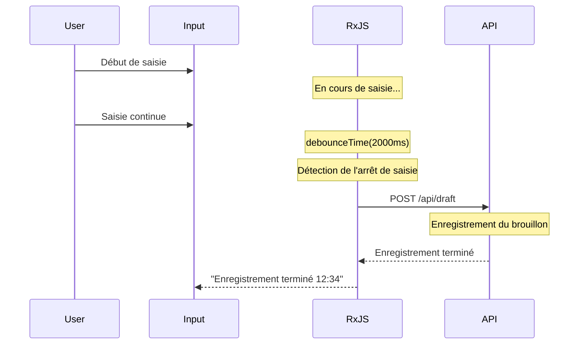

# Modèles de traitement de formulaires

Le traitement de formulaires est l'une des fonctionnalités centrales du développement d'applications web. Avec RxJS, vous pouvez implémenter efficacement des formulaires réactifs et conviviaux.

Cet article explique des modèles concrets de traitement de formulaires nécessaires en pratique, tels que la validation en temps réel, la sauvegarde automatique et la liaison de plusieurs champs.

## Ce que vous apprendrez dans cet article

- Implémentation de la validation en temps réel
- Fonction de sauvegarde automatique (debounce + distinctUntilChanged)
- Combinaison de plusieurs champs (combineLatest)
- Affichage de champs conditionnels
- Traitement de soumission et prévention de double soumission (exhaustMap)
- Affichage d'erreurs et traitement de réinitialisation
- Gestion de l'état du formulaire

> [!TIP] Connaissances préalables
> Cet article suppose une connaissance du [Chapitre 3: Fonctions de création](../creation-functions/index.md) et du [Chapitre 4: Opérateurs](../operators/index.md).

## Validation en temps réel

### Problème : Exécuter la validation à chaque saisie

Exécuter la validation à chaque saisie de l'utilisateur et fournir un feedback immédiat.

### Solution : debounceTime + distinctUntilChanged

```typescript
import { fromEvent, map, debounceTime, distinctUntilChanged } from 'rxjs';
interface ValidationResult {
  valid: boolean;
  message: string;
}

const emailInput = document.createElement('input');
emailInput.id = 'email';
emailInput.type = 'email';
emailInput.placeholder = 'Entrez votre adresse e-mail';
emailInput.style.padding = '10px';
emailInput.style.margin = '10px';
emailInput.style.width = '300px';
emailInput.style.fontSize = '16px';
emailInput.style.border = '2px solid #ccc';
emailInput.style.borderRadius = '4px';
document.body.appendChild(emailInput);

const emailError = document.createElement('div');
emailError.id = 'email-error';
emailError.style.margin = '0 10px 10px 10px';
emailError.style.color = '#f44336';
emailError.style.fontSize = '14px';
emailError.style.minHeight = '20px';
document.body.appendChild(emailError);

fromEvent(emailInput, 'input').pipe(
  map(event => (event.target as HTMLInputElement).value.trim()),
  debounceTime(300),           // Attendre 300ms après l'arrêt de la saisie
  distinctUntilChanged()       // Ignorer si la valeur est identique à la précédente
).subscribe(email => {
  const result = validateEmail(email);

  if (result.valid) {
    emailInput.style.borderColor = '#4CAF50';
    emailError.textContent = '';
  } else {
    emailInput.style.borderColor = '#f44336';
    emailError.textContent = result.message;
  }
});

// Validation de l'adresse e-mail
function validateEmail(email: string): ValidationResult {
  if (email.length === 0) {
    return { valid: false, message: 'Veuillez entrer une adresse e-mail' };
  }

  const emailRegex = /^[^\s@]+@[^\s@]+\.[^\s@]+$/;
  if (!emailRegex.test(email)) {
    return { valid: false, message: 'Le format de l\'adresse e-mail est incorrect' };
  }

  return { valid: true, message: '' };
}
```

> [!NOTE] Points de la validation en temps réel
> - `debounceTime(300)` attend l'arrêt de la saisie (prévient le traitement excessif)
> - `distinctUntilChanged()` prévient la validation en double
> - Feedback visuel des résultats de validation (classes CSS)

### Combiner plusieurs règles de validation

```typescript
import { fromEvent, combineLatest, map, debounceTime, distinctUntilChanged, startWith } from 'rxjs';
interface PasswordValidation {
  minLength: boolean;
  hasUpperCase: boolean;
  hasLowerCase: boolean;
  hasNumber: boolean;
  hasSpecialChar: boolean;
}

const passwordInput = document.createElement('input');
passwordInput.id = 'password';
passwordInput.type = 'password';
passwordInput.placeholder = 'Mot de passe';
passwordInput.style.padding = '10px';
passwordInput.style.margin = '10px';
passwordInput.style.width = '300px';
passwordInput.style.fontSize = '16px';
passwordInput.style.border = '2px solid #ccc';
passwordInput.style.borderRadius = '4px';
passwordInput.style.display = 'block';
document.body.appendChild(passwordInput);

const confirmPasswordInput = document.createElement('input');
confirmPasswordInput.id = 'confirm-password';
confirmPasswordInput.type = 'password';
confirmPasswordInput.placeholder = 'Confirmation du mot de passe';
confirmPasswordInput.style.padding = '10px';
confirmPasswordInput.style.margin = '10px';
confirmPasswordInput.style.width = '300px';
confirmPasswordInput.style.fontSize = '16px';
confirmPasswordInput.style.border = '2px solid #ccc';
confirmPasswordInput.style.borderRadius = '4px';
confirmPasswordInput.style.display = 'block';
document.body.appendChild(confirmPasswordInput);

const confirmError = document.createElement('div');
confirmError.id = 'confirm-error';
confirmError.style.margin = '0 10px 10px 10px';
confirmError.style.color = '#f44336';
confirmError.style.fontSize = '14px';
confirmError.style.minHeight = '20px';
document.body.appendChild(confirmError);

// Créer les éléments de liste de vérification de validation
const validationContainer = document.createElement('div');
validationContainer.style.margin = '10px';
validationContainer.style.padding = '10px';
validationContainer.style.border = '1px solid #ddd';
validationContainer.style.borderRadius = '4px';
validationContainer.style.width = '300px';
document.body.appendChild(validationContainer);

const checkElements: Record<string, HTMLElement> = {};
const checks = [
  { id: 'check-length', label: '8 caractères ou plus' },
  { id: 'check-uppercase', label: 'Contient des majuscules' },
  { id: 'check-lowercase', label: 'Contient des minuscules' },
  { id: 'check-number', label: 'Contient des chiffres' },
  { id: 'check-special', label: 'Contient des symboles' }
];

checks.forEach(({ id, label }) => {
  const checkEl = document.createElement('div');
  checkEl.id = id;
  checkEl.textContent = `${label}`;
  checkEl.style.padding = '5px';
  checkEl.style.color = '#999';
  validationContainer.appendChild(checkEl);
  checkElements[id] = checkEl;
});

const password$ = fromEvent(passwordInput, 'input').pipe(
  map(event => (event.target as HTMLInputElement).value),
  debounceTime(300),
  distinctUntilChanged(),
  startWith('')
);

const confirmPassword$ = fromEvent(confirmPasswordInput, 'input').pipe(
  map(event => (event.target as HTMLInputElement).value),
  debounceTime(300),
  distinctUntilChanged(),
  startWith('')
);

// Validation du mot de passe
password$.subscribe(password => {
  const validation = validatePassword(password);
  displayPasswordValidation(validation);
});

// Vérification de la correspondance du mot de passe
combineLatest([password$, confirmPassword$]).subscribe(
  ([password, confirmPassword]) => {
    if (confirmPassword.length === 0) {
      confirmError.textContent = '';
      confirmPasswordInput.style.borderColor = '#ccc';
      return;
    }

    if (password !== confirmPassword) {
      confirmError.textContent = 'Les mots de passe ne correspondent pas';
      confirmPasswordInput.style.borderColor = '#f44336';
    } else {
      confirmError.textContent = '';
      confirmPasswordInput.style.borderColor = '#4CAF50';
    }
  }
);

function validatePassword(password: string): PasswordValidation {
  return {
    minLength: password.length >= 8,
    hasUpperCase: /[A-Z]/.test(password),
    hasLowerCase: /[a-z]/.test(password),
    hasNumber: /[0-9]/.test(password),
    hasSpecialChar: /[!@#$%^&*(),.?":{}|<>]/.test(password)
  };
}

function displayPasswordValidation(validation: PasswordValidation): void {
  const checkItems = [
    { id: 'check-length', valid: validation.minLength },
    { id: 'check-uppercase', valid: validation.hasUpperCase },
    { id: 'check-lowercase', valid: validation.hasLowerCase },
    { id: 'check-number', valid: validation.hasNumber },
    { id: 'check-special', valid: validation.hasSpecialChar }
  ];

  checkItems.forEach(({ id, valid }) => {
    const element = checkElements[id];
    if (element) {
      if (valid) {
        element.style.color = '#4CAF50';
        element.style.fontWeight = 'bold';
      } else {
        element.style.color = '#999';
        element.style.fontWeight = 'normal';
      }
    }
  });
}
```

> [!TIP] Utilisation de combineLatest
> Avec `combineLatest`, vous pouvez facilement implémenter la validation combinant les valeurs de plusieurs champs (vérification de correspondance de mot de passe, etc.).

## Fonction de sauvegarde automatique

### Problème : Sauvegarder automatiquement les brouillons

Sauvegarder automatiquement et périodiquement le contenu saisi par l'utilisateur pour prévenir la perte de données.

### Solution : debounceTime + switchMap

```typescript
import { fromEvent, combineLatest, of, map, debounceTime, distinctUntilChanged, switchMap, catchError, tap, startWith } from 'rxjs';
interface DraftData {
  title: string;
  content: string;
  lastSaved?: Date;
}

const titleInput = document.createElement('input');
titleInput.id = 'title';
titleInput.type = 'text';
titleInput.placeholder = 'Entrez le titre';
titleInput.style.padding = '10px';
titleInput.style.margin = '10px';
titleInput.style.width = '500px';
titleInput.style.fontSize = '18px';
titleInput.style.border = '2px solid #ccc';
titleInput.style.borderRadius = '4px';
titleInput.style.display = 'block';
document.body.appendChild(titleInput);

const contentTextarea = document.createElement('textarea');
contentTextarea.id = 'content';
contentTextarea.placeholder = 'Entrez le contenu';
contentTextarea.rows = 10;
contentTextarea.style.padding = '10px';
contentTextarea.style.margin = '10px';
contentTextarea.style.width = '500px';
contentTextarea.style.fontSize = '16px';
contentTextarea.style.border = '2px solid #ccc';
contentTextarea.style.borderRadius = '4px';
contentTextarea.style.display = 'block';
contentTextarea.style.resize = 'vertical';
document.body.appendChild(contentTextarea);

const saveStatus = document.createElement('div');
saveStatus.id = 'save-status';
saveStatus.style.margin = '10px';
saveStatus.style.fontSize = '14px';
saveStatus.style.color = '#666';
saveStatus.style.minHeight = '20px';
document.body.appendChild(saveStatus);

const title$ = fromEvent(titleInput, 'input').pipe(
  map(event => (event.target as HTMLInputElement).value),
  startWith('')
);

const content$ = fromEvent(contentTextarea, 'input').pipe(
  map(event => (event.target as HTMLTextAreaElement).value),
  startWith('')
);

// Surveiller les modifications du formulaire
combineLatest([title$, content$]).pipe(
  map(([title, content]): DraftData => ({ title, content })),
  debounceTime(2000),          // Attendre 2 secondes après l'arrêt de la saisie
  distinctUntilChanged((prev, curr) =>
    prev.title === curr.title && prev.content === curr.content
  ),
  tap(() => {
    saveStatus.textContent = 'Enregistrement en cours...';
    saveStatus.style.color = '#FF9800';
  }),
  switchMap(draft =>
    saveDraft(draft).pipe(
      map(savedDraft => ({ ...savedDraft, success: true })),
      catchError(err => {
        console.error('Erreur d\'enregistrement:', err);
        return of({ ...draft, success: false });
      })
    )
  )
).subscribe(result => {
  if (result.success) {
    saveStatus.textContent = `Enregistrement terminé (${formatTime(result.lastSaved!)})`;
    saveStatus.style.color = '#4CAF50';
  } else {
    saveStatus.textContent = 'Échec de l\'enregistrement';
    saveStatus.style.color = '#f44336';
  }
});

// API de sauvegarde de brouillon (mock)
function saveDraft(draft: DraftData) {
  console.log('Enregistrement du brouillon:', draft);
  return of({
    ...draft,
    lastSaved: new Date()
  });
}

function formatTime(date: Date): string {
  const hours = date.getHours().toString().padStart(2, '0');
  const minutes = date.getMinutes().toString().padStart(2, '0');
  return `${hours}:${minutes}`;
}
```

#### Flux de la sauvegarde automatique



> [!IMPORTANT] Bonnes pratiques de sauvegarde automatique
> - **debounceTime** : Définir un délai approprié (1-3 secondes)
> - **distinctUntilChanged** : Ne pas sauvegarder si le contenu n'a pas changé
> - **switchMap** : Annuler les anciennes requêtes
> - **Feedback visuel** : Afficher l'état d'enregistrement à l'utilisateur

## Liaison de plusieurs champs

### Problème : Modifier l'affichage selon la valeur d'autres champs

Par exemple : la liste des préfectures change lorsque vous sélectionnez un pays, l'affichage de la saisie de l'adresse de livraison change selon la méthode de livraison, etc.

### Solution : combineLatest et withLatestFrom

```typescript
import { fromEvent, of, map, startWith, switchMap } from 'rxjs';
interface Country {
  code: string;
  name: string;
}

interface Prefecture {
  code: string;
  name: string;
  countryCode: string;
}

const countrySelect = document.createElement('select');
countrySelect.id = 'country';
countrySelect.style.padding = '10px';
countrySelect.style.margin = '10px';
countrySelect.style.fontSize = '16px';
countrySelect.style.border = '2px solid #ccc';
countrySelect.style.borderRadius = '4px';
countrySelect.style.display = 'block';

// Ajouter les options de pays
const countries: Country[] = [
  { code: '', name: 'Sélectionner un pays' },
  { code: 'JP', name: 'Japon' },
  { code: 'US', name: 'États-Unis' }
];
countries.forEach(country => {
  const option = document.createElement('option');
  option.value = country.code;
  option.textContent = country.name;
  countrySelect.appendChild(option);
});
document.body.appendChild(countrySelect);

const prefectureSelect = document.createElement('select');
prefectureSelect.id = 'prefecture';
prefectureSelect.style.padding = '10px';
prefectureSelect.style.margin = '10px';
prefectureSelect.style.fontSize = '16px';
prefectureSelect.style.border = '2px solid #ccc';
prefectureSelect.style.borderRadius = '4px';
prefectureSelect.style.display = 'block';

// Ajouter l'option vide initiale
const emptyOption = document.createElement('option');
emptyOption.value = '';
emptyOption.textContent = 'Veuillez sélectionner';
prefectureSelect.appendChild(emptyOption);
document.body.appendChild(prefectureSelect);

const country$ = fromEvent(countrySelect, 'change').pipe(
  map(() => countrySelect.value),
  startWith(countrySelect.value)
);

// Mettre à jour la liste des préfectures lorsque le pays change
country$.pipe(
  switchMap(countryCode =>
    getPrefecturesByCountry(countryCode)
  )
).subscribe(prefectures => {
  updatePrefectureOptions(prefectureSelect, prefectures);
});

// Récupérer la liste des préfectures par code pays (mock)
function getPrefecturesByCountry(countryCode: string) {
  const prefectures: Record<string, Prefecture[]> = {
    JP: [
      { code: '13', name: 'Tokyo', countryCode: 'JP' },
      { code: '14', name: 'Kanagawa', countryCode: 'JP' },
      { code: '27', name: 'Osaka', countryCode: 'JP' }
    ],
    US: [
      { code: 'CA', name: 'Californie', countryCode: 'US' },
      { code: 'NY', name: 'New York', countryCode: 'US' },
      { code: 'TX', name: 'Texas', countryCode: 'US' }
    ]
  };

  return of(prefectures[countryCode] || []);
}

function updatePrefectureOptions(
  select: HTMLSelectElement,
  prefectures: Prefecture[]
): void {
  select.innerHTML = '<option value="">Veuillez sélectionner</option>';

  prefectures.forEach(pref => {
    const option = document.createElement('option');
    option.value = pref.code;
    option.textContent = pref.name;
    select.appendChild(option);
  });
}
```

### Affichage de champs conditionnels

```typescript
import { fromEvent, map, startWith } from 'rxjs';

const shippingMethodSelect = document.createElement('select');
shippingMethodSelect.id = 'shipping-method';
shippingMethodSelect.style.padding = '10px';
shippingMethodSelect.style.margin = '10px';
shippingMethodSelect.style.fontSize = '16px';
shippingMethodSelect.style.border = '2px solid #ccc';
shippingMethodSelect.style.borderRadius = '4px';
shippingMethodSelect.style.display = 'block';

const shippingOptions = [
  { value: '', label: 'Sélectionner la méthode de livraison' },
  { value: 'home-delivery', label: 'Livraison à domicile' },
  { value: 'store-pickup', label: 'Retrait en magasin' }
];
shippingOptions.forEach(option => {
  const optionEl = document.createElement('option');
  optionEl.value = option.value;
  optionEl.textContent = option.label;
  shippingMethodSelect.appendChild(optionEl);
});
document.body.appendChild(shippingMethodSelect);

const homeDeliverySection = document.createElement('div');
homeDeliverySection.id = 'home-delivery';
homeDeliverySection.style.padding = '15px';
homeDeliverySection.style.margin = '10px';
homeDeliverySection.style.border = '2px solid #4CAF50';
homeDeliverySection.style.borderRadius = '4px';
homeDeliverySection.style.backgroundColor = '#f1f8f4';
homeDeliverySection.style.display = 'none';
homeDeliverySection.innerHTML = '<h4 style="margin-top: 0;">Entrez les informations de livraison à domicile</h4><p>Veuillez entrer l\'adresse, le numéro de téléphone, etc.</p>';
document.body.appendChild(homeDeliverySection);

const storePickupSection = document.createElement('div');
storePickupSection.id = 'store-pickup';
storePickupSection.style.padding = '15px';
storePickupSection.style.margin = '10px';
storePickupSection.style.border = '2px solid #2196F3';
storePickupSection.style.borderRadius = '4px';
storePickupSection.style.backgroundColor = '#e3f2fd';
storePickupSection.style.display = 'none';
storePickupSection.innerHTML = '<h4 style="margin-top: 0;">Entrez les informations de retrait en magasin</h4><p>Veuillez sélectionner le magasin de retrait</p>';
document.body.appendChild(storePickupSection);

fromEvent(shippingMethodSelect, 'change').pipe(
  map(() => shippingMethodSelect.value),
  startWith(shippingMethodSelect.value)
).subscribe(method => {
  if (method === 'home-delivery') {
    homeDeliverySection.style.display = 'block';
    storePickupSection.style.display = 'none';
  } else if (method === 'store-pickup') {
    homeDeliverySection.style.display = 'none';
    storePickupSection.style.display = 'block';
  } else {
    homeDeliverySection.style.display = 'none';
    storePickupSection.style.display = 'none';
  }
});
```

### Calcul des frais de livraison selon plusieurs conditions

```typescript
import { combineLatest, fromEvent, map, startWith } from 'rxjs';
interface ShippingCalc {
  country: string;
  weight: number;
  shippingMethod: string;
}

const countrySelect = document.createElement('select');
countrySelect.id = 'country';
countrySelect.style.padding = '10px';
countrySelect.style.margin = '10px';
countrySelect.style.fontSize = '16px';
countrySelect.style.border = '2px solid #ccc';
countrySelect.style.borderRadius = '4px';
countrySelect.style.display = 'block';

const countryOptions = [
  { value: 'JP', label: 'Japon' },
  { value: 'US', label: 'États-Unis' },
  { value: 'OTHER', label: 'Autre' }
];
countryOptions.forEach(option => {
  const optionEl = document.createElement('option');
  optionEl.value = option.value;
  optionEl.textContent = option.label;
  countrySelect.appendChild(optionEl);
});
document.body.appendChild(countrySelect);

const weightInput = document.createElement('input');
weightInput.id = 'weight';
weightInput.type = 'number';
weightInput.placeholder = 'Poids (kg)';
weightInput.min = '0';
weightInput.step = '0.1';
weightInput.value = '1';
weightInput.style.padding = '10px';
weightInput.style.margin = '10px';
weightInput.style.width = '200px';
weightInput.style.fontSize = '16px';
weightInput.style.border = '2px solid #ccc';
weightInput.style.borderRadius = '4px';
weightInput.style.display = 'block';
document.body.appendChild(weightInput);

const shippingMethodSelect = document.createElement('select');
shippingMethodSelect.id = 'shipping-method';
shippingMethodSelect.style.padding = '10px';
shippingMethodSelect.style.margin = '10px';
shippingMethodSelect.style.fontSize = '16px';
shippingMethodSelect.style.border = '2px solid #ccc';
shippingMethodSelect.style.borderRadius = '4px';
shippingMethodSelect.style.display = 'block';

const methodOptions = [
  { value: 'standard', label: 'Livraison standard' },
  { value: 'express', label: 'Livraison express' }
];
methodOptions.forEach(option => {
  const optionEl = document.createElement('option');
  optionEl.value = option.value;
  optionEl.textContent = option.label;
  shippingMethodSelect.appendChild(optionEl);
});
document.body.appendChild(shippingMethodSelect);

const shippingCostDisplay = document.createElement('div');
shippingCostDisplay.id = 'shipping-cost';
shippingCostDisplay.style.padding = '15px';
shippingCostDisplay.style.margin = '10px';
shippingCostDisplay.style.fontSize = '20px';
shippingCostDisplay.style.fontWeight = 'bold';
shippingCostDisplay.style.color = '#2196F3';
shippingCostDisplay.style.border = '2px solid #2196F3';
shippingCostDisplay.style.borderRadius = '4px';
shippingCostDisplay.style.backgroundColor = '#e3f2fd';
shippingCostDisplay.textContent = 'Frais de livraison: ¥0';
document.body.appendChild(shippingCostDisplay);

const country$ = fromEvent(countrySelect, 'change').pipe(
  map(() => countrySelect.value),
  startWith(countrySelect.value)
);

const weight$ = fromEvent(weightInput, 'input').pipe(
  map(() => parseFloat(weightInput.value) || 0),
  startWith(parseFloat(weightInput.value) || 1)
);

const shippingMethod$ = fromEvent(shippingMethodSelect, 'change').pipe(
  map(() => shippingMethodSelect.value),
  startWith(shippingMethodSelect.value)
);

combineLatest([country$, weight$, shippingMethod$]).pipe(
  map(([country, weight, shippingMethod]): ShippingCalc => ({
    country,
    weight,
    shippingMethod
  })),
  map(calc => calculateShippingCost(calc))
).subscribe(cost => {
  shippingCostDisplay.textContent = `Frais de livraison: ¥${cost.toLocaleString()}`;
});

function calculateShippingCost(calc: ShippingCalc): number {
  let baseCost = 0;

  // Tarif de base par pays
  if (calc.country === 'JP') {
    baseCost = 500;
  } else if (calc.country === 'US') {
    baseCost = 2000;
  } else {
    baseCost = 3000;
  }

  // Frais supplémentaires par poids (100 yens/kg pour plus de 1kg)
  if (calc.weight > 1) {
    baseCost += Math.ceil(calc.weight - 1) * 100;
  }

  // Multiplicateur selon la méthode de livraison
  if (calc.shippingMethod === 'express') {
    baseCost *= 2;
  }

  return baseCost;
}
```

> [!TIP] Utilisation de combineLatest
> Optimal pour calculer/afficher en combinant les valeurs de plusieurs champs.
> - Calcul des frais de livraison (pays + poids + méthode de livraison)
> - Calcul de remise (produit + coupon + rang de membre)
> - Filtre de recherche (catégorie + fourchette de prix + évaluation)

## Traitement de soumission et prévention de double soumission

### Problème : Empêcher l'envoi en double par clic multiple sur le bouton

Lorsque le bouton de soumission du formulaire est cliqué plusieurs fois, les mêmes données sont envoyées plusieurs fois.

### Solution : Empêcher la double soumission avec exhaustMap

```typescript
import { fromEvent, of, exhaustMap, tap, catchError, finalize } from 'rxjs';
interface FormData {
  name: string;
  email: string;
  message: string;
}

const form = document.createElement('form');
form.id = 'contact-form';
form.style.padding = '20px';
form.style.margin = '10px';
form.style.border = '2px solid #ccc';
form.style.borderRadius = '8px';
form.style.maxWidth = '500px';
form.style.backgroundColor = '#f9f9f9';

const nameInput = document.createElement('input');
nameInput.type = 'text';
nameInput.name = 'name';
nameInput.placeholder = 'Nom';
nameInput.required = true;
nameInput.style.padding = '10px';
nameInput.style.margin = '10px 0';
nameInput.style.width = '100%';
nameInput.style.fontSize = '16px';
nameInput.style.border = '1px solid #ccc';
nameInput.style.borderRadius = '4px';
nameInput.style.boxSizing = 'border-box';
form.appendChild(nameInput);

const emailInput = document.createElement('input');
emailInput.type = 'email';
emailInput.name = 'email';
emailInput.placeholder = 'Adresse e-mail';
emailInput.required = true;
emailInput.style.padding = '10px';
emailInput.style.margin = '10px 0';
emailInput.style.width = '100%';
emailInput.style.fontSize = '16px';
emailInput.style.border = '1px solid #ccc';
emailInput.style.borderRadius = '4px';
emailInput.style.boxSizing = 'border-box';
form.appendChild(emailInput);

const messageTextarea = document.createElement('textarea');
messageTextarea.name = 'message';
messageTextarea.placeholder = 'Message';
messageTextarea.required = true;
messageTextarea.rows = 5;
messageTextarea.style.padding = '10px';
messageTextarea.style.margin = '10px 0';
messageTextarea.style.width = '100%';
messageTextarea.style.fontSize = '16px';
messageTextarea.style.border = '1px solid #ccc';
messageTextarea.style.borderRadius = '4px';
messageTextarea.style.resize = 'vertical';
messageTextarea.style.boxSizing = 'border-box';
form.appendChild(messageTextarea);

const submitButton = document.createElement('button');
submitButton.id = 'submit-button';
submitButton.type = 'submit';
submitButton.textContent = 'Envoyer';
submitButton.style.padding = '12px 30px';
submitButton.style.margin = '10px 0';
submitButton.style.fontSize = '16px';
submitButton.style.fontWeight = 'bold';
submitButton.style.color = '#fff';
submitButton.style.backgroundColor = '#2196F3';
submitButton.style.border = 'none';
submitButton.style.borderRadius = '4px';
submitButton.style.cursor = 'pointer';
form.appendChild(submitButton);

document.body.appendChild(form);

const statusMessage = document.createElement('div');
statusMessage.id = 'status-message';
statusMessage.style.padding = '10px';
statusMessage.style.margin = '10px';
statusMessage.style.fontSize = '16px';
statusMessage.style.borderRadius = '4px';
statusMessage.style.minHeight = '20px';
document.body.appendChild(statusMessage);

fromEvent(form, 'submit').pipe(
  tap(event => {
    event.preventDefault();
    submitButton.disabled = true;
    submitButton.textContent = 'Envoi en cours...';
    submitButton.style.backgroundColor = '#999';
    statusMessage.textContent = '';
  }),
  exhaustMap(() => {
    // Collecter les données du formulaire
    const formData = new FormData(form);
    const data: FormData = {
      name: formData.get('name') as string,
      email: formData.get('email') as string,
      message: formData.get('message') as string
    };

    return submitForm(data).pipe(
      catchError(err => {
        console.error('Erreur d\'envoi:', err);
        return of({ success: false, error: err.message });
      })
    );
  }),
  finalize(() => {
    submitButton.disabled = false;
    submitButton.textContent = 'Envoyer';
    submitButton.style.backgroundColor = '#2196F3';
  })
).subscribe(result => {
  if (result.success) {
    statusMessage.textContent = 'Envoi réussi !';
    statusMessage.style.backgroundColor = '#d4edda';
    statusMessage.style.color = '#155724';
    statusMessage.style.border = '1px solid #c3e6cb';
    form.reset();
  } else {
    const errorText = 'error' in result ? result.error : 'Erreur inconnue';
    statusMessage.textContent = `Échec de l'envoi: ${errorText}`;
    statusMessage.style.backgroundColor = '#f8d7da';
    statusMessage.style.color = '#721c24';
    statusMessage.style.border = '1px solid #f5c6cb';
  }
});

// API de soumission de formulaire (mock)
function submitForm(data: FormData) {
  console.log('Envoi du formulaire:', data);
  return of({ success: true });
}
```

**Comportement d'exhaustMap :**

```
Clics de l'utilisateur: ●    ●●●        ●
                        |    |          |
exhaustMap:             ●              ●
                        |              |
                    Envoi API      Envoi API
                   (après complétion) (après complétion)

※ Les clics multiples pendant l'envoi sont ignorés
```

> [!IMPORTANT] Importance d'exhaustMap
> **exhaustMap** ignore les nouvelles valeurs jusqu'à ce que l'Observable précédent se termine.
> Ainsi, il permet de :
> - Prévenir la double soumission par clics multiples
> - Bloquer les requêtes supplémentaires pendant l'appel API
> - Prévenir les opérations erronées de l'utilisateur

### Validation avant soumission

```typescript
import { fromEvent, combineLatest, map, startWith, exhaustMap, withLatestFrom, filter, tap, of } from 'rxjs';
interface FormData {
  name: string;
  email: string;
  message: string;
}

const form = document.createElement('form');
form.id = 'contact-form';
form.style.padding = '20px';
form.style.margin = '10px';
form.style.border = '2px solid #ccc';
form.style.borderRadius = '8px';
form.style.maxWidth = '500px';
form.style.backgroundColor = '#f9f9f9';

const nameInput = document.createElement('input');
nameInput.id = 'name';
nameInput.type = 'text';
nameInput.placeholder = 'Nom';
nameInput.style.padding = '10px';
nameInput.style.margin = '10px 0';
nameInput.style.width = '100%';
nameInput.style.fontSize = '16px';
nameInput.style.border = '1px solid #ccc';
nameInput.style.borderRadius = '4px';
nameInput.style.boxSizing = 'border-box';
form.appendChild(nameInput);

const emailInput = document.createElement('input');
emailInput.id = 'email';
emailInput.type = 'email';
emailInput.placeholder = 'Adresse e-mail';
emailInput.style.padding = '10px';
emailInput.style.margin = '10px 0';
emailInput.style.width = '100%';
emailInput.style.fontSize = '16px';
emailInput.style.border = '1px solid #ccc';
emailInput.style.borderRadius = '4px';
emailInput.style.boxSizing = 'border-box';
form.appendChild(emailInput);

const messageTextarea = document.createElement('textarea');
messageTextarea.id = 'message';
messageTextarea.placeholder = 'Message (10 caractères ou plus)';
messageTextarea.rows = 5;
messageTextarea.style.padding = '10px';
messageTextarea.style.margin = '10px 0';
messageTextarea.style.width = '100%';
messageTextarea.style.fontSize = '16px';
messageTextarea.style.border = '1px solid #ccc';
messageTextarea.style.borderRadius = '4px';
messageTextarea.style.resize = 'vertical';
messageTextarea.style.boxSizing = 'border-box';
form.appendChild(messageTextarea);

const submitButton = document.createElement('button');
submitButton.id = 'submit-button';
submitButton.type = 'submit';
submitButton.textContent = 'Envoyer';
submitButton.disabled = true;
submitButton.style.padding = '12px 30px';
submitButton.style.margin = '10px 0';
submitButton.style.fontSize = '16px';
submitButton.style.fontWeight = 'bold';
submitButton.style.color = '#fff';
submitButton.style.backgroundColor = '#999';
submitButton.style.border = 'none';
submitButton.style.borderRadius = '4px';
submitButton.style.cursor = 'not-allowed';
form.appendChild(submitButton);

document.body.appendChild(form);

// État de validation de chaque champ
const nameValid$ = fromEvent(nameInput, 'input').pipe(
  map(() => nameInput.value.trim().length > 0),
  startWith(false)
);

const emailValid$ = fromEvent(emailInput, 'input').pipe(
  map(() => /^[^\s@]+@[^\s@]+\.[^\s@]+$/.test(emailInput.value)),
  startWith(false)
);

const messageValid$ = fromEvent(messageTextarea, 'input').pipe(
  map(() => messageTextarea.value.trim().length >= 10),
  startWith(false)
);

// Vérifier si tous les champs sont valides
const formValid$ = combineLatest([nameValid$, emailValid$, messageValid$]).pipe(
  map(([name, email, message]) => name && email && message)
);

// Basculer l'activation/désactivation du bouton de soumission
formValid$.subscribe(valid => {
  submitButton.disabled = !valid;
  if (valid) {
    submitButton.style.backgroundColor = '#2196F3';
    submitButton.style.cursor = 'pointer';
  } else {
    submitButton.style.backgroundColor = '#999';
    submitButton.style.cursor = 'not-allowed';
  }
});

// Traitement de soumission du formulaire
fromEvent(form, 'submit').pipe(
  tap(event => event.preventDefault()),
  withLatestFrom(formValid$),
  filter(([_, valid]) => valid), // Uniquement si la validation passe
  exhaustMap(() => {
    const data = {
      name: nameInput.value,
      email: emailInput.value,
      message: messageTextarea.value
    };

    return submitForm(data);
  })
).subscribe(result => {
  console.log('Envoi terminé:', result);
  form.reset();
});

// API de soumission de formulaire (mock)
function submitForm(data: FormData) {
  console.log('Envoi du formulaire:', data);
  return of({ success: true });
}
```

> [!TIP] Utilisation de withLatestFrom
> Avec `withLatestFrom`, vous pouvez vérifier le dernier état de validation au moment de la soumission.

## Affichage d'erreurs et traitement de réinitialisation

### Gestion centralisée des erreurs de formulaire

```typescript
import { BehaviorSubject} from 'rxjs';

class FormErrorManager {
  private errors$ = new BehaviorSubject<Map<string, string>>(new Map());
  private elementCache = new Map<string, { error: HTMLElement; input: HTMLElement }>();

  setError(field: string, message: string): void {
    const currentErrors = this.errors$.value;
    currentErrors.set(field, message);
    this.errors$.next(new Map(currentErrors));
    this.displayError(field, message);
  }

  clearError(field: string): void {
    const currentErrors = this.errors$.value;
    currentErrors.delete(field);
    this.errors$.next(new Map(currentErrors));
    this.hideError(field);
  }

  clearAllErrors(): void {
    this.errors$.next(new Map());
    this.hideAllErrors();
  }

  hasErrors(): boolean {
    return this.errors$.value.size > 0;
  }

  getErrors() {
    return this.errors$.asObservable();
  }

  // Enregistrer les éléments pour un champ (doit être appelé avant d'utiliser setError/clearError)
  registerField(field: string, inputElement: HTMLElement, errorElement: HTMLElement): void {
    this.elementCache.set(field, { input: inputElement, error: errorElement });
  }

  private displayError(field: string, message: string): void {
    const elements = this.elementCache.get(field);
    if (!elements) {
      console.warn(`Le champ "${field}" n'est pas enregistré. Appelez d'abord registerField().`);
      return;
    }

    elements.error.textContent = message;
    elements.error.style.display = 'block';
    elements.input.style.borderColor = '#f44336';
    elements.input.style.backgroundColor = '#ffebee';
  }

  private hideError(field: string): void {
    const elements = this.elementCache.get(field);
    if (!elements) {
      return;
    }

    elements.error.textContent = '';
    elements.error.style.display = 'none';
    elements.input.style.borderColor = '#ccc';
    elements.input.style.backgroundColor = '#fff';
  }

  private hideAllErrors(): void {
    this.elementCache.forEach((elements) => {
      elements.error.style.display = 'none';
      elements.error.textContent = '';
      elements.input.style.borderColor = '#ccc';
      elements.input.style.backgroundColor = '#fff';
    });
  }
}

// Exemple d'utilisation (Auto-contenu : crée dynamiquement les éléments de formulaire)
const errorManager = new FormErrorManager();

// Créer les éléments de saisie et d'erreur d'e-mail
const emailInput = document.createElement('input');
emailInput.id = 'email';
emailInput.type = 'email';
emailInput.placeholder = 'Adresse e-mail';
emailInput.style.padding = '10px';
emailInput.style.margin = '10px';
emailInput.style.width = '300px';
emailInput.style.fontSize = '16px';
emailInput.style.border = '2px solid #ccc';
emailInput.style.borderRadius = '4px';
emailInput.style.display = 'block';
document.body.appendChild(emailInput);

const emailError = document.createElement('div');
emailError.id = 'email-error';
emailError.style.margin = '0 10px 10px 10px';
emailError.style.color = '#f44336';
emailError.style.fontSize = '14px';
emailError.style.display = 'none';
document.body.appendChild(emailError);

// Créer les éléments de saisie et d'erreur de mot de passe
const passwordInput = document.createElement('input');
passwordInput.id = 'password';
passwordInput.type = 'password';
passwordInput.placeholder = 'Mot de passe';
passwordInput.style.padding = '10px';
passwordInput.style.margin = '10px';
passwordInput.style.width = '300px';
passwordInput.style.fontSize = '16px';
passwordInput.style.border = '2px solid #ccc';
passwordInput.style.borderRadius = '4px';
passwordInput.style.display = 'block';
document.body.appendChild(passwordInput);

const passwordError = document.createElement('div');
passwordError.id = 'password-error';
passwordError.style.margin = '0 10px 10px 10px';
passwordError.style.color = '#f44336';
passwordError.style.fontSize = '14px';
passwordError.style.display = 'none';
document.body.appendChild(passwordError);

// Enregistrer les champs avec le gestionnaire d'erreurs
errorManager.registerField('email', emailInput, emailError);
errorManager.registerField('password', passwordInput, passwordError);

// Définir les erreurs
errorManager.setError('email', 'Le format de l\'adresse e-mail est incorrect');
errorManager.setError('password', 'Le mot de passe doit contenir au moins 8 caractères');

// Effacer les erreurs
setTimeout(() => {
  errorManager.clearError('email');
}, 2000);

// Effacer toutes les erreurs
setTimeout(() => {
  errorManager.clearAllErrors();
}, 4000);

// Surveiller les erreurs
errorManager.getErrors().subscribe(errors => {
  console.log('Nombre d\'erreurs actuelles:', errors.size);
});
```

## Gestion de l'état du formulaire

### Classe complète de gestion de l'état du formulaire

```typescript
import { BehaviorSubject, Observable } from 'rxjs';
interface FormState<T> {
  value: T;
  valid: boolean;
  dirty: boolean;
  touched: boolean;
  submitting: boolean;
}

class ReactiveForm<T extends Record<string, any>> {
  private state$: BehaviorSubject<FormState<T>>;
  private validators: Map<keyof T, ((value: any) => boolean)[]> = new Map();

  constructor(initialValue: T) {
    this.state$ = new BehaviorSubject<FormState<T>>({
      value: initialValue,
      valid: false,
      dirty: false,
      touched: false,
      submitting: false
    });
  }

  // Mise à jour de la valeur du champ
  setValue(field: keyof T, value: any): void {
    const currentState = this.state$.value;
    const newValue = { ...currentState.value, [field]: value };

    this.state$.next({
      ...currentState,
      value: newValue,
      valid: this.validateForm(newValue),
      dirty: true
    });
  }

  // Ajout d'un validateur
  addValidator(field: keyof T, validator: (value: any) => boolean): void {
    const validators = this.validators.get(field) || [];
    validators.push(validator);
    this.validators.set(field, validators);
  }

  // Validation de l'ensemble du formulaire
  private validateForm(value: T): boolean {
    for (const [field, validators] of this.validators.entries()) {
      const fieldValue = value[field];
      const isValid = validators.every(validator => validator(fieldValue));
      if (!isValid) return false;
    }
    return true;
  }

  // Définition du drapeau touched
  setTouched(field: keyof T): void {
    const currentState = this.state$.value;
    this.state$.next({
      ...currentState,
      touched: true
    });
  }

  // Définition de l'état de soumission
  setSubmitting(submitting: boolean): void {
    const currentState = this.state$.value;
    this.state$.next({
      ...currentState,
      submitting
    });
  }

  // Réinitialisation du formulaire
  reset(initialValue?: T): void {
    const resetValue = initialValue || this.state$.value.value;
    this.state$.next({
      value: resetValue,
      valid: false,
      dirty: false,
      touched: false,
      submitting: false
    });
  }

  // Récupération de l'état
  getState(): Observable<FormState<T>> {
    return this.state$.asObservable();
  }

  getValue(): T {
    return this.state$.value.value;
  }

  isValid(): boolean {
    return this.state$.value.valid;
  }

  isDirty(): boolean {
    return this.state$.value.dirty;
  }
}

// Exemple d'utilisation
interface UserForm {
  name: string;
  email: string;
  age: number;
}

const userForm = new ReactiveForm<UserForm>({
  name: '',
  email: '',
  age: 0
});

// Ajout de validateurs
userForm.addValidator('name', value => value.length > 0);
userForm.addValidator('email', value => /^[^\s@]+@[^\s@]+\.[^\s@]+$/.test(value));
userForm.addValidator('age', value => value >= 18);

// Mise à jour des valeurs
userForm.setValue('name', 'Yamada Taro');
userForm.setValue('email', 'yamada@example.com');
userForm.setValue('age', 25);

// Surveillance de l'état
userForm.getState().subscribe(state => {
  console.log('État du formulaire:', state);
  console.log('Valide:', state.valid);
  console.log('Modifié:', state.dirty);
});

// Soumission du formulaire
if (userForm.isValid()) {
  userForm.setSubmitting(true);
  const formData = userForm.getValue();
  console.log('Données à envoyer:', formData);

  // Après l'appel API
  userForm.setSubmitting(false);
  userForm.reset();
}
```

> [!TIP] Avantages de la classe de formulaire personnalisée
> - **Gestion centralisée de l'état** : Gérer tout l'état du formulaire en un seul endroit
> - **Validation intégrée** : Configuration flexible des règles de validation par champ
> - **Mise à jour réactive** : Notification automatique des changements d'état
> - **Réutilisabilité** : Réutiliser la même logique pour plusieurs formulaires

## Code de test

Exemple de test du traitement de formulaires.

```typescript
import { debounceTime, map } from 'rxjs';
import { TestScheduler } from 'rxjs/testing';

describe('Traitement de formulaires', () => {
  let testScheduler: TestScheduler;

  beforeEach(() => {
    testScheduler = new TestScheduler((actual, expected) => {
      expect(actual).toEqual(expected);
    });
  });

  it('should validate email with debounce', () => {
    testScheduler.run(({ cold, expectObservable }) => {
      const input$ = cold('a-b-c----|', {
        a: 'test',
        b: 'test@',
        c: 'test@example.com'
      });

      const result$ = input$.pipe(
        debounceTime(300, testScheduler),
        map(email => /^[^\s@]+@[^\s@]+\.[^\s@]+$/.test(email))
      );

      expectObservable(result$).toBe('-----c----|', { c: true });
    });
  });

  it('should prevent double submit with exhaustMap', () => {
    testScheduler.run(({ cold, hot, expectObservable }) => {
      const submit$ = hot('a--b-c----d|');

      const result$ = submit$.pipe(
        exhaustMap(() => cold('---x|', { x: 'submitted' }))
      );

      // Seuls le premier et le dernier submit sont traités
      expectObservable(result$).toBe('---x-----x|', { x: 'submitted' });
    });
  });
});
```

## Résumé

En maîtrisant les modèles de traitement de formulaires, vous pouvez implémenter des formulaires conviviaux et robustes.

> [!IMPORTANT] Points importants
> - **Validation en temps réel** : debounceTime + distinctUntilChanged
> - **Sauvegarde automatique** : debounceTime + switchMap pour prévenir les sauvegardes excessives
> - **Liaison de plusieurs champs** : combineLatest pour combiner les valeurs
> - **Prévention de double soumission** : exhaustMap bloque les requêtes supplémentaires pendant l'envoi
> - **Gestion de l'état** : BehaviorSubject pour la gestion centralisée de l'état du formulaire

> [!TIP] Bonnes pratiques
> - **Feedback immédiat** : Amélioration de l'UX avec validation en temps réel
> - **Délai approprié** : Configuration de debounceTime (300ms-2000ms)
> - **Feedback visuel** : Affichage clair des erreurs et de l'état de sauvegarde
> - **Accessibilité** : Placement approprié des attributs aria et des messages d'erreur
> - **Test** : Toujours tester la logique de validation

## Prochaines étapes

Après avoir maîtrisé les modèles de traitement de formulaires, passez aux modèles suivants.

- [Appels API](./api-calls.md) - Soumission de formulaires et intégration API
- [Traitement d'événements UI](./ui-events.md) - Événements UI dans les formulaires
- [Traitement de données en temps réel](./real-time-data.md) - Validation en temps réel, validation côté serveur
- [Stratégies de cache](./caching-strategies.md) - Mise en cache des données de formulaires

## Sections connexes

- [Chapitre 3: Fonctions de création](../creation-functions/index.md) - Détails sur combineLatest, withLatestFrom
- [Chapitre 4: Opérateurs](../operators/index.md) - Détails sur debounceTime, exhaustMap
- [Chapitre 5: Subject](../subjects/what-is-subject.md) - Utilisation de BehaviorSubject

## Ressources de référence

- [RxJS officiel: combineLatest](https://rxjs.dev/api/index/function/combineLatest) - Détails sur combineLatest
- [RxJS officiel: exhaustMap](https://rxjs.dev/api/operators/exhaustMap) - Détails sur exhaustMap
- [Learn RxJS: Form Handling](https://www.learnrxjs.io/) - Exemples pratiques de traitement de formulaires
