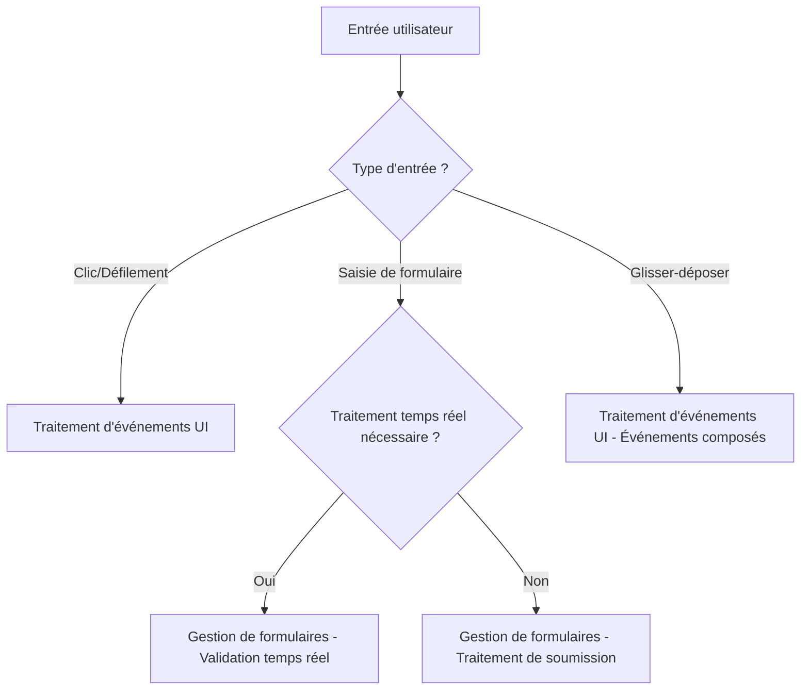
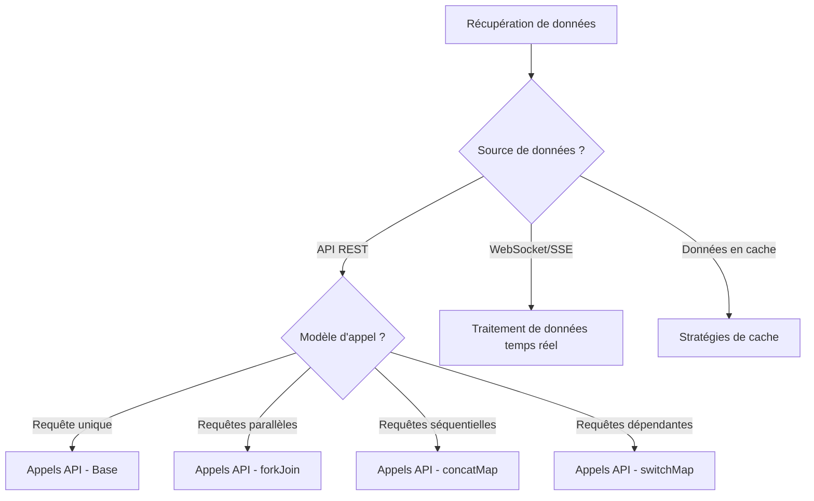
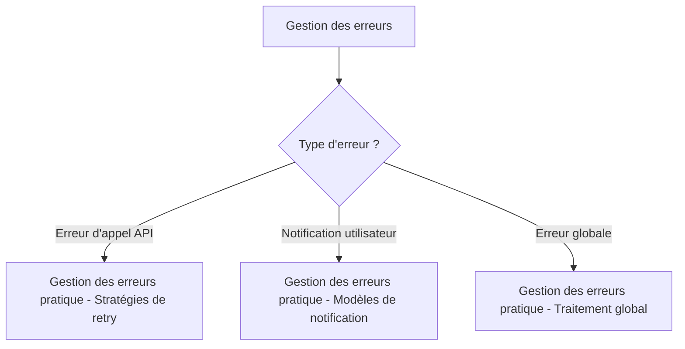

# Collection de modèles pratiques

Après avoir acquis les connaissances de base en RxJS, l'étape suivante consiste à comprendre « comment l'utiliser » dans le développement d'applications réelles. Ce chapitre présente des modèles d'implémentation concrets pour les scénarios fréquemment rencontrés dans le travail professionnel.

## Pourquoi les modèles pratiques sont-ils importants ?

Même en comprenant chaque opérateur RxJS individuellement, résoudre des problèmes réels en les combinant nécessite de l'expérience et la connaissance de modèles établis. L'apprentissage de modèles pratiques vous permet de :

- **Accélérer le développement** - Appliquer des modèles éprouvés au lieu de réinventer la roue
- **Améliorer la qualité** - Acquérir les meilleures pratiques en matière de gestion des erreurs et de prévention des fuites mémoire
- **Améliorer la maintenabilité** - Code plus lisible et maintenable grâce à des modèles cohérents
- **Dépannage** - Identifier les causes des problèmes et choisir les solutions appropriées

## Structure de ce chapitre

Les modèles pratiques sont organisés en trois phases selon leur difficulté et leur fréquence d'utilisation.

### Modèles de base (les plus fréquents)

Modèles de base les plus fréquemment utilisés en pratique. Commencez par maîtriser ces modèles.

| Modèle | Contenu | Cible principale |
|---------|------|---------|
| [Traitement des événements UI](./ui-events.md) | Opérations UI : clics, défilement, glisser-déposer | Développement frontend général |
| [Appels API](./api-calls.md) | Communication HTTP, traitement parallèle/séquentiel, gestion des erreurs | Intégration d'API Web |
| [Gestion de formulaires](./form-handling.md) | Validation temps réel, sauvegarde automatique, coordination de plusieurs champs | Implémentation de formulaires |

### Modèles avancés

Modèles avancés pour des scénarios plus complexes.

| Modèle | Contenu | Cible principale |
|---------|------|---------|
| [Modèles avancés de formulaires](./advanced-form-patterns.md) | JSON Patch, sauvegarde auto de formulaires volumineux, Undo/Redo, édition collaborative | Formulaires d'entreprise |
| [Traitement des données temps réel](./real-time-data.md) | WebSocket, SSE, Polling, gestion des connexions | Communication temps réel |
| [Stratégies de cache](./caching-strategies.md) | Cache de données, TTL, invalidation, support hors ligne | Optimisation des performances |

### Modèles spécialisés

Modèles spécialisés pour des défis spécifiques.

| Modèle | Contenu | Cible principale |
|---------|------|---------|
| [Gestion des erreurs pratique](./error-handling-patterns.md) | Erreurs d'appels API, stratégies de retry, gestion globale des erreurs | Gestion des erreurs |
| [Conditionnelles dans subscribe](./subscribe-branching.md) | Éviter les conditionnelles dans subscribe, méthodes de branchement dans le pipeline | Qualité du code |

> [!TIP] Recommandation d'apprentissage
> Pour les débutants, il est recommandé de progresser dans l'ordre depuis **Phase 1**. En particulier, "Appels API" et "Gestion de formulaires" sont des modèles essentiels en pratique.

## Structure des modèles

Chaque page de modèle est organisée comme suit :

1. **Description du problème** - Le défi résolu par ce modèle
2. **Implémentation de base** - Exemple d'implémentation le plus simple
3. **Exemples pratiques** - Code concret utilisable en pratique
4. **Comparaison Avant/Après** - Comparaison du code avant et après amélioration
5. **Points d'attention et meilleures pratiques** - Erreurs courantes et contre-mesures
6. **Définitions de types TypeScript** - Méthodes d'implémentation type-safe
7. **Code de test** - Méthodes de test des modèles
8. **Considérations de performance** - Optimisation des performances et prévention des fuites mémoire

## Guide de sélection des modèles

Voici un guide pour choisir le modèle approprié selon les fonctionnalités à implémenter.

### En cas de traitement d'entrées utilisateur



### En cas de récupération de données



### Pour renforcer la gestion des erreurs



## Approche de l'implémentation

Voici l'approche de base lors de l'implémentation de modèles RxJS.

### 1. Penser de manière déclarative

Exprimez « ce que vous voulez faire » de manière déclarative et évitez le code procédural.

```typescript
// ❌ Procédural (impératif)
let result = [];
source.subscribe(value => {
  if (value > 10) {
    const transformed = value * 2;
    result.push(transformed);
  }
});

// ✅ Déclaratif
const result$ = source.pipe(
  filter(value => value > 10),
  map(value => value * 2)
);
```

### 2. Construire le traitement avec des pipelines

Combinez de petits opérateurs pour construire des traitements complexes.

```typescript
const searchResults$ = searchInput$.pipe(
  debounceTime(300),           // Attendre 300ms après la saisie
  distinctUntilChanged(),      // Exclure les doublons
  filter(query => query.length >= 2), // Recherche à partir de 2 caractères
  switchMap(query => searchAPI(query)), // Appel API
  catchError(err => of([]))    // Tableau vide en cas d'erreur
);
```

### 3. Prévenir les fuites mémoire

Une gestion appropriée des abonnements est essentielle.

```typescript
// ✅ Désabonnement automatique avec takeUntil
private destroy$ = new Subject<void>();

ngOnInit() {
  this.data$.pipe(
    takeUntil(this.destroy$)
  ).subscribe(/*...*/);
}

ngOnDestroy() {
  this.destroy$.next();
  this.destroy$.complete();
}
```

### 4. Ne pas oublier la gestion des erreurs

Implémentez la gestion des erreurs pour tous les traitements asynchrones.

```typescript
// ✅ Gestion appropriée des erreurs avec catchError
apiCall$.pipe(
  retry(3),
  catchError(err => {
    console.error('API error:', err);
    return of(defaultValue);
  })
).subscribe(/*...*/);
```

### 5. Utiliser la sécurité des types

Utilisez au maximum le système de types TypeScript.

```typescript
interface User {
  id: number;
  name: string;
  email: string;
}

// ✅ Définitions de types claires
const users$: Observable<User[]> = fetchUsers();
const activeUsers$: Observable<User[]> = users$.pipe(
  map(users => users.filter(u => u.isActive))
);
```

## Relation avec les connaissances existantes

Les modèles de ce chapitre appliquent en pratique les connaissances acquises dans les chapitres précédents.

| Modèle pratique | Chapitre associé | Connaissances utilisées |
|------------|-----------|------------|
| Traitement d'événements UI | [Chapitre 4: Opérateurs](../operators/index.md) | debounceTime, throttleTime, distinctUntilChanged |
| Appels API | [Chapitre 6: Gestion des erreurs](../error-handling/strategies.md) | catchError, retry, timeout |
| Gestion de formulaires | [Chapitre 3: Fonctions de création](../creation-functions/index.md) | combineLatest, withLatestFrom |
| Modèles avancés de formulaires | [Chapitre 4: Opérateurs de transformation](../operators/transformation/pairwise.md) | pairwise, scan, bufferTime, concatMap |
| Données temps réel | [Chapitre 5: Subject](../subjects/what-is-subject.md) | Subject, BehaviorSubject, shareReplay |
| Stratégies de cache | [Chapitre 2: Cold/Hot](../observables/cold-and-hot-observables.md) | shareReplay, share |
| Gestion des erreurs | [Chapitre 6: Gestion des erreurs](../error-handling/strategies.md) | catchError, retry, retryWhen |
| Branchement subscribe | [Chapitre 10: Anti-modèles](../anti-patterns/index.md) | Éviter les anti-modèles |

> [!NOTE] Moment de révision
> Réviser les chapitres associés avant d'apprendre chaque modèle approfondit la compréhension.

## Questions fréquentes

### Q1: Par quel modèle devrais-je commencer ?

**R:** Il est recommandé d'apprendre par ordre de fréquence d'utilisation en pratique.

1. **Appels API** - Base du développement web
2. **Gestion de formulaires** - Traitement des entrées utilisateur
3. **Traitement d'événements UI** - UI interactive
4. **Gestion des erreurs** - Applications robustes
5. Autres modèles - Selon les besoins du projet

### Q2: Puis-je utiliser les modèles tels quels ?

**R:** Oui. Les modèles de ce chapitre sont conçus pour un usage pratique.
Cependant,

- Personnalisez-les selon les exigences de votre projet
- Prenez en compte les performances et l'utilisation de la mémoire
- Suivez les conventions de codage de votre équipe

### Q3: Puis-je les utiliser avec Angular/React/Vue ?

**R:** Oui. Les modèles de ce chapitre sont indépendants des frameworks.
Cependant,

- Pour les méthodes d'intégration spécifiques aux frameworks, consultez Chapitre 15: Intégration de frameworks (en préparation)
- Un désabonnement adapté au cycle de vie de chaque framework est nécessaire

## Résumé

La collection de modèles pratiques est un guide concret pour utiliser RxJS dans des projets réels.

> [!IMPORTANT] Points importants
> - Apprendre dans l'ordre depuis les **modèles de base de Phase 1**
> - Comprendre les améliorations avec les **comparaisons Avant/Après**
> - Toujours implémenter les **contre-mesures de fuites mémoire**
> - Ne pas oublier la **gestion des erreurs**
> - Utiliser la **sécurité des types**

> [!TIP] Conseils d'apprentissage
> - Exécuter réellement le code pour approfondir la compréhension
> - Essayer de l'appliquer à vos propres projets
> - Construire des traitements complexes en combinant des modèles
> - Apprendre également le code de test

Comme prochaine étape, il est recommandé de commencer par les [modèles d'appels API](./api-calls.md), les plus fréquemment utilisés.

## Ressources de référence

- [Documentation officielle RxJS](https://rxjs.dev/) - Référence API officielle
- [Learn RxJS](https://www.learnrxjs.io/) - Exemples pratiques par opérateur
- [RxJS Marbles](https://rxmarbles.com/) - Comprendre visuellement le fonctionnement des opérateurs
- [Chapitre 11: Surmonter les difficultés RxJS](../overcoming-difficulties/index.md) - Difficultés courantes et leurs solutions
- [Chapitre 10: Collection d'anti-modèles](../anti-patterns/index.md) - Modèles à éviter
