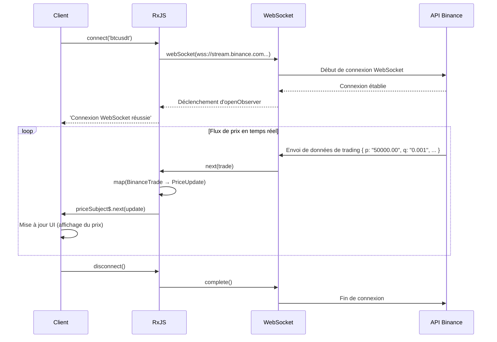

# Modèles de traitement de données en temps réel

Le traitement de données en temps réel est une fonctionnalité importante dans les applications web modernes, notamment pour le chat, les notifications, les mises à jour de prix d'actions et la surveillance de capteurs IoT. Avec RxJS, vous pouvez implémenter une communication en temps réel complexe de manière déclarative et robuste.

Cet article explique des modèles concrets de traitement de données en temps réel nécessaires en pratique, tels que WebSocket, Server-Sent Events (SSE) et Polling.

## Ce que vous apprendrez dans cet article

- Implémentation et gestion de la communication WebSocket
- Utilisation de Server-Sent Events (SSE)
- Mise à jour en temps réel par Polling
- Gestion de connexion et reconnexion automatique
- Fusion et mise à jour de données
- Construction d'un système de notifications en temps réel
- Gestion des erreurs et de l'état de connexion

> [!TIP] Connaissances préalables
> Cet article suppose une connaissance du [Chapitre 5: Subject](../subjects/what-is-subject.md) et du [Chapitre 4: Opérateurs](../operators/index.md). La compréhension de `Subject`, `shareReplay`, `retry`, `retryWhen` est particulièrement importante.

## Communication WebSocket

### Problème : Implémenter une communication bidirectionnelle en temps réel

Pour les prix de cryptomonnaies, mises à jour de prix d'actions, applications de chat, etc., une communication bidirectionnelle en temps réel entre serveur et client est nécessaire. Cet exemple utilise une API WebSocket publique réellement fonctionnelle pour surveiller les prix de cryptomonnaies en temps réel.

### Solution : Utiliser webSocket de RxJS

Utilisation de **l'API WebSocket publique de Binance** pour récupérer en temps réel les données de trading de Bitcoin. Ce code est directement exécutable et montre de vraies données de prix.

```typescript
import { EMPTY, Subject, retry, catchError, tap, map } from 'rxjs';
import { webSocket, WebSocketSubject } from 'rxjs/webSocket';

// Type de données de trading de l'API WebSocket Binance
// https://binance-docs.github.io/apidocs/spot/en/#trade-streams
interface BinanceTrade {
  e: string;      // Type d'événement "trade"
  E: number;      // Heure de l'événement
  s: string;      // Symbole "BTCUSDT"
  t: number;      // ID de trading
  p: string;      // Prix
  q: string;      // Quantité
  T: number;      // Heure de trading
  m: boolean;     // L'acheteur est-il un market maker
}

// Type concis pour l'affichage
interface PriceUpdate {
  symbol: string;
  price: number;
  quantity: number;
  time: Date;
  isBuyerMaker: boolean;
}

class CryptoPriceService {
  private socket$: WebSocketSubject<BinanceTrade> | null = null;
  private priceSubject$ = new Subject<PriceUpdate>();

  public prices$ = this.priceSubject$.asObservable();

  /**
   * Connexion à l'API WebSocket publique de Binance
   * @param symbol Paire de cryptomonnaies (ex: "btcusdt", "ethusdt")
   */
  connect(symbol: string = 'btcusdt'): void {
    if (!this.socket$ || this.socket$.closed) {
      // API WebSocket publique de Binance (pas d'authentification requise)
      const url = `wss://stream.binance.com:9443/ws/${symbol}@trade`;

      this.socket$ = webSocket<BinanceTrade>({
        url,
        openObserver: {
          next: () => {
            console.log(`Connexion WebSocket réussie: ${symbol.toUpperCase()}`);
          }
        },
        closeObserver: {
          next: () => {
            console.log('Connexion WebSocket terminée');
          }
        }
      });

      this.socket$.pipe(
        // Conversion des données Binance pour l'affichage
        map(trade => ({
          symbol: trade.s,
          price: parseFloat(trade.p),
          quantity: parseFloat(trade.q),
          time: new Date(trade.T),
          isBuyerMaker: trade.m
        })),
        tap(update => console.log('Mise à jour du prix:', update.price)),
        retry({
          count: 5,
          delay: 1000
        }),
        catchError(err => {
          console.error('Erreur WebSocket:', err);
          return EMPTY;
        })
      ).subscribe(priceUpdate => {
        this.priceSubject$.next(priceUpdate);
      });
    }
  }

  disconnect(): void {
    if (this.socket$) {
      this.socket$.complete();
      this.socket$ = null;
    }
  }
}

// Créer dynamiquement les éléments UI
const priceContainer = document.createElement('div');
priceContainer.id = 'price-display';
priceContainer.style.padding = '20px';
priceContainer.style.margin = '10px';
priceContainer.style.border = '2px solid #f0b90b'; // Couleur Binance
priceContainer.style.borderRadius = '8px';
priceContainer.style.backgroundColor = '#1e2329';
priceContainer.style.color = '#eaecef';
priceContainer.style.fontFamily = 'monospace';
document.body.appendChild(priceContainer);

const latestPriceDisplay = document.createElement('div');
latestPriceDisplay.style.fontSize = '32px';
latestPriceDisplay.style.fontWeight = 'bold';
latestPriceDisplay.style.marginBottom = '10px';
priceContainer.appendChild(latestPriceDisplay);

const tradesContainer = document.createElement('div');
tradesContainer.style.maxHeight = '400px';
tradesContainer.style.overflowY = 'auto';
tradesContainer.style.fontSize = '14px';
priceContainer.appendChild(tradesContainer);

// Exemple d'utilisation
const priceService = new CryptoPriceService();
priceService.connect('btcusdt'); // Données de trading Bitcoin/USDT

// Réception des mises à jour de prix
priceService.prices$.subscribe(update => {
  // Afficher le dernier prix en grand
  latestPriceDisplay.textContent = `${update.symbol}: $${update.price.toLocaleString('en-US', { minimumFractionDigits: 2 })}`;
  latestPriceDisplay.style.color = update.isBuyerMaker ? '#f6465d' : '#0ecb81'; // Couleur par vente/achat

  // Afficher l'historique des transactions
  displayTrade(update, tradesContainer);
});

function displayTrade(update: PriceUpdate, container: HTMLElement): void {
  const tradeElement = document.createElement('div');
  tradeElement.style.padding = '5px';
  tradeElement.style.margin = '3px 0';
  tradeElement.style.borderBottom = '1px solid #2b3139';
  tradeElement.style.color = update.isBuyerMaker ? '#f6465d' : '#0ecb81';

  const timeStr = update.time.toLocaleTimeString('fr-FR');
  const side = update.isBuyerMaker ? 'Vente' : 'Achat';
  tradeElement.textContent = `[${timeStr}] ${side} $${update.price.toFixed(2)} × ${update.quantity.toFixed(4)}`;

  container.insertBefore(tradeElement, container.firstChild);

  // Conserver jusqu'à 50 éléments maximum
  while (container.children.length > 50) {
    container.removeChild(container.lastChild!);
  }
}

// Exemple de nettoyage
// priceService.disconnect();
```

> [!TIP] API WebSocket publique réellement testable
> Ce code **fonctionne directement par copier-coller**. L'API WebSocket publique de Binance ne nécessite pas d'authentification et fournit des données de trading de cryptomonnaies en temps réel.
>
> **Vous pouvez également essayer d'autres paires de cryptomonnaies** :
> - `priceService.connect('ethusdt')` - Ethereum/USDT
> - `priceService.connect('bnbusdt')` - BNB/USDT
> - `priceService.connect('adausdt')` - Cardano/USDT
>
> Détails: [Documentation de l'API WebSocket Binance](https://binance-docs.github.io/apidocs/spot/en/#websocket-market-streams)

**Flux de communication WebSocket :**



> [!IMPORTANT] Caractéristiques de WebSocket
> - **Communication bidirectionnelle** : Possibilité d'envoi depuis le serveur et le client (réception uniquement dans cet exemple)
> - **Temps réel** : Latence plus faible que HTTP, mise à jour des prix en millisecondes
> - **Gestion d'état** : Nécessité de gérer correctement la connexion/déconnexion
> - **Subject** : WebSocketSubject a les propriétés à la fois de Subject et Observable
> - **Reconnexion** : La reconnexion automatique en cas de coupure réseau est importante (expliquée dans la section suivante)

### Implémentation de la reconnexion automatique

Les connexions WebSocket peuvent être coupées en raison de pannes réseau ou de redémarrages de serveur. L'implémentation de la reconnexion automatique améliore l'expérience utilisateur.

**Importance de la reconnexion** :
- Les coupures réseau temporaires sont fréquentes dans les environnements mobiles
- Récupération automatique lors de la maintenance du serveur
- Plus besoin pour l'utilisateur de se reconnecter manuellement

Voici un exemple d'implémentation de reconnexion automatique utilisant une stratégie de backoff exponentiel.

```typescript
import { retryWhen, delay, tap, take } from 'rxjs';
import { webSocket, WebSocketSubject } from 'rxjs/webSocket';

class ReconnectingWebSocketService {
  private socket$: WebSocketSubject<any> | null = null;
  private reconnectAttempts = 0;
  private maxReconnectAttempts = 5;

  connect(url: string): WebSocketSubject<any> {
    if (!this.socket$ || this.socket$.closed) {
      this.socket$ = webSocket({
        url,
        openObserver: {
          next: () => {
            console.log('Connexion WebSocket réussie');
            this.reconnectAttempts = 0; // Réinitialisation du compteur en cas de connexion réussie
          }
        },
        closeObserver: {
          next: (event) => {
            console.log('WebSocket déconnecté:', event);
            this.socket$ = null;
          }
        }
      });

      // Reconnexion automatique
      this.socket$.pipe(
        retryWhen(errors =>
          errors.pipe(
            tap(() => {
              this.reconnectAttempts++;
              console.log(`Tentative de reconnexion ${this.reconnectAttempts}/${this.maxReconnectAttempts}`);
            }),
            delay(this.getReconnectDelay()),
            take(this.maxReconnectAttempts)
          )
        )
      ).subscribe({
        next: message => console.log('Reçu:', message),
        error: err => console.error('Nombre maximum de tentatives de reconnexion atteint:', err)
      });
    }

    return this.socket$;
  }

  private getReconnectDelay(): number {
    // Backoff exponentiel : 1 seconde, 2 secondes, 4 secondes, 8 secondes, 16 secondes
    return Math.min(1000 * Math.pow(2, this.reconnectAttempts), 16000);
  }

  disconnect(): void {
    if (this.socket$) {
      this.socket$.complete();
      this.socket$ = null;
    }
  }
}
```

> [!TIP] Stratégie de reconnexion
> - **Backoff exponentiel** : Augmenter progressivement l'intervalle de reconnexion (1s→2s→4s...)
> - **Nombre maximum de tentatives** : Prévenir les boucles infinies
> - **Réinitialisation en cas de connexion réussie** : Remettre le compteur à 0
> - **Notification utilisateur** : Afficher l'état de connexion dans l'UI

### Gestion de l'état de connexion

En **gérant explicitement l'état de connexion**, vous pouvez fournir un feedback approprié dans l'UI. L'utilisateur peut toujours connaître l'état de connexion actuel (en cours de connexion, connecté, reconnexion, erreur, etc.).

**Avantages de la gestion de l'état de connexion** :
- Contrôle de l'affichage de chargement (affichage du spinner pendant la connexion)
- Affichage de messages d'erreur (en cas d'échec de connexion)
- Feedback approprié à l'utilisateur ("Reconnexion en cours...", etc.)
- Facilite le débogage (suivi des transitions d'état possible)

L'exemple suivant utilise `BehaviorSubject` pour gérer l'état de connexion de manière réactive.

```typescript
import { BehaviorSubject, Observable } from 'rxjs';
import { webSocket, WebSocketSubject } from 'rxjs/webSocket';

enum ConnectionState {
  CONNECTING = 'connecting',
  CONNECTED = 'connected',
  DISCONNECTED = 'disconnected',
  RECONNECTING = 'reconnecting',
  FAILED = 'failed'
}

class WebSocketManager {
  private socket$: WebSocketSubject<any> | null = null;
  private connectionState$ = new BehaviorSubject<ConnectionState>(
    ConnectionState.DISCONNECTED
  );

  getConnectionState(): Observable<ConnectionState> {
    return this.connectionState$.asObservable();
  }

  connect(url: string): void {
    this.connectionState$.next(ConnectionState.CONNECTING);

    this.socket$ = webSocket({
      url,
      openObserver: {
        next: () => {
          console.log('Connexion réussie');
          this.connectionState$.next(ConnectionState.CONNECTED);
        }
      },
      closeObserver: {
        next: () => {
          console.log('Connexion terminée');
          this.connectionState$.next(ConnectionState.DISCONNECTED);
        }
      }
    });

    this.socket$.subscribe({
      next: message => this.handleMessage(message),
      error: err => {
        console.error('Erreur:', err);
        this.connectionState$.next(ConnectionState.FAILED);
      }
    });
  }

  private handleMessage(message: any): void {
    console.log('Message reçu:', message);
  }

  disconnect(): void {
    if (this.socket$) {
      this.socket$.complete();
      this.socket$ = null;
    }
  }
}

const statusElement = document.createElement('div');
statusElement.id = 'connection-status';
statusElement.style.padding = '10px 20px';
statusElement.style.margin = '10px';
statusElement.style.fontSize = '16px';
statusElement.style.fontWeight = 'bold';
statusElement.style.textAlign = 'center';
statusElement.style.borderRadius = '4px';
document.body.appendChild(statusElement);

// Exemple d'utilisation
const wsManager = new WebSocketManager();

// Surveillance de l'état de connexion
wsManager.getConnectionState().subscribe(state => {
  console.log('État de connexion:', state);
  updateConnectionStatusUI(state, statusElement);
});

wsManager.connect('ws://localhost:8080');

function updateConnectionStatusUI(state: ConnectionState, element: HTMLElement): void {
  element.textContent = state;

  // Style basé sur l'état de connexion
  switch (state) {
    case ConnectionState.CONNECTED:
      element.style.backgroundColor = '#d4edda';
      element.style.color = '#155724';
      element.style.border = '1px solid #c3e6cb';
      break;
    case ConnectionState.CONNECTING:
      element.style.backgroundColor = '#fff3cd';
      element.style.color = '#856404';
      element.style.border = '1px solid #ffeeba';
      break;
    case ConnectionState.DISCONNECTED:
      element.style.backgroundColor = '#f8d7da';
      element.style.color = '#721c24';
      element.style.border = '1px solid #f5c6cb';
      break;
    case ConnectionState.FAILED:
      element.style.backgroundColor = '#f8d7da';
      element.style.color = '#721c24';
      element.style.border = '2px solid #f44336';
      break;
  }
}
```

## Server-Sent Events (SSE)

### Problème : Notifications push unidirectionnelles depuis le serveur nécessaires

Implémentation de notifications unidirectionnelles du serveur vers le client (mises à jour d'actualités, prix d'actions, tableau de bord, etc.).

#### Caractéristiques de SSE
- **Communication unidirectionnelle** : Serveur→Client uniquement (utiliser WebSocket si bidirectionnel nécessaire)
- **Basé sur HTTP/HTTPS** : Fonctionne avec l'infrastructure existante, compatible proxy/pare-feu
- **Reconnexion automatique** : Le navigateur se reconnecte automatiquement en cas de coupure
- **Classification des événements** : Possibilité d'envoyer plusieurs types d'événements (`message`, `notification`, `update`, etc.)
- **Données textuelles** : Pas de support binaire (envoi de chaînes JSON)

### Solution : Combiner EventSource et RxJS

> [!NOTE] À propos des API SSE publiques
> Malheureusement, il existe très peu d'API SSE publiques gratuites. Veuillez comprendre l'exemple de code suivant comme un **modèle d'implémentation**.
>
> **Moyens de tester réellement** :
> 1. **Serveur local** : Créer un serveur SSE simple avec Node.js, etc. (décrit plus bas)
> 2. **Service SSE** : Certains services cloud offrent des fonctionnalités SSE
> 3. **Site de démonstration** : Construire un environnement frontend + serveur mock sur StackBlitz, etc.

```typescript
import { Observable, Subject, retry, share } from 'rxjs';
interface ServerEvent {
  type: string;
  data: any;
  timestamp: Date;
}

class SSEService {
  createEventSource(url: string): Observable<ServerEvent> {
    return new Observable<ServerEvent>(observer => {
      const eventSource = new EventSource(url);

      eventSource.onmessage = (event) => {
        observer.next({
          type: 'message',
          data: JSON.parse(event.data),
          timestamp: new Date()
        });
      };

      eventSource.onerror = (error) => {
        console.error('Erreur SSE:', error);
        observer.error(error);
      };

      eventSource.onopen = () => {
        console.log('Connexion SSE réussie');
      };

      // Nettoyage
      return () => {
        console.log('Connexion SSE terminée');
        eventSource.close();
      };
    }).pipe(
      retry({
        count: 3,
        delay: 1000
      }),
      share() // Partager la connexion entre plusieurs abonnés
    );
  }
}

const stockPriceContainer = document.createElement('div');
stockPriceContainer.id = 'stock-prices';
stockPriceContainer.style.padding = '15px';
stockPriceContainer.style.margin = '10px';
stockPriceContainer.style.border = '2px solid #ccc';
stockPriceContainer.style.borderRadius = '8px';
stockPriceContainer.style.backgroundColor = '#f9f9f9';
document.body.appendChild(stockPriceContainer);

const stockElementsMap = new Map<string, HTMLElement>();

// Créer les éléments de prix d'actions initiaux (exemples d'actions)
const initialStocks = ['AAPL', 'GOOGL', 'MSFT', 'AMZN'];
initialStocks.forEach(symbol => {
  const stockRow = document.createElement('div');
  stockRow.id = `stock-${symbol}`;
  stockRow.style.padding = '10px';
  stockRow.style.margin = '5px 0';
  stockRow.style.display = 'flex';
  stockRow.style.justifyContent = 'space-between';
  stockRow.style.borderBottom = '1px solid #ddd';

  const symbolLabel = document.createElement('span');
  symbolLabel.textContent = symbol;
  symbolLabel.style.fontWeight = 'bold';
  symbolLabel.style.fontSize = '16px';

  const priceValue = document.createElement('span');
  priceValue.textContent = '¥0';
  priceValue.style.fontSize = '16px';
  priceValue.style.color = '#2196F3';

  stockRow.appendChild(symbolLabel);
  stockRow.appendChild(priceValue);
  stockPriceContainer.appendChild(stockRow);

  stockElementsMap.set(symbol, priceValue);
});

// Exemple d'utilisation
const sseService = new SSEService();
const stockPrices$ = sseService.createEventSource('/api/stock-prices');

stockPrices$.subscribe({
  next: event => {
    console.log('Mise à jour des prix d\'actions:', event.data);
    updateStockPriceUI(event.data, stockElementsMap);
  },
  error: err => console.error('Erreur:', err)
});

function updateStockPriceUI(data: any, elementsMap: Map<string, HTMLElement>): void {
  const priceElement = elementsMap.get(data.symbol);
  if (priceElement) {
    priceElement.textContent = `¥${data.price}`;
    // Ajouter une animation pour la mise à jour du prix
    priceElement.style.fontWeight = 'bold';
    priceElement.style.color = data.change > 0 ? '#4CAF50' : '#f44336';
  }
}
```

### Traitement des événements personnalisés

Avec SSE, vous pouvez définir des **types d'événements personnalisés** en plus de l'événement par défaut `message`. Cela permet d'implémenter différents traitements selon le type d'événement.

**Avantages des événements personnalisés** :
- Possibilité de brancher le traitement selon le type d'événement
- Définir des événements selon l'objectif (`message`, `notification`, `error`, etc.)
- Les abonnés peuvent surveiller uniquement les événements nécessaires
- Amélioration de la lisibilité et de la maintenabilité du code

Côté serveur, spécifiez le nom de l'événement avec le champ `event:` :
```
event: notification
data: {"title": "Nouveau message", "count": 3}
```

L'exemple suivant fournit plusieurs types d'événements sous forme de flux Observable individuels.

```typescript
class AdvancedSSEService {
  createEventSource(url: string): {
    messages$: Observable<any>;
    notifications$: Observable<any>;
    errors$: Observable<any>;
  } {
    const messagesSubject = new Subject<any>();
    const notificationsSubject = new Subject<any>();
    const errorsSubject = new Subject<any>();

    const eventSource = new EventSource(url);

    // Messages normaux
    eventSource.addEventListener('message', (event) => {
      messagesSubject.next(JSON.parse(event.data));
    });

    // Événement personnalisé : notification
    eventSource.addEventListener('notification', (event) => {
      notificationsSubject.next(JSON.parse(event.data));
    });

    // Événement personnalisé : erreur
    eventSource.addEventListener('error-event', (event) => {
      errorsSubject.next(JSON.parse(event.data));
    });

    // Erreur de connexion
    eventSource.onerror = (error) => {
      console.error('Erreur de connexion SSE:', error);
      if (eventSource.readyState === EventSource.CLOSED) {
        console.log('La connexion SSE a été fermée');
      }
    };

    return {
      messages$: messagesSubject.asObservable(),
      notifications$: notificationsSubject.asObservable(),
      errors$: errorsSubject.asObservable()
    };
  }
}

// Exemple d'utilisation
const advancedSSE = new AdvancedSSEService();
const streams = advancedSSE.createEventSource('/api/events');

streams.messages$.subscribe(msg => {
  console.log('Message:', msg);
});

streams.notifications$.subscribe(notification => {
  console.log('Notification:', notification);
  showNotification(notification);
});

streams.errors$.subscribe(error => {
  console.error('Erreur serveur:', error);
  showErrorMessage(error);
});

function showNotification(notification: any): void {
  // Afficher la notification
  console.log('Affichage de notification:', notification.message);
}

function showErrorMessage(error: any): void {
  // Afficher le message d'erreur
  console.error('Affichage d\'erreur:', error.message);
}
```

> [!NOTE] WebSocket vs SSE
> | Caractéristique | WebSocket | Server-Sent Events |
> |------|-----------|-------------------|
> | **Direction de communication** | Bidirectionnelle | Unidirectionnelle (Serveur→Client) |
> | **Protocole** | Protocole propriétaire | HTTP |
> | **Support navigateur** | Large | Large (sauf IE) |
> | **Reconnexion automatique** | Non (implémentation nécessaire) | Oui (géré automatiquement par le navigateur) |
> | **Cas d'utilisation** | Chat, jeux | Notifications, mises à jour de tableau de bord |
> | **Difficulté d'implémentation** | Assez élevée | Faible (basé sur HTTP) |
> | **Format de données** | Texte/Binaire | Texte uniquement |

### Exemple de serveur SSE simple (Node.js)

Exemple d'implémentation d'un serveur SSE simple pour l'apprentissage.

**server.js** (utilisant Express) :
```javascript
const express = require('express');
const app = express();

// Support CORS
app.use((req, res, next) => {
  res.header('Access-Control-Allow-Origin', '*');
  res.header('Access-Control-Allow-Headers', 'Origin, X-Requested-With, Content-Type, Accept');
  next();
});

// Point de terminaison SSE
app.get('/api/events', (req, res) => {
  // Configuration des en-têtes SSE
  res.writeHead(200, {
    'Content-Type': 'text/event-stream',
    'Cache-Control': 'no-cache',
    'Connection': 'keep-alive'
  });

  // Envoyer un message toutes les secondes
  const intervalId = setInterval(() => {
    const data = {
      timestamp: new Date().toISOString(),
      value: Math.random() * 100
    };

    res.write(`data: ${JSON.stringify(data)}\n\n`);
  }, 1000);

  // Nettoyage lors de la déconnexion du client
  req.on('close', () => {
    clearInterval(intervalId);
    res.end();
  });
});

app.listen(3000, () => {
  console.log('Serveur SSE démarré: http://localhost:3000');
});
```

**Méthode de démarrage** :
```bash
npm install express
node server.js
```

Vous pouvez maintenant recevoir SSE depuis `http://localhost:3000/api/events`.

## Modèle de Polling

### Problème : Mise à jour en temps réel souhaitée dans un environnement où WebSocket/SSE ne sont pas disponibles

Appels périodiques d'API pour mettre à jour les données dans les anciens navigateurs, environnements pare-feu, ou serveurs ne supportant pas WebSocket/SSE.

### Solution : Combiner interval et switchMap

Utilisation de **l'API JSONPlaceholder** pour interroger périodiquement les données de publications. Ce code est directement exécutable et permet de vivre l'expérience de récupération de données réelles.

```typescript
import { interval, from, of, switchMap, retry, catchError, startWith, tap } from 'rxjs';

// Type de publication de l'API JSONPlaceholder
// https://jsonplaceholder.typicode.com/posts
interface Post {
  userId: number;
  id: number;
  title: string;
  body: string;
}

interface PollingResponse {
  posts: Post[];
  count: number;
  timestamp: Date;
  updatedAt: string;
}

/**
 * Implémentation basique du Polling
 * @param fetchFn Fonction de récupération de données
 * @param intervalMs Intervalle de polling (millisecondes)
 */
function createPolling<T>(
  fetchFn: () => Promise<T>,
  intervalMs: number = 5000
) {
  return interval(intervalMs).pipe(
    startWith(0), // Exécuter immédiatement la première requête
    switchMap(() =>
      from(fetchFn()).pipe(
        retry(3), // Réessayer 3 fois en cas d'erreur
        catchError(err => {
          console.error('Erreur de polling:', err);
          throw err; // Re-lancer l'erreur
        })
      )
    ),
    tap(() => console.log('Données récupérées'))
  );
}

// Créer dynamiquement les éléments UI
const pollingContainer = document.createElement('div');
pollingContainer.id = 'polling-container';
pollingContainer.style.padding = '15px';
pollingContainer.style.margin = '10px';
pollingContainer.style.border = '2px solid #4CAF50';
pollingContainer.style.borderRadius = '8px';
pollingContainer.style.backgroundColor = '#f9f9f9';
document.body.appendChild(pollingContainer);

const statusDisplay = document.createElement('div');
statusDisplay.style.padding = '10px';
statusDisplay.style.marginBottom = '10px';
statusDisplay.style.fontWeight = 'bold';
statusDisplay.style.color = '#4CAF50';
pollingContainer.appendChild(statusDisplay);

const postsDisplay = document.createElement('div');
postsDisplay.style.maxHeight = '400px';
postsDisplay.style.overflowY = 'auto';
pollingContainer.appendChild(postsDisplay);

// Exemple d'utilisation : Polling de l'API JSONPlaceholder
const polling$ = createPolling<Post[]>(
  () => fetch('https://jsonplaceholder.typicode.com/posts')
    .then(response => {
      if (!response.ok) {
        throw new Error(`HTTP error! status: ${response.status}`);
      }
      return response.json();
    }),
  10000 // Polling toutes les 10 secondes
);

polling$.subscribe({
  next: (posts) => {
    const now = new Date();
    statusDisplay.textContent = `Dernière mise à jour: ${now.toLocaleTimeString('fr-FR')} | Nombre de publications: ${posts.length} articles`;

    // Afficher uniquement les 10 plus récents
    updatePostsUI(posts.slice(0, 10), postsDisplay);
  },
  error: (err) => {
    statusDisplay.textContent = `Erreur: ${err.message}`;
    statusDisplay.style.color = '#f44336';
  }
});

function updatePostsUI(posts: Post[], container: HTMLElement): void {
  container.innerHTML = posts
    .map(post => `
      <div style="padding: 10px; margin: 5px 0; border-bottom: 1px solid #ddd; background: white; border-radius: 4px;">
        <div style="font-weight: bold; color: #333;">${post.title}</div>
        <div style="font-size: 12px; color: #666; margin-top: 4px;">ID de publication: ${post.id} | ID utilisateur: ${post.userId}</div>
      </div>
    `)
    .join('');

  if (posts.length === 0) {
    container.innerHTML = '<div style="padding: 20px; text-align: center; color: #999;">Aucune donnée</div>';
  }
}
```

> [!TIP] Utilité pratique du Polling
> Le Polling fonctionne de manière fiable même dans les environnements où WebSocket ou SSE ne sont pas disponibles.
>
> **Intervalles de polling recommandés** :
> - **Temps réel important** : 1-3 secondes (tableau de bord, écran de surveillance)
> - **Mise à jour générale de données** : 5-10 secondes (flux d'actualités, notifications)
> - **Mise à jour en arrière-plan** : 30-60 secondes (vérification de réception d'e-mails)
>
> **Point d'attention** : Tenez compte de la charge serveur et évitez les intervalles inutilement courts

### Polling adaptatif (Smart Polling)

**Lorsqu'il y a peu de changements de données, vous pouvez réduire la charge serveur en prolongeant progressivement l'intervalle de polling.**

Implémentation d'un "polling intelligent" qui augmente progressivement l'intervalle de polling lorsqu'il n'y a pas de changement de données, et qui réinitialise l'intervalle s'il y a un changement, en utilisant une stratégie de backoff.

```typescript
import { timer, defer, switchMap, expand, EMPTY, from } from 'rxjs';
/**
 * Configuration du Polling adaptatif
 */
interface PollingConfig {
  initialDelay: number;      // Intervalle de polling initial (millisecondes)
  maxDelay: number;          // Intervalle de polling maximum (millisecondes)
  backoffMultiplier: number; // Coefficient de backoff (taux d'augmentation de l'intervalle)
}

/**
 * Service de Polling adaptatif
 * Prolonge progressivement l'intervalle de polling lorsqu'il y a peu de changements de données
 */
class AdaptivePollingService {
  private config: PollingConfig = {
    initialDelay: 1000,    // Commencer à 1 seconde
    maxDelay: 60000,       // Prolonger jusqu'à un maximum de 60 secondes
    backoffMultiplier: 1.5 // Ralentir de 1,5 fois à chaque fois
  };

  /**
   * Démarrer le Polling adaptatif
   * @param fetchFn Fonction de récupération de données
   * @param shouldContinue Condition de continuation (le polling s'arrête si retourne false)
   */
  startPolling<T>(
    fetchFn: () => Promise<T>,
    shouldContinue: (data: T) => boolean
  ) {
    let currentDelay = this.config.initialDelay;

    return defer(() => from(fetchFn())).pipe(
      expand((data) => {
        // Vérifier la condition de continuation
        if (!shouldContinue(data)) {
          console.log('Condition d\'arrêt du polling remplie');
          return EMPTY; // Arrêter le polling
        }

        // Calculer le prochain intervalle de polling (backoff exponentiel)
        currentDelay = Math.min(
          currentDelay * this.config.backoffMultiplier,
          this.config.maxDelay
        );

        console.log(`Prochain polling: dans ${(currentDelay / 1000).toFixed(1)}s`);

        // Exécuter la prochaine requête après le délai spécifié
        return timer(currentDelay).pipe(
          switchMap(() => from(fetchFn()))
        );
      })
    );
  }
}

// Exemple d'utilisation : Polling en attendant la complétion du job
interface JobStatus {
  id: string;
  status: 'pending' | 'processing' | 'completed' | 'failed';
  progress: number;
}

const pollingService = new AdaptivePollingService();

// Polling du statut du job (continuer jusqu'à complétion ou échec)
pollingService.startPolling<JobStatus>(
  () => fetch('/api/job/123').then(r => r.json()),
  (job) => job.status !== 'completed' && job.status !== 'failed'
).subscribe({
  next: job => {
    console.log(`État du job: ${job.status} (${job.progress}%)`);
    // Mettre à jour l'UI (barre de progression, etc.)
  },
  complete: () => {
    console.log('Job terminé ! Polling terminé');
  },
  error: err => {
    console.error('Erreur de polling:', err);
  }
});
```

**Image du fonctionnement du Polling adaptatif :**

La stratégie de backoff exponentiel modifie l'intervalle de polling comme suit :

| Fois | Intervalle (s) | Temps écoulé | Explication |
|------|-----------|----------|------|
| 1ère fois | Immédiat | 0s | Première exécution immédiate |
| 2ème fois | 1,0s | 1s | initialDelay |
| 3ème fois | 1,5s | 2,5s | 1,0 × 1,5 |
| 4ème fois | 2,25s | 4,75s | 1,5 × 1,5 |
| 5ème fois | 3,375s | 8,125s | 2,25 × 1,5 |
| ... | ... | ... | L'intervalle s'allonge progressivement |
| Maximum | 60s | - | Atteint maxDelay |

**Avantages** :
- La charge serveur **diminue exponentiellement** lorsque les données ne changent pas
- Optimal pour attendre la complétion de jobs, etc.
- Arrêt automatique du polling lorsque la condition de complétion est remplie

> [!TIP] Bonnes pratiques du Polling
> **Différenciation entre Polling basique et Polling adaptatif** :
> - **Polling basique** : Lorsque la récupération de données à intervalles constants est nécessaire (tableau de bord, flux d'actualités)
> - **Polling adaptatif** : Lorsqu'on attend un événement de complétion (complétion de job, traitement de téléchargement)
>
> **Points d'attention communs** :
> - **Définir une limite** : Définir un intervalle de polling maximum pour maintenir l'expérience utilisateur
> - **Gestion des erreurs** : Implémenter une stratégie de réessai en cas d'erreur réseau
> - **Désabonnement** : Libérer les ressources par unsubscribe lorsque ce n'est plus nécessaire
> - **Charge serveur** : Polling à la fréquence minimale nécessaire

## Fusion et mise à jour de données

### Problème : Intégrer des données provenant de plusieurs sources en temps réel

Dans les applications réelles, vous recevez souvent des informations de **plusieurs sources de données** (WebSocket, SSE, Polling, etc.). Il peut être nécessaire de les intégrer et de les afficher sur un seul tableau de bord.

**Exemples réels d'intégration multi-sources** :
- Tableau de bord : Prix en temps réel par WebSocket + Stock par Polling
- Système de surveillance : Alertes par SSE + État système par Polling
- Application de chat : Messages par WebSocket + Statut utilisateur par Polling

### Solution : Utiliser merge et scan

Fusionner plusieurs flux avec `merge` et utiliser `scan` pour accumuler l'état et maintenir le dernier ensemble de données.

**Flux d'opération** :
1. Intégrer plusieurs sources de données avec `merge`
2. Gérer l'état cumulatif avec `scan` (écraser pour le même ID, ajouter pour nouveau)
3. Trier par timestamp
4. Afficher dans l'UI

```typescript
import { merge, Subject, scan, map } from 'rxjs';
interface DataItem {
  id: string;
  value: number;
  source: 'websocket' | 'sse' | 'polling';
  timestamp: Date;
}

class DataAggregator {
  private websocketData$ = new Subject<DataItem>();
  private sseData$ = new Subject<DataItem>();
  private pollingData$ = new Subject<DataItem>();

  // Intégrer les données de toutes les sources
  aggregatedData$ = merge(
    this.websocketData$,
    this.sseData$,
    this.pollingData$
  ).pipe(
    scan((acc, item) => {
      // Mettre à jour les données existantes ou ajouter de nouvelles
      const index = acc.findIndex(i => i.id === item.id);
      if (index >= 0) {
        acc[index] = item;
      } else {
        acc.push(item);
      }
      return [...acc]; // Retourner un nouveau tableau (Immutable)
    }, [] as DataItem[]),
    map(items => items.sort((a, b) => b.timestamp.getTime() - a.timestamp.getTime()))
  );

  addWebSocketData(data: DataItem): void {
    this.websocketData$.next(data);
  }

  addSSEData(data: DataItem): void {
    this.sseData$.next(data);
  }

  addPollingData(data: DataItem): void {
    this.pollingData$.next(data);
  }
}

// Approche traditionnelle (commentée pour référence)
// const dashboard = document.querySelector('#dashboard');

// Auto-contenu : crée dynamiquement l'élément de tableau de bord
const dashboard = document.createElement('div');
dashboard.id = 'dashboard';
dashboard.style.padding = '15px';
dashboard.style.margin = '10px';
dashboard.style.border = '2px solid #ccc';
dashboard.style.borderRadius = '8px';
dashboard.style.backgroundColor = '#f9f9f9';
document.body.appendChild(dashboard);

// Exemple d'utilisation
const aggregator = new DataAggregator();

aggregator.aggregatedData$.subscribe(items => {
  console.log('Données intégrées:', items);
  updateDashboard(items, dashboard);
});

// Réception de données depuis WebSocket
aggregator.addWebSocketData({
  id: '1',
  value: 100,
  source: 'websocket',
  timestamp: new Date()
});

// Réception de données depuis SSE
aggregator.addSSEData({
  id: '2',
  value: 200,
  source: 'sse',
  timestamp: new Date()
});

function updateDashboard(items: DataItem[], container: HTMLElement): void {
  container.innerHTML = items
    .map(item => {
      const sourceColors: Record<string, string> = {
        websocket: '#4CAF50',
        sse: '#2196F3',
        polling: '#FF9800'
      };
      return `
        <div style="display: flex; justify-content: space-between; padding: 10px; margin: 5px 0; border-bottom: 1px solid #ddd;">
          <span style="font-weight: bold;">${item.id}</span>
          <span>${item.value}</span>
          <span style="color: ${sourceColors[item.source]}; font-weight: bold;">${item.source}</span>
        </div>
      `;
    })
    .join('');

  if (items.length === 0) {
    container.innerHTML = '<div style="padding: 20px; text-align: center; color: #999;">Aucune donnée</div>';
  }
}
```

### Élimination des données en double

```typescript
import { merge, Subject, scan, distinctUntilChanged, map } from 'rxjs';
interface Message {
  id: string;
  content: string;
  timestamp: number;
}

class DeduplicatedMessageStream {
  private sources = {
    primary$: new Subject<Message>(),
    fallback$: new Subject<Message>()
  };

  messages$ = merge(
    this.sources.primary$,
    this.sources.fallback$
  ).pipe(
    // Éliminer les doublons par ID de message
    scan((seenIds, message) => {
      if (seenIds.has(message.id)) {
        return seenIds; // Déjà reçu
      }
      seenIds.add(message.id);
      return seenIds;
    }, new Set<string>()),
    // Notifier uniquement les nouveaux ID
    distinctUntilChanged((prev, curr) => prev.size === curr.size),
    map(seenIds => Array.from(seenIds))
  );

  addPrimaryMessage(message: Message): void {
    this.sources.primary$.next(message);
  }

  addFallbackMessage(message: Message): void {
    this.sources.fallback$.next(message);
  }
}
```

## Système de notifications en temps réel

### Implémentation d'un système de notifications complet

Les notifications en temps réel sont une fonctionnalité essentielle pour transmettre en temps opportun des informations importantes à l'utilisateur. Elles sont utilisées dans diverses situations : nouveaux messages, alertes système, notifications de stock, etc.

**Exigences du système de notifications** :
- Affichage de notifications par priorité (urgente, haute, moyenne, faible)
- Gestion de l'état lu/non lu
- Ajout, marquage comme lu, effacement en masse de notifications
- Liaison avec l'API de notification du navigateur (optionnel)
- Persistance des notifications (local storage, etc.)

**Points d'implémentation** :
- Gestion de l'état de la liste de notifications avec `scan`
- Mise à jour de l'état à la manière Redux avec pattern d'action
- Affichage avec code couleur selon la priorité

Voici un exemple d'implémentation d'un système de notifications complet utilisable en pratique.

```typescript
import { Subject, merge, scan, map } from 'rxjs';
enum NotificationPriority {
  LOW = 'low',
  MEDIUM = 'medium',
  HIGH = 'high',
  URGENT = 'urgent'
}

interface Notification {
  id: string;
  title: string;
  message: string;
  priority: NotificationPriority;
  timestamp: Date;
  read: boolean;
}

class NotificationSystem {
  private notificationSubject$ = new Subject<Notification>();
  private readNotification$ = new Subject<string>(); // ID de notification
  private clearAll$ = new Subject<void>();

  // Gestion de l'état des notifications
  notifications$ = merge(
    this.notificationSubject$.pipe(
      map(notification => ({ type: 'add' as const, notification }))
    ),
    this.readNotification$.pipe(
      map(id => ({ type: 'read' as const, id }))
    ),
    this.clearAll$.pipe(
      map(() => ({ type: 'clear' as const }))
    )
  ).pipe(
    scan((notifications, action) => {
      switch (action.type) {
        case 'add':
          return [action.notification, ...notifications];
        case 'read':
          return notifications.map(n =>
            n.id === action.id ? { ...n, read: true } : n
          );
        case 'clear':
          return [];
        default:
          return notifications;
      }
    }, [] as Notification[])
  );

  // Nombre de notifications non lues
  unreadCount$ = this.notifications$.pipe(
    map(notifications => notifications.filter(n => !n.read).length)
  );

  // Filtre par priorité
  urgentNotifications$ = this.notifications$.pipe(
    map(notifications =>
      notifications.filter(n => n.priority === NotificationPriority.URGENT && !n.read)
    )
  );

  addNotification(notification: Omit<Notification, 'id' | 'timestamp' | 'read'>): void {
    const fullNotification: Notification = {
      ...notification,
      id: `notif-${Date.now()}-${Math.random()}`,
      timestamp: new Date(),
      read: false
    };

    this.notificationSubject$.next(fullNotification);

    // Afficher également une alerte pour les notifications urgentes
    if (notification.priority === NotificationPriority.URGENT) {
      this.showAlert(fullNotification);
    }
  }

  markAsRead(notificationId: string): void {
    this.readNotification$.next(notificationId);
  }

  clearAllNotifications(): void {
    this.clearAll$.next();
  }

  private showAlert(notification: Notification): void {
    // Afficher la notification du navigateur
    if ('Notification' in window && Notification.permission === 'granted') {
      new Notification(notification.title, {
        body: notification.message,
        icon: '/notification-icon.png'
      });
    }
  }
}

const notificationContainer = document.createElement('div');
notificationContainer.id = 'notifications';
notificationContainer.style.padding = '15px';
notificationContainer.style.margin = '10px';
notificationContainer.style.border = '2px solid #ccc';
notificationContainer.style.borderRadius = '8px';
notificationContainer.style.minHeight = '200px';
notificationContainer.style.maxHeight = '400px';
notificationContainer.style.overflowY = 'auto';
notificationContainer.style.backgroundColor = '#f9f9f9';
document.body.appendChild(notificationContainer);

const badgeContainer = document.createElement('div');
badgeContainer.style.position = 'fixed';
badgeContainer.style.top = '20px';
badgeContainer.style.right = '20px';
document.body.appendChild(badgeContainer);

const notificationBadge = document.createElement('span');
notificationBadge.id = 'notification-badge';
notificationBadge.style.display = 'none';
notificationBadge.style.padding = '5px 10px';
notificationBadge.style.backgroundColor = '#f44336';
notificationBadge.style.color = '#fff';
notificationBadge.style.borderRadius = '50%';
notificationBadge.style.fontSize = '14px';
notificationBadge.style.fontWeight = 'bold';
badgeContainer.appendChild(notificationBadge);

const urgentAlertContainer = document.createElement('div');
urgentAlertContainer.id = 'urgent-alert';
urgentAlertContainer.style.display = 'none';
urgentAlertContainer.style.position = 'fixed';
urgentAlertContainer.style.top = '60px';
urgentAlertContainer.style.right = '20px';
urgentAlertContainer.style.padding = '15px';
urgentAlertContainer.style.backgroundColor = '#f44336';
urgentAlertContainer.style.color = '#fff';
urgentAlertContainer.style.borderRadius = '8px';
urgentAlertContainer.style.maxWidth = '300px';
urgentAlertContainer.style.boxShadow = '0 4px 6px rgba(0,0,0,0.3)';
urgentAlertContainer.style.zIndex = '1000';
document.body.appendChild(urgentAlertContainer);

// Exemple d'utilisation
const notificationSystem = new NotificationSystem();

// Surveillance des notifications
notificationSystem.notifications$.subscribe(notifications => {
  console.log('Toutes les notifications:', notifications);
  updateNotificationUI(notifications, notificationContainer);
});

// Surveillance du nombre de non lus
notificationSystem.unreadCount$.subscribe(count => {
  console.log('Nombre de non lus:', count);
  updateBadge(count, notificationBadge);
});

// Surveillance des notifications urgentes
notificationSystem.urgentNotifications$.subscribe(urgent => {
  if (urgent.length > 0) {
    console.log('Il y a des notifications urgentes:', urgent);
    showUrgentAlert(urgent, urgentAlertContainer);
  } else {
    urgentAlertContainer.style.display = 'none';
  }
});

// Ajouter des notifications
notificationSystem.addNotification({
  title: 'Nouveau message',
  message: 'Vous avez reçu un message de Yamada',
  priority: NotificationPriority.MEDIUM
});

// Notification urgente
notificationSystem.addNotification({
  title: 'Alerte de sécurité',
  message: 'Une tentative de connexion frauduleuse a été détectée',
  priority: NotificationPriority.URGENT
});

function updateNotificationUI(notifications: Notification[], container: HTMLElement): void {
  const priorityColors: Record<NotificationPriority, string> = {
    [NotificationPriority.LOW]: '#9E9E9E',
    [NotificationPriority.MEDIUM]: '#2196F3',
    [NotificationPriority.HIGH]: '#FF9800',
    [NotificationPriority.URGENT]: '#f44336'
  };

  container.innerHTML = notifications
    .map(n => {
      const bgColor = n.read ? '#f5f5f5' : '#fff';
      const borderColor = priorityColors[n.priority];
      return `
        <div style="padding: 10px; margin: 5px 0; background-color: ${bgColor}; border-left: 4px solid ${borderColor}; border-radius: 4px;">
          <h4 style="margin: 0 0 5px 0; font-size: 16px;">${n.title}</h4>
          <p style="margin: 0 0 5px 0; font-size: 14px;">${n.message}</p>
          <small style="color: #666;">${n.timestamp.toLocaleTimeString()}</small>
        </div>
      `;
    })
    .join('');

  if (notifications.length === 0) {
    container.innerHTML = '<div style="padding: 20px; text-align: center; color: #999;">Aucune notification</div>';
  }
}

function updateBadge(count: number, badge: HTMLElement): void {
  badge.textContent = count > 0 ? count.toString() : '';
  badge.style.display = count > 0 ? 'inline-block' : 'none';
}

function showUrgentAlert(notifications: Notification[], container: HTMLElement): void {
  container.style.display = 'block';
  container.innerHTML = notifications
    .map(n => `<div style="padding: 8px; border-bottom: 1px solid rgba(255,255,255,0.3);"><strong>${n.title}</strong>: ${n.message}</div>`)
    .join('');
}
```

## Vérification de santé de la connexion

### Implémentation du Heartbeat

Lors du maintien d'une connexion WebSocket longue durée, il est nécessaire de vérifier périodiquement **si la connexion est réellement active**. Cela permet de détecter rapidement les timeouts d'équipements réseau ou les déconnexions côté serveur.

**Objectif du Heartbeat (Ping-Pong)** :
- Confirmer que la connexion est réellement valide
- Prévenir les timeouts d'équipements réseau (Keep-Alive)
- Détecter rapidement les déconnexions côté serveur
- Utiliser comme déclencheur de reconnexion automatique

**Mécanisme** :
1. Le client envoie périodiquement un `ping` (ex : toutes les 30 secondes)
2. Le serveur répond avec un `pong`
3. Si aucun `pong` ne revient dans un délai imparti, on juge la connexion anormale
4. Exécution du traitement de reconnexion

Voici un exemple d'implémentation de surveillance de connexion avec heartbeat.

```typescript
import { interval, switchMap, timeout, catchError, retry } from 'rxjs';
import { webSocket } from 'rxjs/webSocket';

interface HeartbeatMessage {
  type: 'ping' | 'pong';
  timestamp: number;
}

class HealthCheckWebSocket {
  private socket$ = webSocket<any>('ws://localhost:8080');
  private heartbeatInterval = 30000; // 30 secondes
  private timeoutMs = 5000; // 5 secondes

  connect(): void {
    // Envoyer périodiquement un ping
    const heartbeat$ = interval(this.heartbeatInterval).pipe(
      switchMap(() => {
        console.log('Envoi de Ping');
        this.socket$.next({ type: 'ping', timestamp: Date.now() });

        // Attendre la réception du pong (avec timeout)
        return this.socket$.pipe(
          timeout(this.timeoutMs),
          catchError(err => {
            console.error('Timeout de Pong - connexion anormale', err);
            throw err;
          })
        );
      }),
      retry({
        count: 3,
        delay: 1000
      })
    );

    heartbeat$.subscribe({
      next: message => {
        if (message.type === 'pong') {
          console.log('Pong reçu - connexion normale');
        }
      },
      error: err => {
        console.error('Erreur de heartbeat:', err);
        // Traitement de reconnexion
        this.reconnect();
      }
    });
  }

  private reconnect(): void {
    console.log('Tentative de reconnexion...');
    // Logique de reconnexion
  }
}
```

## Code de test

Le traitement de données en temps réel est difficile à tester, mais en utilisant `TestScheduler` de RxJS, vous pouvez tester de manière fiable les traitements dépendant du temps.

**Défis du test** :
- Difficulté de reproduire les connexions WebSocket
- Traitements dépendant du timing (reconnexion, heartbeat, etc.)
- Vérification des traitements asynchrones

**Avantages de TestScheduler** :
- Exécution en temps virtuel (test sans attente réelle)
- Description intuitive des tests avec diagrammes de marbre
- Vérification fiable du comportement de reconnexion, réessai, etc.

Voici des exemples de test de reconnexion WebSocket et de polling.

```typescript
import { retry } from 'rxjs';
import { TestScheduler } from 'rxjs/testing';
import { webSocket } from 'rxjs/webSocket';

describe('Traitement de données en temps réel', () => {
  let testScheduler: TestScheduler;

  beforeEach(() => {
    testScheduler = new TestScheduler((actual, expected) => {
      expect(actual).toEqual(expected);
    });
  });

  it('should handle WebSocket reconnection', () => {
    testScheduler.run(({ cold, expectObservable }) => {
      // Mock WebSocket (erreur d'abord, puis succès)
      const source$ = cold('--#--a-b-|', {
        a: { type: 'message', data: 'test1' },
        b: { type: 'message', data: 'test2' }
      });

      const result$ = source$.pipe(retry(1));

      expectObservable(result$).toBe('--#--a-b-|', {
        a: { type: 'message', data: 'test1' },
        b: { type: 'message', data: 'test2' }
      });
    });
  });
});
```

## Résumé

En maîtrisant les modèles de traitement de données en temps réel, vous pouvez construire des applications réactives et réactives.

> [!IMPORTANT] Points importants
> - **WebSocket** : Optimal pour la communication bidirectionnelle en temps réel
> - **SSE** : Optimal pour les notifications unidirectionnelles Serveur→Client
> - **Polling** : Fallback dans les environnements legacy
> - **Reconnexion automatique** : Gestion robuste de connexion avec backoff exponentiel
> - **Gestion d'état** : Surveillance de l'état de connexion avec BehaviorSubject
> - **Intégration de données** : Intégration de plusieurs sources avec merge et scan

> [!TIP] Bonnes pratiques
> - **Visualisation de l'état de connexion** : Indiquer explicitement l'état de connexion à l'utilisateur
> - **Gestion des erreurs** : Fallback approprié en cas d'échec de connexion
> - **Gestion des ressources** : Fermer sûrement les connexions inutiles
> - **Polling adaptatif** : Ajuster l'intervalle selon la situation
> - **Élimination des doublons** : Prévenir la réception en double des mêmes données

## Prochaines étapes

Après avoir maîtrisé les modèles de traitement de données en temps réel, passez aux modèles suivants.

- [Stratégies de cache](./caching-strategies.md) - Mise en cache de données en temps réel
- [Appels API](./api-calls.md) - Intégration de données en temps réel et API
- [Traitement de formulaires](./form-handling.md) - Validation en temps réel
- Gestion avancée des erreurs (en préparation) - Traitement avancé des erreurs de connexion

## Sections connexes

- [Chapitre 5: Subject](../subjects/what-is-subject.md) - Détails sur Subject, BehaviorSubject
- [Chapitre 4: Opérateurs](../operators/index.md) - Détails sur retry, retryWhen, switchMap
- [Chapitre 6: Gestion des erreurs](../error-handling/strategies.md) - Stratégies de traitement d'erreurs

## Ressources de référence

- [RxJS officiel: webSocket](https://rxjs.dev/api/webSocket/webSocket) - Détails sur webSocket()
- [MDN: EventSource](https://developer.mozilla.org/fr/docs/Web/API/EventSource) - Utilisation de SSE
- [MDN: WebSocket](https://developer.mozilla.org/fr/docs/Web/API/WebSocket) - Bases de WebSocket
