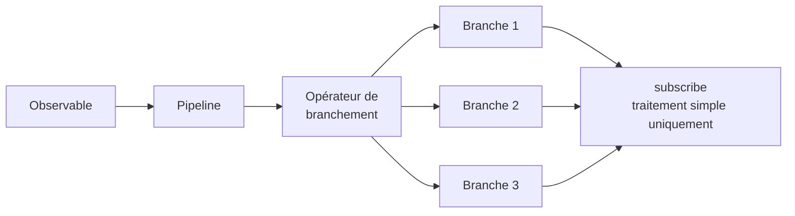
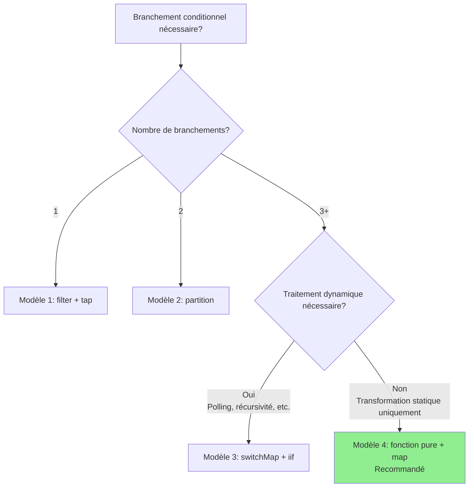

# Modèles de branchement conditionnel dans subscribe

L'un des problèmes courants des développeurs qui commencent à utiliser RxJS est d'effectuer des branchements conditionnels complexes dans le callback de `subscribe()`. Cet article explique pourquoi c'est problématique et comment l'améliorer avec des modèles pratiques.

> [!NOTE] API publique utilisée dans cet article
> Cet article utilise [JSONPlaceholder](https://jsonplaceholder.typicode.com/), une API REST gratuite. Le code est réellement fonctionnel, vous pouvez donc le copier-coller et l'essayer dans le navigateur.
>
> Nous montrons également des modèles de conversion vers des types de réponse API personnalisés (incluant `status`, `errorCode`, etc.), ce qui peut être utile lors de la conversion de réponses d'API externes en types internes dans des projets réels.

## Problème : Branchement conditionnel complexe dans subscribe

Les branchements conditionnels dans subscribe réduisent la lisibilité du code et rendent les tests difficiles. Voyons l'exemple suivant.

### Préparation : Fonction helper pour wrapper l'API JSONPlaceholder

Tout d'abord, définissons une fonction helper qui convertit les réponses de l'API JSONPlaceholder en types personnalisés. Ce modèle peut également être utilisé lors de la conversion d'API externes en types internes dans des projets réels.

```typescript
import { Observable, from, of, map, catchError } from 'rxjs';

/**
 * Type de réponse de l'API JSONPlaceholder
 */
interface Post {
  userId: number;
  id: number;
  title: string;
  body: string;
}

/**
 * Type de réponse API personnalisé
 */
interface ApiResponse<T = any> {
  status: 'success' | 'error' | 'pending';
  data?: T;
  errorCode?: string;
  message?: string;
}

/**
 * Wrapper de l'API JSONPlaceholder, convertit en type de réponse API personnalisé
 *
 * Dans les projets réels, le modèle de conversion des réponses d'API externes en types internes est couramment utilisé.
 * Cela permet de localiser l'impact des changements d'API et d'utiliser des types cohérents dans l'application.
 */
function fetchPost(postId: number = 1): Observable<ApiResponse<Post>> {
  return from(
    fetch(`https://jsonplaceholder.typicode.com/posts/${postId}`)
      .then(response => {
        if (!response.ok) {
          throw new Error(`HTTP error! status: ${response.status}`);
        }
        return response.json();
      })
  ).pipe(
    map((data: Post) => ({
      status: 'success' as const,
      data
    })),
    catchError(err => {
      // Convertir l'erreur en type de réponse personnalisé
      let errorCode = 'UNKNOWN_ERROR';

      if (err.message.includes('404')) {
        errorCode = 'NOT_FOUND';
      } else if (err.message.includes('500')) {
        errorCode = 'SERVER_ERROR';
      } else if (err.message.includes('Failed to fetch')) {
        errorCode = 'NETWORK_ERROR';
      }

      return of({
        status: 'error' as const,
        errorCode,
        message: err.message
      });
    })
  );
}
```

### Exemple d'anti-pattern

L'exemple suivant utilise la fonction helper (`fetchPost`) ci-dessus, mais effectue des branchements conditionnels complexes dans `subscribe()`.

```typescript
/**
 * ❌ Exemple de code problématique
 * Branchements conditionnels complexes dans subscribe
 */
class BadExampleManager {
  loading = false;
  data: Post | null = null;
  errorMessage = '';
  successMessage = '';

  // Callback pour mise à jour UI (optionnel)
  onStateChange?: (state: { loading: boolean; data: Post | null; errorMessage: string; successMessage: string }) => void;

  init(): void {
    this.fetchData();
  }

  fetchData(): void {
    this.loading = true;
    this.updateUI();

    // Récupérer les données de post depuis l'API JSONPlaceholder
    fetchPost(1).subscribe({
      next: response => {
        this.loading = false;

        // ❌ Problème : branchements conditionnels complexes dans subscribe
        if (response.status === 'success') {
          if (response.data) {
            // Validation des données
            if (response.data.title && response.data.body) {
              this.data = response.data;
              this.successMessage = `Post "${response.data.title}" chargé`;
            } else {
              this.errorMessage = 'Le format des données est invalide';
            }
          } else {
            this.errorMessage = 'Pas de données';
          }
        } else if (response.status === 'error') {
          if (response.errorCode === 'NOT_FOUND') {
            this.errorMessage = 'Données introuvables (ID de post inexistant)';
          } else if (response.errorCode === 'NETWORK_ERROR') {
            this.errorMessage = 'Erreur réseau. Vérifiez votre connexion.';
            // Réessayer
            setTimeout(() => this.fetchData(), 5000);
          } else if (response.errorCode === 'SERVER_ERROR') {
            this.errorMessage = 'Une erreur serveur s\'est produite';
          } else {
            this.errorMessage = 'Une erreur s\'est produite';
          }
        } else if (response.status === 'pending') {
          this.errorMessage = 'Traitement en cours. Veuillez patienter.';
          // Polling
          setTimeout(() => this.fetchData(), 3000);
        }
        this.updateUI();
      }
    });
  }

  private updateUI(): void {
    if (this.onStateChange) {
      this.onStateChange({
        loading: this.loading,
        data: this.data,
        errorMessage: this.errorMessage,
        successMessage: this.successMessage
      });
    }
  }
}

// Exemple d'utilisation (exécutable dans la console du navigateur)
const badExample = new BadExampleManager();
badExample.onStateChange = (state) => {
  if (state.loading) console.log('Chargement...');
  if (state.errorMessage) console.error(state.errorMessage);
  if (state.successMessage) console.log(state.successMessage);
  if (state.data) console.log('Données:', state.data);
};
badExample.init();

// Exemple de sortie :
// Chargement...
// Post "sunt aut facere repellat provident occaecati excepturi optio reprehenderit" chargé
// Données: {userId: 1, id: 1, title: "...", body: "..."}
```

### Problèmes de cette implémentation

> [!WARNING] Problèmes dus aux branchements conditionnels dans subscribe
> 1. **Réduction de la lisibilité** - Imbrication profonde, flux de traitement difficile à suivre
> 2. **Difficulté des tests** - La logique dans subscribe est difficile à tester unitairement
> 3. **Manque de réutilisabilité** - Impossible d'utiliser la même logique ailleurs
> 4. **Non déclaratif** - S'écarte du style déclaratif de RxJS
> 5. **Gestion des effets de bord** - Plusieurs changements d'état dispersés, traçage difficile

## Aperçu des solutions

Traitez les branchements conditionnels de subscribe dans le pipeline avec des opérateurs RxJS. Cela rend le code déclaratif et facilite les tests.



Cet article explique les 4 modèles suivants :

1. **Modèle 1** : Branchement avec filter + tap
2. **Modèle 2** : Branchement avec partition
3. **Modèle 3** : Branchement dynamique avec switchMap + iif
4. **Modèle 4** : Transformation avec fonctions + map (recommandé)

## Modèle 1 : Branchement avec filter + tap

La méthode la plus simple consiste à laisser passer uniquement les valeurs qui correspondent à la condition avec `filter` et exécuter les effets de bord avec `tap`.

### Exemple d'implémentation

Cet exemple utilise la fonction `fetchPost()` définie ci-dessus pour récupérer des données depuis l'API JSONPlaceholder.

```typescript
class Pattern1Manager {
  private destroy$ = new Subject<void>();

  loading = false;
  data: Post | null = null;
  errorMessage = '';

  // Callback pour mise à jour UI (optionnel)
  onStateChange?: (state: { loading: boolean; data: Post | null; errorMessage: string }) => void;

  init(): void {
    this.fetchData();
  }

  fetchData(): void {
    this.loading = true;
    this.updateUI();

    fetchPost(1).pipe(
      // ✅ Laisser passer uniquement les réponses de succès
      filter(response => response.status === 'success'),

      // ✅ Validation des données
      filter(response => response.data !== undefined),

      // ✅ Sortie de log (effet de bord)
      tap(response => console.log('Récupération de données réussie:', response.data)),

      // Gestion d'erreurs
      catchError(err => {
        console.error('Erreur:', err);
        this.errorMessage = 'Échec de la récupération des données';
        this.loading = false;
        this.updateUI();
        return of(null);
      }),

      takeUntil(this.destroy$)
    ).subscribe({
      next: response => {
        this.loading = false;

        // ✅ Affectation simple uniquement
        if (response) {
          this.data = response.data;
        }
        this.updateUI();
      }
    });
  }

  private updateUI(): void {
    if (this.onStateChange) {
      this.onStateChange({
        loading: this.loading,
        data: this.data,
        errorMessage: this.errorMessage
      });
    }
  }

  destroy(): void {
    this.destroy$.next();
    this.destroy$.complete();
  }
}

// Exemple d'utilisation (exécutable dans la console du navigateur)
const pattern1 = new Pattern1Manager();
pattern1.onStateChange = (state) => {
  if (state.loading) console.log('Chargement...');
  if (state.errorMessage) console.error(state.errorMessage);
  if (state.data) console.log('Données du post:', state.data);
};
pattern1.init();

// Exemple de sortie :
// Chargement...
// Récupération de données réussie: {userId: 1, id: 1, title: "...", body: "..."}
// Données du post: {userId: 1, id: 1, title: "...", body: "..."}
```

### Avantages et inconvénients

> [!TIP] Caractéristiques du modèle 1
> **Avantages :**
> - Simple et facile à comprendre
> - Filtrage par étapes possible
> - Chaque étape est claire
>
> **Inconvénients :**
> - Pas adapté aux multiples branchements (nécessite de créer un flux pour chaque branchement)
> - Les valeurs filtrées ne peuvent pas être utilisées ultérieurement

## Modèle 2 : Branchement avec partition

Avec `partition`, vous pouvez diviser un Observable en deux flux basés sur une condition.

### Exemple d'implémentation

Cet exemple utilise également la fonction `fetchPost()` pour récupérer des données depuis l'API JSONPlaceholder.

```typescript
/**
 * Définition du type de résultat traité
 */
interface ProcessedResult {
  type: 'success' | 'error';
  data?: Post;
  message: string;
}

class Pattern2Manager {
  private destroy$ = new Subject<void>();

  loading = false;
  result: ProcessedResult | null = null;

  // Callback pour mise à jour UI (optionnel)
  onStateChange?: (state: { loading: boolean; result: ProcessedResult | null }) => void;

  init(): void {
    this.fetchData();
  }

  fetchData(): void {
    this.loading = true;
    this.updateUI();

    const response$ = fetchPost(1).pipe(
      catchError(err => {
        console.error('HTTP Error:', err);
        return EMPTY;
      })
    );

    // ✅ Division en succès et erreur
    const [success$, error$] = partition(
      response$,
      response => response.status === 'success'
    );

    // Traitement du flux de succès
    const successStream$ = success$.pipe(
      map(response => ({
        type: 'success' as const,
        data: response.data,
        message: 'Données récupérées'
      })),
      tap(() => console.log('Traitement de succès terminé'))
    );

    // Traitement du flux d'erreur
    const errorStream$ = error$.pipe(
      map(response => ({
        type: 'error' as const,
        message: this.getErrorMessage(response.errorCode)
      })),
      tap(result => console.log('Traitement d\'erreur terminé:', result.message))
    );

    // ✅ Fusionner les deux flux et s'abonner
    merge(successStream$, errorStream$).pipe(
      takeUntil(this.destroy$)
    ).subscribe({
      next: result => {
        this.loading = false;
        this.result = result;

        // Traitement supplémentaire selon le code d'erreur spécifique
        if (result.type === 'error') {
          this.handleError(result);
        }
        this.updateUI();
      }
    });
  }

  private getErrorMessage(errorCode?: string): string {
    const messages: Record<string, string> = {
      'NOT_FOUND': 'Données introuvables (ID de post inexistant)',
      'NETWORK_ERROR': 'Erreur réseau. Vérifiez votre connexion.',
      'SERVER_ERROR': 'Une erreur serveur s\'est produite'
    };

    return messages[errorCode || ''] || 'Une erreur s\'est produite';
  }

  private handleError(result: ProcessedResult): void {
    // Traitement supplémentaire selon le type d'erreur (redirection vers page de connexion, etc.)
  }

  private updateUI(): void {
    if (this.onStateChange) {
      this.onStateChange({
        loading: this.loading,
        result: this.result
      });
    }
  }

  destroy(): void {
    this.destroy$.next();
    this.destroy$.complete();
  }
}

// Exemple d'utilisation (exécutable dans la console du navigateur)
const pattern2 = new Pattern2Manager();
pattern2.onStateChange = (state) => {
  if (state.loading) console.log('Chargement...');
  if (state.result) {
    console.log(`[${state.result.type}] ${state.result.message}`);
    if (state.result.data) console.log('Données du post:', state.result.data);
  }
};
pattern2.init();

// Exemple de sortie :
// Chargement...
// Traitement de succès terminé
// [success] Données récupérées
// Données du post: {userId: 1, id: 1, title: "...", body: "..."}
```

### Avantages et inconvénients

> [!TIP] Caractéristiques du modèle 2
> **Avantages :**
> - Séparation claire des deux branchements
> - Traitement indépendant possible pour chaque flux
> - Facile à tester
>
> **Inconvénients :**
> - Limité à 2 branchements (pas adapté pour 3 branchements ou plus)
> - Nécessite de s'abonner aux deux flux

## Modèle 3 : Branchement dynamique avec switchMap + iif

Avec `iif`, vous pouvez basculer vers différents Observables selon la condition.

### Exemple d'implémentation

Cet exemple essaie un ID de post inexistant (999) pour montrer le traitement en cas d'erreur.

```typescript
class Pattern3Manager {
  private destroy$ = new Subject<void>();

  loading = false;
  data: Post | null = null;
  statusMessage = '';

  // Callback pour mise à jour UI (optionnel)
  onStateChange?: (state: { loading: boolean; data: Post | null; statusMessage: string }) => void;

  init(): void {
    // Essayer avec un ID de post inexistant (999)
    this.fetchData(999);
  }

  fetchData(postId: number = 1): void {
    this.loading = true;
    this.updateUI();

    fetchPost(postId).pipe(
      // ✅ Brancher le traitement selon le statut de la réponse
      switchMap(response =>
        iif(
          // Condition 1 : succès
          () => response.status === 'success',
          // Traitement en cas de succès
          of(response).pipe(
            map(r => ({ type: 'success' as const, data: r.data })),
            tap(() => console.log('Récupération de données réussie'))
          ),
          // Condition 2 : erreur
          // Convertir en flux d'erreur avec throwError en cas d'erreur
          throwError(() => ({
            message: this.getErrorMessage(response.errorCode),
            errorCode: response.errorCode
          }))
        )
      ),
      retry({
        count: 2,
        delay: 1000 // Réessayer après 1 seconde
      }),
      catchError(err => {
        console.error('Error:', err);
        this.statusMessage = err.message || 'Une erreur s\'est produite';
        this.loading = false;
        this.updateUI();
        return EMPTY;
      }),
      takeUntil(this.destroy$)
    ).subscribe({
      next: result => {
        this.loading = false;

        if (result.type === 'success') {
          this.data = result.data;
          this.statusMessage = '';
        }
        this.updateUI();
      }
    });
  }

  private getErrorMessage(errorCode?: string): string {
    const messages: Record<string, string> = {
      'NOT_FOUND': 'Données introuvables (ID de post inexistant)',
      'NETWORK_ERROR': 'Erreur réseau. Vérifiez votre connexion.',
      'SERVER_ERROR': 'Une erreur serveur s\'est produite'
    };
    return messages[errorCode || ''] || 'Une erreur s\'est produite';
  }

  private updateUI(): void {
    if (this.onStateChange) {
      this.onStateChange({
        loading: this.loading,
        data: this.data,
        statusMessage: this.statusMessage
      });
    }
  }

  destroy(): void {
    this.destroy$.next();
    this.destroy$.complete();
  }
}

// Exemple d'utilisation (exécutable dans la console du navigateur)
const pattern3 = new Pattern3Manager();
pattern3.onStateChange = (state) => {
  if (state.loading) console.log('Chargement...');
  if (state.statusMessage) console.log(state.statusMessage);
  if (state.data) console.log('Données du post:', state.data);
};
pattern3.init();

// Exemple de sortie (lors de l'essai avec l'ID de post inexistant 999) :
// Chargement...
// Error: {...}
// Données introuvables (ID de post inexistant)
//
// En cas d'ID de post normal (1) :
// pattern3.fetchData(1);
// Chargement...
// Récupération de données réussie
// Données du post: {userId: 1, id: 1, title: "...", body: "..."}
```

### Avantages et inconvénients

> [!TIP] Caractéristiques du modèle 3
> **Avantages :**
> - Peut basculer vers différents Observables selon la condition
> - Facile à combiner avec le traitement de retry
> - Adapté aux traitements dynamiques (polling, appels récursifs, etc.)
>
> **Inconvénients :**
> - La lisibilité peut diminuer avec l'imbrication profonde
> - Debugging difficile
> - Difficile à comprendre pour les débutants
>
> **Note :** Cet exemple montre un simple branchement succès/erreur, mais peut également gérer des traitements dynamiques plus complexes comme le polling de traitements asynchrones incluant l'état pending.

## Modèle 4 : Transformation avec fonctions + map (recommandé)

Le modèle le plus recommandé est d'extraire la logique de branchement conditionnel sous forme de fonction pure et de la transformer avec l'opérateur `map`.

### Exemple d'implémentation

Cet exemple définit une fonction pure qui convertit la réponse API retournée par `fetchPost()` en ViewModel pour affichage UI.

```typescript
/**
 * ViewModel pour affichage UI
 */
interface ViewModel {
  loading: boolean;
  displayData: Post | null;
  messageType: 'success' | 'error' | 'info' | null;
  message: string;
  showRetryButton: boolean;
}

/**
 * ✅ Fonction pure : convertit la réponse API en ViewModel
 * Facile à tester et réutilisable
 */
function mapResponseToViewModel(response: ApiResponse<Post>): ViewModel {
  // Traitement de la réponse de succès
  if (response.status === 'success') {
    return {
      loading: false,
      displayData: response.data || null,
      messageType: 'success',
      message: `Post "${response.data?.title}" chargé`,
      showRetryButton: false
    };
  }

  // Traitement de la réponse d'erreur
  if (response.status === 'error') {
    const errorMessages: Record<string, string> = {
      'NOT_FOUND': 'Données introuvables (ID de post inexistant)',
      'NETWORK_ERROR': 'Erreur réseau. Vérifiez votre connexion.',
      'SERVER_ERROR': 'Une erreur serveur s\'est produite. Veuillez réessayer après un moment.'
    };

    const message = errorMessages[response.errorCode || ''] ||
                    response.message ||
                    'Une erreur s\'est produite';

    return {
      loading: false,
      displayData: null,
      messageType: 'error',
      message,
      showRetryButton: isRetryableError(response.errorCode)
    };
  }

  // Traitement de la réponse Pending (ne se produit pas avec l'API JSONPlaceholder mais pour extension future)
  if (response.status === 'pending') {
    return {
      loading: true,
      displayData: null,
      messageType: 'info',
      message: 'Traitement en cours. Veuillez patienter.',
      showRetryButton: false
    };
  }

  // Fallback
  return {
    loading: false,
    displayData: null,
    messageType: 'error',
    message: 'Réponse inconnue',
    showRetryButton: false
  };
}

/**
 * ✅ Fonction pure : détermine si l'erreur est retryable
 */
function isRetryableError(errorCode?: string): boolean {
  const retryableErrors = ['NETWORK_ERROR', 'SERVER_ERROR'];
  return retryableErrors.includes(errorCode || '');
}

/**
 * ✅ Fonction pure : retourne l'effet de bord selon l'erreur spécifique
 */
function getErrorSideEffect(errorCode?: string): (() => void) | null {
  const sideEffects: Record<string, () => void> = {
    'NETWORK_ERROR': () => {
      console.log('Erreur réseau : vérifiez votre connexion');
    },
    'SERVER_ERROR': () => {
      console.log('Erreur serveur : réessayez après un moment');
    }
  };

  return sideEffects[errorCode || ''] || null;
}

class Pattern4Manager {
  private destroy$ = new Subject<void>();

  viewModel: ViewModel = {
    loading: false,
    displayData: null,
    messageType: null,
    message: '',
    showRetryButton: false
  };

  // Callback pour mise à jour UI (optionnel)
  onStateChange?: (viewModel: ViewModel) => void;

  init(): void {
    this.fetchData();
  }

  fetchData(postId: number = 1): void {
    // Définir l'état de chargement initial
    this.viewModel = {
      loading: true,
      displayData: null,
      messageType: null,
      message: '',
      showRetryButton: false
    };
    this.updateUI();

    fetchPost(postId).pipe(
      // ✅ Transformer avec une fonction pure dans le pipeline
      map(response => mapResponseToViewModel(response)),

      // ✅ Exécuter les effets de bord avec tap (séparé des fonctions pures)
      tap(viewModel => {
        console.log('ViewModel:', viewModel);
      }),

      // Gestion d'erreurs
      catchError(err => {
        console.error('HTTP Error:', err);

        const errorViewModel: ViewModel = {
          loading: false,
          displayData: null,
          messageType: 'error',
          message: 'Une erreur réseau s\'est produite',
          showRetryButton: true
        };

        return of(errorViewModel);
      }),

      takeUntil(this.destroy$)
    ).subscribe({
      next: viewModel => {
        // ✅ Affectation simple uniquement dans subscribe
        this.viewModel = viewModel;

        // Exécuter les effets de bord selon l'erreur spécifique
        if (viewModel.messageType === 'error') {
          const sideEffect = getErrorSideEffect(
            // Ici, nous ne conservons pas le errorCode original,
            // donc il faut l'ajouter au ViewModel
          );
          sideEffect?.();
        }
        this.updateUI();
      }
    });
  }

  private updateUI(): void {
    if (this.onStateChange) {
      this.onStateChange(this.viewModel);
    }
  }

  destroy(): void {
    this.destroy$.next();
    this.destroy$.complete();
  }
}

// Exemple d'utilisation (exécutable dans la console du navigateur)
const pattern4 = new Pattern4Manager();
pattern4.onStateChange = (viewModel) => {
  if (viewModel.loading) console.log('Chargement...');
  if (viewModel.message) console.log(`[${viewModel.messageType}] ${viewModel.message}`);
  if (viewModel.displayData) console.log('Données du post:', viewModel.displayData);
  if (viewModel.showRetryButton) console.log('Afficher le bouton de réessai');
};
pattern4.init();

// Exemple de sortie :
// Chargement...
// ViewModel: {loading: false, displayData: {...}, messageType: "success", message: "Post \"...\" chargé", showRetryButton: false}
// [success] Post "sunt aut facere repellat provident occaecati excepturi optio reprehenderit" chargé
// Données du post: {userId: 1, id: 1, title: "...", body: "..."}
```

### Amélioration supplémentaire : Conserver errorCode

Dans l'exemple ci-dessus, `errorCode` n'est pas inclus dans le ViewModel, donc impossible de déterminer l'effet de bord. Voici une version améliorée.

```typescript
/**
 * ViewModel amélioré (conserve errorCode)
 */
interface ImprovedViewModel {
  loading: boolean;
  displayData: Post | null;
  messageType: 'success' | 'error' | 'info' | null;
  message: string;
  showRetryButton: boolean;
  errorCode?: string; // ✅ Conserver le code d'erreur
}

/**
 * Fonction de mapping améliorée
 */
function mapResponseToImprovedViewModel(response: ApiResponse<Post>): ImprovedViewModel {
  if (response.status === 'success') {
    return {
      loading: false,
      displayData: response.data || null,
      messageType: 'success',
      message: `Post "${response.data?.title}" chargé`,
      showRetryButton: false
    };
  }

  if (response.status === 'error') {
    const errorMessages: Record<string, string> = {
      'NOT_FOUND': 'Données introuvables (ID de post inexistant)',
      'NETWORK_ERROR': 'Erreur réseau. Vérifiez votre connexion.',
      'SERVER_ERROR': 'Une erreur serveur s\'est produite'
    };

    return {
      loading: false,
      displayData: null,
      messageType: 'error',
      message: errorMessages[response.errorCode || ''] || 'Une erreur s\'est produite',
      showRetryButton: isRetryableError(response.errorCode),
      errorCode: response.errorCode // ✅ Conserver le code d'erreur
    };
  }

  if (response.status === 'pending') {
    return {
      loading: true,
      displayData: null,
      messageType: 'info',
      message: 'Traitement en cours',
      showRetryButton: false
    };
  }

  return {
    loading: false,
    displayData: null,
    messageType: 'error',
    message: 'Réponse inconnue',
    showRetryButton: false
  };
}

class ImprovedPattern4Manager {
  private destroy$ = new Subject<void>();
  viewModel: ImprovedViewModel = {
    loading: false,
    displayData: null,
    messageType: null,
    message: '',
    showRetryButton: false
  };

  // Callback pour mise à jour UI (optionnel)
  onStateChange?: (viewModel: ImprovedViewModel) => void;

  init(): void {
    this.fetchData();
  }

  fetchData(postId: number = 1): void {
    fetchPost(postId).pipe(
      map(response => mapResponseToImprovedViewModel(response)),
      tap(viewModel => console.log('ViewModel:', viewModel)),
      catchError(err => {
        console.error('HTTP Error:', err);
        return of({
          loading: false,
          displayData: null,
          messageType: 'error' as const,
          message: 'Erreur réseau',
          showRetryButton: true
        });
      }),
      takeUntil(this.destroy$)
    ).subscribe({
      next: viewModel => {
        this.viewModel = viewModel;

        // ✅ Exécuter les effets de bord selon le code d'erreur
        if (viewModel.errorCode) {
          const sideEffect = getErrorSideEffect(viewModel.errorCode);
          sideEffect?.();
        }
        this.updateUI();
      }
    });
  }

  private updateUI(): void {
    if (this.onStateChange) {
      this.onStateChange(this.viewModel);
    }
  }

  destroy(): void {
    this.destroy$.next();
    this.destroy$.complete();
  }
}

// Exemple d'utilisation (exécutable dans la console du navigateur)
const improvedPattern4 = new ImprovedPattern4Manager();
improvedPattern4.onStateChange = (viewModel) => {
  if (viewModel.loading) console.log('Chargement...');
  if (viewModel.message) console.log(`[${viewModel.messageType}] ${viewModel.message}`);
  if (viewModel.displayData) console.log('Données du post:', viewModel.displayData);
};
improvedPattern4.init();

// Exemple de sortie :
// ViewModel: {loading: false, displayData: {...}, messageType: "success", message: "...", showRetryButton: false}
// [success] Post "sunt aut facere repellat provident occaecati excepturi optio reprehenderit" chargé
// Données du post: {userId: 1, id: 1, title: "...", body: "..."}
```

### Avantages et inconvénients

> [!TIP] Caractéristiques du modèle 4 (recommandé)
> **Avantages :**
> - **Tests faciles** : Fonction pure donc tests unitaires simples
> - **Réutilisable** : Même logique utilisable dans d'autres composants
> - **Haute lisibilité** : Logique de transformation clairement séparée
> - **Type-safe** : Inférence de type TypeScript efficace
> - **Haute maintenabilité** : Portée de l'impact claire lors des changements de logique
>
> **Inconvénients :**
> - Augmentation de la quantité de code (mais compromis avec la clarté)

## Exemple pratique : Implémentation complète du traitement de réponse API

Exemple d'implémentation pratique combinant les modèles présentés jusqu'ici. Implémentation utilisant l'API JSONPlaceholder.

```typescript
/**
 * Définition du type ViewModel
 */
interface DataViewModel<T = any> {
  loading: boolean;
  data: T | null;
  error: {
    message: string;
    code?: string;
    retryable: boolean;
  } | null;
  info: string | null;
}

/**
 * Service de récupération de données
 */
class DataService {

  /**
   * Récupération de données (avec retry automatique)
   */
  fetchData<T>(postId: number = 1): Observable<DataViewModel<T>> {
    return fetchPost(postId).pipe(

      // Convertir la réponse en ViewModel
      map(response => this.mapToViewModel<T>(response)),

      // Gestion des erreurs HTTP
      catchError((err: Error) =>
        of(this.createErrorViewModel<T>(err))
      ),

      // Retry automatique pour les erreurs retryable
      retry({
        count: 2,
        delay: 1000 // Réessayer après 1 seconde
      })
    );
  }

  /**
   * Convertir la réponse API en ViewModel (fonction pure)
   */
  private mapToViewModel<T>(response: ApiResponse<T>): DataViewModel<T> {
    if (response.status === 'success') {
      return {
        loading: false,
        data: response.data || null,
        error: null,
        info: null
      };
    }

    if (response.status === 'error') {
      return {
        loading: false,
        data: null,
        error: {
          message: this.getErrorMessage(response.errorCode, response.message),
          code: response.errorCode,
          retryable: this.isRetryableError(response.errorCode)
        },
        info: null
      };
    }

    // Pending (ne se produit pas avec l'API JSONPlaceholder mais pour extension future)
    return {
      loading: true,
      data: null,
      error: null,
      info: 'Traitement en cours...'
    };
  }

  /**
   * Créer un ViewModel à partir d'une erreur HTTP
   */
  private createErrorViewModel<T>(err: Error): DataViewModel<T> {
    return {
      loading: false,
      data: null,
      error: {
        message: err.message || 'Une erreur s\'est produite',
        code: 'FETCH_ERROR',
        retryable: true
      },
      info: null
    };
  }

  /**
   * Obtenir le message d'erreur
   */
  private getErrorMessage(errorCode?: string, fallbackMessage?: string): string {
    const messages: Record<string, string> = {
      'NOT_FOUND': 'Données introuvables (ID de post inexistant)',
      'NETWORK_ERROR': 'Erreur réseau. Vérifiez votre connexion.',
      'SERVER_ERROR': 'Une erreur serveur s\'est produite'
    };

    return messages[errorCode || ''] || fallbackMessage || 'Une erreur s\'est produite';
  }

  /**
   * Déterminer si l'erreur est retryable
   */
  private isRetryableError(errorCode?: string): boolean {
    const retryable = ['NETWORK_ERROR', 'SERVER_ERROR'];
    return retryable.includes(errorCode || '');
  }
}

/**
 * Gestionnaire d'affichage de données
 */
class DataDisplayManager {
  private destroy$ = new Subject<void>();
  private dataService = new DataService();

  viewModel: DataViewModel = {
    loading: false,
    data: null,
    error: null,
    info: null
  };

  // Callback pour mise à jour UI (optionnel)
  onStateChange?: (viewModel: DataViewModel) => void;

  init(): void {
    this.loadData();
  }

  loadData(postId: number = 1): void {
    this.viewModel = {
      loading: true,
      data: null,
      error: null,
      info: null
    };
    this.updateUI();

    this.dataService.fetchData(postId).pipe(
      takeUntil(this.destroy$)
    ).subscribe({
      next: viewModel => {
        // ✅ Affectation simple uniquement dans subscribe
        this.viewModel = viewModel;
        this.updateUI();
      }
    });
  }

  private updateUI(): void {
    if (this.onStateChange) {
      this.onStateChange(this.viewModel);
    }
  }

  destroy(): void {
    this.destroy$.next();
    this.destroy$.complete();
  }
}

// Exemple d'utilisation (exécutable dans la console du navigateur)
const dataDisplay = new DataDisplayManager();
dataDisplay.onStateChange = (viewModel) => {
  if (viewModel.loading) console.log('Chargement...');
  if (viewModel.error) {
    console.error(viewModel.error.message);
    if (viewModel.error.retryable) console.log('Retry possible');
  }
  if (viewModel.info) console.log(viewModel.info);
  if (viewModel.data) console.log('Données du post:', viewModel.data);
};
dataDisplay.init();

// Exemple de sortie :
// Chargement...
// Données du post: {userId: 1, id: 1, title: "...", body: "..."}
//
// Exemple en cas d'erreur (ID de post inexistant 999) :
// dataDisplay.loadData(999);
// Chargement...
// Données introuvables (ID de post inexistant)
// Retry possible
```

> [!IMPORTANT] Points du modèle pratique
> 1. **Transformation dans la couche service** : Effectuer la conversion de la réponse API vers le ViewModel dans la couche service
> 2. **Utilisation de fonctions pures** : Extraire la logique de branchement conditionnel sous forme de fonction pure
> 3. **Simplicité dans subscribe** : Effectuer uniquement l'affectation lors de l'abonnement
> 4. **Centralisation de la gestion d'erreurs** : Compléter le traitement des erreurs dans le pipeline
> 5. **Garantie de type-safety** : Assurer la sécurité avec la définition de type du ViewModel

## Guide de sélection

Guide par scénario pour choisir le modèle approprié.



### Critères de sélection du modèle

| Scénario | Modèle recommandé | Raison |
|---------|------------|------|
| Filtrage simple | Modèle 1 (filter + tap) | Simple et facile à comprendre |
| 2 branchements succès/échec | Modèle 2 (partition) | Séparation claire possible |
| Polling / Retry | Modèle 3 (switchMap + iif) | Adapté aux traitements dynamiques |
| Branchements conditionnels complexes | Modèle 4 (fonction pure + map) | Testable, réutilisable |
| Gestion d'état nécessaire | Modèle 4 (fonction pure + map) | Adapté au modèle ViewModel |

> [!TIP] En cas de doute, choisir **Modèle 4 (fonction pure + map)**
> - Maintenabilité la plus élevée
> - Tests faciles
> - Adapté au développement en équipe
> - Bonne compatibilité avec le système de types TypeScript

## Résumé

Effectuer des branchements conditionnels complexes dans subscribe est un anti-pattern de RxJS. En utilisant les 4 modèles présentés dans cet article, vous pouvez écrire du code déclaratif et facile à maintenir.

### Principes importants

> [!IMPORTANT] Principes pour éviter les branchements conditionnels dans subscribe
> 1. **Traiter la logique dans le pipeline** - Compléter la transformation avant subscribe
> 2. **Utiliser des fonctions pures** - Extraire la logique de branchement conditionnel sous forme de fonction
> 3. **Adopter le modèle ViewModel** - Convertir vers un modèle pour affichage UI
> 4. **Séparer les effets de bord avec tap** - Séparer clairement la transformation pure et les effets de bord
> 5. **Garantir la type-safety** - Utiliser au maximum le système de types TypeScript

### Comparaison Before / After

**Before (Anti-pattern) :**
```typescript
observable$.subscribe(value => {
  if (value.status === 'success') {
    if (value.data) {
      this.data = value.data;
    }
  } else if (value.status === 'error') {
    if (value.errorCode === 'AUTH_ERROR') {
      // ...
    } else if (value.errorCode === 'NOT_FOUND') {
      // ...
    }
  }
});
```

**After (Modèle recommandé) :**
```typescript
observable$.pipe(
  map(response => mapToViewModel(response)),
  tap(viewModel => console.log('Processed:', viewModel))
).subscribe(viewModel => {
  this.viewModel = viewModel;
});
```

### Sections connexes

- **[Recueil d'anti-patterns RxJS](/fr/guide/anti-patterns/)** - Erreurs courantes et solutions
- **[Gestion d'erreurs](/fr/guide/error-handling/strategies.md)** - Fondamentaux du traitement d'erreurs
- **[Modèles d'appels API](/fr/guide/practical-patterns/api-calls.md)** - Modèles pratiques de communication API
- **[Modèles de traitement de formulaires](/fr/guide/practical-patterns/form-handling.md)** - Branchements conditionnels dans les formulaires

## Code de test

Exemple de test pour le modèle 4 (fonction pure + map).

```typescript
describe('mapResponseToViewModel', () => {
  it('should map success response correctly', () => {
    const response: ApiResponse = {
      status: 'success',
      data: { id: 1, name: 'Test' }
    };

    const result = mapResponseToViewModel(response);

    expect(result.loading).toBe(false);
    expect(result.displayData).toEqual({ id: 1, name: 'Test' });
    expect(result.messageType).toBe('success');
    expect(result.showRetryButton).toBe(false);
  });

  it('should map error response with retryable error', () => {
    const response: ApiResponse = {
      status: 'error',
      errorCode: 'RATE_LIMIT'
    };

    const result = mapResponseToViewModel(response);

    expect(result.loading).toBe(false);
    expect(result.displayData).toBeNull();
    expect(result.messageType).toBe('error');
    expect(result.showRetryButton).toBe(true); // RATE_LIMIT est retryable
  });

  it('should map error response with non-retryable error', () => {
    const response: ApiResponse = {
      status: 'error',
      errorCode: 'NOT_FOUND'
    };

    const result = mapResponseToViewModel(response);

    expect(result.showRetryButton).toBe(false); // NOT_FOUND n'est pas retryable
  });

  it('should map pending response', () => {
    const response: ApiResponse = {
      status: 'pending'
    };

    const result = mapResponseToViewModel(response);

    expect(result.loading).toBe(true);
    expect(result.messageType).toBe('info');
  });
});

describe('isRetryableError', () => {
  it('should identify retryable errors', () => {
    expect(isRetryableError('RATE_LIMIT')).toBe(true);
    expect(isRetryableError('TIMEOUT')).toBe(true);
    expect(isRetryableError('SERVER_ERROR')).toBe(true);
  });

  it('should identify non-retryable errors', () => {
    expect(isRetryableError('NOT_FOUND')).toBe(false);
    expect(isRetryableError('AUTH_ERROR')).toBe(false);
    expect(isRetryableError('VALIDATION_ERROR')).toBe(false);
  });
});
```

> [!TIP] Raisons pour lesquelles les tests de fonctions pures sont faciles
> - Ne dépendent pas de l'état externe
> - Même entrée retourne toujours la même sortie
> - Pas d'effets de bord
> - Pas besoin de mocks ou spies

## Ressources de référence

Ressources d'apprentissage supplémentaires pour éviter les branchements conditionnels dans subscribe.

- [Documentation officielle RxJS - Operators](https://rxjs.dev/guide/operators) - Utilisation des opérateurs
- [Learn RxJS - Transformation Operators](https://www.learnrxjs.io/learn-rxjs/operators/transformation) - Détails des opérateurs de transformation
- [Learn RxJS - partition](https://www.learnrxjs.io/learn-rxjs/operators/transformation/partition) - Exemples d'utilisation de partition
- [RxJS Best Practices](https://blog.angular-university.io/rxjs-best-practices/) - Meilleures pratiques RxJS
