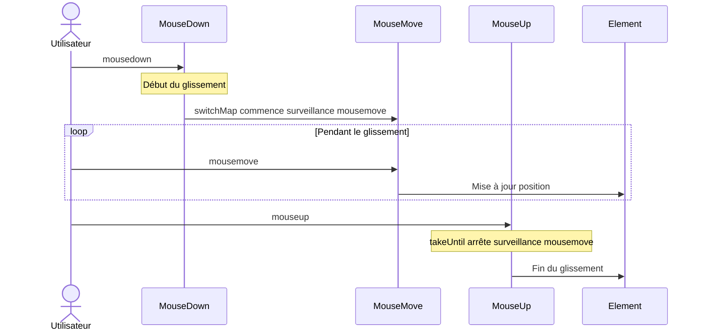
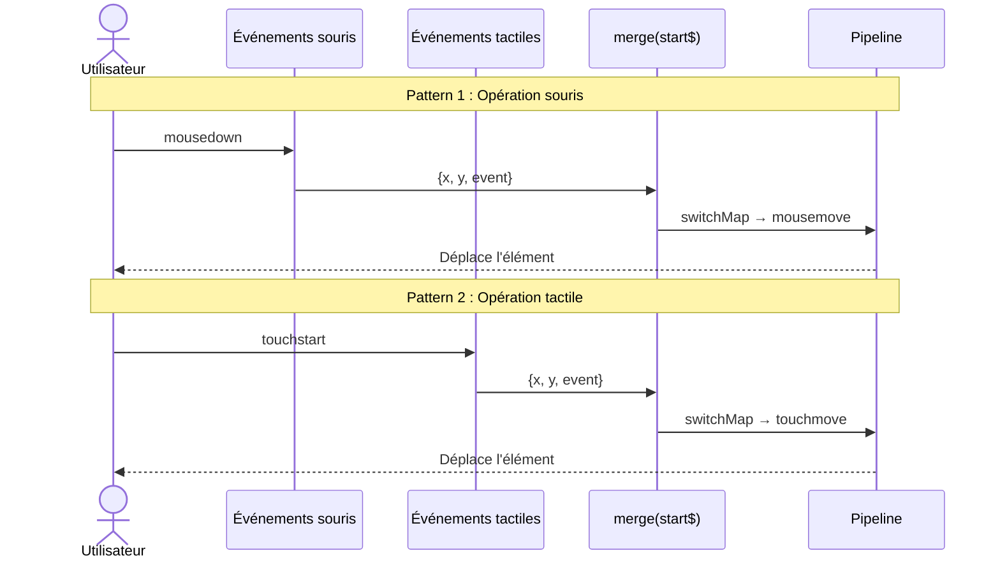

# Modèles de traitement d'événements UI

Le traitement d'événements UI est l'un des défis les plus fréquemment rencontrés dans le développement frontend. En utilisant RxJS, vous pouvez implémenter le traitement d'événements complexe de manière déclarative et intuitive.

Cet article explique les modèles concrets de traitement d'événements UI nécessaires dans la pratique professionnelle, tels que les clics, défilements, drag & drop et saisie clavier.

## Ce que vous apprendrez dans cet article

- Contrôle d'événements de clic (throttle, debounce, distinct)
- Traitement efficace d'événements de défilement
- Implémentation de drag & drop
- Saisie clavier et autocomplétion
- Support multi-touch
- Combinaison d'événements composites

> [!TIP] Prérequis
> Cet article suppose une connaissance de [Chapitre 4: Opérateurs](../operators/index.md). La compréhension de `debounceTime`, `throttleTime`, `distinctUntilChanged` est particulièrement importante.

## Traitement d'événements de clic

### Problème : Exécution excessive du traitement par clics rapides

Lorsqu'un bouton est cliqué rapidement plusieurs fois, le traitement est exécuté à chaque fois, causant des problèmes de performance et des bugs.

### Solution 1 : Contrôler avec throttleTime

Traiter uniquement le premier clic dans un intervalle de temps donné.

```typescript
import { fromEvent, throttleTime } from 'rxjs';
const button = document.createElement('button');
button.id = 'submit-button';
button.innerText = 'submit';
document.body.appendChild(button);

if (button) {
  fromEvent(button, 'click').pipe(
    throttleTime(1000) // Traiter une seule fois par seconde
  ).subscribe(() => {
    console.log('Exécution du traitement de soumission');
    submitForm();
  });
}

function submitForm(): void {
  console.log('Envoi du formulaire...');
  // Appel API, etc.
}
```

#### Flux d'exécution

```
Clics utilisateur : ●    ●●●        ●  ●●
                    |    |          |  |
throttleTime(1000): ●              ●
                    |              |
                 Traitement     Traitement
```

> [!NOTE] Caractéristiques de throttleTime
> - Traite le **premier événement** et ignore les événements suivants pendant un certain temps
> - Adapté lorsque la réactivité en temps réel est importante (défilement, redimensionnement, etc.)

### Solution 2 : Contrôler avec debounceTime

Traiter après un certain temps une fois que les événements se sont arrêtés.

```typescript
import { fromEvent, debounceTime } from 'rxjs';
// Approche traditionnelle (commentée pour référence)
// const searchInput = document.querySelector<HTMLInputElement>('#search');

// Auto-contenu : crée l'input dynamiquement
const searchInput = document.createElement('input');
searchInput.id = 'search';
searchInput.type = 'text';
searchInput.placeholder = 'Entrez un mot-clé de recherche...';
searchInput.style.padding = '8px';
searchInput.style.margin = '10px';
searchInput.style.width = '300px';
document.body.appendChild(searchInput);

fromEvent(searchInput, 'input').pipe(
  debounceTime(300) // Attendre 300ms après l'arrêt de la saisie
).subscribe((event) => {
  const value = (event.target as HTMLInputElement).value;
  console.log('Exécution de la recherche:', value);
  performSearch(value);
});

function performSearch(query: string): void {
  console.log('Recherche en cours...', query);
  // Appel API de recherche
}
```

#### Flux d'exécution

```
Saisie utilisateur :  ●●●●●     ●●        ●●●●
                      |            |      |
debounceTime(300):   300ms       300ms  300ms attente
                      |            |      |
                  Traitement   Traitement Traitement
```

> [!NOTE] Caractéristiques de debounceTime
> - Attend un certain temps après le **dernier événement** avant de traiter
> - Adapté pour recherche, autocomplétion, validation en temps réel

### throttleTime vs debounceTime - Comment choisir

| Cas d'usage | Opérateur à utiliser | Raison |
|-----|-------------------|------|
| **Saisie de recherche** | `debounceTime` | Rechercher après arrêt de la saisie |
| **Autocomplétion** | `debounceTime` | Afficher les suggestions après arrêt de saisie |
| **Événement de défilement** | `throttleTime` | Traiter périodiquement pendant le défilement |
| **Redimensionnement de fenêtre** | `throttleTime` or `debounceTime` | Selon les besoins |
| **Prévention de clics rapides** | `throttleTime` or `exhaustMap` | Traiter immédiatement le premier clic |

### Solution 3 : Éliminer les doublons avec distinctUntilChanged

Comparer avec la valeur précédente et ignorer le traitement si la même valeur se répète.

```typescript
import { fromEvent, map, debounceTime, distinctUntilChanged } from 'rxjs';
const searchInput = document.createElement('input');
searchInput.id = 'search';
searchInput.type = 'text';
searchInput.placeholder = 'Entrez un mot-clé de recherche...';
searchInput.style.padding = '8px';
searchInput.style.margin = '10px';
searchInput.style.width = '300px';
document.body.appendChild(searchInput);

fromEvent(searchInput, 'input').pipe(
  map(event => (event.target as HTMLInputElement).value.trim()),
  debounceTime(300),
  distinctUntilChanged() // Ignorer si même valeur que précédemment
).subscribe(query => {
  console.log('Exécution de la recherche:', query);
  performSearch(query);
});
```

#### Exemple d'exécution

```typescript
// Saisie utilisateur : "RxJS" → Backspace → "RxJS"
// Sans distinctUntilChanged : recherche exécutée 2 fois
// Avec distinctUntilChanged : recherche exécutée 1 fois seulement (2ème ignorée car même valeur)
```

> [!TIP] Meilleures pratiques
> Pour l'implémentation de recherche et autocomplétion, il est recommandé d'utiliser les 3 opérateurs ensemble :
> 1. `debounceTime()` - Attendre l'arrêt de saisie
> 2. `distinctUntilChanged()` - Éliminer les doublons
> 3. `switchMap()` - Annuler les anciennes requêtes

## Traitement d'événements de défilement

### Problème : Déclenchement excessif d'événements de défilement

Les événements de défilement se déclenchent très fréquemment, causant des problèmes de performance s'ils sont traités tels quels.

### Solution : Réduire avec throttleTime

```typescript
import { fromEvent, throttleTime, map } from 'rxjs';
const scrollContainer = document.createElement('div');
scrollContainer.id = 'scroll-container';
scrollContainer.style.width = '400px';
scrollContainer.style.height = '300px';
scrollContainer.style.overflow = 'auto';
scrollContainer.style.border = '1px solid #ccc';
scrollContainer.style.margin = '10px';
scrollContainer.style.padding = '10px';

// Ajouter du contenu pour le rendre défilable
scrollContainer.innerHTML = Array.from({ length: 100 }, (_, i) =>
  `<p>Élément ${i + 1}</p>`
).join('');

document.body.appendChild(scrollContainer);

fromEvent(scrollContainer, 'scroll').pipe(
  throttleTime(100), // Traiter une seule fois toutes les 100ms
  map(() => ({
    scrollTop: scrollContainer.scrollTop,
    scrollHeight: scrollContainer.scrollHeight,
    clientHeight: scrollContainer.clientHeight
  }))
).subscribe(({ scrollTop, scrollHeight, clientHeight }) => {
  // Calcul de la position de défilement
  const scrollPercentage = (scrollTop / (scrollHeight - clientHeight)) * 100;
  console.log(`Position de défilement : ${scrollPercentage.toFixed(1)}%`);

  // Défilement infini : charger la page suivante à 90%+ de défilement
  if (scrollPercentage > 90) {
    console.log('Chargement de la page suivante...');
    loadMoreItems();
  }
});

function loadMoreItems(): void {
  console.log('Récupération de données supplémentaires');
}
```

### Exemple pratique : Détection de la direction de défilement

```typescript
import { fromEvent, BehaviorSubject, throttleTime, map, pairwise, distinctUntilChanged } from 'rxjs';
type ScrollDirection = 'up' | 'down' | 'none';

const scrollDirection$ = new BehaviorSubject<ScrollDirection>('none');

// Créer dynamiquement l'élément d'en-tête
const header = document.createElement('div');
header.id = 'header';
header.innerText = 'En-tête (afficher/masquer au défilement)';
header.style.position = 'fixed';
header.style.top = '0';
header.style.left = '0';
header.style.width = '100%';
header.style.padding = '20px';
header.style.background = '#333';
header.style.color = '#fff';
header.style.transition = 'transform 0.3s';
document.body.appendChild(header);

// Ajouter du contenu de défilement
const scrollContent = document.createElement('div');
scrollContent.style.marginTop = '80px';
scrollContent.innerHTML = Array.from({ length: 100 }, (_, i) =>
  `<p>Contenu ${i + 1}</p>`
).join('');
document.body.appendChild(scrollContent);

fromEvent(window, 'scroll').pipe(
  throttleTime(100),
  map(() => window.scrollY),
  pairwise(), // Obtenir les valeurs précédentes et actuelles en paire
  map(([prev, curr]) => {
    if (curr > prev) return 'down';
    if (curr < prev) return 'up';
    return 'none';
  }),
  distinctUntilChanged() // Notifier uniquement lorsque la direction change
).subscribe(direction => {
  scrollDirection$.next(direction);
  console.log('Direction de défilement:', direction);

  // Basculer l'affichage de l'en-tête
  if (direction === 'down') {
    header.style.transform = 'translateY(-100%)';
  } else if (direction === 'up') {
    header.style.transform = 'translateY(0)';
  }
});
```

> [!TIP] Utilisation de pairwise
> `pairwise()` est un opérateur pratique pour obtenir les valeurs précédentes et actuelles en paire. Utile pour la direction de défilement, détection d'augmentation/diminution, calcul de différence, etc.

## Implémentation de drag & drop

### Problème : Combinaison complexe d'événements souris

Le drag & drop est une combinaison complexe d'événements mousedown → mousemove → mouseup.

### Solution : Combiner plusieurs Observables

```typescript
import { fromEvent, merge, map, switchMap, takeUntil, tap } from 'rxjs';
interface Position {
  x: number;
  y: number;
}

const draggableElement = document.createElement('div');
draggableElement.id = 'draggable';
draggableElement.innerText = 'Faites-moi glisser';
draggableElement.style.position = 'absolute';
draggableElement.style.left = '100px';
draggableElement.style.top = '100px';
draggableElement.style.width = '150px';
draggableElement.style.height = '150px';
draggableElement.style.padding = '20px';
draggableElement.style.background = '#4CAF50';
draggableElement.style.color = '#fff';
draggableElement.style.cursor = 'move';
draggableElement.style.userSelect = 'none';
draggableElement.style.display = 'flex';
draggableElement.style.alignItems = 'center';
draggableElement.style.justifyContent = 'center';
document.body.appendChild(draggableElement);

const mouseDown$ = fromEvent<MouseEvent>(draggableElement, 'mousedown');
const mouseMove$ = fromEvent<MouseEvent>(document, 'mousemove');
const mouseUp$ = fromEvent<MouseEvent>(document, 'mouseup');

// Obtenir la position de l'élément au début du glissement
let initialX = 0;
let initialY = 0;

mouseDown$.pipe(
  tap((event: MouseEvent) => {
    event.preventDefault();
    // Enregistrer la position actuelle de l'élément
    const rect = draggableElement.getBoundingClientRect();
    initialX = rect.left;
    initialY = rect.top;

    // Différence avec la position de la souris au début du glissement
    initialX = rect.left - event.clientX;
    initialY = rect.top - event.clientY;

    draggableElement.style.opacity = '0.7';
  }),
  switchMap(() =>
    // Lorsque mousedown se produit, commencer à surveiller mousemove
    mouseMove$.pipe(
      map((event: MouseEvent): Position => ({
        x: event.clientX + initialX,
        y: event.clientY + initialY
      })),
      // Arrêter la surveillance à mouseup ou mouseleave
      takeUntil(
        merge(
          mouseUp$,
          fromEvent(document, 'mouseleave')
        ).pipe(
          tap(() => {
            draggableElement.style.opacity = '1';
          })
        )
      )
    )
  )
).subscribe((position: Position) => {
  // Déplacer l'élément
  draggableElement.style.left = `${position.x}px`;
  draggableElement.style.top = `${position.y}px`;
});
```

#### Flux d'événements



> [!IMPORTANT] Points importants du drag & drop
> - `switchMap` pour démarrer la surveillance mousedown → mousemove
> - `takeUntil` pour arrêter la surveillance à mouseup
> - `preventDefault()` pour désactiver le comportement de glissement par défaut
> - `classList.add/remove` pour un retour visuel

### Support des appareils tactiles

```typescript
import { fromEvent, merge, map, switchMap, takeUntil, tap } from 'rxjs';
const draggableElement = document.createElement('div');
draggableElement.id = 'draggable';
draggableElement.innerText = 'Faites-moi glisser\n(souris et tactile)';
draggableElement.style.position = 'absolute';
draggableElement.style.left = '100px';
draggableElement.style.top = '100px';
draggableElement.style.width = '150px';
draggableElement.style.height = '150px';
draggableElement.style.padding = '20px';
draggableElement.style.background = '#2196F3';
draggableElement.style.color = '#fff';
draggableElement.style.cursor = 'move';
draggableElement.style.userSelect = 'none';
draggableElement.style.display = 'flex';
draggableElement.style.alignItems = 'center';
draggableElement.style.justifyContent = 'center';
draggableElement.style.textAlign = 'center';
draggableElement.style.whiteSpace = 'pre-line';
document.body.appendChild(draggableElement);

// Intégrer événements souris et tactiles
const start$ = merge(
  fromEvent<MouseEvent>(draggableElement, 'mousedown').pipe(
    map(e => ({ x: e.clientX, y: e.clientY, event: e }))
  ),
  fromEvent<TouchEvent>(draggableElement, 'touchstart').pipe(
    map(e => ({
      x: e.touches[0].clientX,
      y: e.touches[0].clientY,
      event: e
    }))
  )
);

const move$ = merge(
  fromEvent<MouseEvent>(document, 'mousemove').pipe(
    map(e => ({ x: e.clientX, y: e.clientY }))
  ),
  fromEvent<TouchEvent>(document, 'touchmove').pipe(
    map(e => ({
      x: e.touches[0].clientX,
      y: e.touches[0].clientY
    }))
  )
);

const end$ = merge(
  fromEvent(document, 'mouseup'),
  fromEvent(document, 'touchend')
);

let initialOffsetX = 0;
let initialOffsetY = 0;

start$.pipe(
  tap(({ x, y, event }) => {
    event.preventDefault();
    const rect = draggableElement.getBoundingClientRect();
    initialOffsetX = rect.left - x;
    initialOffsetY = rect.top - y;
    draggableElement.style.opacity = '0.7';
  }),
  switchMap(() =>
    move$.pipe(
      map(({ x, y }) => ({
        x: x + initialOffsetX,
        y: y + initialOffsetY
      })),
      takeUntil(
        end$.pipe(
          tap(() => {
            draggableElement.style.opacity = '1';
          })
        )
      )
    )
  )
).subscribe(({ x, y }) => {
  draggableElement.style.left = `${x}px`;
  draggableElement.style.top = `${y}px`;
});
```

> [!TIP] Support multi-appareils
> En intégrant les événements souris et tactiles avec `merge`, vous pouvez implémenter un drag & drop qui fonctionne sur PC/tablette/smartphone.

#### Comparaison du flux d'événements



Ce diagramme de séquence montre que les événements souris et tactiles sont intégrés dans le même pipeline et fonctionnent de la même manière quel que soit l'appareil.

## Saisie clavier et autocomplétion

### Problème : Appels API excessifs pendant la saisie

Lors de la saisie dans une boîte de recherche, si des appels API sont faits à chaque fois, cela crée un problème de performance.

Par exemple, si l'utilisateur tape "RxJS",
- `R` → Appel API
- `Rx` → Appel API
- `RxJ` → Appel API
- `RxJS` → Appel API

4 caractères saisis entraînent 4 appels API. C'est très gaspilleur et charge le serveur.

### Solution : debounceTime + switchMap

Pour implémenter efficacement l'autocomplétion, combinez ces 3 opérateurs :

1. **debounceTime(300)** - Attendre 300ms après l'arrêt de saisie
2. **distinctUntilChanged()** - Ignorer si même valeur que précédemment (éviter requêtes inutiles)
3. **switchMap()** - Annuler anciennes requêtes si nouvelle saisie

Avec cette combinaison, même si l'utilisateur tape rapidement "RxJS", l'API n'est appelée qu'une fois après l'arrêt de saisie.

```typescript
import { fromEvent, of, map, debounceTime, distinctUntilChanged, switchMap, catchError } from 'rxjs';
interface SearchResult {
  id: number;
  title: string;
  description: string;
}

const searchInput = document.createElement('input');
searchInput.id = 'search';
searchInput.type = 'text';
searchInput.placeholder = 'Recherche autocomplétion...';
searchInput.style.padding = '10px';
searchInput.style.margin = '10px';
searchInput.style.width = '400px';
searchInput.style.fontSize = '16px';
document.body.appendChild(searchInput);

const resultsContainer = document.createElement('div');
resultsContainer.id = 'results';
resultsContainer.style.margin = '10px';
resultsContainer.style.padding = '10px';
resultsContainer.style.border = '1px solid #ddd';
resultsContainer.style.width = '400px';
resultsContainer.style.minHeight = '100px';
document.body.appendChild(resultsContainer);

fromEvent(searchInput, 'input').pipe(
  map(event => (event.target as HTMLInputElement).value.trim()),
  debounceTime(300),           // Attendre 300ms après arrêt de saisie
  distinctUntilChanged(),      // Ignorer si même valeur que précédemment
  switchMap(query => {
    if (query.length < 2) {
      return of([]); // Tableau vide si moins de 2 caractères
    }

    console.log('Exécution recherche:', query);
    return searchAPI(query).pipe(
      catchError(err => {
        console.error('Erreur recherche:', err);
        return of([]);
      })
    );
  })
).subscribe(results => {
  displayResults(results);
});

// API de recherche (mock)
function searchAPI(query: string) {
  return of([
    { id: 1, title: `Résultat 1: ${query}`, description: 'Description 1' },
    { id: 2, title: `Résultat 2: ${query}`, description: 'Description 2' },
    { id: 3, title: `Résultat 3: ${query}`, description: 'Description 3' }
  ]);
}

function displayResults(results: SearchResult[]): void {
  if (results.length === 0) {
    resultsContainer.innerHTML = '<p>Aucun résultat trouvé</p>';
    return;
  }

  resultsContainer.innerHTML = results
    .map(
      r => `
      <div class="result-item" style="padding: 10px; border-bottom: 1px solid #eee;">
        <h3 style="margin: 0 0 5px 0;">${r.title}</h3>
        <p style="margin: 0; color: #666;">${r.description}</p>
      </div>
    `
    )
    .join('');
}
```

#### Explication détaillée du fonctionnement

Expliquons comment chaque étape de ce code fonctionne avec un exemple concret.

**Chronologie lorsque l'utilisateur tape rapidement "RxJS" :**

```
Temps | Événement              | Traitement du pipeline
------|------------------------|---------------------------
0ms   | Saisie 'R'            | Début d'attente debounceTime
50ms  | Saisie 'Rx'           | Annulation attente précédente, nouvelle attente
100ms | Saisie 'RxJ'          | Annulation attente précédente, nouvelle attente
150ms | Saisie 'RxJS'         | Annulation attente précédente, nouvelle attente
450ms | (300ms après arrêt)   | distinctUntilChanged → switchMap → Appel API
```

#### Rôle de chaque opérateur

1. **debounceTime(300)**
   - Continue d'attendre tant que les événements de saisie se succèdent
   - Laisse passer la valeur après 300ms d'arrêt de saisie
   - Résultat : Pas d'appel API pendant frappe rapide

2. **distinctUntilChanged()**
   - Compare avec la valeur précédente, ignore si identique
   - Exemple : "abc" → (suppression) → "abc", le 2ème "abc" n'est pas traité
   - Résultat : Évite appels API inutiles

3. **switchMap()**
   - Annule anciennes requêtes en cours si nouvelle requête arrive
   - Exemple : Si recherche "Rx" en cours et "RxJS" arrive, annule "Rx"
   - Résultat : Seuls les derniers résultats de recherche sont affichés

> [!IMPORTANT] Importance de switchMap
> Sans `switchMap` et avec `mergeMap`, les anciennes requêtes continuent de s'exécuter. Résultat : les résultats de requêtes lentes arrivent après, causant une UI incohérente.
>
> - ❌ **mergeMap**: "Rx" (lent) → "RxJS" (rapide) → Résultat "RxJS" → Résultat "Rx" (écrase avec anciens résultats)
> - ✅ **switchMap**: "Rx" (annulé) → "RxJS" (exécuté) → Seul résultat "RxJS" affiché

#### Exemple d'exécution

```typescript
// Saisie utilisateur : "R" → "Rx" → "RxJ" → "RxJS" (intervalles de 50ms)
//
// Sortie (console) :
// (après 450ms)
// Exécution recherche: RxJS
//
// Appel API : 1 seule fois (4 caractères saisis mais 1 seul appel !)
```

### Exemple pratique : Raccourcis clavier

```typescript
import { fromEvent, filter, map } from 'rxjs';
// Ctrl+S pour sauvegarder
fromEvent<KeyboardEvent>(document, 'keydown').pipe(
  filter(event => event.ctrlKey && event.key === 's'),
  map(event => {
    event.preventDefault();
    return event;
  })
).subscribe(() => {
  console.log('Exécution sauvegarde');
  saveDocument();
});

// Ctrl+K pour afficher la palette de commandes
fromEvent<KeyboardEvent>(document, 'keydown').pipe(
  filter(event => event.ctrlKey && event.key === 'k'),
  map(event => {
    event.preventDefault();
    return event;
  })
).subscribe(() => {
  console.log('Affichage palette de commandes');
  showCommandPalette();
});

function saveDocument(): void {
  console.log('Sauvegarde du document...');
}

function showCommandPalette(): void {
  console.log('Affichage palette de commandes');
}
```

### Combinaison de plusieurs touches

```typescript
import { fromEvent, buffer, debounceTime, map, filter } from 'rxjs';
// Double Escape pour fermer modal
const keydown$ = fromEvent<KeyboardEvent>(document, 'keydown');

keydown$.pipe(
  filter(event => event.key === 'Escape'),
  buffer(keydown$.pipe(debounceTime(300))), // Regrouper saisies consécutives en 300ms
  filter(events => events.length >= 2), // Appuyé 2 fois ou plus
  map(() => true)
).subscribe(() => {
  console.log('Fermeture modal (Double Escape)');
  closeAllModals();
});

function closeAllModals(): void {
  console.log('Fermeture de tous les modaux');
}
```

> [!TIP] Meilleures pratiques raccourcis clavier
> - `preventDefault()` pour empêcher comportement par défaut
> - `event.ctrlKey`, `event.shiftKey`, `event.altKey` pour détecter touches modificatrices
> - `filter` pour traiter uniquement touches spécifiques
> - Privilégier raccourcis compréhensibles (Ctrl+S, etc.)

## Support multi-touch

### Problème : Pincer pour zoomer et gestes multi-touch

Implémenter pincer pour zoomer et gestes multi-touch sur tablettes et smartphones.

### Solution : Surveiller événements touch

```typescript
import { fromEvent, map, pairwise } from 'rxjs';
const imageElement = document.createElement('img');
imageElement.id = 'zoomable-image';
imageElement.src = 'data:image/svg+xml,%3Csvg xmlns="http://www.w3.org/2000/svg" width="300" height="300"%3E%3Crect width="300" height="300" fill="%234CAF50"/%3E%3Ctext x="50%25" y="50%25" text-anchor="middle" dy=".3em" fill="white" font-size="20"%3EPincer zoom%3C/text%3E%3C/svg%3E';
imageElement.style.width = '300px';
imageElement.style.height = '300px';
imageElement.style.margin = '20px';
imageElement.style.touchAction = 'none';
imageElement.style.userSelect = 'none';
imageElement.style.transition = 'transform 0.1s';
document.body.appendChild(imageElement);

let initialDistance = 0;
let currentScale = 1;

fromEvent<TouchEvent>(imageElement, 'touchstart').pipe(
  map(event => {
    if (event.touches.length === 2) {
      // Calculer distance entre 2 points
      const touch1 = event.touches[0];
      const touch2 = event.touches[1];
      return getDistance(touch1, touch2);
    }
    return 0;
  })
).subscribe(distance => {
  initialDistance = distance;
});

fromEvent<TouchEvent>(imageElement, 'touchmove').pipe(
  map(event => {
    event.preventDefault();
    if (event.touches.length === 2) {
      const touch1 = event.touches[0];
      const touch2 = event.touches[1];
      return getDistance(touch1, touch2);
    }
    return 0;
  }),
  pairwise()
).subscribe(([prev, curr]) => {
  if (initialDistance > 0 && curr > 0) {
    // Changer échelle selon quantité de pincement
    const scaleDelta = curr / initialDistance;
    const newScale = currentScale * scaleDelta;

    // Limiter plage d'échelle (0,5x à 3x)
    const clampedScale = Math.max(0.5, Math.min(3, newScale));

    imageElement.style.transform = `scale(${clampedScale})`;
  }
});

fromEvent<TouchEvent>(imageElement, 'touchend').subscribe(() => {
  // Enregistrer échelle actuelle
  const transform = imageElement.style.transform;
  const match = transform.match(/scale\(([^)]+)\)/);
  if (match) {
    currentScale = parseFloat(match[1]);
  }
});

// Calculer distance entre 2 points
function getDistance(touch1: Touch, touch2: Touch): number {
  const dx = touch2.clientX - touch1.clientX;
  const dy = touch2.clientY - touch1.clientY;
  return Math.sqrt(dx * dx + dy * dy);
}
```

> [!NOTE] Points d'implémentation pincer zoom
> - `touches.length === 2` pour détecter toucher à 2 doigts
> - `touchstart` pour enregistrer distance initiale
> - `touchmove` pour calculer distance actuelle et mettre à jour échelle
> - `pairwise()` pour calculer différence avec précédent
> - Limiter plage d'échelle pour améliorer utilisabilité

## Modèles d'événements composites

### Exemple pratique : Détection appui long

```typescript
import { fromEvent, race, timer, switchMap, takeUntil, tap } from 'rxjs';
const button = document.createElement('button');
button.id = 'long-press-button';
button.innerText = 'Appuyez longuement';
button.style.padding = '15px 30px';
button.style.margin = '10px';
button.style.fontSize = '16px';
button.style.cursor = 'pointer';
document.body.appendChild(button);

const mouseDown$ = fromEvent(button, 'mousedown');
const mouseUp$ = fromEvent(document, 'mouseup');

mouseDown$.pipe(
  switchMap(() =>
    // Course entre attendre 500ms ou mouseup
    race(
      timer(500).pipe(
        tap(() => console.log('Appui long détecté !'))
      ),
      mouseUp$.pipe(
        tap(() => console.log('Clic normal'))
      )
    ).pipe(
      takeUntil(mouseUp$)
    )
  )
).subscribe(() => {
  console.log('Événement terminé');
});
```

### Exemple pratique : Détection double clic

```typescript
import { fromEvent, buffer, debounceTime, map, filter } from 'rxjs';
const element = document.createElement('div');
element.id = 'double-click-target';
element.innerText = 'Double-cliquez ici';
element.style.padding = '40px';
element.style.margin = '10px';
element.style.background = '#FF9800';
element.style.color = '#fff';
element.style.cursor = 'pointer';
element.style.userSelect = 'none';
element.style.display = 'inline-block';
document.body.appendChild(element);

const click$ = fromEvent(element, 'click');

click$.pipe(
  buffer(click$.pipe(debounceTime(250))), // Regrouper clics en 250ms
  map(clicks => clicks.length),
  filter(count => count === 2) // Seulement double clic
).subscribe(() => {
  console.log('Double clic détecté !');
  handleDoubleClick();
});

function handleDoubleClick(): void {
  console.log('Traitement double clic');
}
```

### Exemple pratique : Affichage retardé au survol

```typescript
import { fromEvent, timer, switchMap, takeUntil, mapTo } from 'rxjs';
// Approche traditionnelle (commentée pour référence)
// const tooltip = document.querySelector<HTMLElement>('#tooltip');
// const target = document.querySelector<HTMLElement>('#hover-target');

// Auto-contenu : crée tooltip et cible dynamiquement
const target = document.createElement('div');
target.id = 'hover-target';
target.innerText = 'Survolez-moi';
target.style.padding = '20px';
target.style.margin = '10px';
target.style.background = '#9C27B0';
target.style.color = '#fff';
target.style.display = 'inline-block';
target.style.cursor = 'pointer';
target.style.userSelect = 'none';
document.body.appendChild(target);

const tooltip = document.createElement('div');
tooltip.id = 'tooltip';
tooltip.innerText = 'Info-bulle';
tooltip.style.position = 'absolute';
tooltip.style.padding = '10px';
tooltip.style.background = '#333';
tooltip.style.color = '#fff';
tooltip.style.borderRadius = '4px';
tooltip.style.display = 'none';
tooltip.style.pointerEvents = 'none';
tooltip.style.marginTop = '50px';
tooltip.style.marginLeft = '10px';
document.body.appendChild(tooltip);

const mouseEnter$ = fromEvent(target, 'mouseenter');
const mouseLeave$ = fromEvent(target, 'mouseleave');

mouseEnter$.pipe(
  switchMap(() =>
    // Afficher tooltip après attente 500ms
    timer(500).pipe(
      mapTo(true),
      takeUntil(mouseLeave$) // Annuler si souris quitte
    )
  )
).subscribe(() => {
  tooltip.style.display = 'block';
  console.log('Affichage tooltip');
});

mouseLeave$.subscribe(() => {
  tooltip.style.display = 'none';
  console.log('Masquage tooltip');
});
```

## Nettoyage des événements

### Problème : Prévenir fuites mémoire

Si les abonnements aux écouteurs d'événements ne sont pas correctement désabonnés, cela cause des fuites mémoire.

### Solution : Nettoyer avec takeUntil

```typescript
import { fromEvent, Subject, throttleTime, takeUntil } from 'rxjs';
class ScrollTracker {
  private destroy$ = new Subject<void>();

  init(): void {
    fromEvent(window, 'scroll').pipe(
      throttleTime(100),
      takeUntil(this.destroy$) // Désabonnement auto à destruction composant
    ).subscribe(() => {
      console.log('Position défilement:', window.scrollY);
    });

    fromEvent(window, 'resize').pipe(
      throttleTime(100),
      takeUntil(this.destroy$)
    ).subscribe(() => {
      console.log('Taille fenêtre:', window.innerWidth, window.innerHeight);
    });
  }

  destroy(): void {
    this.destroy$.next();
    this.destroy$.complete();
    console.log('Tous écouteurs événements désabonnés');
  }
}

// Exemple d'utilisation
const tracker = new ScrollTracker();
tracker.init();

// Lors navigation page ou destruction composant
// tracker.destroy();
```

> [!IMPORTANT] Mesures anti-fuites mémoire
> - **Appliquer `takeUntil` à tous abonnements événements**
> - **Déclencher `destroy$` à destruction composant**
> - **Attention particulière aux événements globaux (window, document)**
> - **Si gestion explicite Subscription, ne pas oublier `unsubscribe()`**

## Exemple pratique de composant UI

### Implémentation défilement infini

```typescript
import { fromEvent, of, throttleTime, map, filter, exhaustMap, catchError } from 'rxjs';
interface Item {
  id: number;
  title: string;
  content: string;
}

class InfiniteScroll {
  private page = 1;
  private loading = false;
  private hasMore = true;

  init(container: HTMLElement, itemsContainer: HTMLElement): void {
    fromEvent(container, 'scroll').pipe(
      throttleTime(200),
      map(() => {
        const scrollTop = container.scrollTop;
        const scrollHeight = container.scrollHeight;
        const clientHeight = container.clientHeight;
        return (scrollTop + clientHeight) / scrollHeight;
      }),
      filter(ratio => ratio > 0.9 && !this.loading && this.hasMore),
      exhaustMap(() => {
        this.loading = true;
        console.log(`Chargement page ${this.page}...`);

        return this.loadMoreItems(this.page).pipe(
          catchError(err => {
            console.error('Erreur chargement:', err);
            return of([]);
          })
        );
      })
    ).subscribe(items => {
      this.loading = false;

      if (items.length === 0) {
        this.hasMore = false;
        console.log('Tous les éléments chargés');
        return;
      }

      this.page++;
      this.appendItems(itemsContainer, items);
    });
  }

  private loadMoreItems(page: number) {
    // Simuler appel API
    return of(
      Array.from({ length: 10 }, (_, i) => ({
        id: (page - 1) * 10 + i + 1,
        title: `Élément ${(page - 1) * 10 + i + 1}`,
        content: `Ceci est le contenu de l'élément ${(page - 1) * 10 + i + 1}`
      }))
    );
  }

  private appendItems(container: HTMLElement, items: Item[]): void {
    const html = items
      .map(
        item => `
        <div class="item">
          <h3>${item.title}</h3>
          <p>${item.content}</p>
        </div>
      `
      )
      .join('');

    container.insertAdjacentHTML('beforeend', html);
  }
}

// Exemple d'utilisation
// Approche traditionnelle (commentée pour référence)
// const scrollContainer = document.querySelector<HTMLElement>('#scroll-container');
// const itemsContainer = document.querySelector<HTMLElement>('#items');

// Auto-contenu : crée conteneur de défilement et conteneur d'éléments dynamiquement
const scrollContainer = document.createElement('div');
scrollContainer.id = 'scroll-container';
scrollContainer.style.width = '500px';
scrollContainer.style.height = '400px';
scrollContainer.style.overflow = 'auto';
scrollContainer.style.border = '2px solid #333';
scrollContainer.style.margin = '10px';
scrollContainer.style.padding = '10px';
document.body.appendChild(scrollContainer);

const itemsContainer = document.createElement('div');
itemsContainer.id = 'items';
scrollContainer.appendChild(itemsContainer);

// Ajouter éléments initiaux
itemsContainer.innerHTML = Array.from({ length: 10 }, (_, i) => `
  <div class="item" style="padding: 15px; border-bottom: 1px solid #eee;">
    <h3 style="margin: 0 0 5px 0;">Élément ${i + 1}</h3>
    <p style="margin: 0; color: #666;">Ceci est le contenu de l'élément ${i + 1}</p>
  </div>
`).join('');

const infiniteScroll = new InfiniteScroll();
infiniteScroll.init(scrollContainer, itemsContainer);
```

> [!TIP] Utilisation de exhaustMap
> En utilisant `exhaustMap`, vous pouvez ignorer nouvelles requêtes jusqu'à ce que requête précédente soit terminée. Cela évite requêtes en double lors de défilements rapides.

## Code de test

Exemple de test pour traitement événements UI.

```typescript
import { debounceTime, map } from 'rxjs';
import { TestScheduler } from 'rxjs/testing';

describe('Traitement événements UI', () => {
  let testScheduler: TestScheduler;

  beforeEach(() => {
    testScheduler = new TestScheduler((actual, expected) => {
      expect(actual).toEqual(expected);
    });
  });

  it('debounceTime should delay events', () => {
    testScheduler.run(({ cold, expectObservable }) => {
      const input$ = cold('a-b-c----|', {
        a: 'A',
        b: 'B',
        c: 'C'
      });

      const result$ = input$.pipe(debounceTime(20, testScheduler));

      expectObservable(result$).toBe('-----c----|', { c: 'C' });
    });
  });

  it('should handle search input with debounce', () => {
    testScheduler.run(({ cold, expectObservable }) => {
      const input$ = cold('a-bc---d--|', {
        a: 'R',
        b: 'Rx',
        c: 'RxJ',
        d: 'RxJS'
      });

      const result$ = input$.pipe(
        debounceTime(20, testScheduler),
        map(query => `Recherche: ${query}`)
      );

      expectObservable(result$).toBe('------c---(d|)', {
        c: 'Recherche: RxJ',
        d: 'Recherche: RxJS'
      });
    });
  });
});
```

## Résumé

En maîtrisant les modèles de traitement d'événements UI, vous pouvez offrir une expérience utilisateur interactive et confortable.

> [!IMPORTANT] Points importants
> - **throttleTime** : Traiter une seule fois par période (défilement, redimensionnement)
> - **debounceTime** : Traiter après arrêt événements (recherche, autocomplétion)
> - **distinctUntilChanged** : Éliminer doublons (ignorer même valeur)
> - **switchMap** : Chaînes événements complexes (drag & drop)
> - **takeUntil** : Nettoyage fiable (prévenir fuites mémoire)

> [!TIP] Meilleures pratiques
> - **Performance** : Éviter traitement excessif avec throttle/debounce
> - **Utilisabilité** : Définir temps d'attente appropriés (300ms, etc.)
> - **Accessibilité** : Support clavier également
> - **Multi-appareils** : Support souris et tactile
> - **Nettoyage** : Libération mémoire fiable avec `takeUntil`

## Prochaines étapes

Après avoir maîtrisé les modèles de traitement d'événements UI, passez aux modèles suivants.

- [Traitement de formulaires](./form-handling.md) - Validation temps réel, coordination multi-champs
- [Appels API](./api-calls.md) - Intégration événements UI et appels API
- [Traitement de données temps réel](./real-time-data.md) - WebSocket, SSE
- [Stratégies de mise en cache](./caching-strategies.md) - Mise en cache données événements

## Sections connexes

- [Chapitre 4: Opérateurs de filtrage](../operators/filtering/) - Détails debounceTime, throttleTime
- [Chapitre 4: Opérateurs de transformation](../operators/transformation/) - Détails switchMap, exhaustMap
- [Chapitre 2: Observable](../observables/what-is-observable.md) - Bases fromEvent

## Ressources de référence

- [RxJS officiel: fromEvent](https://rxjs.dev/api/index/function/fromEvent) - Détails fromEvent()
- [MDN: Touch events](https://developer.mozilla.org/fr/docs/Web/API/Touch_events) - Utilisation événements tactiles
- [Learn RxJS: debounceTime](https://www.learnrxjs.io/learn-rxjs/operators/filtering/debouncetime) - Exemples pratiques debounceTime
