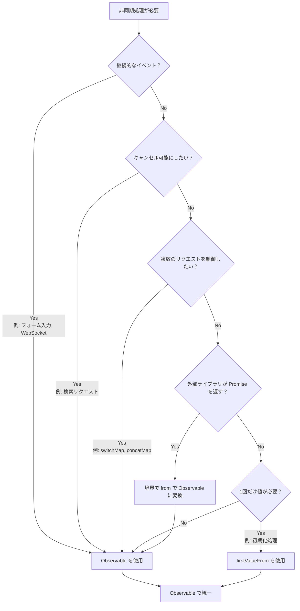

# PromiseとObservableの混在アンチパターン

PromiseとObservableはどちらも非同期処理を扱うための仕組みですが、**設計の境界を明確にせずに混在させると、様々な問題が発生します**。このページでは、混在によるアンチパターンと、適切な統一方法を詳しく解説します。

## なぜ統一が重要なのか

PromiseとObservableを混在させると、以下のような問題が発生します。

### 1. キャンセル不可

Observable は `unsubscribe` / `takeUntil` で処理を中断できますが、**Promise は一度開始すると中断できません**。

```ts
import { interval, Subject } from 'rxjs';
import { takeUntil } from 'rxjs';

const destroy$ = new Subject<void>();

// ✅ Observable: キャンセル可能
interval(1000).pipe(
  takeUntil(destroy$)
).subscribe(n => console.log(n));

// ユーザーが画面を離れたらキャンセル
destroy$.next();
destroy$.complete();
```

```ts
// ❌ Promise: キャンセル不可
async function fetchData() {
  const response = await fetch('/api/data');
  // ユーザーが画面を離れても fetch は止まらない
  return response.json();
}
```

**影響：** ルート遷移時の無駄なリクエスト、不要な副作用の実行

### 2. 多発制御の困難さ

Observable は `switchMap`/`concatMap`/`exhaustMap` などで、複数のリクエストを直列・打ち消し・再入防止できます。

```ts
import { fromEvent } from 'rxjs';
import { switchMap, debounceTime } from 'rxjs';

const searchInput = document.getElementById('serch-input')!;

// ✅ Observable: 最新のリクエストのみ処理
fromEvent(searchInput, 'input').pipe(
  debounceTime(300),
  switchMap(event => searchAPI((event.target as HTMLInputElement).value))
  // 古いリクエストは自動的にキャンセルされる
).subscribe(results => displayResults(results));
function searchAPI(query: string) {
  return fetch(`/api/search?q=${query}`).then(r => r.json());
}

function displayResults(results: unknown) {
  console.log(results);
}
```

Promise では、このような制御を手動で実装する必要があり、複雑になります。

### 3. 複数回イベント対応

Observable はフォーム入力、WebSocket、イベントなど、**継続的に値が流れる処理**に強いです。

```ts
import { fromEvent } from 'rxjs';
import { map } from 'rxjs';

// ✅ Observable: 継続的なイベントを処理
fromEvent(document, 'mousemove').pipe(
  map(event => ({ x: (event as MouseEvent).clientX, y: (event as MouseEvent).clientY }))
).subscribe(position => {
  console.log('Mouse position:', position);
});
```

Promise は「1回だけ」の処理に特化しており、継続的なイベントには不向きです。

### 4. テストの容易性

Observable はマーブルテストで時間・並行性を保証できます。

```ts
import { TestScheduler } from 'rxjs/testing';

// ✅ Observable: マーブルテストで時間を制御可能
// ※ このコードはテストフレームワーク（Jasmine/Jest）内で実行します
describe('Observable Test', () => {
  let scheduler: TestScheduler;

  beforeEach(() => {
    scheduler = new TestScheduler((actual, expected) => {
      expect(actual).toEqual(expected); // テストフレームワークの expect を使用
    });
  });

  it('should emit values over time', () => {
    scheduler.run(({ cold, expectObservable }) => {
      const source$ = cold('a-b-c|');
      expectObservable(source$).toBe('a-b-c|');
    });
  });
});
```

Promise ベースのコードは非同期テストが複雑になりがちです。詳細は [テスト手法](/guide/testing/unit-tests) を参照してください。


## 混在で"ハマる"典型パターン（避けたい）

以下は、実際のプロジェクトでよく見られる問題パターンです。

### ❌ アンチパターン 1: async/await と pipe() の混在

Observable 処理の途中で `await` を使ったり、Promise と Observable の処理が混ざると、キャンセル不能になります。

```ts
import { ajax } from 'rxjs/ajax';
import { firstValueFrom } from 'rxjs';

// ❌ 悪い例: Observable → Promise → Promise の混在
async function fetchUserData() {
  const user = await firstValueFrom(ajax.getJSON('/api/user'));

  // Promise に落とした後、キャンセル不能に
  return fetch('/api/profile').then(response => response.json());
}
```

```ts
import { of } from 'rxjs';
import { map } from 'rxjs';

// ❌ 悪い例: pipe() の中で await を使おうとする（実際には動かない）
async function processData() {
  return of(1, 2, 3).pipe(
    map(async (value) => {
      const result = await someAsyncOperation(value);
      return result; // Observable<Promise<T>> になってしまう
    })
  );
}

async function someAsyncOperation(value: number): Promise<number> {
  return value * 2;
}
```

#### 問題点
- キャンセル不能になる
- エラーチャンネルが分離（`error` ではなく `unhandledrejection` 側へ）
- Promise と Observable の責務が曖昧になる
- 型が `Observable<Promise<T>>` になってしまう

### ❌ アンチパターン 2: `toPromise()` の使用（廃止済み）

```ts
import { interval } from 'rxjs';

// ❌ 悪い例: toPromise() は RxJS v8 で削除
interval(1000).toPromise().then(value => {
  console.log(value);
});
```

**解決策：** `firstValueFrom` / `lastValueFrom` を使用（後述）

### ❌ アンチパターン 3: `subscribe` 内で `await`

```ts
import { fromEvent } from 'rxjs';

const button = document.getElementById('btn') as HTMLButtonElement;

// ❌ 悪い例
fromEvent(button, 'click').subscribe(async () => {
  const data = await fetch('/api/data').then(r => r.json());
  console.log(data);
  // フローが読めなくなり、エラーハンドリングが困難
});
```

#### 問題点
- フローが読めなくなる
- 重複リクエストの温床
- メモリリークの可能性

### ❌ アンチパターン 4: subscribe のネスト

```ts
import { ajax } from 'rxjs/ajax';

// ❌ 悪い例
ajax.getJSON('/api/users').subscribe(users => {
  ajax.getJSON('/api/settings').subscribe(settings => {
    console.log(users, settings);
    // コールバック地獄
  });
});
```

#### 問題点
- エラーハンドリングの複雑化
- 購読解除の管理が困難

### ❌ アンチパターン 5: 同じデータを Promise と Observable で並行取得

```ts
import { ajax } from 'rxjs/ajax';

// ❌ 悪い例
async function loadData() {
  const userPromise = fetch('/api/user').then(r => r.json());
  const user$ = ajax.getJSON('/api/user');

  // 同じデータを2回取得してしまう
}
```

#### 問題点
- 二重実行
- 順序競合

### ❌ アンチパターン 6: Observable の中で Promise を返している

Observable のコンストラクタ内で `async/await` を使うと、エラーハンドリングが困難になります。

```ts
import { Observable } from 'rxjs';

// ❌ 悪い例: Observable の中で async function を使う
const data$ = new Observable(subscriber => {
  async function fetchData() {
    const response = await fetch('/api/data');
    const data = await response.json();
    subscriber.next(data);
    subscriber.complete();
  }

  fetchData(); // Promise が返されるが、エラーを捕捉できない
  // fetchData() が reject された場合、subscriber.error() が呼ばれない
});
```

```ts
import { Observable } from 'rxjs';

// ❌ 悪い例: Promise を subscriber.next() に渡す
const data$ = new Observable(subscriber => {
  const promise = fetch('/api/data').then(r => r.json());
  subscriber.next(promise); // Promise オブジェクトが流れてしまう
  subscriber.complete();
});

// 購読側で Promise を受け取ってしまう
data$.subscribe(value => {
  console.log(value); // Promise { <pending> } が出力される
});
```

#### 問題点
- Promise のエラーが Observable のエラーチャンネルに流れない
- `unhandledrejection` になる可能性
- subscriber.next() に Promise オブジェクトが渡される
- 購読者が Promise を unwrap する必要がある

#### 解決策

```ts
import { from, defer } from 'rxjs';

// ✅ 良い例: from() で Promise を Observable に変換
const data$ = from(fetch('/api/data').then(r => r.json()));

// ✅ 良い例: defer() で遅延評価
const data$ = defer(() => fetch('/api/data').then(r => r.json()));
```


## 実務ガイド：境界でキレイに変換

混在を完全に避けることは難しいため、**設計の境界で適切に変換する**のがベストプラクティスです。

### パターン 1: Promise → Observable（外部SDKなどが Promise を返す）

外部ライブラリやレガシーコードが Promise を返す場合、**境界で一度だけ Observable に変換**します。

```ts
import { from } from 'rxjs';
import { switchMap } from 'rxjs';

// 外部SDKが Promise を返す
async function externalSDK(): Promise<{ userId: string }> {
  return { userId: '123' };
}

// ✅ 良い例: 境界で変換して以降は Observable で統一
const user$ = from(externalSDK());

user$.pipe(
  switchMap(user => from(fetchProfile(user.userId)))
).subscribe(profile => {
  console.log(profile);
});

async function fetchProfile(userId: string): Promise<{ name: string }> {
  return { name: 'John' };
}
```

### パターン 2: Observable → Promise（"1回だけ欲しい"同期的文脈）

初期化処理やガード関数など、**1回だけ値が必要な場合**は `firstValueFrom` / `lastValueFrom` を使用します。

```ts
import { ajax } from 'rxjs/ajax';
import { firstValueFrom, shareReplay } from 'rxjs';

// ✅ 良い例: 複数回 await する場合はキャッシュ
const config$ = ajax.getJSON('/api/config').pipe(
  shareReplay({ bufferSize: 1, refCount: true })
);

async function initialize() {
  const config = await firstValueFrom(config$);
  console.log('Config loaded:', config);
}

async function validate() {
  const config = await firstValueFrom(config$); // キャッシュから取得
  console.log('Validating with config:', config);
}
```

**⚠️ 注意：** `firstValueFrom` は**最初の1件**しか取得しません。継続的なイベント（valueChanges, WebSocket 等）には**絶対に使用しない**でください。

```ts
import { interval } from 'rxjs';
import { firstValueFrom } from 'rxjs';

// ❌ 悪い例: 無限ストリームに firstValueFrom
const value = await firstValueFrom(interval(1000));
// 1回だけ値を取得して終わってしまう（意図しない動作）
```

### パターン 3: エラーハンドリングの統一

Promise と Observable でエラーハンドリングのチャンネルが分離しないように注意します。

```ts
import { from } from 'rxjs';
import { catchError } from 'rxjs';
import { of } from 'rxjs';

async function riskyOperation(): Promise<string> {
  throw new Error('Something went wrong');
}

// ✅ 良い例: Observable のエラーハンドリングで統一
from(riskyOperation()).pipe(
  catchError(error => {
    console.error('Error caught in Observable pipeline:', error);
    return of('fallback value');
  })
).subscribe(result => {
  console.log(result); // 'fallback value'
});
```


## よくある混在の置き換え例

### 例1: 途中で Promise 化 → then

#### ❌ 悪い例

```ts
import { ajax } from 'rxjs/ajax';
import { firstValueFrom } from 'rxjs';

async function loadUser() {
  const user = await firstValueFrom(ajax.getJSON('/api/user'));

  // Promise に落として then で続き処理
  return fetch('/api/profile')
    .then(response => response.json())
    .then(profile => {
      console.log(user, profile);
    });
}
```

#### ✅ 良い例 A: 終始 Observable

```ts
import { ajax } from 'rxjs/ajax';
import { switchMap } from 'rxjs';

// Observable のまま処理
ajax.getJSON('/api/user').pipe(
  switchMap(user => ajax.getJSON('/api/profile').pipe(
    // user と profile を組み合わせる
  ))
).subscribe(profile => {
  console.log(profile);
});
```

#### ✅ 良い例 B: 1回だけ await が必要なコンテキスト

```ts
import { ajax } from 'rxjs/ajax';
import { shareReplay, firstValueFrom } from 'rxjs';

const user$ = ajax.getJSON('/api/user').pipe(
  shareReplay({ bufferSize: 1, refCount: true })
);

async function loadUserOnce() {
  const user = await firstValueFrom(user$);
  console.log('User loaded once:', user);
}
```


### 例2: subscribe 内で await

#### ❌ 悪い例

```ts
import { fromEvent } from 'rxjs';

const button = document.getElementById('search-btn') as HTMLButtonElement;

fromEvent(button, 'click').subscribe(async () => {
  const results = await fetch('/api/search').then(r => r.json());
  console.log(results);
});
```

#### ✅ 良い例

```ts
import { fromEvent, from } from 'rxjs';
import { switchMap } from 'rxjs';

const button = document.getElementById('search-btn') as HTMLButtonElement;

fromEvent(button, 'click').pipe(
  switchMap(() => from(fetch('/api/search').then(r => r.json())))
).subscribe(results => {
  console.log(results);
});
```


## 判断フローチャート（覚えやすい指針）

プロジェクトで Promise と Observable のどちらを使うべきか迷った時の指針です。



### 具体的な判断基準

| 条件 | 推奨 | 理由 |
|---|---|---|
| **継続的なイベント**（フォーム入力, WebSocket） | Observable | Promise は1回しか値を返せない |
| **キャンセル可能にしたい**（検索リクエスト） | Observable | Promise はキャンセル不可 |
| **複数のリクエストを制御**（switchMap, concatMap） | Observable | Promise では制御が困難 |
| **外部ライブラリが Promise を返す** | `from()` で変換 | 境界で一度だけ変換 |
| **1回だけ値が必要**（初期化処理） | `firstValueFrom` | 必要に応じて `shareReplay(1)` と組み合わせ |


## まとめ

- **混在そのものは悪ではない**が、**設計の"境界"を明確に**して片側へ寄せるのが正解
- **Observable を基準に統一**し、必要最小限の場所だけ **`firstValueFrom`/`from()`で変換** するのが、トラブルが少なく、テスト・可読性・キャンセル性も担保できる
- **継続的なイベント（フォーム、WebSocket）は絶対に Promise 化しない**

## 関連セクション

- **[PromiseとRxJSの違い](/guide/basics/promise-vs-rxjs)** - 基本的な変換方法
- **[エラーハンドリング](/guide/error-handling/strategies)** - Observable のエラー処理戦略
- **[よくある間違いと対処法](/guide/anti-patterns/common-mistakes)** - 他のアンチパターン

## 次のステップ

1. 既存のコードで Promise と Observable が混在している箇所を洗い出す
2. 境界を明確にして、Observable に統一する
3. キャンセル処理が必要な箇所に `takeUntil` を追加する
