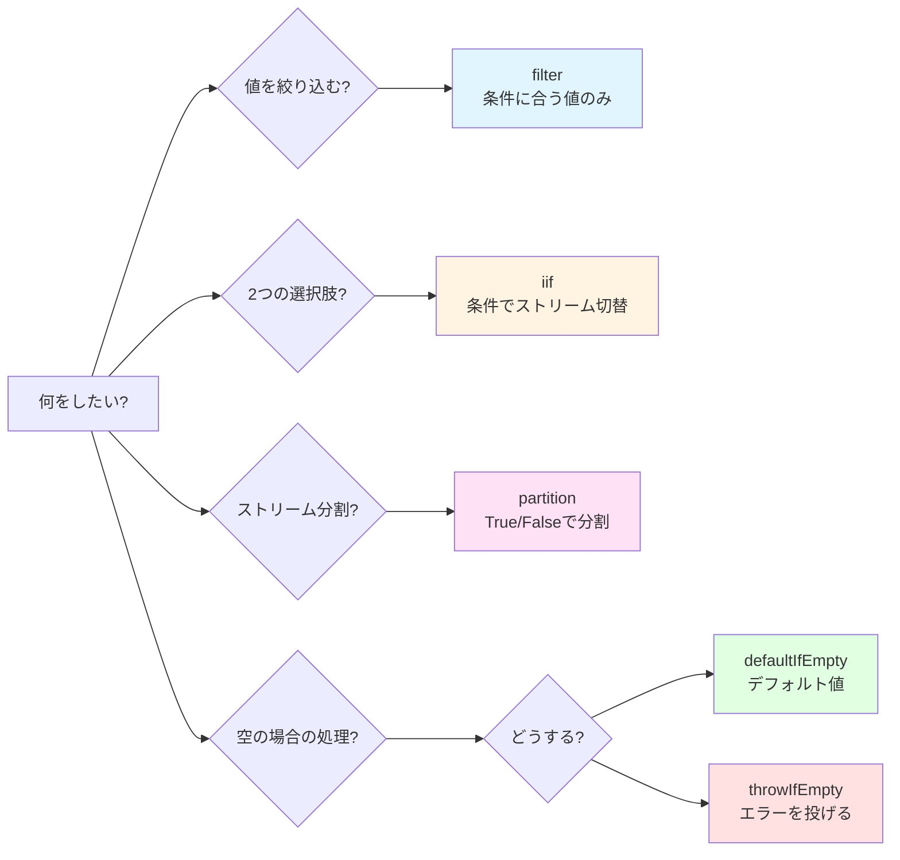

# subscribe内のif文ネスト地獄

## なぜこれがアンチパターンなのか

「subscribe内での複雑な条件分岐」は、RxJSにおける**明確なアンチパターン**です。以下の理由から、避けるべき実装パターンとして認識されています。

### 1. RxJSの設計思想に反する

RxJSは**宣言的プログラミング**を推奨しています。「何をするか」をパイプラインで表現し、「どうやってするか」の詳細をsubscribe内に書くべきではありません。

```typescript
// ❌ アンチパターン: 命令的プログラミング（手続き的）
userService.getUser(id).subscribe(user => {
  if (user.isActive) {
    if (user.role === 'admin') {
      console.log('Admin user');
    }
  }
});

// ✅ RxJS的: 宣言的プログラミング
userService.getUser(id).pipe(
  filter(user => user.isActive),
  filter(user => user.role === 'admin'),
  tap(user => console.log('Admin user'))
).subscribe();
```

### 2. 既存のアンチパターンと同レベルの問題

Chapter 10で扱う他のアンチパターンと同様に、以下の問題を引き起こします:

| アンチパターン | 主な問題 |
|---------------|---------|
| **メモリリーク** | unsubscribe忘れ |
| **subscribe地獄** | ネストしたsubscribe |
| **subscribe内のif地獄** ← 本ページ | 複雑な条件分岐 |

### 3. 具体的な問題点

1. **可読性が低い** - ネストが深くなり、コードの意図が不明瞭
2. **テストが困難** - 条件分岐が多すぎてテストケースが爆発的に増加
3. **再利用不可** - ロジックがsubscribe内に閉じ込められ、他で使えない
4. **デバッグが困難** - 値の流れが追いにくく、問題箇所の特定に時間がかかる
5. **エラーハンドリングが複雑** - どこでエラーが起きたか追跡が困難

### 4. 許容される範囲と避けるべき範囲

```typescript
// ✅ 許容範囲: 単純な分岐（1-2個のif文）
subscribe(user => {
  if (user.isAdmin) {
    console.log('Admin user');
  } else {
    console.log('Regular user');
  }
});

// ⚠️ 要注意: 2-3個のネスト
subscribe(user => {
  if (user) {
    if (user.isActive) {
      console.log('Active user');
    }
  }
});

// ❌ アンチパターン: 3つ以上のネスト
subscribe(user => {
  if (user) {
    if (user.isActive) {
      if (user.role === 'admin') {
        if (user.permissions.includes('write')) {
          // これは明確なアンチパターン
        }
      }
    }
  }
});
```

> [!IMPORTANT] 判断基準
> - **1-2個のif文**: 許容範囲（ただし、オペレーターの方が望ましい）
> - **3個以上のネスト**: 明確なアンチパターン（必ずリファクタリングすべき）
> - **ネストした非同期処理**: 即座にリファクタリングが必要


## よくある悪いパターン

### パターン1: subscribe内での複雑な条件分岐

```typescript
// ❌ 悪い例: subscribe内でif文のネスト
userService.getUser(id).subscribe(user => {
  if (user) {
    if (user.isActive) {
      if (user.role === 'admin') {
        // 管理者向け処理
        console.log('Admin user:', user.name);
        adminService.loadAdminData().subscribe(adminData => {
          if (adminData) {
            // さらにネスト...
          }
        });
      } else {
        // 一般ユーザー向け処理
        console.log('Regular user:', user.name);
      }
    } else {
      // 非アクティブユーザー
      console.log('Inactive user');
    }
  } else {
    // ユーザーが見つからない
    console.log('User not found');
  }
});
```

### このコードの問題点
1. **ネストが5段階** - 可読性が著しく低下
2. **subscribe内にさらにsubscribe** - メモリリークのリスク
3. **エラーハンドリングがない** - どこでエラーが起きるか不明
4. **テスト不可能** - すべてのパスをテストするのが困難
5. **ロジックの再利用不可** - 他の場所で使えない


## RxJSの条件オペレーターを使った解決策

### 解決策1: filterを使った条件分岐

**いつ使う？**: 値を絞り込む、不要な値を除外する

```typescript
import { filter, tap, switchMap } from 'rxjs';

// ✅ 良い例: filterで条件を分離
userService.getUser(id).pipe(
  filter(user => user !== null),           // nullチェック
  filter(user => user.isActive),           // アクティブチェック
  filter(user => user.role === 'admin'),   // ロール確認
  tap(user => console.log('Admin user:', user.name)),
  switchMap(user => adminService.loadAdminData())
).subscribe({
  next: adminData => console.log('Admin data loaded', adminData),
  error: err => console.error('Error:', err)
});
```

> [!NOTE] メリット
> - ✅ 各条件が独立している（読みやすい）
> - ✅ パイプラインで順序が明確
> - ✅ エラーハンドリングが一元化

### 解決策2: iifを使った二択分岐

**いつ使う？**: 条件に応じて異なるObservableを実行

```typescript
import { iif, of, switchMap } from 'rxjs';

// ✅ 良い例: iifで条件に応じてストリームを切り替え
userService.getUser(id).pipe(
  switchMap(user =>
    iif(
      () => user.role === 'admin',
      adminService.loadAdminData(),    // 管理者の場合
      userService.loadUserData()       // 一般ユーザーの場合
    )
  )
).subscribe(data => console.log('Data:', data));
```

> [!NOTE] メリット
> - ✅ 二択の分岐が明確
> - ✅ それぞれの処理が独立したObservable
> - ✅ テストしやすい

### 解決策3: partitionを使った分岐処理

**いつ使う？**: ストリームを2つに分割して別々に処理

```typescript
import { partition, merge, tap, switchMap, map } from 'rxjs';

// ✅ 良い例: partitionでストリームを2つに分割
const [activeUsers$, inactiveUsers$] = partition(
  userService.getUsers(),
  user => user.isActive
);

// アクティブユーザーの処理
const processedActive$ = activeUsers$.pipe(
  tap(user => console.log('Active:', user.name)),
  switchMap(user => userService.loadProfile(user.id))
);

// 非アクティブユーザーの処理
const processedInactive$ = inactiveUsers$.pipe(
  tap(user => console.log('Inactive:', user.name)),
  map(user => ({ ...user, status: 'archived' }))
);

// 2つのストリームを統合
merge(processedActive$, processedInactive$).subscribe(
  result => console.log('Processed:', result)
);
```

> [!NOTE] メリット
> - ✅ アクティブ/非アクティブを完全に分離
> - ✅ それぞれ独立して処理できる
> - ✅ 拡張しやすい

### 解決策4: defaultIfEmptyでデフォルト値

**いつ使う？**: 空の場合にデフォルト値を提供

```typescript
import { defaultIfEmpty, filter } from 'rxjs';

// ✅ 良い例: 空の場合にデフォルト値を提供
userService.getUser(id).pipe(
  filter(user => user !== null),
  defaultIfEmpty({ id: 0, name: 'Guest', role: 'guest' })
).subscribe(user => {
  console.log('User:', user.name);
});
```

> [!NOTE] メリット
> - ✅ nullチェックが不要
> - ✅ デフォルト値が明確
> - ✅ subscribe内の分岐が不要

### 解決策5: throwIfEmptyでエラーハンドリング

**いつ使う？**: 空の場合にエラーとして扱う

```typescript
import { throwIfEmpty, catchError, filter } from 'rxjs';
import { of } from 'rxjs';

// ✅ 良い例: 空の場合にエラーを投げる
userService.getUser(id).pipe(
  filter(user => user !== null),
  throwIfEmpty(() => new Error('User not found')),
  catchError(err => {
    console.error('Error:', err.message);
    return of(null);
  })
).subscribe(user => {
  if (user) {
    console.log('User found:', user.name);
  }
});
```

> [!NOTE] メリット
> - ✅ エラー処理が明確
> - ✅ パイプライン内で完結
> - ✅ subscribe内は成功時の処理のみ


## 実践例: 複雑な条件ロジックのリファクタリング

### Before: subscribe内のif地獄

```typescript
// ❌ 悪い例: 複雑な条件ロジック（6段階のネスト）
apiService.fetchData().subscribe(data => {
  if (data) {
    if (data.status === 'success') {
      if (data.result) {
        if (data.result.items.length > 0) {
          data.result.items.forEach(item => {
            if (item.isValid) {
              if (item.price > 0) {
                // 処理...
                console.log('Valid item:', item);
              }
            }
          });
        } else {
          console.log('No items found');
        }
      }
    } else {
      console.log('Request failed');
    }
  }
});
```

> [!WARNING] 問題点
> - 6段階のネスト
> - forEachの中でさらに条件分岐
> - エラーハンドリングがない
> - テスト不可能
> - 配列処理が非効率

### After: オペレーターで構造化

```typescript
import { filter, map, defaultIfEmpty, switchMap, tap } from 'rxjs';
import { from } from 'rxjs';

// ✅ 良い例: オペレーターで条件を整理
apiService.fetchData().pipe(
  // 1. データの存在確認
  filter(data => data !== null),

  // 2. ステータス確認
  filter(data => data.status === 'success'),

  // 3. 結果の存在確認
  filter(data => data.result !== null),

  // 4. 配列を展開
  map(data => data.result.items),
  defaultIfEmpty([]),  // 空配列の場合のデフォルト

  // 5. 各アイテムを個別に処理
  switchMap(items => from(items)),

  // 6. 有効なアイテムのみ
  filter(item => item.isValid),

  // 7. 価格チェック
  filter(item => item.price > 0),

  // 8. デバッグ用ログ
  tap(item => console.log('Valid item:', item))

).subscribe({
  next: item => console.log('Processing:', item),
  error: err => console.error('Error:', err),
  complete: () => console.log('All items processed')
});
```

> [!TIP] 改善点
> - ✅ ネストが0（すべてフラット）
> - ✅ 各条件が独立して読みやすい
> - ✅ エラーハンドリングが追加された
> - ✅ テストしやすい（各オペレーターを個別にテスト可能）
> - ✅ 配列処理が効率的（from()でストリーム化）


## 条件オペレーター選択ガイド

以下のフローチャートで、どのオペレーターを使うべきか判断できます。



| 条件 | 使うオペレーター | 理由 |
|-----|----------------|------|
| 値を絞り込む | `filter()` | 条件に合う値のみ通す |
| 2つの選択肢から選ぶ | `iif()` | 条件に応じてストリームを切り替え |
| ストリームを2つに分割 | `partition()` | True/Falseで2つのストリームに分ける |
| 空の場合のデフォルト | `defaultIfEmpty()` | 値がない場合にデフォルト値を使用 |
| 空の場合にエラー | `throwIfEmpty()` | 値がない場合にエラーを投げる |
| 複数の選択肢（3つ以上） | カスタムオペレーター | 3つ以上の分岐が必要な場合 |


## リファクタリングのステップ

### Step 1: 条件を特定する
subscribe内のif文をすべて列挙する

```typescript
// 例: 以下の条件がある
if (data)                        // ← 条件1
if (data.status === 'success')   // ← 条件2
if (data.result)                 // ← 条件3
if (item.isValid)                // ← 条件4
if (item.price > 0)              // ← 条件5
```

### Step 2: 条件を分類する
- **フィルタリング条件** → `filter()`
- **二択の分岐** → `iif()`
- **ストリームの分割** → `partition()`
- **デフォルト値** → `defaultIfEmpty()`
- **エラー条件** → `throwIfEmpty()`

### Step 3: パイプラインに変換する
条件をpipe内のオペレーターに置き換える

```typescript
.pipe(
  filter(data => data !== null),              // 条件1
  filter(data => data.status === 'success'),  // 条件2
  filter(data => data.result !== null),       // 条件3
  switchMap(data => from(data.result.items)),
  filter(item => item.isValid),               // 条件4
  filter(item => item.price > 0)              // 条件5
)
```

### Step 4: subscribeをシンプルにする
subscribeは副作用のみ（ログ出力、DOM操作など）

```typescript
.subscribe({
  next: item => console.log('Valid item:', item),
  error: err => console.error('Error:', err),
  complete: () => console.log('Complete')
});
```

### Step 5: テストを書く
各オペレーターが期待通りに動作するか確認

```typescript
// 例: filterのテスト
it('should filter out null values', () => {
  const source$ = of(null, { id: 1 }, null);
  const result$ = source$.pipe(
    filter(data => data !== null)
  );

  result$.subscribe(data => {
    expect(data).not.toBeNull();
  });
});
```


## カスタムオペレーターで再利用

複雑な条件ロジックは、カスタムオペレーターに抽出すると再利用できます。

```typescript
import { pipe } from 'rxjs';
import { filter } from 'rxjs';

// カスタムオペレーター: アクティブな管理者ユーザーのみ
function filterActiveAdmins<T extends { isActive: boolean; role: string }>() {
  return pipe(
    filter((user: T) => user.isActive),
    filter((user: T) => user.role === 'admin')
  );
}

// 使用例
userService.getUsers().pipe(
  filterActiveAdmins(),
  tap(user => console.log('Active admin:', user.name))
).subscribe();
```

> [!NOTE] メリット
> - ✅ 再利用可能
> - ✅ テストしやすい
> - ✅ 名前で意図が明確


## 関連学習リソース

このアンチパターンを理解するために、以下のセクションも参照してください。

- **[Chapter 4: 条件オペレーター](/guide/operators/conditional/)** - filter、iif、defaultIfEmptyの詳細
- **[Chapter 10: アンチパターン](/guide/anti-patterns/)** - 他のアンチパターン
- **[Chapter 11: 概念理解の壁](/guide/overcoming-difficulties/conceptual-understanding)** - 宣言的プログラミングの理解
- **[Chapter 11: オペレーター選択](/guide/overcoming-difficulties/operator-selection)** - 適切なオペレーターの選び方


## アンチパターン回避チェックリスト

自分のコードを確認してください。

```markdown
- [ ] subscribe内にif文が3つ以上ネストしていない
- [ ] 条件分岐はpipe内のオペレーターで処理している
- [ ] subscribeは副作用（ログ、DOM操作）のみ行っている
- [ ] filterを使って不要な値を除外している
- [ ] 空の場合の処理をdefaultIfEmptyまたはthrowIfEmptyで対応
- [ ] 複雑な条件はカスタムオペレーターに抽出している
- [ ] エラーハンドリングがcatchErrorで行われている
- [ ] subscribe内にさらにsubscribeがネストしていない
```

## 次のステップ

このアンチパターンを理解したら、以下のページで実践的なパターンを学びましょう。

1. **[よくある間違いと対処法](/guide/anti-patterns/common-mistakes)** - 他のアンチパターンを学ぶ
2. **[Chapter 11: 困難点克服](/guide/overcoming-difficulties/)** - RxJS特有の困難を克服する
3. **[Chapter 13: 実践パターン](/guide/)** - 正しい実装パターンを習得（準備中）

> [!TIP] 重要なポイント
> subscribe内の複雑な条件分岐は、RxJSの宣言的プログラミングの思想に反する明確なアンチパターンです。filter、iif、partitionなどのオペレーターを使って、パイプライン内で条件を処理しましょう。
