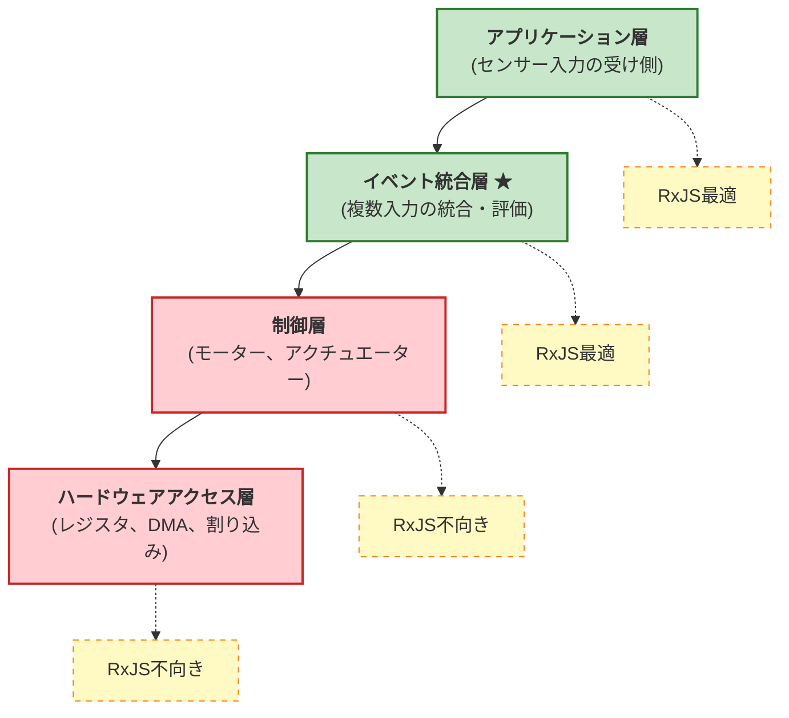

# 組み込み開発とリアクティブプログラミング

組み込みシステムにおいてリアクティブプログラミング、特にRxJSのような非同期ストリーム処理をどのように活用できるのか、その可能性と制約について解説します。

## リアクティブプログラミングとは

リアクティブプログラミングは、**非同期データストリームを時間軸で扱う宣言的手法**です。イベントやデータの流れを「時間とともに変化する値」として捉え、変換・結合・フィルタリングを行います。

従来の命令型プログラミングでは「いつ」「どのように」処理するかを明示的に記述する必要がありますが、リアクティブプログラミングでは「何を」処理するかを宣言的に記述します。

```ts
// 従来の命令型アプローチ
let sensorValue = 0;
setInterval(() => {
  sensorValue = readSensor();
  if (sensorValue > threshold) {
    handleAlert(sensorValue);
  }
}, 100);

// リアクティブなアプローチ
sensorStream$
  .pipe(
    filter(value => value > threshold)
  )
  .subscribe(value => handleAlert(value));
```

リアクティブアプローチでは、データの流れと処理ロジックが明確に分離され、可読性と保守性が向上します。

## 組み込み開発での課題

組み込みシステムでリアクティブプログラミングが広く普及していない理由は、以下の制約があるためです。

### 1. 性能制約

多くの組み込みシステムは**マイクロ秒単位での応答**が求められます。

```ts
// ❌ 組み込みの制御層では不適切
motorControl$
  .pipe(
    map(signal => processSignal(signal)),  // 数十μs以内に完了必要
    filter(value => value > threshold)
  )
  .subscribe(value => actuateMotor(value));
```

::: warning 課題
- RxJSのオペレーターチェーンはオーバーヘッドが大きい
- ガベージコレクションが発生する可能性
- 応答時間の予測が困難

:::

### 2. メモリ制限

組み込みシステムは限られたメモリ（数KB〜数MB）で動作します。

::: warning 課題
- 動的なメモリ割り当てが禁止されることが多い
- Observable の内部状態がメモリを消費
- バッファリングオペレーター（`buffer`, `window`）は特にメモリを使用

:::

### 3. 抽象度の高さ

リアクティブプログラミングは抽象度が高く、ハードウェアレベルの制御には不向きです。

::: warning 課題
- レジスタ操作やDMA制御には向かない
- ビットレベルの細かい制御が必要な処理には不適切
- デバッグが複雑（非同期ストリームのトレースが困難）

:::

### 4. RTOSとの相性

Real-Time Operating System（RTOS）は優先度ベースのタスクスケジューリングを行いますが、RxJSはイベントループベースです。

::: warning 課題
- 優先度の逆転が発生する可能性
- タスクの実行タイミングが予測しづらい
- リアルタイム性の保証が困難

:::

## 最適な適用層：イベント統合層

組み込みシステムでリアクティブプログラミングが最も効果を発揮するのは、**「イベント統合層」** です。

### リアクティブモデルが最も役立つ位置：センサー入力の「受け側」

組み込みシステムにおいて、リアクティブプログラミングは**データの受信側（センサー入力）** で真価を発揮します。

#### 受け側（センサー入力）でのリアクティブモデルの強み
- 複数のセンサーからの非同期データを統合
- 時間軸での相関関係を宣言的に記述
- イベント駆動型の処理が自然に表現できる
- 状態管理とフィルタリングが容易

#### 送信側（制御出力）でのリアクティブモデルの課題
- リアルタイム性の保証が困難（マイクロ秒単位の応答が必要）
- オーバーヘッドが許容できない
- ハードウェアの直接制御には抽象度が高すぎる

### センサー入力ストリームの特徴と利点

| 特徴 | 従来の命令型アプローチ | リアクティブアプローチ | 利点 |
|------|---------------------|---------------------|------|
| **複数センサーの統合** | 各センサーごとにポーリング、手動で同期 | `combineLatest`, `merge` で宣言的に統合 | コードが簡潔、意図が明確 |
| **時間窓での集約** | タイマーとバッファを手動管理 | `bufferTime`, `windowTime` で自動化 | 実装ミスが減少、保守性向上 |
| **ノイズ除去** | ループと配列操作で移動平均を実装 | `scan` + `map` で宣言的に記述 | 可読性が高い、再利用可能 |
| **異常検知** | フラグと条件分岐の複雑なネスト | `pairwise` + `filter` で明確に表現 | ロジックが追いやすい |
| **イベント相関** | 状態変数でイベントを追跡、手動で判定 | `merge` + `bufferTime` でパターン検知 | 宣言的、拡張しやすい |
| **購読解除** | 手動でフラグ管理、リークしやすい | `takeUntil` で自動的に解除 | メモリリークの防止 |

### 制御側（発信側）との違い

組み込みシステムにおける「受け側」と「送信側」の特性の違いを理解することが重要です。

| 観点 | 受け側（センサー入力） | 送信側（制御出力） |
|------|---------------------|------------------|
| **リアルタイム性** | ミリ秒単位（比較的緩い） | マイクロ秒単位（厳格） |
| **処理の性質** | 非同期、イベント駆動 | 同期、周期実行 |
| **複雑さ** | 複数ソースの統合、状態管理 | 単純な出力、高速性重視 |
| **RxJS適合性** | ✅ **最適** - イベント統合に強い | ❌ **不向き** - オーバーヘッドが大きい |
| **主な処理** | フィルタリング、平滑化、相関検知 | PWM制御、モーター駆動、DMA転送 |

::: tip センサー入力の「受け側」に特化
リアクティブプログラミングは、**複数の非同期イベントを時間軸で統合・評価する**場合に最も効果的です。制御出力のような「送信側」ではなく、センサー入力の「受け側」に特化して活用しましょう。
:::

### システムアーキテクチャの層分け



#### イベント統合層の特徴
- 複数のセンサーやイベントソースからの入力を統合
- 時間軸での相関を評価
- リアルタイム性の要求が比較的緩い（ミリ秒単位）
- 状態管理と条件評価が中心

## 実践的な応用例

### 1. センサー値の平滑化

複数のセンサーからの入力を平滑化し、ノイズを除去します。

```ts
import { interval, combineLatest } from 'rxjs';
import { map, scan, share } from 'rxjs';

// センサーストリームのシミュレーション
const temperatureSensor$ = interval(100).pipe(
  map(() => 25 + Math.random() * 5), // 25-30℃
  share()
);

const humiditySensor$ = interval(100).pipe(
  map(() => 50 + Math.random() * 10), // 50-60%
  share()
);

// 移動平均による平滑化
function movingAverage(windowSize: number) {
  return scan<number, number[]>((acc, value) => {
    const newWindow = [...acc, value];
    if (newWindow.length > windowSize) {
      newWindow.shift();
    }
    return newWindow;
  }, []).pipe(
    map(window => window.reduce((sum, val) => sum + val, 0) / window.length)
  );
}

const smoothedTemperature$ = temperatureSensor$.pipe(
  movingAverage(5),
  map(value => Math.round(value * 10) / 10)
);

const smoothedHumidity$ = humiditySensor$.pipe(
  movingAverage(5),
  map(value => Math.round(value * 10) / 10)
);

// 統合された環境データ
combineLatest([smoothedTemperature$, smoothedHumidity$])
  .pipe(
    map(([temp, humidity]) => ({
      temperature: temp,
      humidity: humidity,
      heatIndex: calculateHeatIndex(temp, humidity),
      timestamp: Date.now()
    }))
  )
  .subscribe(data => {
    console.log('環境データ:', data);
  });

function calculateHeatIndex(temp: number, humidity: number): number {
  // 簡易的な体感温度の計算
  return temp + (0.5555 * (6.11 * Math.exp(5417.753 * ((1/273.16) - (1/(273.15 + temp)))) - 10));
}
```

> [!NOTE] センサー統合の利点
> - 複数センサーの値を時間軸で同期して処理
> - 移動平均でノイズを除去
> - 計算値（体感温度など）を宣言的に導出

### 2. イベント相関検知

複数のイベントが特定の時間窓内で発生した場合に検知します。

```ts
import { Subject, merge } from 'rxjs';
import { filter, bufferTime, map } from 'rxjs';

// イベントストリーム
const motionDetected$ = new Subject<{ sensor: string; timestamp: number }>();
const doorOpened$ = new Subject<{ door: string; timestamp: number }>();
const lightOn$ = new Subject<{ room: string; timestamp: number }>();

// すべてのイベントを統合
const allEvents$ = merge(
  motionDetected$.pipe(map(e => ({ type: 'motion', ...e }))),
  doorOpened$.pipe(map(e => ({ type: 'door', ...e }))),
  lightOn$.pipe(map(e => ({ type: 'light', ...e })))
);

// 1秒間の時間窓でイベントを集約
allEvents$
  .pipe(
    bufferTime(1000),
    filter(events => events.length > 0),
    map(events => {
      const hasMotion = events.some(e => e.type === 'motion');
      const hasDoor = events.some(e => e.type === 'door');
      const hasLight = events.some(e => e.type === 'light');

      return {
        timestamp: Date.now(),
        events,
        pattern: {
          hasMotion,
          hasDoor,
          hasLight
        }
      };
    }),
    filter(result =>
      // 人が入室したパターンを検知
      result.pattern.hasMotion && result.pattern.hasDoor
    )
  )
  .subscribe(result => {
    console.log('入室検知:', result);
    // 照明が点いていなければ自動点灯
    if (!result.pattern.hasLight) {
      console.log('→ 照明を自動点灯');
    }
  });

// イベント発生のシミュレーション
setTimeout(() => motionDetected$.next({ sensor: 'entry', timestamp: Date.now() }), 100);
setTimeout(() => doorOpened$.next({ door: 'front', timestamp: Date.now() }), 200);
```

> [!TIP] イベント相関の活用
> - 時間窓内の複数イベントから状況を推定
> - セキュリティシステムでの異常検知
> - スマートホームの自動化ロジック

### 3. 異常検知

センサー値の異常なパターンを検知します。

```ts
import { interval } from 'rxjs';
import { map, pairwise, filter, share } from 'rxjs';

// 振動センサーのシミュレーション
const vibrationSensor$ = interval(50).pipe(
  map(() => {
    // 通常は0-10、異常時は50以上
    const normal = Math.random() * 10;
    const isAbnormal = Math.random() < 0.05; // 5%の確率で異常
    return isAbnormal ? 50 + Math.random() * 20 : normal;
  }),
  share()
);

// 異常検知ロジック
vibrationSensor$
  .pipe(
    pairwise(), // 連続する2つの値をペアにする
    map(([prev, current]) => ({
      prev,
      current,
      delta: Math.abs(current - prev),
      timestamp: Date.now()
    })),
    filter(data =>
      // 閾値を超えた、または急激な変化
      data.current > 30 || data.delta > 20
    )
  )
  .subscribe(data => {
    console.log('⚠️ 異常検知:', {
      現在値: data.current.toFixed(2),
      変化量: data.delta.toFixed(2),
      時刻: new Date(data.timestamp).toISOString()
    });
  });
```

> [!WARNING] 異常検知の注意点
> - 閾値の調整が重要（環境や機器に依存）
> - 誤検知を減らすためのフィルタリングが必要
> - 連続した異常が一定回数発生した場合のみアラートを出すなどの工夫が有効

### 4. 状態推定

複数のセンサー値から機器の状態を推定します。

```ts
import { combineLatest, interval } from 'rxjs';
import { map, distinctUntilChanged, share } from 'rxjs';

// センサーストリーム
const current$ = interval(100).pipe(
  map(() => 1.5 + Math.random() * 0.5), // 電流値 1.5-2.0A
  share()
);

const temperature$ = interval(100).pipe(
  map(() => 40 + Math.random() * 10), // 温度 40-50℃
  share()
);

const vibration$ = interval(100).pipe(
  map(() => 5 + Math.random() * 5), // 振動値 5-10
  share()
);

// 状態定義
type MachineState = 'idle' | 'running' | 'overload' | 'warning';

interface MachineStatus {
  state: MachineState;
  current: number;
  temperature: number;
  vibration: number;
  timestamp: number;
}

// 状態推定ロジック
combineLatest([current$, temperature$, vibration$])
  .pipe(
    map(([current, temperature, vibration]): MachineStatus => {
      let state: MachineState = 'idle';

      // 状態判定ロジック
      if (current > 1.8 && temperature > 45 && vibration > 8) {
        state = 'overload';
      } else if (temperature > 48 || vibration > 9) {
        state = 'warning';
      } else if (current > 1.6) {
        state = 'running';
      }

      return {
        state,
        current: Math.round(current * 100) / 100,
        temperature: Math.round(temperature * 10) / 10,
        vibration: Math.round(vibration * 10) / 10,
        timestamp: Date.now()
      };
    }),
    distinctUntilChanged((prev, curr) => prev.state === curr.state) // 状態が変化した時のみ通知
  )
  .subscribe(status => {
    console.log(`機器状態: ${status.state}`, {
      電流: `${status.current}A`,
      温度: `${status.temperature}℃`,
      振動: status.vibration
    });

    // 状態に応じた処理
    switch (status.state) {
      case 'overload':
        console.log('🔴 過負荷検知 - 機器を停止します');
        break;
      case 'warning':
        console.log('🟡 警告 - 監視を強化します');
        break;
    }
  });
```

> [!IMPORTANT] 状態推定のポイント
> - 複数センサーの値を組み合わせて状態を判定
> - `distinctUntilChanged` で状態変化時のみ処理
> - 閾値ベースの単純なルールから開始し、必要に応じて機械学習を組み込む

## ベストプラクティス

### 1. 適用層の選択

```ts
// ✅ 良い例：イベント統合層での使用
const userActivity$ = merge(
  buttonClick$,
  sensorInput$,
  timerEvent$
).pipe(
  debounceTime(100),
  map(event => processEvent(event))
);

// ❌ 悪い例：制御層での使用
const motorControl$ = interval(10).pipe(  // 10msは制御層には遅い
  map(() => readEncoder()),
  map(value => calculatePID(value))
);
```

### 2. メモリ管理

```ts
// ✅ 購読解除を確実に行う
import { Subject } from 'rxjs';
import { takeUntil } from 'rxjs';

class SensorManager {
  private destroy$ = new Subject<void>();

  start() {
    sensorStream$
      .pipe(
        takeUntil(this.destroy$)
      )
      .subscribe(data => this.process(data));
  }

  stop() {
    this.destroy$.next();
    this.destroy$.complete();
  }

  private process(data: any) {
    // 処理
  }
}
```

### 3. バッファサイズの制限

```ts
// ✅ バッファサイズを明示的に制限
import { bufferTime } from 'rxjs';

sensorStream$
  .pipe(
    bufferTime(1000, null, 100) // 最大100個まで
  )
  .subscribe(batch => processBatch(batch));

// ❌ 無制限のバッファは避ける
sensorStream$
  .pipe(
    bufferTime(10000) // 10秒間バッファ → メモリ不足の危険
  )
  .subscribe(batch => processBatch(batch));
```

### 4. エラーハンドリング

```ts
import { catchError, retry } from 'rxjs';
import { of } from 'rxjs';

sensorStream$
  .pipe(
    retry({ count: 3, delay: 1000 }),
    catchError(error => {
      console.error('センサーエラー:', error);
      // デフォルト値を返すか、フォールバック処理
      return of({ value: 0, error: true });
    })
  )
  .subscribe(data => {
    if (data.error) {
      handleSensorFailure();
    } else {
      processNormalData(data);
    }
  });
```

## まとめ

組み込み開発におけるリアクティブプログラミングの活用ポイント

### 適用可能な領域
- ✅ **イベント統合層** - センサー入力の統合、イベント相関検知
- ✅ **アプリケーション層** - 状態推定、異常検知、データ可視化
- ❌ **制御層** - モーター制御、アクチュエーター（リアルタイム性が要求される）
- ❌ **ハードウェアアクセス層** - レジスタ操作、DMA、割り込み処理

### 効果的な応用例
- ✅ センサー値の平滑化と統合
- ✅ 時間軸でのイベント相関検知
- ✅ 異常パターンの検知
- ✅ 複数センサーからの状態推定

### 注意点
- ⚠️ メモリ使用量の監視と制限
- ⚠️ 購読解除の確実な実行
- ⚠️ バッファサイズの明示的な制限
- ⚠️ 適切なエラーハンドリング

リアクティブプログラミングは、組み込みシステムの「すべての層」に適用できるわけではありませんが、**イベント統合層**では非常に効果的です。適切な層で活用することで、コードの可読性と保守性を大幅に向上させることができます。

## 今後の展望：リアクティブは組み込みでも不可避になる

組み込みシステムは進化を続けており、リアクティブプログラミングの重要性は今後さらに高まると考えられます。

### センサー数の爆発的増加

現代の組み込みシステム、特にIoTデバイスやスマートシステムでは、扱うセンサー数が急激に増加しています。

#### センサー統合の複雑化
- 自動車：数十〜数百のセンサー（ADAS、自動運転）
- スマートホーム：温度、湿度、人感、ドア、窓、カメラなど多数
- 産業機器：振動、温度、電流、圧力、位置など複合的に監視
- ウェアラブルデバイス：心拍、加速度、ジャイロ、GPS、気圧など

#### 従来の命令型アプローチの限界
```ts
// ❌ 10個以上のセンサーを命令型で統合すると破綻
let temp1, temp2, temp3, humidity1, humidity2, motion1, motion2;
let lastUpdate1, lastUpdate2, lastUpdate3;
// ... 変数が無限に増える

setInterval(() => {
  temp1 = readSensor1();
  temp2 = readSensor2();
  // ... ポーリングのコードが長大化

  if (temp1 > threshold1 && humidity1 > threshold2 && ...) {
    // ... 条件分岐が複雑化
  }
}, 100);
```

#### リアクティブアプローチの必然性
```ts
// ✅ センサーが増えても宣言的に記述できる
const allSensors$ = combineLatest({
  temp1: temperatureSensor1$,
  temp2: temperatureSensor2$,
  temp3: temperatureSensor3$,
  humidity1: humiditySensor1$,
  humidity2: humiditySensor2$,
  motion1: motionSensor1$,
  motion2: motionSensor2$,
  // センサーが増えても行を追加するだけ
});

allSensors$
  .pipe(
    map(sensors => evaluateConditions(sensors)),
    filter(result => result.shouldAlert)
  )
  .subscribe(result => handleAlert(result));
```

### エッジコンピューティングの台頭

クラウドへの依存を減らし、エッジデバイスでのデータ処理が重要になっています。

#### エッジでの要求
- 複数センサーからのリアルタイムデータ処理
- ローカルでの異常検知・パターン認識
- 軽量な機械学習モデルの実行
- ネットワーク障害時の自律動作

これらの要求は、**非同期ストリーム処理**と相性が良く、リアクティブプログラミングが自然な選択肢になります。

### ハードウェアの進化

組み込みプロセッサの性能向上により、リアクティブプログラミングのオーバーヘッドが許容範囲になりつつあります。

| 年代 | プロセッサ性能 | メモリ | リアクティブ適用可能性 |
|------|-------------|--------|-------------------|
| 2000年代 | 数MHz、8bit | 数KB | ❌ 困難 - オーバーヘッド大 |
| 2010年代 | 数十〜数百MHz、32bit | 数十KB〜数MB | △ 限定的 - イベント層のみ |
| 2020年代以降 | GHz級、64bit、マルチコア | 数百MB〜GB | ✅ **実用的** - 多くの層で適用可能 |

#### 現代の組み込みプロセッサ例
- Raspberry Pi 4: 1.5GHz クアッドコア、最大8GB RAM
- ESP32: 240MHz デュアルコア、520KB SRAM
- STM32H7: 480MHz、1MB RAM

これらのハードウェアでは、RxJSのオーバーヘッドは十分に許容範囲です。

### リアクティブプログラミングの必然性

以下の理由から、組み込みシステムでもリアクティブプログラミングは**選択肢ではなく必然**になりつつあります。

::: info リアクティブプログラミングが不可避になる理由

1. **センサー数の増加** - 数十〜数百のセンサーを命令型で管理するのは限界
2. **時間軸での相関検知の重要性** - イベントのパターン認識が必須
3. **エッジAIの台頭** - センサーデータの前処理に最適
4. **コードの保守性** - 複雑なシステムを宣言的に記述する必要性
5. **ハードウェアの進化** - オーバーヘッドが許容範囲に

:::

### 実践的な移行戦略

既存の組み込みシステムにリアクティブプログラミングを導入する際の戦略

#### 段階的導入
1. **Phase 1**: 新規機能でリアクティブを試験導入（センサー統合層）
2. **Phase 2**: イベント処理部分をリアクティブに置き換え
3. **Phase 3**: アプリケーション層全体をリアクティブ化
4. **制御層は従来型を維持** - リアルタイム性が必要な部分は変更しない

**ハイブリッドアプローチ：**
```ts
// 制御層：従来の命令型（マイクロ秒単位の応答）
function controlMotor(speed: number) {
  // 直接レジスタ操作、高速処理
  writeRegister(MOTOR_CONTROL_REG, speed);
}

// イベント統合層：リアクティブ（ミリ秒単位の応答）
const motorSpeedCommand$ = combineLatest([
  targetSpeed$,
  currentLoad$,
  temperatureLimit$
]).pipe(
  map(([target, load, tempLimit]) => calculateOptimalSpeed(target, load, tempLimit))
);

motorSpeedCommand$.subscribe(speed => {
  // リアクティブで決定した値を、従来の制御関数に渡す
  controlMotor(speed);
});
```

このように、**リアクティブプログラミング（受け側）** と **従来の命令型制御（送信側）** を適切に組み合わせることで、両方の利点を活かせます。

## 関連ページ

- [RxJS入門](/guide/introduction) - RxJSの基礎概念
- [Observableの作成方法](/guide/observables/creation) - センサーストリームの作成
- [結合オペレーター](/guide/operators/combination/) - combineLatest、merge の詳細
- [フィルタリングオペレーター](/guide/operators/filtering/) - filter、debounceTime の活用
- [エラーハンドリング](/guide/error-handling/strategies) - センサーエラーの処理
- [パフォーマンスデバッグ](/guide/debugging/performance) - メモリ使用量の監視

## 参考資料

- [GitHub Discussions - 組み込み開発とリアクティブプログラミングの関係](https://github.com/shuji-bonji/RxJS-with-TypeScript/discussions/13)
- [RxJS公式ドキュメント](https://rxjs.dev/)
