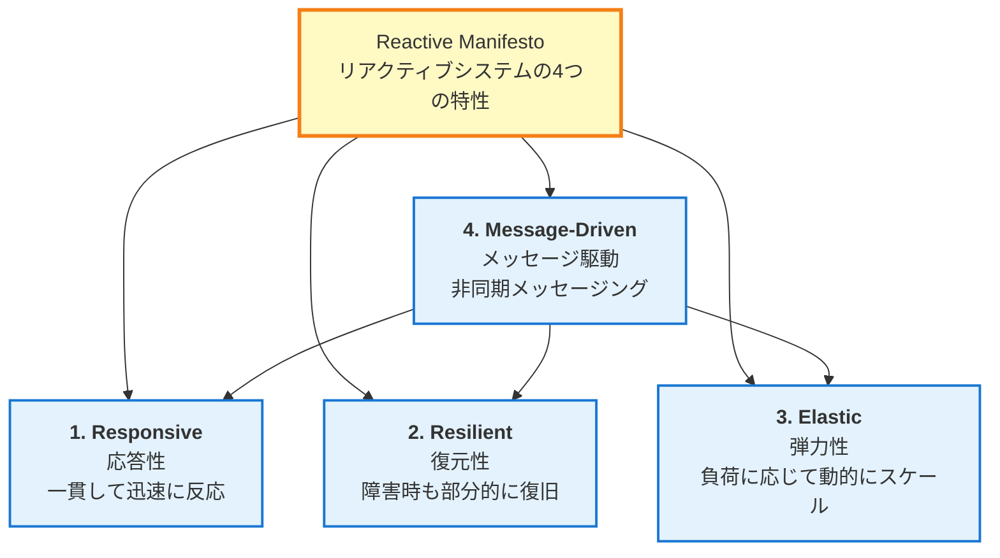
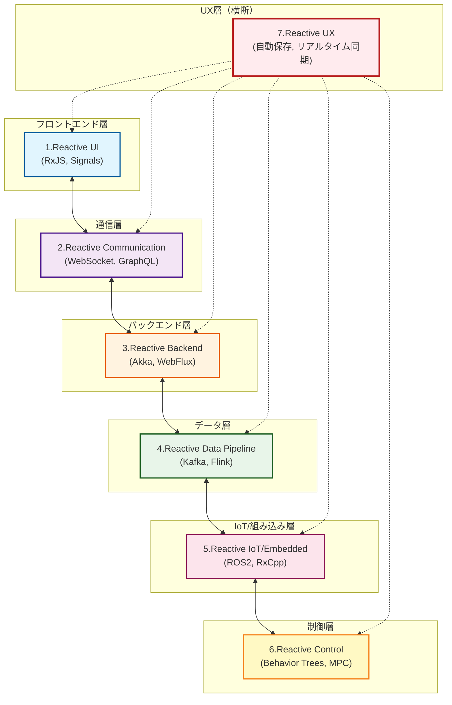
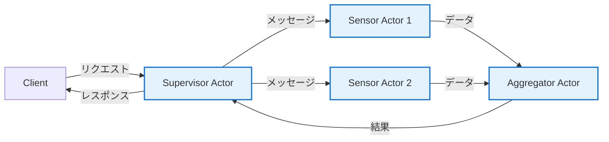
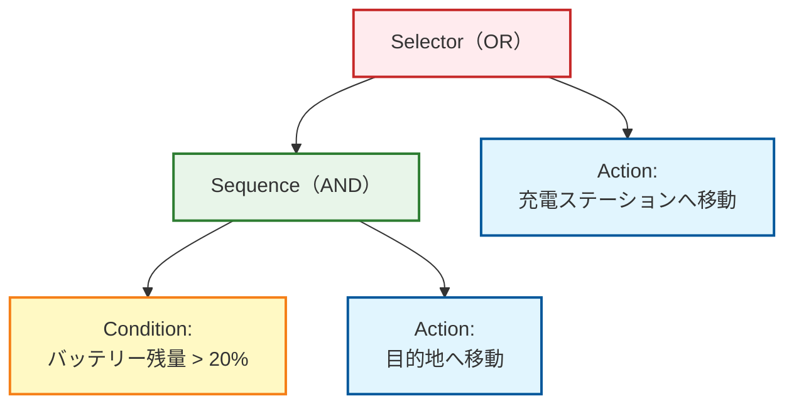
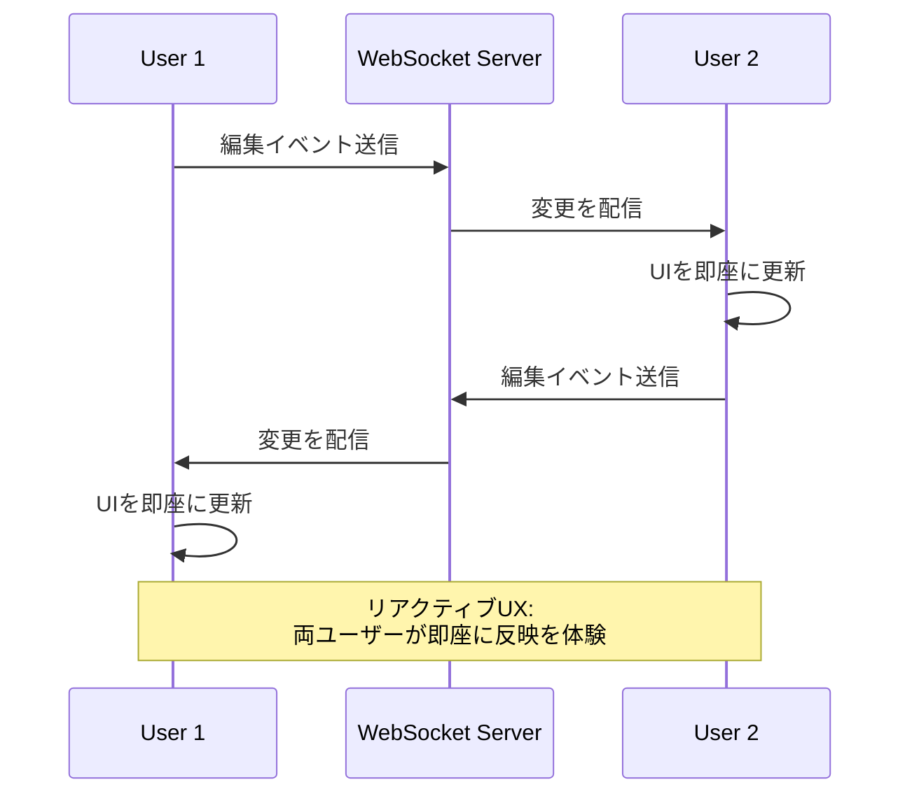
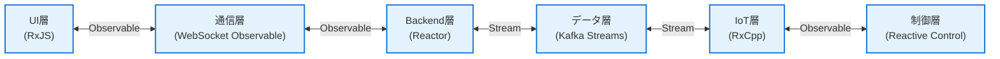

# リアクティブアーキテクチャ全体マップ

リアクティブプログラミングは、単なるライブラリやフレームワークの枠を超えて、**システム全体のアーキテクチャ哲学**へと発展しています。

このページでは、UIからバックエンド、データパイプライン、IoT、制御システムまで、**リアクティブアーキテクチャの全体像**を7つの層で体系的に解説します。

## リアクティブアーキテクチャとは

リアクティブアーキテクチャは、**時間とともに変化する値（Time-Varying Values）** を中心に据えたシステム設計の考え方です。

#### 中心的な思想
> UIのクリックからIoTセンサー、データストリーム、ロボット制御まで、すべては**時間とともに変化する値に反応する**

この思想を実現するために、[Reactive Manifesto](https://www.reactivemanifesto.org/)（リアクティブ宣言）が4つの重要な特性を定義しています。

## Reactive Manifestoの4つの特性

Reactive Manifestoは、リアクティブシステムが持つべき4つの特性を定義しています。



### 1. Responsive（応答性）

システムはユーザー入力や環境変化に対して、**一貫して迅速に反応**します。

::: tip 具体例
- UI操作への即座のフィードバック
- APIレスポンスタイムの予測可能性
- リアルタイムデータ更新
:::

### 2. Resilient（復元性）

障害が発生しても、**部分的に復旧**し、システム全体が停止しません。

::: tip 具体例
- エラーハンドリングとフォールバック
- サービスの隔離（マイクロサービス）
- 自動リトライとサーキットブレーカー
:::

### 3. Elastic（弾力性）

負荷に応じて**リソースを動的に調整**し、効率的にスケールします。

::: tip 具体例
- オートスケーリング
- 負荷分散
- バックプレッシャー制御
:::

### 4. Message-Driven（メッセージ駆動）

コンポーネント間は**非同期メッセージ**で通信し、疎結合を実現します。

::: tip 具体例
- イベントバス
- メッセージキュー（Kafka、RabbitMQ）
- Observable/Subscriberパターン
:::

::: info Reactive Manifestoの重要性
この4つの特性は、リアクティブアーキテクチャの**理論的基盤**です。RxJSやReactiveXは、これらの特性を実現するためのツールの一つに過ぎません。
:::

## リアクティブアーキテクチャの7つの層

リアクティブアーキテクチャは、以下の7つの層で構成されます。

| # | 層 | 概要 | 代表的な技術 |
|---|---|------|------------|
| 1 | **Reactive UI** | ユーザー入力に即座に反応するUI | RxJS、Angular Signals、Svelte Runes、React Hooks |
| 2 | **Reactive Communication** | クライアント/サーバー間のストリーム通信 | WebSocket、SSE、GraphQL Subscriptions |
| 3 | **Reactive Backend** | イベント駆動・ノンブロッキングサーバー | Akka、Spring WebFlux、Vert.x、Node.js Streams |
| 4 | **Reactive Data Pipeline** | イベントストリームを第一級のデータモデルに | Kafka、Flink、Apache Beam、Reactor |
| 5 | **Reactive IoT/Embedded** | センサーストリームの統合と融合 | ROS2、RxCpp、RxRust、Zephyr |
| 6 | **Reactive Control** | センサー→制御のフィードバックループ | Behavior Trees、Digital Twin、MPC |
| 7 | **Reactive UX** | 全層にわたるクローズドループUX | 自動保存、リアルタイム共同編集 |

### アーキテクチャ全体図



## 1. Reactive UI（フロントエンド）

ユーザー入力や非同期操作に対して、**リアルタイムで画面を更新**する層です。

### 中心的な考え方

> UIは「時間とともに変化する状態の投影（projection）」である

### 代表的な技術スタック

- **RxJS** - Observable/Operatorによるストリーム処理
- **Angular Signals** - Angular 19+のリアクティブプリミティブ
- **Svelte Runes** - Svelte 5の$state、$derived
- **React Hooks** - useState、useEffectによる状態管理
- **Vue Reactivity** - ref、reactive、computedによるリアクティビティ
- **SolidJS** - Signal基盤のきめ細かいリアクティビティ

### 実装例（RxJS）

```typescript
import { fromEvent } from 'rxjs';
import { debounceTime, distinctUntilChanged, map } from 'rxjs';

// 検索ボックスのリアクティブUI
const searchInput = document.querySelector<HTMLInputElement>('#search');
const resultsDiv = document.querySelector<HTMLDivElement>('#results');

const input$ = fromEvent(searchInput!, 'input').pipe(
  map(event => (event.target as HTMLInputElement).value),
  debounceTime(300),                    // 300ms待機（タイピング完了を待つ）
  distinctUntilChanged()                // 前回と同じ値なら無視
);

input$.subscribe(async searchTerm => {
  if (searchTerm.length === 0) {
    resultsDiv!.innerHTML = '';
    return;
  }

  // API呼び出し
  const results = await fetch(`/api/search?q=${encodeURIComponent(searchTerm)}`)
    .then(res => res.json());

  // UIを即座に更新
  resultsDiv!.innerHTML = results
    .map((r: any) => `<div class="result">${r.title}</div>`)
    .join('');
});
```

::: tip Reactive UIの利点
- デバウンス・スロットルによる無駄なAPI呼び出しの削減
- 宣言的な記述による可読性の向上
- 複数の非同期処理を容易に統合
:::

## 2. Reactive Communication（通信層）

クライアント/サーバー間で**双方向のデータストリーミング**を実現する層です。

### 代表的な技術スタック

- **WebSocket** - 全二重通信プロトコル
- **Server-Sent Events (SSE)** - サーバーからクライアントへの一方向ストリーム
- **GraphQL Subscriptions** - GraphQLのリアルタイム購読機能
- **tRPC** - 型安全なRPCフレームワーク
- **RxDB** - リアクティブデータベース（オフライン対応）

### 実装例（WebSocket + RxJS）

```typescript
import { webSocket } from 'rxjs/webSocket';
import { retry, catchError } from 'rxjs';
import { of } from 'rxjs';

// WebSocketをObservableとして扱う
const socket$ = webSocket<{ type: string; data: any }>({
  url: 'wss://example.com/socket',
  openObserver: {
    next: () => console.log('✅ WebSocket接続成功')
  },
  closeObserver: {
    next: () => console.log('❌ WebSocket切断')
  }
});

// リアルタイムデータの受信
socket$
  .pipe(
    retry({ count: 3, delay: 1000 }),  // 自動再接続
    catchError(error => {
      console.error('WebSocketエラー:', error);
      return of({ type: 'error', data: error });
    })
  )
  .subscribe(message => {
    switch (message.type) {
      case 'stock_price':
        updateStockChart(message.data);
        break;
      case 'notification':
        showNotification(message.data);
        break;
      // ... 他のメッセージタイプ
    }
  });

// サーバーへメッセージ送信
socket$.next({ type: 'subscribe', data: { symbol: 'AAPL' } });
```

::: info WebSocketとObservableの親和性
WebSocketの`onmessage`イベントは、Observableパターンそのものです。RxJSのwebSocket関数は、これを抽象化し、リトライやエラーハンドリングを容易にします。
:::

## 3. Reactive Backend（バックエンド）

**イベント駆動・ノンブロッキングI/O**でスケーラブルなサーバーアーキテクチャを実現する層です。

### 代表的な技術スタック

- **Akka (Scala/Java)** - Actorモデルベースのフレームワーク
- **Vert.x (JVM)** - ポリグロット対応のリアクティブツールキット
- **Spring WebFlux (Java)** - Project Reactor基盤のノンブロッキングWebフレームワーク
- **Node.js Streams** - ストリームベースのI/O処理
- **Elixir/Phoenix LiveView** - BEAM VM上のリアルタイムフレームワーク

### Actorモデルの概念

Actorモデルは、**隔離（Isolation）** と **非同期メッセージパッシング** を組み合わせた並行処理モデルです。



### 実装例（Akka - Scala）

```scala
import akka.actor.{Actor, ActorRef, Props}

// センサーActor
class SensorActor extends Actor {
  def receive: Receive = {
    case SensorData(value) =>
      // データを処理
      val processed = transform(value)
      // 親Actorに送信
      context.parent ! ProcessedData(processed)

    case ErrorOccurred(error) =>
      // エラーハンドリング
      context.parent ! FailureReport(error)
  }

  private def transform(value: Double): Double = {
    // データ変換ロジック
    value * 2.0
  }
}

// Supervisor Actor
class SupervisorActor extends Actor {
  val sensor1: ActorRef = context.actorOf(Props[SensorActor], "sensor1")
  val sensor2: ActorRef = context.actorOf(Props[SensorActor], "sensor2")

  def receive: Receive = {
    case StartMonitoring =>
      sensor1 ! SensorData(10.5)
      sensor2 ! SensorData(20.3)

    case ProcessedData(value) =>
      println(s"受信データ: $value")
      // 集約処理など
  }
}

// メッセージ定義
case class SensorData(value: Double)
case class ProcessedData(value: Double)
case object StartMonitoring
case class ErrorOccurred(error: Throwable)
case class FailureReport(error: Throwable)
```

::: tip Actorモデルの利点
- **障害の隔離** - 1つのActorが失敗しても、他は影響を受けない
- **スケーラビリティ** - Actorは軽量で、数百万単位で起動可能
- **メッセージ駆動** - Reactive Manifestoの原則に準拠
:::

## 4. Reactive Data Pipeline（データパイプライン）

**イベントストリームを第一級のデータモデル**として扱う層です。

### 中心的な考え方

> "Event Stream is the new Database"（イベントストリームが新しいデータベース）

従来のデータベース中心のアーキテクチャから、**イベントストリーム中心のアーキテクチャ**へのパラダイムシフトです。

### 代表的な技術スタック

- **Apache Kafka** - 分散イベントストリーミングプラットフォーム
- **Apache Flink** - ストリーム処理エンジン
- **Apache Beam** - 統一されたバッチ/ストリーム処理モデル
- **Apache NiFi** - データフローの自動化
- **Project Reactor** - JVM上のリアクティブライブラリ
- **Reactive Streams API** - JVMのストリーム処理標準

### データパイプラインパターン

```
Event Source → Parse → Validate → Enrich → Aggregate → Store/Forward
```

### 実装例（疑似コード）

```typescript
// Kafka + Flink的なストリームパイプライン
stream
  .map(event => parseJSON(event))           // パース
  .filter(data => isValid(data))            // バリデーション
  .map(data => enrichWithMetadata(data))    // メタデータ付与
  .groupBy(data => data.sensorId)           // センサーIDでグループ化
  .window(10.seconds)                       // 10秒ごとのウィンドウ
  .reduce((acc, value) => aggregate(acc, value))  // 集約
  .sink(database)                           // データベースへ保存
```

### RxJSでの対応表現

```typescript
import { interval } from 'rxjs';
import { map, filter, groupBy, bufferTime, mergeMap } from 'rxjs';

interface SensorEvent {
  sensorId: string;
  value: number;
  timestamp: number;
}

// イベントストリームのシミュレーション
const eventStream$ = interval(100).pipe(
  map((): SensorEvent => ({
    sensorId: `sensor-${Math.floor(Math.random() * 3)}`,
    value: Math.random() * 100,
    timestamp: Date.now()
  }))
);

// データパイプライン
eventStream$
  .pipe(
    // バリデーション
    filter(event => event.value >= 0 && event.value <= 100),

    // センサーIDでグループ化
    groupBy(event => event.sensorId),

    // 各グループを10秒ごとにバッファリング
    mergeMap(group$ =>
      group$.pipe(
        bufferTime(10000),
        filter(events => events.length > 0),
        map(events => ({
          sensorId: events[0].sensorId,
          avgValue: events.reduce((sum, e) => sum + e.value, 0) / events.length,
          count: events.length,
          timestamp: Date.now()
        }))
      )
    )
  )
  .subscribe(aggregated => {
    console.log('集約データ:', aggregated);
    // データベースへ保存
    saveToDatabase(aggregated);
  });

function saveToDatabase(data: any): void {
  // データベース保存ロジック
}
```

::: warning Event Sourcingとの関連
Event Sourcingは、システムの状態をイベントの履歴として記録する設計パターンです。Kafkaなどのイベントストリーミングプラットフォームと組み合わせることで、強力なリアクティブデータパイプラインが構築できます。
:::

## 5. Reactive IoT/Embedded（IoT・組み込み）

センサーストリームの統合とリアルタイム融合を実現する層です。

### 代表的な技術スタック

- **ROS2 (Robot Operating System 2)** - ロボット開発プラットフォーム
- **RxCpp** - C++版ReactiveX
- **RxRust** - Rust版ReactiveX
- **Zephyr RTOS** - IoT向けリアルタイムOS
- **TinyOS** - センサーネットワーク向けOS

### UIとの違い

| 観点 | Reactive UI | Reactive IoT |
|------|------------|--------------|
| **リアクティビティの対象** | ユーザー入力、API応答 | センサー値、制御信号 |
| **リアルタイム性** | ミリ秒単位（UX重視） | マイクロ秒単位（制御重視） |
| **主な処理** | 表示、バリデーション | フィルタリング、融合、制御 |

### 実装例（ROS2 - Python）

```python
import rclpy
from rclpy.node import Node
from sensor_msgs.msg import LaserScan
from geometry_msgs.msg import Twist

class ObstacleAvoidance(Node):
    def __init__(self):
        super().__init__('obstacle_avoidance')

        # LiDARセンサーからのデータを購読
        self.subscription = self.create_subscription(
            LaserScan,
            '/scan',
            self.laser_callback,
            10
        )

        # 速度指令をパブリッシュ
        self.velocity_publisher = self.create_publisher(
            Twist,
            '/cmd_vel',
            10
        )

    def laser_callback(self, msg: LaserScan):
        # センサーデータの処理（リアクティブ）
        min_distance = min(msg.ranges)

        # 障害物検知に反応
        if min_distance < 0.5:  # 50cm以内に障害物
            self.get_logger().warn(f'⚠️ 障害物検知: {min_distance:.2f}m')
            self.stop_robot()
        else:
            self.move_forward()

    def stop_robot(self):
        twist = Twist()
        twist.linear.x = 0.0
        twist.angular.z = 0.0
        self.velocity_publisher.publish(twist)

    def move_forward(self):
        twist = Twist()
        twist.linear.x = 0.3  # 0.3 m/s前進
        twist.angular.z = 0.0
        self.velocity_publisher.publish(twist)

def main(args=None):
    rclpy.init(args=args)
    node = ObstacleAvoidance()
    rclpy.spin(node)
    rclpy.shutdown()

if __name__ == '__main__':
    main()
```

::: info センサーフュージョンとリアクティブ
複数のセンサー（LiDAR、カメラ、IMU、GPS）からのデータを統合する「センサーフュージョン」は、RxJSの`combineLatest`や`merge`と同じ概念です。
:::

## 6. Reactive Control（制御システム）

センサーから制御へのフィードバックループを実現する層です。

### 代表的な技術スタック

- **Behavior Trees** - ロボット・ゲームAIの行動選択
- **Digital Twin** - 物理システムのデジタルレプリカ
- **Model Predictive Control (MPC)** - 予測制御
- **Cyber-Physical Systems (CPS)** - サイバーフィジカルシステム

### Behavior Treeの構造



**動作：**
1. バッテリー残量が20%以上 → 目的地へ移動
2. バッテリー残量が20%未満 → 充電ステーションへ移動

### 状態遷移のリアクティブ表現

Behavior Treeの状態遷移は、RxJSの`scan`や`switchMap`で表現できます。

```typescript
import { interval, Subject } from 'rxjs';
import { map, scan, switchMap } from 'rxjs';

type BatteryLevel = number; // 0-100
type RobotState = 'IDLE' | 'MOVING_TO_GOAL' | 'MOVING_TO_CHARGER' | 'CHARGING';

interface RobotStatus {
  state: RobotState;
  batteryLevel: BatteryLevel;
}

// バッテリーレベルのシミュレーション
const batteryLevel$ = interval(1000).pipe(
  scan((level, _) => Math.max(0, level - 1), 100) // 1秒ごとに1%減少
);

// Behavior Treeのロジック
const robotState$ = batteryLevel$.pipe(
  map((batteryLevel): RobotStatus => {
    // Selector（OR）ロジック
    if (batteryLevel > 20) {
      // Sequence（AND）条件を満たす
      return { state: 'MOVING_TO_GOAL', batteryLevel };
    } else {
      // 充電が必要
      return { state: 'MOVING_TO_CHARGER', batteryLevel };
    }
  })
);

robotState$.subscribe(status => {
  console.log(`State: ${status.state}, Battery: ${status.batteryLevel}%`);

  switch (status.state) {
    case 'MOVING_TO_GOAL':
      console.log('→ 目的地へ移動中');
      break;
    case 'MOVING_TO_CHARGER':
      console.log('⚠️ バッテリー低下！充電ステーションへ移動');
      break;
  }
});
```

::: tip 制御システムとリアクティビティ
制御工学における「フィードバックループ」は、リアクティブプログラミングの「イベント駆動」と本質的に同じです。センサー値の変化に応じて、制御指令を動的に変更します。
:::

## 7. Reactive UX（クローズドループUX）

全層にわたる**クローズドループUX**を実現する、最も高レベルの層です。

### 中心的な考え方

> システム全体の応答性が、一貫したユーザー体験を創り出す

### 代表的な例

| サービス | リアクティブUXの特徴 |
|---------|-------------------|
| **Google Docs** | 自動保存、リアルタイム共同編集 |
| **Figma** | マルチユーザーのライブコラボレーション |
| **Firebase** | リアルタイムデータ同期 |
| **Slack** | メッセージの即時配信・表示 |
| **Notion** | オフライン編集とシームレスな同期 |

### 実装例：自動保存機能

```typescript
import { fromEvent, Subject } from 'rxjs';
import { debounceTime, distinctUntilChanged, switchMap, catchError } from 'rxjs';
import { of } from 'rxjs';

// エディタの内容変更イベント
const editor = document.querySelector<HTMLTextAreaElement>('#editor');
const statusDiv = document.querySelector<HTMLDivElement>('#status');

const editorChange$ = fromEvent(editor!, 'input').pipe(
  map(event => (event.target as HTMLTextAreaElement).value)
);

// 自動保存ロジック
const autoSave$ = editorChange$.pipe(
  debounceTime(2000),                    // 2秒間の入力停止を待つ
  distinctUntilChanged(),                // 前回と同じ内容なら保存しない
  switchMap(content => {
    // 保存中の表示
    statusDiv!.textContent = '💾 保存中...';

    // API呼び出し
    return fetch('/api/save', {
      method: 'POST',
      headers: { 'Content-Type': 'application/json' },
      body: JSON.stringify({ content })
    }).then(res => {
      if (!res.ok) throw new Error('保存失敗');
      return res.json();
    });
  }),
  catchError(error => {
    statusDiv!.textContent = '❌ 保存失敗';
    return of(null);
  })
);

autoSave$.subscribe(result => {
  if (result) {
    statusDiv!.textContent = '✅ 保存完了';
    setTimeout(() => {
      statusDiv!.textContent = '';
    }, 2000);
  }
});
```

### リアルタイム共同編集の仕組み



::: info Reactive UXの本質
Reactive UXは、UI→通信→バックエンド→データパイプライン→IoT→制御の**全層が一貫してリアクティブ**であることで実現されます。1つの層だけがリアクティブでも、真のReactive UXは達成できません。
:::

## 層間の統合とReactiveXの役割

7つの層は独立しているように見えますが、**ReactiveXが共通言語**として機能することで、シームレスに統合されます。

### ReactiveXによる統合



**共通の概念：**
- **Observable/Stream** - 時間とともに変化する値
- **Operator/Transformation** - データの変換・フィルタリング
- **Subscribe/Consume** - イベントの消費
- **Backpressure** - 負荷制御
- **Error Handling** - エラーの伝播と処理

::: tip ReactiveXの価値
ReactiveXは、UIのクリックイベントからIoTセンサー、データストリーム、ロボット制御まで、**すべてを同じ概念（Observable）で扱える**ようにします。これにより、フルスタックエンジニアは一貫した思考モデルでシステム全体を設計できます。
:::

## リアクティブアーキテクチャの利点

### 1. 一貫した概念モデル

異なるドメイン（UI、バックエンド、データ、IoT）で**同じ概念**を使えます。

**従来型：**
- UI: イベントリスナー
- バックエンド: コールバック
- データ: バッチ処理
- IoT: ポーリング

**リアクティブ型：**
- すべて: **Observable/Stream**

### 2. 非同期処理の統一的な扱い

Promise、コールバック、イベント、ストリームを**Observableに統一**できます。

```typescript
import { from, fromEvent, ajax } from 'rxjs';

// Promiseをストリーム化
const promise$ = from(fetch('/api/data'));

// イベントをストリーム化
const click$ = fromEvent(button, 'click');

// Ajax呼び出しをストリーム化
const api$ = ajax('/api/endpoint');

// 全て同じように扱える
promise$.subscribe(/*...*/);
click$.subscribe(/*...*/);
api$.subscribe(/*...*/);
```

### 3. スケーラビリティと耐障害性

Reactive Manifestoの4つの特性により
- **Responsive** - 一貫した応答時間
- **Resilient** - 障害の隔離と復旧
- **Elastic** - 負荷に応じた動的スケール
- **Message-Driven** - 疎結合なコンポーネント

### 4. リアルタイム性の向上

イベント駆動アーキテクチャにより、**データの変化を即座に伝播**できます。

**従来型（ポーリング）：**
```
Client → [定期的にリクエスト] → Server
```

**リアクティブ型（プッシュ）：**
```
Client ← [変更時に即座に通知] ← Server
```

### 5. 開発者体験の向上

宣言的な記述により、**コードの意図が明確**になります。

```typescript
// ❌ 命令型：意図が読み取りにくい
let lastValue = '';
input.addEventListener('input', (e) => {
  const value = e.target.value;
  if (value !== lastValue) {
    setTimeout(() => {
      if (value.length > 0) {
        fetch(`/api/search?q=${value}`)
          .then(/*...*/);
      }
    }, 300);
    lastValue = value;
  }
});

// ✅ 宣言的：意図が一目瞭然
fromEvent(input, 'input')
  .pipe(
    map(e => e.target.value),
    debounceTime(300),
    distinctUntilChanged(),
    filter(value => value.length > 0),
    switchMap(value => ajax(`/api/search?q=${value}`))
  )
  .subscribe(/*...*/);
```

## まとめ

リアクティブアーキテクチャは、**時間とともに変化する値**を中心に据えた、システム全体の設計哲学です。

### 7つの層の役割

| 層 | 役割 | ReactiveXの活用 |
|----|------|----------------|
| **1. Reactive UI** | ユーザー入力への即座の反応 | RxJS、Signals |
| **2. Reactive Communication** | クライアント/サーバー間ストリーミング | WebSocket Observable |
| **3. Reactive Backend** | イベント駆動サーバー | Akka、Reactor |
| **4. Reactive Data Pipeline** | イベントストリーム処理 | Kafka、Flink |
| **5. Reactive IoT/Embedded** | センサーストリーム統合 | RxCpp、ROS2 |
| **6. Reactive Control** | フィードバックループ制御 | Behavior Trees |
| **7. Reactive UX** | 全層にわたる一貫した体験 | 上記すべての統合 |

### Reactive Manifestoの重要性

::: info 4つの特性

1. **Responsive（応答性）** - 一貫して迅速に反応
2. **Resilient（復元性）** - 障害時も部分的に復旧
3. **Elastic（弾力性）** - 負荷に応じて動的にスケール
4. **Message-Driven（メッセージ駆動）** - 非同期メッセージング

:::

### ReactiveXの本質

ReactiveXは、これらの層を**横断的に扱える共通言語**です。

> UIのクリックから、IoTセンサー、データストリーム、ロボット制御まで、すべては**時間とともに変化する値に反応する**

この統一的な概念により、フルスタックエンジニアは一貫した思考モデルでシステム全体を設計できます。

### 次のステップ

リアクティブアーキテクチャの理解を深めるために

1. **小規模から始める** - まずは1つの層（Reactive UI）から実践
2. **段階的に拡大** - 通信層、バックエンド層へと広げる
3. **実際のサービスで学ぶ** - Google Docs、Figmaなどの動作を観察
4. **Reactive Manifestoを読む** - 理論的基盤を理解

## 関連ページ

- [組み込み開発とリアクティブプログラミング](/guide/appendix/embedded-reactive-programming) - IoT/組み込み層の詳細
- [ReactiveX以外のリアクティブ的手法](/guide/appendix/reactive-patterns-beyond-rxjs) - 各層の具体的な実装手法
- [RxJS入門](/guide/introduction) - RxJSの基礎概念
- [Observableとは](/guide/observables/what-is-observable) - Observableの基本
- [結合オペレーター](/guide/operators/combination/) - 複数ストリームの統合

## 参考資料

- [GitHub Discussions - リアクティブアーキテクチャ全体マップ](https://github.com/shuji-bonji/RxJS-with-TypeScript/discussions/15)
- [Reactive Manifesto](https://www.reactivemanifesto.org/) - リアクティブシステムの定義
- [RxJS公式ドキュメント](https://rxjs.dev/)
- [Akka公式ドキュメント](https://doc.akka.io/)
- [Apache Kafka公式ドキュメント](https://kafka.apache.org/documentation/)
- [ROS2公式ドキュメント](https://docs.ros.org/)
