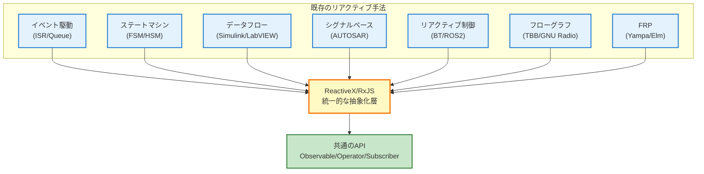

# ReactiveX以外のリアクティブ的手法（組み込み視点）

リアクティブプログラミングの思想は、ReactiveX（RxJS）が登場する以前から、組み込みシステムや制御工学の分野で広く実践されてきました。

このページでは、**ReactiveXを使わずにリアクティブプログラミングの原則を実現している手法**を体系的に整理し、RxJSとの関連性を明らかにします。

## リアクティブプログラミングの本質

リアクティブプログラミングの核心は、以下の3つの原則にあります。

1. **データの流れ（Data Flow）** - データが時間とともに変化するストリームとして扱われる
2. **イベント駆動（Event-Driven）** - イベント発生時に自動的に処理が実行される
3. **宣言的記述（Declarative）** - 「何をするか」を記述し、「いつ・どのように」は抽象化される

これらの原則は、ReactiveX以外の多くの手法でも実現されています。

::: info ReactiveXの本質
ReactiveXは、リアクティビティを**発明**したのではなく、既存のプラクティスを**統一的な抽象化層に標準化**したものです。
:::

## ReactiveX以外のリアクティブ手法

組み込みシステムや制御工学で用いられる7つの代表的なリアクティブ手法を紹介します。

| # | 手法 | 概要 | 代表的なツール/フレームワーク |
|---|------|------|--------------------------|
| 1 | **イベント駆動アーキテクチャ** | ISR/キューでイベントを非同期処理 | RTOS（FreeRTOS、Zephyr） |
| 2 | **ステートマシン（FSM/HSM）** | イベントに応じて状態を遷移 | QPC、SCXML、Yakindu |
| 3 | **データフロープログラミング** | データの流れに沿ってノードを駆動 | Simulink、LabVIEW、SCADE |
| 4 | **シグナルベース制御** | システム全体で値の更新を伝播 | AUTOSAR COM Stack、Simulink |
| 5 | **リアクティブ制御システム** | 環境変化に応じた行動選択 | Behavior Tree、ROS2 |
| 6 | **フローグラフライブラリ** | データ依存を明示的に並列処理 | Intel TBB、GNU Radio、StreamIt |
| 7 | **関数型リアクティブプログラミング** | 時間変化する値を関数的に扱う | Haskell Yampa、Elm、Dunai |

## 1. イベント駆動アーキテクチャ（Event-Driven Architecture）

割り込みサービスルーチン（ISR）がイベントをキャプチャし、メッセージキューを経由してタスクに通知する構造です。

### C言語での実装例

```c
// イベントキュー（グローバル）
typedef struct {
    EventType type;
    void* data;
} Event;

Event eventQueue[EVENT_QUEUE_SIZE];
int queueHead = 0;
int queueTail = 0;

// 割り込みサービスルーチン（ISR）
void ISR_SensorUpdate() {
    // センサーからデータを読み取り
    SensorData* data = readSensor();

    // イベントキューにプッシュ
    Event e = { EVENT_SENSOR_NEW_DATA, data };
    EventQueue_push(e);
}

// メインタスク
void Task_MainLoop() {
    Event e;
    while (1) {
        if (EventQueue_pop(&e)) {
            switch (e.type) {
                case EVENT_SENSOR_NEW_DATA:
                    processSensorData((SensorData*)e.data);
                    break;
                case EVENT_TIMER_EXPIRED:
                    handleTimeout();
                    break;
                // ... 他のイベント処理
            }
        }
    }
}
```

### RxJSとの対応関係

| イベント駆動モデル | RxJS |
|-----------------|------|
| `EventQueue` | `Observable` |
| `Task_MainLoop` | `subscribe()` |
| `ISR_SensorUpdate` | `next()` |
| イベントの型 | ストリームの値の型 |

::: tip イベント駆動の特徴
- RTOS（Real-Time Operating System）で広く採用
- 割り込み処理とタスク処理を明確に分離
- キューイングによる非同期処理
:::

## 2. ステートマシン（State Machine / FSM / HSM）

有限状態機械（FSM: Finite State Machine）や階層化状態機械（HSM: Hierarchical State Machine）は、イベント入力に基づいて状態を遷移させるパターンです。

### ステートマシンの例（C言語）

```c
typedef enum {
    STATE_IDLE,
    STATE_RUNNING,
    STATE_ERROR,
    STATE_SHUTDOWN
} State;

typedef enum {
    EVENT_START,
    EVENT_STOP,
    EVENT_ERROR_DETECTED,
    EVENT_RESET
} Event;

State currentState = STATE_IDLE;

void stateMachine(Event event) {
    switch (currentState) {
        case STATE_IDLE:
            if (event == EVENT_START) {
                currentState = STATE_RUNNING;
                startOperation();
            }
            break;

        case STATE_RUNNING:
            if (event == EVENT_STOP) {
                currentState = STATE_IDLE;
                stopOperation();
            } else if (event == EVENT_ERROR_DETECTED) {
                currentState = STATE_ERROR;
                handleError();
            }
            break;

        case STATE_ERROR:
            if (event == EVENT_RESET) {
                currentState = STATE_IDLE;
                resetSystem();
            }
            break;

        // ... 他の状態
    }
}
```

### 代表的なツール
- **QPC (Quantum Platform)** - 階層化状態機械フレームワーク
- **SCXML (State Chart XML)** - W3C標準の状態機械記述言語
- **Yakindu Statechart Tools** - ステートチャートのモデリングツール

### RxJSでの対応表現

```typescript
import { Subject, scan } from 'rxjs';

type State = 'IDLE' | 'RUNNING' | 'ERROR' | 'SHUTDOWN';
type Event = 'START' | 'STOP' | 'ERROR_DETECTED' | 'RESET';

const events$ = new Subject<Event>();

const state$ = events$.pipe(
  scan((state: State, event: Event): State => {
    switch (state) {
      case 'IDLE':
        return event === 'START' ? 'RUNNING' : state;
      case 'RUNNING':
        if (event === 'STOP') return 'IDLE';
        if (event === 'ERROR_DETECTED') return 'ERROR';
        return state;
      case 'ERROR':
        return event === 'RESET' ? 'IDLE' : state;
      default:
        return state;
    }
  }, 'IDLE' as State)
);

state$.subscribe(state => console.log('Current state:', state));

// イベント発火
events$.next('START');   // → RUNNING
events$.next('STOP');    // → IDLE
```

::: info 階層化状態機械（HSM）の利点
HSMは複数の状態をグループ化でき、「複数購読をまとめる」RxJSの`share`や`shareReplay`に類似した構造を持ちます。
:::

## 3. データフロープログラミング（Dataflow Programming）

データの流れに応じてノードを駆動する、視覚的なプログラミング手法です。

### 代表的なツール
- **MATLAB Simulink** - 制御システム設計とシミュレーション
- **LabVIEW (National Instruments)** - 計測・制御システム開発
- **SCADE (Esterel Technologies)** - 安全性重視システム（航空宇宙・鉄道）

### Simulinkのデータフローイメージ

```
[Sensor] → [Low-Pass Filter] → [Threshold] → [Condition] → [Actuator]
   ↓              ↓                 ↓              ↓             ↓
  生値         平滑化値           判定値        真/偽         出力
```

### RxJSでの対応表現

```typescript
import { interval } from 'rxjs';
import { map, filter, tap } from 'rxjs';

// センサーストリーム
const sensor$ = interval(100).pipe(
  map(() => Math.random() * 100) // センサー値のシミュレーション
);

// データフローパイプライン
sensor$
  .pipe(
    map(value => lowPassFilter(value)),        // ローパスフィルタ
    map(value => value > 50 ? value : 0),      // 閾値処理
    filter(value => value > 0),                // 条件判定
    tap(value => actuate(value))               // アクチュエーター駆動
  )
  .subscribe();

function lowPassFilter(value: number): number {
  // 簡易的なローパスフィルタ（移動平均）
  return value * 0.3 + previousValue * 0.7;
}

function actuate(value: number): void {
  console.log('Actuator output:', value);
}
```

::: tip データフロープログラミングの特徴
- 視覚的にデータの流れを把握できる
- 制御工学や信号処理で広く採用
- RxJSのパイプライン（`.pipe()`）と構造が酷似
:::

## 4. シグナルベース制御（Signal-Based Control）

システム全体で値の更新を伝播させるパターンです。自動車業界で標準化されているAUTOSAR COM StackやSimulinkが代表例です。

### AUTOSAR COM Stackのイメージ

```c
// シグナル定義
typedef struct {
    uint16_t speed;        // 速度 [km/h]
    uint8_t temperature;   // 温度 [℃]
    bool doorOpen;         // ドア開閉状態
} VehicleSignals;

VehicleSignals currentSignals;

// シグナル更新
void updateSpeed(uint16_t newSpeed) {
    currentSignals.speed = newSpeed;
    // COM Stackが購読者に通知
    Com_SendSignal(SIGNAL_ID_SPEED, &currentSignals.speed);
}

// シグナル購読
void speedMonitor() {
    uint16_t speed;
    Com_ReceiveSignal(SIGNAL_ID_SPEED, &speed);

    if (speed > 120) {
        triggerSpeedWarning();
    }
}
```

### RxJSでの対応（BehaviorSubject）

```typescript
import { BehaviorSubject } from 'rxjs';

interface VehicleSignals {
  speed: number;
  temperature: number;
  doorOpen: boolean;
}

// BehaviorSubject - 現在値を保持
const vehicleSignals$ = new BehaviorSubject<VehicleSignals>({
  speed: 0,
  temperature: 20,
  doorOpen: false
});

// シグナル更新
function updateSpeed(newSpeed: number) {
  const current = vehicleSignals$.value;
  vehicleSignals$.next({ ...current, speed: newSpeed });
}

// シグナル購読
vehicleSignals$.subscribe(signals => {
  if (signals.speed > 120) {
    console.log('⚠️ 速度超過警告');
  }
});

updateSpeed(130); // → 警告が発動
```

::: info シグナルベース制御の特徴
- **現在値を常に保持** - BehaviorSubjectと同じ特性
- AUTOSAR（自動車業界標準）で広く採用
- ECU（Electronic Control Unit）間の通信に使用
:::

## 5. リアクティブ制御システム（Reactive Control Systems）

ロボティクスや自動運転向けに、環境変化に応じた行動選択を実装する手法です。

### 代表的なフレームワーク
- **Behavior Tree (BT)** - ゲームAI、ロボット制御
- **ROS2 (Robot Operating System 2)** - ロボット開発プラットフォーム

### Behavior Treeの構造

```
Selector（OR）
├─ Sequence（AND）
│  ├─ Condition: バッテリー残量 > 20%
│  └─ Action: 目的地へ移動
└─ Action: 充電ステーションへ移動
```

### ROS2のリアクティブパターン（Python）

```python
import rclpy
from rclpy.node import Node
from sensor_msgs.msg import LaserScan

class ObstacleDetector(Node):
    def __init__(self):
        super().__init__('obstacle_detector')
        # LiDARセンサーからのデータを購読
        self.subscription = self.create_subscription(
            LaserScan,
            '/scan',
            self.laser_callback,
            10
        )

    def laser_callback(self, msg):
        # 最小距離を取得
        min_distance = min(msg.ranges)

        # 障害物検知時の反応
        if min_distance < 0.5:  # 50cm以内
            self.get_logger().warn('障害物検知！停止します')
            self.stop_robot()
```

### RxJSでの対応表現

```typescript
import { fromEvent } from 'rxjs';
import { map, filter } from 'rxjs';

// LiDARセンサーデータのストリーム
const lidarData$ = fromEvent<LaserScan>(lidarSensor, 'scan');

lidarData$
  .pipe(
    map(scan => Math.min(...scan.ranges)),  // 最小距離を取得
    filter(minDistance => minDistance < 0.5) // 50cm以内
  )
  .subscribe(() => {
    console.warn('⚠️ 障害物検知！停止します');
    stopRobot();
  });
```

::: tip リアクティブ制御の応用分野
- 自動運転車の障害物回避
- ドローンの自律飛行
- 産業用ロボットの安全制御
:::

## 6. フローグラフライブラリ（Flow Graph Libraries）

マルチスレッド環境でデータ依存を明示的に処理するライブラリです。

### 代表的なライブラリ
- **Intel TBB (Threading Building Blocks) Flow Graph**
- **GNU Radio** - ソフトウェア無線（SDR）
- **StreamIt (MIT)** - ストリーム処理言語

### ntel TBB Flow Graphの例（C++）

```cpp
#include <tbb/flow_graph.h>
#include <iostream>

int main() {
    tbb::flow::graph g;

    // ブロードキャストノード（Observable的な役割）
    tbb::flow::broadcast_node<int> source(g);

    // 変換ノード（map的な役割）
    tbb::flow::function_node<int, int> multiply(
        g,
        tbb::flow::unlimited,
        [](int x) { return x * 2; }
    );

    tbb::flow::function_node<int, int> add(
        g,
        tbb::flow::unlimited,
        [](int x) { return x + 10; }
    );

    // 出力ノード（subscribe的な役割）
    tbb::flow::function_node<int> output(
        g,
        tbb::flow::unlimited,
        [](int x) { std::cout << "Result: " << x << std::endl; }
    );

    // エッジ接続
    tbb::flow::make_edge(source, multiply);
    tbb::flow::make_edge(multiply, add);
    tbb::flow::make_edge(add, output);

    // データ投入
    source.try_put(5);  // → Result: 20 (5 * 2 + 10)
    g.wait_for_all();

    return 0;
}
```

### RxJSでの対応表現

```typescript
import { of } from 'rxjs';
import { map } from 'rxjs';

of(5)
  .pipe(
    map(x => x * 2),      // multiply
    map(x => x + 10)      // add
  )
  .subscribe(result => {
    console.log('Result:', result); // → Result: 20
  });
```

::: info フローグラフの特徴
- **並列実行の最適化** - データ依存を明示的に管理
- CPUのマルチコアを効率的に活用
- 信号処理、画像処理、通信システムで広く採用
:::

## 7. 関数型リアクティブプログラミング（FRP）

Functional Reactive Programming（FRP）は、リアクティブプログラミングの理論的基盤です。

### 代表的な言語・ライブラリ
- **Haskell Yampa** - ゲーム開発、ロボティクス
- **Elm** - Webフロントエンド（型安全なReact的フレームワーク）
- **Dunai** - 汎用的なFRPライブラリ

### Haskell Yampaの例

```haskell
import FRP.Yampa

-- シグナル関数（Signal Function）の定義
-- Input → Output への時間依存変換
simpleSF :: SF Double Double
simpleSF = arr (\x -> x * 2)       -- 値を2倍に
       >>> integral                -- 積分（時間で累積）
       >>> arr (\x -> x + 10)      -- 10を加算

-- 実行例
-- 入力: 時間とともに変化する値（例: センサー値）
-- 出力: 変換された値のストリーム
```

### RxJSでの対応表現

```typescript
import { interval } from 'rxjs';
import { map, scan } from 'rxjs';

const simpleSF$ = interval(100).pipe(
  map(x => x * 2),                         // arr (\x -> x * 2)
  scan((acc, value) => acc + value, 0),    // integral（積分＝累積）
  map(x => x + 10)                         // arr (\x -> x + 10)
);

simpleSF$.subscribe(result => console.log(result));
```

### FRPの主要概念

| FRP概念 | 説明 | RxJS対応 |
|--------|------|----------|
| **Signal** | 時間とともに変化する値 | `Observable` |
| **Event** | 離散的な出来事 | `Subject` |
| **Signal Function (SF)** | 信号の変換関数 | `pipe()` + オペレーター |
| **Behavior** | 常に値を持つ時間変化 | `BehaviorSubject` |

::: info FRPの重要性
FRPは、ReactiveXの**理論的基盤**です。Haskellなどの純粋関数型言語で培われた概念が、RxJSやReactiveXに受け継がれています。
:::

## ReactiveXの位置づけ

これまで見てきた7つの手法を踏まえると、ReactiveXの本質が明確になります。

### ReactiveXが果たす役割



ReactiveXは、これらの既存手法を**横断的に扱える共通言語**として機能します。

### ReactiveXの利点

| 観点 | 従来の手法 | ReactiveX/RxJS |
|------|-----------|---------------|
| **学習コスト** | 分野ごとに異なる概念・ツール | 統一されたAPI（Observable/Operator） |
| **移植性** | プラットフォーム依存が強い | 言語間で概念が共通（RxJava、RxSwift等） |
| **合成可能性** | 手法間の組み合わせが困難 | オペレーターで柔軟に合成可能 |
| **デバッグ** | 分野固有のツールが必要 | RxJS DevTools、tap等の共通ツール |
| **テスト** | 非同期処理のテストが複雑 | TestScheduler、Marble Testing |

::: tip ReactiveXの本質
ReactiveXは**発明ではなく、統合**です。既存のリアクティブ手法を学び、それらを統一的に扱える抽象化層として理解することが重要です。
:::

## 実務での使い分け

各手法には適した適用領域があります。

### 適用領域の比較

| 手法 | 最適な用途 | 学習コスト | 移植性 |
|------|----------|-----------|--------|
| **イベント駆動（ISR/Queue）** | RTOSベースの組み込み制御 | 低 | 低（プラットフォーム依存） |
| **ステートマシン（FSM/HSM）** | 複雑な状態遷移が必要な制御 | 中 | 中（QPC等で抽象化可能） |
| **データフロー（Simulink）** | 制御システム設計・シミュレーション | 高 | 低（ツール依存） |
| **シグナルベース（AUTOSAR）** | 自動車ECU間通信 | 高 | 低（業界標準だが特化） |
| **リアクティブ制御（ROS2）** | ロボティクス、自動運転 | 中 | 中（ROS2エコシステム） |
| **フローグラフ（TBB）** | 並列処理、信号処理 | 中 | 中（C++環境） |
| **FRP（Haskell）** | 型安全性重視、学術研究 | 高 | 低（関数型言語） |
| **ReactiveX（RxJS）** | Webアプリ、IoTエッジ処理、汎用 | 中 | **高（多言語サポート）** |

### 選択のガイドライン

::: warning ハードリアルタイム制御（マイクロ秒単位）
→ **イベント駆動（ISR/Queue）** または **専用RTOS**

ReactiveXは不向き（オーバーヘッド大）
:::

::: tip ソフトリアルタイム制御（ミリ秒単位）
→ **ReactiveX/RxJS** が最適

センサー統合、イベント相関検知、異常検知など
:::

::: info 既存のツールチェーンがある場合
→ **その分野の標準ツールを優先**

例: 自動車業界 → AUTOSAR、ロボティクス → ROS2
:::

## まとめ

リアクティブプログラミングの思想は、ReactiveX登場以前から多くの分野で実践されてきました。

### 重要なポイント

1. **ReactiveXは統合者** - 既存手法を横断的に扱える共通言語
2. **分野ごとの最適解** - 各手法には適した適用領域がある
3. **概念の共通性** - イベント駆動、データフロー、宣言的記述は共通
4. **学習の相乗効果** - 一つの手法を深く理解すれば、他の手法も理解しやすくなる

### ReactiveXを学ぶ意義

::: info ReactiveXを学ぶことで得られるもの

1. **横断的な理解** - 組み込み、Web、モバイル全てで共通の概念
2. **移植性の高いスキル** - RxJava、RxSwift、RxKotlinなど多言語対応
3. **統一されたデバッグ・テスト手法** - RxJS DevTools、Marble Testing
4. **既存手法の本質理解** - イベント駆動、ステートマシンなどの理論的基盤

:::

組み込みシステムでもWebアプリケーションでも、**リアクティブプログラミングの本質は変わりません**。ReactiveXは、これらの知見を統合し、現代的な抽象化を提供する強力なツールです。

## 関連ページ

- [組み込み開発とリアクティブプログラミング](/guide/appendix/embedded-reactive-programming) - RxJSの組み込みシステムでの活用
- [RxJS入門](/guide/introduction) - RxJSの基礎概念
- [Observableとは](/guide/observables/what-is-observable) - Observableの基本
- [Subjectとは](/guide/subjects/what-is-subject) - BehaviorSubjectなどの詳細
- [オペレーターの概要](/guide/operators/) - データ変換・フィルタリング

## 参考資料

- [GitHub Discussions - ReactiveX以外のリアクティブ的手法（組み込み視点）](https://github.com/shuji-bonji/RxJS-with-TypeScript/discussions/14)
- [QPC (Quantum Platform)](https://www.state-machine.com/qpc/) - 階層化状態機械フレームワーク
- [Intel TBB Flow Graph](https://www.intel.com/content/www/us/en/docs/onetbb/developer-guide-api-reference/2021-14/flow-graph.html)
- [ROS2 Documentation](https://docs.ros.org/en/rolling/)
- [AUTOSAR Classic Platform](https://www.autosar.org/standards/classic-platform/)
- [Functional Reactive Programming (FRP)](https://wiki.haskell.org/Functional_Reactive_Programming)
