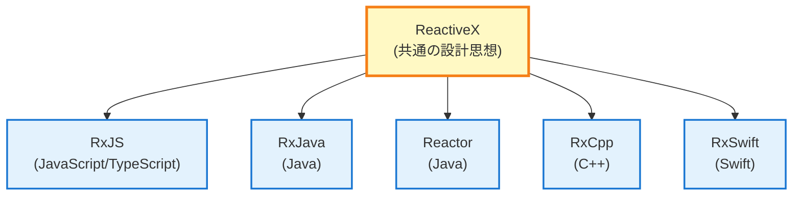
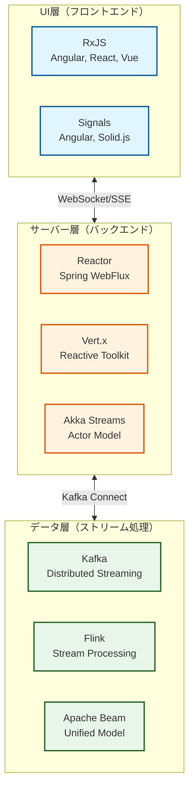
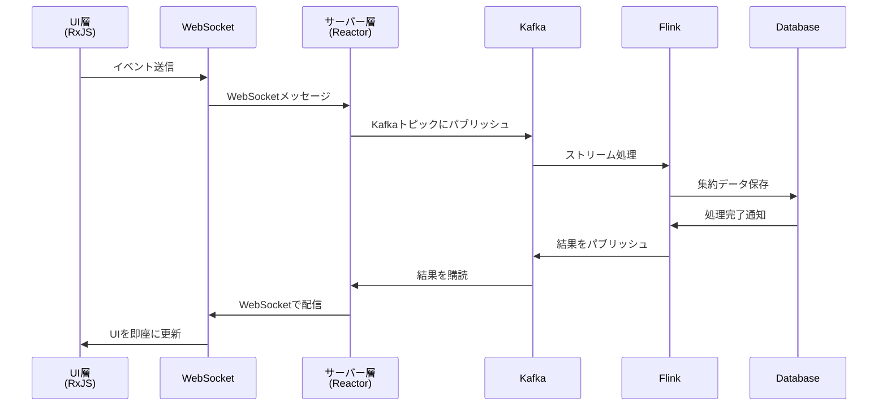

# RxJSとReactive Streamsエコシステム

RxJSを学ぶとき、多くの開発者は「RxJSはReactive Programmingの全体像の中でどう位置づけられるのか？」という疑問を持ちます。

このページでは、**RxJSとReactive Streams標準の違い**、**UI層からデータ層までの技術スタック全体像**、そして**異なる技術間の連携方法**を解説します。

## RxJSの位置づけ

### RxJSとは何か

**RxJS**（Reactive Extensions for JavaScript）は、**ブラウザとNode.js環境**におけるReactive Programmingの主要な実装です。



::: info RxJSの特徴
- ブラウザとNode.jsで動作
- UI応答性を最優先
- 軽量で高速
- バックプレッシャーは暗黙的
:::


## RxJS vs Reactive Streams標準

Reactive Programmingには、**RxJS**と**Reactive Streams標準**という2つの大きな流れがあります。

### Reactive Streams標準とは

[Reactive Streams](https://www.reactive-streams.org/)は、JVM上でのストリーム処理の標準仕様です。

**主な実装：**
- **Project Reactor**（Spring WebFlux）
- **RxJava 3**
- **Akka Streams**
- **Mutiny**（Quarkus）

**標準化された4つのインターフェース：**
```java
public interface Publisher<T> {
    void subscribe(Subscriber<? super T> s);
}

public interface Subscriber<T> {
    void onSubscribe(Subscription s);
    void onNext(T t);
    void onError(Throwable t);
    void onComplete();
}

public interface Subscription {
    void request(long n);  // バックプレッシャー制御
    void cancel();
}

public interface Processor<T, R> extends Subscriber<T>, Publisher<R> {}
```

### 主要な違い：バックプレッシャー制御

| 観点 | RxJS | Reactive Streams標準 |
|------|------|---------------------|
| **プラットフォーム** | JavaScript/TypeScript（ブラウザ、Node.js） | JVM（Java、Scala、Kotlin） |
| **バックプレッシャー** | 暗黙的（オペレーターレベル） | 明示的（`request(n)`メソッド） |
| **優先度** | UI応答性 | サーバーのスループット |
| **標準化** | ReactiveX共通API | Reactive Streams仕様 |

#### RxJSのバックプレッシャー（暗黙的）

```typescript
import { interval } from 'rxjs';
import { bufferTime, take } from 'rxjs';

// バックプレッシャーはオペレーターで制御
interval(10)  // 10msごとに値を発行
  .pipe(
    bufferTime(1000),  // 1秒ごとにバッファリング（暗黙的な制御）
    take(5)
  )
  .subscribe(batch => console.log('バッチ:', batch.length));
```

#### Reactive Streamsのバックプレッシャー（明示的）

```java
// Project Reactor（Java）
Flux.range(1, 1000)
    .subscribe(new BaseSubscriber<Integer>() {
        @Override
        protected void hookOnSubscribe(Subscription subscription) {
            request(10);  // 最初に10個をリクエスト（明示的）
        }

        @Override
        protected void hookOnNext(Integer value) {
            System.out.println("処理: " + value);
            request(1);  // 処理後に次の1個をリクエスト（明示的）
        }
    });
```

> [!IMPORTANT]
> **バックプレッシャーの違い**
>
> - **RxJS**: オペレーター（`bufferTime`, `throttleTime`, `debounceTime`）で暗黙的に制御
> - **Reactive Streams**: `request(n)` メソッドで明示的に制御
>
> この違いは、UI（RxJS）とサーバー（Reactive Streams）の要件の違いを反映しています。

## レイヤー別技術スタック

Reactive Programmingは、UI層からデータ層まで、複数の層にまたがる技術スタックを形成します。

### 全体アーキテクチャ



### 1. UI層（フロントエンド）

**主要技術：RxJS、Signals**

```typescript
// RxJS（UI層の標準）
import { fromEvent } from 'rxjs';
import { debounceTime, distinctUntilChanged, switchMap } from 'rxjs';

const searchInput$ = fromEvent(input, 'input').pipe(
  map(event => (event.target as HTMLInputElement).value),
  debounceTime(300),
  distinctUntilChanged(),
  switchMap(query => fetch(`/api/search?q=${query}`).then(r => r.json()))
);

searchInput$.subscribe(results => updateUI(results));
```

::: info 特徴：
- ブラウザ環境で動作
- UI応答性を最優先
- ユーザー入力、DOM イベント、HTTP 通信を統一的に扱う
:::

### 2. サーバー層（バックエンド）

**主要技術：Project Reactor、Vert.x、Akka Streams**

#### Project Reactor（Spring WebFlux）

```java
// Project Reactor（サーバー層の標準）
@RestController
public class UserController {

    @GetMapping("/users")
    public Flux<User> getUsers() {
        return userRepository.findAll()  // Reactive Repository
            .filter(user -> user.isActive())
            .map(user -> enrichUserData(user))
            .onErrorResume(error -> Flux.empty());
    }

    @GetMapping("/users/{id}")
    public Mono<User> getUser(@PathVariable String id) {
        return userRepository.findById(id)
            .switchIfEmpty(Mono.error(new UserNotFoundException(id)));
    }
}
```


::: info 特徴：
- Reactive Streams標準に準拠
- ノンブロッキングI/O
- 高スループット
- 明示的なバックプレッシャー制御
:::

#### Akka Streams（Actor Model）

```scala
// Akka Streams（分散システム向け）
val source = Source(1 to 100)
val flow = Flow[Int].map(_ * 2)
val sink = Sink.foreach[Int](println)

source.via(flow).to(sink).run()
```


::: info 特徴：
- Actorモデルベース
- 分散システムに最適
- 障害の隔離と復旧
:::

### 3. データ層（ストリーム処理）

**主要技術：Kafka、Flink、Apache Beam**

#### Apache Kafka（イベントストリーミング）

```java
// Kafka Streams（データパイプライン）
StreamsBuilder builder = new StreamsBuilder();

KStream<String, String> source = builder.stream("input-topic");

source
    .filter((key, value) -> value.length() > 10)
    .mapValues(value -> value.toUpperCase())
    .to("output-topic");

KafkaStreams streams = new KafkaStreams(builder.build(), config);
streams.start();
```


::: info 特徴：
- 分散イベントストリーミングプラットフォーム
- 高スループット、低レイテンシ
- イベントソーシング、CQRS パターンの基盤
:::

#### Apache Flink（ストリーム処理）

```java
// Flink（リアルタイムストリーム処理）
StreamExecutionEnvironment env = StreamExecutionEnvironment.getExecutionEnvironment();

DataStream<Event> events = env.addSource(new KafkaSource<>());

events
    .filter(event -> event.getValue() > threshold)
    .keyBy(Event::getSensorId)
    .timeWindow(Time.seconds(10))
    .reduce((e1, e2) -> new Event(e1.getSensorId(), e1.getValue() + e2.getValue()))
    .addSink(new DatabaseSink());

env.execute("Stream Processing Job");
```


::: info 特徴：
- リアルタイムストリーム処理エンジン
- 正確に一度（Exactly-once）の保証
- イベント時間処理とウォーターマーク
:::

## ブリッジング技術：異なる層の連携

異なる技術スタック間をどのように連携させるか？

### 1. UI層 ⇄ サーバー層：WebSocket / SSE

#### WebSocket（双方向通信）

**フロントエンド（RxJS）：**
```typescript
import { webSocket } from 'rxjs/webSocket';

const socket$ = webSocket<Message>('wss://example.com/ws');

// 受信
socket$.subscribe(message => console.log('受信:', message));

// 送信
socket$.next({ type: 'subscribe', channel: 'notifications' });
```

**バックエンド（Spring WebFlux）：**
```java
@Configuration
@EnableWebSocketMessageBroker
public class WebSocketConfig implements WebSocketMessageBrokerConfigurer {

    @Override
    public void configureMessageBroker(MessageBrokerRegistry config) {
        config.enableSimpleBroker("/topic");
        config.setApplicationDestinationPrefixes("/app");
    }

    @Override
    public void registerStompEndpoints(StompEndpointRegistry registry) {
        registry.addEndpoint("/ws").withSockJS();
    }
}

@Controller
public class NotificationController {

    @MessageMapping("/subscribe")
    public Flux<Notification> subscribe(@Payload SubscribeRequest request) {
        return notificationService.getNotificationStream(request.getChannel());
    }
}
```

#### Server-Sent Events（サーバー → クライアント）

**フロントエンド（RxJS）：**
```typescript
import { Observable } from 'rxjs';

function fromSSE<T>(url: string): Observable<T> {
  return new Observable(subscriber => {
    const eventSource = new EventSource(url);

    eventSource.onmessage = event => {
      subscriber.next(JSON.parse(event.data));
    };

    eventSource.onerror = error => {
      subscriber.error(error);
    };

    return () => eventSource.close();
  });
}

const notifications$ = fromSSE<Notification>('/api/notifications/stream');
notifications$.subscribe(n => console.log('通知:', n));
```

**バックエンド（Spring WebFlux）：**
```java
@GetMapping(value = "/notifications/stream", produces = MediaType.TEXT_EVENT_STREAM_VALUE)
public Flux<Notification> streamNotifications() {
    return notificationService.getNotificationStream()
        .delayElements(Duration.ofSeconds(1));
}
```

### 2. サーバー層 ⇄ データ層：Kafka Connect

**サーバー層（Reactor）からKafkaへ：**
```java
// Spring WebFlux + Kafka
@Service
public class EventPublisher {

    private final KafkaTemplate<String, Event> kafkaTemplate;

    public Mono<Void> publishEvent(Event event) {
        return Mono.fromFuture(
            kafkaTemplate.send("events-topic", event.getId(), event)
                .completable()
        ).then();
    }
}
```

**Kafkaからサーバー層（Reactor）へ：**
```java
// Kafka Consumer（Reactive）
@Service
public class EventConsumer {

    @KafkaListener(topics = "events-topic")
    public Mono<Void> consume(Event event) {
        return processEvent(event)
            .then();
    }

    private Mono<Void> processEvent(Event event) {
        return Mono.fromRunnable(() -> {
            System.out.println("イベント処理: " + event);
        });
    }
}
```

### 3. エンドツーエンドのリアクティブパイプライン



## 技術選定のガイドライン

どの層でどの技術を使うべきか？

### UI層（フロントエンド）の選択

| 要件 | 推奨技術 | 理由 |
|------|---------|------|
| 複雑な非同期フロー | **RxJS** | 豊富なオペレーター、統一的なAPI |
| シンプルなリアクティビティ | **Angular Signals** / **Solid.js** | 学習コストが低い、直感的 |
| フレームワーク標準 | **React Hooks** / **Vue Composition API** | フレームワークとの統合性 |

```typescript
// RxJSを選ぶべき例：複雑な非同期フロー
combineLatest([
  userInput$,
  apiStatus$,
  validation$
]).pipe(
  debounceTime(300),
  distinctUntilChanged(),
  switchMap(([input, status, isValid]) =>
    isValid ? submitData(input) : of(null)
  )
).subscribe(/*...*/);

// Signalsを選ぶべき例：シンプルな状態管理
const count = signal(0);
const doubled = computed(() => count() * 2);
```

### サーバー層（バックエンド）の選択

| 要件 | 推奨技術 | 理由 |
|------|---------|------|
| 高スループットAPI | **Spring WebFlux**（Reactor） | JVMエコシステム、豊富なライブラリ |
| マイクロサービス | **Vert.x** / **Quarkus**（Mutiny） | 軽量、高速起動 |
| 分散システム | **Akka Streams** | Actor Model、障害の隔離 |
| Node.js環境 | **RxJS** / **Node.js Streams** | JavaScript統一 |

```java
// Spring WebFlux（高スループットAPI）
@GetMapping("/users")
public Flux<User> getUsers() {
    return userRepository.findAll()
        .filter(User::isActive)
        .map(this::enrichData);
}
```

### データ層（ストリーム処理）の選択

| 要件 | 推奨技術 | 理由 |
|------|---------|------|
| イベントストリーミング | **Apache Kafka** | 高スループット、分散、永続化 |
| リアルタイム処理 | **Apache Flink** | 低レイテンシ、状態管理 |
| バッチ+ストリーム統合 | **Apache Beam** | 統一されたAPIモデル |
| IoTデータ処理 | **Kafka + Flink** | スケーラビリティ、信頼性 |

```java
// Kafka + Flink（IoTデータ処理）
StreamExecutionEnvironment env = StreamExecutionEnvironment.getExecutionEnvironment();

DataStream<SensorReading> sensorData = env
    .addSource(new FlinkKafkaConsumer<>("sensors", deserializer, properties));

sensorData
    .keyBy(SensorReading::getSensorId)
    .timeWindow(Time.minutes(5))
    .aggregate(new AverageAggregator())
    .addSink(new FlinkKafkaProducer<>("aggregated-data", serializer, properties));
```

## オペレーター構文の共通性と違い

RxJS、Reactor、Kafka Streamsは**似た構文**を持ちますが、**セマンティクスは異なります**。

### 共通性：宣言的なパイプライン

**RxJS（UI層）：**
```typescript
source$
  .pipe(
    filter(x => x > 10),
    map(x => x * 2),
    take(5)
  )
  .subscribe(console.log);
```

**Reactor（サーバー層）：**
```java
source
    .filter(x -> x > 10)
    .map(x -> x * 2)
    .take(5)
    .subscribe(System.out::println);
```

**Kafka Streams（データ層）：**
```java
stream
    .filter((key, value) -> value > 10)
    .mapValues(value -> value * 2)
    .to("output-topic");
```

### 違い：実行モデルとセマンティクス

| 観点 | RxJS | Reactor | Kafka Streams |
|------|------|---------|---------------|
| **実行環境** | シングルスレッド（イベントループ） | マルチスレッド可能 | 分散処理 |
| **スケジューリング** | 暗黙的（デフォルト同期） | 明示的（Schedulers） | 自動分散 |
| **エラーハンドリング** | `catchError` | `onErrorResume` | Exactly-once保証 |
| **バックプレッシャー** | オペレーターレベル | `request(n)` | 自動制御 |

> [!WARNING]
> **オペレーター構文が似ているからといって、同じように動作するわけではありません。** 各技術の実行モデルとセマンティクスを理解することが重要です。

## RxJSの強みと適用領域

### RxJSが最も強い領域

1. **ブラウザのUI処理**
   - ユーザー入力、DOMイベント、HTTP通信の統一的な処理

2. **Node.jsの非同期I/O**
   - ファイル操作、ネットワーク通信のストリーム化

3. **複数の非同期処理の統合**
   - `combineLatest`, `merge`, `switchMap` などでの複雑なフロー

### RxJSの限界

1. **高スループットサーバー処理**
   - JVMベースのReactor、Akka Streamsの方が有利

2. **分散ストリーム処理**
   - Kafka、Flinkの方が適している

3. **厳密なバックプレッシャー制御**
   - Reactive Streams標準の明示的な`request(n)`が必要

> [!TIP]
> **RxJSはUI層で最強ですが、サーバー層・データ層では他の技術の方が適していることがあります。** 全層でRxJSを使う必要はありません。

## まとめ

### RxJSの位置づけ

> [!IMPORTANT]
> RxJSは、**ブラウザとNode.js環境における** Reactive Programmingの主要実装です。UI応答性を最優先し、暗黙的なバックプレッシャー制御を採用しています。

### Reactive Streamsエコシステム全体像

```
UI層         : RxJS、Signals
通信層        : WebSocket、SSE
サーバー層    : Reactor、Vert.x、Akka Streams
データ層      : Kafka、Flink、Apache Beam
```

### 技術選定の指針

| 層 | 推奨技術 | 理由 |
|----|---------|------|
| **UI層** | RxJS、Signals | UI応答性、豊富なオペレーター |
| **サーバー層** | Reactor、Vert.x | 高スループット、Reactive Streams標準 |
| **データ層** | Kafka、Flink | 分散処理、スケーラビリティ |

### ブリッジング技術

- **UI ⇄ サーバー**: WebSocket、SSE
- **サーバー ⇄ データ**: Kafka Connect、Reactive Kafka

### オペレーター構文の共通性

RxJS、Reactor、Kafka Streamsは似た構文を持ちますが、**実行モデルとセマンティクスは異なります**。各技術の特性を理解して使い分けることが重要です。

> [!TIP]
> **全層をRxJSで統一する必要はありません。** 各層に最適な技術を選択し、ブリッジング技術で連携させることで、エンドツーエンドのリアクティブシステムを構築できます。

## 関連ページ

- [リアクティブアーキテクチャ全体マップ](/guide/appendix/reactive-architecture-map) - 7つの層の詳細
- [Reactive Programming Reconsidered](/guide/appendix/reactive-programming-reconsidered) - RPの強みと限界
- [結合オペレーター](/guide/operators/combination/) - 複数ストリームの統合
- [エラーハンドリング](/guide/error-handling/strategies) - RxJSのエラー処理

## 参考資料

- [GitHub Discussion #16 - Reactive Streams Ecosystem and RxJS Positioning](https://github.com/shuji-bonji/RxJS-with-TypeScript/discussions/16)
- [Reactive Streams公式サイト](https://www.reactive-streams.org/)
- [Project Reactor公式ドキュメント](https://projectreactor.io/docs)
- [Apache Kafka公式ドキュメント](https://kafka.apache.org/documentation/)
- [Apache Flink公式ドキュメント](https://flink.apache.org/docs/)
- [RxJS公式ドキュメント](https://rxjs.dev/)
