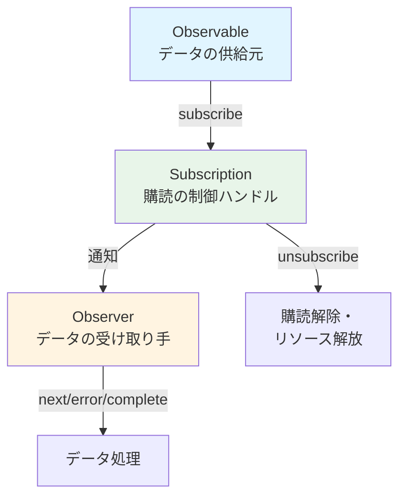

# ストリームとは？

## ストリームの定義

「ストリーム」とは、**時間の経過とともに順次発生するデータの流れ**を指します。これは、一定の順序で次々に現れるデータの集合体とみなすことができます。

### 従来のプログラミングにおける代表的なストリームの例
- ファイル読み込みのデータ（例：Node.js の ReadableStream）
- ネットワーク通信（HTTPレスポンスなど）
- ユーザーの入力やイベント（マウス移動、クリック、キーボード入力）

## RxJSにおけるストリーム

RxJSでは、こうした時間経過とともに発生するデータを **Observable（オブザーバブル）** を使ってストリームとして扱います。Observableは、非同期データ、同期データ、イベント、時間ベースの処理などをすべて「ストリーム」として抽象化するための仕組みです。

### Observableの利点
- 型安全に記述できる（TypeScriptとの親和性）
- 宣言的にデータの流れを表現できる
- `pipe()` による操作チェーンが可能
- `subscribe()` により明示的に購読できる
- `unsubscribe()` によりキャンセル可能

## 従来のストリームとの比較

| 特性 | 従来のストリーム | RxJSのObservable |
|------|------------------|-------------------|
| 対象 | ファイル/ネットワーク等に限定されがち | 任意の非同期/イベント/状態変化 |
| イベント対応 | イベントリスナーで都度処理 | `fromEvent` でストリーム化 |
| キャンセル | 方法はまちまち | `unsubscribe()` で統一管理 |
| 合成/変換 | 手続き型コードで個別実装 | 演算子（`map`, `filter` など）で簡潔に記述 |

## Observer・Subscriptionとの関係

- **Observable**：データの供給元（ストリームの源）
- **Observer**：データの受け取り手（next, error, complete を持つ）
- **Subscription**：購読の制御ハンドル（購読・解除・リソース管理）

ObservableとObserverは、コールバックを通じて接続され、Subscriptionにより制御されます。

### 基本的な関係図

## まとめ

RxJSの中核である「ストリーム」の概念は、非同期処理を扱う際の強力な武器です。Observableを使うことで、さまざまなデータソースを統一的に扱い、宣言的かつ柔軟にデータフローを記述できます。

## イベント処理との関係

RxJSでは、DOMイベントも `fromEvent` を使ってストリームとして扱うことができます。  
従来のイベントリスナーとの違いを比較することで、ストリームの概念がより明確になります。

> [!TIP]
> 実際のコードを交えた従来のイベント処理とRxJSの比較は、[イベントのストリーム化](/guide/observables/events.md#従来のイベント処理とrxjsの比較) を参照してください。