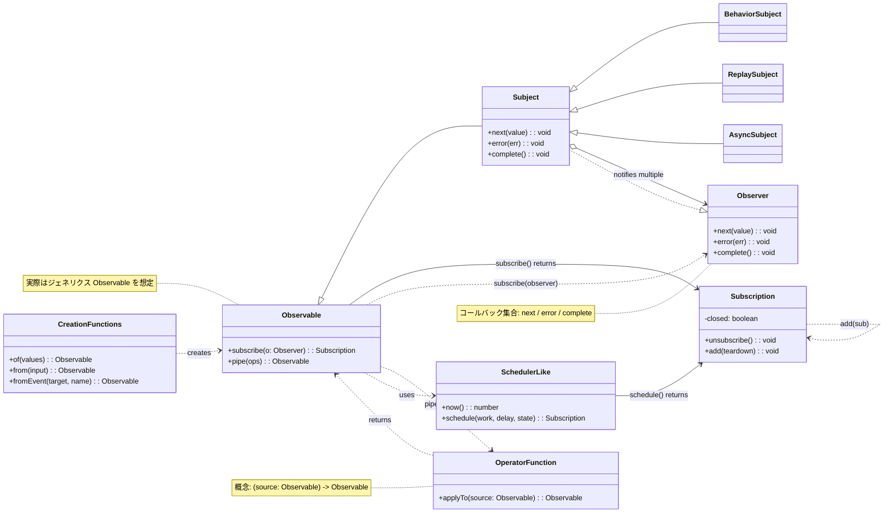

# RxJSとは何か？

## 概要
[RxJS（Reactive Extensions for JavaScript）](https://rxjs.dev)とは、「リアクティブプログラミング」を JavaScript で行うためのライブラリです。

> ### リアクティブプログラミングとは？
> リアクティブプログラミングは、データの変化に応じて自動的に更新されるプログラムの作成方法です。
> イベント駆動型プログラミングの一種であり、特に非同期なデータストリームの扱いに焦点を当てています。 データの流れ（ストリーム）を中心に考え、その流れに対して反応（リアクション）する方式でプログラムを構築します。

つまり、RxJSはイベントや非同期データの流れ（ストリーム）を、関数型スタイルで扱うためのライブラリです。Observableパターンを利用して、非同期データストリームを扱うための強力なツールを提供します。

> Observableとは、イベントや非同期データの流れ（ストリーム）を表現するRxJSの中核的な構成要素です。値が「流れてくる」源であり、購読（subscribe）によって値を受け取ることができます。Observableとは、時間の経過とともに値を発行する「データの流れ（ストリーム）」です。購読（subscribe）することで、その値を受け取ることができます。


> [!TIP]
> 「ストリームってそもそも何？」という方は、[ストリームとは？](/guide/basics/what-is-a-stream) も参照してみてください。


## 簡単な使用例

```ts
import { fromEvent } from 'rxjs';

fromEvent(document, 'click').subscribe(event => {
  console.log('クリックされました:', event);
});
```

## RxJSの基本構成要素

RxJSを使いこなすには、以下の中核的な構成要素を理解することが重要です。

| 構成要素 | 概要 |
|------|------|
| [`Observable`](../observables/what-is-observable.md) | 非同期または時間に沿って発生するデータを表すストリームの源です。 |
| [`Observer`](../observables/observable-lifecycle.md#observer)| Observableからデータを購読して受け取る側の存在です。 |
| [`Subscription`](../observables/observable-lifecycle.html#subscription) | Observableの購読と解除の管理を行います。 |
| [`Creation Functions`](../creation-functions/index.md) | 新しいObservableを作成・結合するための関数群です。 |
| [`Operator`](../operators/index.md) | 既存のObservableを変換・制御するための関数群です。 |
| [`Subject`](../subjects/what-is-subject.md)[^1] | ObservableとObserverの両方の性質を持つ中継器です。 |
| [`Scheduler`](../schedulers/async-control.md)[^2]| Observableの実行タイミングを制御する仕組みです。 |

[^1]: Subjectは、値を発行するObservableであると同時に、値を受け取るObserverとしても振る舞える特殊な存在です。
[^2]: Schedulerは、非同期処理の実行タイミングやコンテキストを制御するために使われ、デバッグやパフォーマンス管理にも役立ちます。

これらはそれぞれ独立した機能を持ちながらも連携して動作します。
たとえば、Creation Functionsで複数のObservableを結合し、Operatorで変換し、Observerが購読し、Schedulerで制御する、といった形で、全体としてストリーム処理を構成します。

※ 各構成要素の詳細な使い方や例については、それぞれの専用章で個別に解説します。

### 構成クラス図



## RxJSの利点

| 利点 | 内容 |
|---|---|
| 宣言的コード[^3] | `map`, `filter` などで「何をしたいか」を記述し、forループなどの手続き的記述を避けられる |
| 非同期処理の単純化 | `Promise` やコールバックのネストを避け、直感的な流れで書ける |
| エラー処理 | `.pipe(catchError(...))` などでストリーム中のエラーを統一的に処理可能 |
| キャンセル可能 | `Subscription.unsubscribe()` によりストリームの中断が可能 |
| 多様なオペレーター | `debounceTime`, `mergeMap`, `combineLatest` など多数の演算子で変換や合成が可能 |

[^3]: > - 宣言的コード: 「どういう結果が欲しいのか」を素直に書くコード  
      > - 手続き的コード: 「どういう計算を行っていけば欲しい結果が手に入るのか」を書くコード


## ユースケース

RxJSは「時間とともに変化するデータ」を扱うあらゆる場面で活躍します。以下に主要な活用分野を紹介します。

### リアルタイム通信・ストリーミング

WebSocketやServer-Sent Events(SSE)などのリアルタイム通信を扱う場合、RxJSは特に強力です。

| 用途 | 説明 | 主要なオペレーター |
|------|------|-------------------|
| WebSocket通信 | チャット、通知、株価更新など | [`webSocket`](../operators/index.md), [`filter`](../operators/filtering/filter.md), [`map`](../operators/transformation/map.md) |
| Server-Sent Events | サーバーからのプッシュ通知 | [`fromEvent`](../observables/events.md), [`retry`](../operators/utility/retry.md) |
| IoTセンサー監視 | 連続的なセンサーデータの処理 | [`debounceTime`](../operators/filtering/debounceTime.md), [`distinctUntilChanged`](../operators/filtering/distinctUntilChanged.md) |

#### 簡単な例
```ts
import { webSocket } from 'rxjs/webSocket';
import { filter } from 'rxjs';

const socket$ = webSocket('wss://example.com/chat');

socket$.pipe(
  filter(msg => msg.type === 'message')
).subscribe(msg => console.log('新着:', msg.text));
```

### UI/状態管理・フォーム制御

ユーザー入力や状態の変化をリアクティブに扱うことができます。

| 用途 | 説明 | 主要なオペレーター |
|------|------|-------------------|
| 入力フォームの制御 | 検索補完、リアルタイムバリデーション | [`debounceTime`](../operators/filtering/debounceTime.md), [`distinctUntilChanged`](../operators/filtering/distinctUntilChanged.md), [`switchMap`](../operators/transformation/switchMap.md) |
| 複数フォーム項目の連携 | 依存する入力項目の更新 | [`combineLatest`](../creation-functions/combination/combineLatest.md), [`withLatestFrom`](../operators/combination/withLatestFrom.md) |
| コンポーネント間通信 | イベントバスやカスタム状態管理 | [`Subject`](../subjects/what-is-subject.md), [`share`](../operators/multicasting/share.md) |
| UIイベント処理 | クリック、スクロール、ドラッグ&ドロップ | [`fromEvent`](../observables/events.md), [`takeUntil`](../operators/utility/takeUntil.md) |

#### 簡単な例
```ts
import { fromEvent, combineLatest } from 'rxjs';
import { debounceTime, map, switchMap } from 'rxjs';

const searchInput = document.querySelector('#search') as HTMLInputElement;
const sortSelect = document.querySelector('#sort') as HTMLInputElement;

const search$ = fromEvent(searchInput, 'input').pipe(
  map(e => (e.target as HTMLInputElement).value)
);

const sort$ = fromEvent(sortSelect, 'change').pipe(
  map(e => (e.target as HTMLSelectElement).value)
);

combineLatest([search$, sort$]).pipe(
  debounceTime(300),
  switchMap(([query, order]) =>
    fetch(`/api/search?q=${query}&sort=${order}`).then(r => r.json())
  )
).subscribe(results => console.log(results));
```

### オフライン対応・PWA

Progressive Web App（PWA）でのオフライン対応やネットワーク状態管理に活用できます。

| 用途 | 説明 | 主要なオペレーター |
|------|------|-------------------|
| ネットワーク状態監視 | オンライン/オフライン検出 | [`fromEvent`](../observables/events.md), [`merge`](../creation-functions/combination/merge.md) |
| オフライン時の再試行 | 接続復帰時の自動再同期 | [`retry`](../operators/utility/retry.md), [`retryWhen`](../error-handling/retry-catch.md) |
| キャッシュ制御 | Service Workerとの連携 | [`switchMap`](../operators/transformation/switchMap.md), [`catchError`](../error-handling/retry-catch.md) |

#### 簡単な例
```ts
import { fromEvent, merge } from 'rxjs';
import { map, startWith } from 'rxjs';

const online$ = fromEvent(window, 'online').pipe(map(() => true));
const offline$ = fromEvent(window, 'offline').pipe(map(() => false));

merge(online$, offline$).pipe(
  startWith(navigator.onLine)
).subscribe(isOnline => {
  console.log(isOnline ? 'オンライン' : 'オフライン');
});
```

### AI/ストリーミングAPI

OpenAIなどのストリーミングAPIレスポンスを扱う場合にも最適です。

| 用途 | 説明 | 主要なオペレーター |
|------|------|-------------------|
| トークン逐次出力 | AIレスポンスのリアルタイム表示 | [`concatMap`](../operators/transformation/concatMap.md), [`scan`](../operators/transformation/scan.md) |
| ストリーミング処理 | Server-Sent Eventsの処理 | [`fromEvent`](../observables/events.md), [`map`](../operators/transformation/map.md) |
| バックエンド統合 | NestJS（RxJS標準搭載）での利用 | 各種オペレーター |

### HTTP通信とエラー処理

非同期HTTP通信をエレガントに扱えます。

| 用途 | 説明 | 主要なオペレーター |
|------|------|-------------------|
| APIリクエスト | RESTful APIとの通信 | [`switchMap`](../operators/transformation/switchMap.md), [`mergeMap`](../operators/transformation/mergeMap.md) |
| エラーハンドリング | リトライやフォールバック | [`catchError`](../error-handling/retry-catch.md), [`retry`](../operators/utility/retry.md) |
| タイムアウト制御 | 応答時間の制限 | [`timeout`](../operators/utility/timeout.md) |
| キャンセル | 不要なリクエストの中断 | [`takeUntil`](../operators/utility/takeUntil.md), `unsubscribe()` |

### 状態管理・アーキテクチャ

アプリケーション全体のアーキテクチャ設計にも活用できます。

| 用途 | 説明 | 主要なオペレーター |
|------|------|-------------------|
| 状態管理ライブラリ | NgRx、Redux-Observableなど | [`scan`](../operators/transformation/scan.md), [`share`](../operators/multicasting/share.md) |
| イベントフロー管理 | DDD（ドメイン駆動設計）での活用 | [`Subject`](../subjects/what-is-subject.md), [`shareReplay`](../operators/multicasting/shareReplay.md) |
| データレイヤー分離 | クリーンアーキテクチャ | 各種オペレーター |

---

> [!TIP]
> PromiseとRxJSの使い分けについては、[PromiseとRxJSの違い](./promise-vs-rxjs.md)も参照してください。

## まとめ

RxJSは、非同期およびイベントベースのプログラミングに対する強力なアプローチを提供します。Observableを中心としたデータストリームの考え方は、複雑な非同期処理を扱う際に特に役立ちます。
