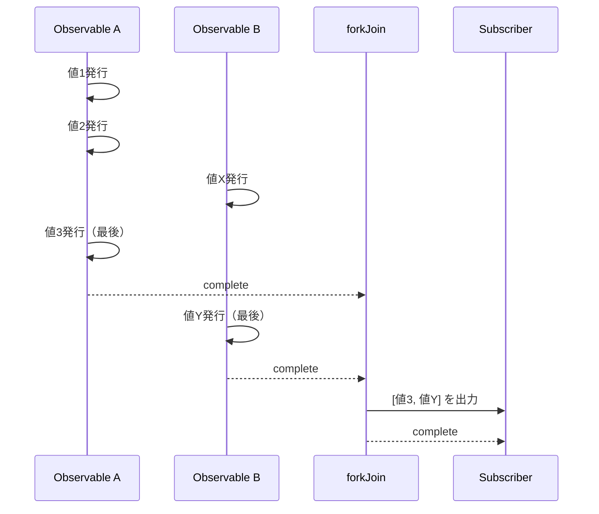
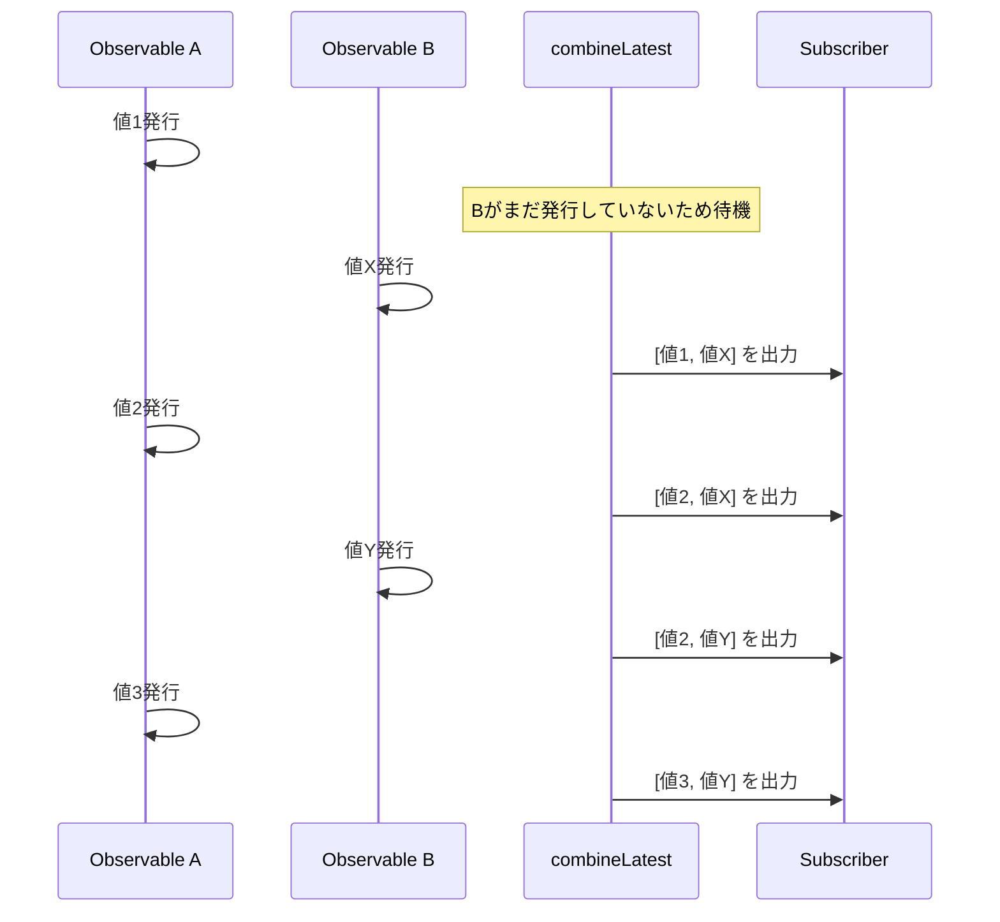
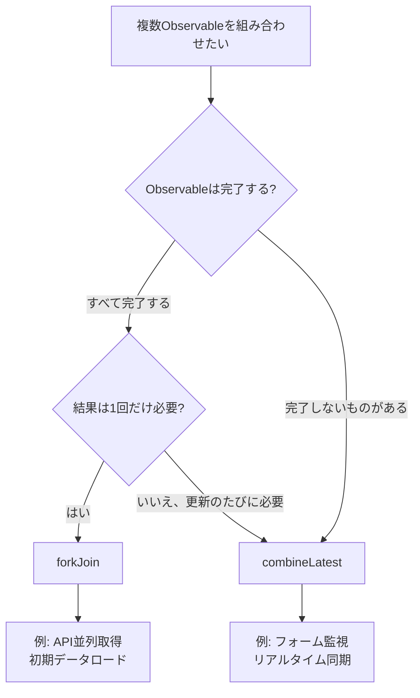

# forkJoin と combineLatest の違い

RxJSで複数のObservableを組み合わせる際、`forkJoin`と`combineLatest`は最もよく使われるCreation Functionです。しかし、この2つは**挙動が大きく異なり**、適切に使い分けないと期待通りの結果が得られません。

このページでは、両者の違いを図解と実践例で徹底的に比較し、「どちらを使うべきか」を明確にします。

## 結論：forkJoin と combineLatest の違い

| 特徴 | forkJoin | combineLatest |
|------|----------|---------------|
| **出力タイミング** | すべて完了後に**1回だけ** | 値が更新されるたびに**何度でも** |
| **出力値** | 各Observableの**最後の値** | 各Observableの**最新の値** |
| **完了条件** | すべてのObservableが完了 | すべてのObservableが完了 |
| **主な用途** | API並列取得、初期データロード | フォーム監視、リアルタイム同期 |
| **無限ストリーム** | ❌ 使用不可（完了しないため） | ✅ 使用可能（完了しなくても値を出力） |

> [!TIP]
> **簡単な覚え方**
> - `forkJoin` = 「全員揃ったら**1回だけ**出発」（Promise.all に似ている）
> - `combineLatest` = 「誰かが動くたびに**最新状況を報告**」

## 挙動の違いを図解で理解する

### forkJoin の挙動



**ポイント**：すべてのObservableが`complete`するまで待ち、**最後の値だけ**を1回出力します。

### combineLatest の挙動



**ポイント**：全Observableが最初の値を発行した後は、**どれかが更新されるたびに**最新の組み合わせを出力し続けます。

## タイムラインで見る違い

```mermaid
gantt
    title forkJoin vs combineLatest の出力タイミング
    dateFormat X
    axisFormat %s

    section Observable A
    値1 :a1, 0, 1
    値2 :a2, 2, 1
    値3 :a3, 4, 1
    complete :milestone, a_done, 5, 0

    section Observable B
    値X :b1, 1, 1
    値Y :b2, 3, 1
    complete :milestone, b_done, 4, 0

    section forkJoin出力
    [値3,値Y] :crit, fork_out, 5, 1

    section combineLatest出力
    [値1,値X] :c1, 1, 1
    [値2,値X] :c2, 2, 1
    [値2,値Y] :c3, 3, 1
    [値3,値Y] :c4, 4, 1
```



## 実践比較：同じデータソースで動作確認

同じObservableに対して`forkJoin`と`combineLatest`を適用し、出力の違いを確認します。

```ts
import { forkJoin, combineLatest, interval, take, map } from 'rxjs';

// 出力エリア作成
const output = document.createElement('div');
output.innerHTML = '<h3>forkJoin vs combineLatest 比較:</h3>';
document.body.appendChild(output);

// 2つのObservableを作成
const obs1$ = interval(1000).pipe(
  take(3),
  map(i => `A${i}`)
);

const obs2$ = interval(1500).pipe(
  take(2),
  map(i => `B${i}`)
);

// forkJoin の結果表示エリア
const forkJoinResult = document.createElement('div');
forkJoinResult.innerHTML = '<h4>forkJoin:</h4><div id="forkjoin-output">待機中...</div>';
output.appendChild(forkJoinResult);

// combineLatest の結果表示エリア
const combineLatestResult = document.createElement('div');
combineLatestResult.innerHTML = '<h4>combineLatest:</h4><div id="combinelatest-output"></div>';
output.appendChild(combineLatestResult);

// forkJoin：すべて完了後に1回だけ出力
forkJoin([obs1$, obs2$]).subscribe(result => {
  const el = document.getElementById('forkjoin-output');
  if (el) {
    el.textContent = `出力: [${result.join(', ')}]`;
    el.style.color = 'green';
    el.style.fontWeight = 'bold';
  }
});

// combineLatest：値が更新されるたびに出力
const combineOutput = document.getElementById('combinelatest-output');
combineLatest([obs1$, obs2$]).subscribe(result => {
  if (combineOutput) {
    const item = document.createElement('div');
    item.textContent = `出力: [${result.join(', ')}]`;
    combineOutput.appendChild(item);
  }
});
```

**実行結果**：
- `forkJoin`: 約3秒後に `[A2, B1]` を**1回だけ**出力
- `combineLatest`: 約1.5秒後から**4回**出力（例: `[A0, B0]` → `[A1, B0]` → `[A2, B0]` → `[A2, B1]`）

> [!NOTE]
> `combineLatest`の出力順序は、タイマーのスケジューリングに依存するため環境によって異なる場合があります。重要なのは「いずれかの値が更新されるたびに出力される」という点です。上記の例では4回出力されますが、`[A1, B0]` → `[A1, B1]` のように順序が変わることもあります。

## どちらを使うべきか（ケース別ガイド）

### forkJoin を使うべきケース

#### 1. 複数APIの並列取得

すべてのデータが揃ってから処理したい場合。

```ts
import { forkJoin } from 'rxjs';
import { ajax } from 'rxjs/ajax';

// ユーザー情報と設定を同時に取得
forkJoin({
  user: ajax.getJSON('/api/user/123'),
  settings: ajax.getJSON('/api/settings'),
  notifications: ajax.getJSON('/api/notifications')
}).subscribe(({ user, settings, notifications }) => {
  // すべてのデータが揃ってから画面を描画
  renderDashboard(user, settings, notifications);
});
```

#### 2. 初期ロード時のデータ一括取得

アプリ起動時に必要なマスターデータをまとめて取得。

```ts
import { forkJoin } from 'rxjs';
import { ajax } from 'rxjs/ajax';

function loadInitialData() {
  return forkJoin({
    categories: ajax.getJSON('/api/categories'),
    countries: ajax.getJSON('/api/countries'),
    currencies: ajax.getJSON('/api/currencies')
  });
}
```

> [!WARNING]
> `forkJoin`は**完了しないObservable**（`interval`、WebSocket、イベントストリームなど）には使えません。完了しないとずっと待ち続けます。

### combineLatest を使うべきケース

#### 1. フォーム入力のリアルタイム監視

複数の入力値を組み合わせてバリデーションや表示を更新。

```ts
import { combineLatest, fromEvent } from 'rxjs';
import { map, startWith } from 'rxjs';

const name$ = fromEvent(nameInput, 'input').pipe(
  map(e => (e.target as HTMLInputElement).value),
  startWith('')
);

const email$ = fromEvent(emailInput, 'input').pipe(
  map(e => (e.target as HTMLInputElement).value),
  startWith('')
);

const age$ = fromEvent(ageInput, 'input').pipe(
  map(e => parseInt((e.target as HTMLInputElement).value) || 0),
  startWith(0)
);

// いずれかの入力が変わるたびにバリデーション実行
combineLatest([name$, email$, age$]).subscribe(([name, email, age]) => {
  const isValid = name.length > 0 && email.includes('@') && age >= 18;
  submitButton.disabled = !isValid;
});
```

#### 2. 複数ストリームのリアルタイム同期

センサーデータやステータスの統合表示。

```ts
import { combineLatest, interval } from 'rxjs';
import { map } from 'rxjs';

const temperature$ = interval(2000).pipe(map(() => 20 + Math.random() * 10));
const humidity$ = interval(3000).pipe(map(() => 40 + Math.random() * 30));
const pressure$ = interval(2500).pipe(map(() => 1000 + Math.random() * 50));

combineLatest([temperature$, humidity$, pressure$]).subscribe(
  ([temp, humidity, pressure]) => {
    updateDashboard({ temp, humidity, pressure });
  }
);
```

#### 3. フィルター条件の組み合わせ

複数のフィルター条件が変わるたびに検索を実行。

```ts
import { combineLatest, BehaviorSubject } from 'rxjs';
import { debounceTime, switchMap } from 'rxjs';

const searchText$ = new BehaviorSubject('');
const category$ = new BehaviorSubject('all');
const sortOrder$ = new BehaviorSubject('asc');

combineLatest([searchText$, category$, sortOrder$]).pipe(
  debounceTime(300),
  switchMap(([text, category, sort]) =>
    fetchProducts({ text, category, sort })
  )
).subscribe(products => {
  renderProductList(products);
});
```

## 使い分けフローチャート



## よくある間違いと対処法

### 間違い1: 完了しないObservableにforkJoinを使う

```ts
// ❌ これは永遠に出力されない
forkJoin([
  interval(1000),  // 完了しない
  ajax.getJSON('/api/data')
]).subscribe(console.log);

// ✅ takeで完了させるか、combineLatestを使う
forkJoin([
  interval(1000).pipe(take(5)),  // 5回で完了
  ajax.getJSON('/api/data')
]).subscribe(console.log);
```

### 間違い2: combineLatestで初期値がない

```ts
// ❌ name$が最初に発行するまでemail$の値があっても出力されない
combineLatest([name$, email$]).subscribe(console.log);

// ✅ startWithで初期値を設定
combineLatest([
  name$.pipe(startWith('')),
  email$.pipe(startWith(''))
]).subscribe(console.log);
```

## まとめ

| 選択基準 | forkJoin | combineLatest |
|----------|----------|---------------|
| すべて揃ったら1回だけ処理 | ✅ | ❌ |
| 値が変わるたびに処理 | ❌ | ✅ |
| 完了しないストリーム | ❌ | ✅ |
| Promise.all的な使い方 | ✅ | ❌ |
| リアルタイム同期 | ❌ | ✅ |

> [!IMPORTANT]
> **使い分けの原則**
> - **forkJoin**: 「全員揃ったら1回だけ」→ API並列取得、初期ロード
> - **combineLatest**: 「誰かが動くたびに更新」→ フォーム監視、リアルタイムUI

## 関連ページ

- **[forkJoin](/guide/creation-functions/combination/forkJoin)** - forkJoinの詳細解説
- **[combineLatest](/guide/creation-functions/combination/combineLatest)** - combineLatestの詳細解説
- **[zip](/guide/creation-functions/combination/zip)** - 対応する値をペアにする
- **[merge](/guide/creation-functions/combination/merge)** - 複数Observableを並行実行
- **[withLatestFrom](/guide/operators/combination/withLatestFrom)** - メインストリームのみがトリガー
