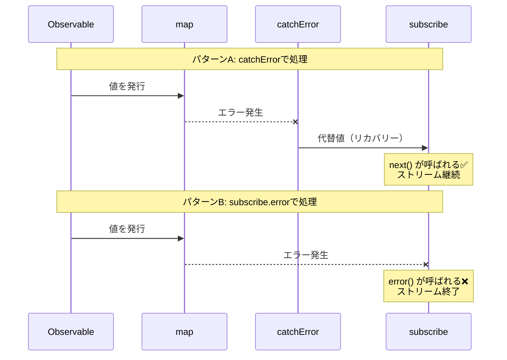
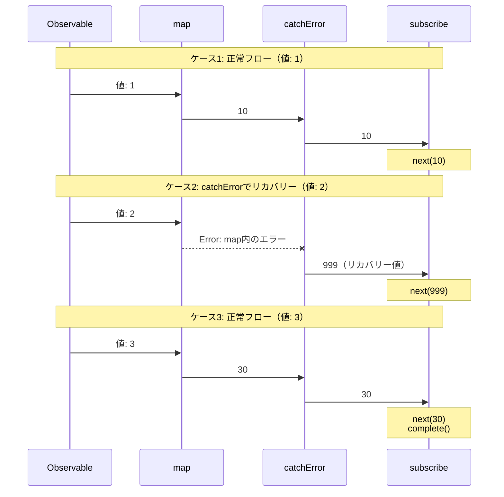
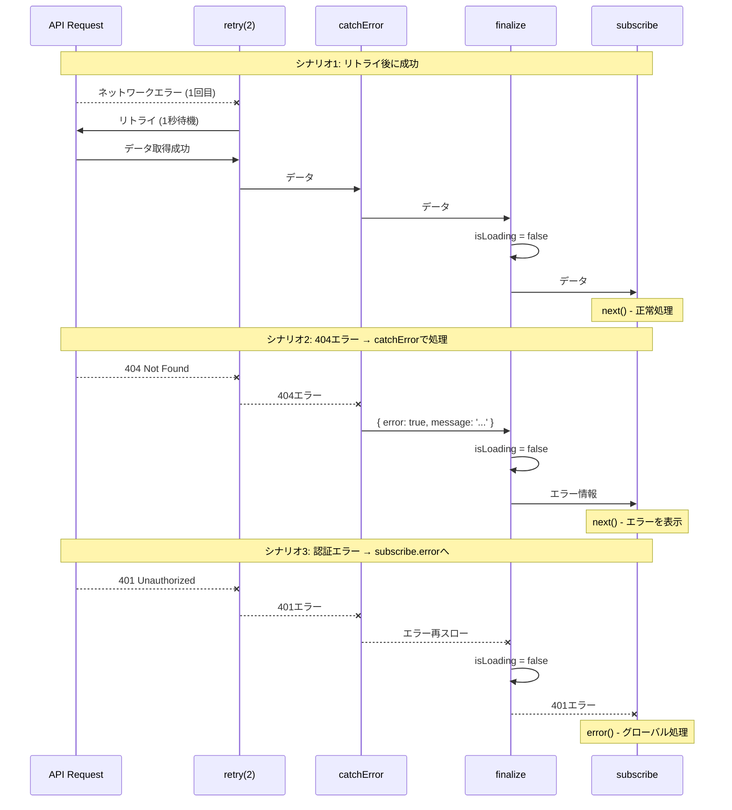
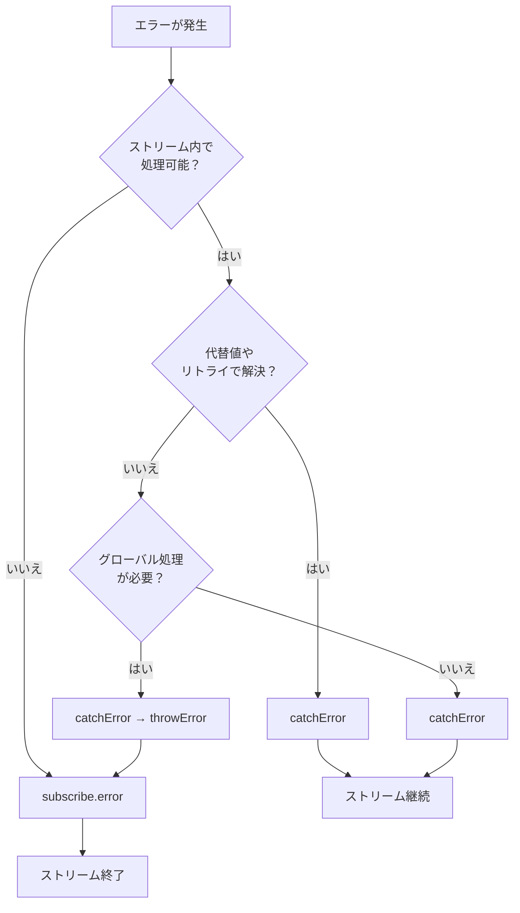

# エラーハンドリングの2つの場所

RxJSでエラーを処理する際、「どこで」エラーを捕捉するかは重要な設計判断です。RxJSには2つの主要なエラー処理の場所があります。パイプライン内の`catchError`オペレーターと、最終的な`subscribe`での`error`コールバックです。このページでは、両者の違いと適切な使い分けについて解説します。

## エラー処理の2つの場所

RxJSのエラーハンドリングには以下の2つの主要な場所があります。

1. **パイプライン内** - `.pipe(catchError(...))`
2. **購読時** - `subscribe({ error: ... })`

この違いを理解することで、堅牢で保守性の高いエラーハンドリング戦略を構築できます。

## 比較表：catchError vs subscribe.error

以下の表で、2つのアプローチの主要な違いをまとめます。

| 項目 | `.pipe(catchError(...))` | `subscribe({ error: ... })` |
|------|-------------------------|----------------------------|
| **処理のタイミング** | パイプライン内（中間処理） | 最終的な購読時（終点） |
| **エラーの種類** | ストリーム内で発生したエラー | キャッチされなかったエラー |
| **主な用途** | エラーのリカバリー、変換、再試行 | 最終的なエラー通知、ログ記録 |
| **ストリームの継続** | 代替Observable返却で継続可能 | ストリーム終了（それ以上値は流れない） |
| **リカバリー可能性** | ✅ 可能（代替値やリトライ） | ❌ 不可能（終了） |
| **複数配置** | ✅ 可能（パイプライン内に複数） | ⚠️ 1つのsubscribeに1つ |
| **型の返却** | `Observable<T>` を返す必要あり | `void`（何も返さない） |

### シーケンス図：catchError vs subscribe.error の違い

以下の図は、`catchError`で処理する場合と`subscribe.error`で処理する場合の違いを視覚的に示しています。



#### この図から分かる重要なポイント

**パターンA（catchError使用）:**
- エラーが発生しても、`catchError`が代替値を返すため、`subscribe`の`next()`が呼ばれる
- ストリームは継続し、後続の値も処理できる
- エラーを「リカバリー」して正常なストリームに戻す

**パターンB（subscribe.error使用）:**
- エラーが`subscribe`まで到達すると、`error()`コールバックが呼ばれる
- ストリームは終了し、それ以上値は流れない
- エラーを「通知」してストリームを終了する

## エラーの流れを理解する

実際のコード例で、エラーがどのように流れるかを見てみましょう。

```typescript
import { of } from 'rxjs';
import { map, catchError } from 'rxjs/operators';

of(1, 2, 3).pipe(
  map(x => {
    if (x === 2) throw new Error('map内のエラー');  // ①
    return x * 10;
  }),
  catchError(err => {
    console.log('catchErrorで捕捉:', err.message);  // ②
    return of(999); // リカバリー
  })
).subscribe({
  next: val => console.log('値:', val),
  error: err => console.log('subscribe.errorで捕捉:', err), // ③
  complete: () => console.log('完了')
});

// 出力:
// 値: 10
// catchErrorで捕捉: map内のエラー (← ②で処理)
// 値: 999 (← リカバリー成功)
// 値: 30
// 完了
```

この例では、
1. `map`内でエラーが発生（①）
2. `catchError`がエラーを捕捉してリカバリー（②）
3. `subscribe.error`は呼ばれない（エラーが処理されたため）

> [!TIP] エラーの流れ
> `catchError`で処理されたエラーは、`subscribe.error`には到達しません。`catchError`は「エラーを処理して正常なストリームに戻す」役割を持ちます。

### シーケンス図：エラーの流れ（3つのケース）

以下の図は、エラーがどのように伝播するかを3つのケースで示しています。



#### この図から分かるように
- **ケース1・3**: エラーがない場合、値は`map` → `catchError` → `subscribe`へ順番に流れる
- **ケース2**: `map`でエラーが発生すると、`catchError`が捕捉してリカバリー値（999）を返す
- `catchError`で処理されたエラーは、`subscribe.error`には到達しない

## catchError で捕捉されるエラー

パイプライン内の`catchError`は、以下のようなエラーを捕捉できます。

| エラーの発生場所 | 例 | catchErrorで処理可能 |
|----------------|-----|---------------------|
| オペレーター内のthrow | `map(x => { throw new Error() })` | ✅ |
| HTTP エラー | `ajax.get('/api').pipe(catchError(...))` | ✅ |
| switchMap内のエラー | `switchMap(() => throwError(...))` | ✅ |
| カスタムObservable | `new Observable(sub => sub.error(...))` | ✅ |
| Promise の reject | `from(Promise.reject(...))` | ✅ |

### 実例：APIエラーの段階的処理

```typescript
import { ajax } from 'rxjs/ajax';
import { catchError, switchMap } from 'rxjs/operators';
import { of, throwError } from 'rxjs';

// APIエラーをcatchErrorで処理
ajax.get('/api/user/123').pipe(
  catchError(err => {
    if (err.status === 404) {
      // 404エラー → デフォルトユーザーを返す
      return of({ id: 123, name: 'デフォルトユーザー' });
    }
    // その他のエラーは再スロー（subscribe.errorへ）
    return throwError(() => err);
  }),
  switchMap(user => {
    // ユーザー取得後、プロフィールを取得
    return ajax.get(`/api/profile/${user.id}`);
  }),
  catchError(err => {
    console.log('プロフィール取得エラー:', err);
    // プロフィールなしで継続
    return of(null);
  })
).subscribe({
  next: profile => console.log('プロフィール:', profile),
  error: err => console.log('最終エラー:', err) // catchErrorで処理されなかったエラーのみ
});
```

> [!IMPORTANT] 複数のcatchErrorを配置
> パイプライン内に複数の`catchError`を配置することで、異なる段階でのエラーを個別に処理できます。これにより、きめ細かなエラーハンドリングが可能になります。

## subscribe.error で捕捉されるエラー

`subscribe`の`error`コールバックは、以下のエラーを捕捉します。

| エラーの種類 | 説明 | 例 |
|------------|------|-----|
| **catchError未処理のエラー** | パイプライン内で処理されなかったエラー | エラーをそのまま伝播 |
| **catchError後の再スロー** | catchErrorで明示的に再スローしたエラー | `catchError(e => throwError(() => e))` |

### 実例：エラーの段階的処理と再スロー

```typescript
import { of, throwError } from 'rxjs';
import { map, catchError } from 'rxjs/operators';

// パターン1: catchErrorで処理されないエラー
throwError(() => new Error('未処理エラー')).subscribe({
  next: val => console.log('値:', val),
  error: err => console.log('subscribe.error:', err.message)
  // 出力: subscribe.error: 未処理エラー
});

// パターン2: catchErrorで再スロー
of(1).pipe(
  map(() => { throw new Error('map内エラー'); }),
  catchError(err => {
    console.log('catchErrorで捕捉:', err.message);
    // ログを記録後、エラーを再スロー
    return throwError(() => new Error('再スローしたエラー'));
  })
).subscribe({
  next: val => console.log('値:', val),
  error: err => console.log('subscribe.error:', err.message)
  // 出力:
  // catchErrorで捕捉: map内エラー
  // subscribe.error: 再スローしたエラー
});
```

> [!WARNING] subscribe内でのエラーについて
> `subscribe`の`next`、`complete`コールバック内で`throw`することは**推奨されません**。エラーハンドリングは必ずパイプライン内（`catchError`）で行いましょう。subscribe内でのthrowは未定義動作となる可能性があります。

## 使い分けの判断基準

どちらを使うべきかは、「エラーをどこで処理したいか」によって決まります。

### catchError を使うべきケース

以下の条件に当てはまる場合は`catchError`を使用します。

- ✅ **ストリーム内で処理を完結させたい**
- ✅ **代替値やフォールバックデータを提供できる**
- ✅ **リトライで解決する可能性がある**
- ✅ **エラーを変換して別のObservableに切り替えたい**
- ✅ **後続の処理を継続させたい**

#### パターン1: 成功時とエラー時で統一した形式にする

```typescript
import { catchError, map } from 'rxjs/operators';
import { of, throwError } from 'rxjs';

interface User {
  id: number;
  name: string;
}

interface ApiResult {
  success: boolean;
  data?: User[];
  error?: string;
}

// API呼び出しをシミュレート（エラーを発生させる例）
function fetchUsers(shouldFail: boolean) {
  if (shouldFail) {
    return throwError(() => new Error('ネットワークエラー'));
  }
  return of<User[]>([
    { id: 1, name: '山田太郎' },
    { id: 2, name: '佐藤花子' }
  ]);
}

fetchUsers(true).pipe(
  // 成功時: { success: true, data: [...] } に変換
  map(users => ({ success: true, data: users } as ApiResult)),
  // エラー時: { success: false, error: '...' } に変換
  catchError(err => {
    return of<ApiResult>({
      success: false,
      error: 'ユーザー取得に失敗しました'
    });
  })
).subscribe(result => {
  // 成功時もエラー時も同じ形式で処理
  if (result.success) {
    console.log('ユーザー:', result.data);
  } else {
    console.log('エラー発生:', result.error);
  }
});

// 出力: エラー発生: ユーザー取得に失敗しました
```

#### パターン2: シンプルにデフォルト値を返す

```typescript
import { catchError } from 'rxjs/operators';
import { of, throwError } from 'rxjs';

interface User {
  id: number;
  name: string;
}

// API呼び出しをシミュレート（エラーを発生させる例）
function fetchUsers(shouldFail: boolean) {
  if (shouldFail) {
    return throwError(() => new Error('ネットワークエラー'));
  }
  return of<User[]>([
    { id: 1, name: '山田太郎' },
    { id: 2, name: '佐藤花子' }
  ]);
}

fetchUsers(true).pipe(
  catchError(err => {
    console.error('エラーが発生しました:', err.message);
    // 空配列をデフォルト値として返す
    return of<User[]>([]);
  })
).subscribe(users => {
  if (users.length === 0) {
    console.log('ユーザーが見つかりませんでした');
  } else {
    console.log('ユーザー:', users);
  }
});

// 出力:
// エラーが発生しました: ネットワークエラー
// ユーザーが見つかりませんでした
```

### subscribe.error を使うべきケース

以下の条件に当てはまる場合は`subscribe.error`を使用します。

- ✅ **グローバルエラーハンドラーで処理したい**
- ✅ **アプリケーション全体に影響する処理が必要**
- ✅ **エラーログをサーバーに送信したい**
- ✅ **ストリームを終了させたい**
- ✅ **最終防衛線としてのエラー処理**

```typescript
import { ajax } from 'rxjs/ajax';
import { catchError, retry } from 'rxjs/operators';
import { throwError } from 'rxjs';

ajax.getJSON('/api/critical-data').pipe(
  retry(2),
  catchError(err => {
    if (err.status === 401) {
      // 認証エラーは再スロー（グローバルで処理）
      return throwError(() => err);
    }
    // その他は処理
    return throwError(() => new Error('データ取得に失敗しました'));
  })
).subscribe({
  next: data => console.log('データ:', data),
  error: err => {
    // グローバルエラーハンドラー
    globalErrorHandler.handle(err);
    // エラーページへ遷移
    router.navigate(['/error']);
  }
});
```

## 実践パターン：階層的エラー処理

実務では、`catchError`と`subscribe.error`を組み合わせた階層的なエラー処理が効果的です。

```typescript
import { ajax } from 'rxjs/ajax';
import { catchError, retry, finalize } from 'rxjs/operators';
import { of, throwError } from 'rxjs';

function fetchUserData(userId: string) {
  let isLoading = true;

  return ajax.getJSON(`/api/users/${userId}`).pipe(
    // レベル1: リトライ可能なネットワークエラー
    retry({ count: 2, delay: 1000 }),

    // レベル2: リカバリー可能なエラー
    catchError((error) => {
      if (error.status === 404) {
        // 404 → デフォルトデータで継続
        return of({
          error: true,
          message: 'ユーザーが見つかりません',
          data: null
        });
      } else if (error.status >= 500) {
        // 500系 → エラーメッセージで継続
        return of({
          error: true,
          message: 'サーバーエラーが発生しました',
          data: null
        });
      }
      // その他のエラーは再スロー（subscribe.errorへ）
      return throwError(() => error);
    }),

    // レベル3: 必ず実行するクリーンアップ
    finalize(() => {
      isLoading = false;
      console.log('ローディング完了');
    })
  );
}

// 使用例
fetchUserData('123').subscribe({
  next: (result) => {
    if (result.error) {
      // catchErrorで処理されたエラー（UIに表示）
      console.error('ユーザーエラー:', result.message);
      showUserFriendlyError(result.message);
    } else {
      // 正常なデータ
      console.log('ユーザーデータ:', result.data);
      displayUserData(result.data);
    }
  },
  error: (err) => {
    // catchErrorで処理されなかった致命的エラー
    console.error('致命的エラー:', err);
    // グローバルエラーハンドラーに通知
    globalErrorHandler.handle(err);
    // エラーページへ遷移
    navigateToErrorPage();
  },
  complete: () => console.log('処理完了')
});

// ヘルパー関数
function showUserFriendlyError(message: string) {
  console.log('UIにエラー表示:', message);
}
function displayUserData(data: any) {
  console.log('UIにデータ表示:', data);
}
function navigateToErrorPage() {
  console.log('エラーページへ遷移');
}

// グローバルエラーハンドラー
const globalErrorHandler = {
  handle(err: any) {
    console.error('グローバルエラー:', err);
    // エラーログをサーバーに送信
    // sendErrorLog(err);
  }
};
```

> [!TIP] 階層的エラー処理のメリット
> - **レベル1（retry）**: 一時的なネットワークエラーを自動回復
> - **レベル2（catchError）**: ユーザーフレンドリーなエラーメッセージを提供
> - **レベル3（subscribe.error）**: 予期しないエラーを最終防衛線で処理
> - **finalize**: 必ずリソースをクリーンアップ

### シーケンス図：階層的エラー処理の流れ

以下の図は、retry → catchError → finalize → subscribe という階層的なエラー処理の流れを示しています。



#### この図から分かるように
- **シナリオ1**: 一時的なエラーは`retry`で回復し、正常にデータを取得
- **シナリオ2**: 404エラーは`catchError`で捕捉し、ユーザーフレンドリーなメッセージに変換
- **シナリオ3**: 認証エラーは`catchError`で再スローされ、`subscribe.error`で集中管理
- **全シナリオ共通**: `finalize`は必ず実行され、ローディング状態をリセット

## シナリオ別の選択ガイド

実際のシナリオごとに、どちらを使うべきかのガイドラインです。

| シナリオ | 推奨 | 理由 |
|---------|------|------|
| 404 Not Found → デフォルト値表示 | `catchError` | ストリーム内で代替値を返せる |
| 一時的なネットワークエラー → リトライ | `catchError` | リトライ後も処理を継続 |
| 認証エラー（401） → ログイン画面 | 両方可能 | catchErrorでリダイレクトも、subscribe.errorで集中管理も可 |
| サーバー500エラー → エラーページ | 両方可能 | リトライするならcatchError、即座に終了ならsubscribe.error |
| バリデーションエラー → フォームに表示 | `catchError` | エラー情報をUIに渡して表示 |
| 予期しないエラー → ログ送信 | `subscribe.error` | 最終防衛線としてログ記録 |

### 認証エラーの柔軟な処理例

認証エラー（401）は、設計次第で両方のアプローチが可能です。

```typescript
import { ajax } from 'rxjs/ajax';
import { catchError } from 'rxjs/operators';
import { throwError, EMPTY } from 'rxjs';

// アプローチ1: catchErrorでリダイレクト（ストリーム内で完結）
ajax.getJSON('/api/protected-data').pipe(
  catchError(err => {
    if (err.status === 401) {
      // catchErrorで認証エラーを処理
      router.navigate(['/login']);
      return EMPTY; // ストリームを空にして終了
    }
    return throwError(() => err);
  })
).subscribe({
  next: data => console.log('データ:', data)
});

// アプローチ2: subscribe.errorで集中管理
ajax.getJSON('/api/protected-data').pipe(
  catchError(err => {
    // 認証エラーは再スロー（グローバルで処理）
    if (err.status === 401) {
      return throwError(() => err);
    }
    // その他は処理
    return throwError(() => err);
  })
).subscribe({
  next: data => console.log('データ:', data),
  error: err => {
    if (err.status === 401) {
      // グローバル認証ハンドラー
      authService.handleUnauthorized();
    }
  }
});
```

> [!NOTE] 設計の選択
> 認証エラーのようなアプリケーション全体に影響するエラーは、プロジェクトの設計方針によって処理場所を決めます。
> - **分散処理**: 各API呼び出しで個別に処理（catchError）
> - **集中管理**: グローバルエラーハンドラーで統一処理（subscribe.error）

## フローチャート：エラー処理の選択



## ベストプラクティス

### 1. エラーは早めにキャッチ、遅めに再スロー

```typescript
import { ajax } from 'rxjs/ajax';
import { catchError, map } from 'rxjs/operators';
import { throwError } from 'rxjs';

ajax.getJSON('/api/data').pipe(
  // 早めにキャッチ
  catchError(err => {
    console.log('エラーをログ:', err);
    // 処理できないなら再スロー
    return throwError(() => err);
  }),
  map(data => transformData(data)),
  // 変換エラーもキャッチ
  catchError(err => {
    console.log('変換エラー:', err);
    return throwError(() => err);
  })
).subscribe({
  next: data => console.log('データ:', data),
  error: err => {
    // 最終的なエラーハンドラー
    globalErrorHandler.handle(err);
  }
});

function transformData(data: any) {
  return data;
}
```

### 2. エラーの種類を明確に区別

```typescript
import { ajax } from 'rxjs/ajax';
import { catchError } from 'rxjs/operators';
import { of, throwError } from 'rxjs';

// カスタムエラー型
class RecoverableError extends Error {
  constructor(message: string) {
    super(message);
    this.name = 'RecoverableError';
  }
}

class FatalError extends Error {
  constructor(message: string) {
    super(message);
    this.name = 'FatalError';
  }
}

ajax.getJSON('/api/data').pipe(
  catchError(err => {
    if (err.status === 404 || err.status === 500) {
      // リカバリー可能
      return throwError(() => new RecoverableError(err.message));
    }
    // 致命的エラー
    return throwError(() => new FatalError(err.message));
  })
).subscribe({
  next: data => console.log('データ:', data),
  error: err => {
    if (err instanceof RecoverableError) {
      // リカバリー処理
      console.log('リカバリー可能なエラー:', err.message);
    } else if (err instanceof FatalError) {
      // 致命的エラー処理
      console.error('致命的エラー:', err.message);
    }
  }
});
```

### 3. finalizeで確実にクリーンアップ

```typescript
import { ajax } from 'rxjs/ajax';
import { catchError, finalize } from 'rxjs/operators';
import { of } from 'rxjs';

let isLoading = true;
let resourceHandle: any = null;

ajax.getJSON('/api/data').pipe(
  catchError(err => {
    console.log('エラー処理:', err);
    return of(null);
  }),
  finalize(() => {
    // 成功・失敗に関わらず必ず実行
    isLoading = false;
    if (resourceHandle) {
      resourceHandle.release();
      resourceHandle = null;
    }
    console.log('クリーンアップ完了');
  })
).subscribe({
  next: data => console.log('データ:', data),
  error: err => console.error('エラー:', err)
});
```

## まとめ

RxJSのエラーハンドリングにおける2つの場所を理解することで、効果的なエラー処理戦略を構築できます。

### 重要なポイント

- **catchError**: ストリーム内でエラーをリカバリーし、処理を継続させる
- **subscribe.error**: 最終防衛線として、処理できなかったエラーを捕捉する
- **階層的処理**: retry → catchError → finalize → subscribe.error の組み合わせが効果的
- **明確な区分**: ストリーム内で完結できるかどうかで判断する

> [!IMPORTANT] エラー処理の設計原則
> 1. **エラーは早めにキャッチ、必要に応じて再スロー**
> 2. **リカバリー可能なエラーはcatchErrorで処理**
> 3. **アプリケーションレベルのエラーはsubscribe.errorで処理**
> 4. **finalizeで確実にリソースをクリーンアップ**
> 5. **エラーの種類を明確に区別して処理**

## 関連セクション

- **[エラー処理戦略](/guide/error-handling/strategies)** - RxJSの包括的なエラー処理戦略
- **[retry と catchError](/guide/error-handling/retry-catch)** - リトライとエラー捕捉の詳細
- **[finalize と complete](/guide/error-handling/finalize)** - リソース解放とストリーム完了処理
- **[よくある間違いと対処法](/guide/anti-patterns/common-mistakes#9-エラーの握りつぶし)** - エラー処理のアンチパターン

## 参考リソース

- [RxJS公式ドキュメント - catchError](https://rxjs.dev/api/index/function/catchError)
- [RxJS公式ドキュメント - retry](https://rxjs.dev/api/index/function/retry)
- [Learn RxJS - Error Handling](https://www.learnrxjs.io/learn-rxjs/operators/error_handling)
