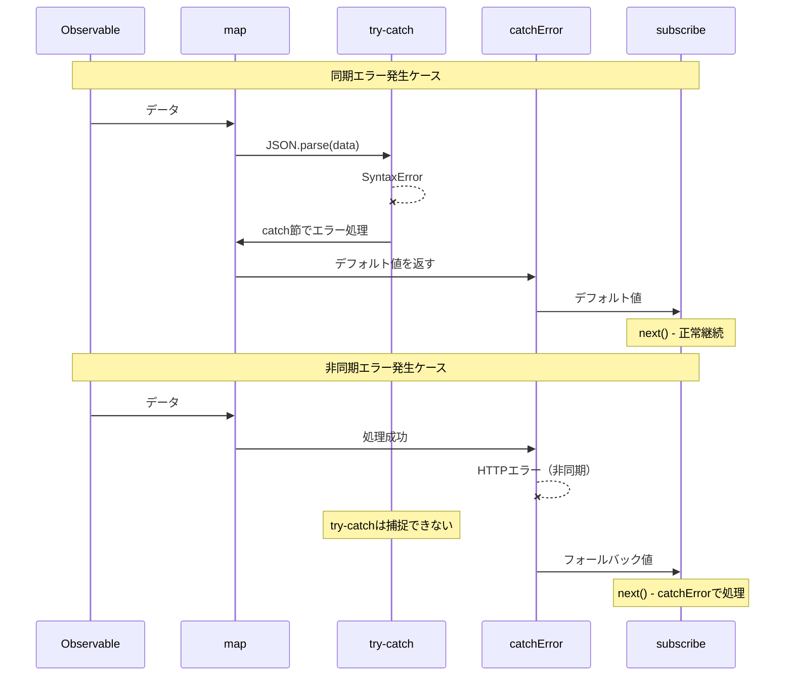

# try-catchとRxJSの統合

JavaScriptには標準的なエラー処理として`try-catch`がありますが、RxJSには`catchError`や`subscribe.error`といった独自のエラー処理機構があります。このページでは、両者の違いと適切な併用方法について解説します。

## try-catch vs RxJSエラー処理

### 基本的な違い

| 項目 | try-catch | catchError / subscribe.error |
|------|-----------|------------------------------|
| **適用対象** | 同期コード | 非同期ストリーム |
| **エラーの種類** | JavaScriptの例外 | Observable内のすべてのエラー |
| **適用範囲** | try-catchブロック内のみ | パイプライン全体 |
| **非同期対応** | ❌ 非同期エラーは捕捉できない | ✅ 非同期エラーも捕捉可能 |
| **ストリーム継続** | - | ✅ catchErrorで継続可能 |

### try-catchが捕捉できないエラー

以下のような非同期エラーは、`try-catch`では捕捉できません。

```typescript
// ❌ try-catchでは非同期エラーを捕捉できない
try {
  setTimeout(() => {
    throw new Error('非同期エラー');
  }, 1000);
} catch (error) {
  // ここは実行されない
  console.error('捕捉:', error);
}

// ✅ RxJSなら非同期エラーも捕捉できる
import { timer, throwError } from 'rxjs';
import { mergeMap, catchError } from 'rxjs/operators';

timer(1000).pipe(
  mergeMap(() => throwError(() => new Error('非同期エラー'))),
  catchError(error => {
    console.error('捕捉:', error.message); // ✅ 実行される
    return of('デフォルト値');
  })
).subscribe();
```

> [!IMPORTANT] try-catchの制限
> `try-catch`は**同期的なコード**のみを対象とします。setTimeout、HTTP リクエスト、Promise、Observable などの非同期処理で発生するエラーは捕捉できません。

## try-catchを使うべきケース

RxJSを使っていても、以下のケースでは`try-catch`が必要です。

### 1. リソースクリーンアップ時のエラー処理

`finalize`や`using`内でのリソース解放時には、`try-catch`でエラーを捕捉します。

```typescript
import { interval } from 'rxjs';
import { take, finalize } from 'rxjs/operators';

let ws: WebSocket | null = null;

interval(1000).pipe(
  take(5),
  finalize(() => {
    // リソース解放時のエラーを try-catch で処理
    try {
      if (ws) {
        ws.close();
        console.log('WebSocket正常終了');
      }
    } catch (error) {
      // クローズ失敗してもアプリケーションは継続
      console.error('WebSocketクローズエラー:', error);
    }
  })
).subscribe({
  next: val => console.log('値:', val)
});
```

**理由**: リソース解放処理自体が失敗しても、アプリケーションを継続させたい場合が多いため。

### 2. カスタムObservable内での同期エラー処理

`new Observable()`内で、同期的なエラーをRxJSエラーに変換する場合。

```typescript
import { Observable } from 'rxjs';

interface User {
  id: number;
  name: string;
}

function parseUserData(json: string): Observable<User> {
  return new Observable<User>(subscriber => {
    try {
      // JSON.parseは同期処理なので try-catch で捕捉
      const data = JSON.parse(json);

      // バリデーション
      if (!data.id || !data.name) {
        throw new Error('無効なユーザーデータ');
      }

      subscriber.next(data);
      subscriber.complete();
    } catch (error) {
      // 同期エラーをRxJSエラーに変換
      subscriber.error(error);
    }
  });
}

// 使用例
parseUserData('{"id": 1, "name": "太郎"}').subscribe({
  next: user => console.log('ユーザー:', user),
  error: err => console.error('エラー:', err.message)
});

// 不正なJSON
parseUserData('invalid json').subscribe({
  next: user => console.log('ユーザー:', user),
  error: err => console.error('エラー:', err.message) // JSON.parseのエラーを捕捉
});
```

**理由**: 同期的な処理（JSON.parse、バリデーションなど）で発生するエラーを、Observableのエラーとして伝播させるため。

### 3. 外部ライブラリとの連携

RxJSを使わない外部ライブラリを使用する際のエラー処理。

```typescript
import { of } from 'rxjs';
import { map, catchError } from 'rxjs/operators';

// 外部ライブラリ（例: 画像処理ライブラリ）
declare const ExternalImageLib: {
  process(data: string): string;
};

of('image-data-1', 'image-data-2', 'invalid-data').pipe(
  map(imageData => {
    try {
      // 外部ライブラリが例外を投げる可能性がある
      const processed = ExternalImageLib.process(imageData);
      return { success: true, data: processed };
    } catch (error) {
      // 同期エラーをキャッチして、エラー情報を含む値として返す
      console.error('画像処理エラー:', error);
      return { success: false, error: (error as Error).message };
    }
  })
).subscribe({
  next: result => {
    if (result.success) {
      console.log('処理成功:', result.data);
    } else {
      console.log('処理失敗:', result.error);
    }
  }
});
```

**理由**: 外部ライブラリのエラーをストリーム内で安全に処理し、ストリームを継続させるため。

### 4. オペレーター内での同期処理

`map`、`tap`などのオペレーター内で同期的な処理を行う場合。

```typescript
import { of } from 'rxjs';
import { map } from 'rxjs/operators';

interface Config {
  apiUrl: string;
  timeout: number;
}

of('{"apiUrl": "https://api.example.com", "timeout": 5000}').pipe(
  map(jsonString => {
    try {
      const config: Config = JSON.parse(jsonString);

      // 設定値のバリデーション
      if (config.timeout < 0) {
        throw new Error('タイムアウトは正の数である必要があります');
      }

      return config;
    } catch (error) {
      console.error('設定解析エラー:', error);
      // デフォルト設定を返す
      return { apiUrl: 'https://default.example.com', timeout: 3000 };
    }
  })
).subscribe({
  next: config => console.log('設定:', config)
});
```

**理由**: オペレーター内での同期エラーを処理し、ストリームを中断させずにデフォルト値を返すため。

## 実践的な併用パターン

### パターン1: 階層的エラー処理

同期エラーは`try-catch`、非同期エラーは`catchError`で処理する階層的アプローチ。

```typescript
import { ajax } from 'rxjs/ajax';
import { map, catchError, finalize } from 'rxjs/operators';
import { of } from 'rxjs';

interface ApiResponse {
  data: string;
  timestamp: number;
}

let connection: any = null;

ajax.getJSON<ApiResponse>('https://api.example.com/data').pipe(
  // レベル1: 同期処理のエラーを try-catch で処理
  map(response => {
    try {
      // データ変換（同期処理）
      const decoded = atob(response.data);
      return { decoded, timestamp: response.timestamp };
    } catch (error) {
      console.error('デコードエラー:', error);
      throw new Error('データ変換に失敗しました');
    }
  }),
  // レベル2: 非同期エラーを catchError で処理
  catchError(error => {
    console.error('API呼び出しエラー:', error);
    return of({ decoded: '', timestamp: Date.now() });
  }),
  // レベル3: リソースクリーンアップを try-catch で保護
  finalize(() => {
    try {
      if (connection) {
        connection.close();
        console.log('接続クローズ');
      }
    } catch (error) {
      console.error('クローズエラー:', error);
    }
  })
).subscribe({
  next: result => console.log('結果:', result),
  error: err => console.error('最終エラー:', err)
});
```

### パターン2: using()でのリソース管理

```typescript
import { using, interval } from 'rxjs';
import { take } from 'rxjs/operators';

interface ManagedResource {
  id: string;
  close: () => void;
}

function createManagedStream(resource: ManagedResource) {
  return using(
    // リソースファクトリー
    () => {
      console.log('リソース作成:', resource.id);

      return {
        unsubscribe: () => {
          // リソース解放時のエラーを try-catch で処理
          try {
            resource.close();
            console.log('リソース解放成功:', resource.id);
          } catch (error) {
            console.error('リソース解放エラー:', resource.id, error);
            // エラーが発生してもアプリケーションは継続
          }
        }
      };
    },
    // Observable ファクトリー
    () => interval(1000).pipe(take(3))
  );
}

// 使用例
const resource: ManagedResource = {
  id: 'resource-1',
  close: () => {
    // クローズ処理が失敗する可能性
    if (Math.random() > 0.5) {
      throw new Error('クローズ失敗');
    }
  }
};

createManagedStream(resource).subscribe({
  next: val => console.log('値:', val),
  complete: () => console.log('完了')
});
```

### パターン3: カスタムエラー変換

外部APIのエラーをアプリケーション固有のエラーに変換。

```typescript
import { Observable, throwError } from 'rxjs';
import { ajax } from 'rxjs/ajax';
import { catchError, map } from 'rxjs/operators';

// カスタムエラークラス
class ValidationError extends Error {
  constructor(message: string, public field: string) {
    super(message);
    this.name = 'ValidationError';
  }
}

class NetworkError extends Error {
  constructor(message: string, public statusCode: number) {
    super(message);
    this.name = 'NetworkError';
  }
}

interface UserData {
  email: string;
  age: number;
}

function validateAndFetchUser(userId: string): Observable<UserData> {
  return ajax.getJSON<UserData>(`https://api.example.com/users/${userId}`).pipe(
    map(user => {
      try {
        // 同期的なバリデーション
        if (!user.email || !user.email.includes('@')) {
          throw new ValidationError('無効なメールアドレス', 'email');
        }
        if (user.age < 0 || user.age > 150) {
          throw new ValidationError('無効な年齢', 'age');
        }
        return user;
      } catch (error) {
        if (error instanceof ValidationError) {
          // バリデーションエラーをRxJSエラーとして再スロー
          throw error;
        }
        throw new Error('データ検証エラー');
      }
    }),
    catchError(error => {
      // 非同期エラー（HTTPエラーなど）を処理
      if (error.status) {
        const networkError = new NetworkError(
          `HTTP ${error.status}: ${error.message}`,
          error.status
        );
        return throwError(() => networkError);
      }
      return throwError(() => error);
    })
  );
}

// 使用例
validateAndFetchUser('123').subscribe({
  next: user => console.log('ユーザー:', user),
  error: err => {
    if (err instanceof ValidationError) {
      console.error(`バリデーションエラー (${err.field}):`, err.message);
    } else if (err instanceof NetworkError) {
      console.error(`ネットワークエラー (${err.statusCode}):`, err.message);
    } else {
      console.error('予期しないエラー:', err);
    }
  }
});
```

## シーケンス図：try-catchとcatchErrorの協調動作



#### この図から分かるように
- **同期エラー**: `try-catch`で捕捉 → 処理 → ストリーム継続
- **非同期エラー**: `try-catch`をスキップ → `catchError`で捕捉

## アンチパターン

### ❌ アンチパターン1: try-catchで非同期エラーを捕捉しようとする

```typescript
// ❌ 悪い例: 非同期エラーは捕捉できない
import { ajax } from 'rxjs/ajax';

try {
  ajax.getJSON('https://api.example.com/data').subscribe({
    next: data => console.log(data)
  });
} catch (error) {
  // HTTPエラーはここで捕捉されない
  console.error('エラー:', error);
}
```

```typescript
// ✅ 良い例: catchErrorまたはsubscribe.errorで処理
import { ajax } from 'rxjs/ajax';
import { catchError } from 'rxjs/operators';
import { of } from 'rxjs';

ajax.getJSON('https://api.example.com/data').pipe(
  catchError(error => {
    console.error('HTTPエラー:', error);
    return of(null);
  })
).subscribe({
  next: data => console.log(data)
});
```

### ❌ アンチパターン2: try-catchでエラーを握りつぶす

```typescript
// ❌ 悪い例: エラーをログだけして握りつぶす
import { of } from 'rxjs';
import { map } from 'rxjs/operators';

of('invalid-json').pipe(
  map(json => {
    try {
      return JSON.parse(json);
    } catch (error) {
      console.error('エラー:', error);
      return null; // エラー情報が失われる
    }
  })
).subscribe({
  next: data => {
    // dataがnullでも気づかない
    console.log(data);
  }
});
```

```typescript
// ✅ 良い例: エラー情報を保持する
import { of } from 'rxjs';
import { map } from 'rxjs/operators';

interface ParseResult {
  success: boolean;
  data?: any;
  error?: string;
}

of('invalid-json').pipe(
  map(json => {
    try {
      const data = JSON.parse(json);
      return { success: true, data } as ParseResult;
    } catch (error) {
      return {
        success: false,
        error: (error as Error).message
      } as ParseResult;
    }
  })
).subscribe({
  next: result => {
    if (result.success) {
      console.log('データ:', result.data);
    } else {
      console.error('パースエラー:', result.error);
    }
  }
});
```

### ❌ アンチパターン3: 不要なtry-catchの乱用

```typescript
// ❌ 悪い例: RxJSが処理できるエラーをtry-catchで包む
import { of } from 'rxjs';
import { map } from 'rxjs/operators';

of(1, 2, 3).pipe(
  map(x => {
    try {
      return x * 10;
    } catch (error) {
      // このコードはエラーを投げないので不要
      return 0;
    }
  })
).subscribe();
```

```typescript
// ✅ 良い例: 必要な箇所だけtry-catchを使う
import { of } from 'rxjs';
import { map } from 'rxjs/operators';

of('{"value": 1}', 'invalid', '{"value": 2}').pipe(
  map(json => {
    try {
      // JSON.parseは例外を投げる可能性があるので try-catch が必要
      return JSON.parse(json);
    } catch (error) {
      console.error('JSON解析エラー:', error);
      return { value: 0 };
    }
  })
).subscribe({
  next: data => console.log('データ:', data)
});
```

## ベストプラクティス

### 1. エラーの種類で使い分ける

```typescript
import { ajax } from 'rxjs/ajax';
import { map, catchError, finalize } from 'rxjs/operators';
import { of } from 'rxjs';

// 明確な使い分け
ajax.getJSON<{ data: string }>('https://api.example.com/data').pipe(
  // 同期処理のエラー → try-catch
  map(response => {
    try {
      return JSON.parse(response.data);
    } catch (error) {
      console.error('パースエラー:', error);
      return {};
    }
  }),
  // 非同期エラー → catchError
  catchError(error => {
    console.error('APIエラー:', error);
    return of({});
  }),
  // クリーンアップ時のエラー → try-catch
  finalize(() => {
    try {
      // リソース解放処理
    } catch (error) {
      console.error('クリーンアップエラー:', error);
    }
  })
).subscribe();
```

### 2. エラー情報を保持する

```typescript
import { of } from 'rxjs';
import { map } from 'rxjs/operators';

interface Result<T> {
  success: boolean;
  value?: T;
  error?: string;
}

function safeParse<T>(json: string): Result<T> {
  try {
    const value = JSON.parse(json);
    return { success: true, value };
  } catch (error) {
    return {
      success: false,
      error: error instanceof Error ? error.message : String(error)
    };
  }
}

of('{"name": "太郎"}', 'invalid').pipe(
  map(json => safeParse(json))
).subscribe({
  next: result => {
    if (result.success) {
      console.log('成功:', result.value);
    } else {
      console.error('失敗:', result.error);
    }
  }
});
```

### 3. カスタムエラーで詳細情報を提供

```typescript
// カスタムエラークラス
class DataProcessingError extends Error {
  constructor(
    message: string,
    public readonly data: unknown,
    public readonly step: string
  ) {
    super(message);
    this.name = 'DataProcessingError';
  }
}

import { of } from 'rxjs';
import { map } from 'rxjs/operators';

of({ raw: 'some-data' }).pipe(
  map(input => {
    try {
      // 複雑な処理
      const processed = processData(input.raw);
      return processed;
    } catch (error) {
      throw new DataProcessingError(
        'データ処理に失敗しました',
        input,
        'processing'
      );
    }
  })
).subscribe({
  next: data => console.log('処理済み:', data),
  error: (err: DataProcessingError) => {
    console.error(`エラー (${err.step}):`, err.message);
    console.error('入力データ:', err.data);
  }
});

function processData(raw: string): any {
  return raw;
}
```

### 4. ログとモニタリング

```typescript
import { ajax } from 'rxjs/ajax';
import { map, catchError, tap } from 'rxjs/operators';
import { of } from 'rxjs';

// エラー監視関数
function logError(context: string, error: Error): void {
  console.error(`[${context}]`, error.message);
  // 本番環境ではエラー監視サービスに送信
  // errorMonitoringService.captureException(error, { context });
}

ajax.getJSON('https://api.example.com/data').pipe(
  tap(data => console.log('受信:', data)),
  map(data => {
    try {
      // データ変換
      return transformData(data);
    } catch (error) {
      logError('Data Transformation', error as Error);
      throw error; // catchErrorに伝播
    }
  }),
  catchError(error => {
    logError('API Request', error);
    return of(null);
  })
).subscribe();

function transformData(data: any): any {
  return data;
}
```

## よくある質問

::: info **Q: try-catchとcatchErrorを両方使う必要がありますか？**
A: はい、使い分けが必要です。
- **try-catch**: 同期処理のエラー（JSON.parse、バリデーションなど）
- **catchError**: 非同期エラー（HTTP、タイマー、Promise など）
:::

::: info **Q: map内でthrowするのとtry-catchで処理するのはどちらが良いですか？**
A: 状況によります。
- **throwする**: エラーをストリーム全体に伝播させたい場合
- **try-catchで処理**: その場でリカバリーしてストリームを継続させたい場合
```typescript
// throwする例
map(x => {
  if (x < 0) throw new Error('負の数');
  return x;
})

// try-catchで処理する例
map(x => {
  try {
    return riskyOperation(x);
  } catch (error) {
    return defaultValue; // その場でリカバリー
  }
})
```
:::

::: info **Q: finalize内でエラーが発生したらどうなりますか？**
A: `finalize`内でエラーが発生すると、そのエラーは`subscribe.error`に伝播せず、コンソールに`Uncaught Error`として表示されます。そのため、`finalize`内では必ず`try-catch`でエラーを捕捉すべきです。
:::

::: info **Q: async/awaitとtry-catchの組み合わせは使えますか？**
A: はい、Promiseを扱う場合は有効です。
```typescript
import { from } from 'rxjs';
import { mergeMap } from 'rxjs/operators';

async function fetchData(id: string): Promise<any> {
  try {
    const response = await fetch(`/api/data/${id}`);
    return await response.json();
  } catch (error) {
    console.error('Fetch error:', error);
    throw error;
  }
}

from([1, 2, 3]).pipe(
  mergeMap(id => from(fetchData(String(id))))
).subscribe({
  next: data => console.log('データ:', data),
  error: err => console.error('エラー:', err)
});
```
:::

::: info **Q: カスタムObservable内でsubscriber.error()を呼ぶべきか、throwすべきか？**
A: `new Observable()`内では、**subscriber.error()を使用**してください。
```typescript
// ✅ 正しい
new Observable(subscriber => {
  try {
    const data = riskyOperation();
    subscriber.next(data);
  } catch (error) {
    subscriber.error(error); // RxJSエラーとして伝播
  }
})

// ❌ 間違い（Observableコンストラクタ内でthrowすると予期しない動作）
new Observable(subscriber => {
  const data = riskyOperation(); // エラーが捕捉されない可能性
  subscriber.next(data);
})
```
:::

## まとめ

`try-catch`とRxJSのエラー処理は、それぞれ異なる役割を持ち、併用することで堅牢なエラーハンドリングが実現できます。

### 使い分けの原則

| シナリオ | 推奨 | 理由 |
|---------|------|------|
| 同期処理（JSON.parse、バリデーション） | try-catch | 同期エラーを即座に捕捉 |
| 非同期処理（HTTP、タイマー） | catchError | 非同期エラーを捕捉 |
| リソース解放（finalize、using） | try-catch | 解放失敗を安全に処理 |
| カスタムObservable内 | try-catch + subscriber.error() | 同期エラーをRxJSエラーに変換 |
| 外部ライブラリ連携 | try-catch | ライブラリのエラーを安全に処理 |

> [!IMPORTANT] 重要な原則
> 1. **同期処理は try-catch、非同期処理は catchError/subscribe.error**
> 2. **finalize内では必ず try-catch でエラーを捕捉**
> 3. **エラー情報を握りつぶさず、適切に伝播または記録**
> 4. **カスタムエラークラスで詳細情報を提供**
> 5. **不要な try-catch は使わない（コードが複雑になる）**

## 関連セクション

- **[エラーハンドリングの2つの場所](/guide/error-handling/error-handling-locations)** - catchErrorとsubscribe.errorの違い
- **[エラー処理戦略](/guide/error-handling/strategies)** - RxJSの包括的なエラー処理戦略
- **[using()](/guide/creation-functions/control/using)** - リソース管理とtry-catchの併用例
- **[finalize と complete](/guide/error-handling/finalize)** - リソース解放時のエラー処理

## 参考リソース

- [RxJS公式ドキュメント - catchError](https://rxjs.dev/api/index/function/catchError)
- [MDN - try...catch](https://developer.mozilla.org/ja/docs/Web/JavaScript/Reference/Statements/try...catch)
- [RxJS公式ドキュメント - Error Handling](https://rxjs.dev/guide/error-handling)
