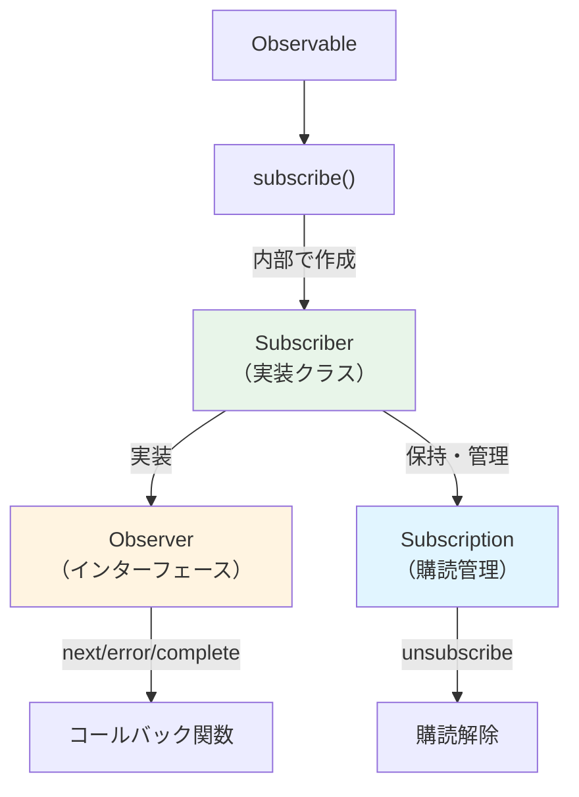
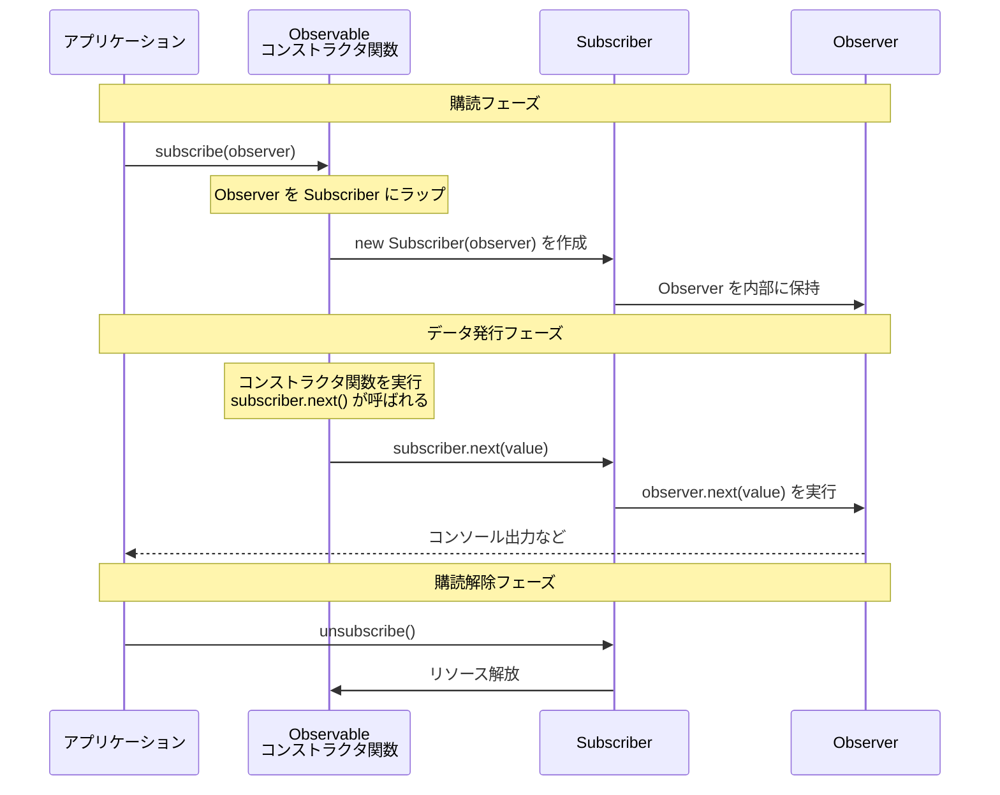

# Observer と Subscriber の違い

## なぜ混同されるのか

RxJSを学習する際、「Observer」と「Subscriber」という用語が出てきて、混乱することがあります。この2つは密接に関係していますが、明確に異なる役割を持っています。

## Observer とは

**Observer（オブザーバー）** は、データを受け取るための**インターフェース**です。

### Observer の定義

```typescript
interface Observer<T> {
  next: (value: T) => void;       // 値を受け取る
  error?: (err: any) => void;     // エラーを受け取る
  complete?: () => void;          // 完了を受け取る
}
```

### Observer の役割
- データの「受け取り方」を定義
- 3つのコールバック関数を持つ
- **何をするか**を記述

## Subscriber とは

**Subscriber（サブスクライバー）** は、Observer を実装した**クラス**で、実際の購読処理を行います。

### Subscriber の役割
- Observer のコールバックを実行
- Subscription（購読管理）を保持
- 購読解除の処理を管理
- **どのように実行するか**を制御

## Subscriber が登場する2つの場面

Subscriber は、実は**2つの異なる場面**で登場します。ただし、**両方とも同じ Subscriber オブジェクト**です。この違いを理解することが、混同を避けるための鍵です。

### 場面1: Observable作成時（パラメータとして受け取る）

Observable を `new Observable()` で作成する際、コンストラクタ関数のパラメータとして `subscriber` が渡されます。

```typescript
import { Observable } from 'rxjs';

// subscriber を使って値を発行する（型は Subscriber<number>）
const observable$ = new Observable<number>(subscriber => {
  subscriber.next(1);      // 値を発行
  subscriber.next(2);
  subscriber.complete();   // 完了を通知
});
```

::: tip この場面での subscriber の型
- 型：`Subscriber<number>`
- 役割：Observable 内部でデータを発行するために使用
- 開発者が直接使う（`next()`, `error()`, `complete()` を呼ぶ）
:::

### 場面2: subscribe()呼び出し時（Observer → Subscriber に変換）

Observable に対して `subscribe()` を呼ぶと、**開発者が渡した Observer が内部で Subscriber に変換**されます。

```typescript
// 開発者は Observer インターフェースを渡す
observable$.subscribe({
  next: value => console.log('次の値:', value),
  error: err => console.error('エラー:', err),
  complete: () => console.log('完了')
});

// ↑ RxJS が内部で以下のように Subscriber を作成
// const subscriber = new Subscriber(observer);
// そして、この subscriber が場面1のパラメータとして渡される
```

::: tip この場面での処理
1. 開発者が `Observer` インターフェースを渡す
2. RxJS が内部で `Observer` を `Subscriber` にラップ
3. その `Subscriber` が Observable のコンストラクタ関数に渡される（= 場面1の `subscriber`）
:::

### 重要：両方とも同じ Subscriber オブジェクト

> [!IMPORTANT] 場面1と場面2の `Subscriber` は同じオブジェクト
>
> ```typescript
> const observable$ = new Observable(subscriber => {
>   // この subscriber は、subscribe() が呼ばれた時に作成された
>   // Subscriber オブジェクトそのもの
>   subscriber.next(1);
> });
>
> observable$.subscribe({
>   // この Observer が Subscriber にラップされ、
>   // 上記のコンストラクタ関数に渡される
>   next: v => console.log(v)
> });
> ```
>
> **つまり：**
> - 開発者が `subscribe(observer)` を呼ぶ
> - RxJS が `new Subscriber(observer)` を作成
> - その Subscriber が Observable のコンストラクタ関数の引数になる
> - だから、場面1の `subscriber` = 場面2で作成された `Subscriber`

## 関係性の図解



## コードで見る違い

### 完全な例：Observable作成から購読まで

```typescript
import { Observable } from 'rxjs';

// 1. Observable作成時：subscriber を使って値を発行
const observable$ = new Observable<number>(subscriber => {
  console.log('購読開始');
  subscriber.next(1);
  subscriber.next(2);
  subscriber.next(3);
  subscriber.complete();
});

// 2. 購読時：Observer を渡す（内部で Subscriber が作成される）
observable$.subscribe({
  next: value => console.log('次の値:', value),
  error: err => console.error('エラー:', err),
  complete: () => console.log('完了')
});

// 出力:
// 購読開始
// 次の値: 1
// 次の値: 2
// 次の値: 3
// 完了
```

#### この例では
- **作成時の `subscriber`**: Observable 内部でデータを発行するために使用
- **購読時の `Observer`**: 発行されたデータを受け取る処理を定義

### Observer を渡す場合

```typescript
import { interval } from 'rxjs';

const observer = {
  next: (value: number) => console.log(value),
  error: (err: any) => console.error(err),
  complete: () => console.log('完了')
};

// Observer を subscribe に渡す
const subscription = interval(1000).subscribe(observer);
// 内部で Subscriber が作成され、observer のコールバックを実行する
```

### 直接コールバックを渡す場合（簡略記法）

```typescript
// これも内部で Subscriber が作成される
const subscription = interval(1000).subscribe(
  value => console.log(value),  // next
  err => console.error(err),    // error
  () => console.log('完了')     // complete
);
```

## 実際の動作フロー

以下のシーケンス図は、Observable 作成から購読、データ発行までの流れを示しています。



**このフローの重要なポイント：**
1. `subscribe(observer)` を呼ぶと、`new Subscriber(observer)` が作成される
2. その Subscriber が Observable のコンストラクタ関数のパラメータとして渡される
3. コンストラクタ関数内で `subscriber.next()` を呼ぶと、内部の `observer.next()` が実行される
4. つまり、**場面1の `subscriber` = 場面2で作成された `Subscriber`**

## 重要なポイント

> [!IMPORTANT] Observer は「設計図」、Subscriber は「実行者」
> - **Observer**: データの受け取り方を**定義**するインターフェース
> - **Subscriber**: Observer を**実装**し、実際に購読を**実行**するクラス
> - Subscriber は2つの場面で登場する

> [!TIP] Subscriber を使う場面を理解しよう
> - **Observable作成時**: `new Observable(subscriber => {...})` の `subscriber` パラメータを直接使う
> - **購読時**: `subscribe(observer)` を呼ぶと、内部で自動的に Subscriber が作成される
>
> どちらの場面でも、Subscriber は `next()`, `error()`, `complete()` メソッドを持つ同じオブジェクトです。

## よくある混同パターン

### ❌ 間違った理解 その1

「Observable作成時の `subscriber` と 購読時の `observer` は別物」

### ❌ 間違った理解 その2

「Subscriber は内部の実装なので、開発者は触れない」

### ✅ 正しい理解

**重要な事実：**
- 開発者が `subscribe(observer)` で渡す **Observer** は、内部で **Subscriber** にラップされる
- その **Subscriber** が、Observable 作成時のコンストラクタ関数のパラメータとして渡される
- つまり、**場面1の `subscriber` = 場面2で作成された `Subscriber`（同一オブジェクト）**

### 完全な例で理解する

```typescript
import { Observable } from 'rxjs';

// 1. Observable を作成（この時点では何も実行されない）
const observable$ = new Observable<number>(subscriber => {
  console.log('コンストラクタ関数が実行された！');
  subscriber.next(1);
  subscriber.next(2);
  subscriber.complete();
});

// 2. 購読する（この瞬間に初めてコンストラクタ関数が実行される）
observable$.subscribe({
  next: v => console.log('受信:', v),
  complete: () => console.log('完了')
});

// 出力:
// コンストラクタ関数が実行された！
// 受信: 1
// 受信: 2
// 完了
```

**この例での流れ：**
1. `observable$.subscribe({...})` が呼ばれる
2. RxJS が `new Subscriber({next: ..., complete: ...})` を作成
3. その `Subscriber` をパラメータとしてコンストラクタ関数 `(subscriber => {...})` が実行される
4. コンストラクタ関数内の `subscriber.next(1)` が呼ばれる
5. 内部で `observer.next(1)` が実行され、「受信: 1」が出力される

**つまり：**
- 場面1の `subscriber` ← これ
- 場面2で作成された `Subscriber` ← これ
- **同じオブジェクト！**

## まとめ

### Observer と Subscriber の比較

| | Observer | Subscriber |
|---|----------|------------|
| **種類** | インターフェース | クラス（Observer を実装） |
| **役割** | データの受け取り方を定義 | 実際の購読処理を実行 |
| **内容** | next/error/complete のコールバック | Observer + Subscription 管理 |
| **登場する場面** | 購読時のみ | Observable作成時 & 購読時 |

### 重要：2つの場面での関係性

| 場面 | 開発者が扱うもの | 実際の型 | 関係性 |
|------|------------------|----------|--------|
| **Observable作成時** | `new Observable(subscriber => {...})` のパラメータ | `Subscriber<T>` | 開発者が直接使う |
| **購読時** | `subscribe(observer)` に渡すオブジェクト | `Observer<T>` → 内部で `Subscriber<T>` に変換 | RxJS が自動変換 |

> [!IMPORTANT] 核心のポイント
> - 開発者が `subscribe(observer)` で渡す `Observer` は、内部で `Subscriber` にラップされる
> - その `Subscriber` が Observable のコンストラクタ関数のパラメータとして渡される
> - したがって、**両方の場面で使われる `Subscriber` は同一オブジェクト**

## 次のステップ

Observer と Subscriber の違いを理解したら、次は実際の購読管理について学びましょう。

- [Observableのライフサイクル](/guide/observables/observable-lifecycle) - 購読の開始から終了までの流れ
- [Subscription の管理](/guide/observables/observable-lifecycle#subscription-の管理) - 購読解除とリソース管理

## 参考リソース

- [RxJS公式ドキュメント - Observer](https://rxjs.dev/guide/observer) - Observer の詳細な仕様
- [RxJS公式ドキュメント - Subscription](https://rxjs.dev/guide/subscription) - Subscription の詳細な仕様
- [Understanding the Difference Between Observer and Subscriber in RxJS](https://www.codingscenes.com/posts/92/Understanding-the-Difference-Between-Observer-and-Subscriber-in-RxJS) - Subscriber の拡張機能と実践例（英語）
