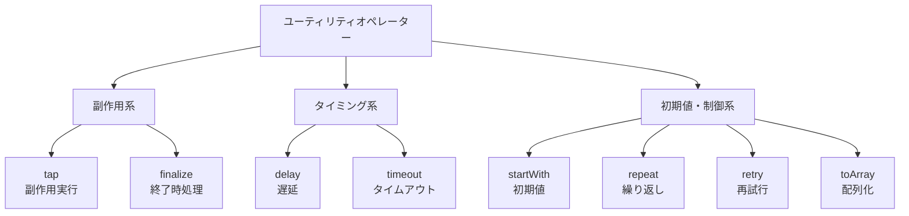

# ユーティリティオペレーター

RxJSのユーティリティオペレーターは、データの変換やフィルタリングといった主目的の処理ではなく、**ストリームの補助処理（副作用、状態制御、UI対応など）を担う演算子群**です。

本ページでは、演算子を以下のように目的別に分類し、基本的な用途を確認できる一覧を掲載します。  
詳細な使い方や実践例については、各ページまたは [実用的なユースケース](./practical-use-cases.md) を参照してください。

## 📦 演算子一覧（目的別）

### ◾ サイドエフェクト・状態制御

| オペレーター | 説明 | よく組み合わせる演算子 |
|--------------|------|------------------|
| [tap](./tap.md) | 値を変更せず副作用を実行（ログ出力やUI更新など） | `map`, `switchMap` |
| [finalize](./finalize.md) | ストリーム終了時にクリーンアップ処理を実行 | `tap`, `catchError` |

### ◾ タイミング・遅延制御

| オペレーター | 説明 | よく組み合わせる演算子 |
|--------------|------|------------------|
| [delay](./delay.md) | 各値の発行を指定時間遅延させる | `tap`, `concatMap` |
| [timeout](./timeout.md) | 発行が一定時間を超えるとエラー発生 | `catchError`, `retry` |
| [takeUntil](./takeUntil.md) | 指定Observableが通知した時点で購読終了 | `interval`, `fromEvent` |

### ◾ 初期値・繰り返し・配列化など

| オペレーター | 説明 | よく組み合わせる演算子 |
|--------------|------|------------------|
| [startWith](./startWith.md) | ストリームの最初に初期値を発行 | `scan`, `combineLatest` |
| [repeat](./repeat.md) | 完了後にストリーム全体を再購読 | `tap`, `delay` |
| [retry](./retry.md) | エラー時に再試行 | `catchError`, `switchMap` |
| [toArray](./toArray.md) | ストリームの全値を1つの配列で発行（完了時） | `concatMap`, `take` |

## 🧭 オペレーターの分類図（Mermaidによる視覚化）

> 上図では、用途ごとに分類されたユーティリティオペレーターの全体像を視覚的に把握できます。

## 📌 備考

- `retry` と `repeat` の違い：  
  - `retry`: **エラーが出た時に再試行**  
  - `repeat`: **正常に完了した時に再試行**
- `toArray` は完了しない限り値を出力しないため、 `take()` などと併用するのが一般的です。
