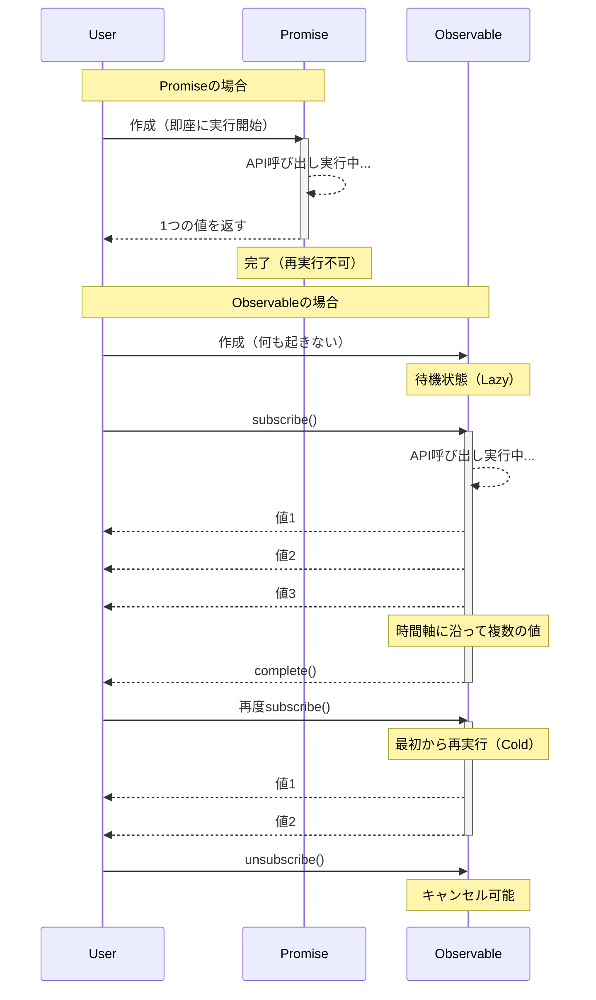

# 概念理解の壁

RxJSの最初の壁は、**概念の理解**です。特にPromiseに慣れた開発者にとって、Observableの振る舞いは直感に反することがあります。

## Observable vs Promise の本質的違い

### Promise: 単発の非同期処理

```typescript
// Promise: 1回だけ値を返す
const userPromise = fetch('/api/user/1').then(res => res.json());

userPromise.then(user => console.log(user)); // ユーザー情報を1回だけ取得
userPromise.then(user => console.log(user)); // キャッシュされた同じ結果
```

> [!TIP] 特徴
> - **Eager（即座に実行）** - Promise作成時点で処理が開始される
> - **1回だけ完了** - 成功か失敗、どちらか1回だけ
> - **キャンセル不可** - 一度開始したら止められない
> - **常にHot** - 複数のthenで同じ結果を共有

### Observable: ストリーム（時間軸を持つデータの流れ）

```typescript
import { Observable } from 'rxjs';

// Observable: 時間軸に沿って複数の値を流す
const user$ = new Observable<User>(subscriber => {
  console.log('Observable実行開始！');
  fetch('/api/user/1')
    .then(res => res.json())
    .then(user => {
      subscriber.next(user);
      subscriber.complete();
    });
});

// ❌ この時点ではまだ何も起きない（Lazy）
console.log('Observable作成完了');

// ✅ subscribeして初めて実行される
user$.subscribe(user => console.log('購読1:', user));
user$.subscribe(user => console.log('購読2:', user));
// → API呼び出しが2回実行される（Cold Observable）
```

#### 出力
```
Observable作成完了
Observable実行開始！
購読1: { id: 1, name: 'Alice' }
Observable実行開始！
購読2: { id: 1, name: 'Alice' }
```

> [!TIP] 特徴
> - **Lazy（遅延実行）** - subscribeするまで何も起きない
> - **複数の値を流せる** - next()を複数回呼べる
> - **キャンセル可能** - unsubscribeで停止できる
> - **ColdまたはHot** - 購読ごとに実行するか、共有するかを選べる

### 比較表

| 特徴 | Promise | Observable |
|---|---|---|
| **実行タイミング** | 即座（Eager） | 購読時（Lazy） |
| **値の数** | 1回のみ | 0回以上（複数可） |
| **キャンセル** | 不可 | 可能（unsubscribe） |
| **再利用** | キャッシュされた結果 | 購読ごとに再実行（Cold） |
| **エラー後** | 終了 | 終了（retry可能） |

### 動作の違いを視覚化

以下のシーケンス図は、PromiseとObservableの実行フローの違いを示しています。



### よくある誤解

#### ❌ 誤解1: "Observableは非同期専用"

```typescript
// Observable は同期処理も扱える
import { of } from 'rxjs';

const sync$ = of(1, 2, 3);

console.log('Before subscribe');
sync$.subscribe(value => console.log(value));
console.log('After subscribe');

// 出力（同期的に実行される）:
// Before subscribe
// 1
// 2
// 3
// After subscribe
```

#### ❌ 誤解2: "subscribeすると値が返る"

```typescript
import { map, of } from "rxjs";

const observable$ = of(1, 2, 3);

// ❌ 悪い例: Promise的な思考
const value = observable$.subscribe(x => x); // valueはSubscriptionオブジェクト
console.log(value); // Subscription { ... } ← 期待した値ではない

// ✅ 良い例: Observable的な思考
observable$.pipe(
  map(x => x * 2)
).subscribe(value => {
  console.log(value); // ここで値を使う
});
```

## Cold vs Hot の直感的理解

### Cold Observable: 購読ごとに独立したストリーム

```typescript
import { interval } from 'rxjs';
import { take } from 'rxjs';

// Cold: 各購読者が独立したタイマーを持つ
const cold$ = interval(1000).pipe(take(3));

console.log('購読1開始');
cold$.subscribe(x => console.log('購読1:', x));

setTimeout(() => {
  console.log('購読2開始（2秒後）');
  cold$.subscribe(x => console.log('購読2:', x));
}, 2000);

// 出力:
// 購読1開始
// 購読1: 0        (1秒後)
// 購読1: 1        (2秒後)
// 購読2開始（2秒後）
// 購読1: 2        (3秒後)
// 購読2: 0        (3秒後) ← 購読2は最初からスタート
// 購読2: 1        (4秒後)
// 購購読2: 2        (5秒後)
```

> [!TIP] Coldの特徴
> - 購読ごとに**独立した実行**
> - データの「設計図」を保持
> - 例: HTTP API呼び出し、タイマー、ファイル読み込み

### Hot Observable: すべての購読者が同じストリームを共有

```typescript
import { interval } from 'rxjs';
import { take, share } from 'rxjs';

// Hot: share()で共有される
const hot$ = interval(1000).pipe(
  take(3),
  share() // これでHotになる
);

console.log('購読1開始');
hot$.subscribe(x => console.log('購読1:', x));

setTimeout(() => {
  console.log('購読2開始（2秒後）');
  hot$.subscribe(x => console.log('購読2:', x));
}, 2000);

// 出力:
// 購読1開始
// 購読1: 0        (1秒後)
// 購読1: 1        (2秒後)
// 購読2開始（2秒後）
// 購読1: 2        (3秒後)
// 購読2: 2        (3秒後) ← 購読2は途中から参加
```

> [!TIP] Hotの特徴
> - すべての購読者が**同じ実行を共有**
> - データが「放送」されている状態
> - 例: クリックイベント、WebSocket、Subject

### Cold/Hotの判別方法

```typescript
import { fromEvent, interval, of } from 'rxjs';

// Cold（購読ごとに独立）
const cold1$ = of(1, 2, 3);
const cold2$ = interval(1000);
const cold3$ = ajax('/api/data');

// Hot（常に共有）
const hot1$ = fromEvent(button, 'click');
const hot2$ = new Subject<number>();
```

> [!IMPORTANT] 見分け方
> - **Creation Functions（of, interval, ajax等）** → 通常はCold
> - **DOMイベント（fromEvent）** → 常にHot
> - **Subject系** → 常にHot
> - **share(), shareReplay()使用** → Hotに変換

## 宣言的プログラミングへの思考転換

### 命令的 vs 宣言的

RxJSは**宣言的プログラミング**のパラダイムです。

#### ❌ 命令的な思考（Promise/async-await）

```typescript
// 命令的: 「どうやって」処理するかを記述
async function processUsers() {
  const response = await fetch('/api/users');
  const users = await response.json();

  const activeUsers = [];
  for (const user of users) {
    if (user.isActive) {
      activeUsers.push(user);
    }
  }

  const userNames = [];
  for (const user of activeUsers) {
    userNames.push(user.name.toUpperCase());
  }

  return userNames;
}
```

#### ✅ 宣言的な思考（RxJS）

```typescript
import { from } from 'rxjs';
import { mergeMap, filter, map, toArray } from 'rxjs';

// 宣言的: 「何を」変換するかを記述
const processUsers$ = from(fetch('/api/users')).pipe(
  mergeMap(res => res.json()),
  mergeMap(users => users), // 配列を展開
  filter(user => user.isActive),
  map(user => user.name.toUpperCase()),
  toArray()
);

processUsers$.subscribe(userNames => console.log(userNames));
```


::: tip 違い
- **命令的**: 手順（ループ、条件分岐、変数代入）を記述
- **宣言的**: 変換のパイプライン（データの流れ）を記述
:::

### 思考転換のポイント

#### ポイント1: subscribe内でデータ加工をしない

データ変換はpipe内で、subscribeは副作用のみとする。

```typescript
import { filter, map, of } from "rxjs";

const observable$ = of(1, 2, 3);
// ❌ 悪い例: subscribe内で加工
observable$.subscribe(value => {
  const doubled = value * 2;           // 👈 subscribe内で計算
  const filtered = doubled > 4 ? doubled : null;  // 👈 subscribe内で条件分岐
  if (filtered) {                      // 👈 subscribe内でif文
    console.log(filtered);
  }
});

// ✅ 良い例: pipe内で変換
observable$.pipe(
  map(value => value * 2),       // 計算はpipe内で
  filter(value => value > 4)     // フィルタリングもpipe内で
).subscribe(value => console.log(value));  // subscribeは副作用のみ
```

#### ポイント2: 中間変数を使わない

```typescript
import { filter, map, Observable, of } from "rxjs";

const source$ = of(1, 2, 3, 4, 5);

// ❌ 悪い例: 中間変数に保存
let doubled$: Observable<number>;      // 👈 中間変数を宣言
let filtered$: Observable<number>;     // 👈 中間変数を宣言

doubled$ = source$.pipe(map(x => x * 2));    // 👈 中間変数に代入
filtered$ = doubled$.pipe(filter(x => x > 5)); // 👈 中間変数に代入
filtered$.subscribe(console.log);

// ✅ 良い例: パイプラインで繋ぐ
source$.pipe(
  map(x => x * 2),      // 直接パイプラインで繋ぐ
  filter(x => x > 5)    // 直接パイプラインで繋ぐ
).subscribe(console.log);
```

#### ポイント3: ネストしたsubscribeを避ける

```typescript
// ❌ 悪い例: ネストしたsubscribe
getUser$(userId).subscribe(user => {
  getOrders$(user.id).subscribe(orders => {  // 👈 subscribe内でさらにsubscribe（ネスト）
    console.log(user, orders);
  });  // 👈 購読解除が複雑になる
});

// ✅ 良い例: mergeMapで平坦化
getUser$(userId).pipe(
  mergeMap(user =>                // mergeMapで内側のObservableを平坦化
    getOrders$(user.id).pipe(
      map(orders => ({ user, orders }))
    )
  )
).subscribe(({ user, orders }) => console.log(user, orders));  // 購読は1箇所だけ
```

#### ポイント4: 3段階分離構文で整理する

RxJSコードの可読性と保守性を大幅に向上させる重要な手法が**段階分離構文**です。

```typescript
// ❌ 悪い例: すべてが混在したワンライナー
fromEvent(document, 'click').pipe(
  map(event => (event as MouseEvent).clientX),
  filter(x => x > 100),
  throttleTime(200)
).subscribe({
  next: x => console.log('クリック位置:', x),
  error: err => console.error(err)
});
```

> [!IMPORTANT] 問題点
> - ストリーム定義・変換・購読が混在
> - デバッグが困難（どこで問題が起きているか分からない）
> - テストしにくい
> - 再利用できない

```typescript
// ✅ 良い例: 3段階に分離

import { filter, fromEvent, map, throttleTime } from "rxjs";

// 1. Observable 定義（ストリームの発生源）
const clicks$ = fromEvent(document, 'click');

// 2. パイプライン定義（データの変換処理）
const processed$ = clicks$.pipe(
  map(event => (event as MouseEvent).clientX),
  filter(x => x > 100),
  throttleTime(200)
);

// 3. 購読処理（副作用の実行）
const subscription = processed$.subscribe({
  next: x => console.log('クリック位置:', x),
  error: err => console.error(err),
  complete: () => console.log('完了')
});
```

#### メリット
- **デバッグが容易** - 各段階で`console.log`や`tap`を挿入できる
- **テスト可能** - `processed$`を独立してテストできる
- **再利用性** - `clicks$`や`processed$`を他の場所でも使える
- **可読性向上** - コードの意図が明確になる

**段階分離構文は、RxJS困難点を克服する最も実践的な手法の一つです。**

詳しくは **[Chapter 10: ワンライナー地獄と段階分離構文](/guide/anti-patterns/one-liner-hell)** を参照してください。

## 実験して理解する（Starter Kit活用）

### 実験1: LazyとEagerの違い

```typescript
import { Observable } from 'rxjs';

console.log('=== Promise（Eager） ===');
const promise = new Promise((resolve) => {
  console.log('Promise実行！');
  resolve(42);
});
console.log('Promise作成完了');
promise.then(value => console.log('Promise結果:', value));

console.log('\n=== Observable（Lazy） ===');
const observable$ = new Observable(subscriber => {
  console.log('Observable実行！');
  subscriber.next(42);
  subscriber.complete();
});
console.log('Observable作成完了');
observable$.subscribe(value => console.log('Observable結果:', value));

// 出力:
// === Promise（Eager） ===
// Promise実行！
// Promise作成完了
// Promise結果: 42
//
// === Observable（Lazy） ===
// Observable作成完了
// Observable実行！
// Observable結果: 42
```

### 実験2: ColdとHotの違い

```typescript
import { interval } from 'rxjs';
import { take, share } from 'rxjs';

// Cold: 購読ごとに独立
const cold$ = interval(1000).pipe(take(3));

console.log('Cold Observable:');
cold$.subscribe(x => console.log('Cold 購読1:', x));
setTimeout(() => {
  cold$.subscribe(x => console.log('Cold 購読2:', x));
}, 2000);

// Hot: 共有される
const hot$ = interval(1000).pipe(take(3), share());

setTimeout(() => {
  console.log('\nHot Observable:');
  hot$.subscribe(x => console.log('Hot 購読1:', x));
  setTimeout(() => {
    hot$.subscribe(x => console.log('Hot 購読2:', x));
  }, 2000);
}, 6000);
```

**[学習用の実行環境](/guide/starter-kid)で実際に動かして、違いを体感してください。**

### 実験3: 宣言的 vs 命令的

```typescript
import { of } from 'rxjs';
import { map, filter } from 'rxjs';

const numbers = [1, 2, 3, 4, 5, 6, 7, 8, 9, 10];

// 命令的
console.log('=== 命令的 ===');
const result1: number[] = [];
for (const num of numbers) {
  const doubled = num * 2;
  if (doubled > 10) {
    result1.push(doubled);
  }
}
console.log(result1);

// 宣言的
console.log('\n=== 宣言的 ===');
of(...numbers).pipe(
  map(num => num * 2),
  filter(num => num > 10)
).subscribe(num => console.log(num));
```

## 理解度チェック

以下の質問に答えられるか確認してください。

```markdown
## 基本概念
- [ ] PromiseとObservableの違いを3つ挙げられる
- [ ] LazyとEagerの違いを説明できる
- [ ] ColdとHotの違いを実例で説明できる

## 実践
- [ ] なぜsubscribe内で処理を完結させてはいけないのか説明できる
- [ ] ネストしたsubscribeをどう修正すべきか分かる
- [ ] Cold ObservableをHotに変換する方法を知っている

## デバッグ
- [ ] Observableが実行されないときの原因を特定できる
- [ ] 購読が複数回実行される原因を理解している
```

## 次のステップ

概念理解ができたら、次は実践的な壁に進みましょう。

- **ライフサイクル管理の壁**（準備中） - いつsubscribe/unsubscribeすべきか
- **オペレーター選択の迷い**（準備中） - 100+のオペレーターから選ぶ基準

## 関連セクション

- **[RxJSとは何か](/guide/basics/what-is-rxjs)** - RxJSの基本概念
- **[PromiseとRxJSの違い](/guide/basics/promise-vs-rxjs)** - Promise vs Observable
- **[Cold and Hot Observables](/guide/observables/cold-and-hot-observables)** - Cold/Hotの詳細解説
