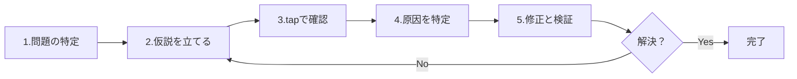

# デバッグの壁

RxJSで **「値が流れない」「期待と違う値が出る」「メモリリークしているかも」** という問題に直面したとき、適切なデバッグ方法を知らないと解決に時間がかかります。このページでは、RxJS特有のデバッグ手法を総合的に解説します。

## RxJSデバッグの基本戦略

### デバッグの5つのステップ



### ステップ1: 問題の特定

まず、**何が問題なのか**を明確にします。

| 症状 | 可能性のある原因 |
|---|---|
| 値が全く流れない | subscribe忘れ、complete前に終了、filter除外 |
| 最初の値が出ない | combineLatestの初回条件未達、BehaviorSubject未設定 |
| 順序がおかしい | mergeMap使用、非同期タイミング |
| 重複した値が出る | shareなしで複数subscribe、shareReplay誤用 |
| メモリリークしている | unsubscribe忘れ、shareReplayのrefCount: false |
| 値が遅れる | debounceTime、throttleTime、非同期処理 |

### ステップ2: 仮説を立てる

問題の原因を**推測**します。

```typescript
// 例: 「値が出ない」という問題
// 仮説1: subscribeしていない？
// 仮説2: complete/errorが早すぎる？
// 仮説3: filterで除外されている？
// 仮説4: 非同期で時間がかかっている？
```

### ステップ3: tapで確認

各段階に`tap`を入れて、**実際に何が起きているか**を確認します。

```typescript
import { of } from 'rxjs';
import { map, filter, tap } from 'rxjs';

of(1, 2, 3, 4, 5).pipe(
  tap(v => console.log('🔵 入力:', v)),
  filter(x => x > 10), // ❌ すべて除外される
  tap(v => console.log('✅ filter通過:', v)),
  map(x => x * 10),
  tap(v => console.log('🟢 map後:', v))
).subscribe(result => {
  console.log('📦 結果:', result);
});

// 出力:
// 🔵 入力: 1
// 🔵 入力: 2
// 🔵 入力: 3
// 🔵 入力: 4
// 🔵 入力: 5
// （filter通過が一つもない → filterが原因）
```

## よくあるデバッグシナリオ

### シナリオ1: 値が流れてこない

#### 問題1-1: subscribe忘れ

#### ❌ 悪い例：subscribeしていない
```typescript
import { of } from 'rxjs';
import { map } from 'rxjs';

const result$ = of(1, 2, 3).pipe(
  map(x => x * 10)
);

console.log('完了'); // すぐに出力される
// result$に値は流れない（subscribeしていないため）
```

#### ✅ 良い例：subscribeする
```typescript
import { of } from 'rxjs';
import { map } from 'rxjs';

const result$ = of(1, 2, 3).pipe(
  map(x => x * 10)
);

result$.subscribe(value => {
  console.log('値:', value);
});

console.log('完了');

// 出力:
// 値: 10
// 値: 20
// 値: 30
// 完了
```

> [!IMPORTANT] チェックポイント
> - Observableを定義しただけでは何も起きない
> - **必ずsubscribeする**必要がある
> - async pipeを使う場合はsubscribe不要（Angularなど）

#### 問題1-2: complete/errorが早すぎる

#### ❌ 悪い例：completeが先に来る
```typescript
import { EMPTY } from 'rxjs';
import { map } from 'rxjs';

EMPTY.pipe( // ❌ 即座にcomplete
  map(x => x * 10)
).subscribe({
  next: value => console.log('値:', value),
  complete: () => console.log('完了')
});

// 出力:
// 完了
// （値が一つも流れない）
```

#### ✅ 良い例：tapで確認
```typescript
import { EMPTY } from 'rxjs';
import { map, tap } from 'rxjs';

EMPTY.pipe(
  tap(() => console.log('👁️ 値が来た')), // これが出力されない
  map(x => x * 10)
).subscribe({
  next: value => console.log('値:', value),
  complete: () => console.log('完了')
});

// 出力:
// 完了
// （tapも実行されない → EMPTYが原因）
```

#### 問題1-3: filterで除外されている

#### ❌ 悪い例：気づかずに全部除外
```typescript
import { of } from 'rxjs';
import { filter } from 'rxjs';

of(1, 2, 3, 4, 5).pipe(
  filter(x => x > 100) // ❌ すべて除外
).subscribe(value => {
  console.log('値:', value); // 何も出力されない
});
```

#### ✅ 良い例：tapで確認
```typescript
import { of } from 'rxjs';
import { filter, tap } from 'rxjs';

of(1, 2, 3, 4, 5).pipe(
  tap(v => console.log('filter前:', v)),
  filter(x => x > 100),
  tap(v => console.log('filter後:', v)) // 一つも出力されない
).subscribe(value => {
  console.log('値:', value);
});

// 出力:
// filter前: 1
// filter前: 2
// filter前: 3
// filter前: 4
// filter前: 5
// （filter後が一つもない → filterが厳しすぎる）
```

### シナリオ2: 期待と違う値が出る

#### 問題2-1: 型変換のミス

#### ❌ 悪い例：文字列と数値の混同
```typescript
import { of } from 'rxjs';
import { map } from 'rxjs';

const input = '5'; // 文字列

of(input).pipe(
  map(x => x + 10) // ❌ '5' + 10 = '510' (文字列連結)
).subscribe(result => {
  console.log('結果:', result); // 結果: 510
  console.log('型:', typeof result); // 型: string
});
```

#### ✅ 良い例：tapで型を確認
```typescript
import { of } from 'rxjs';
import { map, tap } from 'rxjs';

const input = '5';

of(input).pipe(
  tap(x => console.log('入力:', x, typeof x)),
  map(x => Number(x)), // 数値に変換
  tap(x => console.log('変換後:', x, typeof x)),
  map(x => x + 10)
).subscribe(result => {
  console.log('結果:', result); // 結果: 15
});
```

#### 問題2-2: 非同期の順序

#### ❌ 悪い例：mergeMapで順序が乱れる
```typescript
import { of } from 'rxjs';
import { mergeMap, delay } from 'rxjs';

of(1, 2, 3).pipe(
  mergeMap(x =>
    of(x * 10).pipe(
      delay(Math.random() * 1000) // ランダムな遅延
    )
  )
).subscribe(value => {
  console.log('値:', value);
});

// 出力例（順序が保証されない）:
// 値: 20
// 値: 10
// 値: 30
```

#### ✅ 良い例：concatMapで順序を保証
```typescript
import { of } from 'rxjs';
import { concatMap, delay, tap } from 'rxjs';

of(1, 2, 3).pipe(
  tap(x => console.log('入力:', x)),
  concatMap(x =>
    of(x * 10).pipe(
      delay(Math.random() * 1000),
      tap(v => console.log('完了:', v))
    )
  )
).subscribe(value => {
  console.log('値:', value);
});

// 出力（必ずこの順序）:
// 入力: 1
// 完了: 10
// 値: 10
// 入力: 2
// 完了: 20
// 値: 20
// 入力: 3
// 完了: 30
// 値: 30
```

### シナリオ3: メモリリークの検出

#### 問題3-1: unsubscribe忘れ

#### ❌ 悪い例：unsubscribeしない
```typescript
import { interval } from 'rxjs';

class Component {
  ngOnInit() {
    interval(1000).subscribe(n => {
      console.log('値:', n); // 永遠に実行され続ける
    });
  }

  ngOnDestroy() {
    // unsubscribeしていない → メモリリーク
  }
}
```

#### ✅ 良い例：takeUntilで自動解除
```typescript
import { interval, Subject } from 'rxjs';
import { takeUntil } from 'rxjs';

class Component {
  private destroy$ = new Subject<void>();

  ngOnInit() {
    interval(1000).pipe(
      takeUntil(this.destroy$)
    ).subscribe(n => {
      console.log('値:', n);
    });
  }

  ngOnDestroy() {
    this.destroy$.next();
    this.destroy$.complete();
    console.log('購読解除完了');
  }
}
```

#### 問題3-2: shareReplayのメモリリーク

#### ❌ 悪い例：refCount: falseでリーク
```typescript
import { interval } from 'rxjs';
import { shareReplay, take, tap } from 'rxjs';

const data$ = interval(1000).pipe(
  take(100),
  tap(n => console.log('生成:', n)),
  shareReplay({ bufferSize: 1, refCount: false })
  // ❌ refCount: false → 永遠に実行され続ける
);

const sub = data$.subscribe(n => console.log('購読1:', n));

setTimeout(() => {
  sub.unsubscribe();
  console.log('購読解除したが、内部的には動き続ける');
}, 5000);
```

#### ✅ 良い例：refCount: trueで自動停止
```typescript
import { interval } from 'rxjs';
import { shareReplay, take, tap } from 'rxjs';

const data$ = interval(1000).pipe(
  take(100),
  tap(n => console.log('生成:', n)),
  shareReplay({ bufferSize: 1, refCount: true })
  // ✅ refCount: true → 全購読解除で停止
);

const sub = data$.subscribe(n => console.log('購読1:', n));

setTimeout(() => {
  sub.unsubscribe();
  console.log('購読解除 → ストリームも停止');
}, 5000);
```

## デバッグツールとテクニック

### 1. tapを使った段階的デバッグ

```typescript
import { of } from 'rxjs';
import { map, filter, tap } from 'rxjs';

const debugTap = <T>(label: string, color: string = '🔵') =>
  tap<T>({
    next: value => console.log(`${color} [${label}] next:`, value),
    error: error => console.error(`❌ [${label}] error:`, error),
    complete: () => console.log(`✅ [${label}] complete`)
  });

of(1, 2, 3, 4, 5).pipe(
  debugTap('入力'),
  filter(x => x % 2 === 0),
  debugTap('filter後', '🟢'),
  map(x => x * 10),
  debugTap('map後', '🟡')
).subscribe({
  next: value => console.log('📦 最終結果:', value),
  complete: () => console.log('🏁 完了')
});
```

### 2. カスタムデバッグオペレーター

```typescript
import { tap, timestamp, delay } from 'rxjs';
import { MonoTypeOperatorFunction } from 'rxjs';

interface DebugOptions {
  label: string;
  showTimestamp?: boolean;
  showDiff?: boolean;
}

let lastTimestamp = 0;

function debug<T>(options: DebugOptions): MonoTypeOperatorFunction<T> {
  const { label, showTimestamp = true, showDiff = true } = options;

  return source => source.pipe(
    timestamp(),
    tap(({ value, timestamp }) => {
      const parts = [`[${label}]`, value];

      if (showTimestamp) {
        parts.push(`@${new Date(timestamp).toISOString()}`);
      }

      if (showDiff && lastTimestamp > 0) {
        const diff = timestamp - lastTimestamp;
        parts.push(`(+${diff}ms)`);
      }

      console.log(...parts);
      lastTimestamp = timestamp;
    }),
    map(({ value }) => value)
  );
}

// 使い方
import { interval } from 'rxjs';
import { map, take } from 'rxjs';

interval(500).pipe(
  take(5),
  debug({ label: 'タイマー' }),
  map(x => x * 10),
  debug({ label: '変換後', showDiff: false })
).subscribe();
```

### 3. RxJS DevTools（ブラウザ拡張）

**インストール方法：**
1. Chrome/Edge Web Storeで「RxJS DevTools」を検索
2. 拡張機能を追加
3. DevToolsを開き、「RxJS」タブをクリック

**主な機能：**
- すべてのObservableをリアルタイム監視
- Marble Diagramでの可視化
- subscribe/unsubscribeの追跡
- パフォーマンス分析

**使用例：**
```typescript
import { interval } from 'rxjs';
import { map, take } from 'rxjs';

// DevToolsで自動的に検出される
const timer$ = interval(1000).pipe(
  take(10),
  map(x => x * 2)
);

timer$.subscribe(value => console.log(value));
```

### 4. エラーのデバッグ

#### エラーの発生場所を特定する

```typescript
import { of, throwError } from 'rxjs';
import { map, catchError, tap } from 'rxjs';

of(1, 2, 3).pipe(
  tap(v => console.log('1. 入力:', v)),
  map(x => {
    if (x === 2) {
      throw new Error('2は使えません');
    }
    return x * 10;
  }),
  tap(v => console.log('2. map後:', v)), // エラー時は実行されない
  catchError(error => {
    console.error('3. エラー捕捉:', error.message);
    return of(-1); // デフォルト値を返す
  }),
  tap(v => console.log('4. catchError後:', v))
).subscribe({
  next: value => console.log('5. 結果:', value),
  error: error => console.error('購読エラー:', error),
  complete: () => console.log('6. 完了')
});

// 出力:
// 1. 入力: 1
// 2. map後: 10
// 5. 結果: 10
// 1. 入力: 2
// 3. エラー捕捉: 2は使えません
// 4. catchError後: -1
// 5. 結果: -1
// 6. 完了
```

## パフォーマンスのデバッグ

### 問題1: 過度な再計算

#### ❌ 悪い例：combineLatestで頻繁に再計算
```typescript
import { BehaviorSubject, combineLatest } from 'rxjs';
import { map } from 'rxjs';

const a$ = new BehaviorSubject(1);
const b$ = new BehaviorSubject(2);
const c$ = new BehaviorSubject(3);

combineLatest([a$, b$, c$]).pipe(
  map(([a, b, c]) => {
    console.log('重い計算実行'); // 頻繁に実行される
    return a + b + c;
  })
).subscribe(result => console.log('結果:', result));

// 頻繁に更新
setInterval(() => {
  a$.next(Math.random());
}, 100);
```

#### ✅ 良い例：distinctUntilChangedで重複を除外
```typescript
import { BehaviorSubject, combineLatest } from 'rxjs';
import { map, distinctUntilChanged } from 'rxjs';

const a$ = new BehaviorSubject(1);
const b$ = new BehaviorSubject(2);
const c$ = new BehaviorSubject(3);

combineLatest([a$, b$, c$]).pipe(
  map(([a, b, c]) => Math.floor(a) + Math.floor(b) + Math.floor(c)),
  distinctUntilChanged(), // 値が変わったときだけ通過
  map(sum => {
    console.log('重い計算実行'); // 値が変わったときだけ
    return sum * 2;
  })
).subscribe(result => console.log('結果:', result));

setInterval(() => {
  a$.next(Math.random());
}, 100);
```

### 問題2: メモリ使用量の監視

```typescript
import { interval } from 'rxjs';
import { scan, tap } from 'rxjs';

let itemCount = 0;

interval(100).pipe(
  scan((acc, val) => {
    acc.push(val);
    itemCount = acc.length;
    return acc;
  }, [] as number[]),
  tap(() => {
    if (itemCount % 100 === 0) {
      console.log(`アイテム数: ${itemCount}`);
      if (itemCount > 10000) {
        console.warn('⚠️ メモリ使用量が多すぎます');
      }
    }
  })
).subscribe();
```

### 問題3: 購読数の監視

```typescript
import { Observable, Subject } from 'rxjs';

class MonitoredSubject<T> extends Subject<T> {
  private subscriptionCount = 0;

  subscribe(...args: any[]): any {
    this.subscriptionCount++;
    console.log(`購読数: ${this.subscriptionCount}`);

    const subscription = super.subscribe(...args);

    const originalUnsubscribe = subscription.unsubscribe.bind(subscription);
    subscription.unsubscribe = () => {
      this.subscriptionCount--;
      console.log(`購読数: ${this.subscriptionCount}`);
      originalUnsubscribe();
    };

    return subscription;
  }
}

// 使い方
const data$ = new MonitoredSubject<number>();

const sub1 = data$.subscribe(v => console.log('購読1:', v));
const sub2 = data$.subscribe(v => console.log('購読2:', v));

sub1.unsubscribe();
sub2.unsubscribe();

// 出力:
// 購読数: 1
// 購読数: 2
// 購読数: 1
// 購読数: 0
```

## デバッグチェックリスト

問題が発生したら、以下を順番に確認してください。

```markdown
## 基本チェック
- [ ] `subscribe()`を呼んでいるか
- [ ] `complete`や`error`が早すぎないか
- [ ] `filter`や`take`で値が除外されていないか
- [ ] 非同期処理の完了を待っているか

## タイミングチェック
- [ ] 同期/非同期を理解しているか
- [ ] `delay`、`debounceTime`、`throttleTime`の影響を確認したか
- [ ] `combineLatest`の初回発火条件を満たしているか

## メモリチェック
- [ ] `unsubscribe`または`takeUntil`を使っているか
- [ ] `shareReplay`に`refCount: true`を設定しているか
- [ ] 無限Observableを適切に区切っているか

## パフォーマンスチェック
- [ ] 過度な再計算が発生していないか（`distinctUntilChanged`を検討）
- [ ] 購読数が増えすぎていないか
- [ ] 重い処理を`observeOn(asyncScheduler)`で非同期化しているか
```

## 理解度チェックリスト

以下の質問に答えられるか確認してください。

```markdown
## 基本デバッグ
- [ ] tapを使って値の流れをデバッグできる
- [ ] エラーの発生場所を特定できる
- [ ] complete/errorのタイミングを確認できる

## ツール活用
- [ ] RxJS DevToolsの基本的な使い方を知っている
- [ ] カスタムデバッグオペレーターを作成できる
- [ ] timestampを使ってタイミングを計測できる

## 問題解決
- [ ] 値が流れない原因を特定できる
- [ ] メモリリークの兆候を見つけられる
- [ ] パフォーマンス問題を特定できる

## 予防
- [ ] tapを使った段階的デバッグの習慣がある
- [ ] エラーハンドリングを適切に実装している
- [ ] メモリリーク対策を知っている
```

## 次のステップ

デバッグ手法を理解したら、これまで学んだすべての知識を統合して**実践パターン**を学びましょう。

→ **Chapter 13: 実践パターン集**（準備中） - 実務で使えるパターン集

## 関連ページ

- **[Chapter 8: RxJSのデバッグ手法](/guide/debugging/)** - デバッグ手法の全体像
- **[Chapter 9: マーブルテスト](/guide/testing/marble-testing)** - TestSchedulerでのデバッグ
- **[タイミングと順序の理解](/guide/overcoming-difficulties/timing-and-order)** - tapを使ったデバッグ
- **[Chapter 10: よくある間違いと対処法](/guide/anti-patterns/common-mistakes)** - アンチパターンの回避

## 🎯 練習問題

### 問題1: 値が流れない原因の特定

以下のコードで、なぜ値が出力されないのか原因を特定してください。

```typescript
import { Subject, combineLatest } from 'rxjs';

const a$ = new Subject<number>();
const b$ = new Subject<number>();

combineLatest([a$, b$]).subscribe(([a, b]) => {
  console.log('値:', a, b);
});

a$.next(1);
console.log('完了');
```

<details>
<summary>解答</summary>

> [!NOTE] 原因
> `combineLatest`は、すべてのストリームが最低1回値を出すまで発火しない
> 
> `b$`がまだ値を出していないため、`a$.next(1)`だけでは発火しません。

#### 修正方法1: b$にも値を出す
```typescript
import { Subject, combineLatest } from 'rxjs';

const a$ = new Subject<number>();
const b$ = new Subject<number>();

combineLatest([a$, b$]).subscribe(([a, b]) => {
  console.log('値:', a, b);
});

a$.next(1);
b$.next(2); // ← ここで発火
console.log('完了');

// 出力:
// 値: 1 2
// 完了
```

#### 修正方法2: BehaviorSubjectを使う
```typescript
import { BehaviorSubject, combineLatest } from 'rxjs';

const a$ = new BehaviorSubject<number>(0); // 初期値
const b$ = new BehaviorSubject<number>(0);

combineLatest([a$, b$]).subscribe(([a, b]) => {
  console.log('値:', a, b);
});

// 出力: 値: 0 0 （即座に発火）

a$.next(1);
// 出力: 値: 1 0
```

> [!NOTE] デバッグ手法
> tapを使って各ストリームの値を確認すると、どこで止まっているかわかります。
> ```typescript
> a$.pipe(tap(v => console.log('a$:', v)))
> b$.pipe(tap(v => console.log('b$:', v)))
> ```

</details>

### 問題2: メモリリークの修正

以下のコードにはメモリリークがあります。修正してください。

```typescript
import { interval } from 'rxjs';
import { Component } from '@angular/core';

class MyComponent implements Component {
  ngOnInit() {
    interval(1000).subscribe(n => {
      console.log('タイマー:', n);
    });
  }

  ngOnDestroy() {
    console.log('破棄');
  }
}
```

<details>
<summary>解答</summary>

> [!NOTE] 問題点
> `ngOnDestroy`でunsubscribeしていないため、コンポーネントが破棄されてもintervalが動き続ける**

#### 修正方法1: Subscriptionを保存してunsubscribe
```typescript
import { interval, Subscription } from 'rxjs';

class MyComponent {
  private subscription!: Subscription;

  ngOnInit() {
    this.subscription = interval(1000).subscribe(n => {
      console.log('タイマー:', n);
    });
  }

  ngOnDestroy() {
    this.subscription.unsubscribe();
    console.log('破棄＆購読解除');
  }
}
```

#### 修正方法2: takeUntilを使う（推奨）
```typescript
import { interval, Subject } from 'rxjs';
import { takeUntil } from 'rxjs';

class MyComponent {
  private destroy$ = new Subject<void>();

  ngOnInit() {
    interval(1000).pipe(
      takeUntil(this.destroy$)
    ).subscribe(n => {
      console.log('タイマー:', n);
    });
  }

  ngOnDestroy() {
    this.destroy$.next();
    this.destroy$.complete();
    console.log('破棄＆購読解除');
  }
}
```

> [!IMPORTANT] ポイント
> - intervalのような無限Observableは必ずunsubscribeが必要
> - takeUntilパターンが推奨（複数のsubscriptionを一括管理できる）
> - Angularの場合、async pipeを使えば自動的にunsubscribeされる

</details>

### 問題3: 順序の問題

以下のコードで、なぜ順序が保証されないのか説明し、修正してください。

```typescript
import { from } from 'rxjs';
import { mergeMap, delay } from 'rxjs';

from([1, 2, 3]).pipe(
  mergeMap(x =>
    of(x).pipe(
      delay(Math.random() * 1000)
    )
  )
).subscribe(value => console.log(value));

// 出力例: 2, 1, 3 (順序が保証されない)
```

<details>
<summary>解答</summary>

> [!NOTE] 問題点
> `mergeMap`は並列実行するため、完了順序は実行時間に依存する**

#### 修正方法: concatMapを使う
```typescript
import { from, of } from 'rxjs';
import { concatMap, delay, tap } from 'rxjs';

from([1, 2, 3]).pipe(
  tap(x => console.log('開始:', x)),
  concatMap(x =>
    of(x).pipe(
      delay(Math.random() * 1000),
      tap(v => console.log('完了:', v))
    )
  )
).subscribe(value => console.log('結果:', value));

// 出力（必ずこの順序）:
// 開始: 1
// 完了: 1
// 結果: 1
// 開始: 2
// 完了: 2
// 結果: 2
// 開始: 3
// 完了: 3
// 結果: 3
```

> [!NOTE] 理由
> - **mergeMap**: 並列実行、完了順序は保証されない
> - **concatMap**: 順次実行、必ず入力と同じ順序で出力
> - **switchMap**: 最新のみ、古い処理はキャンセル
> - **exhaustMap**: 実行中は新しい処理を無視

#### Marble Diagramでの比較
```
入力:  --1--2--3----|

mergeMap: --2--1--3--|  (完了順)
concatMap: --1--2--3-| (入力順)
```

</details>

### 問題4: パフォーマンス改善

以下のコードは、頻繁に再計算が発生します。パフォーマンスを改善してください。

```typescript
import { fromEvent } from 'rxjs';
import { map } from 'rxjs';

const input = document.querySelector('input')!;

fromEvent(input, 'input').pipe(
  map(e => (e.target as HTMLInputElement).value),
  map(value => {
    console.log('重い計算実行');
    return value.toUpperCase();
  })
).subscribe(result => console.log(result));

// ユーザーが"hello"と入力
// 重い計算実行 (h)
// 重い計算実行 (he)
// 重い計算実行 (hel)
// 重い計算実行 (hell)
// 重い計算実行 (hello)
```

<details>
<summary>解答</summary>

#### 改善方法1: debounceTimeで入力完了を待つ
```typescript
import { fromEvent } from 'rxjs';
import { map, debounceTime } from 'rxjs';

const input = document.querySelector('input')!;

fromEvent(input, 'input').pipe(
  debounceTime(300), // 300ms入力がなければ実行
  map(e => (e.target as HTMLInputElement).value),
  map(value => {
    console.log('重い計算実行');
    return value.toUpperCase();
  })
).subscribe(result => console.log(result));

// "hello"と入力して300ms待つと1回だけ実行
```

#### 改善方法2: distinctUntilChangedで重複を除外
```typescript
import { fromEvent } from 'rxjs';
import { map, debounceTime, distinctUntilChanged } from 'rxjs';

const input = document.querySelector('input')!;

fromEvent(input, 'input').pipe(
  debounceTime(300),
  map(e => (e.target as HTMLInputElement).value),
  distinctUntilChanged(), // 前回と同じ値なら無視
  map(value => {
    console.log('重い計算実行');
    return value.toUpperCase();
  })
).subscribe(result => console.log(result));
```

> [!TIP] パフォーマンス改善のテクニック
> - **debounceTime**: 入力完了を待つ
> - **throttleTime**: 一定間隔で間引く
> - **distinctUntilChanged**: 重複を除外
> - **observeOn(asyncScheduler)**: 重い処理を非同期化
> - **shareReplay**: 結果をキャッシュ

</details>
