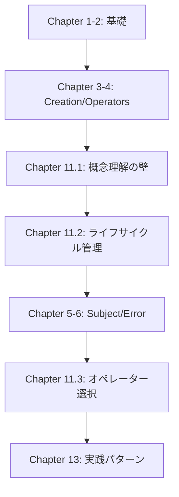
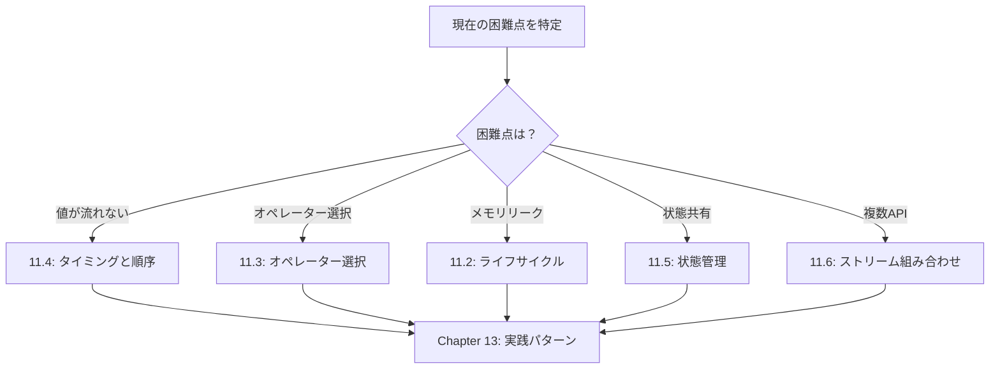
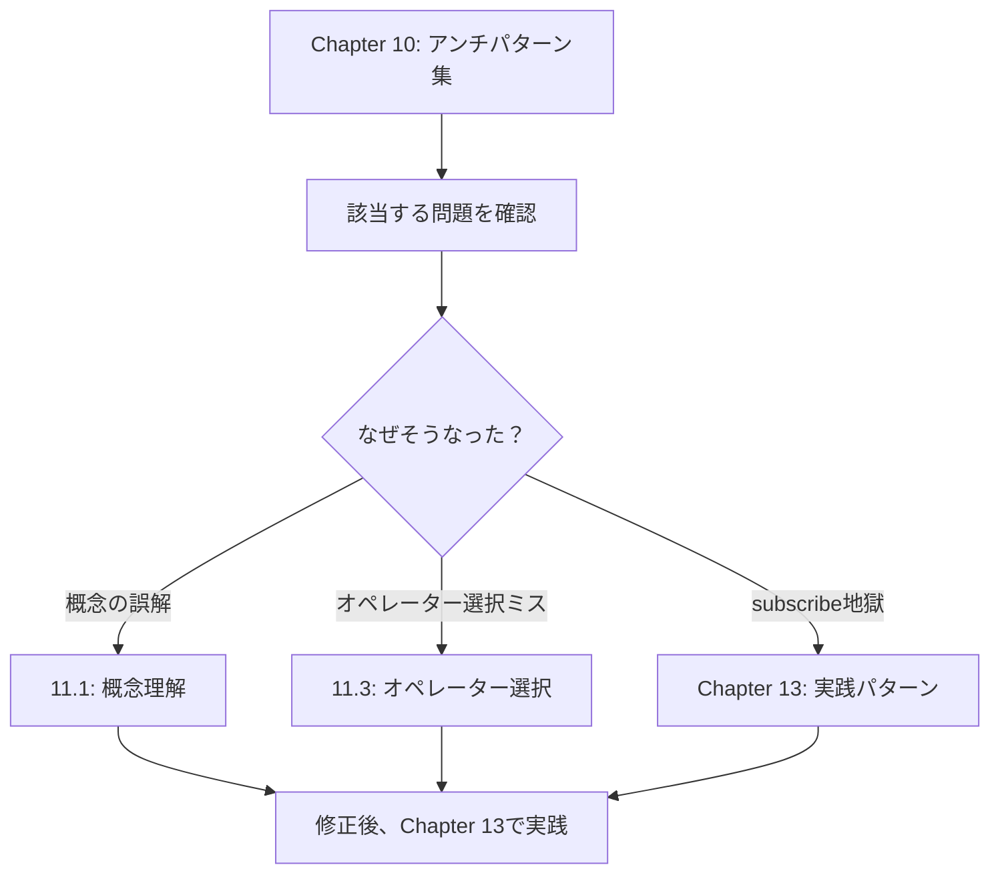

# RxJS困難点克服

TypeScriptと業務経験がある開発者でも、RxJSの実践では多くの困難に直面します。このセクションでは、RxJS特有の難所とその克服方法を体系的に解説します。

## なぜRxJSは難しいのか

RxJSの難しさは、**概念の抽象度の高さ**と**パラダイムシフトの必要性**にあります。

### 既存の知識が通用しない

```typescript
// ❌ Promise的な思考：値を直接取得したい
observable.subscribe(value => {
  const result = value * 2;
  return result; // これは何も返さない
});

// ✅ RxJS的な思考：ストリームを変換する
const doubled$ = observable.pipe(
  map(value => value * 2)
);
```

#### 問題点
- 命令的プログラミング（Promiseのthen/await）の思考が通用しない
- 値ではなく「ストリームの変換」を考える必要がある
- subscribe内で処理を完結させようとすると、アンチパターンに陥る

### 時間軸の概念が追加される

```typescript
// Promise: 1回だけ値が返る
const promise = fetch('/api/data');

// Observable: 時間軸に沿って複数の値が流れる
const clicks$ = fromEvent(button, 'click');
//                     時間軸
// clicks$:  ------click----click--click---------->
```

#### 問題点
- 「いつ値が流れるのか」を常に意識する必要がある
- 同期/非同期の違いが動作に影響する
- Marble Diagramの読解が必須になる

### 100種類以上のオペレーターから選択

#### よくある悩み
- "map, mergeMap, switchMap, concatMap... 違いがわからない"
- "debounceTime と throttleTime、どっちを使えば？"
- "combineLatest と zip、何が違う？"

→ Chapter 11では、**実践的な選択基準**を提供します。

## 主な困難点一覧

このセクションでは、以下の7つの困難点を扱います。

| 困難点 | 内容 | よくある症状 |
|---|---|---|
| **[概念理解の壁](/guide/overcoming-difficulties/conceptual-understanding)** | Observable vs Promise、Cold vs Hot | "Promiseと何が違うの？" |
| **[ライフサイクル管理](/guide/overcoming-difficulties/lifecycle-management)** | subscribe/unsubscribe、メモリリーク | "いつunsubscribeすべき？" |
| **オペレーター選択**（準備中） | 100+のオペレーターから選ぶ基準 | "どのオペレーターを使えば？" |
| **タイミングと順序**（準備中） | いつ値が流れるのか、同期vs非同期 | "なぜ値が出ない？" |
| **状態管理**（準備中） | Subject、share/shareReplay | "状態を共有したい" |
| **複数ストリーム組み合わせ**（準備中） | combineLatest、zip、withLatestFrom | "2つのAPIの結果を合わせたい" |
| **デバッグ**（準備中） | 値が流れない、期待と違う値 | "何が起きているか分からない" |

## 各セクションの使い方

### 1. 自分の困難点を特定する

上記の表から、**現在直面している困難**に該当するセクションを選んでください。

**例：**
- API呼び出しで値が取れない → タイミングと順序（準備中）
- メモリリークが心配 → ライフサイクル管理（準備中）
- mergeMapとswitchMapで迷う → オペレーター選択（準備中）

### 2. 悪い例→良い例で理解する

各セクションは以下の構成になっています。

```
❌ 悪い例（陥りがちなパターン）
↓
✅ 良い例（推奨パターン）
↓
💡 解説（なぜ悪いのか、なぜ良いのか）
↓
🎯 練習問題（理解度チェック）
```

### 3. Starter Kitで実験する

すべてのコード例は、[学習用の実行環境](/guide/starter-kid)で実際に動かせます。

#### 推奨学習フロー
1. 悪い例をコピーして実行 → 問題を体験
2. 良い例をコピーして実行 → 違いを実感
3. 自分のコードに応用 → 定着

## 学習ロードマップ

### 初めてRxJSを学ぶ場合



### 基礎は理解しているが実践で困っている場合



### アンチパターンに陥っている場合



## 関連セクション

このChapterは、以下のセクションと密接に関連しています。

- **[Chapter 10: RxJSアンチパターン集](/guide/anti-patterns/)** - 「何が悪いか」を学ぶ
- **[Chapter 13: 実践パターン集](/guide/)** - 「どう書くべきか」を学ぶ（準備中）
- **[Chapter 8: RxJSのデバッグ手法](/guide/debugging/)** - 「問題を見つける方法」を学ぶ

#### 学習の流れ
1. **Chapter 11（本章）** - RxJSの困難点を理解する
2. **Chapter 10** - 具体的なアンチパターンを知る
3. **Chapter 13** - 正しい実装パターンを習得する

## 理解度チェックリスト

各セクションを読み終えたら、以下を確認してください。

### 概念理解
- [ ] ObservableとPromiseの違いを説明できる
- [ ] ColdとHotの違いを実例で説明できる
- [ ] 宣言的プログラミングのメリットを理解している

### 実践スキル
- [ ] 適切なタイミングでsubscribe/unsubscribeできる
- [ ] 目的に合ったオペレーターを選択できる
- [ ] Marble Diagramを読んで動作を予測できる

### デバッグ
- [ ] tapを使ってストリームをデバッグできる
- [ ] 値が流れない原因を特定できる
- [ ] メモリリークの兆候を見つけられる

## 次のステップ

**まず最初に読むべきページ：**

→ **[概念理解の壁](/guide/overcoming-difficulties/conceptual-understanding)** - RxJSの本質的な考え方を理解する

ここから始めて、自分の困難点に応じて他のセクションに進んでください。
