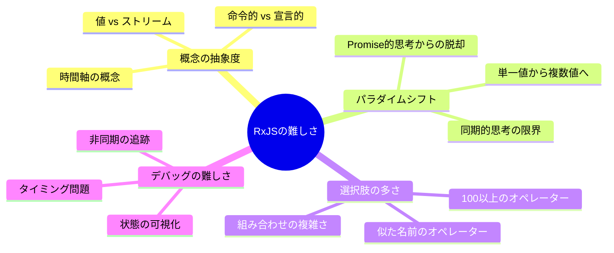
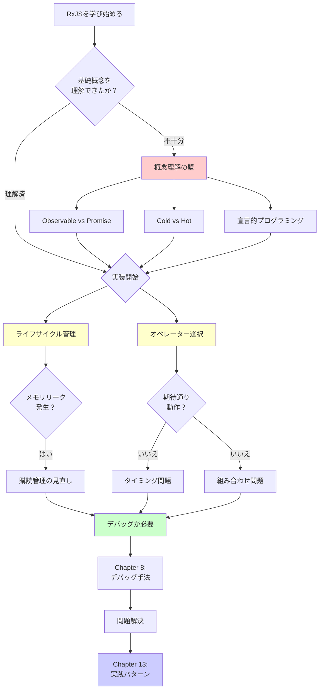
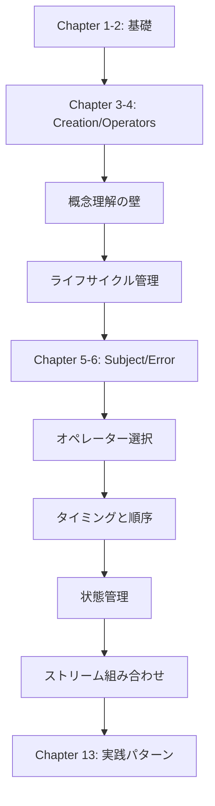
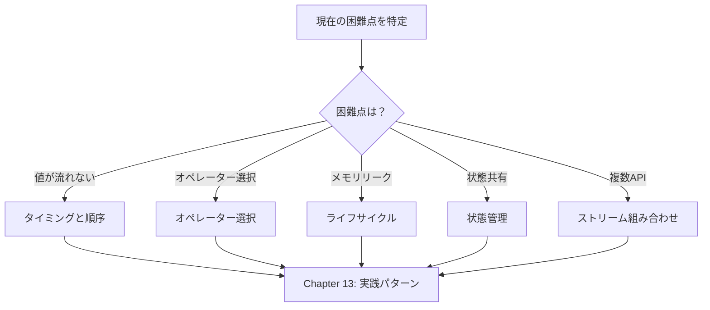
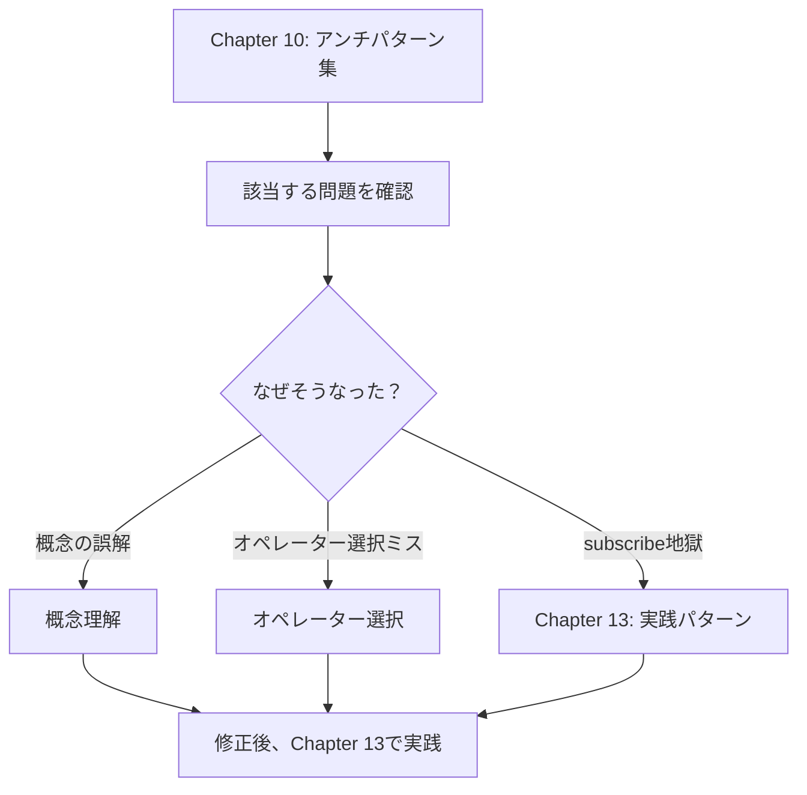

# RxJS困難点克服

TypeScriptと業務経験がある開発者でも、RxJSの実践では多くの困難に直面します。このセクションでは、RxJS特有の難所とその克服方法を体系的に解説します。

## なぜRxJSは難しいのか

RxJSの難しさは、**概念の抽象度の高さ**と**パラダイムシフトの必要性**にあります。経験豊富な開発者でも、これまでの知識や思考パターンが通用しないことに戸惑います。以下で、具体的な困難のポイントを見ていきましょう。

### 既存の知識が通用しない

PromiseやAsync/Awaitに慣れた開発者は、同じ感覚でRxJSを使おうとして混乱します。

```typescript
// ❌ Promise的な思考：値を直接取得したい
observable.subscribe(value => {
  const result = value * 2;
  return result; // これは何も返さない
});

// ✅ RxJS的な思考：ストリームを変換する
const doubled$ = observable.pipe(
  map(value => value * 2)
);
```

> [!IMPORTANT] 問題点
> - 命令的プログラミング（Promiseのthen/await）の思考が通用しない
> - 値ではなく「ストリームの変換」を考える必要がある
> - subscribe内で処理を完結させようとすると、アンチパターンに陥る

### 時間軸の概念が追加される

RxJSの最も大きな特徴は、「時間軸」という概念です。Promiseは1回だけ値を返しますが、Observableは時間の経過とともに複数の値を流すことができます。

```typescript
// Promise: 1回だけ値が返る
const promise = fetch('/api/data');

// Observable: 時間軸に沿って複数の値が流れる
const clicks$ = fromEvent(button, 'click');
//                     時間軸
// clicks$:  ------click----click--click---------->
```

> [!IMPORTANT] 問題点
> - 「いつ値が流れるのか」を常に意識する必要がある
> - 同期/非同期の違いが動作に影響する
> - Marble Diagramの読解が必須になる

### 100種類以上のオペレーターから選択

RxJSには100種類以上のオペレーターがあり、初学者はその選択に迷います。似たような名前のオペレーターが多く、どれを使うべきか判断が難しいのです。

> [!IMPORTANT] よくある悩み
> - "map, mergeMap, switchMap, concatMap... 違いがわからない"
> - "debounceTime と throttleTime、どっちを使えば？"
> - "combineLatest と zip、何が違う？"

→ Chapter 11では、**実践的な選択基準**を提供します。

### RxJSの難しさの全体像

以下の図は、RxJSの難しさがどのような要素から構成されているかを示しています。



## 主な困難点一覧

RxJSの学習・実践で遭遇する主要な困難を7つに分類しました。各困難点には専用のページがあり、具体的な解決方法を詳しく解説しています。まず、以下の表で自分が直面している困難を特定してください。

| 困難点 | 内容 | よくある症状 |
|---|---|---|
| **[概念理解の壁](/guide/overcoming-difficulties/conceptual-understanding)** | Observable vs Promise、Cold vs Hot | "Promiseと何が違うの？" |
| **[ライフサイクル管理](/guide/overcoming-difficulties/lifecycle-management)** | subscribe/unsubscribe、メモリリーク | "いつunsubscribeすべき？" |
| **[オペレーター選択](/guide/overcoming-difficulties/operator-selection)** | 100+のオペレーターから選ぶ基準 | "どのオペレーターを使えば？" |
| **[タイミングと順序](/guide/overcoming-difficulties/timing-and-order)** | いつ値が流れるのか、同期vs非同期 | "なぜ値が出ない？" |
| **[状態管理](/guide/overcoming-difficulties/state-and-sharing)** | Subject、share/shareReplay | "状態を共有したい" |
| **[複数ストリーム組み合わせ](/guide/overcoming-difficulties/stream-combination)** | combineLatest、zip、withLatestFrom | "2つのAPIの結果を合わせたい" |
| **[デバッグ](/guide/overcoming-difficulties/debugging-guide)** | 値が流れない、期待と違う値 | "何が起きているか分からない" |

### 困難点の関係性

RxJSの困難は独立しているのではなく、相互に関連しています。以下のフローチャートは、学習過程でどのような順序で困難に遭遇し、それらがどう連鎖するかを示しています。自分が現在どの段階にいるかを確認してください。



## 各セクションの使い方

このChapterの記事は、それぞれ独立して読むことができます。困っている内容に応じて、必要なセクションから読み始めてください。以下で、効果的な使い方を説明します。

### 1. 自分の困難点を特定する

上記の表から、**現在直面している困難**に該当するセクションを選んでください。困難の症状から逆引きすることもできます。

#### 例
- API呼び出しで値が取れない → [タイミングと順序](/guide/overcoming-difficulties/timing-and-order)
- メモリリークが心配 → [ライフサイクル管理](/guide/overcoming-difficulties/lifecycle-management)
- mergeMapとswitchMapで迷う → [オペレーター選択](/guide/overcoming-difficulties/operator-selection)
- 状態を複数のコンポーネントで共有したい → [状態管理](/guide/overcoming-difficulties/state-and-sharing)
- 2つのAPIの結果を組み合わせたい → [複数ストリーム組み合わせ](/guide/overcoming-difficulties/stream-combination)
- デバッグ方法が分からない → [デバッグ](/guide/overcoming-difficulties/debugging-guide)

### 2. 悪い例→良い例で理解する

各セクションは以下の構成になっています。

```
❌ 悪い例（陥りがちなパターン）
↓
✅ 良い例（推奨パターン）
↓
💡 解説（なぜ悪いのか、なぜ良いのか）
↓
🎯 練習問題（理解度チェック）
```

### 3. Starter Kitで実験する

すべてのコード例は、[学習用の実行環境](/guide/starter-kid)で実際に動かせます。

#### 推奨学習フロー
1. 悪い例をコピーして実行 → 問題を体験
2. 良い例をコピーして実行 → 違いを実感
3. 自分のコードに応用 → 定着

## 学習ロードマップ

学習の進め方は、現在のスキルレベルと目的によって異なります。以下の3つのパターンから、自分に合ったロードマップを選んでください。

### 初めてRxJSを学ぶ場合

基礎から順番に学習し、各章で遭遇する困難を克服していく体系的なアプローチです。



### 基礎は理解しているが実践で困っている場合

基本的な知識はあるものの、実際のプロジェクトで問題に直面している場合は、困難点から直接アプローチする方が効率的です。



### アンチパターンに陥っている場合

すでにRxJSコードを書いているが、アンチパターンに陥っている疑いがある場合は、まずChapter 10で問題を特定し、その原因となった困難点を理解することから始めます。



## 関連セクション

Chapter 11（RxJS困難点克服）は、他のChapterと連携して学習効果を高めます。特に以下の3つのChapterとは密接に関連しており、併せて読むことで理解が深まります。

- **[Chapter 10: RxJSアンチパターン集](/guide/anti-patterns/)** - 「何が悪いか」を学ぶ
- **[Chapter 13: 実践パターン集](/guide/)** - 「どう書くべきか」を学ぶ（準備中）
- **[Chapter 8: RxJSのデバッグ手法](/guide/debugging/)** - 「問題を見つける方法」を学ぶ

#### 学習の流れ
1. **Chapter 11（本章）** - RxJSの困難点を理解する
2. **Chapter 10** - 具体的なアンチパターンを知る
3. **Chapter 13** - 正しい実装パターンを習得する

## 理解度チェックリスト

各セクションの学習後、自分の理解度を確認するためのチェックリストです。すべてにチェックが付けば、そのセクションの内容を実践で活用できるレベルに達しています。

```markdown
## 概念理解
- [ ] ObservableとPromiseの違いを説明できる
- [ ] ColdとHotの違いを実例で説明できる
- [ ] 宣言的プログラミングのメリットを理解している

## 実践スキル
- [ ] 適切なタイミングでsubscribe/unsubscribeできる
- [ ] 目的に合ったオペレーターを選択できる
- [ ] Marble Diagramを読んで動作を予測できる

## デバッグ
- [ ] tapを使ってストリームをデバッグできる
- [ ] 値が流れない原因を特定できる
- [ ] メモリリークの兆候を見つけられる
```

## 次のステップ

このページでRxJSの困難点の全体像を把握したら、具体的な学習に進みましょう。

**まず最初に読むべきページ：**

→ **[概念理解の壁](/guide/overcoming-difficulties/conceptual-understanding)** - RxJSの本質的な考え方を理解する

このページは、すべての困難の根底にある「概念理解」に焦点を当てています。ここから始めることで、他の困難点もスムーズに理解できるようになります。概念を理解した後は、自分が直面している具体的な困難点のページに進んでください。
