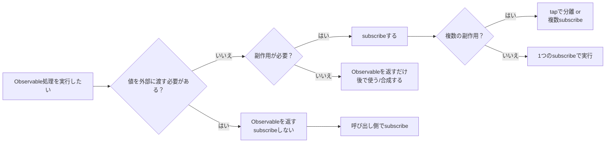
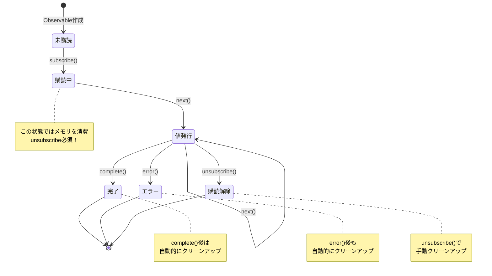
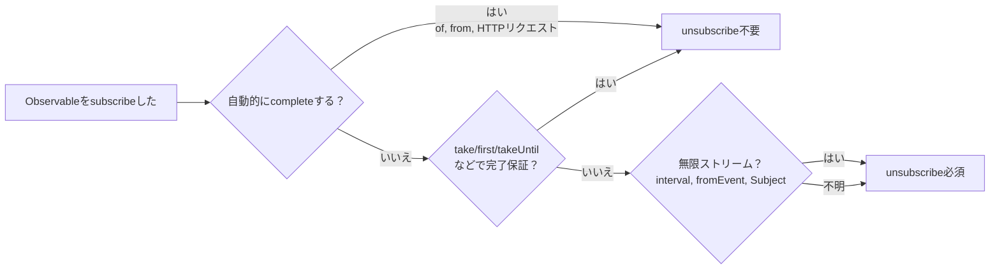

# ライフサイクル管理の壁

RxJSの最大の落とし穴の1つが**ライフサイクル管理**です。「いつsubscribeすべきか」「いつunsubscribeすべきか」を間違えると、メモリリークやバグの原因になります。

## いつ subscribe すべきか

### 基本原則：最後の最後まで subscribe しない

#### ❌ 悪い例：途中でsubscribeしてしまう
```typescript
import { interval } from 'rxjs';

function getEvenNumbers() {
  const numbers$ = interval(1000);

  // この中でsubscribeしてしまう
  numbers$.subscribe(n => {
    if (n % 2 === 0) {
      console.log(n); // どうやってこれを外部に渡す？
    }
  });
}
```

#### ✅ 良い例：Observableを返し、呼び出し側でsubscribe
```typescript
import { interval } from 'rxjs';
import { filter, take } from 'rxjs';

function getEvenNumbers() {
  return interval(1000).pipe(
    filter(n => n % 2 === 0),
    take(5)
  );
}

// 使用側でsubscribe
const subscription = getEvenNumbers().subscribe(n => {
  console.log(n);
});
```

::: tip 💡 解説
- **悪い例**: 関数内でsubscribeすると、制御権を失う（キャンセルできない、合成できない）
- **良い例**: Observableを返すことで、呼び出し側が制御できる
:::

### subscribe は「副作用」のトリガー

#### ❌ 悪い例：subscribeの中で複数の副作用を実行
```typescript
import { fromEvent } from 'rxjs';
import { map } from 'rxjs';

const button = document.querySelector('button')!;

fromEvent(button, 'click')
  .pipe(map(() => Math.random()))
  .subscribe(randomValue => {
    // 副作用1: DOM操作
    document.querySelector('#result')!.textContent = randomValue.toString();

    // 副作用2: API呼び出し
    fetch('/api/log', {
      method: 'POST',
      body: JSON.stringify({ value: randomValue })
    });

    // 副作用3: ローカルストレージ
    localStorage.setItem('lastValue', randomValue.toString());
  });
```

#### ✅ 良い例：副作用を分離し、必要なものだけsubscribe
```typescript
import { fromEvent } from 'rxjs';
import { map } from 'rxjs';

const button = document.querySelector('button')!;

const randomClicks$ = fromEvent(button, 'click').pipe(
  map(() => Math.random())
);

// DOM更新だけが必要な場合
randomClicks$.subscribe(value => {
  document.querySelector('#result')!.textContent = value.toString();
});

// ログだけが必要な場合
randomClicks$.subscribe(value => {
  fetch('/api/log', {
    method: 'POST',
    body: JSON.stringify({ value })
  });
});
```

::: tip 💡 解説
- **subscribe = 副作用の実行ポイント**
- **副作用が独立している場合**: 複数のsubscribeに分離（個別に制御可能）
- **副作用が常にセットで実行される場合**: 1つのsubscribeでまとめてOK
- **パイプライン内で副作用が必要な場合**: `tap`オペレーターを使用
:::

### いつ subscribe すべきか：判断フローチャート



### 購読のライフサイクル全体像

以下の状態遷移図は、Observableの購読がどのような状態を経て終了するかを示しています。



> [!IMPORTANT] ライフサイクル管理のポイント
> - **購読中**: メモリリークの危険性がある状態
> - **complete/error**: 自動的にクリーンアップされる（unsubscribe不要）
> - **unsubscribe**: 手動でクリーンアップが必要（特に無限ストリーム）

## いつ unsubscribe すべきか

### 基本原則：購読したら必ず解除する

#### ❌ 悪い例：unsubscribeしない → メモリリーク
```typescript
import { interval } from 'rxjs';

const button = document.querySelector('button')!;

function startTimer() {
  interval(1000).subscribe(n => {
    console.log(n);
  });
  // この購読は永遠に続く！
}

// ボタンクリックごとに新しい購読が追加される
button.addEventListener('click', startTimer);
// クリック10回 = 10個の購読が同時に動作！
```

#### ✅ 良い例：unsubscribeで解除
```typescript
import { interval } from 'rxjs';

function startTimer() {
  const subscription = interval(1000).subscribe(n => {
    console.log(n);
  });

  // 5秒後に解除
  setTimeout(() => {
    subscription.unsubscribe();
    console.log('購読を解除しました');
  }, 5000);
}
```

::: tip 💡 解説
- **無限ストリーム**（interval, fromEventなど）は必ずunsubscribeが必要
- unsubscribeしないと、メモリリーク + 不要な処理が継続する
:::

### unsubscribe が不要なケース


#### ✅ 自動的にcompleteするObservable

```typescript
of(1, 2, 3).subscribe(n => console.log(n));
// complete後は自動的にクリーンアップされる

from([1, 2, 3]).subscribe(n => console.log(n));
// complete後は自動的にクリーンアップされる
```

#### ✅ take などで完了が保証される
```typescript
interval(1000).pipe(
  take(5) // 5回で自動的にcomplete
).subscribe(n => console.log(n));
```

#### ✅ エラーで終了
```typescript
throwError(() => new Error('Error')).subscribe({
  error: err => console.error(err)
});
```

#### ✅ EMPTY（即座にcomplete）
```typescript
EMPTY.subscribe(() => console.log('実行されない'));
```

> [!TIP] 💡 解説
> 以下の場合はunsubscribeが不要
> 1. **complete()が呼ばれるObservable** - 自動的にクリーンアップされる
> 2. **error()が呼ばれた場合** - 同様に自動クリーンアップ
> 3. **take(n)などで完了が保証される** - 明示的にcompleteされる
> > [!IMPORTANT] 重要
> > 無限ストリーム（interval, fromEvent, Subjectなど）は必ずunsubscribeが必要！

### unsubscribe が必要かの判断フローチャート



**迷ったら unsubscribe する**のが安全！

## メモリリークを防ぐパターン

### パターン1: Subscriptionオブジェクトで管理

```typescript
import { interval, fromEvent } from 'rxjs';
import { Subscription } from 'rxjs';

class MyComponent {
  private subscription = new Subscription();

  ngOnInit() {
    // 複数の購読を1つのSubscriptionに追加
    this.subscription.add(
      interval(1000).subscribe(n => console.log('Timer:', n))
    );

    this.subscription.add(
      fromEvent(document, 'click').subscribe(() => console.log('Click!'))
    );

    this.subscription.add(
      fromEvent(window, 'resize').subscribe(() => console.log('Resize!'))
    );
  }

  ngOnDestroy() {
    // 一括で全ての購読を解除
    this.subscription.unsubscribe();
  }
}
```

#### 💡 メリット

- 複数の購読を1つのオブジェクトで管理
- `ngOnDestroy`で一括解除
- 追加・削除が簡単

### パターン2: 配列で管理

```typescript
import { interval, fromEvent } from 'rxjs';
import { Subscription } from 'rxjs';

class MyComponent {
  private subscriptions: Subscription[] = [];

  ngOnInit() {
    this.subscriptions.push(
      interval(1000).subscribe(n => console.log('Timer:', n))
    );

    this.subscriptions.push(
      fromEvent(document, 'click').subscribe(() => console.log('Click!'))
    );
  }

  ngOnDestroy() {
    this.subscriptions.forEach(sub => sub.unsubscribe());
    this.subscriptions = [];
  }
}
```

#### 💡 メリット

- 配列操作で柔軟に管理
- 個別に解除も可能
- デバッグしやすい（配列をconsole.logで確認）

### パターン3: takeUntil パターン（推奨）

```typescript
import { interval, fromEvent, Subject } from 'rxjs';
import { takeUntil } from 'rxjs';

class MyComponent {
  private destroy$ = new Subject<void>();

  ngOnInit() {
    // 全ての購読にtakeUntil(this.destroy$)を追加
    interval(1000).pipe(
      takeUntil(this.destroy$)
    ).subscribe(n => console.log('Timer:', n));

    fromEvent(document, 'click').pipe(
      takeUntil(this.destroy$)
    ).subscribe(() => console.log('Click!'));

    fromEvent(window, 'resize').pipe(
      takeUntil(this.destroy$)
    ).subscribe(() => console.log('Resize!'));
  }

  ngOnDestroy() {
    // 1回のnext()で全ての購読を解除
    this.destroy$.next();
    this.destroy$.complete();
  }
}
```

#### 💡 メリット

- **最も宣言的** - パイプラインで完了条件を明示
- **Subscriptionオブジェクトが不要** - メモリ効率が良い
- **読みやすい** - コードを見れば「destroy$でcompleteする」と分かる

## takeUntil パターンの完全ガイド

### 基本パターン

```typescript
import { interval, Subject } from 'rxjs';
import { takeUntil } from 'rxjs';

const destroy$ = new Subject<void>();

// この購読は destroy$ が next() するまで続く
interval(1000).pipe(
  takeUntil(destroy$)
).subscribe(n => console.log(n));

// 5秒後に全ての購読を停止
setTimeout(() => {
  destroy$.next();
  destroy$.complete();
}, 5000);
```

#### Marble Diagram

```
interval(1000):  --0--1--2--3--4--5--6--7-->
destroy$:        ----------X
                          ↑
                       next()呼び出し

takeUntil結果:   --0--1--2|
                          ↑
                       complete
```

### 複数のObservableに適用

```typescript
import { interval, fromEvent, timer, Subject } from 'rxjs';
import { takeUntil, map } from 'rxjs';

const destroy$ = new Subject<void>();

// パターン: 全てのストリームに同じ destroy$ を使う
interval(1000).pipe(
  takeUntil(destroy$),
  map(n => `Timer: ${n}`)
).subscribe(console.log);

fromEvent(document, 'click').pipe(
  takeUntil(destroy$),
  map(() => 'Click!')
).subscribe(console.log);

timer(2000).pipe(
  takeUntil(destroy$),
  map(() => 'Timer finished')
).subscribe(console.log);

// 一括停止
function cleanup() {
  destroy$.next();
  destroy$.complete();
}

// 例: ページ遷移時に cleanup() を呼ぶ
window.addEventListener('beforeunload', cleanup);
```

## takeUntilパターンのよくあるミス

### ミス1: takeUntilの位置が間違っている

#### ❌ 悪い例takeUntilの前にmap
```typescript
import { interval, Subject } from 'rxjs';
import { map, takeUntil } from 'rxjs';

const destroy$ = new Subject<void>();

interval(1000).pipe(
  takeUntil(destroy$),  // ここで完了しても...
  map(n => n * 2)       // mapは実行される可能性がある
).subscribe(console.log);
```

#### ✅ 良い例：takeUntilは最後に配置
```typescript
import { interval, Subject } from 'rxjs';
import { map, takeUntil } from 'rxjs';

const destroy$ = new Subject<void>();

interval(1000).pipe(
  map(n => n * 2),
  takeUntil(destroy$)  // 全てのオペレーターの後
).subscribe(console.log);
```

> [!TIP]💡 解説
> - **takeUntilは可能な限り最後**に配置する
> - 例外: shareReplay など、マルチキャスト系オペレーターの前に配置することもある

### ミス2: destroy$ を complete しない

#### ❌ 悪い例complete() を呼んでいない
```typescript
import { Subject } from 'rxjs';

const destroy$ = new Subject<void>();

function cleanup() {
  destroy$.next();
  // ❌ complete() を呼んでいない
}

// 問題: destroy$ 自体がメモリリークの原因になる
```

#### ✅ 良い例：next() と complete() の両方を呼ぶ
```typescript
import { Subject } from 'rxjs';

const destroy$ = new Subject<void>();

function cleanup() {
  destroy$.next();
  destroy$.complete();
}
```

> [!TIP]💡 解説
> - `next()`だけだと、destroy$ 自体が購読されたまま残る
> - **必ず `complete()` も呼ぶ**

### ミス3: 再利用しようとする

#### ❌ 悪い例complete済みのSubjectを再利用
```typescript
import { interval, Subject } from 'rxjs';
import { takeUntil } from 'rxjs';

const destroy$ = new Subject<void>();

function start() {
  interval(1000).pipe(
    takeUntil(destroy$)
  ).subscribe(console.log);
}

function stop() {
  destroy$.next();
  destroy$.complete();
}

start();
setTimeout(stop, 3000);

// ❌ 問題: destroy$ は complete 済みなので、再度 start() しても即座に終了
setTimeout(start, 5000); // これは動かない
```

#### ✅ 良い例：destroy$ を再生成
```typescript
import { interval, Subject } from 'rxjs';
import { takeUntil } from 'rxjs';

class MyComponent {
  private destroy$ = new Subject<void>();

  start() {
    // 既に complete していたら再生成
    if (this.destroy$.closed) {
      this.destroy$ = new Subject<void>();
    }

    interval(1000).pipe(
      takeUntil(this.destroy$)
    ).subscribe(console.log);
  }

  stop() {
    this.destroy$.next();
    this.destroy$.complete();
  }
}
```

> [!TIP] 💡 解説
> - **Subjectは一度completeすると再利用不可**
> - 再開が必要なら、新しいSubjectを作成する

## Subscription管理のベストプラクティス

### ベストプラクティス1: コンポーネント/クラス単位で destroy$ を持つ

```typescript
import { Subject } from 'rxjs';
import { takeUntil } from 'rxjs';

class UserProfileComponent {
  private destroy$ = new Subject<void>();

  constructor(private userService: UserService) {}

  ngOnInit() {
    this.userService.getUser().pipe(
      takeUntil(this.destroy$)
    ).subscribe(user => {
      console.log(user);
    });

    this.userService.getUserPosts().pipe(
      takeUntil(this.destroy$)
    ).subscribe(posts => {
      console.log(posts);
    });
  }

  ngOnDestroy() {
    this.destroy$.next();
    this.destroy$.complete();
  }
}
```

#### 💡 メリット

- **一貫性** - 全てのコンポーネントで同じパターン
- **保守性** - 新しい購読を追加しても、ngOnDestroyの変更が不要
- **安全性** - unsubscribe漏れがない

### ベストプラクティス2: AsyncPipe を活用（Angularの場合）

```typescript
import { Component } from '@angular/core';
import { Observable } from 'rxjs';

@Component({
  selector: 'app-user-profile',
  template: `
    <!-- AsyncPipeが自動的にsubscribe/unsubscribeする -->
    <div *ngIf="user$ | async as user">
      <h1>{{ user.name }}</h1>
      <p>{{ user.email }}</p>
    </div>

    <ul>
      <li *ngFor="let post of posts$ | async">
        {{ post.title }}
      </li>
    </ul>
  `
})
export class UserProfileComponent {
  user$: Observable<User>;
  posts$: Observable<Post[]>;

  constructor(private userService: UserService) {
    // Observableを直接テンプレートに渡す
    this.user$ = this.userService.getUser();
    this.posts$ = this.userService.getUserPosts();

    // ngOnDestroy不要！AsyncPipeが自動的に解除
  }
}
```

#### 💡 メリット

- **自動的にunsubscribe** - コンポーネント破棄時に自動解除
- **OnPush対応** - 変更検知が最適化される
- **コードが簡潔** - subscribe/unsubscribeのボイラープレートが不要

### ベストプラクティス3: 長命 vs 短命で戦略を変える

```typescript
import { Injectable } from '@angular/core';
import { BehaviorSubject, interval, fromEvent } from 'rxjs';
import { takeUntil } from 'rxjs';

@Injectable({ providedIn: 'root' })
export class DataService {
  // ✅ サービス全体で共有する状態（長命）
  // → アプリケーション終了まで購読を維持
  private userState$ = new BehaviorSubject<User | null>(null);

  getUser() {
    return this.userState$.asObservable();
  }

  // ❌ コンポーネントで直接 subscribe しない
  // ✅ AsyncPipe または takeUntil で購読
}

class MyComponent {
  private destroy$ = new Subject<void>();

  ngOnInit() {
    // ✅ コンポーネントのライフサイクルに紐付く購読（短命）
    // → ngOnDestroy で必ず解除
    interval(1000).pipe(
      takeUntil(this.destroy$)
    ).subscribe(n => console.log(n));

    fromEvent(window, 'resize').pipe(
      takeUntil(this.destroy$)
    ).subscribe(() => console.log('Resize'));
  }

  ngOnDestroy() {
    this.destroy$.next();
    this.destroy$.complete();
  }
}
```

> [!IMPORTANT] 💡 原則
> | 購読の種類 | ライフサイクル | 管理方法 |
> |---|---|---|
> | **グローバル状態** | アプリケーション全体 | BehaviorSubject + AsyncPipe |
> | **ページ/ルート固有** | ルートが有効な間 | takeUntil(routeDestroy$) |
> | **コンポーネント固有** | コンポーネントが存在する間 | takeUntil(destroy$) or AsyncPipe |
> | **1回きりのAPI呼び出し** | 完了まで | take(1) or first() |

### ベストプラクティス4: 明示的な完了条件を設定

#### ❌ 悪い例：いつ終わるか不明
```typescript
import { fromEvent } from 'rxjs';

fromEvent(document, 'click').subscribe(() => {
  console.log('Click');
});
```

#### ✅ 良い例1: 回数制限
```typescript
import { fromEvent } from 'rxjs';
import { take } from 'rxjs';

fromEvent(document, 'click').pipe(
  take(5) // 5回で自動終了
).subscribe(() => {
  console.log('Click (最大5回)');
});
```

#### ✅ 良い例2: 時間制限
```typescript
import { fromEvent, timer } from 'rxjs';
import { takeUntil } from 'rxjs';

const timeout$ = timer(10000); // 10秒後
fromEvent(document, 'click').pipe(
  takeUntil(timeout$)
).subscribe(() => {
  console.log('Click (10秒以内)');
});
```

#### ✅ 良い例3: 複数の終了条件
```typescript
import { fromEvent, Subject, merge } from 'rxjs';
import { takeUntil, take } from 'rxjs';

const destroy$ = new Subject<void>();
const maxClicks$ = fromEvent(document, 'click').pipe(take(10));

fromEvent(document, 'mousemove').pipe(
  takeUntil(merge(destroy$, maxClicks$)) // いずれかで終了
).subscribe(() => {
  console.log('Mouse move');
});
```

> [!IMPORTANT] 💡 原則
> - **「いつ終わるか」を明示する** - 無限ストリームを避ける
> - take, first, takeWhile, takeUntil などで完了条件を設定
> - ライフサイクルに紐付ける（destroy$, timeout$, etc.）

## 理解度チェックリスト

以下の質問に答えられるか確認してください。

```markdown
## 基本理解
- [ ] Observableをsubscribeすると何が起きるか説明できる
- [ ] unsubscribeが必要なケースと不要なケースを区別できる
- [ ] メモリリークが発生する原因を説明できる

## パターン適用
- [ ] Subscriptionオブジェクトで複数の購読を管理できる
- [ ] takeUntilパターンを実装できる
- [ ] destroy$ を適切に配置できる（最後のオペレーター）

## ベストプラクティス
- [ ] AsyncPipeを使うべきタイミングが分かる
- [ ] 長命と短命の購読を区別して管理できる
- [ ] 明示的な完了条件を設定できる

## デバッグ
- [ ] メモリリークを検出する方法を知っている
- [ ] unsubscribe漏れを見つけられる
- [ ] ブラウザDevToolsで購読数を確認できる
```

## 次のステップ

ライフサイクル管理を理解したら、次は**オペレーター選択**を学びましょう。

→ **[オペレーター選択の迷い](/guide/overcoming-difficulties/operator-selection)** - 100以上のオペレーターから適切なものを選ぶ基準

## 関連ページ

- **[Chapter 2: Observableのライフサイクル](/guide/observables/observable-lifecycle)** - subscribe/unsubscribeの基礎
- **[Chapter 10: よくある間違いと対処法](/guide/anti-patterns/common-mistakes)** - ネストされたsubscribe、メモリリークなど
- **[Chapter 13: フォーム処理パターン](/guide/)** - 実践での活用（準備中）
- **[Chapter 8: メモリリークのデバッグ](/guide/debugging/)** - デバッグ方法

## 🎯 練習問題

### 問題1: メモリリークを修正

以下のコードにはメモリリークがあります。修正してください。

```typescript
class ChatComponent {
  ngOnInit() {
    interval(5000).subscribe(() => {
      this.chatService.checkNewMessages().subscribe(messages => {
        console.log('New messages:', messages);
      });
    });
  }
}
```

<details>
<summary>解答例</summary>

```typescript
class ChatComponent {
  private destroy$ = new Subject<void>();

  ngOnInit() {
    interval(5000).pipe(
      takeUntil(this.destroy$),
      switchMap(() => this.chatService.checkNewMessages())
    ).subscribe(messages => {
      console.log('New messages:', messages);
    });
  }

  ngOnDestroy() {
    this.destroy$.next();
    this.destroy$.complete();
  }
}
```

> [!NOTE] 修正点
> 1. `destroy$` Subjectを追加
> 2. `takeUntil(this.destroy$)` でintervalを停止
> 3. ネストされたsubscribeを `switchMap` で解消
> 4. `ngOnDestroy` で cleanup

</details>

### 問題2: 適切なパターン選択

以下のシナリオで、最適な購読管理パターンを選んでください。

1. HTTPリクエスト（1回だけ）
2. WebSocket接続（コンポーネントの存在中）
3. グローバルなユーザー状態（アプリケーション全体）

<details>
<summary>解答例</summary>

**1. HTTPリクエスト（1回だけ）**
```typescript
// ✅ take(1) または first() - 1回で自動complete
this.http.get('/api/user').pipe(
  take(1)
).subscribe(user => console.log(user));

// または AsyncPipe（Angularの場合）
user$ = this.http.get('/api/user');
```

**2. WebSocket接続（コンポーネントの存在中）**
```typescript
// ✅ takeUntil パターン - コンポーネント破棄時に切断
private destroy$ = new Subject<void>();

ngOnInit() {
  this.websocket.connect().pipe(
    takeUntil(this.destroy$)
  ).subscribe(message => console.log(message));
}

ngOnDestroy() {
  this.destroy$.next();
  this.destroy$.complete();
}
```

**3. グローバルなユーザー状態（アプリケーション全体）**
```typescript
// ✅ BehaviorSubject + AsyncPipe - unsubscribe不要
@Injectable({ providedIn: 'root' })
class AuthService {
  private userState$ = new BehaviorSubject<User | null>(null);

  getUser() {
    return this.userState$.asObservable();
  }
}

// コンポーネントで使用
user$ = this.authService.getUser(); // AsyncPipeで購読
```

</details>
