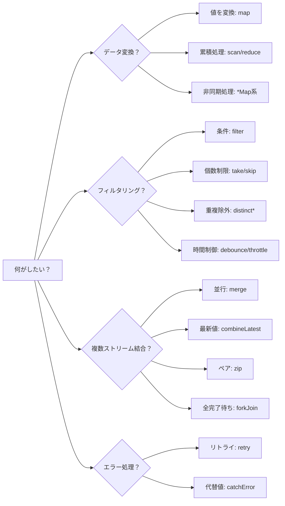
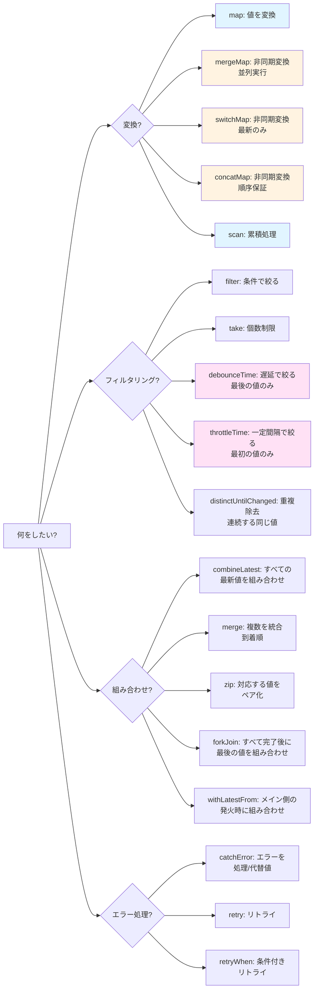
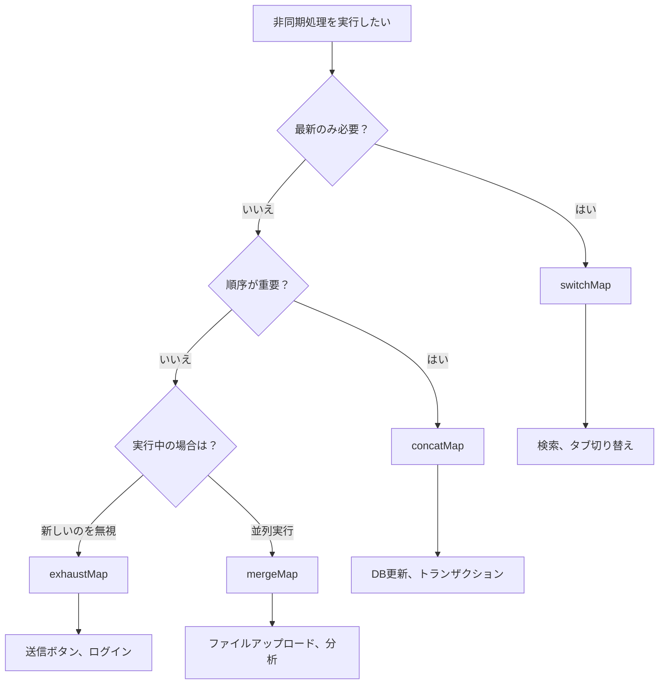

<style scoped>
.comparison-cards {
  display: grid;
  grid-template-columns: 1fr 1fr;
  gap: 1rem;
  margin-bottom: 2rem;
}

@media (max-width: 768px) {
  .comparison-cards {
    grid-template-columns: 1fr;
  }
}

/* タイトル部分のフォントサイズを大きく */
.comparison-cards .tip .custom-block-title {
  font-size: 1.1rem;
  font-weight: 600;
}
</style>

# オペレーター選択の迷い

RxJSには100種類以上のオペレーターがあり、**どれを使えば良いか迷う**ことは誰もが経験する困難です。このページでは、実践的な選択基準とフローチャートを提供します。

## 100以上のオペレーターから選ぶ基準

### 問題：選択肢が多すぎる

```typescript
// 配列を変換したい... map? scan? reduce? toArray?
// 複数のAPIを呼びたい... mergeMap? switchMap? concatMap? exhaustMap?
// 値をフィルタしたい... filter? take? first? distinctUntilChanged?
// 複数のストリームを結合したい... merge? combineLatest? zip? forkJoin?
```

### 解決策：カテゴリ + 目的で絞り込む



### より詳細な選択フローチャート

以下のフローチャートは、具体的な目的に応じてオペレーターを選ぶ手順を示しています。



## 1. 変換オペレーター（Transformation）

**いつ使う？** データの形を変えたい、非同期処理を呼びたい

| オペレーター | 用途 | よくあるユースケース |
|---|---|---|
| **map** | 値を1:1で変換 | プロパティ取得、計算、型変換 |
| **scan** | 累積処理（中間値を流す） | カウンター、合計、履歴 |
| **reduce** | 累積処理（最終値のみ） | 配列の合計、最大値 |
| **mergeMap** | 非同期処理を並列実行 | 複数API並列呼び出し |
| **switchMap** | 非同期処理を切り替え | 検索API（最新のみ） |
| **concatMap** | 非同期処理を順次実行 | 順序が重要な処理 |
| **exhaustMap** | 実行中は新しい処理を無視 | 連打防止（送信ボタン） |

### 実践例：ユースケース別の選択

#### ユースケース1: プロパティを取得
```typescript
import { of } from 'rxjs';
import { map } from 'rxjs';

interface User { id: number; name: string; }

of({ id: 1, name: 'Alice' }).pipe(
  map(user => user.name) // 値を1:1で変換 → map
).subscribe(name => console.log(name)); // 'Alice'
```

#### ユースケース2: カウンター
```typescript
import { fromEvent } from 'rxjs';
import { scan } from 'rxjs';

const button = document.querySelector('button')!;

fromEvent(button, 'click').pipe(
  scan(count => count + 1, 0) // 累積処理 → scan
).subscribe(count => console.log(`クリック回数: ${count}`));
```

#### ユースケース3: 検索API呼び出し
```typescript
import { fromEvent } from 'rxjs';
import { debounceTime, map, switchMap } from 'rxjs';

const searchInput = document.querySelector('input')!;

fromEvent(searchInput, 'input').pipe(
  debounceTime(300),
  map(e => (e.target as HTMLInputElement).value),
  switchMap(query => searchAPI(query)) // 最新のみ → switchMap
).subscribe(results => console.log(results));
```

## 2. フィルタリングオペレーター（Filtering）

### いつ使う？
値を取捨選択したい、タイミングを制御したい

| オペレーター | 用途 | よくあるユースケース |
|---|---|---|
| **filter** | 条件に合う値のみ通す | 偶数のみ、非null値のみ |
| **take** | 最初のN個だけ | 最初の5件取得 |
| **first** | 最初の1つだけ | 初回値の取得 |
| **distinctUntilChanged** | 前回と異なる値のみ | 重複除外 |
| **debounceTime** | 一定時間経過後に発火 | 検索入力（入力完了後） |
| **throttleTime** | 一定間隔で間引く | スクロールイベント |

### 実践例：ユースケース別の選択

#### ユースケース1: 偶数のみ取得
```typescript
import { of } from 'rxjs';
import { filter } from 'rxjs';

of(1, 2, 3, 4, 5).pipe(
  filter(n => n % 2 === 0) // 条件に合う値のみ → filter
).subscribe(console.log); // 2, 4
```

#### ユースケース2: 検索入力の最適化
```typescript
import { fromEvent } from 'rxjs';
import { debounceTime, distinctUntilChanged, map } from 'rxjs';

const input = document.querySelector('input')!;

fromEvent(input, 'input').pipe(
  debounceTime(300),              // 入力完了を待つ → debounceTime
  map(e => (e.target as HTMLInputElement).value),
  distinctUntilChanged()          // 重複除外 → distinctUntilChanged
).subscribe(query => console.log('検索:', query));
```

#### ユースケース3: スクロールイベントの間引き
```typescript
import { fromEvent } from 'rxjs';
import { throttleTime } from 'rxjs';

fromEvent(window, 'scroll').pipe(
  throttleTime(200) // 200msごとに1回のみ → throttleTime
).subscribe(() => console.log('スクロール位置:', window.scrollY));
```

## 3. 結合オペレーター（Combination）

### いつ使う？
複数のストリームを組み合わせたい

| オペレーター | 用途 | よくあるユースケース |
|---|---|---|
| **merge** | 複数のストリームを並行 | 複数のイベント監視 |
| **combineLatest** | 全ての最新値を組み合わせ | フォームバリデーション |
| **zip** | 対応する値をペア化 | 2つのAPIの結果を対応付け |
| **forkJoin** | 全て完了後に結果を配列で | 複数APIの並列実行 |
| **withLatestFrom** | メインストリーム + 補助値 | イベント + 現在の状態 |

### 実践例：ユースケース別の選択

#### ユースケース1: 複数のイベントを監視
```typescript
import { fromEvent, merge } from 'rxjs';

const clicks$ = fromEvent(document, 'click');
const keypresses$ = fromEvent(document, 'keypress');

merge(clicks$, keypresses$).pipe() // 並行監視 → merge
  .subscribe(() => console.log('何かのイベント発生'));
```

#### ユースケース2: フォームバリデーション
```typescript
import { combineLatest } from 'rxjs';
import { map } from 'rxjs';

const email$ = getFormControl('email');
const password$ = getFormControl('password');

combineLatest([email$, password$]).pipe( // 全ての最新値 → combineLatest
  map(([email, password]) => email.length > 0 && password.length > 7)
).subscribe(isValid => console.log('フォーム有効:', isValid));
```

#### ユースケース3: 複数APIの並列実行
```typescript
import { forkJoin } from 'rxjs';

forkJoin({
  user: getUserAPI(),
  posts: getPostsAPI(),
  comments: getCommentsAPI()
}).subscribe(({ user, posts, comments }) => { // 全完了待ち → forkJoin
  console.log('全データ取得完了', { user, posts, comments });
});
```

## よく使うオペレーター20選

以下は実務で**最も頻繁に使用される**オペレーターです。まずはこの20個を習得しましょう。

<div class="comparison-cards">

::: tip 🥇 最頻出（必須）
1. **map** - 値を変換
2. **filter** - 条件でフィルタ
3. **switchMap** - 検索など、最新のみ必要
4. **tap** - デバッグ、副作用
5. **take** - 最初のN個
6. **first** - 最初の1つ
7. **catchError** - エラー処理
8. **takeUntil** - 購読解除
:::

::: tip 🥈 頻出（よく使う）  
9. **mergeMap** - 並列非同期処理
10. **debounceTime** - 入力完了待ち
11. **distinctUntilChanged** - 重複除外
12. **combineLatest** - 複数値の組み合わせ
13. **startWith** - 初期値を設定
14. **scan** - 累積処理
15. **shareReplay** - 結果をキャッシュ
:::

::: tip 🥉 よく使う（知っておくべき）
16. **concatMap** - 順次処理
17. **throttleTime** - イベント間引き
18. **withLatestFrom** - 補助値の取得
19. **forkJoin** - 複数API待ち合わせ
20. **retry** - リトライ処理
:::

</div>


## switchMap vs mergeMap vs concatMap vs exhaustMap

この4つは**最も混同しやすい**オペレーターです。違いを明確に理解しましょう。

### 比較表

| オペレーター | 実行方法 | 前の処理 | 新しい処理 | 使いどころ |
|---|---|---|---|---|
| **switchMap** | 切り替え | **キャンセル** | 即座に開始 | 検索、オートコンプリート |
| **mergeMap** | 並列実行 | 継続 | 即座に開始 | ファイルアップロード、分析 |
| **concatMap** | 順次実行 | 完了を待つ | **待機後**に開始 | 順序が重要な処理 |
| **exhaustMap** | 実行中は無視 | 継続 | **無視** | ボタン連打防止 |

### Marble Diagram での比較

```
外側: ----A----B----C----|

内側: A → --1--2|
      B → --3--4|
      C → --5--6|

switchMap:  ----1--3--5--6|  (Aは2の前にキャンセル、Bは4の前にキャンセル)
mergeMap:   ----1-23-45-6|   (全て並列実行)
concatMap:  ----1--2--3--4--5--6|  (順次実行)
exhaustMap: ----1--2|            (B、Cは無視される)
```

### 実践例：同じ処理での4つの違い

**状況**: ボタンクリックごとにAPI（1秒かかる）を呼ぶ。ユーザーが0.5秒ごとにクリック。

#### switchMap - 検索に最適

```typescript
import { fromEvent } from 'rxjs';
import { switchMap } from 'rxjs';

fromEvent(button, 'click').pipe(
  switchMap(() => searchAPI()) // 最新のみ実行、古いリクエストはキャンセル
).subscribe(result => console.log(result));

// 0.0秒: クリック1 → API1開始
// 0.5秒: クリック2 → API1キャンセル、API2開始
// 1.0秒: クリック3 → API2キャンセル、API3開始
// 2.0秒: API3完了 → 結果表示（API3のみ）
```

::: tip 💡 使いどころ
- **検索・オートコンプリート**: 最新の入力値だけが必要
- **タブ切り替え**: 表示中のタブのデータだけ必要
- **ページネーション**: 最新のページだけ表示
:::

#### mergeMap - 並列処理に最適

```typescript
import { fromEvent } from 'rxjs';
import { mergeMap } from 'rxjs';

fromEvent(button, 'click').pipe(
  mergeMap(() => uploadFileAPI()) // 全て並列実行
).subscribe(result => console.log(result));

// 0.0秒: クリック1 → API1開始
// 0.5秒: クリック2 → API2開始（API1継続）
// 1.0秒: クリック3 → API3開始（API1, API2継続）
// 1.0秒: API1完了 → 結果表示
// 1.5秒: API2完了 → 結果表示
// 2.0秒: API3完了 → 結果表示
```

::: tip 💡 使いどころ
- **ファイルアップロード**: 複数ファイルを同時アップロード
- **分析・ログ送信**: 独立した処理を並列実行
- **通知システム**: 複数の通知を同時処理
:::

#### concatMap - 順序が重要な処理に最適

```typescript
import { fromEvent } from 'rxjs';
import { concatMap } from 'rxjs';

fromEvent(button, 'click').pipe(
  concatMap(() => updateDatabaseAPI()) // 順次実行（前の完了を待つ）
).subscribe(result => console.log(result));

// 0.0秒: クリック1 → API1開始
// 0.5秒: クリック2 → 待機（キューに追加）
// 1.0秒: クリック3 → 待機（キューに追加）
// 1.0秒: API1完了 → 結果表示、API2開始
// 2.0秒: API2完了 → 結果表示、API3開始
// 3.0秒: API3完了 → 結果表示
```

::: tip 💡 使いどころ
- **データベース更新**: 順序が重要な書き込み処理
- **トランザクション**: 前の処理結果を次で使う
- **アニメーション**: 順番に実行したい処理
:::

#### exhaustMap - 連打防止に最適

```typescript
import { fromEvent } from 'rxjs';
import { exhaustMap } from 'rxjs';

fromEvent(button, 'click').pipe(
  exhaustMap(() => submitFormAPI()) // 実行中は新しいリクエストを無視
).subscribe(result => console.log(result));

// 0.0秒: クリック1 → API1開始
// 0.5秒: クリック2 → 無視（API1実行中）
// 1.0秒: クリック3 → 無視（API1実行中）
// 1.0秒: API1完了 → 結果表示
// 1.5秒: クリック4 → API4開始（前回完了済み）
```

::: tip 💡 使いどころ
- **送信ボタン**: 二重送信防止
- **ログイン処理**: 連打によるエラー防止
- **決済処理**: 重複実行を防ぐ
:::

### 選択フローチャート



## 実践での判断基準

### ステップ1: 何を達成したいか明確にする

```typescript
// ❌ 悪い例：とりあえずmergeMapを使う
observable$.pipe(
  mergeMap(value => someAPI(value))
);

// ✅ 良い例：目的を明確にしてから選ぶ
// 目的: ユーザーの検索入力に対して、最新の結果のみ表示したい
// → 古いリクエストはキャンセルすべき → switchMap
searchInput$.pipe(
  switchMap(query => searchAPI(query))
);
```

### ステップ2: パフォーマンスを考慮する

#### debounceTime vs throttleTime の選択

```typescript
// 検索入力: ユーザーが入力を"完了"してから実行
searchInput$.pipe(
  debounceTime(300), // 300ms入力がなければ実行
  switchMap(query => searchAPI(query))
);

// スクロール: 一定間隔で実行（高頻度すぎるのを防ぐ）
scroll$.pipe(
  throttleTime(200), // 200msごとに1回のみ実行
  tap(() => loadMoreItems())
);
```

### ステップ3: エラー処理を組み込む

```typescript
import { of } from 'rxjs';
import { catchError, retry, switchMap } from 'rxjs';

searchInput$.pipe(
  debounceTime(300),
  switchMap(query =>
    searchAPI(query).pipe(
      retry(2),                          // 2回までリトライ
      catchError(err => {
        console.error('検索エラー:', err);
        return of([]);                   // 空配列を返す
      })
    )
  )
).subscribe(results => console.log(results));
```

### ステップ4: メモリリークを防ぐ

```typescript
import { Subject } from 'rxjs';
import { switchMap, takeUntil } from 'rxjs';

class SearchComponent {
  private destroy$ = new Subject<void>();

  ngOnInit() {
    searchInput$.pipe(
      debounceTime(300),
      switchMap(query => searchAPI(query)),
      takeUntil(this.destroy$)           // コンポーネント破棄時に解除
    ).subscribe(results => console.log(results));
  }

  ngOnDestroy() {
    this.destroy$.next();
    this.destroy$.complete();
  }
}
```

## 理解度チェックリスト

以下の質問に答えられるか確認してください。

```markdown
## 基本理解
- [ ] オペレーターをカテゴリ（変換、フィルタリング、結合）で分類できる
- [ ] よく使うオペレーター20選のうち、10個以上を説明できる
- [ ] switchMap, mergeMap, concatMap, exhaustMapの違いを説明できる

## 実践的な選択
- [ ] 検索機能に適したオペレーターを選べる（switchMap + debounceTime）
- [ ] 複数APIの並列呼び出しに適したオペレーターを選べる（forkJoin or mergeMap）
- [ ] フォームバリデーションに適したオペレーターを選べる（combineLatest）

## パフォーマンス
- [ ] debounceTimeとthrottleTimeの使い分けができる
- [ ] 高頻度イベントの最適化方法を知っている
- [ ] メモリリークを防ぐパターンを実装できる

## エラー処理
- [ ] catchErrorとretryを組み合わせて使える
- [ ] エラー時のフォールバック処理を実装できる
- [ ] エラーをユーザーにフィードバックできる
```

## 次のステップ

オペレーター選択を理解したら、次は**タイミングと順序**を学びましょう。

→ **タイミングと順序の理解**（準備中） - いつ値が流れるのか、同期vs非同期の理解

## 関連ページ

- **[Chapter 4: オペレーターの理解](/guide/operators/)** - 全オペレーターの詳細
- **[Chapter 13: 実践パターン集](/guide/)** - 実際のユースケース（準備中）
- **[Chapter 10: よくある間違いと対処法](/guide/anti-patterns/common-mistakes)** - 不適切なオペレーター選択のアンチパターン

## 🎯 練習問題

### 問題1: 適切なオペレーターを選択

以下のシナリオに最適なオペレーターを選んでください。

1. ユーザーが検索ボックスに入力 → API呼び出し
2. ボタンクリックで複数のファイルをアップロード
3. フォームの全フィールドが有効か判定
4. 送信ボタンの連打を防止

<details>
<summary>解答例</summary>

**1. 検索ボックス → API呼び出し**
```typescript
searchInput$.pipe(
  debounceTime(300),      // 入力完了を待つ
  distinctUntilChanged(), // 重複除外
  switchMap(query => searchAPI(query)) // 最新のみ
).subscribe(results => displayResults(results));
```
> [!NOTE]理由
> 検索は最新の結果のみ必要なので`switchMap`。入力完了を待つので`debounceTime`。

---

**2. 複数ファイルをアップロード**
```typescript
fromEvent(uploadButton, 'click').pipe(
  mergeMap(() => {
    const files = getSelectedFiles();
    return forkJoin(files.map(file => uploadFileAPI(file)));
  })
).subscribe(results => console.log('全ファイルアップロード完了', results));
```
> [!NOTE]理由
> 複数ファイルを並列アップロードするので`forkJoin`。独立した処理なので`mergeMap`でも可。

---

**3. フォーム全フィールドの有効性判定**
```typescript
combineLatest([
  emailField$,
  passwordField$,
  agreeTerms$
]).pipe(
  map(([email, password, agreed]) =>
    email.valid && password.valid && agreed
  )
).subscribe(isValid => submitButton.disabled = !isValid);
```

> [!NOTE]理由
> 全フィールドの最新値を組み合わせるので`combineLatest`。

---

**4. 送信ボタンの連打防止**
```typescript
fromEvent(submitButton, 'click').pipe(
  exhaustMap(() => submitFormAPI())
).subscribe(result => console.log('送信完了', result));
```
> [!NOTE]理由
> 実行中の処理を保護し、新しいクリックを無視するので`exhaustMap`。

</details>

### 問題2: switchMapとmergeMapの選択

以下のコードは`mergeMap`を使っていますが、問題があります。修正してください。

```typescript
searchInput$.pipe(
  debounceTime(300),
  mergeMap(query => searchAPI(query))
).subscribe(results => displayResults(results));
```

<details>
<summary>解答例</summary>

```typescript
searchInput$.pipe(
  debounceTime(300),
  switchMap(query => searchAPI(query)) // mergeMap → switchMap
).subscribe(results => displayResults(results));
```

> [!IMPORTANT] 問題点
> - `mergeMap`だと、全ての検索リクエストが並列実行される
> - ユーザーが「a」→「ab」→「abc」と入力すると、3つのリクエストが全て実行される
> - 古いリクエスト（「a」の結果）が後から返ってきて、最新の結果を上書きする可能性がある

> [!NOTE] 修正理由
> - `switchMap`を使えば、新しい検索が開始されると古いリクエストはキャンセルされる
> - 常に最新の検索結果のみが表示される

</details>

### 問題3: 実践シナリオ

以下の要件を満たすコードを書いてください。

> [!NOTE] 要点
> - ユーザーがボタンをクリック
> - 3つのAPI（ユーザー情報、投稿一覧、コメント一覧）を並列で取得
> - 全て完了したらデータを表示
> - エラーが発生したら空のデータを返す
> - コンポーネント破棄時に購読を解除

<details>
<summary>解答例</summary>

```typescript
import { fromEvent, forkJoin, of, Subject } from 'rxjs';
import { switchMap, catchError, takeUntil } from 'rxjs';

class DataComponent {
  private destroy$ = new Subject<void>();
  private button = document.querySelector('button')!;

  ngOnInit() {
    fromEvent(this.button, 'click').pipe(
      switchMap(() =>
        forkJoin({
          user: this.getUserAPI().pipe(
            catchError(() => of(null))
          ),
          posts: this.getPostsAPI().pipe(
            catchError(() => of([]))
          ),
          comments: this.getCommentsAPI().pipe(
            catchError(() => of([]))
          )
        })
      ),
      takeUntil(this.destroy$)
    ).subscribe(({ user, posts, comments }) => {
      console.log('データ取得完了', { user, posts, comments });
    });
  }

  ngOnDestroy() {
    this.destroy$.next();
    this.destroy$.complete();
  }

  private getUserAPI() { /* ... */ }
  private getPostsAPI() { /* ... */ }
  private getCommentsAPI() { /* ... */ }
}
```

> [!NOTE] ポイント
> - `forkJoin`で3つのAPIを並列実行し、全完了を待つ
> - 各APIに`catchError`でエラー時のフォールバック値を設定
> - `switchMap`でボタンクリックごとに新しいリクエストに切り替え
> - `takeUntil`でコンポーネント破棄時に自動解除

</details>
