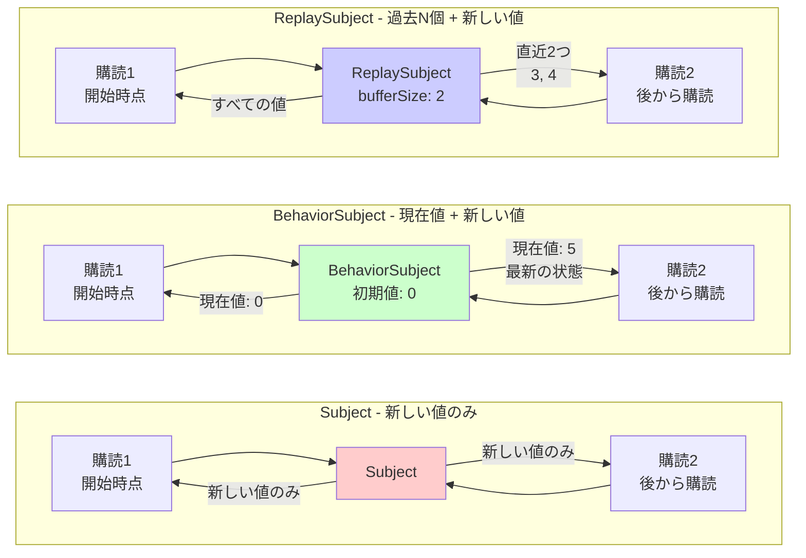

# 状態管理の難しさ

RxJSで **「状態を複数のコンポーネントで共有したい」「APIの結果をキャッシュしたい」** という要件は非常に一般的ですが、適切な方法を選ぶのは難しいです。このページでは、状態管理とストリーム共有の実践的なパターンを解説します。

## Subject vs BehaviorSubject vs ReplaySubject

### Subjectの種類と特徴

| Subject | 初期値 | 購読時の挙動 | よくあるユースケース |
|---|---|---|---|
| **Subject** | なし | 購読後の値のみ受信 | イベントバス、通知システム |
| **BehaviorSubject** | 必須 | 最新値を即座に受信 | 現在の状態（ログイン状態、選択中のアイテム） |
| **ReplaySubject** | なし | 過去N個の値を受信 | 履歴、ログ、操作の記録 |
| **AsyncSubject** | なし | 完了時の最終値のみ受信 | 単一の非同期結果（あまり使わない） |

### Subjectの種類と動作の違いを視覚化

以下の図は、各Subjectが購読時にどのような値を受け取るかを示しています。



> [!TIP] 選択基準
> - **Subject**: イベント通知（過去は不要）
> - **BehaviorSubject**: 状態管理（現在値が必要）
> - **ReplaySubject**: 履歴管理（過去N個が必要）

### 実践例1: Subject（イベントバス）

#### ❌ 悪い例：購読前の値は受け取れない
```typescript
import { Subject } from 'rxjs';

const notifications$ = new Subject<string>();

notifications$.next('通知1'); // まだ誰も購読していない

notifications$.subscribe(msg => {
  console.log('受信:', msg);
});

notifications$.next('通知2');
notifications$.next('通知3');

// 出力:
// 受信: 通知2
// 受信: 通知3
// （'通知1'は受信されない）
```

#### ✅ 良い例：イベントバスとして使う（購読後のイベントのみ処理）
```typescript
import { filter, map, Subject } from 'rxjs';

class EventBus {
  private events$ = new Subject<{ type: string; payload: any }>();

  emit(type: string, payload: any) {
    this.events$.next({ type, payload });
  }

  on(type: string) {
    return this.events$.pipe(
      filter(event => event.type === type),
      map(event => event.payload)
    );
  }
}

const bus = new EventBus();

// 購読開始
bus.on('userLogin').subscribe(user => {
  console.log('ログイン:', user);
});

// イベント発行
bus.emit('userLogin', { id: 1, name: 'Alice' }); // ✅ 受信される
// ログイン: {id: 1, name: 'Alice'}id: 1name: "Alice"[[Prototype]]: Object
```

> [!TIP] Subjectの使いどころ
> - **イベント駆動のアーキテクチャ**: コンポーネント間の疎結合な通信
> - **通知システム**: リアルタイムの通知配信
> - **過去の値が不要な場合**: 購読後のイベントだけ処理すればよい場合

### 実践例2: BehaviorSubject（状態管理）

#### ❌ 悪い例：Subjectだと現在の状態がわからない
```typescript
import { Subject } from 'rxjs';

const isLoggedIn$ = new Subject<boolean>();

// ユーザーがログイン
isLoggedIn$.next(true);

// 後から購読したコンポーネント
isLoggedIn$.subscribe(status => {
  console.log('ログイン状態:', status); // 何も出力されない
});
```

#### ✅ 良い例：BehaviorSubjectで現在の状態を即座に取得
```typescript
import { BehaviorSubject } from 'rxjs';

class AuthService {
  private isLoggedIn$ = new BehaviorSubject<boolean>(false); // 初期値: false

  login(username: string, password: string) {
    // ログイン処理...
    this.isLoggedIn$.next(true);
  }

  logout() {
    this.isLoggedIn$.next(false);
  }

  // 外部には読み取り専用で公開
  get isLoggedIn() {
    return this.isLoggedIn$.asObservable();
  }

  // 現在の値を同期的に取得（特別な場合のみ使用）
  get currentStatus(): boolean {
    return this.isLoggedIn$.value;
  }
}

const auth = new AuthService();

auth.login('user', 'pass');

// 後から購読しても、即座に現在の状態（true）が取得できる
auth.isLoggedIn.subscribe(status => {
  console.log('ログイン状態:', status); // ログイン状態: true
});
```

> [!TIP] BehaviorSubjectの使いどころ
> - **現在の状態を保持**: ログイン状態、選択中のアイテム、設定値
> - **購読時に即座に値が必要**: UIの初期表示に現在の状態が必要な場合
> - **状態の変更を監視**: 状態が変わったときにリアクティブに更新

### 実践例3: ReplaySubject（履歴管理）

#### ✅ 良い例：過去N個の値を再生
```typescript
import { ReplaySubject } from 'rxjs';

class SearchHistoryService {
  // 過去5件の検索履歴を保持
  private history$ = new ReplaySubject<string>(5);

  addSearch(query: string) {
    this.history$.next(query);
  }

  getHistory() {
    return this.history$.asObservable();
  }
}

const searchHistory = new SearchHistoryService();

// 検索実行
searchHistory.addSearch('TypeScript');
searchHistory.addSearch('RxJS');
searchHistory.addSearch('Angular');

// 後から購読しても、過去3件が即座に取得できる
searchHistory.getHistory().subscribe(query => {
  console.log('検索履歴:', query);
});

// 出力:
// 検索履歴: TypeScript
// 検索履歴: RxJS
// 検索履歴: Angular
```

> [!TIP] ReplaySubjectの使いどころ
> - **操作履歴**: 検索履歴、編集履歴、ナビゲーション履歴
> - **ログ・監査証跡**: 過去の操作を記録
> - **Late Subscribe対応**: 購読開始が遅れても過去の値を受け取りたい場合

## share と shareReplay の使い分け

### 問題：ColdなObservableの重複実行

#### ❌ 悪い例：複数subscribeでAPIが何度も呼ばれる
```typescript
import { ajax } from 'rxjs/ajax';

const users$ = ajax.getJSON('/api/users');

// 購読1
users$.subscribe(users => {
  console.log('コンポーネントA:', users);
});

// 購読2
users$.subscribe(users => {
  console.log('コンポーネントB:', users);
});

// 問題: APIが2回呼ばれる
// GET /api/users (1回目)
// GET /api/users (2回目)
```

#### ✅ 良い例：shareでHotに変換（実行を共有）
```typescript
import { ajax } from 'rxjs/ajax';
import { share } from 'rxjs';

const users$ = ajax.getJSON('/api/users').pipe(
  share() // 実行を共有
);

// 購読1
users$.subscribe(users => {
  console.log('コンポーネントA:', users);
});

// 購読2（すぐに購読した場合）
users$.subscribe(users => {
  console.log('コンポーネントB:', users);
});

// ✅ APIは1回だけ呼ばれる
// GET /api/users (1回のみ)
```

> [!WARNING] shareの落とし穴
> `share()`は、**最後の購読が解除されるとストリームがリセット**されます。次回の購読時には再度実行されます。
>
> ```typescript
> const data$ = fetchData().pipe(share());
>
> // 購読1
> const sub1 = data$.subscribe();
>
> // 購読2
> const sub2 = data$.subscribe();
>
> sub1.unsubscribe();
> sub2.unsubscribe(); // 全員が解除 → リセット
>
> // 再購読 → 再度fetchData()が実行される
> data$.subscribe();
> ```

### shareReplay：結果をキャッシュして再利用

#### ✅ 良い例：shareReplayでキャッシュ
```typescript
import { ajax } from 'rxjs/ajax';
import { shareReplay } from 'rxjs';

const users$ = ajax.getJSON('/api/users').pipe(
  shareReplay({ bufferSize: 1, refCount: true })
  // bufferSize: 1 → 最新の1つの値をキャッシュ
  // refCount: true → 全購読が解除されたらキャッシュもクリア
);

// 購読1
users$.subscribe(users => {
  console.log('コンポーネントA:', users);
});

// 1秒後に購読2（遅れて購読しても、キャッシュから取得）
setTimeout(() => {
  users$.subscribe(users => {
    console.log('コンポーネントB:', users); // キャッシュから即座に取得
  });
}, 1000);

// ✅ APIは1回だけ呼ばれ、結果はキャッシュされる
```

### share vs shareReplay の比較

| 特徴 | share() | shareReplay(1) |
|---|---|---|
| **購読中に新しい購読** | 同じストリームを共有 | 同じストリームを共有 |
| **遅れて購読** | 新しい値だけ受信 | キャッシュされた最新値を受信 |
| **全購読解除後** | ストリームリセット | キャッシュ保持（refCount: falseの場合） |
| **メモリ** | 保持しない | キャッシュを保持 |
| **ユースケース** | リアルタイムデータ共有 | API結果のキャッシュ |

#### ✅ 良い例：shareReplayの適切な設定
```typescript
import { shareReplay } from 'rxjs';

// パターン1: 永続的なキャッシュ（推奨しない）
const data1$ = fetchData().pipe(
  shareReplay({ bufferSize: 1, refCount: false })
  // refCount: false → メモリリーク注意
);

// パターン2: 自動クリーンアップ付きキャッシュ（推奨）
const data2$ = fetchData().pipe(
  shareReplay({ bufferSize: 1, refCount: true })
  // refCount: true → 全購読解除でキャッシュもクリア
);

// パターン3: TTL付きキャッシュ（RxJS 7.4+）
const data3$ = fetchData().pipe(
  shareReplay({
    bufferSize: 1,
    refCount: true,
    windowTime: 5000 // 5秒後にキャッシュを破棄
  })
);
```

> [!IMPORTANT] メモリリークの注意
> `shareReplay({ refCount: false })`を使うと、キャッシュが永続的に残るため、メモリリークの原因になります。基本的には**refCount: trueを使用**してください。

## Hot vs Cold の実践的使い分け

### Coldの特徴：購読ごとに実行

```typescript
import { Observable } from 'rxjs';

const cold$ = new Observable<number>(subscriber => {
  console.log('🔵 実行開始');
  subscriber.next(Math.random());
  subscriber.complete();
});

cold$.subscribe(v => console.log('購読1:', v));
cold$.subscribe(v => console.log('購読2:', v));

// 出力:
// 🔵 実行開始
// 購読1: 0.123
// 🔵 実行開始
// 購読2: 0.456
// （2回実行され、異なる値）
```

### Hotの特徴：実行を共有

```typescript
import { Subject } from 'rxjs';

const hot$ = new Subject<number>();

hot$.subscribe(v => console.log('購読1:', v));
hot$.subscribe(v => console.log('購読2:', v));

hot$.next(Math.random());

// 出力:
// 購読1: 0.789
// 購読2: 0.789
// （同じ値を共有）
```

### 使い分けの基準

| 要件 | Cold | Hot |
|---|---|---|
| **独立した実行が必要** | ✅ | ❌ |
| **実行を共有したい** | ❌ | ✅ |
| **購読者ごとに異なる値** | ✅ | ❌ |
| **リアルタイムデータ配信** | ❌ | ✅ |
| **API呼び出しの共有** | ❌（shareで変換） | ✅ |

#### ✅ 良い例：適切な変換
```typescript
import { interval, fromEvent } from 'rxjs';
import { share, shareReplay } from 'rxjs';

// Cold: 各購読者が独立したタイマー
const coldTimer$ = interval(1000);

// Cold→Hot: タイマーを共有
const hotTimer$ = interval(1000).pipe(share());

// Cold: クリックイベント（購読ごとに独立したリスナー登録）
const clicks$ = fromEvent(document, 'click');

// Cold→Hot: API結果をキャッシュ
const cachedData$ = ajax.getJSON('/api/data').pipe(
  shareReplay({ bufferSize: 1, refCount: true })
);
```

## 状態の一元管理パターン

### パターン1: Serviceクラスでの状態管理

```typescript
import { BehaviorSubject, Observable } from 'rxjs';
import { map } from 'rxjs';

interface User {
  id: number;
  name: string;
  email: string;
}

class UserStore {
  // プライベートなBehaviorSubject
  private users$ = new BehaviorSubject<User[]>([]);

  // 公開用の読み取り専用Observable
  get users(): Observable<User[]> {
    return this.users$.asObservable();
  }

  // 特定のユーザーを取得
  getUser(id: number): Observable<User | undefined> {
    return this.users.pipe(
      map(users => users.find(u => u.id === id))
    );
  }

  // 状態を更新
  addUser(user: User) {
    const currentUsers = this.users$.value;
    this.users$.next([...currentUsers, user]);
  }

  updateUser(id: number, updates: Partial<User>) {
    const currentUsers = this.users$.value;
    const updatedUsers = currentUsers.map(u =>
      u.id === id ? { ...u, ...updates } : u
    );
    this.users$.next(updatedUsers);
  }

  removeUser(id: number) {
    const currentUsers = this.users$.value;
    this.users$.next(currentUsers.filter(u => u.id !== id));
  }
}

// 使い方
const store = new UserStore();

// 購読
store.users.subscribe(users => {
  console.log('ユーザー一覧:', users);
});

// 状態更新
store.addUser({ id: 1, name: 'Alice', email: 'alice@example.com' });
store.updateUser(1, { name: 'Alice Smith' });
```

### パターン2: Scanを使った状態管理

```typescript
import { Subject } from 'rxjs';
import { scan, startWith } from 'rxjs';

interface State {
  count: number;
  items: string[];
}

type Action =
  | { type: 'INCREMENT' }
  | { type: 'DECREMENT' }
  | { type: 'ADD_ITEM'; payload: string }
  | { type: 'RESET' };

const actions$ = new Subject<Action>();

const initialState: State = {
  count: 0,
  items: []
};

const state$ = actions$.pipe(
  scan((state, action) => {
    switch (action.type) {
      case 'INCREMENT':
        return { ...state, count: state.count + 1 };
      case 'DECREMENT':
        return { ...state, count: state.count - 1 };
      case 'ADD_ITEM':
        return { ...state, items: [...state.items, action.payload] };
      case 'RESET':
        return initialState;
      default:
        return state;
    }
  }, initialState),
  startWith(initialState)
);

// 購読
state$.subscribe(state => {
  console.log('現在の状態:', state);
});

// アクション発行
actions$.next({ type: 'INCREMENT' });
actions$.next({ type: 'ADD_ITEM', payload: 'りんご' });
actions$.next({ type: 'INCREMENT' });

// 出力:
// 現在の状態: { count: 0, items: [] }
// 現在の状態: { count: 1, items: [] }
// 現在の状態: { count: 1, items: ['りんご'] }
// 現在の状態: { count: 2, items: ['りんご'] }
```

## よくある落とし穴

### 落とし穴1: Subjectの外部公開

#### ❌ 悪い例：Subjectを直接公開
```typescript
import { BehaviorSubject } from 'rxjs';

class BadService {
  // ❌ 外部から直接変更できてしまう
  public state$ = new BehaviorSubject<number>(0);
}

const service = new BadService();

// 外部から勝手に変更できる
service.state$.next(999); // ❌ カプセル化が破られている
```

#### ✅ 良い例：asObservable()で保護
```typescript
import { BehaviorSubject } from 'rxjs';

class GoodService {
  private _state$ = new BehaviorSubject<number>(0);

  // 読み取り専用で公開
  get state() {
    return this._state$.asObservable();
  }

  // 専用のメソッドでのみ変更可能
  increment() {
    this._state$.next(this._state$.value + 1);
  }

  decrement() {
    this._state$.next(this._state$.value - 1);
  }
}

const service = new GoodService();

// ✅ 読み取りのみ可能
service.state.subscribe(value => console.log(value));

// ✅ 変更は専用メソッド経由
service.increment();

// ❌ 直接変更はできない（コンパイルエラー）
// service.state.next(999); // Error: Property 'next' does not exist
```

### 落とし穴2: shareReplayのメモリリーク

#### ❌ 悪い例：refCount: falseでメモリリーク
```typescript
import { interval } from 'rxjs';
import { shareReplay, take } from 'rxjs';

const data$ = interval(1000).pipe(
  take(100),
  shareReplay({ bufferSize: 1, refCount: false })
  // ❌ refCount: false → キャッシュが永遠に残る
);

// 購読して解除しても、内部的にストリームが動き続ける
const sub = data$.subscribe();
sub.unsubscribe();

// キャッシュが残り続ける → メモリリーク
```

#### ✅ 良い例：refCount: trueで自動クリーンアップ
```typescript
import { interval } from 'rxjs';
import { shareReplay, take } from 'rxjs';

const data$ = interval(1000).pipe(
  take(100),
  shareReplay({ bufferSize: 1, refCount: true })
  // ✅ refCount: true → 全購読解除で自動クリーンアップ
);

const sub1 = data$.subscribe();
const sub2 = data$.subscribe();

sub1.unsubscribe();
sub2.unsubscribe(); // 全購読解除 → ストリーム停止、キャッシュクリア
```

### 落とし穴3: 同期的な値の取得

#### ❌ 悪い例：valueに依存しすぎる
```typescript
import { BehaviorSubject } from 'rxjs';

class CounterService {
  private count$ = new BehaviorSubject(0);

  increment() {
    // ❌ valueに頼りすぎ
    const current = this.count$.value;
    this.count$.next(current + 1);
  }

  // ❌ 同期的な取得を公開してしまう
  getCurrentCount(): number {
    return this.count$.value;
  }
}
```

#### ✅ 良い例：リアクティブに保つ
```typescript
import { BehaviorSubject } from 'rxjs';
import { map } from 'rxjs';

class CounterService {
  private count$ = new BehaviorSubject(0);

  get count() {
    return this.count$.asObservable();
  }

  increment() {
    // ✅ 内部的にvalueを使うのはOK
    this.count$.next(this.count$.value + 1);
  }

  // ✅ Observableで返す
  isPositive() {
    return this.count$.pipe(
      map(count => count > 0)
    );
  }
}
```

## 理解度チェックリスト

以下の質問に答えられるか確認してください。

```markdown
## 基本理解
- [ ] Subject、BehaviorSubject、ReplaySubjectの違いを説明できる
- [ ] BehaviorSubjectに初期値が必要な理由を理解している
- [ ] ReplaySubjectのbufferSizeの意味を理解している

## Hot/Cold
- [ ] ColdなObservableとHotなObservableの違いを説明できる
- [ ] shareとshareReplayの違いを説明できる
- [ ] shareReplayのrefCountオプションの役割を理解している

## 状態管理
- [ ] Subjectを外部に公開せず、asObservable()で保護できる
- [ ] BehaviorSubjectを使った状態管理パターンを実装できる
- [ ] scanを使った状態管理パターンを理解している

## メモリ管理
- [ ] shareReplayのメモリリークを防ぐ方法を知っている
- [ ] refCount: trueとfalseの違いを説明できる
- [ ] 適切なタイミングでキャッシュをクリアできる
```

## 次のステップ

状態管理と共有を理解したら、次は**複数ストリームの組み合わせ**を学びましょう。

→ **[複数ストリーム組み合わせ](/guide/overcoming-difficulties/stream-combination)** - combineLatest、zip、withLatestFromの使い分け

## 関連ページ

- **[Chapter 5: Subjectとは](/guide/subjects/what-is-subject)** - Subjectの基礎
- **[Chapter 5: Subjectの種類](/guide/subjects/types-of-subject)** - BehaviorSubject、ReplaySubjectの詳細
- **[share()オペレーター](/guide/operators/multicasting/share)** - shareの詳細解説
- **[shareReplayの誤用](/guide/anti-patterns/common-mistakes#4-sharereplay-の誤用)** - よくある間違い
- **[Cold vs Hot Observable](/guide/observables/cold-and-hot-observables)** - Cold/Hotの詳細

## 🎯 練習問題

### 問題1: 適切なSubjectの選択

以下のシナリオに最適なSubjectを選んでください。

1. **ユーザーのログイン状態を管理**（初期状態: ログアウト）
2. **通知メッセージの配信**（購読後のメッセージだけ表示）
3. **直近5件の操作履歴を保持**（遅れて購読しても過去5件が見える）

<details>
<summary>解答例</summary>

**1. ユーザーのログイン状態**
```typescript
import { BehaviorSubject } from 'rxjs';

class AuthService {
  private isLoggedIn$ = new BehaviorSubject<boolean>(false);

  get loginStatus() {
    return this.isLoggedIn$.asObservable();
  }

  login() {
    this.isLoggedIn$.next(true);
  }

  logout() {
    this.isLoggedIn$.next(false);
  }
}
```

> [!NOTE] 理由
> 購読時に即座に現在の状態が必要なので、**BehaviorSubject**が最適です。

---

**2. 通知メッセージの配信**
```typescript
import { Subject } from 'rxjs';

class NotificationService {
  private notifications$ = new Subject<string>();

  get messages() {
    return this.notifications$.asObservable();
  }

  notify(message: string) {
    this.notifications$.next(message);
  }
}
```

> [!NOTE] 理由
> 購読後のメッセージだけ表示すればよいので、**Subject**で十分です。

---

**3. 直近5件の操作履歴**
```typescript
import { ReplaySubject } from 'rxjs';

class HistoryService {
  private actions$ = new ReplaySubject<string>(5); // 5件保持

  get history() {
    return this.actions$.asObservable();
  }

  addAction(action: string) {
    this.actions$.next(action);
  }
}
```

> [!NOTE] 理由
> 過去5件を保持し、遅れて購読しても取得できるようにするため、**ReplaySubject(5)**が最適です。

</details>

### 問題2: shareとshareReplayの選択

以下のコードで、適切なオペレーターを選んでください。

```typescript
import { ajax } from 'rxjs/ajax';

// シナリオ1: WebSocketからのリアルタイムデータ
const realTimeData$ = webSocket('ws://example.com/stream');

// シナリオ2: ユーザー情報のAPI呼び出し（結果をキャッシュしたい）
const user$ = ajax.getJSON('/api/user/me');

// どちらに何を使うべき？
```

<details>
<summary>解答例</summary>

**シナリオ1: WebSocketからのリアルタイムデータ**
```typescript
import { share } from 'rxjs';

const realTimeData$ = webSocket('ws://example.com/stream').pipe(
  share() // リアルタイムデータはキャッシュ不要
);
```

> [!NOTE] 理由
> WebSocketのようなリアルタイムデータは、過去の値をキャッシュする必要がないため、**share()**を使います。遅れて購読した場合は、その時点からの新しいデータを受信します。

---

**シナリオ2: ユーザー情報のAPI呼び出し**
```typescript
import { shareReplay } from 'rxjs';

const user$ = ajax.getJSON('/api/user/me').pipe(
  shareReplay({ bufferSize: 1, refCount: true })
);
```

> [!NOTE] 理由
> API結果をキャッシュし、複数のコンポーネントで共有したいため、**shareReplay()**を使います。`refCount: true`でメモリリークを防ぎます。

</details>

### 問題3: メモリリークの修正

以下のコードにはメモリリークの問題があります。修正してください。

```typescript
import { interval } from 'rxjs';
import { shareReplay } from 'rxjs';

const data$ = interval(1000).pipe(
  shareReplay(1) // 問題点: これは shareReplay({ bufferSize: 1, refCount: false }) と同じ
);

const sub = data$.subscribe(v => console.log(v));
sub.unsubscribe();

// この後もintervalが動き続ける → メモリリーク
```

<details>
<summary>解答例</summary>

**修正コード：**
```typescript
import { interval } from 'rxjs';
import { shareReplay } from 'rxjs';

const data$ = interval(1000).pipe(
  shareReplay({ bufferSize: 1, refCount: true })
  // refCount: true → 全購読解除でストリーム停止
);

const sub = data$.subscribe(v => console.log(v));
sub.unsubscribe(); // ストリームが停止される
```

> [!IMPORTANT] 問題点
> - `shareReplay(1)`は`shareReplay({ bufferSize: 1, refCount: false })`の省略形
> - `refCount: false`だと、全購読解除後もストリームが動き続ける
> - intervalが永遠に動き続け、メモリリークとなる

> [!NOTE] 修正理由
> `refCount: true`を指定することで、最後の購読が解除されたときにストリームも停止し、キャッシュもクリアされます。

</details>

### 問題4: 状態管理の実装

以下の要件を満たすTodoStoreを実装してください。

> [!NOTE] 要件
> - Todoアイテムの追加、完了、削除ができる
> - 外部からは読み取り専用でTodoリストを取得できる
> - 完了済みTodoの数を取得できる

<details>
<summary>解答例</summary>

```typescript
import { BehaviorSubject, Observable } from 'rxjs';
import { map } from 'rxjs';

interface Todo {
  id: number;
  text: string;
  completed: boolean;
}

class TodoStore {
  private todos$ = new BehaviorSubject<Todo[]>([]);
  private nextId = 1;

  // 読み取り専用で公開
  get todos(): Observable<Todo[]> {
    return this.todos$.asObservable();
  }

  // 完了済みTodoの数
  get completedCount(): Observable<number> {
    return this.todos$.pipe(
      map(todos => todos.filter(t => t.completed).length)
    );
  }

  // Todo追加
  addTodo(text: string) {
    const currentTodos = this.todos$.value;
    const newTodo: Todo = {
      id: this.nextId++,
      text,
      completed: false
    };
    this.todos$.next([...currentTodos, newTodo]);
  }

  // Todo完了
  toggleTodo(id: number) {
    const currentTodos = this.todos$.value;
    const updatedTodos = currentTodos.map(todo =>
      todo.id === id ? { ...todo, completed: !todo.completed } : todo
    );
    this.todos$.next(updatedTodos);
  }

  // Todo削除
  removeTodo(id: number) {
    const currentTodos = this.todos$.value;
    this.todos$.next(currentTodos.filter(todo => todo.id !== id));
  }
}

// 使い方
const store = new TodoStore();

store.todos.subscribe(todos => {
  console.log('Todoリスト:', todos);
});

store.completedCount.subscribe(count => {
  console.log('完了済み:', count);
});

store.addTodo('RxJSを学ぶ');
store.addTodo('ドキュメントを読む');
store.toggleTodo(1);
```

> [!NOTE] ポイント
> - `BehaviorSubject`で状態を保持
> - `asObservable()`で外部に読み取り専用で公開
> - `value`を使って現在の状態を取得し、更新
> - `map`を使って派生状態（completedCount）を計算

</details>
