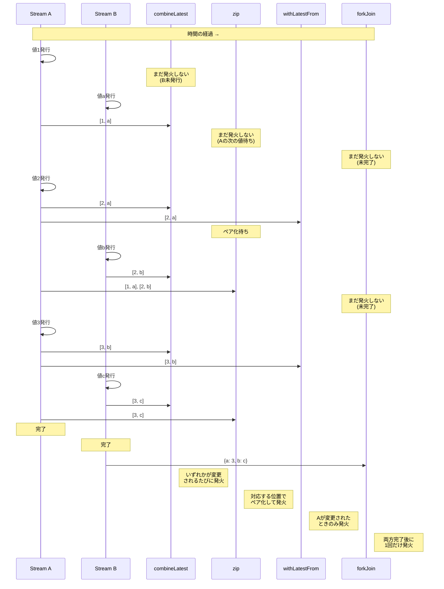
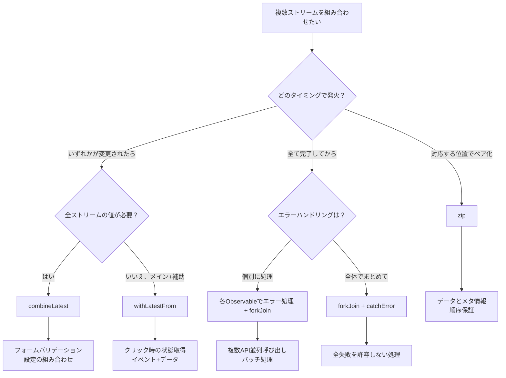

# 複数ストリーム組み合わせ

RxJSで **「2つのAPIの結果を合わせたい」「フォームの全フィールドを監視したい」** という要件は非常に多いですが、適切なオペレーターを選ぶのは難しいです。このページでは、複数ストリームを組み合わせる実践的なパターンを解説します。

## combineLatest vs zip vs withLatestFrom vs forkJoin

### 4つの主要な結合オペレーターの比較

| オペレーター | 発火タイミング | 値の組み合わせ方 | 完了条件 | よくあるユースケース |
|---|---|---|---|---|
| **combineLatest** | いずれかが変更 | 各ストリームの最新値 | 全ストリームが完了 | フォームバリデーション、設定の組み合わせ |
| **zip** | 全ストリームが値を出す | 対応する位置の値をペア化 | いずれかが完了 | ページネーション、並列処理の同期 |
| **withLatestFrom** | メインストリームが変更 | メイン+補助の最新値 | メインストリームが完了 | イベント+現在の状態 |
| **forkJoin** | 全ストリームが完了 | 各ストリームの最終値 | 全ストリームが完了 | 複数API並列呼び出し |

### Marble Diagram での比較

```
A:  --1--2--------3----|
B:  ----a----b------c----|

combineLatest(A, B):
    ----[1,a]-[2,a]-[2,b]-[3,b]-[3,c]|
    (いずれかが変更されるたびに発火)

zip(A, B):
    ----[1,a]----[2,b]----[3,c]|
    (対応する位置でペア化)

A.pipe(withLatestFrom(B)):
    ----[1,a]----[2,b]----[3,c]|
    (Aが変更されたときのみ発火)

forkJoin({ a: A, b: B }):
    ---------------------------{ a: 3, b: c }|
    (両方が完了してから発火)
```

### 発火タイミングの視覚化

以下の図は、各組み合わせオペレーターがいつ値を発火するかを示しています。



> [!TIP] 選択基準
> - **combineLatest**: リアクティブな状態の組み合わせ（フォーム、設定）
> - **zip**: 対応する値のペア化（ページネーション、並列処理）
> - **withLatestFrom**: イベント + 現在の状態（クリック時の設定取得）
> - **forkJoin**: 複数の非同期処理を並列実行して全結果を取得（複数API）

## combineLatest：最新値の組み合わせ

### 特徴
- **すべてのストリームが最低1回値を出した後**、いずれかが変更されるたびに発火
- 各ストリームの**最新の値**を組み合わせる
- すべてのストリームが完了するまで継続

### 実践例1: フォームバリデーション

#### ❌ 悪い例：個別に購読して手動で組み合わせ
```typescript
import { BehaviorSubject } from 'rxjs';

const email$ = new BehaviorSubject('');
const password$ = new BehaviorSubject('');
let isValid = false;

email$.subscribe(email => {
  // password$の値が必要だが取得できない
  // グローバル変数などで管理する必要がある
});

password$.subscribe(password => {
  // 同様の問題
});
```

#### ✅ 良い例：combineLatestで自動的に組み合わせ
```typescript
import { BehaviorSubject, combineLatest } from 'rxjs';
import { map } from 'rxjs';

const email$ = new BehaviorSubject('');
const password$ = new BehaviorSubject('');

const isFormValid$ = combineLatest([email$, password$]).pipe(
  map(([email, password]) => {
    const emailValid = email.includes('@') && email.length > 3;
    const passwordValid = password.length >= 8;
    return emailValid && passwordValid;
  })
);

isFormValid$.subscribe(isValid => {
  console.log('フォーム有効:', isValid);
});

// 値の変更
email$.next('user@example.com');  // フォーム有効: false (パスワードが短い)
password$.next('pass1234');       // フォーム有効: true
```

### 実践例2: 複数の設定値の組み合わせ

```typescript
import { BehaviorSubject, combineLatest } from 'rxjs';
import { map } from 'rxjs';

interface Config {
  theme: 'light' | 'dark';
  language: 'ja' | 'en';
  fontSize: number;
}

const theme$ = new BehaviorSubject<'light' | 'dark'>('light');
const language$ = new BehaviorSubject<'ja' | 'en'>('ja');
const fontSize$ = new BehaviorSubject<number>(14);

const config$ = combineLatest([theme$, language$, fontSize$]).pipe(
  map(([theme, language, fontSize]): Config => ({
    theme,
    language,
    fontSize
  }))
);

config$.subscribe(config => {
  console.log('設定更新:', config);
  // UIを更新する処理
});

theme$.next('dark');      // 設定更新: { theme: 'dark', language: 'ja', fontSize: 14 }
fontSize$.next(16);       // 設定更新: { theme: 'dark', language: 'ja', fontSize: 16 }
```

> [!TIP] combineLatestの使いどころ
> - **フォームバリデーション**: 全フィールドの最新値を組み合わせる
> - **設定の監視**: 複数の設定項目が変わったときに反応
> - **依存する表示**: 複数の状態に応じてUIを更新
> - **フィルタリング**: 複数の条件を組み合わせる

## zip：対応する位置でペア化

### 特徴
- **各ストリームの対応する位置の値**をペア化
- すべてのストリームから値が揃うまで待つ
- いずれかのストリームが完了したら全体も完了

### 実践例1: ページネーションでデータとメタ情報をペア化

#### ❌ 悪い例：タイミングがずれる
```typescript
import { interval } from 'rxjs';
import { map, take } from 'rxjs';

// ページデータ取得（遅い）
const pages$ = interval(1000).pipe(
  map(i => `ページ${i + 1}のデータ`),
  take(3)
);

// メタ情報取得（速い）
const metadata$ = interval(100).pipe(
  map(i => `メタ情報${i + 1}`),
  take(3)
);

// 個別に購読すると対応関係が崩れる
pages$.subscribe(page => console.log('ページ:', page));
metadata$.subscribe(meta => console.log('メタ:', meta));

// 出力:
// メタ: メタ情報1
// メタ: メタ情報2
// メタ: メタ情報3
// ページ: ページ1のデータ
// ページ: ページ2のデータ
// ページ: ページ3のデータ
// （対応関係がバラバラ）
```

#### ✅ 良い例：zipで対応する位置をペア化
```typescript
import { interval, zip } from 'rxjs';
import { map, take } from 'rxjs';

const pages$ = interval(1000).pipe(
  map(i => `ページ${i + 1}のデータ`),
  take(3)
);

const metadata$ = interval(100).pipe(
  map(i => `メタ情報${i + 1}`),
  take(3)
);

zip(pages$, metadata$).subscribe(([page, meta]) => {
  console.log(`${page} - ${meta}`);
});

// 出力（1秒ごと）:
// ページ1のデータ - メタ情報1
// ページ2のデータ - メタ情報2
// ページ3のデータ - メタ情報3
```

### 実践例2: 並列処理の結果を順序通りに取得

```typescript
import { of, zip } from 'rxjs';
import { delay, map } from 'rxjs';

// 3つのAPIを並列で呼ぶが、完了時刻はバラバラ
const api1$ = of('結果1').pipe(delay(300));
const api2$ = of('結果2').pipe(delay(100)); // 最速
const api3$ = of('結果3').pipe(delay(200));

zip(api1$, api2$, api3$).pipe(
  map(([r1, r2, r3]) => ({ r1, r2, r3 }))
).subscribe(results => {
  console.log('全結果:', results);
});

// 出力（300ms後、すべて揃ってから）:
// 全結果: { r1: '結果1', r2: '結果2', r3: '結果3' }
```

> [!TIP] zipの使いどころ
> - **順序が重要**: 1番目と1番目、2番目と2番目をペア化
> - **データとメタ情報のペア**: ページデータとページ番号
> - **並列処理の同期**: 複数の処理を並列実行し、順序を保証

> [!WARNING] zipの注意点
> - 遅いストリームに合わせて待つため、**バッファが溜まる**可能性がある
> - 無限ストリームでは、遅い方に引きずられてメモリリークの原因になる

## withLatestFrom：メイン+補助値の取得

### 特徴
- **メインストリームが値を出したとき**にのみ発火
- 補助ストリームの**最新値**を取得して組み合わせる
- メインストリームが完了したら全体も完了

### 実践例1: クリックイベント+現在の状態

#### ❌ 悪い例：combineLatestだと余計に発火する
```typescript
import { fromEvent, BehaviorSubject, combineLatest } from 'rxjs';

const button = document.querySelector('button')!;
const clicks$ = fromEvent(button, 'click');
const counter$ = new BehaviorSubject(0);

// ❌ combineLatestだとcounter$が変わるたびにも発火
combineLatest([clicks$, counter$]).subscribe(([event, count]) => {
  console.log('クリック時のカウント:', count);
});

// counter$が変わるたびに発火してしまう
setInterval(() => {
  counter$.next(counter$.value + 1); // 不要な発火
}, 1000);
```

#### ✅ 良い例：withLatestFromでクリック時のみ発火
```typescript
import { fromEvent, BehaviorSubject } from 'rxjs';
import { withLatestFrom } from 'rxjs';

const button = document.querySelector('button')!;
const clicks$ = fromEvent(button, 'click');
const counter$ = new BehaviorSubject(0);

clicks$.pipe(
  withLatestFrom(counter$)
).subscribe(([event, count]) => {
  console.log('クリック時のカウント:', count);
});

// counter$が変わっても発火しない
setInterval(() => {
  counter$.next(counter$.value + 1); // ✅ 発火しない
}, 1000);
```

### 実践例2: フォーム送信+現在のユーザー情報

```typescript
import { fromEvent, BehaviorSubject } from 'rxjs';
import { withLatestFrom, map } from 'rxjs';

const submitButton = document.querySelector('#submit')!;
const submit$ = fromEvent(submitButton, 'click');

const currentUser$ = new BehaviorSubject({ id: 1, name: 'Alice' });
const formData$ = new BehaviorSubject({ title: '', content: '' });

submit$.pipe(
  withLatestFrom(currentUser$, formData$),
  map(([event, user, data]) => ({
    ...data,
    authorId: user.id,
    authorName: user.name,
    timestamp: Date.now()
  }))
).subscribe(payload => {
  console.log('送信データ:', payload);
  // APIに送信...
});
```

> [!TIP] withLatestFromの使いどころ
> - **イベント+状態**: クリック時の現在の状態を取得
> - **メイン処理+補助データ**: フォーム送信時のユーザー情報
> - **トリガー+設定**: ボタンクリック時の現在の設定値

## forkJoin：全完了を待つ

### 特徴
- **すべてのストリームが完了**するまで待つ
- 各ストリームの**最終値**を取得
- Promiseの`Promise.all()`に相当

### 実践例1: 複数APIの並列呼び出し

#### ❌ 悪い例：順次実行で遅い
```typescript
import { ajax } from 'rxjs/ajax';

ajax.getJSON('/api/user').subscribe(user => {
  console.log('ユーザー取得:', user);

  ajax.getJSON('/api/posts').subscribe(posts => {
    console.log('投稿取得:', posts);

    ajax.getJSON('/api/comments').subscribe(comments => {
      console.log('コメント取得:', comments);
      // ネストが深くなる
    });
  });
});
```

#### ✅ 良い例：forkJoinで並列実行
```typescript
import { forkJoin } from 'rxjs';
import { ajax } from 'rxjs/ajax';

forkJoin({
  user: ajax.getJSON('/api/user'),
  posts: ajax.getJSON('/api/posts'),
  comments: ajax.getJSON('/api/comments')
}).subscribe(({ user, posts, comments }) => {
  console.log('全データ取得完了:', { user, posts, comments });
  // 3つのAPIが並列実行される
});
```

### 実践例2: 複数ファイルのアップロード

```typescript
import { forkJoin, Observable, of } from 'rxjs';
import { delay } from 'rxjs';

function uploadFile(file: File): Observable<string> {
  return of(`${file.name} アップロード完了`).pipe(
    delay(Math.random() * 2000)
  );
}

const files = [
  new File([''], 'file1.txt'),
  new File([''], 'file2.txt'),
  new File([''], 'file3.txt')
];

forkJoin(files.map(file => uploadFile(file))).subscribe(results => {
  console.log('全ファイルアップロード完了:', results);
  // すべてのアップロードが完了してから表示
});
```

> [!TIP] forkJoinの使いどころ
> - **複数API並列呼び出し**: 初期データの一括取得
> - **バッチ処理**: 複数のタスクをすべて完了させる
> - **依存しない処理の並列実行**: 各処理が独立している場合

> [!WARNING] forkJoinの注意点
> - **完了しないストリームには使えない**（intervalなど）
> - いずれかがエラーになると全体がエラーになる
> - 途中の値は取得できない（最終値のみ）

## 選択フローチャート



## 実践パターン

### パターン1: フォームバリデーション

```typescript
import { BehaviorSubject, combineLatest } from 'rxjs';
import { map } from 'rxjs';

interface FormState {
  email: string;
  password: string;
  agreeToTerms: boolean;
}

class RegistrationForm {
  private email$ = new BehaviorSubject('');
  private password$ = new BehaviorSubject('');
  private agreeToTerms$ = new BehaviorSubject(false);

  readonly isValid$ = combineLatest([
    this.email$,
    this.password$,
    this.agreeToTerms$
  ]).pipe(
    map(([email, password, agreed]) => {
      const emailValid = /^[^\s@]+@[^\s@]+\.[^\s@]+$/.test(email);
      const passwordValid = password.length >= 8;
      return emailValid && passwordValid && agreed;
    })
  );

  readonly formState$ = combineLatest([
    this.email$,
    this.password$,
    this.agreeToTerms$
  ]).pipe(
    map(([email, password, agreeToTerms]): FormState => ({
      email,
      password,
      agreeToTerms
    }))
  );

  updateEmail(email: string) {
    this.email$.next(email);
  }

  updatePassword(password: string) {
    this.password$.next(password);
  }

  toggleTerms() {
    this.agreeToTerms$.next(!this.agreeToTerms$.value);
  }
}

// 使い方
const form = new RegistrationForm();

form.isValid$.subscribe(isValid => {
  console.log('フォーム有効:', isValid);
});

form.updateEmail('user@example.com');
form.updatePassword('password123');
form.toggleTerms();
```

### パターン2: 依存関係のあるAPI呼び出し

```typescript
import { forkJoin, of } from 'rxjs';
import { switchMap, map, catchError } from 'rxjs';
import { ajax } from 'rxjs/ajax';

interface User {
  id: number;
  name: string;
}

interface Post {
  id: number;
  userId: number;
  title: string;
}

interface Comment {
  id: number;
  postId: number;
  text: string;
}

// ユーザーの投稿とコメントを並列取得
function getUserData(userId: number) {
  return ajax.getJSON<User>(`/api/users/${userId}`).pipe(
    switchMap(user =>
      forkJoin({
        user: of(user),
        posts: ajax.getJSON<Post[]>(`/api/users/${userId}/posts`),
        comments: ajax.getJSON<Comment[]>(`/api/users/${userId}/comments`)
      })
    ),
    catchError(error => {
      console.error('エラー:', error);
      return of({
        user: null,
        posts: [],
        comments: []
      });
    })
  );
}

// 使い方
getUserData(1).subscribe(({ user, posts, comments }) => {
  console.log('ユーザーデータ:', { user, posts, comments });
});
```

### パターン3: リアルタイムフィルタリング

```typescript
import { BehaviorSubject, combineLatest } from 'rxjs';
import { map } from 'rxjs';

interface Product {
  id: number;
  name: string;
  category: string;
  price: number;
}

class ProductFilter {
  private products$ = new BehaviorSubject<Product[]>([
    { id: 1, name: 'ノートPC', category: 'electronics', price: 100000 },
    { id: 2, name: 'マウス', category: 'electronics', price: 2000 },
    { id: 3, name: '本', category: 'books', price: 1500 }
  ]);

  private searchQuery$ = new BehaviorSubject('');
  private categoryFilter$ = new BehaviorSubject<string | null>(null);
  private maxPrice$ = new BehaviorSubject<number>(Infinity);

  readonly filteredProducts$ = combineLatest([
    this.products$,
    this.searchQuery$,
    this.categoryFilter$,
    this.maxPrice$
  ]).pipe(
    map(([products, query, category, maxPrice]) => {
      return products.filter(p => {
        const matchesQuery = p.name.toLowerCase().includes(query.toLowerCase());
        const matchesCategory = !category || p.category === category;
        const matchesPrice = p.price <= maxPrice;
        return matchesQuery && matchesCategory && matchesPrice;
      });
    })
  );

  updateSearch(query: string) {
    this.searchQuery$.next(query);
  }

  updateCategory(category: string | null) {
    this.categoryFilter$.next(category);
  }

  updateMaxPrice(price: number) {
    this.maxPrice$.next(price);
  }
}

// 使い方
const filter = new ProductFilter();

filter.filteredProducts$.subscribe(products => {
  console.log('フィルタ済み商品:', products);
});

filter.updateSearch('マウス');
filter.updateCategory('electronics');
filter.updateMaxPrice(50000);
```

## よくある落とし穴

### 落とし穴1: combineLatestの初回発火

#### ❌ 悪い例：初期値がないストリーム
```typescript
import { Subject, combineLatest } from 'rxjs';

const a$ = new Subject<number>();
const b$ = new Subject<number>();

combineLatest([a$, b$]).subscribe(([a, b]) => {
  console.log('値:', a, b);
});

a$.next(1); // 何も出力されない（b$がまだ値を出していない）
b$.next(2); // ここで初めて出力: 値: 1 2
```

#### ✅ 良い例：BehaviorSubjectで初期値を設定
```typescript
import { BehaviorSubject, combineLatest } from 'rxjs';

const a$ = new BehaviorSubject<number>(0); // 初期値
const b$ = new BehaviorSubject<number>(0);

combineLatest([a$, b$]).subscribe(([a, b]) => {
  console.log('値:', a, b);
});

// 出力: 値: 0 0 （即座に発火）

a$.next(1); // 出力: 値: 1 0
b$.next(2); // 出力: 値: 1 2
```

### 落とし穴2: zipでのバッファ溜まり

#### ❌ 悪い例：遅いストリームでバッファが溜まる
```typescript
import { interval, zip } from 'rxjs';
import { take } from 'rxjs';

const fast$ = interval(100).pipe(take(100));  // 速い
const slow$ = interval(1000).pipe(take(10));  // 遅い

zip(fast$, slow$).subscribe(([f, s]) => {
  console.log('ペア:', f, s);
});

// 問題: fast$の値がバッファに溜まり続ける
// slow$が10個出すまで、fast$は100個分のメモリを消費
```

#### ✅ 良い例：速度を調整する
```typescript
import { interval, combineLatest } from 'rxjs';
import { take } from 'rxjs';

const fast$ = interval(100).pipe(take(100));
const slow$ = interval(1000).pipe(take(10));

// zipの代わりにcombineLatestを使う
combineLatest([fast$, slow$]).subscribe(([f, s]) => {
  console.log('最新の組み合わせ:', f, s);
});

// または、fast$をthrottleTimeで調整する
```

### 落とし穴3: forkJoinで無限ストリーム

#### ❌ 悪い例：完了しないストリーム
```typescript
import { interval, forkJoin } from 'rxjs';
import { ajax } from 'rxjs/ajax';

forkJoin({
  timer: interval(1000),  // ❌ 完了しない
  user: ajax.getJSON('/api/user')
}).subscribe(result => {
  console.log(result); // 永遠に実行されない
});
```

#### ✅ 良い例：takeで区切る
```typescript
import { interval, forkJoin } from 'rxjs';
import { ajax } from 'rxjs/ajax';
import { take } from 'rxjs';

forkJoin({
  timer: interval(1000).pipe(take(5)), // ✅ 5個で完了
  user: ajax.getJSON('/api/user')
}).subscribe(result => {
  console.log('結果:', result); // 5秒後に実行される
});
```

## 理解度チェックリスト

以下の質問に答えられるか確認してください。

```markdown
## 基本理解
- [ ] combineLatest、zip、withLatestFrom、forkJoinの違いを説明できる
- [ ] それぞれの発火タイミングを理解している
- [ ] どのオペレーターがいつ完了するか説明できる

## 使い分け
- [ ] フォームバリデーションに適したオペレーターを選べる
- [ ] 複数API並列呼び出しに適したオペレーターを選べる
- [ ] イベント+状態の組み合わせに適したオペレーターを選べる

## 注意点
- [ ] combineLatestの初回発火条件を理解している
- [ ] zipでバッファが溜まる問題を説明できる
- [ ] forkJoinで無限ストリームを使えない理由を理解している

## 実践
- [ ] フォームバリデーションパターンを実装できる
- [ ] 複数APIの並列呼び出しを実装できる
- [ ] リアルタイムフィルタリングを実装できる
```

## 次のステップ

複数ストリームの組み合わせを理解したら、次は**デバッグ手法**を学びましょう。

→ **[デバッグ手法](/guide/overcoming-difficulties/debugging-guide)** - 複雑なストリームのデバッグ方法

## 関連ページ

- **[Chapter 3: combineLatest](/guide/creation-functions/combineLatest)** - combineLatestの詳細
- **[Chapter 3: zip](/guide/creation-functions/zip)** - zipの詳細
- **[Chapter 3: forkJoin](/guide/creation-functions/forkJoin)** - forkJoinの詳細
- **[withLatestFrom](/guide/operators/combination/withLatestFrom)** - withLatestFromの詳細
- **[Chapter 4: オペレーター選択](/guide/overcoming-difficulties/operator-selection)** - オペレーター選択の基準

## 🎯 練習問題

### 問題1: 適切なオペレーターの選択

以下のシナリオに最適なオペレーターを選んでください。

1. **ユーザー名とメールアドレスの両方が入力されたらsubmitボタンを有効化**
2. **ボタンクリック時の現在のカート内容を送信**
3. **3つのAPIを並列で呼び、すべて完了したらデータを表示**
4. **ページ番号と1ページあたりのアイテム数をペア化**

<details>
<summary>解答例</summary>

**1. ユーザー名とメールアドレスの両方が入力されたらsubmitボタンを有効化**
```typescript
import { BehaviorSubject, combineLatest } from 'rxjs';
import { map } from 'rxjs';

const username$ = new BehaviorSubject('');
const email$ = new BehaviorSubject('');

const isSubmitEnabled$ = combineLatest([username$, email$]).pipe(
  map(([username, email]) => username.length > 0 && email.length > 0)
);

isSubmitEnabled$.subscribe(enabled => {
  console.log('Submit有効:', enabled);
});
```

> [!NOTE] 理由
> いずれかが変更されたときに再評価する必要があるため、**combineLatest**が最適です。

---

**2. ボタンクリック時の現在のカート内容を送信**
```typescript
import { fromEvent, BehaviorSubject } from 'rxjs';
import { withLatestFrom } from 'rxjs';

const submitButton = document.querySelector('#checkout')!;
const submit$ = fromEvent(submitButton, 'click');
const cart$ = new BehaviorSubject<string[]>([]);

submit$.pipe(
  withLatestFrom(cart$)
).subscribe(([event, cart]) => {
  console.log('購入:', cart);
  // APIに送信...
});
```

> [!NOTE] 理由
> クリック時（メインストリーム）にのみ発火し、カートの最新値を取得したいため、**withLatestFrom**が最適です。

---

**3. 3つのAPIを並列で呼び、すべて完了したらデータを表示**
```typescript
import { forkJoin } from 'rxjs';
import { ajax } from 'rxjs/ajax';

forkJoin({
  users: ajax.getJSON('/api/users'),
  products: ajax.getJSON('/api/products'),
  orders: ajax.getJSON('/api/orders')
}).subscribe(({ users, products, orders }) => {
  console.log('全データ取得:', { users, products, orders });
});
```

> [!NOTE] 理由
> 複数のAPI呼び出しを並列実行し、すべて完了するまで待つため、**forkJoin**が最適です。

---

**4. ページ番号と1ページあたりのアイテム数をペア化**
```typescript
import { BehaviorSubject, zip } from 'rxjs';

const pageNumber$ = new BehaviorSubject(1);
const itemsPerPage$ = new BehaviorSubject(10);

zip(pageNumber$, itemsPerPage$).subscribe(([page, items]) => {
  console.log(`ページ${page}: ${items}件/ページ`);
});

pageNumber$.next(2);
itemsPerPage$.next(20);
```

> [!NOTE] 理由
> ページ番号とアイテム数を対応する位置でペア化するため、**zip**が最適です。

</details>

### 問題2: combineLatestの初回発火

以下のコードで、いつ最初の値が出力されますか？

```typescript
import { Subject, BehaviorSubject, combineLatest } from 'rxjs';

const a$ = new Subject<number>();
const b$ = new BehaviorSubject<number>(0);
const c$ = new Subject<number>();

combineLatest([a$, b$, c$]).subscribe(([a, b, c]) => {
  console.log('値:', a, b, c);
});

a$.next(1);
c$.next(3);
```

<details>
<summary>解答</summary>

**答え: `c$.next(3);`が実行されたとき**

出力: `値: 1 0 3`

> [!NOTE] 理由
> `combineLatest`は、**すべてのストリームが最低1回値を出した後**に発火します。
> - `a$`は`Subject`で初期値なし → `a$.next(1)`で値が出る
> - `b$`は`BehaviorSubject`で初期値`0` → すでに値がある
> - `c$`は`Subject`で初期値なし → `c$.next(3)`で値が出る
>
> `c$.next(3)`が実行されて初めて、すべてのストリームが値を持つため、そこで発火します。

</details>

### 問題3: zipとcombineLatestの違い

以下のMarble Diagramで、zipとcombineLatestの出力を予測してください。

```
A:  --1--2----3----|
B:  ----a----b-----|

zip(A, B) の出力は？
combineLatest(A, B) の出力は？
```

<details>
<summary>解答</summary>

**zip(A, B) の出力:**
```
----[1,a]----[2,b]-|
```

**combineLatest(A, B) の出力:**
```
----[1,a]-[2,a]-[2,b]-[3,b]|
```

> [!NOTE] 理由
> - **zip**: 対応する位置でペア化
>   - 1とa、2とb、3とペアがないので完了
> - **combineLatest**: いずれかが変更されるたびに最新の組み合わせを出力
>   - aが出る → [1,a]
>   - 2が出る → [2,a]
>   - bが出る → [2,b]
>   - 3が出る → [3,b]

</details>

### 問題4: エラーハンドリング付きforkJoin

複数のAPI呼び出しで、一部が失敗しても他のデータは取得したい場合のコードを書いてください。

<details>
<summary>解答例</summary>

```typescript
import { forkJoin, of } from 'rxjs';
import { catchError } from 'rxjs';
import { ajax } from 'rxjs/ajax';

forkJoin({
  users: ajax.getJSON('/api/users').pipe(
    catchError(error => {
      console.error('ユーザー取得失敗:', error);
      return of([]); // 空配列を返す
    })
  ),
  products: ajax.getJSON('/api/products').pipe(
    catchError(error => {
      console.error('商品取得失敗:', error);
      return of([]);
    })
  ),
  orders: ajax.getJSON('/api/orders').pipe(
    catchError(error => {
      console.error('注文取得失敗:', error);
      return of([]);
    })
  )
}).subscribe(({ users, products, orders }) => {
  console.log('取得データ:', { users, products, orders });
  // 失敗したAPIは空配列になるが、他のデータは取得できる
});
```

> [!IMPORTANT] ポイント
> - 各Observableに`catchError`を追加
> - エラー時にデフォルト値（空配列など）を返す
> - これにより、一部が失敗しても全体は完了する
> - エラーをログに出力してユーザーに通知することも可能

</details>
