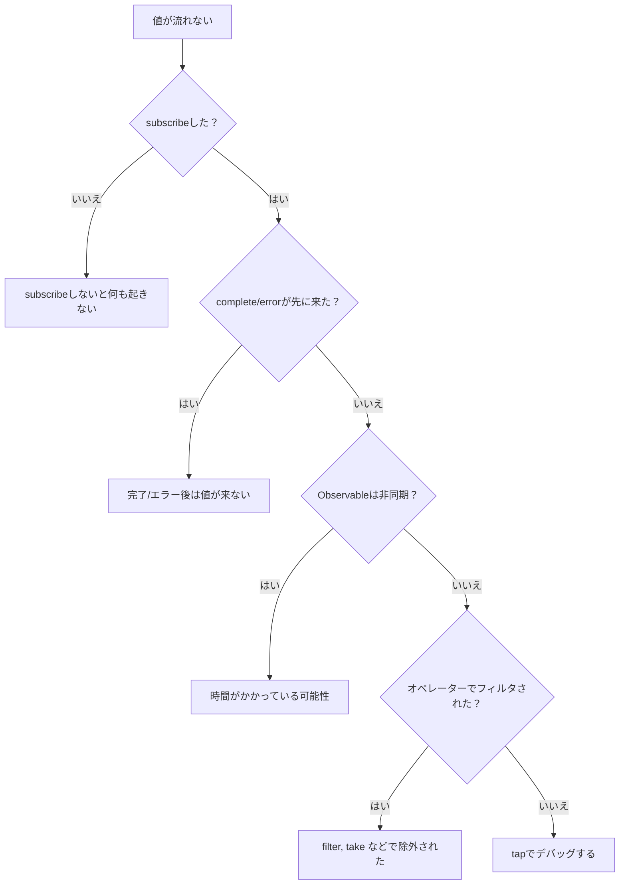

# タイミングと順序の理解

RxJSで **「なぜ値が出ない？」「順序がおかしい？」** という問題に直面することは非常に多いです。このページでは、タイミングと順序を正しく理解するための基礎知識と実践的なデバッグ手法を解説します。

## いつ値が流れるのか

### 問題：subscribe後すぐに値が出ると思っている

多くの初心者が陥る誤解は、「subscribeすれば即座に値が取得できる」というものです。

#### ❌ 悪い例：値がすぐに取れると期待
```typescript
import { of } from 'rxjs';
import { delay } from 'rxjs';

let result: number | undefined;

of(42).pipe(
  delay(100)
).subscribe(value => {
  result = value;
});

console.log(result); // undefined（まだ値が来ていない）
```

#### ✅ 良い例：subscribe内で処理する
```typescript
import { of } from 'rxjs';
import { delay } from 'rxjs';

of(42).pipe(
  delay(100)
).subscribe(value => {
  console.log(value); // 100ms後に 42 が出力される
});
```

> [!IMPORTANT] 重要な原則
> - Observableは**非同期**である可能性がある
> - 値を使う処理は**subscribe内**で行う
> - subscribe外で値を期待してはいけない

## 同期 vs 非同期の理解

### 同期Observable vs 非同期Observable

RxJSには**同期的に値を流すObservable**と**非同期的に値を流すObservable**があります。

#### 同期Observable の例

```typescript
import { of } from 'rxjs';

console.log('開始');

of(1, 2, 3).subscribe(value => {
  console.log('値:', value);
});

console.log('終了');

// 出力:
// 開始
// 値: 1
// 値: 2
// 値: 3
// 終了
```

#### 非同期Observable の例

```typescript
import { interval } from 'rxjs';
import { take } from 'rxjs';

console.log('開始');

interval(100).pipe(
  take(3)
).subscribe(value => {
  console.log('値:', value);
});

console.log('終了');

// 出力:
// 開始
// 終了
// 値: 0  (100ms後)
// 値: 1  (200ms後)
// 値: 2  (300ms後)
```

### 同期/非同期の判断基準

| Observable | 同期/非同期 | 理由 |
|---|---|---|
| `of(1, 2, 3)` | 同期 | 値が即座に確定している |
| `from([1, 2, 3])` | 同期 | 配列から即座に取得可能 |
| `interval(1000)` | 非同期 | タイマーで時間がかかる |
| `fromEvent(button, 'click')` | 非同期 | ユーザーの操作を待つ |
| `ajax('/api/data')` | 非同期 | HTTPリクエストを待つ |
| `timer(1000)` | 非同期 | 1秒後に発火 |
| `of(1).pipe(delay(100))` | 非同期 | delay で遅延される |

### よくある問題：同期と非同期の混在

#### ❌ 悪い例：順序が保証されない
```typescript
import { of } from 'rxjs';
import { delay } from 'rxjs';

console.log('1: 開始');

of('同期').subscribe(value => {
  console.log('2:', value);
});

of('非同期').pipe(
  delay(0) // 0msでも非同期になる
).subscribe(value => {
  console.log('3:', value);
});

console.log('4: 終了');

// 出力:
// 1: 開始
// 2: 同期
// 4: 終了
// 3: 非同期  ← delay(0)でも非同期キューに入る
```

#### ✅ 良い例：意図を明確にする
```typescript
import { of, concat } from 'rxjs';
import { delay } from 'rxjs';

// 順序を保証したい場合は concat を使う
concat(
  of('最初'),
  of('次').pipe(delay(100)),
  of('最後')
).subscribe(value => {
  console.log(value);
});

// 出力:
// 最初
// 次    (100ms後)
// 最後  (100ms後)
```

## Marble Diagram の読み方

Marble Diagramは、Observableの**時間軸**上での挙動を視覚化する図です。

### 基本記法

```
時間軸:  ------a----b----c----|
         ↑     ↑    ↑    ↑    ↑
         開始  値a  値b  値c  完了

記号の意味:
-  : 時間経過（約10ms）
a  : 値の発行（next）
|  : 完了（complete）
#  : エラー（error）
() : 同時発行 (a,b)
```

### 実践例1: map オペレーター

```
入力:  ----1----2----3----|
       map(x => x * 10)
出力:  ----10---20---30---|
```

```typescript
import { of } from 'rxjs';
import { map, delay, concatMap } from 'rxjs';

of(1, 2, 3).pipe(
  concatMap(v => of(v).pipe(delay(100))), // 100msごとに流す
  map(x => x * 10)
).subscribe(value => console.log(value));

// 100ms: 10
// 200ms: 20
// 300ms: 30
```

### 実践例2: merge

```
A:     ----a----b----|
B:     --c----d----e----|
       merge(A, B)
出力:  --c-a--d-b--e----|
```

```typescript
import { interval, merge } from 'rxjs';
import { map, take } from 'rxjs';

const a$ = interval(200).pipe(
  map(i => `A${i}`),
  take(2)
);

const b$ = interval(150).pipe(
  map(i => `B${i}`),
  take(3)
);

merge(a$, b$).subscribe(value => console.log(value));

// 150ms: B0
// 200ms: A0
// 300ms: B1
// 400ms: A1
// 450ms: B2
```

### 実践例3: switchMap（キャンセル）

```
外側:  ----A------B----C----|
       switchMap(x => 内側)
内側A: ----1--2|  (Bでキャンセル)
内側B:        ----3--4|  (Cでキャンセル)
内側C:             ----5--6|
出力:  ----1------3----5--6|
```

```typescript
import { fromEvent, interval } from 'rxjs';
import { switchMap, map, take } from 'rxjs';

const button = document.querySelector('button')!;

fromEvent(button, 'click').pipe(
  switchMap(() =>
    interval(100).pipe(
      map(i => `値${i}`),
      take(3)
    )
  )
).subscribe(value => console.log(value));

// クリック1 → 値0 → 値1 → (クリック2で次がキャンセル)
// クリック2 → 値0 → 値1 → 値2 → 完了
```

## Scheduler の役割

Schedulerは、Observableが**いつ・どのように値を発行するか**を制御します。

### Schedulerの種類

| Scheduler | 用途 | 説明 |
|---|---|---|
| **queueScheduler** | 同期処理 | 現在のイベントループで即座に実行 |
| **asapScheduler** | マイクロタスク | Promise.then()と同じタイミング |
| **asyncScheduler** | マクロタスク | setTimeout()と同じタイミング |
| **animationFrameScheduler** | アニメーション | requestAnimationFrame()と同じタイミング |

### 実践例：observeOn でタイミングを制御

#### ❌ 悪い例：同期処理でUIがブロックされる
```typescript
import { range } from 'rxjs';
import { map } from 'rxjs';

console.log('開始');

range(1, 1000000).pipe(
  map(x => x * x)
).subscribe(value => {
  // 100万回の計算が同期的に実行される → UIフリーズ
});

console.log('終了'); // 計算が終わってから出力される
```

#### ✅ 良い例：asyncScheduler で非同期化
```typescript
import { range, asyncScheduler } from 'rxjs';
import { map, observeOn } from 'rxjs';

console.log('開始');

range(1, 1000000).pipe(
  map(x => x * x),
  observeOn(asyncScheduler) // 非同期キューに入れる
).subscribe(value => {
  // 非同期で実行される → UIがブロックされない
});

console.log('終了'); // すぐに出力される
```

> [!TIP] Schedulerの使いどころ
> - **重い計算処理**: asyncSchedulerで非同期化してUIをブロックしない
> - **アニメーション**: animationFrameSchedulerで滑らかな描画
> - **テスト**: TestSchedulerで時間を仮想化

詳細は **[Chapter 7: スケジューラーの活用](/guide/schedulers/async-control)** を参照してください。

## よくある問題とデバッグ方法

### 問題1: 値が流れてこない

#### チェックリスト



#### デバッグ手法：tap を使う

```typescript
import { of } from 'rxjs';
import { map, filter, tap } from 'rxjs';

console.log('開始');

of(1, 2, 3, 4, 5).pipe(
  tap(v => console.log('👁️ 元の値:', v)),
  filter(x => x % 2 === 0),
  tap(v => console.log('✅ filterを通過:', v)),
  map(x => x * 10),
  tap(v => console.log('🔄 mapで変換後:', v))
).subscribe(result => {
  console.log('📦 最終結果:', result);
});

console.log('終了');

// 出力:
// 開始
// 👁️ 元の値: 1
// 👁️ 元の値: 2
// ✅ filterを通過: 2
// 🔄 mapで変換後: 20
// 📦 最終結果: 20
// 👁️ 元の値: 3
// 👁️ 元の値: 4
// ✅ filterを通過: 4
// 🔄 mapで変換後: 40
// 📦 最終結果: 40
// 👁️ 元の値: 5
// 終了
```

> [!NOTE] ポイント
> `of()`は同期Observableなので、subscribe内の処理がすべて完了してから「終了」が出力されます。tapを各段階に挟むことで、値の流れを追跡できます。

### 問題2: 順序が期待と違う

#### ❌ 悪い例：mergeMapで順序が乱れる
```typescript
import { of } from 'rxjs';
import { mergeMap, delay } from 'rxjs';

of(1, 2, 3).pipe(
  mergeMap(x =>
    of(x * 10).pipe(
      delay(Math.random() * 100) // ランダム遅延
    )
  )
).subscribe(value => console.log(value));

// 出力例: 20, 10, 30 （順序が保証されない）
```

#### ✅ 良い例：concatMapで順序を保証
```typescript
import { of } from 'rxjs';
import { concatMap, delay } from 'rxjs';

of(1, 2, 3).pipe(
  concatMap(x =>
    of(x * 10).pipe(
      delay(Math.random() * 100)
    )
  )
).subscribe(value => console.log(value));

// 出力: 10, 20, 30 （常にこの順序）
```

### 問題3: 完了しない（無限ストリーム）

#### ❌ 悪い例：完了を待つオペレーターで詰まる
```typescript
import { interval } from 'rxjs';
import { reduce } from 'rxjs';

interval(1000).pipe(
  reduce((acc, val) => acc + val, 0) // 永遠に完了しない
).subscribe(total => {
  console.log(total); // この行は実行されない
});
```

#### ✅ 良い例：takeで区切る
```typescript
import { interval } from 'rxjs';
import { reduce, take } from 'rxjs';

interval(1000).pipe(
  take(5),                            // 5個だけ取得
  reduce((acc, val) => acc + val, 0) // 完了後に合計
).subscribe(total => {
  console.log('合計:', total); // 5秒後に "合計: 10" が出力
});
```

## デバッグツールとテクニック

### 1. tap を使ったログ出力

```typescript
import { of } from 'rxjs';
import { map, filter, tap } from 'rxjs';

const debug = <T>(label: string) => tap<T>(value =>
  console.log(`[${label}]`, value)
);

of(1, 2, 3, 4, 5).pipe(
  debug('🔵 入力'),
  filter(x => x > 2),
  debug('🟢 filter後'),
  map(x => x * 10),
  debug('🟡 map後')
).subscribe();

// [🔵 入力] 1
// [🔵 入力] 2
// [🔵 入力] 3
// [🟢 filter後] 3
// [🟡 map後] 30
// [🔵 入力] 4
// [🟢 filter後] 4
// [🟡 map後] 40
// [🔵 入力] 5
// [🟢 filter後] 5
// [🟡 map後] 50
```

### 2. RxJS DevTools（ブラウザ拡張）

Chrome/Edge拡張機能「RxJS DevTools」を使うと、以下が可能になります：

- すべてのObservableをリアルタイム監視
- Marble Diagramでの可視化
- subscribe/unsubscribeの追跡

**インストール方法：**
1. Chrome Web Storeで「RxJS DevTools」を検索
2. 拡張機能を追加
3. DevToolsの「RxJS」タブを開く

### 3. カスタムデバッグオペレーター

```typescript
import { interval, map, take, tap, timestamp } from "rxjs";
import { MonoTypeOperatorFunction } from 'rxjs';


function debugWithTime<T>(label: string): MonoTypeOperatorFunction<T> {
  return source => source.pipe(
    timestamp(),
    tap(({ value, timestamp }) => {
      console.log(`[${label}] ${new Date(timestamp).toISOString()}:`, value);
    }),
    map(({ value }) => value)
  );
}

// 使い方
interval(500).pipe(
  take(3),
  debugWithTime('⏰ タイマー'),
  map(x => x * 10),
  debugWithTime('🔄 変換後')
).subscribe();

// [⏰ タイマー] 2025-10-19T10:20:59.467Z: 0
// [🔄 変換後] 2025-10-19T10:20:59.467Z: 0
// [⏰ タイマー] 2025-10-19T10:20:59.967Z: 1
// [🔄 変換後] 2025-10-19T10:20:59.967Z: 10
// [⏰ タイマー] 2025-10-19T10:21:00.467Z: 2
// [🔄 変換後] 2025-10-19T10:21:00.468Z: 20
```

### 4. Marble Testing（テストでの検証）

```typescript
import { TestScheduler } from 'rxjs/testing';
import { map } from 'rxjs';

describe('タイミングのテスト', () => {
  let scheduler: TestScheduler;

  beforeEach(() => {
    scheduler = new TestScheduler((actual, expected) => {
      expect(actual).toEqual(expected);
    });
  });

  it('mapは値を変換する', () => {
    scheduler.run(({ cold, expectObservable }) => {
      const input$  = cold('--a--b--c--|', { a: 1, b: 2, c: 3 });
      const expected =     '--x--y--z--|';
      const result$ = input$.pipe(map(v => v * 10));

      expectObservable(result$).toBe(expected, { x: 10, y: 20, z: 30 });
    });
  });
});
```

詳細は **[Chapter 9: マーブルテスト](/guide/testing/marble-testing)** を参照してください。

## 理解度チェックリスト

以下の質問に答えられるか確認してください。

```markdown
## 基本理解
- [ ] 同期Observableと非同期Observableの違いを説明できる
- [ ] Marble Diagramの基本記法（-, a, |, #）を読める
- [ ] subscribeしないと値が流れないことを理解している

## タイミング制御
- [ ] delay, debounceTime, throttleTimeの違いを説明できる
- [ ] Schedulerの役割を理解している
- [ ] observeOnとsubscribeOnの違いを説明できる

## デバッグ
- [ ] tapを使って値の流れをデバッグできる
- [ ] 値が流れない原因を特定できる
- [ ] 順序が期待と違う場合の対処法を知っている

## 実践
- [ ] 無限Observableをtakeで区切れる
- [ ] mergeMapとconcatMapの順序の違いを実装できる
- [ ] エラー時のタイミングをcatchErrorで制御できる
```

## 次のステップ

タイミングと順序を理解したら、次は**状態管理と共有**を学びましょう。

→ **状態管理の難しさ**（準備中） - Subject、share/shareReplayの使い分け

## 関連ページ

- **[Chapter 7: スケジューラーの活用](/guide/schedulers/async-control)** - Schedulerの詳細
- **[Chapter 9: マーブルテスト](/guide/testing/marble-testing)** - TestSchedulerでタイミングをテスト
- **[Chapter 8: RxJSのデバッグ手法](/guide/debugging/)** - デバッグの全体像
- **[オペレーター選択の迷い](/guide/overcoming-difficulties/operator-selection)** - 適切なオペレーターの選び方

## 🎯 練習問題

### 問題1: 同期と非同期の判別

以下のObservableは同期・非同期のどちらですか？

```typescript
// A
of(1, 2, 3)

// B
from([1, 2, 3])

// C
of(1, 2, 3).pipe(delay(0))

// D
Promise.resolve(42)

// E
interval(1000).pipe(take(3))
```

<details>
<summary>解答</summary>

- **A: 同期** - `of`は値を即座に発行
- **B: 同期** - `from`は配列を即座に展開
- **C: 非同期** - `delay(0)`でも非同期キューに入る
- **D: 非同期** - Promiseは常に非同期
- **E: 非同期** - `interval`はタイマーベース

> [!NOTE] ポイント
> `delay(0)`や`Promise`は、たとえ遅延が0ミリ秒でも非同期として扱われます。

</details>

### 問題2: Marble Diagramの読解

以下のMarble Diagramの出力を予測してください。

```typescript
import { of, zip } from 'rxjs';
import { delay } from 'rxjs';

const a$ = of(1, 2, 3);
const b$ = of('A', 'B', 'C').pipe(delay(100));

zip(a$, b$).subscribe(console.log);
```

```
Marble Diagram:
a$:  (123)|
b$:  -----(ABC)|
     zip(a$, b$)
出力: ?
```

<details>
<summary>解答</summary>

```typescript
// 100ms後に一度に出力:
[1, 'A']
[2, 'B']
[3, 'C']
```

> [!NOTE] 理由
> `zip`は両方のストリームから値が揃うまで待つため、`b$`のdelay(100)が解除されるまで出力されません。`a$`は同期的に値を発行しますが、`b$`を待ってからペアを作ります。

</details>

### 問題3: 順序の保証

以下のコードで、出力順序を保証したい場合、どのオペレーターを使うべきですか？

```typescript
import { of } from 'rxjs';
import { mergeMap, delay } from 'rxjs';

of('A', 'B', 'C').pipe(
  mergeMap(letter =>
    of(`${letter}完了`).pipe(
      delay(Math.random() * 100)
    )
  )
).subscribe(console.log);

// 現在の出力: 順序がランダム（例: B完了, A完了, C完了）
// 期待する出力: A完了, B完了, C完了
```

<details>
<summary>解答</summary>

**修正コード：**
```typescript
import { of } from 'rxjs';
import { concatMap, delay } from 'rxjs';

of('A', 'B', 'C').pipe(
  concatMap(letter =>  // mergeMap → concatMap
    of(`${letter}完了`).pipe(
      delay(Math.random() * 100)
    )
  )
).subscribe(console.log);

// 出力: A完了, B完了, C完了（必ずこの順序）
```

> [!NOTE] 理由
> - `mergeMap`: 並列実行するため、完了順序は保証されない
> - `concatMap`: 順次実行するため、入力と同じ順序で出力される

</details>

### 問題4: 無限ストリームの扱い

以下のコードの問題点を指摘し、修正してください。

```typescript
import { interval } from 'rxjs';
import { map, toArray } from 'rxjs';

interval(1000).pipe(
  map(x => x * 2),
  toArray()
).subscribe(arr => {
  console.log('配列:', arr); // この行は実行される？
});
```

<details>
<summary>解答</summary>

**問題点：**
- `interval`は無限に値を発行するため、完了しない
- `toArray()`は完了シグナルを待つため、永遠に値が出ない

**修正コード：**
```typescript
import { interval } from 'rxjs';
import { map, take, toArray } from 'rxjs';

interval(1000).pipe(
  take(5),          // 5個だけ取得して完了
  map(x => x * 2),
  toArray()
).subscribe(arr => {
  console.log('配列:', arr); // [0, 2, 4, 6, 8]
});
```

> [!IMPORTANT] ポイント
> 無限ストリームに対して`reduce`, `toArray`, `last`などの「完了を待つオペレーター」を使う場合は、必ず`take`, `first`, `takeUntil`などで区切る必要があります。

</details>
