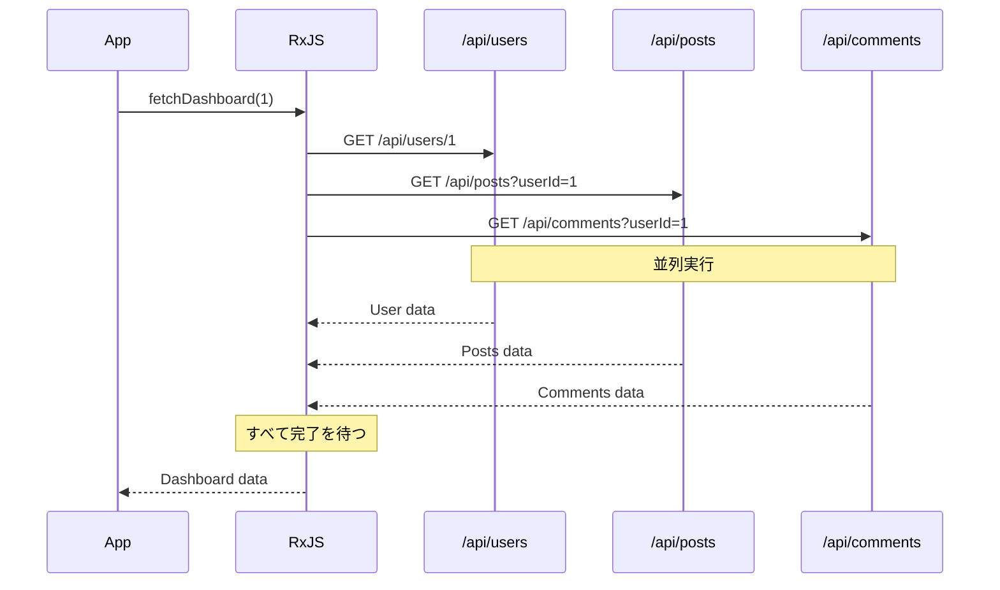
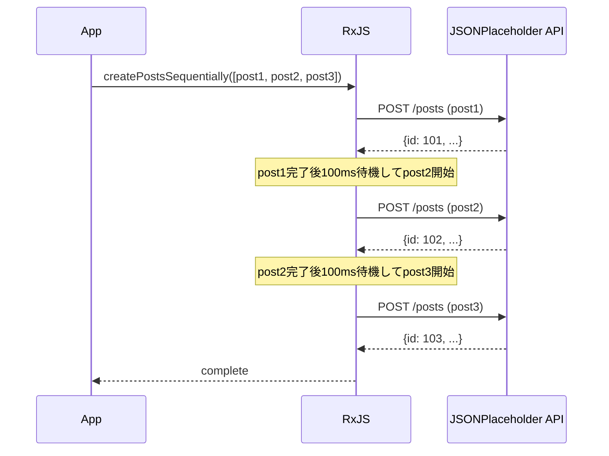
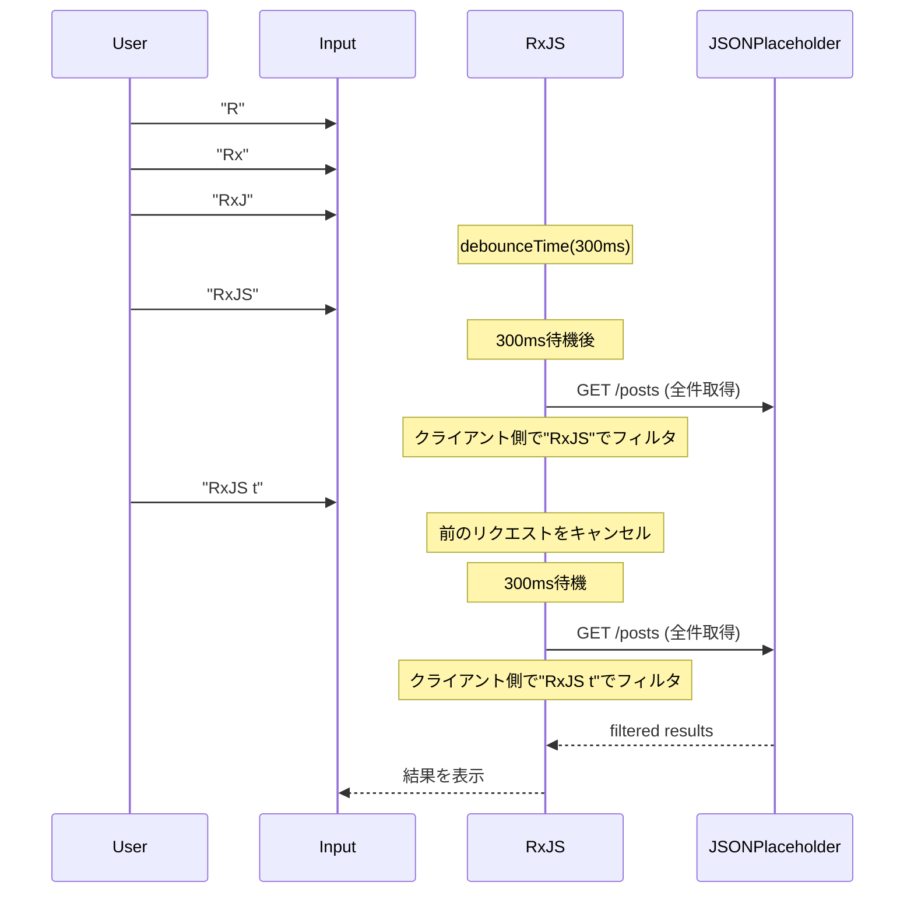

# API呼び出しパターン

Web開発において、API呼び出しは最も頻繁に実装する処理の一つです。RxJSを使うことで、複雑な非同期API呼び出しを宣言的かつ堅牢に実装できます。

この記事では、実務で遭遇する様々なAPI呼び出しのシナリオに対する具体的な実装パターンを、エラーハンドリングやキャンセル処理を含めて解説します。

## この記事で学べること

- 基本的なGET/POSTリクエストの実装
- 複数APIの並列呼び出し（forkJoin）
- 順次実行が必要な直列リクエスト（concatMap）
- 依存関係のあるリクエストの連鎖（switchMap）
- リトライとエラーハンドリング
- タイムアウト処理
- リクエストのキャンセル処理

> [!TIP] 前提知識
> この記事は、[Chapter 4: オペレーター](../operators/index.md) と [Chapter 6: エラーハンドリング](../error-handling/strategies.md) の知識を前提としています。

## 基本的なAPI呼び出し

### 問題：シンプルなGETリクエスト

最も基本的なケースとして、単一のGETリクエストを実装します。

### 実装例

```typescript
import { from, Observable, map, catchError, timeout } from 'rxjs';

// JSONPlaceholder APIのUser型
// https://jsonplaceholder.typicode.com/users
interface User {
  id: number;
  name: string;
  username: string;
  email: string;
  address: {
    street: string;
    suite: string;
    city: string;
    zipcode: string;
    geo: {
      lat: string;
      lng: string;
    };
  };
  phone: string;
  website: string;
  company: {
    name: string;
    catchPhrase: string;
    bs: string;
  };
}

// ユーザー一覧を取得
function fetchUsers(): Observable<User[]> {
  return from(
    fetch('https://jsonplaceholder.typicode.com/users')
      .then(response => {
        if (!response.ok) {
          throw new Error(`HTTP error! status: ${response.status}`);
        }
        return response.json();
      })
  ).pipe(
    timeout(5000), // 5秒でタイムアウト
    catchError(err => {
      console.error('ユーザー取得エラー:', err);
      throw err;
    })
  );
}

// 使用例
fetchUsers().subscribe({
  next: users => {
    console.log('ユーザー一覧:', users);
    console.log('最初のユーザー:', users[0].name); // 例: "Leanne Graham"
  },
  error: err => console.error('エラー:', err)
});
```

> [!NOTE] from() vs ajax()
> この例では標準の `fetch` を `from()` でラップしていますが、RxJS公式の `ajax()` を使うこともできます。`ajax()` はより高機能で、リクエストのキャンセルやプログレス監視に対応しています。

### POSTリクエスト

新しいデータを作成する場合のパターンです。

```typescript
import { from, Observable, catchError } from 'rxjs';

// JSONPlaceholder APIのPost型
// https://jsonplaceholder.typicode.com/posts
interface Post {
  id: number;
  userId: number;
  title: string;
  body: string;
}

interface CreatePostRequest {
  userId: number;
  title: string;
  body: string;
}

function createPost(postData: CreatePostRequest): Observable<Post> {
  return from(
    fetch('https://jsonplaceholder.typicode.com/posts', {
      method: 'POST',
      headers: {
        'Content-Type': 'application/json',
      },
      body: JSON.stringify(postData)
    }).then(response => {
      if (!response.ok) {
        throw new Error(`HTTP error! status: ${response.status}`);
      }
      return response.json();
    })
  ).pipe(
    catchError(err => {
      console.error('投稿作成エラー:', err);
      throw err;
    })
  );
}

// 使用例
createPost({
  userId: 1,
  title: 'RxJSの学習',
  body: 'RxJSを使ったAPI呼び出しのパターンを学んでいます。'
}).subscribe({
  next: post => {
    console.log('作成された投稿:', post);
    console.log('投稿ID:', post.id); // JSONPlaceholderは自動的にIDを割り当てます（例: 101）
  },
  error: err => console.error('エラー:', err)
});
```

> [!TIP] 実践的なヒント
> - **型安全性**: レスポンスの型を明確に定義する
> - **エラーハンドリング**: HTTPステータスコードを適切にチェック
> - **タイムアウト**: 長時間待たされるのを防ぐ

## 並列リクエスト（forkJoin）

### 問題：複数のAPIを同時に呼び出したい

複数の独立したAPIを並列で呼び出し、すべてのレスポンスが揃ってから処理を進めたい場合があります。

### 解決策：forkJoinを使う

`forkJoin` は、複数のObservableをすべて完了するまで待ち、すべての結果を配列で返します（Promise.allに相当）。

```typescript
import { forkJoin, from, Observable, map } from 'rxjs';

// JSONPlaceholder APIのComment型
// https://jsonplaceholder.typicode.com/comments
interface Comment {
  postId: number;
  id: number;
  name: string;
  email: string;
  body: string;
}
interface Post {
  id: number;
  userId: number;
  title: string;
  body: string;
}
interface User {
  id: number;
  name: string;
  username: string;
  email: string;
  address: {
    street: string;
    suite: string;
    city: string;
    zipcode: string;
    geo: {
      lat: string;
      lng: string;
    };
  };
  phone: string;
  website: string;
  company: {
    name: string;
    catchPhrase: string;
    bs: string;
  };
}
interface Dashboard {
  user: User;
  posts: Post[];
  comments: Comment[];
}

function fetchUserById(id: number): Observable<User> {
  return from(
    fetch(`https://jsonplaceholder.typicode.com/users/${id}`).then(r => r.json())
  );
}

function fetchPostsByUserId(userId: number): Observable<Post[]> {
  return from(
    fetch(`https://jsonplaceholder.typicode.com/posts?userId=${userId}`).then(r => r.json())
  );
}

function fetchCommentsByPostId(postId: number): Observable<Comment[]> {
  return from(
    fetch(`https://jsonplaceholder.typicode.com/comments?postId=${postId}`).then(r => r.json())
  );
}

// ダッシュボードデータを並列取得
function fetchDashboard(userId: number): Observable<Dashboard> {
  return forkJoin({
    user: fetchUserById(userId),
    posts: fetchPostsByUserId(userId),
    comments: fetchCommentsByPostId(1) // 投稿ID=1のコメントを取得
  }).pipe(
    map(({ user, posts, comments }) => ({
      user,
      posts,
      comments
    }))
  );
}

// 使用例
fetchDashboard(1).subscribe({
  next: dashboard => {
    console.log('ユーザー:', dashboard.user.name); // 例: "Leanne Graham"
    console.log('投稿数:', dashboard.posts.length); // 例: 10件
    console.log('コメント数:', dashboard.comments.length); // 例: 5件
  },
  error: err => console.error('ダッシュボード取得エラー:', err)
});
```

#### 実行の流れ



> [!IMPORTANT] forkJoinの特性
> - すべてのObservableが完了するまで待つ
> - **いずれか一つでもエラーになると、全体がエラーになる**
> - すべてのObservableが少なくとも1つの値を発行する必要がある

### エラーハンドリングを強化する

並列リクエストでは、一部がエラーになっても他の結果を取得したい場合があります。

```typescript
import { forkJoin, of, catchError } from 'rxjs';

function fetchDashboardWithFallback(userId: number): Observable<Dashboard> {
  return forkJoin({
    user: fetchUserById(userId).pipe(
      catchError(err => {
        console.error('ユーザー取得エラー:', err);
        return of(null); // エラー時はnullを返す
      })
    ),
    posts: fetchPostsByUserId(userId).pipe(
      catchError(err => {
        console.error('投稿取得エラー:', err);
        return of([]); // エラー時は空配列を返す
      })
    ),
    comments: fetchCommentsByUserId(userId).pipe(
      catchError(err => {
        console.error('コメント取得エラー:', err);
        return of([]); // エラー時は空配列を返す
      })
    )
  }).pipe(
    map(({ user, posts, comments }) => ({
      user: user || { id: userId, name: 'Unknown', email: '' },
      posts,
      comments
    }))
  );
}
```

> [!TIP] 部分的なエラーハンドリング
> 各Observableに `catchError` を適用することで、一部がエラーになっても全体の処理を継続できます。

## 直列リクエスト（concatMap）

### 問題：APIを順番に実行したい

前のリクエストが完了してから次のリクエストを実行したい場合（例：複数のファイルアップロードを順番に実行）。

### 解決策：concatMapを使う

`concatMap` は、前のObservableが完了してから次のObservableを実行します。

```typescript
import { from, Observable, concatMap, tap, delay, catchError } from 'rxjs';

// JSONPlaceholder APIのPost型
// https://jsonplaceholder.typicode.com/posts
interface Post {
  id: number;
  userId: number;
  title: string;
  body: string;
}

interface CreatePostRequest {
  userId: number;
  title: string;
  body: string;
}

function createPost(postData: CreatePostRequest): Observable<Post> {
  return from(
    fetch('https://jsonplaceholder.typicode.com/posts', {
      method: 'POST',
      headers: {
        'Content-Type': 'application/json',
      },
      body: JSON.stringify(postData)
    }).then(response => {
      if (!response.ok) {
        throw new Error(`HTTP error! status: ${response.status}`);
      }
      return response.json();
    })
  ).pipe(
    catchError(err => {
      console.error('投稿作成エラー:', err);
      throw err;
    })
  );
}

// 複数の投稿を順番に作成する（APIレート制限を考慮）
function createPostsSequentially(posts: CreatePostRequest[]): Observable<Post> {
  return from(posts).pipe(
    concatMap((postData, index) =>
      createPost(postData).pipe(
        tap(result => console.log(`投稿${index + 1}作成完了:`, result.title)),
        delay(100) // APIレート制限を考慮して100ms待機
      )
    )
  );
}

// 使用例
const postsToCreate: CreatePostRequest[] = [
  {
    userId: 1,
    title: '1つ目の投稿',
    body: 'これは1つ目の投稿です。'
  },
  {
    userId: 1,
    title: '2つ目の投稿',
    body: 'これは2つ目の投稿です。'
  },
  {
    userId: 1,
    title: '3つ目の投稿',
    body: 'これは3つ目の投稿です。'
  }
];

const results: Post[] = [];

createPostsSequentially(postsToCreate).subscribe({
  next: post => {
    results.push(post);
    console.log(`進捗: ${results.length}/${postsToCreate.length}`);
  },
  complete: () => {
    console.log('すべての投稿作成完了:', results.length, '件');
  },
  error: err => console.error('投稿作成エラー:', err)
});
```

#### 実行の流れ



> [!NOTE] concatMap vs mergeMap
> - **concatMap**: 順番に実行（前が完了してから次）
> - **mergeMap**: 並列実行（同時に複数実行可能）
>
> 順序が重要な場合は `concatMap`、順序が不要で速度優先なら `mergeMap` を使用します。

## 依存関係のあるリクエスト（switchMap）

### 問題：前のAPIレスポンスを使って次のAPIを呼ぶ

最も一般的なパターンの一つで、最初のAPIレスポンスの結果を使って次のAPIを呼び出します。

### 解決策：switchMapを使う

`switchMap` は、前のObservableの値を受け取り、新しいObservableに変換します。

```typescript
import { from, Observable, switchMap, map } from 'rxjs';

interface UserProfile {
  user: User;
  posts: Post[];
}
interface Post {
  id: number;
  userId: number;
  title: string;
  body: string;
}
interface User {
  id: number;
  name: string;
  username: string;
  email: string;
  address: {
    street: string;
    suite: string;
    city: string;
    zipcode: string;
    geo: {
      lat: string;
      lng: string;
    };
  };
  phone: string;
  website: string;
  company: {
    name: string;
    catchPhrase: string;
    bs: string;
  };
}

function fetchUserById(id: number): Observable<User> {
  return from(
    fetch(`https://jsonplaceholder.typicode.com/users/${id}`).then(r => r.json())
  );
}

function fetchPostsByUserId(userId: number): Observable<Post[]> {
  return from(
    fetch(`https://jsonplaceholder.typicode.com/posts?userId=${userId}`).then(r => r.json())
  );
}

// ユーザー詳細とその投稿を取得
function fetchUserProfile(userId: number): Observable<UserProfile> {
  return fetchUserById(userId).pipe(
    switchMap(user =>
      // ユーザー情報を取得後、その投稿を取得
      fetchPostsByUserId(user.id).pipe(
        map(posts => ({
          user,
          posts
        }))
      )
    )
  );
}

// 使用例
fetchUserProfile(1).subscribe({
  next: profile => {
    console.log('ユーザー:', profile.user.name);
    console.log('投稿:', profile.posts);
  },
  error: err => console.error('エラー:', err)
});
```

### 実践例：検索機能の実装

ユーザーの検索入力に応じてAPIを呼び出す、実務で頻出のパターンです。

```typescript
import { from, fromEvent, Observable, of, map, debounceTime, distinctUntilChanged, switchMap, catchError } from 'rxjs';

// JSONPlaceholder の Post を検索結果として使用
interface SearchResult {
  id: number;
  userId: number;
  title: string;
  body: string;
}

function searchAPI(query: string): Observable<SearchResult[]> {
  return from(
    fetch('https://jsonplaceholder.typicode.com/posts')
      .then(response => {
        if (!response.ok) {
          throw new Error(`HTTP error! status: ${response.status}`);
        }
        return response.json();
      })
  ).pipe(
    // クライアントサイドでタイトルによるフィルタリング
    map((posts: SearchResult[]) =>
      posts.filter(post =>
        post.title.toLowerCase().includes(query.toLowerCase())
      )
    )
  );
}

// Traditional approach (commented for reference)
// const searchInput = document.querySelector<HTMLInputElement>('#search');

// Self-contained: creates search input and results container dynamically
const searchInput = document.createElement('input');
searchInput.id = 'search';
searchInput.type = 'text';
searchInput.placeholder = '検索キーワードを入力（2文字以上）';
searchInput.style.padding = '10px';
searchInput.style.margin = '10px';
searchInput.style.width = '400px';
searchInput.style.fontSize = '16px';
searchInput.style.border = '2px solid #ccc';
searchInput.style.borderRadius = '4px';
searchInput.style.display = 'block';
document.body.appendChild(searchInput);

const resultsContainer = document.createElement('div');
resultsContainer.id = 'results';
resultsContainer.style.padding = '10px';
resultsContainer.style.margin = '10px';
resultsContainer.style.minHeight = '100px';
resultsContainer.style.border = '1px solid #ddd';
resultsContainer.style.borderRadius = '4px';
resultsContainer.style.backgroundColor = '#f9f9f9';
document.body.appendChild(resultsContainer);

const search$ = fromEvent(searchInput, 'input').pipe(
  map(event => (event.target as HTMLInputElement).value),
  debounceTime(300),           // 入力後300ms待つ
  distinctUntilChanged(),      // 前回と同じ値なら無視
  switchMap(query => {
    if (query.length < 2) {
      return of([]); // 2文字未満なら空配列
    }
    return searchAPI(query).pipe(
      catchError(err => {
        console.error('検索エラー:', err);
        return of([]); // エラー時は空配列
      })
    );
  })
);

search$.subscribe(results => {
  console.log('検索結果:', results);
  // UIに結果を表示
  displayResults(results, resultsContainer);
});

function displayResults(results: SearchResult[], container: HTMLElement): void {
  // 結果をDOMに表示する処理
  container.innerHTML = results
    .map(r => `<div style="padding: 8px; margin: 4px; border-bottom: 1px solid #eee;">${r.title}</div>`)
    .join('');

  if (results.length === 0) {
    container.innerHTML = '<div style="padding: 8px; color: #999;">検索結果がありません</div>';
  }
}
```

> [!TIP] クライアントサイドフィルタリング
> JSONPlaceholder APIには検索エンドポイントがないため、全投稿を取得してクライアント側でフィルタリングしています。実務では、バックエンドに検索機能がない場合や、データ量が少ない場合にこのパターンを使用します。
>
> **検索例**：
> - "sunt" で検索 → 複数の投稿がヒット
> - "qui est esse" で検索 → "qui est esse" を含むタイトルがヒット
> - "zzz" で検索 → 検索結果がありません（該当なし）

#### 実行の流れ



> [!IMPORTANT] switchMapの重要な特性
> **新しい値が来ると、前のObservableを自動的にキャンセルします。**
> これにより、古いAPIリクエストのレスポンスが後から届いても無視されます（Race Conditionの回避）。

### switchMap vs mergeMap vs concatMap

高階マッピングオペレーターの使い分けです。

| オペレーター | 動作 | 使用ケース |
|------------|------|-----------|
| `switchMap` | 新しい値が来ると前をキャンセル | **検索、オートコンプリート**（最新の結果のみ必要） |
| `mergeMap` | すべてを並列実行 | **並列処理**（順序不問、すべての結果が必要） |
| `concatMap` | 順番に実行（前が完了してから次） | **順序が重要な処理**（ファイルアップロード等） |
| `exhaustMap` | 前が完了するまで新しい値を無視 | **二重送信防止**（ボタン連打対策） |

```typescript
// switchMap: 最新の検索結果のみ表示
searchInput$.pipe(
  switchMap(query => searchAPI(query))
);

// mergeMap: すべてのファイルを並列アップロード
from(files).pipe(
  mergeMap(file => uploadFile(file))
);

// concatMap: ファイルを順番にアップロード
from(files).pipe(
  concatMap(file => uploadFile(file))
);

// exhaustMap: フォーム送信の二重送信を防止
submitButton$.pipe(
  exhaustMap(() => submitForm())
);
```

## リトライとエラーハンドリング

### 問題：一時的なネットワークエラーに対応したい

ネットワークエラーやタイムアウトが発生した場合、自動的にリトライしたい場合があります。

### 解決策：retryとretryWhenを使う

```typescript
import { from, Observable, timer } from 'rxjs';
import { retry, retryWhen, mergeMap, catchError, of, timeout } from 'rxjs';

// JSONPlaceholder APIのUser型
// https://jsonplaceholder.typicode.com/users
interface User {
  id: number;
  name: string;
  username: string;
  email: string;
  address: {
    street: string;
    suite: string;
    city: string;
    zipcode: string;
    geo: {
      lat: string;
      lng: string;
    };
  };
  phone: string;
  website: string;
  company: {
    name: string;
    catchPhrase: string;
    bs: string;
  };
}

function fetchUsers(): Observable<User[]> {
  return from(
    fetch('https://jsonplaceholder.typicode.com/users')
      .then(response => {
        if (!response.ok) {
          throw new Error(`HTTP error! status: ${response.status}`);
        }
        return response.json();
      })
  ).pipe(
    timeout(5000), // 5秒でタイムアウト
    catchError(err => {
      console.error('ユーザー取得エラー:', err);
      throw err;
    })
  );
}

// シンプルなリトライ（即座に3回まで）
function fetchWithSimpleRetry(): Observable<User[]> {
  return fetchUsers().pipe(
    retry(3), // エラー時に3回まで再試行
    catchError(err => {
      console.error('リトライ後もエラー:', err);
      return of([]); // 最終的にエラーなら空配列を返す
    })
  );
}

// 指数バックオフでリトライ
function fetchWithExponentialBackoff(): Observable<User[]> {
  return fetchUsers().pipe(
    retryWhen(errors =>
      errors.pipe(
        mergeMap((error, index) => {
          const retryAttempt = index + 1;

          // 最大3回までリトライ
          if (retryAttempt > 3) {
            throw error;
          }

          // 指数バックオフ: 1秒、2秒、4秒
          const delayMs = Math.pow(2, index) * 1000;
          console.log(`リトライ ${retryAttempt}/3 (${delayMs}ms後)`);

          return timer(delayMs);
        })
      )
    ),
    catchError(err => {
      console.error('リトライ後もエラー:', err);
      return of([]);
    })
  );
}

// 使用例
fetchWithExponentialBackoff().subscribe({
  next: users => console.log('ユーザー取得成功:', users),
  error: err => console.error('最終エラー:', err)
});
```

**指数バックオフの実行例：**

```
1回目の試行: 即座に実行
↓ エラー
2回目の試行: 1秒待機後に実行
↓ エラー
3回目の試行: 2秒待機後に実行
↓ エラー
4回目の試行: 4秒待機後に実行
↓ 成功 or 最終エラー
```

> [!TIP] リトライ戦略の選択
> - **即座にリトライ**: `retry(3)` - シンプル、ネットワーク瞬断に有効
> - **固定間隔**: `retryWhen` + `delay(1000)` - サーバー負荷を考慮
> - **指数バックオフ**: `retryWhen` + `timer` - AWS等のベストプラクティス

### 特定のエラーのみリトライする

すべてのエラーをリトライすべきではありません（例：401 Unauthorizedはリトライ不要）。

```typescript
import { throwError } from 'rxjs';

interface HttpError {
  status: number;
  message: string;
}

function shouldRetry(error: HttpError): boolean {
  // リトライすべきステータスコード
  const retryableStatuses = [408, 429, 500, 502, 503, 504];
  return retryableStatuses.includes(error.status);
}

function fetchWithConditionalRetry(): Observable<User[]> {
  return fetchUsers().pipe(
    retryWhen(errors =>
      errors.pipe(
        mergeMap((error: HttpError, index) => {
          const retryAttempt = index + 1;

          // リトライ不可能なエラー
          if (!shouldRetry(error)) {
            console.error('リトライ不可能なエラー:', error);
            return throwError(() => error);
          }

          // 最大3回まで
          if (retryAttempt > 3) {
            return throwError(() => error);
          }

          const delayMs = Math.pow(2, index) * 1000;
          console.log(`リトライ ${retryAttempt}/3 (status: ${error.status})`);

          return timer(delayMs);
        })
      )
    ),
    catchError(err => {
      console.error('最終エラー:', err);
      return of([]);
    })
  );
}
```

> [!WARNING] リトライの注意点
> - **POSTリクエスト**: べき等性がない場合、リトライで重複作成のリスク
> - **認証エラー**: 401/403はリトライせず、再ログインを促す
> - **バリデーションエラー**: 400はリトライ不要、ユーザーに修正を促す

## タイムアウト処理

### 問題：APIレスポンスが遅い場合に対処したい

ネットワークが遅い、またはサーバーが応答しない場合、一定時間でタイムアウトさせたい。

### 解決策：timeoutオペレーターを使う

```typescript
import { timeout, catchError, of, from, Observable, throwError } from 'rxjs';

// JSONPlaceholder APIのUser型
// https://jsonplaceholder.typicode.com/users
interface User {
  id: number;
  name: string;
  username: string;
  email: string;
  address: {
    street: string;
    suite: string;
    city: string;
    zipcode: string;
    geo: {
      lat: string;
      lng: string;
    };
  };
  phone: string;
  website: string;
  company: {
    name: string;
    catchPhrase: string;
    bs: string;
  };
}

function fetchUsers(): Observable<User[]> {
  return from(
    fetch('https://jsonplaceholder.typicode.com/users')
      .then(response => {
        if (!response.ok) {
          throw new Error(`HTTP error! status: ${response.status}`);
        }
        return response.json();
      })
  ).pipe(
    timeout(5000), // 5秒でタイムアウト
    catchError(err => {
      console.error('ユーザー取得エラー:', err);
      throw err;
    })
  );
}

// 5秒でタイムアウト
function fetchWithTimeout(): Observable<User[]> {
  return fetchUsers().pipe(
    timeout(5000), // 5秒以内にレスポンスがなければエラー
    catchError(err => {
      if (err.name === 'TimeoutError') {
        console.error('リクエストがタイムアウトしました');
        // タイムアウト時のフォールバック処理
        return of([]); // 空配列を返す
      }
      throw err; // その他のエラーは再スロー
    })
  );
}

// カスタムタイムアウトメッセージ
function fetchWithCustomTimeout(): Observable<User[]> {
  return fetchUsers().pipe(
    timeout({
      each: 5000,
      with: () => throwError(() => new Error('カスタムタイムアウトエラー'))
    }),
    catchError(err => {
      console.error('エラー:', err.message);
      return of([]);
    })
  );
}
```

### リトライとタイムアウトの組み合わせ

実践的には、タイムアウトとリトライを組み合わせて使用します。

```typescript
function fetchWithTimeoutAndRetry(): Observable<User[]> {
  return fetchUsers().pipe(
    timeout(5000),           // 各試行で5秒タイムアウト
    retry(3),                // タイムアウトしたら3回リトライ
    catchError(err => {
      console.error('タイムアウトとリトライ後もエラー:', err);
      return of([]);
    })
  );
}
```

> [!TIP] タイムアウト値の設定
> - **通常のAPI**: 5秒 - 10秒
> - **高速API**: 2秒 - 3秒
> - **ファイルアップロード**: 30秒 - 60秒
> - **バックグラウンド処理**: 60秒以上
>
> ユーザー体験とサーバー負荷のバランスを考慮して設定します。

## リクエストのキャンセル処理

### 問題：不要になったAPIリクエストをキャンセルしたい

ページ遷移やコンポーネントの破棄時に、実行中のAPIリクエストをキャンセルしたい。

### 解決策：takeUntilを使う

```typescript
import { Subject, takeUntil, from, timeout, catchError } from 'rxjs';

// JSONPlaceholder APIのUser型
// https://jsonplaceholder.typicode.com/users
interface User {
  id: number;
  name: string;
  username: string;
  email: string;
  address: {
    street: string;
    suite: string;
    city: string;
    zipcode: string;
    geo: {
      lat: string;
      lng: string;
    };
  };
  phone: string;
  website: string;
  company: {
    name: string;
    catchPhrase: string;
    bs: string;
  };
}

class UserListManager {
  private destroy$ = new Subject<void>();
  private users: User[] = [];

  
   fetchUsers(): Observable<User[]> {
    return from(
      fetch('https://jsonplaceholder.typicode.com/users')
        .then(response => {
          if (!response.ok) {
            throw new Error(`HTTP error! status: ${response.status}`);
          }
          return response.json();
        })
    ).pipe(
      timeout(5000), // 5秒でタイムアウト
      catchError(err => {
        console.error('ユーザー取得エラー:', err);
        throw err;
      })
    );
  }

  init(): void {
    // 初期化時にユーザー一覧を取得
    this.fetchUsers().pipe(
      takeUntil(this.destroy$) // インスタンス破棄時に自動キャンセル
    ).subscribe({
      next: (users: User[]) => {
        this.users = users;
        console.log('ユーザー取得完了:', users);
      },
      error: (err: any) => console.error('エラー:', err)
    });
  }

  destroy(): void {
    // インスタンス破棄時に発火
    this.destroy$.next();
    this.destroy$.complete();
  }
}

// 使用例
const userList = new UserListManager();
userList.init();

// クリーンアップが必要な時
// userList.destroy();
```

### ユーザー操作によるキャンセル

明示的なキャンセルボタンを実装する例です。

```typescript
// Traditional approach (commented for reference)
// const cancelButton = document.querySelector<HTMLButtonElement>('#cancel');
// const loadButton = document.querySelector<HTMLButtonElement>('#load');

// Self-contained: creates load and cancel buttons dynamically
const loadButton = document.createElement('button');
loadButton.id = 'load';
loadButton.textContent = 'ユーザー読み込み';
loadButton.style.padding = '10px 20px';
loadButton.style.margin = '10px';
loadButton.style.fontSize = '16px';
loadButton.style.fontWeight = 'bold';
loadButton.style.color = '#fff';
loadButton.style.backgroundColor = '#4CAF50';
loadButton.style.border = 'none';
loadButton.style.borderRadius = '4px';
loadButton.style.cursor = 'pointer';
document.body.appendChild(loadButton);

const cancelButton = document.createElement('button');
cancelButton.id = 'cancel';
cancelButton.textContent = 'キャンセル';
cancelButton.style.padding = '10px 20px';
cancelButton.style.margin = '10px';
cancelButton.style.fontSize = '16px';
cancelButton.style.fontWeight = 'bold';
cancelButton.style.color = '#fff';
cancelButton.style.backgroundColor = '#f44336';
cancelButton.style.border = 'none';
cancelButton.style.borderRadius = '4px';
cancelButton.style.cursor = 'pointer';
document.body.appendChild(cancelButton);

const statusDisplay = document.createElement('div');
statusDisplay.id = 'status';
statusDisplay.style.padding = '10px';
statusDisplay.style.margin = '10px';
statusDisplay.style.fontSize = '14px';
statusDisplay.style.minHeight = '20px';
document.body.appendChild(statusDisplay);

const cancel$ = fromEvent(cancelButton, 'click');

fromEvent(loadButton, 'click').pipe(
  switchMap(() => {
    statusDisplay.textContent = '読み込み中...';
    statusDisplay.style.color = '#FF9800';
    return fetchUsers().pipe(
      takeUntil(cancel$) // キャンセルボタンクリックで中断
    );
  })
).subscribe({
  next: users => {
    console.log('ユーザー取得完了:', users);
    statusDisplay.textContent = `ユーザー取得完了: ${users.length}件`;
    statusDisplay.style.color = '#4CAF50';
  },
  error: err => {
    if (err.name === 'AbortError') {
      console.log('リクエストがキャンセルされました');
      statusDisplay.textContent = 'リクエストがキャンセルされました';
      statusDisplay.style.color = '#999';
    } else {
      console.error('エラー:', err);
      statusDisplay.textContent = `エラー: ${err.message}`;
      statusDisplay.style.color = '#f44336';
    }
  }
});
```

> [!IMPORTANT] キャンセルのベストプラクティス
> - **必ずキャンセル処理を実装する** - メモリリークやネットワーク無駄遣いを防ぐ
> - **takeUntilを使う** - unsubscribe()より宣言的で忘れにくい
> - **コンポーネント破棄時** - destroy$を発火してすべての購読を解除

## 実践的なサービスクラスの例

これまでのパターンをまとめた、実務で使える完全なサービスクラスの例です。

```typescript
import { Observable, Subject, throwError, timer, catchError, retryWhen, mergeMap, timeout, shareReplay, takeUntil, from } from 'rxjs';

// JSONPlaceholder APIのUser型
// https://jsonplaceholder.typicode.com/users
interface User {
  id: number;
  name: string;
  username: string;
  email: string;
  address: {
    street: string;
    suite: string;
    city: string;
    zipcode: string;
    geo: {
      lat: string;
      lng: string;
    };
  };
  phone: string;
  website: string;
  company: {
    name: string;
    catchPhrase: string;
    bs: string;
  };
}
interface Post {
  id: number;
  userId: number;
  title: string;
  body: string;
}

export class ApiService {
  private destroy$ = new Subject<void>();
  private cache = new Map<string, Observable<any>>();

  /**
   * 基本的なGETリクエスト
   */
  get<T>(url: string, options?: RequestOptions): Observable<T> {
    return this.request<T>('GET', url, options);
  }

  /**
   * POSTリクエスト
   */
  post<T>(url: string, body: any, options?: RequestOptions): Observable<T> {
    return this.request<T>('POST', url, { ...options, body });
  }

  /**
   * キャッシュ付きGETリクエスト
   */
  getWithCache<T>(url: string, options?: RequestOptions): Observable<T> {
    const cacheKey = url;

    if (this.cache.has(cacheKey)) {
      return this.cache.get(cacheKey) as Observable<T>;
    }

    const request$ = this.get<T>(url, options).pipe(
      shareReplay(1) // 結果をキャッシュ
    );

    this.cache.set(cacheKey, request$);
    return request$;
  }

  /**
   * キャッシュクリア
   */
  clearCache(url?: string): void {
    if (url) {
      this.cache.delete(url);
    } else {
      this.cache.clear();
    }
  }

  /**
   * 基本的なリクエスト処理
   */
  private request<T>(
    method: string,
    url: string,
    options?: RequestOptions
  ): Observable<T> {
    const config: RequestInit = {
      method,
      headers: {
        'Content-Type': 'application/json',
        ...options?.headers
      },
      body: options?.body ? JSON.stringify(options.body) : undefined
    };

    return from(
      fetch(url, config).then(response => {
        if (!response.ok) {
          throw {
            status: response.status,
            message: response.statusText
          };
        }
        return response.json();
      })
    ).pipe(
      timeout(options?.timeout || 10000), // デフォルト10秒
      this.retryStrategy(options?.retry),
      // JSONPlaceholder等の公開APIは直接データを返すため、
      // response.data のラップ解除は不要
      catchError(err => this.handleError(err)),
      takeUntil(this.destroy$) // サービス破棄時に自動キャンセル
    );
  }

  /**
   * リトライ戦略
   */
  private retryStrategy(retryConfig?: RetryConfig) {
    return retryWhen<any>(errors =>
      errors.pipe(
        mergeMap((error, index) => {
          const retryAttempt = index + 1;
          const maxRetries = retryConfig?.maxRetries || 3;

          // リトライ可能かチェック
          if (!this.shouldRetry(error) || retryAttempt > maxRetries) {
            return throwError(() => error);
          }

          // 指数バックオフ
          const delayMs = retryConfig?.useExponentialBackoff
            ? Math.pow(2, index) * 1000
            : (retryConfig?.delayMs || 1000);

          console.log(`リトライ ${retryAttempt}/${maxRetries} (${delayMs}ms後)`);
          return timer(delayMs);
        })
      )
    );
  }

  /**
   * リトライすべきエラーか判定
   */
  private shouldRetry(error: any): boolean {
    if (error.name === 'TimeoutError') {
      return true; // タイムアウトはリトライ
    }

    // リトライ可能なHTTPステータスコード
    const retryableStatuses = [408, 429, 500, 502, 503, 504];
    return retryableStatuses.includes(error.status);
  }

  /**
   * エラーハンドリング
   */
  private handleError(error: any): Observable<never> {
    let errorMessage = 'APIエラーが発生しました';

    if (error.name === 'TimeoutError') {
      errorMessage = 'リクエストがタイムアウトしました';
    } else if (error.status) {
      errorMessage = `HTTP ${error.status}: ${error.message}`;
    }

    console.error(errorMessage, error);
    return throwError(() => new Error(errorMessage));
  }

  /**
   * サービス破棄時の処理
   */
  destroy(): void {
    this.destroy$.next();
    this.destroy$.complete();
    this.cache.clear();
  }
}

// 型定義
interface RequestOptions {
  headers?: Record<string, string>;
  body?: any;
  timeout?: number;
  retry?: RetryConfig;
}

interface RetryConfig {
  maxRetries?: number;
  delayMs?: number;
  useExponentialBackoff?: boolean;
}

// 注: ApiResponse型は、APIレスポンスがラップされている場合に使用
// JSONPlaceholder等の公開APIは直接データを返すため、この型は不要
// 独自APIで { data: T, status: number } 形式を使う場合に活用
interface ApiResponse<T> {
  data: T;
  status: number;
}

// 使用例
const apiService = new ApiService();

// シンプルなGET（JSONPlaceholder API使用）
apiService.get<User[]>('https://jsonplaceholder.typicode.com/users').subscribe({
  next: users => console.log('ユーザー:', users),
  error: err => console.error('エラー:', err)
});

// カスタム設定でPOST（JSONPlaceholder API使用）
apiService.post<Post>(
  'https://jsonplaceholder.typicode.com/posts',
  { userId: 1, title: 'テスト投稿', body: 'これはテスト投稿です。' },
  {
    timeout: 5000,
    retry: {
      maxRetries: 3,
      useExponentialBackoff: true
    }
  }
).subscribe({
  next: post => console.log('作成された投稿:', post),
  error: err => console.error('エラー:', err)
});

// キャッシュ付きGET
apiService.getWithCache<User[]>('https://jsonplaceholder.typicode.com/users').subscribe({
  next: users => console.log('ユーザー（キャッシュ）:', users)
});

// サービス破棄時
// apiService.destroy();
```

> [!TIP] 実践的なサービス設計
> - **設定可能**: タイムアウト、リトライ回数などを柔軟に設定
> - **キャッシュ機能**: 重複リクエストを防ぐ
> - **エラーハンドリング**: 統一的なエラー処理
> - **自動クリーンアップ**: destroy()で確実にリソース解放

## テストコード

API呼び出しパターンのテスト例です。

```typescript
import { TestScheduler } from 'rxjs/testing';
import { of, throwError } from 'rxjs';

describe('ApiService', () => {
  let testScheduler: TestScheduler;
  let apiService: ApiService;

  beforeEach(() => {
    testScheduler = new TestScheduler((actual, expected) => {
      expect(actual).toEqual(expected);
    });
    apiService = new ApiService();
  });

  afterEach(() => {
    apiService.destroy();
  });

  it('should fetch users successfully', () => {
    testScheduler.run(({ expectObservable, cold }) => {
      const mockResponse = { data: [{ id: 1, name: 'Test User', email: 'test@example.com' }] };

      // fetchをモック
      spyOn(window, 'fetch').and.returnValue(
        Promise.resolve({
          ok: true,
          json: () => Promise.resolve(mockResponse)
        } as Response)
      );

      const result$ = apiService.get<User[]>('/api/users');

      expectObservable(result$).toBe('(a|)', {
        a: mockResponse.data
      });
    });
  });

  it('should retry on timeout', () => {
    testScheduler.run(({ expectObservable, cold, flush }) => {
      let callCount = 0;

      spyOn(window, 'fetch').and.callFake(() => {
        callCount++;
        if (callCount < 3) {
          // 最初の2回はタイムアウト
          return new Promise(() => {}); // 解決しないPromise
        }
        // 3回目は成功
        return Promise.resolve({
          ok: true,
          json: () => Promise.resolve({ data: [] })
        } as Response);
      });

      const result$ = apiService.get<User[]>('/api/users', {
        timeout: 100,
        retry: { maxRetries: 3, delayMs: 100 }
      });

      // リトライが実行されることを確認
      flush();
      expect(callCount).toBeGreaterThan(1);
    });
  });
});
```

## まとめ

RxJSを使ったAPI呼び出しパターンをマスターすることで、堅牢で保守性の高いアプリケーションを構築できます。

> [!IMPORTANT] 重要なポイント
> - **forkJoin**: 複数のAPIを並列実行、すべて完了を待つ
> - **concatMap**: APIを順番に実行（前が完了してから次）
> - **switchMap**: 依存関係のあるリクエスト、検索機能に最適
> - **retry/retryWhen**: エラー時の自動リトライ、指数バックオフ推奨
> - **timeout**: 必ずタイムアウトを設定する
> - **takeUntil**: コンポーネント破棄時に自動キャンセル

> [!TIP] ベストプラクティス
> - **型安全性**: すべてのAPIレスポンスに型を定義
> - **エラーハンドリング**: すべてのリクエストに `catchError` を実装
> - **キャンセル処理**: `takeUntil` で確実にクリーンアップ
> - **リトライ戦略**: ステータスコードに応じて適切にリトライ
> - **キャッシュ**: 重複リクエストを `shareReplay` で防ぐ

## 次のステップ

API呼び出しパターンを習得したら、次は以下のパターンに進みましょう。

- [フォーム処理](./form-handling.md) - リアルタイムバリデーション、自動保存
- [UIイベント処理](./ui-events.md) - UIイベントとAPI呼び出しの統合
- [リアルタイムデータ処理](./real-time-data.md) - WebSocket、SSE
- [キャッシュ戦略](./caching-strategies.md) - APIレスポンスのキャッシュ
- エラーハンドリング実践（準備中） - より高度なエラー処理戦略

## 関連セクション

- [Chapter 4: オペレーター](../operators/index.md) - switchMap, mergeMap, concatMap の詳細
- [Chapter 6: エラーハンドリング](../error-handling/strategies.md) - catchError, retry の基礎
- [Chapter 2: Cold/Hot Observable](../observables/cold-and-hot-observables.md) - shareReplay の理解

## 参考リソース

- [RxJS公式: ajax](https://rxjs.dev/api/ajax/ajax) - ajax() の詳細
- [MDN: Fetch API](https://developer.mozilla.org/ja/docs/Web/API/Fetch_API) - fetch() の使い方
- [Learn RxJS: Higher-order Observables](https://www.learnrxjs.io/learn-rxjs/operators) - switchMap等の比較
