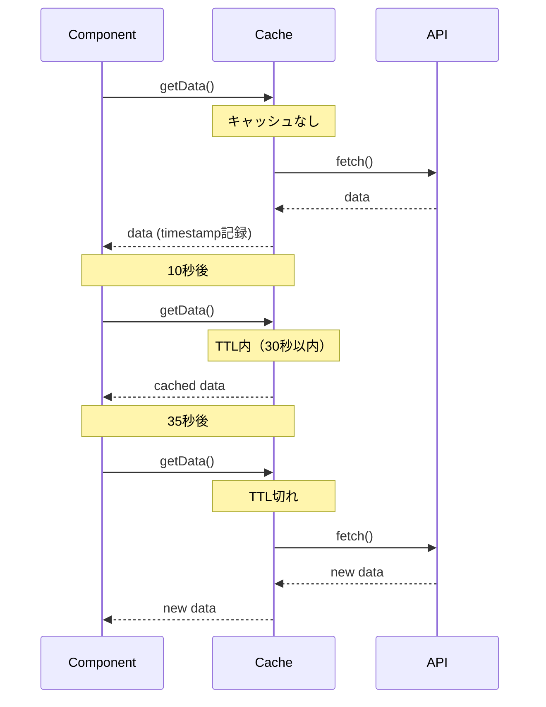
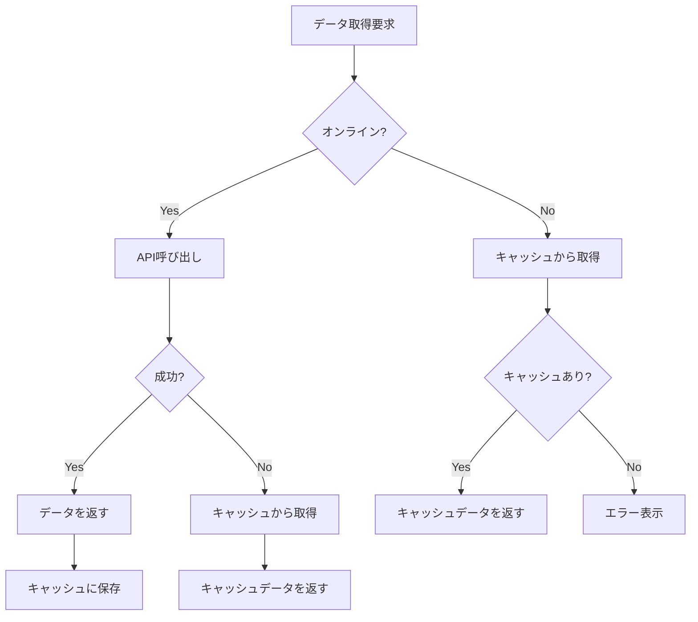

# キャッシュ戦略パターン

キャッシュは、パフォーマンス最適化において最も重要な技術の一つです。RxJSを使うことで、宣言的かつ柔軟なキャッシュ戦略を実装できます。

この記事では、shareReplayによる基本的なキャッシュから、TTL付きキャッシュ、キャッシュ無効化、ローカルストレージ連携まで、実務で必要なキャッシュ戦略の具体的なパターンを解説します。

## この記事で学べること

- shareReplayによる基本的なキャッシュ
- TTL（有効期限）付きキャッシュの実装
- 手動リフレッシュとキャッシュ無効化
- ローカルストレージとの連携
- オフライン対応とキャッシュフォールバック
- キャッシュの監視とデバッグ

> [!TIP] 前提知識
> この記事は、[Chapter 2: Cold/Hot Observable](../observables/cold-and-hot-observables.md) と [Chapter 4: オペレーター](../operators/index.md) の知識を前提としています。特に `shareReplay`, `share` の理解が重要です。

## 基本的なキャッシュ（shareReplay）

### 問題：同じAPIを複数回呼ぶのを避けたい

複数のコンポーネントが同じAPIデータを必要とする場合、重複したリクエストを防ぎたい。

### 解決策：shareReplayでキャッシュする

```typescript
import { Observable, of, shareReplay, catchError, tap } from 'rxjs';
interface User {
  id: number;
  name: string;
  email: string;
}

class UserService {
  private users$: Observable<User[]> | null = null;

  getUsers(): Observable<User[]> {
    // キャッシュがあればそれを返す
    if (this.users$) {
      console.log('キャッシュから返却');
      return this.users$;
    }

    // 新しいリクエストを作成してキャッシュ
    console.log('新規リクエスト実行');
    this.users$ = this.fetchUsersFromAPI().pipe(
      tap(() => console.log('API呼び出し完了')),
      shareReplay(1), // 最後の1つの値をキャッシュ
      catchError(err => {
        // エラー時はキャッシュをクリア
        this.users$ = null;
        throw err;
      })
    );

    return this.users$;
  }

  clearCache(): void {
    this.users$ = null;
    console.log('キャッシュクリア');
  }

  private fetchUsersFromAPI(): Observable<User[]> {
    return of([
      { id: 1, name: '山田太郎', email: 'yamada@example.com' },
      { id: 2, name: '佐藤花子', email: 'sato@example.com' }
    ]);
  }
}

// 使用例
const userService = new UserService();

// 1回目の呼び出し（API実行）
userService.getUsers().subscribe(users => {
  console.log('コンポーネント1:', users);
});

// 2回目の呼び出し（キャッシュから）
userService.getUsers().subscribe(users => {
  console.log('コンポーネント2:', users);
});

// 出力:
// 新規リクエスト実行
// API呼び出し完了
// コンポーネント1: [...]
// キャッシュから返却
// コンポーネント2: [...]
```

> [!IMPORTANT] shareReplayの注意点
> - **メモリリーク**: 購読が0になってもキャッシュを保持し続ける
> - **参照型の共有**: オブジェクトは参照で共有されるため、変更は全購読者に影響
> - **エラー処理**: エラー時はキャッシュをクリアすることを推奨

### shareReplayの設定オプション

```typescript
import { shareReplay } from 'rxjs';
// 基本的な使い方
source$.pipe(
  shareReplay(1) // 最後の1つをキャッシュ
);

// 詳細な設定
source$.pipe(
  shareReplay({
    bufferSize: 1,        // キャッシュする値の数
    refCount: true,       // 購読者が0になったらキャッシュを破棄
    windowTime: 5000      // 5秒後にキャッシュを破棄（省略可）
  })
);
```

> [!TIP] refCountの使い分け
> - `refCount: true` - 購読者が0になったらキャッシュ破棄（メモリ効率◎）
> - `refCount: false`（デフォルト） - 永続的なキャッシュ（パフォーマンス◎）
>
> 用途に応じて選択しましょう。

## TTL（有効期限）付きキャッシュ

### 問題：古いキャッシュを自動的に無効化したい

一定時間経過したキャッシュは自動的に破棄し、新しいデータを取得したい。

### 解決策：タイムスタンプとfilterを組み合わせる

```typescript
import { Observable, of, shareReplay, map, switchMap } from 'rxjs';
interface CachedData<T> {
  data: T;
  timestamp: number;
}

class TTLCacheService<T> {
  private cache$: Observable<CachedData<T>> | null = null;
  private ttl: number; // Time To Live (ミリ秒)

  constructor(ttl: number = 60000) {
    this.ttl = ttl; // デフォルト: 60秒
  }

  getData(fetchFn: () => Observable<T>): Observable<T> {
    if (this.cache$) {
      // キャッシュが有効かチェック
      return this.cache$.pipe(
        switchMap(cached => {
          const age = Date.now() - cached.timestamp;
          if (age < this.ttl) {
            console.log(`キャッシュから返却 (有効期限まで ${(this.ttl - age) / 1000}秒)`);
            return of(cached.data);
          } else {
            console.log('キャッシュ期限切れ - 新規取得');
            this.cache$ = null;
            return this.getData(fetchFn);
          }
        })
      );
    }

    // 新しいデータを取得してキャッシュ
    console.log('新規リクエスト実行');
    this.cache$ = fetchFn().pipe(
      map(data => ({
        data,
        timestamp: Date.now()
      })),
      shareReplay(1)
    );

    return this.cache$.pipe(map(cached => cached.data));
  }

  clearCache(): void {
    this.cache$ = null;
    console.log('キャッシュクリア');
  }

  getCacheAge(): number | null {
    // キャッシュの経過時間を取得（デバッグ用）
    if (!this.cache$) return null;

    let timestamp = 0;
    this.cache$.subscribe(cached => {
      timestamp = cached.timestamp;
    });

    return Date.now() - timestamp;
  }
}

// 使用例
interface Product {
  id: number;
  name: string;
  price: number;
}

const productCache = new TTLCacheService<Product[]>(30000); // 30秒TTL

function fetchProducts(): Observable<Product[]> {
  console.log('API呼び出し');
  return of([
    { id: 1, name: '商品A', price: 1000 },
    { id: 2, name: '商品B', price: 2000 }
  ]);
}

// 1回目（新規取得）
productCache.getData(() => fetchProducts()).subscribe(products => {
  console.log('取得:', products);
});

// 10秒後（キャッシュから）
setTimeout(() => {
  productCache.getData(() => fetchProducts()).subscribe(products => {
    console.log('10秒後:', products);
    console.log('キャッシュ経過時間:', productCache.getCacheAge(), 'ms');
  });
}, 10000);

// 35秒後（期限切れで再取得）
setTimeout(() => {
  productCache.getData(() => fetchProducts()).subscribe(products => {
    console.log('35秒後（期限切れ）:', products);
  });
}, 35000);
```

**TTLキャッシュの動作：**



## 手動リフレッシュとキャッシュ無効化

### 問題：ユーザーが任意にデータを更新したい

「更新」ボタンをクリックしたときに、キャッシュを破棄して最新データを取得したい。

### 解決策：Subjectとswitchで制御する

```typescript
import { Observable, Subject, merge, of, switchMap, shareReplay, tap } from 'rxjs';
class RefreshableCacheService<T> {
  private refreshTrigger$ = new Subject<void>();
  private cache$: Observable<T>;

  constructor(fetchFn: () => Observable<T>) {
    this.cache$ = merge(
      this.refreshTrigger$.pipe(
        tap(() => console.log('手動リフレッシュ'))
      ),
      // 初回実行用
      of(undefined).pipe(tap(() => console.log('初回読み込み')))
    ).pipe(
      switchMap(() => fetchFn()),
      tap(data => console.log('データ取得完了:', data)),
      shareReplay(1)
    );
  }

  getData(): Observable<T> {
    return this.cache$;
  }

  refresh(): void {
    this.refreshTrigger$.next();
  }
}

const refreshButton = document.createElement('button');
refreshButton.id = 'refresh-button';
refreshButton.textContent = 'ニュースを更新';
refreshButton.style.padding = '10px 20px';
refreshButton.style.margin = '10px';
refreshButton.style.fontSize = '16px';
refreshButton.style.fontWeight = 'bold';
refreshButton.style.color = '#fff';
refreshButton.style.backgroundColor = '#2196F3';
refreshButton.style.border = 'none';
refreshButton.style.borderRadius = '4px';
refreshButton.style.cursor = 'pointer';
document.body.appendChild(refreshButton);

const newsContainer = document.createElement('div');
newsContainer.id = 'news-container';
newsContainer.style.padding = '15px';
newsContainer.style.margin = '10px';
newsContainer.style.border = '2px solid #ccc';
newsContainer.style.borderRadius = '8px';
newsContainer.style.minHeight = '200px';
newsContainer.style.backgroundColor = '#f9f9f9';
document.body.appendChild(newsContainer);

const newsCache = new RefreshableCacheService<string[]>(() =>
  of(['ニュース1', 'ニュース2', 'ニュース3'])
);

// データの購読
newsCache.getData().subscribe(news => {
  console.log('ニュース一覧:', news);
  displayNews(news, newsContainer);
});

// 更新ボタンのクリック
refreshButton.addEventListener('click', () => {
  console.log('ユーザーが更新をクリック');
  refreshButton.textContent = '更新中...';
  refreshButton.disabled = true;
  refreshButton.style.backgroundColor = '#999';
  newsCache.refresh();
  setTimeout(() => {
    refreshButton.textContent = 'ニュースを更新';
    refreshButton.disabled = false;
    refreshButton.style.backgroundColor = '#2196F3';
  }, 1000);
});

function displayNews(news: string[], container: HTMLElement): void {
  container.innerHTML = news
    .map(item => `<div style="padding: 10px; margin: 5px 0; border-bottom: 1px solid #ddd; font-size: 14px;">${item}</div>`)
    .join('');

  if (news.length === 0) {
    container.innerHTML = '<div style="padding: 20px; text-align: center; color: #999;">ニュースがありません</div>';
  }
}
```

### 条件付きキャッシュ無効化

```typescript
import { BehaviorSubject, Observable, switchMap, shareReplay, distinctUntilChanged, of } from 'rxjs';
interface CacheOptions {
  forceRefresh: boolean;
  userId?: number;
}

class ConditionalCacheService {
  private options$ = new BehaviorSubject<CacheOptions>({
    forceRefresh: false
  });

  data$ = this.options$.pipe(
    distinctUntilChanged((prev, curr) => {
      // forceRefreshまたはuserIdが変わったら再取得
      return !curr.forceRefresh && prev.userId === curr.userId;
    }),
    switchMap(options => {
      console.log('データ取得:', options);
      return this.fetchData(options.userId);
    }),
    shareReplay(1)
  );

  getData(userId?: number): Observable<any> {
    this.options$.next({
      forceRefresh: false,
      userId
    });
    return this.data$;
  }

  refresh(userId?: number): void {
    this.options$.next({
      forceRefresh: true,
      userId
    });
  }

  private fetchData(userId?: number): Observable<any> {
    console.log('API呼び出し - userId:', userId);
    return of({ userId, data: 'sample data' });
  }
}

// 使用例
const conditionalCache = new ConditionalCacheService();

// ユーザー1のデータ取得
conditionalCache.getData(1).subscribe(data => {
  console.log('ユーザー1のデータ:', data);
});

// 同じユーザーなのでキャッシュから
conditionalCache.getData(1).subscribe(data => {
  console.log('ユーザー1のデータ（キャッシュ）:', data);
});

// 別のユーザーなので再取得
conditionalCache.getData(2).subscribe(data => {
  console.log('ユーザー2のデータ:', data);
});

// 手動リフレッシュ
conditionalCache.refresh(1);
```

## ローカルストレージとの連携

### 問題：ページリロード後もキャッシュを保持したい

ブラウザのローカルストレージを使って、永続的なキャッシュを実装したい。

### 解決策：ローカルストレージと組み合わせる

```typescript
import { Observable, of, defer, tap, catchError } from 'rxjs';
interface StorageCacheOptions {
  key: string;
  ttl?: number; // ミリ秒
}

interface CachedItem<T> {
  data: T;
  timestamp: number;
}

class LocalStorageCacheService {
  getOrFetch<T>(
    options: StorageCacheOptions,
    fetchFn: () => Observable<T>
  ): Observable<T> {
    return defer(() => {
      // ローカルストレージから取得を試みる
      const cached = this.getFromStorage<T>(options.key, options.ttl);

      if (cached) {
        console.log('ローカルストレージから取得:', options.key);
        return of(cached);
      }

      // キャッシュがないので新規取得
      console.log('新規取得:', options.key);
      return fetchFn().pipe(
        tap(data => {
          this.saveToStorage(options.key, data);
        }),
        catchError(err => {
          console.error('取得エラー:', err);
          throw err;
        })
      );
    });
  }

  private getFromStorage<T>(key: string, ttl?: number): T | null {
    try {
      const item = localStorage.getItem(key);
      if (!item) return null;

      const cached: CachedItem<T> = JSON.parse(item);

      // TTLチェック
      if (ttl) {
        const age = Date.now() - cached.timestamp;
        if (age > ttl) {
          console.log('キャッシュ期限切れ:', key);
          localStorage.removeItem(key);
          return null;
        }
      }

      return cached.data;
    } catch (error) {
      console.error('ローカルストレージ読み込みエラー:', error);
      return null;
    }
  }

  private saveToStorage<T>(key: string, data: T): void {
    try {
      const item: CachedItem<T> = {
        data,
        timestamp: Date.now()
      };
      localStorage.setItem(key, JSON.stringify(item));
      console.log('ローカルストレージに保存:', key);
    } catch (error) {
      console.error('ローカルストレージ保存エラー:', error);
    }
  }

  clearCache(key?: string): void {
    if (key) {
      localStorage.removeItem(key);
      console.log('キャッシュクリア:', key);
    } else {
      localStorage.clear();
      console.log('全キャッシュクリア');
    }
  }

  getCacheSize(): number {
    let size = 0;
    for (const key in localStorage) {
      if (localStorage.hasOwnProperty(key)) {
        size += localStorage[key].length;
      }
    }
    return size;
  }
}

// 使用例
interface Settings {
  theme: string;
  language: string;
  notifications: boolean;
}

const storageCache = new LocalStorageCacheService();

function fetchSettings(): Observable<Settings> {
  console.log('設定をAPIから取得');
  return of({
    theme: 'dark',
    language: 'ja',
    notifications: true
  });
}

// 設定を取得（ローカルストレージまたはAPI）
storageCache.getOrFetch(
  { key: 'user-settings', ttl: 3600000 }, // 1時間TTL
  fetchSettings
).subscribe(settings => {
  console.log('設定:', settings);
  applySettings(settings);
});

// ページリロード後も同じデータが取得される（TTL内なら）
// storageCache.getOrFetch(...) // ローカルストレージから

function applySettings(settings: Settings): void {
  document.body.className = `theme-${settings.theme}`;
  console.log('設定を適用:', settings);
}
```

### ストレージサイズ管理

```typescript
class ManagedStorageCacheService extends LocalStorageCacheService {
  private maxSize = 5 * 1024 * 1024; // 5MB

  saveWithLimit<T>(key: string, data: T): boolean {
    const item: CachedItem<T> = {
      data,
      timestamp: Date.now()
    };

    const itemString = JSON.stringify(item);
    const itemSize = new Blob([itemString]).size;

    // 現在のサイズ + 新しいアイテムのサイズが上限を超える場合
    if (this.getCacheSize() + itemSize > this.maxSize) {
      console.log('ストレージ容量上限 - 古いアイテムを削除');
      this.removeOldestItem();
    }

    try {
      localStorage.setItem(key, itemString);
      return true;
    } catch (error) {
      console.error('保存失敗:', error);
      return false;
    }
  }

  private removeOldestItem(): void {
    let oldestKey: string | null = null;
    let oldestTimestamp = Date.now();

    for (const key in localStorage) {
      if (localStorage.hasOwnProperty(key)) {
        try {
          const item = JSON.parse(localStorage[key]);
          if (item.timestamp < oldestTimestamp) {
            oldestTimestamp = item.timestamp;
            oldestKey = key;
          }
        } catch (error) {
          // パースエラーは無視
        }
      }
    }

    if (oldestKey) {
      localStorage.removeItem(oldestKey);
      console.log('最古のアイテムを削除:', oldestKey);
    }
  }
}
```

## オフライン対応

### 問題：オフライン時にキャッシュデータを表示したい

ネットワーク接続がない場合でも、キャッシュされたデータを表示してUXを向上させたい。

### 解決策：キャッシュファーストの戦略

```typescript
import { Observable, of, throwError, fromEvent, merge, map, startWith, distinctUntilChanged, switchMap, catchError, tap } from 'rxjs';
class OfflineFirstCacheService {
  private onlineStatus$ = merge(
    fromEvent(window, 'online').pipe(map(() => true)),
    fromEvent(window, 'offline').pipe(map(() => false))
  ).pipe(
    startWith(navigator.onLine),
    distinctUntilChanged(),
    tap(online => console.log('オンライン状態:', online))
  );

  getData<T>(
    cacheKey: string,
    fetchFn: () => Observable<T>
  ): Observable<T> {
    return this.onlineStatus$.pipe(
      switchMap(online => {
        if (online) {
          // オンライン: APIから取得してキャッシュ
          console.log('オンライン - APIから取得');
          return fetchFn().pipe(
            tap(data => {
              this.saveToCache(cacheKey, data);
            }),
            catchError(err => {
              console.error('API取得エラー - キャッシュにフォールバック');
              return this.getFromCache<T>(cacheKey);
            })
          );
        } else {
          // オフライン: キャッシュから取得
          console.log('オフライン - キャッシュから取得');
          return this.getFromCache<T>(cacheKey);
        }
      })
    );
  }

  private saveToCache<T>(key: string, data: T): void {
    try {
      localStorage.setItem(key, JSON.stringify(data));
      console.log('キャッシュ保存:', key);
    } catch (error) {
      console.error('キャッシュ保存失敗:', error);
    }
  }

  private getFromCache<T>(key: string): Observable<T> {
    try {
      const cached = localStorage.getItem(key);
      if (cached) {
        const data = JSON.parse(cached);
        console.log('キャッシュから取得:', key);
        return of(data);
      }
    } catch (error) {
      console.error('キャッシュ読み込みエラー:', error);
    }

    return throwError(() => new Error('キャッシュが見つかりません'));
  }
}

// Traditional approach (commented for reference)
// const container = document.querySelector('#articles');
// const message = document.querySelector('#offline-message');

// Self-contained: creates articles display dynamically
const articlesContainer = document.createElement('div');
articlesContainer.id = 'articles';
articlesContainer.style.padding = '15px';
articlesContainer.style.margin = '10px';
articlesContainer.style.border = '2px solid #ccc';
articlesContainer.style.borderRadius = '8px';
articlesContainer.style.backgroundColor = '#f9f9f9';
document.body.appendChild(articlesContainer);

const offlineMessage = document.createElement('div');
offlineMessage.id = 'offline-message';
offlineMessage.style.padding = '15px';
offlineMessage.style.margin = '10px';
offlineMessage.style.backgroundColor = '#f8d7da';
offlineMessage.style.color = '#721c24';
offlineMessage.style.border = '1px solid #f5c6cb';
offlineMessage.style.borderRadius = '4px';
offlineMessage.style.display = 'none';
offlineMessage.style.textAlign = 'center';
offlineMessage.style.fontWeight = 'bold';
document.body.appendChild(offlineMessage);

// 使用例
const offlineCache = new OfflineFirstCacheService();

function fetchArticles(): Observable<any[]> {
  return of([
    { id: 1, title: '記事1', content: '内容1' },
    { id: 2, title: '記事2', content: '内容2' }
  ]);
}

offlineCache.getData('articles', fetchArticles).subscribe({
  next: articles => {
    console.log('記事:', articles);
    displayArticles(articles, articlesContainer);
    offlineMessage.style.display = 'none';
  },
  error: err => {
    console.error('データ取得失敗:', err);
    showOfflineMessage(offlineMessage);
  }
});

function displayArticles(articles: any[], container: HTMLElement): void {
  container.innerHTML = articles
    .map(a => `
      <article style="padding: 15px; margin: 10px 0; border-bottom: 2px solid #ddd;">
        <h2 style="margin: 0 0 10px 0; font-size: 18px; color: #333;">${a.title}</h2>
        <p style="margin: 0; font-size: 14px; color: #666;">${a.content}</p>
      </article>
    `)
    .join('');

  if (articles.length === 0) {
    container.innerHTML = '<div style="padding: 20px; text-align: center; color: #999;">記事がありません</div>';
  }
}

function showOfflineMessage(message: HTMLElement): void {
  message.textContent = 'オフラインです。キャッシュデータがありません。';
  message.style.display = 'block';
}
```

**オフライン対応の戦略：**



## キャッシュの監視とデバッグ

### キャッシュ状態の可視化

```typescript
import { BehaviorSubject, Observable, map } from 'rxjs';
interface CacheEntry {
  key: string;
  size: number;
  timestamp: number;
  hits: number;
}

interface CacheStats {
  entries: CacheEntry[];
  totalSize: number;
  hitRate: number;
}

class ObservableCacheService {
  private cacheEntries$ = new BehaviorSubject<Map<string, CacheEntry>>(new Map());
  private totalRequests = 0;
  private cacheHits = 0;

  stats$: Observable<CacheStats> = this.cacheEntries$.pipe(
    map(entries => {
      const entriesArray = Array.from(entries.values());
      const totalSize = entriesArray.reduce((sum, entry) => sum + entry.size, 0);
      const hitRate = this.totalRequests > 0
        ? (this.cacheHits / this.totalRequests) * 100
        : 0;

      return {
        entries: entriesArray,
        totalSize,
        hitRate
      };
    })
  );

  getData<T>(key: string, fetchFn: () => Observable<T>): Observable<T> {
    this.totalRequests++;

    const entries = this.cacheEntries$.value;
    const entry = entries.get(key);

    if (entry) {
      // キャッシュヒット
      this.cacheHits++;
      entry.hits++;
      this.cacheEntries$.next(new Map(entries));
      console.log(`キャッシュヒット: ${key} (${entry.hits}回目)`);
      // 実際のデータ取得ロジック
    } else {
      // キャッシュミス
      console.log(`キャッシュミス: ${key}`);
      // 新規取得とキャッシュ登録
      const newEntry: CacheEntry = {
        key,
        size: 0, // 実際のデータサイズを計算
        timestamp: Date.now(),
        hits: 1
      };
      entries.set(key, newEntry);
      this.cacheEntries$.next(new Map(entries));
    }

    return fetchFn();
  }

  clearStats(): void {
    this.totalRequests = 0;
    this.cacheHits = 0;
    this.cacheEntries$.next(new Map());
  }
}

// Traditional approach (commented for reference)
// const statsElement = document.querySelector('#cache-stats');

// Self-contained: creates cache stats element dynamically
const cacheStatsElement = document.createElement('div');
cacheStatsElement.id = 'cache-stats';
cacheStatsElement.style.padding = '20px';
cacheStatsElement.style.margin = '10px';
cacheStatsElement.style.border = '2px solid #ccc';
cacheStatsElement.style.borderRadius = '8px';
cacheStatsElement.style.backgroundColor = '#f9f9f9';
cacheStatsElement.style.fontFamily = 'monospace';
document.body.appendChild(cacheStatsElement);

// 使用例
const observableCache = new ObservableCacheService();

// キャッシュ統計の監視
observableCache.stats$.subscribe(stats => {
  console.log('=== キャッシュ統計 ===');
  console.log(`エントリ数: ${stats.entries.length}`);
  console.log(`合計サイズ: ${(stats.totalSize / 1024).toFixed(2)} KB`);
  console.log(`ヒット率: ${stats.hitRate.toFixed(1)}%`);

  // UI更新
  updateCacheStatsUI(stats, cacheStatsElement);
});

function updateCacheStatsUI(stats: CacheStats, element: HTMLElement): void {
  element.innerHTML = `
    <div style="margin-bottom: 15px;">
      <h3 style="margin: 0 0 10px 0; color: #333;">キャッシュ統計</h3>
      <div style="padding: 10px; background-color: #fff; border-radius: 4px; margin: 5px 0;">
        <strong>エントリ数:</strong> ${stats.entries.length}
      </div>
      <div style="padding: 10px; background-color: #fff; border-radius: 4px; margin: 5px 0;">
        <strong>合計サイズ:</strong> ${(stats.totalSize / 1024).toFixed(2)} KB
      </div>
      <div style="padding: 10px; background-color: #fff; border-radius: 4px; margin: 5px 0;">
        <strong>ヒット率:</strong> ${stats.hitRate.toFixed(1)}%
      </div>
    </div>
    <div>
      <h4 style="margin: 10px 0; color: #666;">エントリ一覧:</h4>
      ${stats.entries.map(e => `
        <div style="display: flex; justify-content: space-between; padding: 8px; margin: 5px 0; background-color: #fff; border-radius: 4px; border-left: 3px solid #2196F3;">
          <span style="font-weight: bold;">${e.key}</span>
          <span style="color: #2196F3;">${e.hits} hits</span>
        </div>
      `).join('')}
    </div>
  `;

  if (stats.entries.length === 0) {
    element.innerHTML = '<div style="padding: 20px; text-align: center; color: #999;">キャッシュエントリがありません</div>';
  }
}
```

## まとめ

キャッシュ戦略パターンをマスターすることで、パフォーマンスとユーザー体験を大幅に向上させることができます。

> [!IMPORTANT] 重要なポイント
> - **shareReplay**: 基本的なメモリキャッシュに最適
> - **TTL**: 古いデータの自動無効化
> - **手動リフレッシュ**: ユーザー主導の更新
> - **ローカルストレージ**: 永続的なキャッシュ
> - **オフライン対応**: キャッシュファースト戦略
> - **監視**: ヒット率やサイズの可視化

> [!TIP] ベストプラクティス
> - **適切なTTL**: データの性質に応じた有効期限設定
> - **エラー時のクリア**: エラー発生時はキャッシュを破棄
> - **サイズ管理**: ストレージ容量の上限を設定
> - **refCountの活用**: メモリリークを防ぐ
> - **キャッシュキー**: 一意で分かりやすいキーを使用

## 次のステップ

キャッシュ戦略パターンを習得したら、次は以下のパターンに進みましょう。

- [リアルタイムデータ処理](./real-time-data.md) - リアルタイムデータのキャッシュ
- [API呼び出し](./api-calls.md) - APIレスポンスのキャッシュ
- [UIイベント処理](./ui-events.md) - イベントデータのキャッシュ
- エラーハンドリング実践（準備中） - キャッシュエラーの処理

## 関連セクション

- [Chapter 2: Cold/Hot Observable](../observables/cold-and-hot-observables.md) - shareReplay の詳細
- [Chapter 4: オペレーター](../operators/multicasting/shareReplay.md) - shareReplay の使い方
- [Chapter 10: アンチパターン](../anti-patterns/common-mistakes.md) - shareReplayの誤用

## 参考リソース

- [RxJS公式: shareReplay](https://rxjs.dev/api/operators/shareReplay) - shareReplay の詳細
- [MDN: Web Storage API](https://developer.mozilla.org/ja/docs/Web/API/Web_Storage_API) - ローカルストレージの使い方
- [Learn RxJS: Caching](https://www.learnrxjs.io/) - キャッシュパターンの実践例
