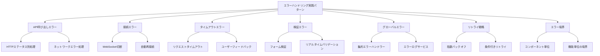

# エラーハンドリング実践パターン

RxJSアプリケーションにおいて、適切なエラーハンドリングは信頼性の高いシステムを構築するための基盤です。この記事では、実務で即座に使える7つのエラーハンドリングパターンを紹介します。

## なぜエラーハンドリングが重要なのか

Observableストリームでは、エラーが発生するとストリームが終了し、以降の値が流れなくなります。この特性を理解せずにエラーハンドリングを怠ると、アプリケーションが予期せず停止したり、ユーザーに適切なフィードバックを提供できなくなります。

**エラーハンドリングの3つの目的**:
1. **継続性の確保** - エラー発生後もストリームを継続可能にする
2. **ユーザー体験の向上** - 適切なエラーメッセージと復旧手段を提供
3. **システムの可観測性** - エラーのログと監視で問題を早期発見

この記事では、Chapter 6「[エラーハンドリング](/guide/error-handling/strategies.md)」で学んだ基礎知識を、実践的なシナリオに適用する方法を解説します。

## この記事の構成



## API呼び出しでのエラーハンドリング

API呼び出しは最もエラーが発生しやすい領域です。HTTPステータスコード、ネットワークエラー、タイムアウトなど、様々なエラーシナリオに対応する必要があります。

### HTTPステータス別のエラー処理

HTTPステータスコードに応じて、適切なエラーハンドリングを行います。

```typescript
import { Observable, throwError, catchError, retry, tap } from 'rxjs';
import { ajax, AjaxError } from 'rxjs/ajax';

/**
 * HTTPエラーの詳細情報
 */
interface HttpErrorInfo {
  status: number;
  message: string;
  retryable: boolean;
  userMessage: string;
}

/**
 * HTTPエラー分類サービス
 */
class HttpErrorClassifier {
  /**
   * ステータスコードからエラー情報を生成
   */
  classify(error: AjaxError): HttpErrorInfo {
    const status = error.status;

    // 4xx クライアントエラー
    if (status >= 400 && status < 500) {
      return this.handleClientError(status, error);
    }

    // 5xx サーバーエラー
    if (status >= 500) {
      return this.handleServerError(status, error);
    }

    // ネットワークエラー (status = 0)
    if (status === 0) {
      return {
        status: 0,
        message: 'Network error',
        retryable: true,
        userMessage: 'ネットワークに接続できません。接続を確認してください。'
      };
    }

    // その他のエラー
    return {
      status,
      message: 'Unknown error',
      retryable: false,
      userMessage: '予期しないエラーが発生しました。'
    };
  }

  private handleClientError(status: number, error: AjaxError): HttpErrorInfo {
    switch (status) {
      case 400:
        return {
          status,
          message: 'Bad Request',
          retryable: false,
          userMessage: '入力内容に誤りがあります。'
        };

      case 401:
        return {
          status,
          message: 'Unauthorized',
          retryable: false,
          userMessage: '認証が必要です。ログインしてください。'
        };

      case 403:
        return {
          status,
          message: 'Forbidden',
          retryable: false,
          userMessage: 'この操作を実行する権限がありません。'
        };

      case 404:
        return {
          status,
          message: 'Not Found',
          retryable: false,
          userMessage: 'データが見つかりませんでした。'
        };

      case 422:
        return {
          status,
          message: 'Unprocessable Entity',
          retryable: false,
          userMessage: '入力データを処理できませんでした。'
        };

      case 429:
        return {
          status,
          message: 'Too Many Requests',
          retryable: true, // リトライ可能（待機時間必要）
          userMessage: 'リクエストが多すぎます。しばらく待ってから再試行してください。'
        };

      default:
        return {
          status,
          message: `Client Error ${status}`,
          retryable: false,
          userMessage: 'リクエストを処理できませんでした。'
        };
    }
  }

  private handleServerError(status: number, error: AjaxError): HttpErrorInfo {
    switch (status) {
      case 500:
        return {
          status,
          message: 'Internal Server Error',
          retryable: true,
          userMessage: 'サーバーエラーが発生しました。しばらく待ってから再試行してください。'
        };

      case 502:
      case 503:
      case 504:
        return {
          status,
          message: 'Service Unavailable',
          retryable: true,
          userMessage: 'サーバーが一時的に利用できません。しばらく待ってから再試行してください。'
        };

      default:
        return {
          status,
          message: `Server Error ${status}`,
          retryable: true,
          userMessage: 'サーバーエラーが発生しました。'
        };
    }
  }
}

/**
 * HTTPクライアントサービス
 */
class HttpClientService {
  private errorClassifier = new HttpErrorClassifier();

  /**
   * GETリクエスト（エラーハンドリング付き）
   */
  get<T>(url: string): Observable<T> {
    return ajax.get<T>(url).pipe(
      tap(() => console.log(`GET ${url} - Success`)),
      catchError(error => this.handleError(error, url))
    );
  }

  /**
   * POSTリクエスト（エラーハンドリング付き）
   */
  post<T>(url: string, body: any): Observable<T> {
    return ajax.post<T>(url, body).pipe(
      tap(() => console.log(`POST ${url} - Success`)),
      catchError(error => this.handleError(error, url))
    );
  }

  /**
   * 統一エラーハンドラー
   */
  private handleError(error: any, url: string): Observable<never> {
    console.error(`HTTP Error at ${url}:`, error);

    if (error instanceof AjaxError) {
      const errorInfo = this.errorClassifier.classify(error);

      // エラー情報をログに記録
      this.logError(errorInfo, url);

      // ユーザーにわかりやすいエラーを投げる
      return throwError(() => errorInfo);
    }

    // AjaxError以外のエラー（プログラミングエラーなど）
    return throwError(() => ({
      status: -1,
      message: error.message || 'Unknown error',
      retryable: false,
      userMessage: '予期しないエラーが発生しました。'
    }));
  }

  private logError(errorInfo: HttpErrorInfo, url: string): void {
    // エラーログサービスに送信（後述）
    console.error('HTTP Error:', {
      url,
      status: errorInfo.status,
      message: errorInfo.message,
      timestamp: new Date().toISOString()
    });
  }
}
```

> [!TIP] HTTPエラーの分類基準
> - **4xx クライアントエラー**: 通常リトライ不可（入力修正が必要）
> - **5xx サーバーエラー**: リトライ可能（サーバー側の一時的な問題）
> - **429 Too Many Requests**: リトライ可能だが待機時間が必要
> - **0 (ネットワークエラー)**: リトライ可能（接続問題）

### 使用例：ステータス別のエラー処理

```typescript
import { Component, OnInit } from '@angular/core';
import { Subject, takeUntil } from 'rxjs';

interface User {
  id: number;
  name: string;
  email: string;
}

class UserDetailManager {
  private destroy$ = new Subject<void>();
  private httpClient = new HttpClientService();

  user: User | null = null;
  loading = false;
  errorMessage = '';
  canRetry = false;

  // UI更新用のコールバック（オプション）
  onStateChange?: (state: { user: User | null; loading: boolean; errorMessage: string; canRetry: boolean }) => void;

  init(): void {
    this.loadUser();
  }

  loadUser(): void {
    this.loading = true;
    this.errorMessage = '';
    this.canRetry = false;
    this.updateUI();

    this.httpClient.get<User>('/api/users/1')
      .pipe(takeUntil(this.destroy$))
      .subscribe({
        next: user => {
          this.user = user;
          this.loading = false;
          this.updateUI();
        },
        error: (errorInfo: HttpErrorInfo) => {
          this.loading = false;
          this.errorMessage = errorInfo.userMessage;
          this.canRetry = errorInfo.retryable;
          this.updateUI();

          // 認証エラーの場合はログイン画面へリダイレクト
          if (errorInfo.status === 401) {
            setTimeout(() => {
              window.location.href = '/login';
            }, 2000);
          }
        }
      });
  }

  private updateUI(): void {
    if (this.onStateChange) {
      this.onStateChange({
        user: this.user,
        loading: this.loading,
        errorMessage: this.errorMessage,
        canRetry: this.canRetry
      });
    }
  }

  destroy(): void {
    this.destroy$.next();
    this.destroy$.complete();
  }
}

// 使用例
const userDetail = new UserDetailManager();
userDetail.onStateChange = (state) => {
  console.log('State updated:', state);
  // UIの更新処理をここに記述
};
userDetail.init();
```

> [!IMPORTANT] ユーザー体験の考慮
> - エラーメッセージは技術的な詳細ではなく、**ユーザーが次に何をすべきか**を示す
> - リトライ可能なエラーでは**再試行ボタン**を表示
> - 認証エラーでは**自動的にログイン画面へ誘導**

## ネットワークエラーの処理

ネットワークエラーは一時的な問題であることが多いため、適切なリトライ戦略を実装します。

```typescript
import { Observable, timer, throwError, retryWhen, mergeMap, tap } from 'rxjs';
/**
 * ネットワークエラー専用リトライ設定
 */
interface NetworkRetryConfig {
  maxRetries: number;
  initialDelay: number;
  maxDelay: number;
  backoffMultiplier: number;
}

/**
 * ネットワークリトライオペレーター
 */
function retryWithBackoff(config: NetworkRetryConfig) {
  const {
    maxRetries = 3,
    initialDelay = 1000,
    maxDelay = 16000,
    backoffMultiplier = 2
  } = config;

  return <T>(source: Observable<T>) => source.pipe(
    retryWhen(errors => errors.pipe(
      mergeMap((error, index) => {
        const retryAttempt = index + 1;

        // 最大リトライ回数を超えたらエラーを投げる
        if (retryAttempt > maxRetries) {
          return throwError(() => ({
            ...error,
            message: `ネットワークエラー: ${maxRetries}回の再試行に失敗しました`,
            userMessage: 'ネットワークに接続できません。しばらく待ってから再試行してください。'
          }));
        }

        // 指数バックオフで遅延時間を計算
        const delay = Math.min(
          initialDelay * Math.pow(backoffMultiplier, index),
          maxDelay
        );

        console.log(
          `リトライ ${retryAttempt}/${maxRetries} - ${delay}ms後に再試行...`
        );

        // 遅延後にリトライ
        return timer(delay).pipe(
          tap(() => console.log(`リトライ ${retryAttempt} 実行中...`))
        );
      })
    ))
  );
}

/**
 * ネットワーク対応HTTPクライアント
 */
class NetworkAwareHttpClient {
  private httpClient = new HttpClientService();
  private errorClassifier = new HttpErrorClassifier();

  /**
   * ネットワークエラーに対応したGETリクエスト
   */
  get<T>(url: string, retryConfig?: Partial<NetworkRetryConfig>): Observable<T> {
    const defaultConfig: NetworkRetryConfig = {
      maxRetries: 3,
      initialDelay: 1000,
      maxDelay: 16000,
      backoffMultiplier: 2
    };

    const config = { ...defaultConfig, ...retryConfig };

    return this.httpClient.get<T>(url).pipe(
      catchError(error => {
        // ネットワークエラー（status = 0）の場合のみリトライ
        if (error.status === 0) {
          return throwError(() => error);
        }
        // それ以外のエラーはリトライせず即座に失敗
        return throwError(() => error);
      }),
      retryWithBackoff(config)
    );
  }
}
```

### 使用例：オフライン対応

```typescript
import { fromEvent, merge, map, startWith, switchMap, of } from 'rxjs';

/**
 * オンライン/オフライン状態の管理
 */
class OnlineStatusService {
  /**
   * オンライン状態のObservable
   */
  online$ = merge(
    fromEvent(window, 'online').pipe(map(() => true)),
    fromEvent(window, 'offline').pipe(map(() => false))
  ).pipe(
    startWith(navigator.onLine)
  );
}

/**
 * オフライン対応データビューア
 */
class DataViewerManager {
  private destroy$ = new Subject<void>();
  private networkClient = new NetworkAwareHttpClient();
  private onlineStatus = new OnlineStatusService();

  isOnline$ = this.onlineStatus.online$;
  data: any = null;
  loading = false;
  errorMessage = '';

  // UI更新用のコールバック（オプション）
  onStateChange?: (state: { isOnline: boolean; data: any; loading: boolean; errorMessage: string }) => void;

  init(): void {
    // オンラインになったら自動的にデータを読み込む
    this.isOnline$.pipe(
      switchMap(isOnline => {
        this.updateUI(isOnline);
        if (isOnline) {
          return this.loadData();
        }
        return of(null);
      }),
      takeUntil(this.destroy$)
    ).subscribe({
      next: data => {
        if (data) {
          this.data = data;
          this.loading = false;
          this.errorMessage = '';
        }
      },
      error: error => {
        this.loading = false;
        this.errorMessage = error.userMessage;
      }
    });
  }

  private loadData(): Observable<any> {
    this.loading = true;

    return this.networkClient.get('/api/data', {
      maxRetries: 5,
      initialDelay: 2000
    });
  }

  private updateUI(isOnline: boolean): void {
    if (this.onStateChange) {
      this.onStateChange({
        isOnline,
        data: this.data,
        loading: this.loading,
        errorMessage: this.errorMessage
      });
    }
  }

  destroy(): void {
    this.destroy$.next();
    this.destroy$.complete();
  }
}

// 使用例
const dataViewer = new DataViewerManager();
dataViewer.onStateChange = (state) => {
  if (!state.isOnline) {
    console.log('オフラインです。インターネット接続を確認してください。');
  }
  console.log('State updated:', state);
};
dataViewer.init();
```

> [!TIP] オフライン対応のベストプラクティス
> - **オンライン状態を監視**して、接続回復時に自動リトライ
> - **ユーザーにオフライン状態を明示**してフラストレーションを軽減
> - **ローカルキャッシュ**と組み合わせて、オフライン時でも部分的に機能を提供

## タイムアウトエラーの処理

長時間レスポンスがない場合にタイムアウトエラーを発生させ、適切にハンドリングします。

```typescript
import { timeout, catchError, throwError, Observable } from 'rxjs';

/**
 * タイムアウト設定
 */
interface TimeoutConfig {
  duration: number;
  message: string;
}

/**
 * タイムアウト対応HTTPクライアント
 */
class TimeoutAwareHttpClient {
  private networkClient = new NetworkAwareHttpClient();

  /**
   * タイムアウト付きGETリクエスト
   */
  get<T>(
    url: string,
    timeoutConfig: TimeoutConfig = {
      duration: 30000,
      message: 'リクエストがタイムアウトしました'
    }
  ): Observable<T> {
    return this.networkClient.get<T>(url).pipe(
      timeout({
        each: timeoutConfig.duration,
        with: () => throwError(() => ({
          status: -2, // タイムアウトを示す独自ステータス
          message: 'Timeout',
          retryable: true,
          userMessage: timeoutConfig.message
        }))
      }),
      catchError(error => {
        if (error.status === -2) {
          console.error(`タイムアウト: ${url} (${timeoutConfig.duration}ms)`);
        }
        return throwError(() => error);
      })
    );
  }

  /**
   * 操作種別ごとの適切なタイムアウト設定
   */
  getWithOperationType<T>(
    url: string,
    operationType: 'fast' | 'normal' | 'slow'
  ): Observable<T> {
    const timeoutConfigs = {
      fast: {
        duration: 5000,
        message: 'リクエストがタイムアウトしました（5秒）'
      },
      normal: {
        duration: 30000,
        message: 'リクエストがタイムアウトしました（30秒）'
      },
      slow: {
        duration: 60000,
        message: 'リクエストがタイムアウトしました（60秒）'
      }
    };

    return this.get<T>(url, timeoutConfigs[operationType]);
  }
}
```

### 使用例：ユーザーフィードバック付きタイムアウト

```typescript
import { Subject, interval, takeUntil, map, startWith } from 'rxjs';

/**
 * 時間のかかる操作を管理するマネージャー
 */
class SlowOperationManager {
  private destroy$ = new Subject<void>();
  private timeoutClient = new TimeoutAwareHttpClient();

  loading = false;
  elapsedTime = 0;
  errorMessage = '';
  result: any = null;

  // UI更新用のコールバック（オプション）
  onStateChange?: (state: {
    loading: boolean;
    elapsedTime: number;
    errorMessage: string;
    result: any;
  }) => void;

  startOperation(): void {
    this.loading = true;
    this.errorMessage = '';
    this.result = null;
    this.updateUI();

    // 経過時間カウンター
    const timer$ = interval(1000).pipe(
      map(count => count + 1),
      startWith(0),
      takeUntil(this.destroy$)
    );

    timer$.subscribe(elapsed => {
      this.elapsedTime = elapsed;
      this.updateUI();
    });

    // 時間のかかる操作（60秒タイムアウト）
    this.timeoutClient.getWithOperationType('/api/slow-operation', 'slow')
      .pipe(takeUntil(this.destroy$))
      .subscribe({
        next: result => {
          this.result = result;
          this.loading = false;
          this.destroy$.next(); // タイマー停止
          this.updateUI();
        },
        error: error => {
          this.errorMessage = error.userMessage;
          this.loading = false;
          this.destroy$.next(); // タイマー停止

          // タイムアウトの場合は追加のヒントを表示
          if (error.status === -2) {
            this.errorMessage += ' サーバーの負荷が高い可能性があります。';
          }
          this.updateUI();
        }
      });
  }

  retryOperation(): void {
    this.startOperation();
  }

  private updateUI(): void {
    if (this.onStateChange) {
      this.onStateChange({
        loading: this.loading,
        elapsedTime: this.elapsedTime,
        errorMessage: this.errorMessage,
        result: this.result
      });
    }
  }

  destroy(): void {
    this.destroy$.next();
    this.destroy$.complete();
  }
}

// 使用例
const slowOp = new SlowOperationManager();
slowOp.onStateChange = (state) => {
  if (state.loading) {
    console.log(`処理中... (${state.elapsedTime}秒経過)`);
    if (state.elapsedTime > 10) {
      console.log('処理に時間がかかっています。しばらくお待ちください。');
    }
  }
  if (state.errorMessage) {
    console.error(state.errorMessage);
  }
  if (state.result) {
    console.log('処理が完了しました:', state.result);
  }
};
slowOp.startOperation();
```

> [!WARNING] タイムアウト値の設定
> - **短すぎるタイムアウト**: 正常な処理まで失敗させてしまう
> - **長すぎるタイムアウト**: ユーザーを長時間待たせる
> - **操作の性質に応じた適切な値**を設定し、経過時間をユーザーに表示する

## グローバルエラーハンドリング

アプリケーション全体で発生するエラーを一元管理し、ログ記録と監視を行います。

```typescript
import { Subject, Observable, share } from 'rxjs';
/**
 * エラーの重要度
 */
enum ErrorSeverity {
  Info = 'info',
  Warning = 'warning',
  Error = 'error',
  Critical = 'critical'
}

/**
 * アプリケーションエラー情報
 */
interface AppError {
  id: string;
  timestamp: Date;
  severity: ErrorSeverity;
  message: string;
  userMessage: string;
  context?: any;
  stack?: string;
}

/**
 * グローバルエラーハンドラーサービス
 */
class GlobalErrorHandler {
  private errorSubject = new Subject<AppError>();

  /**
   * すべてのエラーのストリーム
   */
  errors$: Observable<AppError> = this.errorSubject.asObservable().pipe(
    share()
  );

  /**
   * エラーを記録
   */
  handleError(
    error: any,
    severity: ErrorSeverity = ErrorSeverity.Error,
    context?: any
  ): void {
    const appError: AppError = {
      id: this.generateErrorId(),
      timestamp: new Date(),
      severity,
      message: error.message || 'Unknown error',
      userMessage: error.userMessage || 'エラーが発生しました',
      context,
      stack: error.stack
    };

    // エラーをストリームに流す
    this.errorSubject.next(appError);

    // コンソールにログ出力
    this.logToConsole(appError);

    // 重大なエラーの場合は外部ログサービスに送信
    if (severity === ErrorSeverity.Critical || severity === ErrorSeverity.Error) {
      this.sendToLogService(appError);
    }
  }

  private generateErrorId(): string {
    return `err_${Date.now()}_${Math.random().toString(36).substr(2, 9)}`;
  }

  private logToConsole(error: AppError): void {
    const style = this.getConsoleStyle(error.severity);
    console.error(
      `%c[${error.severity.toUpperCase()}] ${error.message}`,
      style,
      {
        id: error.id,
        timestamp: error.timestamp.toISOString(),
        context: error.context,
        stack: error.stack
      }
    );
  }

  private getConsoleStyle(severity: ErrorSeverity): string {
    const styles = {
      [ErrorSeverity.Info]: 'color: #3498db',
      [ErrorSeverity.Warning]: 'color: #f39c12',
      [ErrorSeverity.Error]: 'color: #e74c3c',
      [ErrorSeverity.Critical]: 'color: #fff; background: #c0392b; font-weight: bold'
    };
    return styles[severity];
  }

  private sendToLogService(error: AppError): void {
    // 外部ログサービス（Sentry、LogRocket等）に送信
    // 実装例：
    // Sentry.captureException(error);

    console.log('エラーを外部ログサービスに送信:', error.id);
  }
}

/**
 * エラー通知サービス
 */
class ErrorNotificationService {
  private notificationSubject = new Subject<{
    message: string;
    type: 'info' | 'warning' | 'error'
  }>();

  notifications$ = this.notificationSubject.asObservable();

  constructor(private globalErrorHandler: GlobalErrorHandler) {
    // グローバルエラーを購読して通知を表示
    this.globalErrorHandler.errors$.subscribe(error => {
      this.showNotification(error.userMessage, this.mapSeverityToType(error.severity));
    });
  }

  showNotification(
    message: string,
    type: 'info' | 'warning' | 'error' = 'info'
  ): void {
    this.notificationSubject.next({ message, type });
  }

  private mapSeverityToType(severity: ErrorSeverity): 'info' | 'warning' | 'error' {
    if (severity === ErrorSeverity.Info) return 'info';
    if (severity === ErrorSeverity.Warning) return 'warning';
    return 'error';
  }
}
```

### 使用例：アプリケーション全体でのエラー管理

```typescript
import { Subject, Observable, of, switchMap, delay, startWith, catchError, throwError } from 'rxjs';

/**
 * アプリケーション全体のエラー管理を行うマネージャー
 */
class AppErrorManager {
  private destroy$ = new Subject<void>();
  currentNotification$: Observable<any>;

  constructor(
    private errorNotificationService: ErrorNotificationService,
    private globalErrorHandler: GlobalErrorHandler
  ) {
    this.currentNotification$ = this.errorNotificationService.notifications$.pipe(
      switchMap(notification =>
        // 5秒後に自動的に消える
        of(notification).pipe(
          delay(5000),
          startWith(notification)
        )
      )
    );
  }

  init(): void {
    // 未処理のPromise rejectionをキャッチ
    window.addEventListener('unhandledrejection', event => {
      this.globalErrorHandler.handleError(
        { message: event.reason, userMessage: '予期しないエラーが発生しました' },
        ErrorSeverity.Error,
        { type: 'unhandledRejection' }
      );
    });

    // JavaScriptエラーをキャッチ
    window.addEventListener('error', event => {
      this.globalErrorHandler.handleError(
        { message: event.message, stack: event.error?.stack },
        ErrorSeverity.Critical,
        { filename: event.filename, lineno: event.lineno }
      );
    });

    // 通知を購読してUI更新
    this.currentNotification$.subscribe(notification => {
      if (notification) {
        console.log(`[${notification.type}] ${notification.message}`);
      }
    });
  }

  dismissNotification(): void {
    // 通知を閉じる（実装は簡略化）
  }

  destroy(): void {
    this.destroy$.next();
    this.destroy$.complete();
  }
}

/**
 * ユーザーデータを管理するサービス
 */
class UserService {
  constructor(
    private httpClient: HttpClientService,
    private globalErrorHandler: GlobalErrorHandler
  ) {}

  loadUser(userId: number): Observable<User> {
    return this.httpClient.get<User>(`/api/users/${userId}`).pipe(
      catchError(error => {
        // グローバルエラーハンドラーに記録
        this.globalErrorHandler.handleError(
          error,
          ErrorSeverity.Error,
          { userId, operation: 'loadUser' }
        );

        // エラーを再スロー（呼び出し元でも処理可能にする）
        return throwError(() => error);
      })
    );
  }
}

// 使用例
const globalErrorHandler = new GlobalErrorHandler();
const errorNotificationService = new ErrorNotificationService(globalErrorHandler);
const appErrorManager = new AppErrorManager(errorNotificationService, globalErrorHandler);
appErrorManager.init();

const userService = new UserService(new HttpClientService(), globalErrorHandler);
```

> [!IMPORTANT] グローバルエラーハンドリングの利点
> - **一元管理**: すべてのエラーを1箇所で記録・監視
> - **可観測性の向上**: エラーのストリームを購読して統計やダッシュボードを作成
> - **ユーザー体験の統一**: 一貫したエラー通知UI
> - **デバッグの容易化**: エラーID、コンテキスト、スタックトレースを記録

## リトライ戦略の実装

エラーの種類や状況に応じた、柔軟なリトライ戦略を実装します。

```typescript
import { Observable, throwError, timer, range, retryWhen, mergeMap, tap, finalize } from 'rxjs';
/**
 * リトライ戦略の種類
 */
enum RetryStrategy {
  Immediate = 'immediate',      // 即座にリトライ
  FixedDelay = 'fixed',        // 固定間隔
  ExponentialBackoff = 'exponential', // 指数バックオフ
  LinearBackoff = 'linear'     // 線形バックオフ
}

/**
 * リトライ設定
 */
interface RetryConfig {
  strategy: RetryStrategy;
  maxRetries: number;
  initialDelay?: number;
  maxDelay?: number;
  shouldRetry?: (error: any) => boolean;
}

/**
 * 高度なリトライオペレーター
 */
function advancedRetry(config: RetryConfig) {
  const {
    strategy,
    maxRetries,
    initialDelay = 1000,
    maxDelay = 32000,
    shouldRetry = () => true
  } = config;

  return <T>(source: Observable<T>) => source.pipe(
    retryWhen(errors => errors.pipe(
      mergeMap((error, index) => {
        const retryAttempt = index + 1;

        // リトライ可能かチェック
        if (!shouldRetry(error)) {
          console.log('リトライ不可能なエラー:', error.message);
          return throwError(() => error);
        }

        // 最大リトライ回数チェック
        if (retryAttempt > maxRetries) {
          console.error(`リトライ失敗: ${maxRetries}回の試行後も失敗`);
          return throwError(() => ({
            ...error,
            message: `${error.message} (${maxRetries}回のリトライに失敗)`,
            retriesExhausted: true
          }));
        }

        // リトライ戦略に応じた遅延時間を計算
        const delay = calculateDelay(strategy, index, initialDelay, maxDelay);

        console.log(
          `リトライ戦略: ${strategy} | ` +
          `試行 ${retryAttempt}/${maxRetries} | ` +
          `${delay}ms後に再試行...`
        );

        return timer(delay);
      })
    ))
  );
}

/**
 * 戦略別の遅延時間計算
 */
function calculateDelay(
  strategy: RetryStrategy,
  attemptIndex: number,
  initialDelay: number,
  maxDelay: number
): number {
  switch (strategy) {
    case RetryStrategy.Immediate:
      return 0;

    case RetryStrategy.FixedDelay:
      return initialDelay;

    case RetryStrategy.ExponentialBackoff:
      return Math.min(
        initialDelay * Math.pow(2, attemptIndex),
        maxDelay
      );

    case RetryStrategy.LinearBackoff:
      return Math.min(
        initialDelay * (attemptIndex + 1),
        maxDelay
      );

    default:
      return initialDelay;
  }
}

/**
 * 条件付きリトライの例
 */
class SmartRetryHttpClient {
  private httpClient = new HttpClientService();

  /**
   * エラーの種類に応じたリトライ
   */
  getWithSmartRetry<T>(url: string): Observable<T> {
    return this.httpClient.get<T>(url).pipe(
      advancedRetry({
        strategy: RetryStrategy.ExponentialBackoff,
        maxRetries: 3,
        initialDelay: 1000,
        maxDelay: 16000,
        shouldRetry: (error) => {
          // リトライすべきエラーかどうかを判定

          // ネットワークエラー -> リトライ
          if (error.status === 0) return true;

          // 5xx サーバーエラー -> リトライ
          if (error.status >= 500) return true;

          // 429 Too Many Requests -> リトライ
          if (error.status === 429) return true;

          // 4xx クライアントエラー -> リトライしない
          if (error.status >= 400 && error.status < 500) return false;

          // その他 -> リトライしない
          return false;
        }
      }),
      tap({
        next: () => console.log('リクエスト成功'),
        error: error => {
          if (error.retriesExhausted) {
            console.error('すべてのリトライが失敗しました');
          }
        }
      })
    );
  }
}
```

### 使用例：戦略別リトライの比較

```typescript
import { Observable, finalize } from 'rxjs';

/**
 * リトライ戦略をテストするマネージャー
 */
class RetryTestManager {
  strategies = [
    { type: RetryStrategy.Immediate, name: '即座にリトライ' },
    { type: RetryStrategy.FixedDelay, name: '固定間隔リトライ' },
    { type: RetryStrategy.ExponentialBackoff, name: '指数バックオフ' },
    { type: RetryStrategy.LinearBackoff, name: '線形バックオフ' }
  ];

  log = '';

  // UI更新用のコールバック（オプション）
  onLogUpdate?: (log: string) => void;

  testStrategy(strategy: RetryStrategy): void {
    this.log = `${strategy}戦略のテストを開始...\n`;
    this.updateLog();

    // 常に失敗するObservable（テスト用）
    const failingRequest$ = new Observable(subscriber => {
      this.log += `リクエスト実行中...\n`;
      this.updateLog();
      setTimeout(() => {
        subscriber.error({ status: 500, message: 'Test error' });
      }, 100);
    });

    const startTime = Date.now();

    failingRequest$.pipe(
      advancedRetry({
        strategy,
        maxRetries: 3,
        initialDelay: 1000,
        maxDelay: 8000
      }),
      finalize(() => {
        const elapsed = Date.now() - startTime;
        this.log += `完了（経過時間: ${elapsed}ms）\n`;
        this.updateLog();
      })
    ).subscribe({
      error: () => {
        this.log += 'すべてのリトライが失敗しました\n';
        this.updateLog();
      }
    });
  }

  private updateLog(): void {
    if (this.onLogUpdate) {
      this.onLogUpdate(this.log);
    }
  }
}

// 使用例
const retryTest = new RetryTestManager();
retryTest.onLogUpdate = (log) => {
  console.log('ログ:');
  console.log(log);
};
retryTest.testStrategy(RetryStrategy.ExponentialBackoff);
```

> [!TIP] リトライ戦略の選択ガイドライン
> - **Immediate**: テスト環境や一時的なロック競合
> - **FixedDelay**: レート制限（429）やサーバー負荷
> - **ExponentialBackoff**: ネットワークエラーや一時的なサーバーエラー（推奨）
> - **LinearBackoff**: 徐々に回復が見込まれる場合

## エラー境界の設計

コンポーネントやモジュール単位でエラーを分離し、部分的な障害がアプリケーション全体に波及しないようにします。

```typescript
import { Subject } from 'rxjs';

/**
 * エラー境界マネージャー
 *
 * セクション単位でエラーをキャッチし、
 * フォールバック処理を行う
 */
class ErrorBoundaryManager {
  fallbackTitle = 'エラーが発生しました';
  fallbackMessage = 'このセクションを読み込めませんでした。再試行してください。';

  hasError = false;
  private destroy$ = new Subject<void>();
  private globalErrorHandler: GlobalErrorHandler;

  // UI更新用のコールバック（オプション）
  onStateChange?: (state: { hasError: boolean; fallbackTitle: string; fallbackMessage: string }) => void;
  onErrorOccurred?: (error: any) => void;

  constructor(globalErrorHandler: GlobalErrorHandler, options?: { fallbackTitle?: string; fallbackMessage?: string }) {
    this.globalErrorHandler = globalErrorHandler;
    if (options?.fallbackTitle) this.fallbackTitle = options.fallbackTitle;
    if (options?.fallbackMessage) this.fallbackMessage = options.fallbackMessage;
  }

  /**
   * エラーをキャッチ
   */
  catchError(error: any, context?: any): void {
    this.hasError = true;

    // グローバルエラーハンドラーに記録
    this.globalErrorHandler.handleError(
      error,
      ErrorSeverity.Warning,
      { ...context, boundaryLocation: 'ErrorBoundaryManager' }
    );

    // 親に通知
    if (this.onErrorOccurred) {
      this.onErrorOccurred(error);
    }

    this.updateUI();
  }

  /**
   * エラー状態をリセット
   */
  retry(): void {
    this.hasError = false;
    this.updateUI();
  }

  private updateUI(): void {
    if (this.onStateChange) {
      this.onStateChange({
        hasError: this.hasError,
        fallbackTitle: this.fallbackTitle,
        fallbackMessage: this.fallbackMessage
      });
    }
  }

  destroy(): void {
    this.destroy$.next();
    this.destroy$.complete();
  }
}

/**
 * ダッシュボードのセクションを管理するマネージャー
 */
class DashboardManager {
  private userBoundary: ErrorBoundaryManager;
  private statisticsBoundary: ErrorBoundaryManager;
  private notificationsBoundary: ErrorBoundaryManager;

  constructor(globalErrorHandler: GlobalErrorHandler) {
    this.userBoundary = new ErrorBoundaryManager(
      globalErrorHandler,
      { fallbackTitle: 'ユーザー情報を読み込めません' }
    );
    this.statisticsBoundary = new ErrorBoundaryManager(
      globalErrorHandler,
      { fallbackTitle: '統計情報を読み込めません' }
    );
    this.notificationsBoundary = new ErrorBoundaryManager(
      globalErrorHandler,
      { fallbackTitle: '通知を読み込めません' }
    );

    // ユーザーセクションのエラー処理
    this.userBoundary.onErrorOccurred = (error) => {
      console.log('ユーザーセクションでエラーが発生しました:', error);
      // 必要に応じて代替データを読み込むなどの処理
    };
  }

  getUserBoundary(): ErrorBoundaryManager {
    return this.userBoundary;
  }

  getStatisticsBoundary(): ErrorBoundaryManager {
    return this.statisticsBoundary;
  }

  getNotificationsBoundary(): ErrorBoundaryManager {
    return this.notificationsBoundary;
  }
}

/**
 * ユーザー情報を管理するマネージャー
 */
class UserInfoManager {
  private httpClient = new HttpClientService();
  private errorBoundary?: ErrorBoundaryManager;

  user: User | null = null;
  loading = false;

  // UI更新用のコールバック（オプション）
  onStateChange?: (state: { user: User | null; loading: boolean }) => void;

  constructor(errorBoundary?: ErrorBoundaryManager) {
    this.errorBoundary = errorBoundary;
  }

  init(): void {
    this.loadUser();
  }

  loadUser(): void {
    this.loading = true;
    this.updateUI();

    this.httpClient.get<User>('/api/user/me').subscribe({
      next: user => {
        this.user = user;
        this.loading = false;
        this.updateUI();
      },
      error: error => {
        this.loading = false;
        this.updateUI();

        // エラー境界にエラーを伝播
        if (this.errorBoundary) {
          this.errorBoundary.catchError(error, {
            component: 'UserInfoManager',
            operation: 'loadUser'
          });
        }
      }
    });
  }

  private updateUI(): void {
    if (this.onStateChange) {
      this.onStateChange({
        user: this.user,
        loading: this.loading
      });
    }
  }
}

// 使用例
const globalErrorHandler = new GlobalErrorHandler();
const dashboard = new DashboardManager(globalErrorHandler);

const userInfo = new UserInfoManager(dashboard.getUserBoundary());
userInfo.onStateChange = (state) => {
  if (state.loading) {
    console.log('読み込み中...');
  } else if (state.user) {
    console.log(`ユーザー: ${state.user.name} (${state.user.email})`);
  }
};
userInfo.init();
```

> [!IMPORTANT] エラー境界のメリット
> - **障害の局所化**: 1つのセクションのエラーが他のセクションに影響しない
> - **ユーザー体験の向上**: 部分的に機能するUIを提供
> - **デバッグの容易化**: エラーの発生箇所が明確
> - **段階的な復旧**: セクションごとに再試行可能

## まとめ

この記事では、RxJSアプリケーションにおける7つの実践的なエラーハンドリングパターンを解説しました。

### 重要なポイント

> [!TIP] エラーハンドリングの原則
> 1. **エラーを予測する**: 起こりうるエラーシナリオを事前に洗い出す
> 2. **適切に分類する**: エラーの種類に応じた処理を実装
> 3. **ユーザーを考慮する**: 技術的詳細ではなく、次のアクションを示す
> 4. **可観測性を確保**: すべてのエラーをログに記録
> 5. **境界を設ける**: エラーの影響範囲を限定

### パターン適用のチェックリスト

- [ ] HTTPエラーをステータスコードで分類
- [ ] ネットワークエラーに対して適切なリトライ戦略を実装
- [ ] タイムアウト値を操作の性質に応じて設定
- [ ] グローバルエラーハンドラーで一元管理
- [ ] リトライ可能なエラーと不可能なエラーを区別
- [ ] エラー境界でコンポーネント単位の障害を分離
- [ ] ユーザーにわかりやすいエラーメッセージを表示

### 関連セクション

- **[エラーハンドリング](/guide/error-handling/strategies.md)** - 基礎的なエラー処理戦略
- **[API呼び出しパターン](/guide/practical-patterns/api-calls.md)** - API通信の基本パターン
- **[リアルタイムデータ処理](/guide/practical-patterns/real-time-data.md)** - WebSocketでの接続エラー処理
- **[アンチパターン集](/guide/anti-patterns/)** - エラーハンドリングでよくある間違い

## テストコード

エラーハンドリングの動作を確認するためのテストコード例です。

```typescript
import { TestBed } from '@angular/core/testing';
import { of, throwError } from 'rxjs';

describe('HttpErrorClassifier', () => {
  let classifier: HttpErrorClassifier;

  beforeEach(() => {
    classifier = new HttpErrorClassifier();
  });

  it('should classify 404 as client error', () => {
    const error = { status: 404 } as AjaxError;
    const result = classifier.classify(error);

    expect(result.status).toBe(404);
    expect(result.retryable).toBe(false);
    expect(result.userMessage).toContain('見つかりませんでした');
  });

  it('should classify 500 as retryable server error', () => {
    const error = { status: 500 } as AjaxError;
    const result = classifier.classify(error);

    expect(result.status).toBe(500);
    expect(result.retryable).toBe(true);
    expect(result.userMessage).toContain('サーバーエラー');
  });

  it('should classify network error (status 0) as retryable', () => {
    const error = { status: 0 } as AjaxError;
    const result = classifier.classify(error);

    expect(result.status).toBe(0);
    expect(result.retryable).toBe(true);
    expect(result.userMessage).toContain('ネットワーク');
  });
});

describe('SmartRetryHttpClient', () => {
  let client: SmartRetryHttpClient;
  let httpClientSpy: jasmine.SpyObj<HttpClientService>;

  beforeEach(() => {
    httpClientSpy = jasmine.createSpyObj('HttpClientService', ['get']);
    client = new SmartRetryHttpClient();
    (client as any).httpClient = httpClientSpy;
  });

  it('should retry on 500 error', (done) => {
    let attempts = 0;
    httpClientSpy.get.and.callFake(() => {
      attempts++;
      if (attempts < 3) {
        return throwError(() => ({ status: 500 }));
      }
      return of({ data: 'success' });
    });

    client.getWithSmartRetry('/api/test').subscribe({
      next: result => {
        expect(attempts).toBe(3);
        expect(result).toEqual({ data: 'success' });
        done();
      }
    });
  });

  it('should not retry on 404 error', (done) => {
    let attempts = 0;
    httpClientSpy.get.and.callFake(() => {
      attempts++;
      return throwError(() => ({ status: 404 }));
    });

    client.getWithSmartRetry('/api/test').subscribe({
      error: () => {
        expect(attempts).toBe(1);
        done();
      }
    });
  });
});

describe('GlobalErrorHandler', () => {
  let handler: GlobalErrorHandler;
  let receivedErrors: AppError[];

  beforeEach(() => {
    handler = new GlobalErrorHandler();
    receivedErrors = [];

    handler.errors$.subscribe(error => {
      receivedErrors.push(error);
    });
  });

  it('should emit error to stream', () => {
    handler.handleError(
      { message: 'Test error' },
      ErrorSeverity.Error
    );

    expect(receivedErrors.length).toBe(1);
    expect(receivedErrors[0].message).toBe('Test error');
    expect(receivedErrors[0].severity).toBe(ErrorSeverity.Error);
  });

  it('should generate unique error IDs', () => {
    handler.handleError({ message: 'Error 1' });
    handler.handleError({ message: 'Error 2' });

    expect(receivedErrors[0].id).not.toBe(receivedErrors[1].id);
  });
});
```

## 参考リソース

エラーハンドリングについてさらに深く学ぶためのリソースです。

- [RxJS公式ドキュメント - Error Handling](https://rxjs.dev/guide/error-handling) - エラーハンドリングの公式ガイド
- [Learn RxJS - catchError](https://www.learnrxjs.io/learn-rxjs/operators/error_handling/catch) - catchErrorオペレーターの詳細
- [Learn RxJS - retry / retryWhen](https://www.learnrxjs.io/learn-rxjs/operators/error_handling/retry) - リトライオペレーターの使い方
- [Angular Error Handling Best Practices](https://angular.io/guide/http#error-handling) - AngularでのHTTPエラー処理
