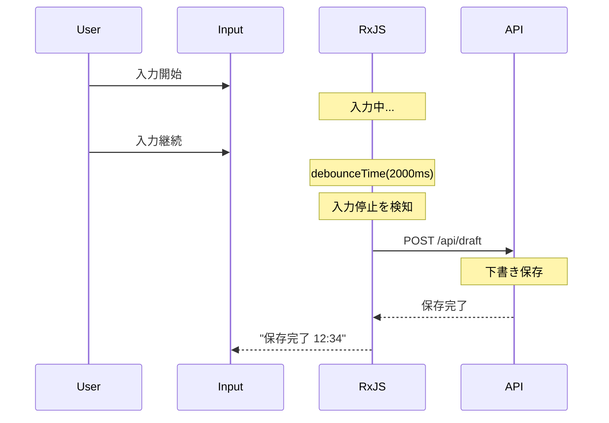

# フォーム処理パターン

フォーム処理は、Webアプリケーション開発において中心的な機能の一つです。RxJSを使うことで、リアクティブで使いやすいフォームを効率的に実装できます。

この記事では、リアルタイムバリデーション、自動保存、複数フィールドの連携など、実務で必要なフォーム処理の具体的なパターンを解説します。

## この記事で学べること

- リアルタイムバリデーションの実装
- 自動保存機能（debounce + distinctUntilChanged）
- 複数フィールドの組み合わせ（combineLatest）
- 条件付きフィールド表示
- サブミット処理と二重送信防止（exhaustMap）
- エラー表示とリセット処理
- フォーム状態管理

> [!TIP] 前提知識
> この記事は、[Chapter 3: Creation Functions](../creation-functions/index.md) と [Chapter 4: オペレーター](../operators/index.md) の知識を前提としています。

## リアルタイムバリデーション

### 問題：入力のたびにバリデーションを実行したい

ユーザーが入力するたびにバリデーションを実行し、即座にフィードバックを提供したい。

### 解決策：debounceTime + distinctUntilChanged

```typescript
import { fromEvent, map, debounceTime, distinctUntilChanged } from 'rxjs';
interface ValidationResult {
  valid: boolean;
  message: string;
}

const emailInput = document.createElement('input');
emailInput.id = 'email';
emailInput.type = 'email';
emailInput.placeholder = 'メールアドレスを入力';
emailInput.style.padding = '10px';
emailInput.style.margin = '10px';
emailInput.style.width = '300px';
emailInput.style.fontSize = '16px';
emailInput.style.border = '2px solid #ccc';
emailInput.style.borderRadius = '4px';
document.body.appendChild(emailInput);

const emailError = document.createElement('div');
emailError.id = 'email-error';
emailError.style.margin = '0 10px 10px 10px';
emailError.style.color = '#f44336';
emailError.style.fontSize = '14px';
emailError.style.minHeight = '20px';
document.body.appendChild(emailError);

fromEvent(emailInput, 'input').pipe(
  map(event => (event.target as HTMLInputElement).value.trim()),
  debounceTime(300),           // 入力停止後300ms待つ
  distinctUntilChanged()       // 前回と同じ値なら無視
).subscribe(email => {
  const result = validateEmail(email);

  if (result.valid) {
    emailInput.style.borderColor = '#4CAF50';
    emailError.textContent = '';
  } else {
    emailInput.style.borderColor = '#f44336';
    emailError.textContent = result.message;
  }
});

// メールアドレスのバリデーション
function validateEmail(email: string): ValidationResult {
  if (email.length === 0) {
    return { valid: false, message: 'メールアドレスを入力してください' };
  }

  const emailRegex = /^[^\s@]+@[^\s@]+\.[^\s@]+$/;
  if (!emailRegex.test(email)) {
    return { valid: false, message: 'メールアドレスの形式が正しくありません' };
  }

  return { valid: true, message: '' };
}
```

> [!NOTE] リアルタイムバリデーションのポイント
> - `debounceTime(300)` で入力停止を待つ（過剰な処理を防ぐ）
> - `distinctUntilChanged()` で重複バリデーションを防ぐ
> - バリデーション結果を視覚的にフィードバック（CSSクラス）

### 複数の検証ルールを組み合わせる

```typescript
import { fromEvent, combineLatest, map, debounceTime, distinctUntilChanged, startWith } from 'rxjs';
interface PasswordValidation {
  minLength: boolean;
  hasUpperCase: boolean;
  hasLowerCase: boolean;
  hasNumber: boolean;
  hasSpecialChar: boolean;
}

const passwordInput = document.createElement('input');
passwordInput.id = 'password';
passwordInput.type = 'password';
passwordInput.placeholder = 'パスワード';
passwordInput.style.padding = '10px';
passwordInput.style.margin = '10px';
passwordInput.style.width = '300px';
passwordInput.style.fontSize = '16px';
passwordInput.style.border = '2px solid #ccc';
passwordInput.style.borderRadius = '4px';
passwordInput.style.display = 'block';
document.body.appendChild(passwordInput);

const confirmPasswordInput = document.createElement('input');
confirmPasswordInput.id = 'confirm-password';
confirmPasswordInput.type = 'password';
confirmPasswordInput.placeholder = 'パスワード確認';
confirmPasswordInput.style.padding = '10px';
confirmPasswordInput.style.margin = '10px';
confirmPasswordInput.style.width = '300px';
confirmPasswordInput.style.fontSize = '16px';
confirmPasswordInput.style.border = '2px solid #ccc';
confirmPasswordInput.style.borderRadius = '4px';
confirmPasswordInput.style.display = 'block';
document.body.appendChild(confirmPasswordInput);

const confirmError = document.createElement('div');
confirmError.id = 'confirm-error';
confirmError.style.margin = '0 10px 10px 10px';
confirmError.style.color = '#f44336';
confirmError.style.fontSize = '14px';
confirmError.style.minHeight = '20px';
document.body.appendChild(confirmError);

// Create validation checklist elements
const validationContainer = document.createElement('div');
validationContainer.style.margin = '10px';
validationContainer.style.padding = '10px';
validationContainer.style.border = '1px solid #ddd';
validationContainer.style.borderRadius = '4px';
validationContainer.style.width = '300px';
document.body.appendChild(validationContainer);

const checkElements: Record<string, HTMLElement> = {};
const checks = [
  { id: 'check-length', label: '8文字以上' },
  { id: 'check-uppercase', label: '大文字を含む' },
  { id: 'check-lowercase', label: '小文字を含む' },
  { id: 'check-number', label: '数字を含む' },
  { id: 'check-special', label: '記号を含む' }
];

checks.forEach(({ id, label }) => {
  const checkEl = document.createElement('div');
  checkEl.id = id;
  checkEl.textContent = `${label}`;
  checkEl.style.padding = '5px';
  checkEl.style.color = '#999';
  validationContainer.appendChild(checkEl);
  checkElements[id] = checkEl;
});

const password$ = fromEvent(passwordInput, 'input').pipe(
  map(event => (event.target as HTMLInputElement).value),
  debounceTime(300),
  distinctUntilChanged(),
  startWith('')
);

const confirmPassword$ = fromEvent(confirmPasswordInput, 'input').pipe(
  map(event => (event.target as HTMLInputElement).value),
  debounceTime(300),
  distinctUntilChanged(),
  startWith('')
);

// パスワードの検証
password$.subscribe(password => {
  const validation = validatePassword(password);
  displayPasswordValidation(validation);
});

// パスワード一致確認
combineLatest([password$, confirmPassword$]).subscribe(
  ([password, confirmPassword]) => {
    if (confirmPassword.length === 0) {
      confirmError.textContent = '';
      confirmPasswordInput.style.borderColor = '#ccc';
      return;
    }

    if (password !== confirmPassword) {
      confirmError.textContent = 'パスワードが一致しません';
      confirmPasswordInput.style.borderColor = '#f44336';
    } else {
      confirmError.textContent = '';
      confirmPasswordInput.style.borderColor = '#4CAF50';
    }
  }
);

function validatePassword(password: string): PasswordValidation {
  return {
    minLength: password.length >= 8,
    hasUpperCase: /[A-Z]/.test(password),
    hasLowerCase: /[a-z]/.test(password),
    hasNumber: /[0-9]/.test(password),
    hasSpecialChar: /[!@#$%^&*(),.?":{}|<>]/.test(password)
  };
}

function displayPasswordValidation(validation: PasswordValidation): void {
  const checkItems = [
    { id: 'check-length', valid: validation.minLength },
    { id: 'check-uppercase', valid: validation.hasUpperCase },
    { id: 'check-lowercase', valid: validation.hasLowerCase },
    { id: 'check-number', valid: validation.hasNumber },
    { id: 'check-special', valid: validation.hasSpecialChar }
  ];

  checkItems.forEach(({ id, valid }) => {
    const element = checkElements[id];
    if (element) {
      if (valid) {
        element.style.color = '#4CAF50';
        element.style.fontWeight = 'bold';
      } else {
        element.style.color = '#999';
        element.style.fontWeight = 'normal';
      }
    }
  });
}
```

> [!TIP] combineLatestの活用
> `combineLatest` を使うことで、複数のフィールドの値を組み合わせたバリデーション（パスワード一致確認等）を簡単に実装できます。

## 自動保存機能

### 問題：下書きを自動的に保存したい

ユーザーの入力内容を定期的に自動保存し、データ損失を防ぎたい。

### 解決策：debounceTime + switchMap

```typescript
import { fromEvent, combineLatest, of, map, debounceTime, distinctUntilChanged, switchMap, catchError, tap, startWith } from 'rxjs';
interface DraftData {
  title: string;
  content: string;
  lastSaved?: Date;
}

const titleInput = document.createElement('input');
titleInput.id = 'title';
titleInput.type = 'text';
titleInput.placeholder = 'タイトルを入力';
titleInput.style.padding = '10px';
titleInput.style.margin = '10px';
titleInput.style.width = '500px';
titleInput.style.fontSize = '18px';
titleInput.style.border = '2px solid #ccc';
titleInput.style.borderRadius = '4px';
titleInput.style.display = 'block';
document.body.appendChild(titleInput);

const contentTextarea = document.createElement('textarea');
contentTextarea.id = 'content';
contentTextarea.placeholder = '内容を入力';
contentTextarea.rows = 10;
contentTextarea.style.padding = '10px';
contentTextarea.style.margin = '10px';
contentTextarea.style.width = '500px';
contentTextarea.style.fontSize = '16px';
contentTextarea.style.border = '2px solid #ccc';
contentTextarea.style.borderRadius = '4px';
contentTextarea.style.display = 'block';
contentTextarea.style.resize = 'vertical';
document.body.appendChild(contentTextarea);

const saveStatus = document.createElement('div');
saveStatus.id = 'save-status';
saveStatus.style.margin = '10px';
saveStatus.style.fontSize = '14px';
saveStatus.style.color = '#666';
saveStatus.style.minHeight = '20px';
document.body.appendChild(saveStatus);

const title$ = fromEvent(titleInput, 'input').pipe(
  map(event => (event.target as HTMLInputElement).value),
  startWith('')
);

const content$ = fromEvent(contentTextarea, 'input').pipe(
  map(event => (event.target as HTMLTextAreaElement).value),
  startWith('')
);

// フォームの変更を監視
combineLatest([title$, content$]).pipe(
  map(([title, content]): DraftData => ({ title, content })),
  debounceTime(2000),          // 入力停止後2秒待つ
  distinctUntilChanged((prev, curr) =>
    prev.title === curr.title && prev.content === curr.content
  ),
  tap(() => {
    saveStatus.textContent = '保存中...';
    saveStatus.style.color = '#FF9800';
  }),
  switchMap(draft =>
    saveDraft(draft).pipe(
      map(savedDraft => ({ ...savedDraft, success: true })),
      catchError(err => {
        console.error('保存エラー:', err);
        return of({ ...draft, success: false });
      })
    )
  )
).subscribe(result => {
  if (result.success) {
    saveStatus.textContent = `保存完了 (${formatTime(result.lastSaved!)})`;
    saveStatus.style.color = '#4CAF50';
  } else {
    saveStatus.textContent = '保存に失敗しました';
    saveStatus.style.color = '#f44336';
  }
});

// 下書き保存API（モック）
function saveDraft(draft: DraftData) {
  console.log('下書き保存:', draft);
  return of({
    ...draft,
    lastSaved: new Date()
  });
}

function formatTime(date: Date): string {
  const hours = date.getHours().toString().padStart(2, '0');
  const minutes = date.getMinutes().toString().padStart(2, '0');
  return `${hours}:${minutes}`;
}
```

#### 自動保存の流れ



> [!IMPORTANT] 自動保存のベストプラクティス
> - **debounceTime**: 適切な遅延時間（1〜3秒）を設定
> - **distinctUntilChanged**: 内容が変わっていない場合は保存しない
> - **switchMap**: 古いリクエストをキャンセル
> - **視覚的フィードバック**: 保存状態をユーザーに表示

## 複数フィールドの連携

### 問題：他のフィールドの値に応じて表示を変えたい

例：国を選択すると都道府県リストが変わる、配送方法によって配送先入力の表示が変わる、など。

### 解決策：combineLatestとwithLatestFrom

```typescript
import { fromEvent, of, map, startWith, switchMap } from 'rxjs';
interface Country {
  code: string;
  name: string;
}

interface Prefecture {
  code: string;
  name: string;
  countryCode: string;
}

const countrySelect = document.createElement('select');
countrySelect.id = 'country';
countrySelect.style.padding = '10px';
countrySelect.style.margin = '10px';
countrySelect.style.fontSize = '16px';
countrySelect.style.border = '2px solid #ccc';
countrySelect.style.borderRadius = '4px';
countrySelect.style.display = 'block';

// Add country options
const countries: Country[] = [
  { code: '', name: '国を選択' },
  { code: 'JP', name: '日本' },
  { code: 'US', name: 'アメリカ' }
];
countries.forEach(country => {
  const option = document.createElement('option');
  option.value = country.code;
  option.textContent = country.name;
  countrySelect.appendChild(option);
});
document.body.appendChild(countrySelect);

const prefectureSelect = document.createElement('select');
prefectureSelect.id = 'prefecture';
prefectureSelect.style.padding = '10px';
prefectureSelect.style.margin = '10px';
prefectureSelect.style.fontSize = '16px';
prefectureSelect.style.border = '2px solid #ccc';
prefectureSelect.style.borderRadius = '4px';
prefectureSelect.style.display = 'block';

// Add initial empty option
const emptyOption = document.createElement('option');
emptyOption.value = '';
emptyOption.textContent = '選択してください';
prefectureSelect.appendChild(emptyOption);
document.body.appendChild(prefectureSelect);

const country$ = fromEvent(countrySelect, 'change').pipe(
  map(() => countrySelect.value),
  startWith(countrySelect.value)
);

// 国が変わったら都道府県リストを更新
country$.pipe(
  switchMap(countryCode =>
    getPrefecturesByCountry(countryCode)
  )
).subscribe(prefectures => {
  updatePrefectureOptions(prefectureSelect, prefectures);
});

// 国コードから都道府県リストを取得（モック）
function getPrefecturesByCountry(countryCode: string) {
  const prefectures: Record<string, Prefecture[]> = {
    JP: [
      { code: '13', name: '東京都', countryCode: 'JP' },
      { code: '14', name: '神奈川県', countryCode: 'JP' },
      { code: '27', name: '大阪府', countryCode: 'JP' }
    ],
    US: [
      { code: 'CA', name: 'California', countryCode: 'US' },
      { code: 'NY', name: 'New York', countryCode: 'US' },
      { code: 'TX', name: 'Texas', countryCode: 'US' }
    ]
  };

  return of(prefectures[countryCode] || []);
}

function updatePrefectureOptions(
  select: HTMLSelectElement,
  prefectures: Prefecture[]
): void {
  select.innerHTML = '<option value="">選択してください</option>';

  prefectures.forEach(pref => {
    const option = document.createElement('option');
    option.value = pref.code;
    option.textContent = pref.name;
    select.appendChild(option);
  });
}
```

### 条件付きフィールド表示

```typescript
import { fromEvent, map, startWith } from 'rxjs';

const shippingMethodSelect = document.createElement('select');
shippingMethodSelect.id = 'shipping-method';
shippingMethodSelect.style.padding = '10px';
shippingMethodSelect.style.margin = '10px';
shippingMethodSelect.style.fontSize = '16px';
shippingMethodSelect.style.border = '2px solid #ccc';
shippingMethodSelect.style.borderRadius = '4px';
shippingMethodSelect.style.display = 'block';

const shippingOptions = [
  { value: '', label: '配送方法を選択' },
  { value: 'home-delivery', label: '自宅配送' },
  { value: 'store-pickup', label: '店舗受取' }
];
shippingOptions.forEach(option => {
  const optionEl = document.createElement('option');
  optionEl.value = option.value;
  optionEl.textContent = option.label;
  shippingMethodSelect.appendChild(optionEl);
});
document.body.appendChild(shippingMethodSelect);

const homeDeliverySection = document.createElement('div');
homeDeliverySection.id = 'home-delivery';
homeDeliverySection.style.padding = '15px';
homeDeliverySection.style.margin = '10px';
homeDeliverySection.style.border = '2px solid #4CAF50';
homeDeliverySection.style.borderRadius = '4px';
homeDeliverySection.style.backgroundColor = '#f1f8f4';
homeDeliverySection.style.display = 'none';
homeDeliverySection.innerHTML = '<h4 style="margin-top: 0;">自宅配送の情報を入力</h4><p>住所、電話番号などを入力してください</p>';
document.body.appendChild(homeDeliverySection);

const storePickupSection = document.createElement('div');
storePickupSection.id = 'store-pickup';
storePickupSection.style.padding = '15px';
storePickupSection.style.margin = '10px';
storePickupSection.style.border = '2px solid #2196F3';
storePickupSection.style.borderRadius = '4px';
storePickupSection.style.backgroundColor = '#e3f2fd';
storePickupSection.style.display = 'none';
storePickupSection.innerHTML = '<h4 style="margin-top: 0;">店舗受取の情報を入力</h4><p>受取店舗を選択してください</p>';
document.body.appendChild(storePickupSection);

fromEvent(shippingMethodSelect, 'change').pipe(
  map(() => shippingMethodSelect.value),
  startWith(shippingMethodSelect.value)
).subscribe(method => {
  if (method === 'home-delivery') {
    homeDeliverySection.style.display = 'block';
    storePickupSection.style.display = 'none';
  } else if (method === 'store-pickup') {
    homeDeliverySection.style.display = 'none';
    storePickupSection.style.display = 'block';
  } else {
    homeDeliverySection.style.display = 'none';
    storePickupSection.style.display = 'none';
  }
});
```

### 複数条件による送料計算

```typescript
import { combineLatest, fromEvent, map, startWith } from 'rxjs';
interface ShippingCalc {
  country: string;
  weight: number;
  shippingMethod: string;
}

const countrySelect = document.createElement('select');
countrySelect.id = 'country';
countrySelect.style.padding = '10px';
countrySelect.style.margin = '10px';
countrySelect.style.fontSize = '16px';
countrySelect.style.border = '2px solid #ccc';
countrySelect.style.borderRadius = '4px';
countrySelect.style.display = 'block';

const countryOptions = [
  { value: 'JP', label: '日本' },
  { value: 'US', label: 'アメリカ' },
  { value: 'OTHER', label: 'その他' }
];
countryOptions.forEach(option => {
  const optionEl = document.createElement('option');
  optionEl.value = option.value;
  optionEl.textContent = option.label;
  countrySelect.appendChild(optionEl);
});
document.body.appendChild(countrySelect);

const weightInput = document.createElement('input');
weightInput.id = 'weight';
weightInput.type = 'number';
weightInput.placeholder = '重量 (kg)';
weightInput.min = '0';
weightInput.step = '0.1';
weightInput.value = '1';
weightInput.style.padding = '10px';
weightInput.style.margin = '10px';
weightInput.style.width = '200px';
weightInput.style.fontSize = '16px';
weightInput.style.border = '2px solid #ccc';
weightInput.style.borderRadius = '4px';
weightInput.style.display = 'block';
document.body.appendChild(weightInput);

const shippingMethodSelect = document.createElement('select');
shippingMethodSelect.id = 'shipping-method';
shippingMethodSelect.style.padding = '10px';
shippingMethodSelect.style.margin = '10px';
shippingMethodSelect.style.fontSize = '16px';
shippingMethodSelect.style.border = '2px solid #ccc';
shippingMethodSelect.style.borderRadius = '4px';
shippingMethodSelect.style.display = 'block';

const methodOptions = [
  { value: 'standard', label: '通常配送' },
  { value: 'express', label: '速達配送' }
];
methodOptions.forEach(option => {
  const optionEl = document.createElement('option');
  optionEl.value = option.value;
  optionEl.textContent = option.label;
  shippingMethodSelect.appendChild(optionEl);
});
document.body.appendChild(shippingMethodSelect);

const shippingCostDisplay = document.createElement('div');
shippingCostDisplay.id = 'shipping-cost';
shippingCostDisplay.style.padding = '15px';
shippingCostDisplay.style.margin = '10px';
shippingCostDisplay.style.fontSize = '20px';
shippingCostDisplay.style.fontWeight = 'bold';
shippingCostDisplay.style.color = '#2196F3';
shippingCostDisplay.style.border = '2px solid #2196F3';
shippingCostDisplay.style.borderRadius = '4px';
shippingCostDisplay.style.backgroundColor = '#e3f2fd';
shippingCostDisplay.textContent = '送料: ¥0';
document.body.appendChild(shippingCostDisplay);

const country$ = fromEvent(countrySelect, 'change').pipe(
  map(() => countrySelect.value),
  startWith(countrySelect.value)
);

const weight$ = fromEvent(weightInput, 'input').pipe(
  map(() => parseFloat(weightInput.value) || 0),
  startWith(parseFloat(weightInput.value) || 1)
);

const shippingMethod$ = fromEvent(shippingMethodSelect, 'change').pipe(
  map(() => shippingMethodSelect.value),
  startWith(shippingMethodSelect.value)
);

combineLatest([country$, weight$, shippingMethod$]).pipe(
  map(([country, weight, shippingMethod]): ShippingCalc => ({
    country,
    weight,
    shippingMethod
  })),
  map(calc => calculateShippingCost(calc))
).subscribe(cost => {
  shippingCostDisplay.textContent = `送料: ¥${cost.toLocaleString()}`;
});

function calculateShippingCost(calc: ShippingCalc): number {
  let baseCost = 0;

  // 国による基本料金
  if (calc.country === 'JP') {
    baseCost = 500;
  } else if (calc.country === 'US') {
    baseCost = 2000;
  } else {
    baseCost = 3000;
  }

  // 重量による追加料金（1kg以上は100円/kgずつ加算）
  if (calc.weight > 1) {
    baseCost += Math.ceil(calc.weight - 1) * 100;
  }

  // 配送方法による倍率
  if (calc.shippingMethod === 'express') {
    baseCost *= 2;
  }

  return baseCost;
}
```

> [!TIP] combineLatestの使いどころ
> 複数のフィールドの値を組み合わせて計算・表示する場合に最適です。
> - 送料計算（国 + 重量 + 配送方法）
> - 割引計算（商品 + クーポン + 会員ランク）
> - 検索フィルター（カテゴリ + 価格帯 + 評価）

## サブミット処理と二重送信防止

### 問題：ボタン連打による重複送信を防ぎたい

フォーム送信ボタンを連打されると、同じデータが複数回送信されてしまう。

### 解決策：exhaustMapで二重送信を防ぐ

```typescript
import { fromEvent, of, exhaustMap, tap, catchError, finalize } from 'rxjs';
interface FormData {
  name: string;
  email: string;
  message: string;
}

const form = document.createElement('form');
form.id = 'contact-form';
form.style.padding = '20px';
form.style.margin = '10px';
form.style.border = '2px solid #ccc';
form.style.borderRadius = '8px';
form.style.maxWidth = '500px';
form.style.backgroundColor = '#f9f9f9';

const nameInput = document.createElement('input');
nameInput.type = 'text';
nameInput.name = 'name';
nameInput.placeholder = '名前';
nameInput.required = true;
nameInput.style.padding = '10px';
nameInput.style.margin = '10px 0';
nameInput.style.width = '100%';
nameInput.style.fontSize = '16px';
nameInput.style.border = '1px solid #ccc';
nameInput.style.borderRadius = '4px';
nameInput.style.boxSizing = 'border-box';
form.appendChild(nameInput);

const emailInput = document.createElement('input');
emailInput.type = 'email';
emailInput.name = 'email';
emailInput.placeholder = 'メールアドレス';
emailInput.required = true;
emailInput.style.padding = '10px';
emailInput.style.margin = '10px 0';
emailInput.style.width = '100%';
emailInput.style.fontSize = '16px';
emailInput.style.border = '1px solid #ccc';
emailInput.style.borderRadius = '4px';
emailInput.style.boxSizing = 'border-box';
form.appendChild(emailInput);

const messageTextarea = document.createElement('textarea');
messageTextarea.name = 'message';
messageTextarea.placeholder = 'メッセージ';
messageTextarea.required = true;
messageTextarea.rows = 5;
messageTextarea.style.padding = '10px';
messageTextarea.style.margin = '10px 0';
messageTextarea.style.width = '100%';
messageTextarea.style.fontSize = '16px';
messageTextarea.style.border = '1px solid #ccc';
messageTextarea.style.borderRadius = '4px';
messageTextarea.style.resize = 'vertical';
messageTextarea.style.boxSizing = 'border-box';
form.appendChild(messageTextarea);

const submitButton = document.createElement('button');
submitButton.id = 'submit-button';
submitButton.type = 'submit';
submitButton.textContent = '送信';
submitButton.style.padding = '12px 30px';
submitButton.style.margin = '10px 0';
submitButton.style.fontSize = '16px';
submitButton.style.fontWeight = 'bold';
submitButton.style.color = '#fff';
submitButton.style.backgroundColor = '#2196F3';
submitButton.style.border = 'none';
submitButton.style.borderRadius = '4px';
submitButton.style.cursor = 'pointer';
form.appendChild(submitButton);

document.body.appendChild(form);

const statusMessage = document.createElement('div');
statusMessage.id = 'status-message';
statusMessage.style.padding = '10px';
statusMessage.style.margin = '10px';
statusMessage.style.fontSize = '16px';
statusMessage.style.borderRadius = '4px';
statusMessage.style.minHeight = '20px';
document.body.appendChild(statusMessage);

fromEvent(form, 'submit').pipe(
  tap(event => {
    event.preventDefault();
    submitButton.disabled = true;
    submitButton.textContent = '送信中...';
    submitButton.style.backgroundColor = '#999';
    statusMessage.textContent = '';
  }),
  exhaustMap(() => {
    // フォームデータを収集
    const formData = new FormData(form);
    const data: FormData = {
      name: formData.get('name') as string,
      email: formData.get('email') as string,
      message: formData.get('message') as string
    };

    return submitForm(data).pipe(
      catchError(err => {
        console.error('送信エラー:', err);
        return of({ success: false, error: err.message });
      })
    );
  }),
  finalize(() => {
    submitButton.disabled = false;
    submitButton.textContent = '送信';
    submitButton.style.backgroundColor = '#2196F3';
  })
).subscribe(result => {
  if (result.success) {
    statusMessage.textContent = '送信に成功しました！';
    statusMessage.style.backgroundColor = '#d4edda';
    statusMessage.style.color = '#155724';
    statusMessage.style.border = '1px solid #c3e6cb';
    form.reset();
  } else {
    const errorText = 'error' in result ? result.error : '不明なエラー';
    statusMessage.textContent = `送信に失敗しました: ${errorText}`;
    statusMessage.style.backgroundColor = '#f8d7da';
    statusMessage.style.color = '#721c24';
    statusMessage.style.border = '1px solid #f5c6cb';
  }
});

// フォーム送信API（モック）
function submitForm(data: FormData) {
  console.log('フォーム送信:', data);
  return of({ success: true });
}
```

**exhaustMapの動作：**

```
ユーザーのクリック: ●    ●●●        ●
                    |    |          |
exhaustMap:         ●              ●
                    |              |
                  API送信        API送信
                   (完了後)      (完了後)

※ 送信中の連打は無視される
```

> [!IMPORTANT] exhaustMapの重要性
> **exhaustMap** は、前のObservableが完了するまで新しい値を無視します。  
これにより、
> - ボタン連打による重複送信を防止
> - API呼び出し中の追加リクエストをブロック
> - ユーザーの誤操作を防ぐ

### サブミット前のバリデーション

```typescript
import { fromEvent, combineLatest, map, startWith, exhaustMap, withLatestFrom, filter, tap, of } from 'rxjs';
interface FormData {
  name: string;
  email: string;
  message: string;
}

const form = document.createElement('form');
form.id = 'contact-form';
form.style.padding = '20px';
form.style.margin = '10px';
form.style.border = '2px solid #ccc';
form.style.borderRadius = '8px';
form.style.maxWidth = '500px';
form.style.backgroundColor = '#f9f9f9';

const nameInput = document.createElement('input');
nameInput.id = 'name';
nameInput.type = 'text';
nameInput.placeholder = '名前';
nameInput.style.padding = '10px';
nameInput.style.margin = '10px 0';
nameInput.style.width = '100%';
nameInput.style.fontSize = '16px';
nameInput.style.border = '1px solid #ccc';
nameInput.style.borderRadius = '4px';
nameInput.style.boxSizing = 'border-box';
form.appendChild(nameInput);

const emailInput = document.createElement('input');
emailInput.id = 'email';
emailInput.type = 'email';
emailInput.placeholder = 'メールアドレス';
emailInput.style.padding = '10px';
emailInput.style.margin = '10px 0';
emailInput.style.width = '100%';
emailInput.style.fontSize = '16px';
emailInput.style.border = '1px solid #ccc';
emailInput.style.borderRadius = '4px';
emailInput.style.boxSizing = 'border-box';
form.appendChild(emailInput);

const messageTextarea = document.createElement('textarea');
messageTextarea.id = 'message';
messageTextarea.placeholder = 'メッセージ（10文字以上）';
messageTextarea.rows = 5;
messageTextarea.style.padding = '10px';
messageTextarea.style.margin = '10px 0';
messageTextarea.style.width = '100%';
messageTextarea.style.fontSize = '16px';
messageTextarea.style.border = '1px solid #ccc';
messageTextarea.style.borderRadius = '4px';
messageTextarea.style.resize = 'vertical';
messageTextarea.style.boxSizing = 'border-box';
form.appendChild(messageTextarea);

const submitButton = document.createElement('button');
submitButton.id = 'submit-button';
submitButton.type = 'submit';
submitButton.textContent = '送信';
submitButton.disabled = true;
submitButton.style.padding = '12px 30px';
submitButton.style.margin = '10px 0';
submitButton.style.fontSize = '16px';
submitButton.style.fontWeight = 'bold';
submitButton.style.color = '#fff';
submitButton.style.backgroundColor = '#999';
submitButton.style.border = 'none';
submitButton.style.borderRadius = '4px';
submitButton.style.cursor = 'not-allowed';
form.appendChild(submitButton);

document.body.appendChild(form);

// 各フィールドのバリデーション状態
const nameValid$ = fromEvent(nameInput, 'input').pipe(
  map(() => nameInput.value.trim().length > 0),
  startWith(false)
);

const emailValid$ = fromEvent(emailInput, 'input').pipe(
  map(() => /^[^\s@]+@[^\s@]+\.[^\s@]+$/.test(emailInput.value)),
  startWith(false)
);

const messageValid$ = fromEvent(messageTextarea, 'input').pipe(
  map(() => messageTextarea.value.trim().length >= 10),
  startWith(false)
);

// すべてのフィールドが有効かチェック
const formValid$ = combineLatest([nameValid$, emailValid$, messageValid$]).pipe(
  map(([name, email, message]) => name && email && message)
);

// サブミットボタンの有効/無効を切り替え
formValid$.subscribe(valid => {
  submitButton.disabled = !valid;
  if (valid) {
    submitButton.style.backgroundColor = '#2196F3';
    submitButton.style.cursor = 'pointer';
  } else {
    submitButton.style.backgroundColor = '#999';
    submitButton.style.cursor = 'not-allowed';
  }
});

// フォーム送信処理
fromEvent(form, 'submit').pipe(
  tap(event => event.preventDefault()),
  withLatestFrom(formValid$),
  filter(([_, valid]) => valid), // バリデーションが通っている場合のみ
  exhaustMap(() => {
    const data = {
      name: nameInput.value,
      email: emailInput.value,
      message: messageTextarea.value
    };

    return submitForm(data);
  })
).subscribe(result => {
  console.log('送信完了:', result);
  form.reset();
});

// フォーム送信API（モック）
function submitForm(data: FormData) {
  console.log('フォーム送信:', data);
  return of({ success: true });
}
```

> [!TIP] withLatestFromの活用
> `withLatestFrom` を使うことで、サブミット時に最新のバリデーション状態を確認できます。

## エラー表示とリセット処理

### フォームエラーの一元管理

```typescript
import { BehaviorSubject} from 'rxjs';

class FormErrorManager {
  private errors$ = new BehaviorSubject<Map<string, string>>(new Map());
  private elementCache = new Map<string, { error: HTMLElement; input: HTMLElement }>();

  setError(field: string, message: string): void {
    const currentErrors = this.errors$.value;
    currentErrors.set(field, message);
    this.errors$.next(new Map(currentErrors));
    this.displayError(field, message);
  }

  clearError(field: string): void {
    const currentErrors = this.errors$.value;
    currentErrors.delete(field);
    this.errors$.next(new Map(currentErrors));
    this.hideError(field);
  }

  clearAllErrors(): void {
    this.errors$.next(new Map());
    this.hideAllErrors();
  }

  hasErrors(): boolean {
    return this.errors$.value.size > 0;
  }

  getErrors() {
    return this.errors$.asObservable();
  }

  // Register elements for a field (must be called before using setError/clearError)
  registerField(field: string, inputElement: HTMLElement, errorElement: HTMLElement): void {
    this.elementCache.set(field, { input: inputElement, error: errorElement });
  }

  private displayError(field: string, message: string): void {
    const elements = this.elementCache.get(field);
    if (!elements) {
      console.warn(`Field "${field}" not registered. Call registerField() first.`);
      return;
    }

    elements.error.textContent = message;
    elements.error.style.display = 'block';
    elements.input.style.borderColor = '#f44336';
    elements.input.style.backgroundColor = '#ffebee';
  }

  private hideError(field: string): void {
    const elements = this.elementCache.get(field);
    if (!elements) {
      return;
    }

    elements.error.textContent = '';
    elements.error.style.display = 'none';
    elements.input.style.borderColor = '#ccc';
    elements.input.style.backgroundColor = '#fff';
  }

  private hideAllErrors(): void {
    this.elementCache.forEach((elements) => {
      elements.error.style.display = 'none';
      elements.error.textContent = '';
      elements.input.style.borderColor = '#ccc';
      elements.input.style.backgroundColor = '#fff';
    });
  }
}

// 使用例（Self-contained: creates form elements dynamically）
const errorManager = new FormErrorManager();

// Create email input and error elements
const emailInput = document.createElement('input');
emailInput.id = 'email';
emailInput.type = 'email';
emailInput.placeholder = 'メールアドレス';
emailInput.style.padding = '10px';
emailInput.style.margin = '10px';
emailInput.style.width = '300px';
emailInput.style.fontSize = '16px';
emailInput.style.border = '2px solid #ccc';
emailInput.style.borderRadius = '4px';
emailInput.style.display = 'block';
document.body.appendChild(emailInput);

const emailError = document.createElement('div');
emailError.id = 'email-error';
emailError.style.margin = '0 10px 10px 10px';
emailError.style.color = '#f44336';
emailError.style.fontSize = '14px';
emailError.style.display = 'none';
document.body.appendChild(emailError);

// Create password input and error elements
const passwordInput = document.createElement('input');
passwordInput.id = 'password';
passwordInput.type = 'password';
passwordInput.placeholder = 'パスワード';
passwordInput.style.padding = '10px';
passwordInput.style.margin = '10px';
passwordInput.style.width = '300px';
passwordInput.style.fontSize = '16px';
passwordInput.style.border = '2px solid #ccc';
passwordInput.style.borderRadius = '4px';
passwordInput.style.display = 'block';
document.body.appendChild(passwordInput);

const passwordError = document.createElement('div');
passwordError.id = 'password-error';
passwordError.style.margin = '0 10px 10px 10px';
passwordError.style.color = '#f44336';
passwordError.style.fontSize = '14px';
passwordError.style.display = 'none';
document.body.appendChild(passwordError);

// Register fields with error manager
errorManager.registerField('email', emailInput, emailError);
errorManager.registerField('password', passwordInput, passwordError);

// エラーを設定
errorManager.setError('email', 'メールアドレスの形式が正しくありません');
errorManager.setError('password', 'パスワードは8文字以上である必要があります');

// エラーをクリア
setTimeout(() => {
  errorManager.clearError('email');
}, 2000);

// すべてのエラーをクリア
setTimeout(() => {
  errorManager.clearAllErrors();
}, 4000);

// エラーの監視
errorManager.getErrors().subscribe(errors => {
  console.log('現在のエラー数:', errors.size);
});
```

## フォーム状態管理

### 完全なフォーム状態管理クラス

```typescript
import { BehaviorSubject, Observable } from 'rxjs';
interface FormState<T> {
  value: T;
  valid: boolean;
  dirty: boolean;
  touched: boolean;
  submitting: boolean;
}

class ReactiveForm<T extends Record<string, any>> {
  private state$: BehaviorSubject<FormState<T>>;
  private validators: Map<keyof T, ((value: any) => boolean)[]> = new Map();

  constructor(initialValue: T) {
    this.state$ = new BehaviorSubject<FormState<T>>({
      value: initialValue,
      valid: false,
      dirty: false,
      touched: false,
      submitting: false
    });
  }

  // フィールド値の更新
  setValue(field: keyof T, value: any): void {
    const currentState = this.state$.value;
    const newValue = { ...currentState.value, [field]: value };

    this.state$.next({
      ...currentState,
      value: newValue,
      valid: this.validateForm(newValue),
      dirty: true
    });
  }

  // バリデーターの追加
  addValidator(field: keyof T, validator: (value: any) => boolean): void {
    const validators = this.validators.get(field) || [];
    validators.push(validator);
    this.validators.set(field, validators);
  }

  // フォーム全体のバリデーション
  private validateForm(value: T): boolean {
    for (const [field, validators] of this.validators.entries()) {
      const fieldValue = value[field];
      const isValid = validators.every(validator => validator(fieldValue));
      if (!isValid) return false;
    }
    return true;
  }

  // touchedフラグの設定
  setTouched(field: keyof T): void {
    const currentState = this.state$.value;
    this.state$.next({
      ...currentState,
      touched: true
    });
  }

  // サブミット状態の設定
  setSubmitting(submitting: boolean): void {
    const currentState = this.state$.value;
    this.state$.next({
      ...currentState,
      submitting
    });
  }

  // フォームのリセット
  reset(initialValue?: T): void {
    const resetValue = initialValue || this.state$.value.value;
    this.state$.next({
      value: resetValue,
      valid: false,
      dirty: false,
      touched: false,
      submitting: false
    });
  }

  // 状態の取得
  getState(): Observable<FormState<T>> {
    return this.state$.asObservable();
  }

  getValue(): T {
    return this.state$.value.value;
  }

  isValid(): boolean {
    return this.state$.value.valid;
  }

  isDirty(): boolean {
    return this.state$.value.dirty;
  }
}

// 使用例
interface UserForm {
  name: string;
  email: string;
  age: number;
}

const userForm = new ReactiveForm<UserForm>({
  name: '',
  email: '',
  age: 0
});

// バリデーターの追加
userForm.addValidator('name', value => value.length > 0);
userForm.addValidator('email', value => /^[^\s@]+@[^\s@]+\.[^\s@]+$/.test(value));
userForm.addValidator('age', value => value >= 18);

// 値の更新
userForm.setValue('name', '山田太郎');
userForm.setValue('email', 'yamada@example.com');
userForm.setValue('age', 25);

// 状態の監視
userForm.getState().subscribe(state => {
  console.log('フォーム状態:', state);
  console.log('有効:', state.valid);
  console.log('変更あり:', state.dirty);
});

// フォーム送信
if (userForm.isValid()) {
  userForm.setSubmitting(true);
  const formData = userForm.getValue();
  console.log('送信データ:', formData);

  // API呼び出し後
  userForm.setSubmitting(false);
  userForm.reset();
}
```

> [!TIP] カスタムフォームクラスの利点
> - **状態管理の一元化**: すべてのフォーム状態を1箇所で管理
> - **バリデーションの統合**: フィールドごとの検証ルールを柔軟に設定
> - **リアクティブな更新**: 状態変更を自動的に通知
> - **再利用性**: 複数のフォームで同じロジックを使い回せる

## テストコード

フォーム処理のテスト例です。

```typescript
import { debounceTime, map } from 'rxjs';
import { TestScheduler } from 'rxjs/testing';

describe('フォーム処理', () => {
  let testScheduler: TestScheduler;

  beforeEach(() => {
    testScheduler = new TestScheduler((actual, expected) => {
      expect(actual).toEqual(expected);
    });
  });

  it('should validate email with debounce', () => {
    testScheduler.run(({ cold, expectObservable }) => {
      const input$ = cold('a-b-c----|', {
        a: 'test',
        b: 'test@',
        c: 'test@example.com'
      });

      const result$ = input$.pipe(
        debounceTime(300, testScheduler),
        map(email => /^[^\s@]+@[^\s@]+\.[^\s@]+$/.test(email))
      );

      expectObservable(result$).toBe('-----c----|', { c: true });
    });
  });

  it('should prevent double submit with exhaustMap', () => {
    testScheduler.run(({ cold, hot, expectObservable }) => {
      const submit$ = hot('a--b-c----d|');

      const result$ = submit$.pipe(
        exhaustMap(() => cold('---x|', { x: 'submitted' }))
      );

      // 最初と最後のsubmitのみ処理される
      expectObservable(result$).toBe('---x-----x|', { x: 'submitted' });
    });
  });
});
```

## まとめ

フォーム処理パターンをマスターすることで、ユーザーフレンドリーで堅牢なフォームを実装できます。

> [!IMPORTANT] 重要なポイント
> - **リアルタイムバリデーション**: debounceTime + distinctUntilChanged
> - **自動保存**: debounceTime + switchMap で過剰な保存を防ぐ
> - **複数フィールド連携**: combineLatest で値を組み合わせる
> - **二重送信防止**: exhaustMap で送信中の追加リクエストをブロック
> - **状態管理**: BehaviorSubject でフォーム状態を一元管理

> [!TIP] ベストプラクティス
> - **即座にフィードバック**: リアルタイムバリデーションでUX向上
> - **適切な遅延**: debounceTimeの設定（300ms〜2000ms）
> - **視覚的フィードバック**: エラー、保存状態を明確に表示
> - **アクセシビリティ**: aria属性、エラーメッセージの適切な配置
> - **テスト**: バリデーションロジックを必ずテスト

## 次のステップ

フォーム処理パターンを習得したら、次は以下のパターンに進みましょう。

- [API呼び出し](./api-calls.md) - フォーム送信とAPI連携
- [UIイベント処理](./ui-events.md) - フォーム内のUIイベント
- [リアルタイムデータ処理](./real-time-data.md) - リアルタイム検証、サーバー側検証
- [キャッシュ戦略](./caching-strategies.md) - フォームデータのキャッシュ

## 関連セクション

- [Chapter 3: Creation Functions](../creation-functions/index.md) - combineLatest, withLatestFrom の詳細
- [Chapter 4: オペレーター](../operators/index.md) - debounceTime, exhaustMap の詳細
- [Chapter 5: Subject](../subjects/what-is-subject.md) - BehaviorSubject の活用

## 参考リソース

- [RxJS公式: combineLatest](https://rxjs.dev/api/index/function/combineLatest) - combineLatest の詳細
- [RxJS公式: exhaustMap](https://rxjs.dev/api/operators/exhaustMap) - exhaustMap の詳細
- [Learn RxJS: Form Handling](https://www.learnrxjs.io/) - フォーム処理の実践例
