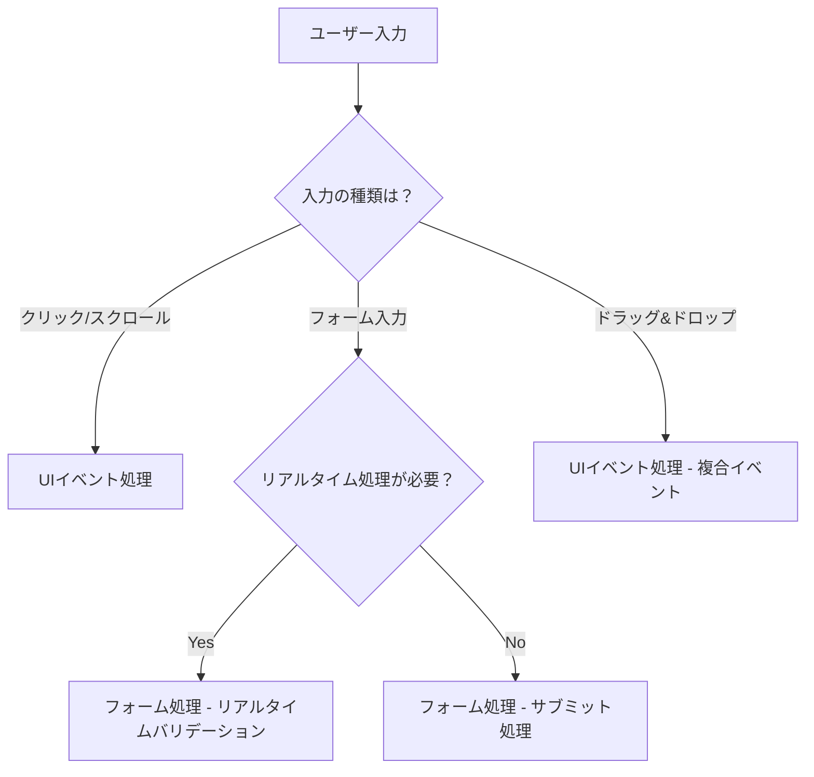
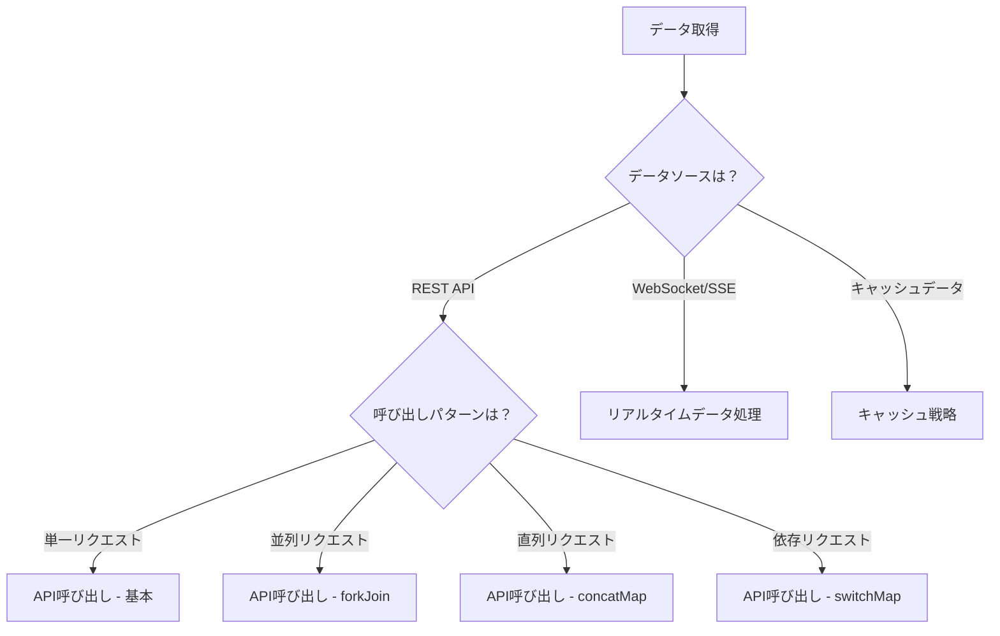
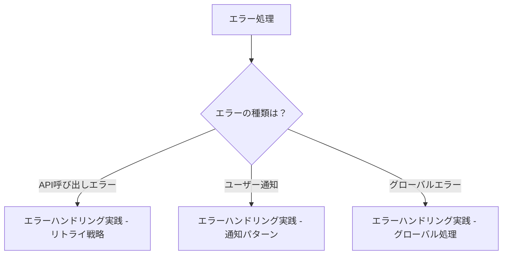

# 実践パターン集

RxJSの基礎知識を習得したら、次は実際のアプリケーション開発で「どう使うか」が重要になります。この章では、実務で頻繁に遭遇するシナリオに対する具体的な実装パターンを紹介します。

## なぜ実践パターンが重要か

RxJSの個々のオペレーターを理解していても、それらを組み合わせて実際の問題を解決するには経験とパターンの知識が必要です。実践パターンを学ぶことで、

- **開発速度の向上** - 車輪の再発明を避け、実証済みのパターンを適用できる
- **品質の向上** - エラーハンドリングやメモリリーク対策などのベストプラクティスを習得
- **保守性の向上** - 一貫したパターンでコードの可読性と保守性が改善
- **トラブルシューティング** - 問題の原因を特定し、適切な解決策を選択できる

## この章の構成

実践パターンは、難易度と使用頻度に応じて3つのフェーズに分けて解説します。

### コアパターン（最頻出）

実務で最も頻繁に使用される基本的なパターンです。まずはこれらをマスターしましょう。

| パターン | 内容 | 主な対象 |
|---------|------|---------|
| [UIイベント処理](./ui-events.md) | クリック、スクロール、ドラッグ&ドロップなどのUI操作 | フロントエンド全般 |
| [API呼び出し](./api-calls.md) | HTTP通信、並列/直列処理、エラーハンドリング | Web API連携 |
| [フォーム処理](./form-handling.md) | リアルタイムバリデーション、自動保存、複数フィールド連携 | フォーム実装 |

### 高度なパターン

より複雑なシナリオに対応する高度なパターンです。

| パターン | 内容 | 主な対象 |
|---------|------|---------|
| [リアルタイムデータ処理](./real-time-data.md) | WebSocket、SSE、Polling、接続管理 | リアルタイム通信 |
| [キャッシュ戦略](./caching-strategies.md) | データキャッシュ、TTL、無効化、オフライン対応 | パフォーマンス最適化 |

### 専門パターン

特定の課題に対する専門的なパターンです。

| パターン | 内容 | 主な対象 |
|---------|------|---------|
| [エラーハンドリング実践](./error-handling-patterns.md) | API呼び出しエラー、リトライ戦略、グローバルエラー処理 | エラー管理 |
| [subscribe内の条件分岐](./subscribe-branching.md) | subscribe内での分岐を避ける、パイプライン内での分岐方法 | コード品質 |

> [!TIP] 学習の進め方
> 初学者は **Phase 1** から順に進めることを推奨します。特に「API呼び出し」と「フォーム処理」は実務で必須のパターンです。

## パターンの構成

各パターンページは以下の構成で解説されています。

1. **問題の説明** - このパターンが解決する課題
2. **基本的な実装** - 最もシンプルな実装例
3. **実践的な例** - 実務で使える具体的なコード
4. **Before/After比較** - 改善前後のコード比較
5. **注意点とベストプラクティス** - よくある間違いと対策
6. **TypeScript型定義** - 型安全な実装方法
7. **テストコード** - パターンのテスト方法
8. **パフォーマンス考慮** - メモリリークやパフォーマンス最適化

## パターン選択のガイドライン

実装する機能に応じて、適切なパターンを選択するためのガイドラインです。

### ユーザー入力を扱う場合



### データ取得を扱う場合



### エラー処理を強化したい場合



## 実装時の考え方

RxJSパターンを実装する際の基本的な考え方を紹介します。

### 1. 宣言的に考える

「何をしたいか」を宣言的に表現し、手続き的なコードを避けます。

```typescript
// ❌ 手続き的（命令的）
let result = [];
source.subscribe(value => {
  if (value > 10) {
    const transformed = value * 2;
    result.push(transformed);
  }
});

// ✅ 宣言的
const result$ = source.pipe(
  filter(value => value > 10),
  map(value => value * 2)
);
```

### 2. パイプラインで処理を組み立てる

小さなオペレーターを組み合わせて、複雑な処理を構築します。

```typescript
const searchResults$ = searchInput$.pipe(
  debounceTime(300),           // 入力を300ms待機
  distinctUntilChanged(),      // 重複を除外
  filter(query => query.length >= 2), // 2文字以上で検索
  switchMap(query => searchAPI(query)), // API呼び出し
  catchError(err => of([]))    // エラー時は空配列
);
```

### 3. メモリリークを防ぐ

購読の適切な管理は必須です。

```typescript
// ✅ takeUntilで自動解除
private destroy$ = new Subject<void>();

ngOnInit() {
  this.data$.pipe(
    takeUntil(this.destroy$)
  ).subscribe(/*...*/);
}

ngOnDestroy() {
  this.destroy$.next();
  this.destroy$.complete();
}
```

### 4. エラーハンドリングを忘れない

すべての非同期処理にはエラーハンドリングを実装します。

```typescript
// ✅ catchErrorで適切にエラー処理
apiCall$.pipe(
  retry(3),
  catchError(err => {
    console.error('API error:', err);
    return of(defaultValue);
  })
).subscribe(/*...*/);
```

### 5. 型安全性を活用する

TypeScriptの型システムを最大限活用します。

```typescript
interface User {
  id: number;
  name: string;
  email: string;
}

// ✅ 明確な型定義
const users$: Observable<User[]> = fetchUsers();
const activeUsers$: Observable<User[]> = users$.pipe(
  map(users => users.filter(u => u.isActive))
);
```

## 既存知識との関連

この章のパターンは、以前の章で学んだ知識を実践で応用します。

| 実践パターン | 関連する章 | 活用する知識 |
|------------|-----------|------------|
| UIイベント処理 | [Chapter 4: オペレーター](../operators/index.md) | debounceTime, throttleTime, distinctUntilChanged |
| API呼び出し | [Chapter 6: エラーハンドリング](../error-handling/strategies.md) | catchError, retry, timeout |
| フォーム処理 | [Chapter 3: Creation Functions](../creation-functions/index.md) | combineLatest, withLatestFrom |
| リアルタイムデータ | [Chapter 5: Subject](../subjects/what-is-subject.md) | Subject, BehaviorSubject, shareReplay |
| キャッシュ戦略 | [Chapter 2: Cold/Hot](../observables/cold-and-hot-observables.md) | shareReplay, share |
| エラーハンドリング | [Chapter 6: エラーハンドリング](../error-handling/strategies.md) | catchError, retry, retryWhen |
| subscribe分岐 | [Chapter 10: アンチパターン](../anti-patterns/index.md) | アンチパターンの回避 |

> [!NOTE] 復習のタイミング
> 各パターンを学ぶ前に、関連する章を復習することで理解が深まります。

## よくある質問

### Q1: どのパターンから学ぶべきですか？

**A:** 実務で最も使用頻度が高い順に学ぶことを推奨します。

1. **API呼び出し** - Web開発の基本
2. **フォーム処理** - ユーザー入力処理
3. **UIイベント処理** - インタラクティブなUI
4. **エラーハンドリング** - 堅牢なアプリケーション
5. その他のパターン - プロジェクトのニーズに応じて

### Q2: パターンをそのまま使っても良いですか？

**A:** はい。この章のパターンは実務での使用を想定しています。  
ただし、

- プロジェクトの要件に応じてカスタマイズしてください
- パフォーマンスやメモリ使用量を考慮してください
- チームのコーディング規約に従ってください

### Q3: Angular/React/Vueで使えますか？

**A:** はい。この章のパターンはフレームワーク非依存です。  
ただし、

- フレームワーク固有の統合方法は Chapter 15: フレームワーク統合（準備中）を参照
- 各フレームワークのライフサイクルに合わせた購読解除が必要

## まとめ

実践パターン集は、RxJSを実際のプロジェクトで活用するための具体的なガイドです。

> [!IMPORTANT] 重要なポイント
> - **Phase 1のコアパターン**から順に学習する
> - **Before/After比較**で改善点を理解する
> - **メモリリーク対策**を必ず実装する
> - **エラーハンドリング**を忘れない
> - **型安全性**を活用する

> [!TIP] 学習のヒント
> - コードを実際に動かして理解を深める
> - 自分のプロジェクトに適用してみる
> - パターンを組み合わせて複雑な処理を構築する
> - テストコードも併せて学習する

次のステップとして、最も使用頻度の高い [API呼び出しパターン](./api-calls.md) から始めることを推奨します。

## 参考リソース

- [RxJS公式ドキュメント](https://rxjs.dev/) - 公式のAPIリファレンス
- [Learn RxJS](https://www.learnrxjs.io/) - オペレーター別の実践例
- [RxJS Marbles](https://rxmarbles.com/) - ビジュアルでオペレーターの動作を理解
- [Chapter 11: RxJS困難点克服](../overcoming-difficulties/index.md) - よくある困難とその克服方法
- [Chapter 10: アンチパターン集](../anti-patterns/index.md) - 避けるべきパターン
