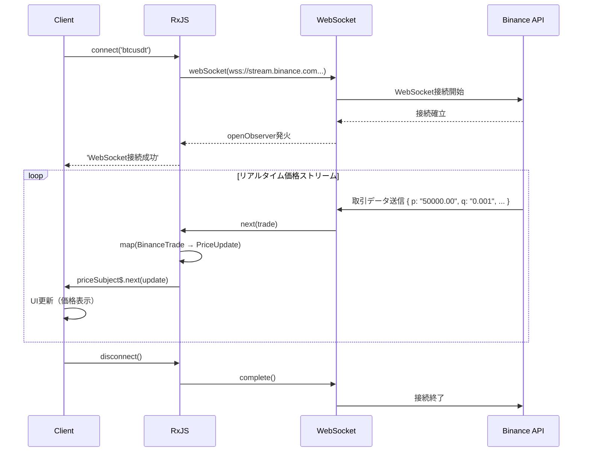

# リアルタイムデータ処理パターン

リアルタイムデータ処理は、チャット、通知、株価更新、IoTセンサー監視など、現代のWebアプリケーションにおいて重要な機能です。RxJSを使うことで、複雑なリアルタイム通信を宣言的かつ堅牢に実装できます。

この記事では、WebSocket、Server-Sent Events（SSE）、Pollingなど、実務で必要なリアルタイムデータ処理の具体的なパターンを解説します。

## この記事で学べること

- WebSocket通信の実装と管理
- Server-Sent Events（SSE）の活用
- Pollingによるリアルタイム更新
- 接続管理と自動再接続
- データのマージと更新
- リアルタイム通知システムの構築
- エラーハンドリングと接続状態管理

> [!TIP] 前提知識
> この記事は、[Chapter 5: Subject](../subjects/what-is-subject.md) と [Chapter 4: オペレーター](../operators/index.md) の知識を前提としています。特に `Subject`, `shareReplay`, `retry`, `retryWhen` の理解が重要です。

## WebSocket通信

### 問題：双方向リアルタイム通信を実装したい

暗号通貨価格、株価更新、チャットアプリケーションなど、サーバーとクライアント間で双方向のリアルタイム通信が必要。この例では、実際に動作する公開WebSocket APIを使用して、リアルタイムで暗号通貨価格を監視します。

### 解決策：RxJSのwebSocketを使う

**Binance公開WebSocket API**を使用して、ビットコインの取引データをリアルタイムで取得します。このコードはそのまま実行可能で、実際の価格データが流れます。

```typescript
import { EMPTY, Subject, retry, catchError, tap, map } from 'rxjs';
import { webSocket, WebSocketSubject } from 'rxjs/webSocket';

// Binance WebSocket APIの取引データ型
// https://binance-docs.github.io/apidocs/spot/en/#trade-streams
interface BinanceTrade {
  e: string;      // イベントタイプ "trade"
  E: number;      // イベント時刻
  s: string;      // シンボル "BTCUSDT"
  t: number;      // 取引ID
  p: string;      // 価格
  q: string;      // 数量
  T: number;      // 取引時刻
  m: boolean;     // 買い手がマーケットメーカーかどうか
}

// 表示用の簡潔な型
interface PriceUpdate {
  symbol: string;
  price: number;
  quantity: number;
  time: Date;
  isBuyerMaker: boolean;
}

class CryptoPriceService {
  private socket$: WebSocketSubject<BinanceTrade> | null = null;
  private priceSubject$ = new Subject<PriceUpdate>();

  public prices$ = this.priceSubject$.asObservable();

  /**
   * Binance公開WebSocket APIに接続
   * @param symbol 暗号通貨ペア（例: "btcusdt", "ethusdt"）
   */
  connect(symbol: string = 'btcusdt'): void {
    if (!this.socket$ || this.socket$.closed) {
      // Binance公開WebSocket API（認証不要）
      const url = `wss://stream.binance.com:9443/ws/${symbol}@trade`;

      this.socket$ = webSocket<BinanceTrade>({
        url,
        openObserver: {
          next: () => {
            console.log(`WebSocket接続成功: ${symbol.toUpperCase()}`);
          }
        },
        closeObserver: {
          next: () => {
            console.log('WebSocket接続終了');
          }
        }
      });

      this.socket$.pipe(
        // Binanceのデータを表示用に変換
        map(trade => ({
          symbol: trade.s,
          price: parseFloat(trade.p),
          quantity: parseFloat(trade.q),
          time: new Date(trade.T),
          isBuyerMaker: trade.m
        })),
        tap(update => console.log('価格更新:', update.price)),
        retry({
          count: 5,
          delay: 1000
        }),
        catchError(err => {
          console.error('WebSocketエラー:', err);
          return EMPTY;
        })
      ).subscribe(priceUpdate => {
        this.priceSubject$.next(priceUpdate);
      });
    }
  }

  disconnect(): void {
    if (this.socket$) {
      this.socket$.complete();
      this.socket$ = null;
    }
  }
}

// UI要素を動的に作成
const priceContainer = document.createElement('div');
priceContainer.id = 'price-display';
priceContainer.style.padding = '20px';
priceContainer.style.margin = '10px';
priceContainer.style.border = '2px solid #f0b90b'; // Binanceカラー
priceContainer.style.borderRadius = '8px';
priceContainer.style.backgroundColor = '#1e2329';
priceContainer.style.color = '#eaecef';
priceContainer.style.fontFamily = 'monospace';
document.body.appendChild(priceContainer);

const latestPriceDisplay = document.createElement('div');
latestPriceDisplay.style.fontSize = '32px';
latestPriceDisplay.style.fontWeight = 'bold';
latestPriceDisplay.style.marginBottom = '10px';
priceContainer.appendChild(latestPriceDisplay);

const tradesContainer = document.createElement('div');
tradesContainer.style.maxHeight = '400px';
tradesContainer.style.overflowY = 'auto';
tradesContainer.style.fontSize = '14px';
priceContainer.appendChild(tradesContainer);

// 使用例
const priceService = new CryptoPriceService();
priceService.connect('btcusdt'); // ビットコイン/USDTの取引データ

// 価格更新を受信
priceService.prices$.subscribe(update => {
  // 最新価格を大きく表示
  latestPriceDisplay.textContent = `${update.symbol}: $${update.price.toLocaleString('en-US', { minimumFractionDigits: 2 })}`;
  latestPriceDisplay.style.color = update.isBuyerMaker ? '#f6465d' : '#0ecb81'; // 売り/買いで色分け

  // 取引履歴を表示
  displayTrade(update, tradesContainer);
});

function displayTrade(update: PriceUpdate, container: HTMLElement): void {
  const tradeElement = document.createElement('div');
  tradeElement.style.padding = '5px';
  tradeElement.style.margin = '3px 0';
  tradeElement.style.borderBottom = '1px solid #2b3139';
  tradeElement.style.color = update.isBuyerMaker ? '#f6465d' : '#0ecb81';

  const timeStr = update.time.toLocaleTimeString('ja-JP');
  const side = update.isBuyerMaker ? '売' : '買';
  tradeElement.textContent = `[${timeStr}] ${side} $${update.price.toFixed(2)} × ${update.quantity.toFixed(4)}`;

  container.insertBefore(tradeElement, container.firstChild);

  // 最大50件まで保持
  while (container.children.length > 50) {
    container.removeChild(container.lastChild!);
  }
}

// クリーンアップ例
// priceService.disconnect();
```

> [!TIP] 実際に試せる公開WebSocket API
> このコードは**そのままコピー&ペーストで動作します**。Binanceの公開WebSocket APIは認証不要で、リアルタイムの暗号通貨取引データを提供しています。
>
> **他の暗号通貨ペアも試せます**：
> - `priceService.connect('ethusdt')` - イーサリアム/USDT
> - `priceService.connect('bnbusdt')` - BNB/USDT
> - `priceService.connect('adausdt')` - Cardano/USDT
>
> 詳細: [Binance WebSocket API Docs](https://binance-docs.github.io/apidocs/spot/en/#websocket-market-streams)

**WebSocket通信の流れ：**



> [!IMPORTANT] WebSocketの特性
> - **双方向通信**: サーバー・クライアント両方から送信可能（この例では受信のみ）
> - **リアルタイム**: HTTPより低レイテンシ、ミリ秒単位で価格更新
> - **状態管理**: 接続・切断を適切に管理する必要がある
> - **Subject**: WebSocketSubjectはSubjectとObservableの両方の性質を持つ
> - **再接続**: ネットワーク切断時の自動再接続が重要（次のセクションで解説）

### 自動再接続の実装

WebSocket接続は、ネットワーク障害やサーバー再起動で切断される可能性があります。自動再接続を実装することで、ユーザー体験を向上させます。

**再接続の重要性**：
- モバイル環境では一時的なネットワーク切断が頻繁に発生
- サーバーメンテナンス時の自動復旧
- ユーザーが手動で再接続する必要がなくなる

以下は、指数バックオフ戦略を使用した自動再接続の実装例です。

```typescript
import { retryWhen, delay, tap, take } from 'rxjs';
import { webSocket, WebSocketSubject } from 'rxjs/webSocket';

class ReconnectingWebSocketService {
  private socket$: WebSocketSubject<any> | null = null;
  private reconnectAttempts = 0;
  private maxReconnectAttempts = 5;

  connect(url: string): WebSocketSubject<any> {
    if (!this.socket$ || this.socket$.closed) {
      this.socket$ = webSocket({
        url,
        openObserver: {
          next: () => {
            console.log('WebSocket接続成功');
            this.reconnectAttempts = 0; // 接続成功でカウンターリセット
          }
        },
        closeObserver: {
          next: (event) => {
            console.log('WebSocket切断:', event);
            this.socket$ = null;
          }
        }
      });

      // 自動再接続
      this.socket$.pipe(
        retryWhen(errors =>
          errors.pipe(
            tap(() => {
              this.reconnectAttempts++;
              console.log(`再接続試行 ${this.reconnectAttempts}/${this.maxReconnectAttempts}`);
            }),
            delay(this.getReconnectDelay()),
            take(this.maxReconnectAttempts)
          )
        )
      ).subscribe({
        next: message => console.log('受信:', message),
        error: err => console.error('最大再接続回数に達しました:', err)
      });
    }

    return this.socket$;
  }

  private getReconnectDelay(): number {
    // 指数バックオフ: 1秒、2秒、4秒、8秒、16秒
    return Math.min(1000 * Math.pow(2, this.reconnectAttempts), 16000);
  }

  disconnect(): void {
    if (this.socket$) {
      this.socket$.complete();
      this.socket$ = null;
    }
  }
}
```

> [!TIP] 再接続戦略
> - **指数バックオフ**: 再接続間隔を徐々に延ばす（1秒→2秒→4秒...）
> - **最大試行回数**: 無限ループを防ぐ
> - **接続成功でリセット**: カウンターを0に戻す
> - **ユーザー通知**: 接続状態をUIに表示

### 接続状態の管理

**接続状態を明示的に管理**することで、UIに適切なフィードバックを提供できます。ユーザーは現在の接続状況（接続中、接続済み、再接続中、エラーなど）を常に把握できます。

**接続状態管理のメリット**：
- ローディング表示の制御（接続中はスピナー表示）
- エラーメッセージの表示（接続失敗時）
- ユーザーへの適切なフィードバック（「再接続しています...」など）
- デバッグの容易化（状態遷移を追跡可能）

以下の例では、`BehaviorSubject`を使用して接続状態をリアクティブに管理します。

```typescript
import { BehaviorSubject, Observable } from 'rxjs';
import { webSocket, WebSocketSubject } from 'rxjs/webSocket';

enum ConnectionState {
  CONNECTING = 'connecting',
  CONNECTED = 'connected',
  DISCONNECTED = 'disconnected',
  RECONNECTING = 'reconnecting',
  FAILED = 'failed'
}

class WebSocketManager {
  private socket$: WebSocketSubject<any> | null = null;
  private connectionState$ = new BehaviorSubject<ConnectionState>(
    ConnectionState.DISCONNECTED
  );

  getConnectionState(): Observable<ConnectionState> {
    return this.connectionState$.asObservable();
  }

  connect(url: string): void {
    this.connectionState$.next(ConnectionState.CONNECTING);

    this.socket$ = webSocket({
      url,
      openObserver: {
        next: () => {
          console.log('接続成功');
          this.connectionState$.next(ConnectionState.CONNECTED);
        }
      },
      closeObserver: {
        next: () => {
          console.log('接続終了');
          this.connectionState$.next(ConnectionState.DISCONNECTED);
        }
      }
    });

    this.socket$.subscribe({
      next: message => this.handleMessage(message),
      error: err => {
        console.error('エラー:', err);
        this.connectionState$.next(ConnectionState.FAILED);
      }
    });
  }

  private handleMessage(message: any): void {
    console.log('メッセージ受信:', message);
  }

  disconnect(): void {
    if (this.socket$) {
      this.socket$.complete();
      this.socket$ = null;
    }
  }
}

const statusElement = document.createElement('div');
statusElement.id = 'connection-status';
statusElement.style.padding = '10px 20px';
statusElement.style.margin = '10px';
statusElement.style.fontSize = '16px';
statusElement.style.fontWeight = 'bold';
statusElement.style.textAlign = 'center';
statusElement.style.borderRadius = '4px';
document.body.appendChild(statusElement);

// 使用例
const wsManager = new WebSocketManager();

// 接続状態の監視
wsManager.getConnectionState().subscribe(state => {
  console.log('接続状態:', state);
  updateConnectionStatusUI(state, statusElement);
});

wsManager.connect('ws://localhost:8080');

function updateConnectionStatusUI(state: ConnectionState, element: HTMLElement): void {
  element.textContent = state;

  // Style based on connection state
  switch (state) {
    case ConnectionState.CONNECTED:
      element.style.backgroundColor = '#d4edda';
      element.style.color = '#155724';
      element.style.border = '1px solid #c3e6cb';
      break;
    case ConnectionState.CONNECTING:
      element.style.backgroundColor = '#fff3cd';
      element.style.color = '#856404';
      element.style.border = '1px solid #ffeeba';
      break;
    case ConnectionState.DISCONNECTED:
      element.style.backgroundColor = '#f8d7da';
      element.style.color = '#721c24';
      element.style.border = '1px solid #f5c6cb';
      break;
    case ConnectionState.FAILED:
      element.style.backgroundColor = '#f8d7da';
      element.style.color = '#721c24';
      element.style.border = '2px solid #f44336';
      break;
  }
}
```

## Server-Sent Events（SSE）

### 問題：サーバーからの一方向プッシュ通知が必要

サーバーからクライアントへの一方向通知（ニュース更新、株価更新、ダッシュボード更新等）を実装したい。

#### SSEの特徴
- **単方向通信**: サーバー→クライアントのみ（双方向が必要ならWebSocketを使用）
- **HTTP/HTTPSベース**: 既存のインフラで動作、プロキシ/ファイアウォール対応
- **自動再接続**: ブラウザが切断時に自動で再接続
- **イベント分類**: 複数のイベントタイプを送信可能（`message`, `notification`, `update`など）
- **テキストデータ**: バイナリ未対応（JSON文字列で送信）

### 解決策：EventSourceとRxJSを組み合わせる

> [!NOTE] 公開SSE APIについて
> 残念ながら、無料で利用できる公開SSE APIはほとんどありません。以下のコード例は**実装パターン**として理解してください。
>
> **実際に試す方法**:
> 1. **ローカルサーバー**: Node.js等で簡易SSEサーバーを立てる（後述）
> 2. **SSEサービス**: 一部のクラウドサービスがSSE機能を提供
> 3. **デモサイト**: StackBlitz等でフロントエンド+モックサーバー環境を構築

```typescript
import { Observable, Subject, retry, share } from 'rxjs';
interface ServerEvent {
  type: string;
  data: any;
  timestamp: Date;
}

class SSEService {
  createEventSource(url: string): Observable<ServerEvent> {
    return new Observable<ServerEvent>(observer => {
      const eventSource = new EventSource(url);

      eventSource.onmessage = (event) => {
        observer.next({
          type: 'message',
          data: JSON.parse(event.data),
          timestamp: new Date()
        });
      };

      eventSource.onerror = (error) => {
        console.error('SSEエラー:', error);
        observer.error(error);
      };

      eventSource.onopen = () => {
        console.log('SSE接続成功');
      };

      // クリーンアップ
      return () => {
        console.log('SSE接続終了');
        eventSource.close();
      };
    }).pipe(
      retry({
        count: 3,
        delay: 1000
      }),
      share() // 複数の購読者で接続を共有
    );
  }
}

const stockPriceContainer = document.createElement('div');
stockPriceContainer.id = 'stock-prices';
stockPriceContainer.style.padding = '15px';
stockPriceContainer.style.margin = '10px';
stockPriceContainer.style.border = '2px solid #ccc';
stockPriceContainer.style.borderRadius = '8px';
stockPriceContainer.style.backgroundColor = '#f9f9f9';
document.body.appendChild(stockPriceContainer);

const stockElementsMap = new Map<string, HTMLElement>();

// Create initial stock price elements (example stocks)
const initialStocks = ['AAPL', 'GOOGL', 'MSFT', 'AMZN'];
initialStocks.forEach(symbol => {
  const stockRow = document.createElement('div');
  stockRow.id = `stock-${symbol}`;
  stockRow.style.padding = '10px';
  stockRow.style.margin = '5px 0';
  stockRow.style.display = 'flex';
  stockRow.style.justifyContent = 'space-between';
  stockRow.style.borderBottom = '1px solid #ddd';

  const symbolLabel = document.createElement('span');
  symbolLabel.textContent = symbol;
  symbolLabel.style.fontWeight = 'bold';
  symbolLabel.style.fontSize = '16px';

  const priceValue = document.createElement('span');
  priceValue.textContent = '¥0';
  priceValue.style.fontSize = '16px';
  priceValue.style.color = '#2196F3';

  stockRow.appendChild(symbolLabel);
  stockRow.appendChild(priceValue);
  stockPriceContainer.appendChild(stockRow);

  stockElementsMap.set(symbol, priceValue);
});

// 使用例
const sseService = new SSEService();
const stockPrices$ = sseService.createEventSource('/api/stock-prices');

stockPrices$.subscribe({
  next: event => {
    console.log('株価更新:', event.data);
    updateStockPriceUI(event.data, stockElementsMap);
  },
  error: err => console.error('エラー:', err)
});

function updateStockPriceUI(data: any, elementsMap: Map<string, HTMLElement>): void {
  const priceElement = elementsMap.get(data.symbol);
  if (priceElement) {
    priceElement.textContent = `¥${data.price}`;
    // Add animation for price update
    priceElement.style.fontWeight = 'bold';
    priceElement.style.color = data.change > 0 ? '#4CAF50' : '#f44336';
  }
}
```

### カスタムイベントの処理

SSEでは、デフォルトの`message`イベント以外に、**カスタムイベントタイプ**を定義できます。これにより、イベントの種類ごとに異なる処理を実装できます。

**カスタムイベントの利点**：
- イベントの種類によって処理を分岐できる
- `message`, `notification`, `error`など、目的に応じたイベントを定義
- 購読者が必要なイベントのみを監視可能
- コードの可読性と保守性が向上

サーバー側では、`event:` フィールドでイベント名を指定します：
```
event: notification
data: {"title": "新着メッセージ", "count": 3}
```

以下の例では、複数のイベントタイプを個別のObservableストリームとして提供します。

```typescript
class AdvancedSSEService {
  createEventSource(url: string): {
    messages$: Observable<any>;
    notifications$: Observable<any>;
    errors$: Observable<any>;
  } {
    const messagesSubject = new Subject<any>();
    const notificationsSubject = new Subject<any>();
    const errorsSubject = new Subject<any>();

    const eventSource = new EventSource(url);

    // 通常のメッセージ
    eventSource.addEventListener('message', (event) => {
      messagesSubject.next(JSON.parse(event.data));
    });

    // カスタムイベント: 通知
    eventSource.addEventListener('notification', (event) => {
      notificationsSubject.next(JSON.parse(event.data));
    });

    // カスタムイベント: エラー
    eventSource.addEventListener('error-event', (event) => {
      errorsSubject.next(JSON.parse(event.data));
    });

    // 接続エラー
    eventSource.onerror = (error) => {
      console.error('SSE接続エラー:', error);
      if (eventSource.readyState === EventSource.CLOSED) {
        console.log('SSE接続が終了しました');
      }
    };

    return {
      messages$: messagesSubject.asObservable(),
      notifications$: notificationsSubject.asObservable(),
      errors$: errorsSubject.asObservable()
    };
  }
}

// 使用例
const advancedSSE = new AdvancedSSEService();
const streams = advancedSSE.createEventSource('/api/events');

streams.messages$.subscribe(msg => {
  console.log('メッセージ:', msg);
});

streams.notifications$.subscribe(notification => {
  console.log('通知:', notification);
  showNotification(notification);
});

streams.errors$.subscribe(error => {
  console.error('サーバーエラー:', error);
  showErrorMessage(error);
});

function showNotification(notification: any): void {
  // 通知を表示
  console.log('通知表示:', notification.message);
}

function showErrorMessage(error: any): void {
  // エラーメッセージを表示
  console.error('エラー表示:', error.message);
}
```

> [!NOTE] WebSocket vs SSE
> | 特性 | WebSocket | Server-Sent Events |
> |------|-----------|-------------------|
> | **通信方向** | 双方向 | 単方向（サーバー→クライアント） |
> | **プロトコル** | 独自プロトコル | HTTP |
> | **ブラウザ対応** | 広い | 広い（IE除く） |
> | **自動再接続** | なし（実装が必要） | あり（ブラウザが自動処理） |
> | **使用場面** | チャット、ゲーム | 通知、ダッシュボード更新 |
> | **実装難易度** | やや高い | 低い（HTTPベース） |
> | **データ形式** | テキスト/バイナリ | テキストのみ |

### SSE簡易サーバーの例（Node.js）

学習用に、簡単なSSEサーバーを実装する例です。

**server.js**（Express使用）:
```javascript
const express = require('express');
const app = express();

// CORS対応
app.use((req, res, next) => {
  res.header('Access-Control-Allow-Origin', '*');
  res.header('Access-Control-Allow-Headers', 'Origin, X-Requested-With, Content-Type, Accept');
  next();
});

// SSEエンドポイント
app.get('/api/events', (req, res) => {
  // SSEヘッダー設定
  res.writeHead(200, {
    'Content-Type': 'text/event-stream',
    'Cache-Control': 'no-cache',
    'Connection': 'keep-alive'
  });

  // 1秒ごとにメッセージを送信
  const intervalId = setInterval(() => {
    const data = {
      timestamp: new Date().toISOString(),
      value: Math.random() * 100
    };

    res.write(`data: ${JSON.stringify(data)}\n\n`);
  }, 1000);

  // クライアント切断時のクリーンアップ
  req.on('close', () => {
    clearInterval(intervalId);
    res.end();
  });
});

app.listen(3000, () => {
  console.log('SSEサーバー起動: http://localhost:3000');
});
```

**起動方法**:
```bash
npm install express
node server.js
```

これで `http://localhost:3000/api/events` からSSEが受信できます。

## Pollingパターン

### 問題：WebSocket/SSEが使えない環境でリアルタイム更新したい

古いブラウザやファイアウォール環境、またはWebSocket/SSEに対応していないサーバーで、定期的にAPIを呼び出してデータを更新したい。

### 解決策：intervalとswitchMapを組み合わせる

**JSONPlaceholder API**を使用して、定期的に投稿データをポーリングします。このコードはそのまま実行可能で、実際のデータ取得が体験できます。

```typescript
import { interval, from, of, switchMap, retry, catchError, startWith, tap } from 'rxjs';

// JSONPlaceholder APIの投稿型
// https://jsonplaceholder.typicode.com/posts
interface Post {
  userId: number;
  id: number;
  title: string;
  body: string;
}

interface PollingResponse {
  posts: Post[];
  count: number;
  timestamp: Date;
  updatedAt: string;
}

/**
 * 基本的なPolling実装
 * @param fetchFn データ取得関数
 * @param intervalMs ポーリング間隔（ミリ秒）
 */
function createPolling<T>(
  fetchFn: () => Promise<T>,
  intervalMs: number = 5000
) {
  return interval(intervalMs).pipe(
    startWith(0), // 即座に最初のリクエストを実行
    switchMap(() =>
      from(fetchFn()).pipe(
        retry(3), // エラー時3回リトライ
        catchError(err => {
          console.error('Pollingエラー:', err);
          throw err; // エラーを再スロー
        })
      )
    ),
    tap(() => console.log('データを取得しました'))
  );
}

// UI要素を動的に作成
const pollingContainer = document.createElement('div');
pollingContainer.id = 'polling-container';
pollingContainer.style.padding = '15px';
pollingContainer.style.margin = '10px';
pollingContainer.style.border = '2px solid #4CAF50';
pollingContainer.style.borderRadius = '8px';
pollingContainer.style.backgroundColor = '#f9f9f9';
document.body.appendChild(pollingContainer);

const statusDisplay = document.createElement('div');
statusDisplay.style.padding = '10px';
statusDisplay.style.marginBottom = '10px';
statusDisplay.style.fontWeight = 'bold';
statusDisplay.style.color = '#4CAF50';
pollingContainer.appendChild(statusDisplay);

const postsDisplay = document.createElement('div');
postsDisplay.style.maxHeight = '400px';
postsDisplay.style.overflowY = 'auto';
pollingContainer.appendChild(postsDisplay);

// 使用例：JSONPlaceholder APIをポーリング
const polling$ = createPolling<Post[]>(
  () => fetch('https://jsonplaceholder.typicode.com/posts')
    .then(response => {
      if (!response.ok) {
        throw new Error(`HTTP error! status: ${response.status}`);
      }
      return response.json();
    }),
  10000 // 10秒ごとにポーリング
);

polling$.subscribe({
  next: (posts) => {
    const now = new Date();
    statusDisplay.textContent = `最終更新: ${now.toLocaleTimeString('ja-JP')} | 投稿数: ${posts.length}件`;

    // 最新10件のみ表示
    updatePostsUI(posts.slice(0, 10), postsDisplay);
  },
  error: (err) => {
    statusDisplay.textContent = `エラー: ${err.message}`;
    statusDisplay.style.color = '#f44336';
  }
});

function updatePostsUI(posts: Post[], container: HTMLElement): void {
  container.innerHTML = posts
    .map(post => `
      <div style="padding: 10px; margin: 5px 0; border-bottom: 1px solid #ddd; background: white; border-radius: 4px;">
        <div style="font-weight: bold; color: #333;">${post.title}</div>
        <div style="font-size: 12px; color: #666; margin-top: 4px;">投稿ID: ${post.id} | ユーザーID: ${post.userId}</div>
      </div>
    `)
    .join('');

  if (posts.length === 0) {
    container.innerHTML = '<div style="padding: 20px; text-align: center; color: #999;">データがありません</div>';
  }
}
```

> [!TIP] Pollingの実用性
> WebSocketやSSEが使えない環境でも、Pollingは確実に動作します。
>
> **ポーリング間隔の目安**：
> - **リアルタイム性が重要**: 1-3秒（ダッシュボード、監視画面）
> - **一般的なデータ更新**: 5-10秒（ニュースフィード、通知）
> - **バックグラウンド更新**: 30-60秒（メール受信チェック）
>
> **注意点**：サーバー負荷を考慮し、不必要に短い間隔は避けましょう

### 適応的Polling（Smart Polling）

**データ変化が少ない場合、ポーリング間隔を徐々に長くすることで、サーバー負荷を軽減できます。**

バックオフ戦略を使用して、データが変化していない場合は徐々にポーリング間隔を延ばし、変化があれば間隔をリセットする「賢いポーリング」を実装します。

```typescript
import { timer, defer, switchMap, expand, EMPTY, from } from 'rxjs';
/**
 * 適応的Polling設定
 */
interface PollingConfig {
  initialDelay: number;      // 初期ポーリング間隔（ミリ秒）
  maxDelay: number;          // 最大ポーリング間隔（ミリ秒）
  backoffMultiplier: number; // バックオフ係数（間隔の増加率）
}

/**
 * 適応的Pollingサービス
 * データ変化が少ない場合、ポーリング間隔を徐々に延ばします
 */
class AdaptivePollingService {
  private config: PollingConfig = {
    initialDelay: 1000,    // 1秒から開始
    maxDelay: 60000,       // 最大60秒まで延長
    backoffMultiplier: 1.5 // 1.5倍ずつ遅くする
  };

  /**
   * 適応的Pollingを開始
   * @param fetchFn データ取得関数
   * @param shouldContinue 継続条件（falseを返すとポーリング停止）
   */
  startPolling<T>(
    fetchFn: () => Promise<T>,
    shouldContinue: (data: T) => boolean
  ) {
    let currentDelay = this.config.initialDelay;

    return defer(() => from(fetchFn())).pipe(
      expand((data) => {
        // 継続条件をチェック
        if (!shouldContinue(data)) {
          console.log('ポーリング終了条件を満たしました');
          return EMPTY; // ポーリング停止
        }

        // 次のポーリング間隔を計算（指数バックオフ）
        currentDelay = Math.min(
          currentDelay * this.config.backoffMultiplier,
          this.config.maxDelay
        );

        console.log(`次のポーリング: ${(currentDelay / 1000).toFixed(1)}秒後`);

        // 指定した遅延後に次のリクエストを実行
        return timer(currentDelay).pipe(
          switchMap(() => from(fetchFn()))
        );
      })
    );
  }
}

// 使用例：ジョブの完了を待つポーリング
interface JobStatus {
  id: string;
  status: 'pending' | 'processing' | 'completed' | 'failed';
  progress: number;
}

const pollingService = new AdaptivePollingService();

// ジョブステータスをポーリング（完了または失敗まで継続）
pollingService.startPolling<JobStatus>(
  () => fetch('/api/job/123').then(r => r.json()),
  (job) => job.status !== 'completed' && job.status !== 'failed'
).subscribe({
  next: job => {
    console.log(`ジョブ状態: ${job.status} (${job.progress}%)`);
    // UIを更新（プログレスバーなど）
  },
  complete: () => {
    console.log('ジョブ完了！ポーリング終了');
  },
  error: err => {
    console.error('ポーリングエラー:', err);
  }
});
```

**適応的Pollingの動作イメージ：**

指数バックオフ戦略により、ポーリング間隔が以下のように変化します：

| 回数 | 間隔（秒） | 経過時間 | 説明 |
|------|-----------|----------|------|
| 1回目 | 即座 | 0秒 | 初回は即座に実行 |
| 2回目 | 1.0秒 | 1秒 | initialDelay |
| 3回目 | 1.5秒 | 2.5秒 | 1.0 × 1.5 |
| 4回目 | 2.25秒 | 4.75秒 | 1.5 × 1.5 |
| 5回目 | 3.375秒 | 8.125秒 | 2.25 × 1.5 |
| ... | ... | ... | 間隔が徐々に延びる |
| 最大 | 60秒 | - | maxDelayに到達 |

**メリット**：
- データが変化しない場合、サーバー負荷が**指数的に減少**
- ジョブ完了などイベント待機に最適
- 完了条件を満たすと自動的にポーリング停止

> [!TIP] Pollingのベストプラクティス
> **基本Pollingと適応的Pollingの使い分け**:
> - **基本Polling**: 一定間隔でデータ取得が必要な場合（ダッシュボード、ニュースフィード）
> - **適応的Polling**: イベント完了を待つ場合（ジョブ完了、アップロード処理）
>
> **共通の注意点**:
> - **上限設定**: 最大ポーリング間隔を設定してユーザー体験を維持
> - **エラー処理**: ネットワークエラー時のリトライ戦略を実装
> - **購読解除**: 不要になったらunsubscribeしてリソース解放
> - **サーバー負荷**: 必要最小限の頻度でポーリング

## データのマージと更新

### 問題：複数のリアルタイムソースからデータを統合したい

実際のアプリケーションでは、WebSocket、SSE、Pollingなど**複数のデータソース**から情報を受け取ることがあります。これらを統合して一つのダッシュボードに表示したい場合があります。

**複数ソース統合の実例**：
- ダッシュボード：WebSocketでリアルタイム価格 + Pollingで在庫数
- 監視システム：SSEでアラート + Pollingでシステム状態
- チャットアプリ：WebSocketでメッセージ + Pollingでユーザーステータス

### 解決策：mergeとscanを使う

`merge`で複数のストリームを一つにまとめ、`scan`で状態を蓄積して最新のデータセットを維持します。

**動作の流れ**：
1. 複数のデータソースを`merge`で統合
2. `scan`で累積状態を管理（同じIDは上書き、新規は追加）
3. タイムスタンプでソート
4. UIに表示

```typescript
import { merge, Subject, scan, map } from 'rxjs';
interface DataItem {
  id: string;
  value: number;
  source: 'websocket' | 'sse' | 'polling';
  timestamp: Date;
}

class DataAggregator {
  private websocketData$ = new Subject<DataItem>();
  private sseData$ = new Subject<DataItem>();
  private pollingData$ = new Subject<DataItem>();

  // すべてのソースからのデータを統合
  aggregatedData$ = merge(
    this.websocketData$,
    this.sseData$,
    this.pollingData$
  ).pipe(
    scan((acc, item) => {
      // 既存データを更新または新規追加
      const index = acc.findIndex(i => i.id === item.id);
      if (index >= 0) {
        acc[index] = item;
      } else {
        acc.push(item);
      }
      return [...acc]; // 新しい配列を返す（Immutable）
    }, [] as DataItem[]),
    map(items => items.sort((a, b) => b.timestamp.getTime() - a.timestamp.getTime()))
  );

  addWebSocketData(data: DataItem): void {
    this.websocketData$.next(data);
  }

  addSSEData(data: DataItem): void {
    this.sseData$.next(data);
  }

  addPollingData(data: DataItem): void {
    this.pollingData$.next(data);
  }
}

// Traditional approach (commented for reference)
// const dashboard = document.querySelector('#dashboard');

// Self-contained: creates dashboard element dynamically
const dashboard = document.createElement('div');
dashboard.id = 'dashboard';
dashboard.style.padding = '15px';
dashboard.style.margin = '10px';
dashboard.style.border = '2px solid #ccc';
dashboard.style.borderRadius = '8px';
dashboard.style.backgroundColor = '#f9f9f9';
document.body.appendChild(dashboard);

// 使用例
const aggregator = new DataAggregator();

aggregator.aggregatedData$.subscribe(items => {
  console.log('統合データ:', items);
  updateDashboard(items, dashboard);
});

// WebSocketからデータ受信
aggregator.addWebSocketData({
  id: '1',
  value: 100,
  source: 'websocket',
  timestamp: new Date()
});

// SSEからデータ受信
aggregator.addSSEData({
  id: '2',
  value: 200,
  source: 'sse',
  timestamp: new Date()
});

function updateDashboard(items: DataItem[], container: HTMLElement): void {
  container.innerHTML = items
    .map(item => {
      const sourceColors: Record<string, string> = {
        websocket: '#4CAF50',
        sse: '#2196F3',
        polling: '#FF9800'
      };
      return `
        <div style="display: flex; justify-content: space-between; padding: 10px; margin: 5px 0; border-bottom: 1px solid #ddd;">
          <span style="font-weight: bold;">${item.id}</span>
          <span>${item.value}</span>
          <span style="color: ${sourceColors[item.source]}; font-weight: bold;">${item.source}</span>
        </div>
      `;
    })
    .join('');

  if (items.length === 0) {
    container.innerHTML = '<div style="padding: 20px; text-align: center; color: #999;">データがありません</div>';
  }
}
```

### 重複データの排除

```typescript
import { merge, Subject, scan, distinctUntilChanged, map } from 'rxjs';
interface Message {
  id: string;
  content: string;
  timestamp: number;
}

class DeduplicatedMessageStream {
  private sources = {
    primary$: new Subject<Message>(),
    fallback$: new Subject<Message>()
  };

  messages$ = merge(
    this.sources.primary$,
    this.sources.fallback$
  ).pipe(
    // メッセージIDで重複排除
    scan((seenIds, message) => {
      if (seenIds.has(message.id)) {
        return seenIds; // 既に受信済み
      }
      seenIds.add(message.id);
      return seenIds;
    }, new Set<string>()),
    // 新しいIDのみ通知
    distinctUntilChanged((prev, curr) => prev.size === curr.size),
    map(seenIds => Array.from(seenIds))
  );

  addPrimaryMessage(message: Message): void {
    this.sources.primary$.next(message);
  }

  addFallbackMessage(message: Message): void {
    this.sources.fallback$.next(message);
  }
}
```

## リアルタイム通知システム

### 完全な通知システムの実装

リアルタイム通知は、ユーザーに重要な情報をタイムリーに伝えるために不可欠な機能です。新着メッセージ、システムアラート、在庫通知など、様々な場面で使用されます。

**通知システムの要件**：
- 優先度別の通知表示（緊急、高、中、低）
- 既読/未読の状態管理
- 通知の追加、既読化、一括クリア
- ブラウザ通知APIとの連携（オプション）
- 通知の永続化（ローカルストレージ等）

**実装のポイント**：
- `scan`で通知リストの状態を管理
- アクションパターンでRedux風の状態更新
- 優先度に応じた色分け表示

以下は、実務で使える完全な通知システムの実装例です。

```typescript
import { Subject, merge, scan, map } from 'rxjs';
enum NotificationPriority {
  LOW = 'low',
  MEDIUM = 'medium',
  HIGH = 'high',
  URGENT = 'urgent'
}

interface Notification {
  id: string;
  title: string;
  message: string;
  priority: NotificationPriority;
  timestamp: Date;
  read: boolean;
}

class NotificationSystem {
  private notificationSubject$ = new Subject<Notification>();
  private readNotification$ = new Subject<string>(); // notification ID
  private clearAll$ = new Subject<void>();

  // 通知の状態管理
  notifications$ = merge(
    this.notificationSubject$.pipe(
      map(notification => ({ type: 'add' as const, notification }))
    ),
    this.readNotification$.pipe(
      map(id => ({ type: 'read' as const, id }))
    ),
    this.clearAll$.pipe(
      map(() => ({ type: 'clear' as const }))
    )
  ).pipe(
    scan((notifications, action) => {
      switch (action.type) {
        case 'add':
          return [action.notification, ...notifications];
        case 'read':
          return notifications.map(n =>
            n.id === action.id ? { ...n, read: true } : n
          );
        case 'clear':
          return [];
        default:
          return notifications;
      }
    }, [] as Notification[])
  );

  // 未読通知数
  unreadCount$ = this.notifications$.pipe(
    map(notifications => notifications.filter(n => !n.read).length)
  );

  // 優先度別フィルター
  urgentNotifications$ = this.notifications$.pipe(
    map(notifications =>
      notifications.filter(n => n.priority === NotificationPriority.URGENT && !n.read)
    )
  );

  addNotification(notification: Omit<Notification, 'id' | 'timestamp' | 'read'>): void {
    const fullNotification: Notification = {
      ...notification,
      id: `notif-${Date.now()}-${Math.random()}`,
      timestamp: new Date(),
      read: false
    };

    this.notificationSubject$.next(fullNotification);

    // 緊急通知はアラートも表示
    if (notification.priority === NotificationPriority.URGENT) {
      this.showAlert(fullNotification);
    }
  }

  markAsRead(notificationId: string): void {
    this.readNotification$.next(notificationId);
  }

  clearAllNotifications(): void {
    this.clearAll$.next();
  }

  private showAlert(notification: Notification): void {
    // ブラウザ通知を表示
    if ('Notification' in window && Notification.permission === 'granted') {
      new Notification(notification.title, {
        body: notification.message,
        icon: '/notification-icon.png'
      });
    }
  }
}

const notificationContainer = document.createElement('div');
notificationContainer.id = 'notifications';
notificationContainer.style.padding = '15px';
notificationContainer.style.margin = '10px';
notificationContainer.style.border = '2px solid #ccc';
notificationContainer.style.borderRadius = '8px';
notificationContainer.style.minHeight = '200px';
notificationContainer.style.maxHeight = '400px';
notificationContainer.style.overflowY = 'auto';
notificationContainer.style.backgroundColor = '#f9f9f9';
document.body.appendChild(notificationContainer);

const badgeContainer = document.createElement('div');
badgeContainer.style.position = 'fixed';
badgeContainer.style.top = '20px';
badgeContainer.style.right = '20px';
document.body.appendChild(badgeContainer);

const notificationBadge = document.createElement('span');
notificationBadge.id = 'notification-badge';
notificationBadge.style.display = 'none';
notificationBadge.style.padding = '5px 10px';
notificationBadge.style.backgroundColor = '#f44336';
notificationBadge.style.color = '#fff';
notificationBadge.style.borderRadius = '50%';
notificationBadge.style.fontSize = '14px';
notificationBadge.style.fontWeight = 'bold';
badgeContainer.appendChild(notificationBadge);

const urgentAlertContainer = document.createElement('div');
urgentAlertContainer.id = 'urgent-alert';
urgentAlertContainer.style.display = 'none';
urgentAlertContainer.style.position = 'fixed';
urgentAlertContainer.style.top = '60px';
urgentAlertContainer.style.right = '20px';
urgentAlertContainer.style.padding = '15px';
urgentAlertContainer.style.backgroundColor = '#f44336';
urgentAlertContainer.style.color = '#fff';
urgentAlertContainer.style.borderRadius = '8px';
urgentAlertContainer.style.maxWidth = '300px';
urgentAlertContainer.style.boxShadow = '0 4px 6px rgba(0,0,0,0.3)';
urgentAlertContainer.style.zIndex = '1000';
document.body.appendChild(urgentAlertContainer);

// 使用例
const notificationSystem = new NotificationSystem();

// 通知の監視
notificationSystem.notifications$.subscribe(notifications => {
  console.log('全通知:', notifications);
  updateNotificationUI(notifications, notificationContainer);
});

// 未読数の監視
notificationSystem.unreadCount$.subscribe(count => {
  console.log('未読数:', count);
  updateBadge(count, notificationBadge);
});

// 緊急通知の監視
notificationSystem.urgentNotifications$.subscribe(urgent => {
  if (urgent.length > 0) {
    console.log('緊急通知あり:', urgent);
    showUrgentAlert(urgent, urgentAlertContainer);
  } else {
    urgentAlertContainer.style.display = 'none';
  }
});

// 通知を追加
notificationSystem.addNotification({
  title: '新しいメッセージ',
  message: '山田さんからメッセージが届きました',
  priority: NotificationPriority.MEDIUM
});

// 緊急通知
notificationSystem.addNotification({
  title: 'セキュリティアラート',
  message: '不正なログイン試行が検出されました',
  priority: NotificationPriority.URGENT
});

function updateNotificationUI(notifications: Notification[], container: HTMLElement): void {
  const priorityColors: Record<NotificationPriority, string> = {
    [NotificationPriority.LOW]: '#9E9E9E',
    [NotificationPriority.MEDIUM]: '#2196F3',
    [NotificationPriority.HIGH]: '#FF9800',
    [NotificationPriority.URGENT]: '#f44336'
  };

  container.innerHTML = notifications
    .map(n => {
      const bgColor = n.read ? '#f5f5f5' : '#fff';
      const borderColor = priorityColors[n.priority];
      return `
        <div style="padding: 10px; margin: 5px 0; background-color: ${bgColor}; border-left: 4px solid ${borderColor}; border-radius: 4px;">
          <h4 style="margin: 0 0 5px 0; font-size: 16px;">${n.title}</h4>
          <p style="margin: 0 0 5px 0; font-size: 14px;">${n.message}</p>
          <small style="color: #666;">${n.timestamp.toLocaleTimeString()}</small>
        </div>
      `;
    })
    .join('');

  if (notifications.length === 0) {
    container.innerHTML = '<div style="padding: 20px; text-align: center; color: #999;">通知はありません</div>';
  }
}

function updateBadge(count: number, badge: HTMLElement): void {
  badge.textContent = count > 0 ? count.toString() : '';
  badge.style.display = count > 0 ? 'inline-block' : 'none';
}

function showUrgentAlert(notifications: Notification[], container: HTMLElement): void {
  container.style.display = 'block';
  container.innerHTML = notifications
    .map(n => `<div style="padding: 8px; border-bottom: 1px solid rgba(255,255,255,0.3);"><strong>${n.title}</strong>: ${n.message}</div>`)
    .join('');
}
```

## 接続の健全性チェック

### ハートビート実装

長時間WebSocket接続を維持する場合、**接続が実際に生きているか**を定期的に確認する必要があります。ネットワーク機器のタイムアウトや、サーバー側の接続切断を早期に検出できます。

**ハートビート（Heartbeat / Ping-Pong）の目的**：
- 接続が実際に有効かを確認
- ネットワーク機器のタイムアウトを防ぐ（Keep-Alive）
- サーバー側の接続切れを早期検出
- 自動再接続のトリガーとして活用

**仕組み**：
1. クライアントが定期的に`ping`を送信（例：30秒ごと）
2. サーバーが`pong`を返信
3. 一定時間内に`pong`が返ってこなければ接続異常と判断
4. 再接続処理を実行

以下は、ハートビートを実装した接続監視の例です。

```typescript
import { interval, switchMap, timeout, catchError, retry } from 'rxjs';
import { webSocket } from 'rxjs/webSocket';

interface HeartbeatMessage {
  type: 'ping' | 'pong';
  timestamp: number;
}

class HealthCheckWebSocket {
  private socket$ = webSocket<any>('ws://localhost:8080');
  private heartbeatInterval = 30000; // 30秒
  private timeoutMs = 5000; // 5秒

  connect(): void {
    // 定期的にpingを送信
    const heartbeat$ = interval(this.heartbeatInterval).pipe(
      switchMap(() => {
        console.log('Ping送信');
        this.socket$.next({ type: 'ping', timestamp: Date.now() });

        // pongの受信を待つ（タイムアウト付き）
        return this.socket$.pipe(
          timeout(this.timeoutMs),
          catchError(err => {
            console.error('Pongタイムアウト - 接続異常', err);
            throw err;
          })
        );
      }),
      retry({
        count: 3,
        delay: 1000
      })
    );

    heartbeat$.subscribe({
      next: message => {
        if (message.type === 'pong') {
          console.log('Pong受信 - 接続正常');
        }
      },
      error: err => {
        console.error('ハートビートエラー:', err);
        // 再接続処理
        this.reconnect();
      }
    });
  }

  private reconnect(): void {
    console.log('再接続を試みています...');
    // 再接続ロジック
  }
}
```

## テストコード

リアルタイムデータ処理はテストが難しい部分ですが、RxJSの`TestScheduler`を使用することで、時間に依存する処理を確実にテストできます。

**テストの課題**：
- WebSocket接続の再現が困難
- タイミングに依存する処理（再接続、ハートビート等）
- 非同期処理の検証

**TestSchedulerの利点**：
- 仮想時間で実行（実際には待たずにテスト）
- マーブルダイアグラムで直感的にテスト記述
- 再接続、リトライなどの動作を確実に検証

以下は、WebSocket再接続とポーリングのテスト例です。

```typescript
import { retry } from 'rxjs';
import { TestScheduler } from 'rxjs/testing';
import { webSocket } from 'rxjs/webSocket';

describe('リアルタイムデータ処理', () => {
  let testScheduler: TestScheduler;

  beforeEach(() => {
    testScheduler = new TestScheduler((actual, expected) => {
      expect(actual).toEqual(expected);
    });
  });

  it('should handle WebSocket reconnection', () => {
    testScheduler.run(({ cold, expectObservable }) => {
      // WebSocketのモック（最初はエラー、その後成功）
      const source$ = cold('--#--a-b-|', {
        a: { type: 'message', data: 'test1' },
        b: { type: 'message', data: 'test2' }
      });

      const result$ = source$.pipe(retry(1));

      expectObservable(result$).toBe('--#--a-b-|', {
        a: { type: 'message', data: 'test1' },
        b: { type: 'message', data: 'test2' }
      });
    });
  });
});
```

## まとめ

リアルタイムデータ処理パターンをマスターすることで、リアクティブで応答性の高いアプリケーションを構築できます。

> [!IMPORTANT] 重要なポイント
> - **WebSocket**: 双方向リアルタイム通信に最適
> - **SSE**: サーバー→クライアントの一方向通知に最適
> - **Polling**: レガシー環境でのフォールバック
> - **自動再接続**: 指数バックオフで堅牢な接続管理
> - **状態管理**: BehaviorSubjectで接続状態を監視
> - **データ統合**: mergeとscanで複数ソースを統合

> [!TIP] ベストプラクティス
> - **接続状態の可視化**: ユーザーに接続状態を明示
> - **エラーハンドリング**: 接続失敗時の適切なフォールバック
> - **リソース管理**: 不要な接続は確実にクローズ
> - **適応的ポーリング**: 状況に応じて間隔を調整
> - **重複排除**: 同じデータの重複受信を防ぐ

## 次のステップ

リアルタイムデータ処理パターンを習得したら、次は以下のパターンに進みましょう。

- [キャッシュ戦略](./caching-strategies.md) - リアルタイムデータのキャッシュ
- [API呼び出し](./api-calls.md) - リアルタイムデータとAPI連携
- [フォーム処理](./form-handling.md) - リアルタイム検証
- エラーハンドリング実践（準備中） - 接続エラーの高度な処理

## 関連セクション

- [Chapter 5: Subject](../subjects/what-is-subject.md) - Subject, BehaviorSubject の詳細
- [Chapter 4: オペレーター](../operators/index.md) - retry, retryWhen, switchMap の詳細
- [Chapter 6: エラーハンドリング](../error-handling/strategies.md) - エラー処理戦略

## 参考リソース

- [RxJS公式: webSocket](https://rxjs.dev/api/webSocket/webSocket) - webSocket() の詳細
- [MDN: EventSource](https://developer.mozilla.org/ja/docs/Web/API/EventSource) - SSEの使い方
- [MDN: WebSocket](https://developer.mozilla.org/ja/docs/Web/API/WebSocket) - WebSocketの基礎
