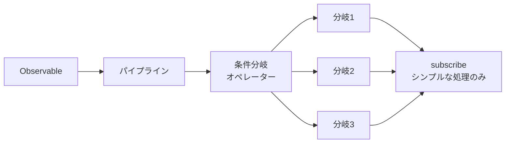
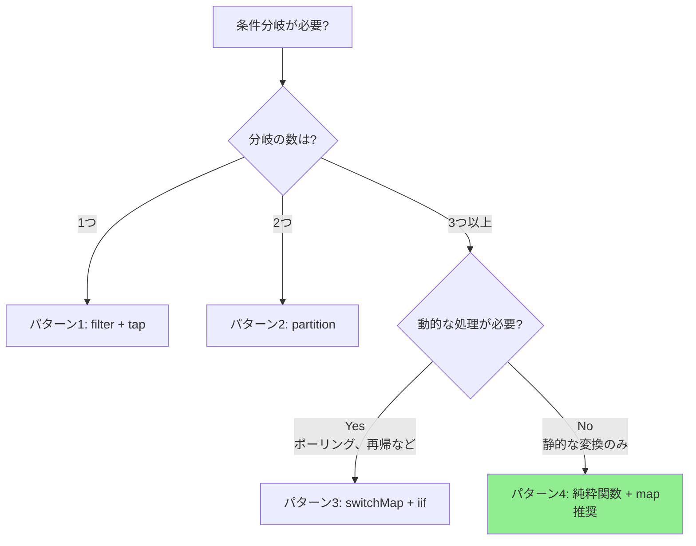

# subscribe内の条件分岐パターン

RxJSを使い始めた開発者がよく陥る問題の1つが、`subscribe()`のコールバック内で複雑な条件分岐を行ってしまうことです。この記事では、なぜこれが問題なのか、そしてどのように改善すべきかを、実践的なパターンとともに解説します。

> [!NOTE] この記事で使用する公開API
> この記事では、[JSONPlaceholder](https://jsonplaceholder.typicode.com/) という無料のREST APIを使用します。実際に動作するコードなので、コピー&ペーストしてブラウザで試すことができます。
>
> カスタムAPIレスポンス型（`status`, `errorCode`等を含む）への変換パターンも示しており、実際のプロジェクトで外部APIのレスポンスを内部型に変換する際の参考にもなります。

## 問題: subscribe内での複雑な条件分岐

subscribe内で条件分岐を行うと、コードの可読性が低下し、テストも困難になります。以下の例を見てみましょう。

### 準備: JSONPlaceholder APIをラップするヘルパー関数

まず、JSONPlaceholder APIのレスポンスをカスタム型に変換するヘルパー関数を定義します。このパターンは、実際のプロジェクトで外部APIを内部型に変換する際にも使えます。

```typescript
import { Observable, from, of, map, catchError } from 'rxjs';

/**
 * JSONPlaceholder API のレスポンス型
 */
interface Post {
  userId: number;
  id: number;
  title: string;
  body: string;
}

/**
 * カスタムAPIレスポンス型
 */
interface ApiResponse<T = any> {
  status: 'success' | 'error' | 'pending';
  data?: T;
  errorCode?: string;
  message?: string;
}

/**
 * JSONPlaceholder APIをラップして、カスタムAPIレスポンス型に変換
 *
 * 実際のプロジェクトでも、外部APIのレスポンスを内部型に変換するパターンはよく使われます。
 * これにより、APIの変更による影響を局所化でき、アプリケーション内で一貫した型を使用できます。
 */
function fetchPost(postId: number = 1): Observable<ApiResponse<Post>> {
  return from(
    fetch(`https://jsonplaceholder.typicode.com/posts/${postId}`)
      .then(response => {
        if (!response.ok) {
          throw new Error(`HTTP error! status: ${response.status}`);
        }
        return response.json();
      })
  ).pipe(
    map((data: Post) => ({
      status: 'success' as const,
      data
    })),
    catchError(err => {
      // エラーをカスタムレスポンス型に変換
      let errorCode = 'UNKNOWN_ERROR';

      if (err.message.includes('404')) {
        errorCode = 'NOT_FOUND';
      } else if (err.message.includes('500')) {
        errorCode = 'SERVER_ERROR';
      } else if (err.message.includes('Failed to fetch')) {
        errorCode = 'NETWORK_ERROR';
      }

      return of({
        status: 'error' as const,
        errorCode,
        message: err.message
      });
    })
  );
}
```

### アンチパターンの例

以下の例では、上記のヘルパー関数（`fetchPost`）を使用していますが、`subscribe()`内で複雑な条件分岐を行ってしまっています。

```typescript
/**
 * ❌ 問題のあるコード例
 * subscribe内で複雑な条件分岐を行っている
 */
class BadExampleManager {
  loading = false;
  data: Post | null = null;
  errorMessage = '';
  successMessage = '';

  // UI更新用のコールバック（オプション）
  onStateChange?: (state: { loading: boolean; data: Post | null; errorMessage: string; successMessage: string }) => void;

  init(): void {
    this.fetchData();
  }

  fetchData(): void {
    this.loading = true;
    this.updateUI();

    // JSONPlaceholder APIからポストデータを取得
    fetchPost(1).subscribe({
      next: response => {
        this.loading = false;

        // ❌ 問題: subscribe内で複雑な条件分岐
        if (response.status === 'success') {
          if (response.data) {
            // データの検証
            if (response.data.title && response.data.body) {
              this.data = response.data;
              this.successMessage = `ポスト「${response.data.title}」を読み込みました`;
            } else {
              this.errorMessage = 'データの形式が不正です';
            }
          } else {
            this.errorMessage = 'データがありません';
          }
        } else if (response.status === 'error') {
          if (response.errorCode === 'NOT_FOUND') {
            this.errorMessage = 'データが見つかりません（存在しないポストIDです）';
          } else if (response.errorCode === 'NETWORK_ERROR') {
            this.errorMessage = 'ネットワークエラー。接続を確認してください。';
            // 再試行
            setTimeout(() => this.fetchData(), 5000);
          } else if (response.errorCode === 'SERVER_ERROR') {
            this.errorMessage = 'サーバーエラーが発生しました';
          } else {
            this.errorMessage = 'エラーが発生しました';
          }
        } else if (response.status === 'pending') {
          this.errorMessage = '処理中です。しばらく待ってください。';
          // ポーリング
          setTimeout(() => this.fetchData(), 3000);
        }
        this.updateUI();
      }
    });
  }

  private updateUI(): void {
    if (this.onStateChange) {
      this.onStateChange({
        loading: this.loading,
        data: this.data,
        errorMessage: this.errorMessage,
        successMessage: this.successMessage
      });
    }
  }
}

// 使用例（ブラウザのコンソールで実行できます）
const badExample = new BadExampleManager();
badExample.onStateChange = (state) => {
  if (state.loading) console.log('読み込み中...');
  if (state.errorMessage) console.error(state.errorMessage);
  if (state.successMessage) console.log(state.successMessage);
  if (state.data) console.log('データ:', state.data);
};
badExample.init();

// 出力例:
// 読み込み中...
// ポスト「sunt aut facere repellat provident occaecati excepturi optio reprehenderit」を読み込みました
// データ: {userId: 1, id: 1, title: "...", body: "..."}
```

### この実装の問題点

> [!WARNING] subscribe内の条件分岐による問題
> 1. **可読性の低下** - ネストが深く、処理の流れが追いにくい
> 2. **テストの困難さ** - subscribe内のロジックは単体テストが書きにくい
> 3. **再利用性の欠如** - 同じロジックを他の場所で使えない
> 4. **宣言的でない** - RxJSの宣言的なスタイルから逸脱
> 5. **副作用の管理** - 複数の状態変更が散在し、追跡が困難

## 解決策の概要

subscribe内の条件分岐を、RxJSのオペレーターを使ってパイプライン内で処理します。これにより、コードは宣言的になり、テストも容易になります。



この記事では、以下の4つのパターンを解説します:

1. **パターン1**: filter + tap による分岐
2. **パターン2**: partition による分岐
3. **パターン3**: switchMap + iif による動的分岐
4. **パターン4**: 関数化 + map による変換（推奨）

## パターン1: filter + tap による分岐

最もシンプルな方法は、`filter`で条件に合う値だけを通し、`tap`で副作用を実行することです。

### 実装例

この例では、上で定義した `fetchPost()` 関数を使用して、JSONPlaceholder APIからデータを取得します。

```typescript
class Pattern1Manager {
  private destroy$ = new Subject<void>();

  loading = false;
  data: Post | null = null;
  errorMessage = '';

  // UI更新用のコールバック（オプション）
  onStateChange?: (state: { loading: boolean; data: Post | null; errorMessage: string }) => void;

  init(): void {
    this.fetchData();
  }

  fetchData(): void {
    this.loading = true;
    this.updateUI();

    fetchPost(1).pipe(
      // ✅ 成功レスポンスのみを通す
      filter(response => response.status === 'success'),

      // ✅ データの検証
      filter(response => response.data !== undefined),

      // ✅ ログ出力（副作用）
      tap(response => console.log('データ取得成功:', response.data)),

      // エラーハンドリング
      catchError(err => {
        console.error('エラー:', err);
        this.errorMessage = 'データの取得に失敗しました';
        this.loading = false;
        this.updateUI();
        return of(null);
      }),

      takeUntil(this.destroy$)
    ).subscribe({
      next: response => {
        this.loading = false;

        // ✅ シンプルな代入のみ
        if (response) {
          this.data = response.data;
        }
        this.updateUI();
      }
    });
  }

  private updateUI(): void {
    if (this.onStateChange) {
      this.onStateChange({
        loading: this.loading,
        data: this.data,
        errorMessage: this.errorMessage
      });
    }
  }

  destroy(): void {
    this.destroy$.next();
    this.destroy$.complete();
  }
}

// 使用例（ブラウザのコンソールで実行できます）
const pattern1 = new Pattern1Manager();
pattern1.onStateChange = (state) => {
  if (state.loading) console.log('読み込み中...');
  if (state.errorMessage) console.error(state.errorMessage);
  if (state.data) console.log('ポストデータ:', state.data);
};
pattern1.init();

// 出力例:
// 読み込み中...
// データ取得成功: {userId: 1, id: 1, title: "...", body: "..."}
// ポストデータ: {userId: 1, id: 1, title: "...", body: "..."}
```

### 利点と欠点

> [!TIP] パターン1の特徴
> **利点:**
> - シンプルで理解しやすい
> - 段階的にフィルタリングできる
> - 各ステップが明確
>
> **欠点:**
> - 複数の分岐には向かない（分岐ごとにストリームを作る必要がある）
> - フィルタリングされた値は後続で使えない

## パターン2: partition による分岐

`partition`を使うと、1つのObservableを条件に基づいて2つのストリームに分割できます。

### 実装例

この例でも、`fetchPost()` 関数を使用してJSONPlaceholder APIからデータを取得します。

```typescript
/**
 * 処理結果の型定義
 */
interface ProcessedResult {
  type: 'success' | 'error';
  data?: Post;
  message: string;
}

class Pattern2Manager {
  private destroy$ = new Subject<void>();

  loading = false;
  result: ProcessedResult | null = null;

  // UI更新用のコールバック（オプション）
  onStateChange?: (state: { loading: boolean; result: ProcessedResult | null }) => void;

  init(): void {
    this.fetchData();
  }

  fetchData(): void {
    this.loading = true;
    this.updateUI();

    const response$ = fetchPost(1).pipe(
      catchError(err => {
        console.error('HTTP Error:', err);
        return EMPTY;
      })
    );

    // ✅ 成功とエラーで分割
    const [success$, error$] = partition(
      response$,
      response => response.status === 'success'
    );

    // 成功ストリームの処理
    const successStream$ = success$.pipe(
      map(response => ({
        type: 'success' as const,
        data: response.data,
        message: 'データを取得しました'
      })),
      tap(() => console.log('Success処理完了'))
    );

    // エラーストリームの処理
    const errorStream$ = error$.pipe(
      map(response => ({
        type: 'error' as const,
        message: this.getErrorMessage(response.errorCode)
      })),
      tap(result => console.log('Error処理完了:', result.message))
    );

    // ✅ 2つのストリームをマージして購読
    merge(successStream$, errorStream$).pipe(
      takeUntil(this.destroy$)
    ).subscribe({
      next: result => {
        this.loading = false;
        this.result = result;

        // 特定のエラーコードに応じた追加処理
        if (result.type === 'error') {
          this.handleError(result);
        }
        this.updateUI();
      }
    });
  }

  private getErrorMessage(errorCode?: string): string {
    const messages: Record<string, string> = {
      'NOT_FOUND': 'データが見つかりません（存在しないポストIDです）',
      'NETWORK_ERROR': 'ネットワークエラー。接続を確認してください。',
      'SERVER_ERROR': 'サーバーエラーが発生しました'
    };

    return messages[errorCode || ''] || 'エラーが発生しました';
  }

  private handleError(result: ProcessedResult): void {
    // エラー種別に応じた追加処理（ログイン画面へのリダイレクトなど）
  }

  private updateUI(): void {
    if (this.onStateChange) {
      this.onStateChange({
        loading: this.loading,
        result: this.result
      });
    }
  }

  destroy(): void {
    this.destroy$.next();
    this.destroy$.complete();
  }
}

// 使用例（ブラウザのコンソールで実行できます）
const pattern2 = new Pattern2Manager();
pattern2.onStateChange = (state) => {
  if (state.loading) console.log('読み込み中...');
  if (state.result) {
    console.log(`[${state.result.type}] ${state.result.message}`);
    if (state.result.data) console.log('ポストデータ:', state.result.data);
  }
};
pattern2.init();

// 出力例:
// 読み込み中...
// Success処理完了
// [success] データを取得しました
// ポストデータ: {userId: 1, id: 1, title: "...", body: "..."}
```

### 利点と欠点

> [!TIP] パターン2の特徴
> **利点:**
> - 2つの分岐を明確に分離できる
> - それぞれのストリームで独立した処理が可能
> - テストしやすい
>
> **欠点:**
> - 2分岐に限定される（3つ以上の分岐には向かない）
> - 両方のストリームを購読する必要がある

## パターン3: switchMap + iif による動的分岐

`iif`を使うと、条件に応じて異なるObservableに切り替えることができます。

### 実装例

この例では、存在しないポストID（999）を試して、エラー時の処理を示します。

```typescript
class Pattern3Manager {
  private destroy$ = new Subject<void>();

  loading = false;
  data: Post | null = null;
  statusMessage = '';

  // UI更新用のコールバック（オプション）
  onStateChange?: (state: { loading: boolean; data: Post | null; statusMessage: string }) => void;

  init(): void {
    // 存在しないポストID（999）を試す
    this.fetchData(999);
  }

  fetchData(postId: number = 1): void {
    this.loading = true;
    this.updateUI();

    fetchPost(postId).pipe(
      // ✅ レスポンスのstatusに応じて処理を分岐
      switchMap(response =>
        iif(
          // 条件1: 成功
          () => response.status === 'success',
          // 成功時の処理
          of(response).pipe(
            map(r => ({ type: 'success' as const, data: r.data })),
            tap(() => console.log('データ取得成功'))
          ),
          // 条件2: エラー
          // エラーの場合はthrowErrorでエラーストリームに変換
          throwError(() => ({
            message: this.getErrorMessage(response.errorCode),
            errorCode: response.errorCode
          }))
        )
      ),
      retry({
        count: 2,
        delay: 1000 // 1秒待ってリトライ
      })
      catchError(err => {
        console.error('Error:', err);
        this.statusMessage = err.message || 'エラーが発生しました';
        this.loading = false;
        this.updateUI();
        return EMPTY;
      }),
      takeUntil(this.destroy$)
    ).subscribe({
      next: result => {
        this.loading = false;

        if (result.type === 'success') {
          this.data = result.data;
          this.statusMessage = '';
        }
        this.updateUI();
      }
    });
  }

  private getErrorMessage(errorCode?: string): string {
    const messages: Record<string, string> = {
      'NOT_FOUND': 'データが見つかりません（存在しないポストIDです）',
      'NETWORK_ERROR': 'ネットワークエラー。接続を確認してください。',
      'SERVER_ERROR': 'サーバーエラーが発生しました'
    };
    return messages[errorCode || ''] || 'エラーが発生しました';
  }

  private updateUI(): void {
    if (this.onStateChange) {
      this.onStateChange({
        loading: this.loading,
        data: this.data,
        statusMessage: this.statusMessage
      });
    }
  }

  destroy(): void {
    this.destroy$.next();
    this.destroy$.complete();
  }
}

// 使用例（ブラウザのコンソールで実行できます）
const pattern3 = new Pattern3Manager();
pattern3.onStateChange = (state) => {
  if (state.loading) console.log('読み込み中...');
  if (state.statusMessage) console.log(state.statusMessage);
  if (state.data) console.log('ポストデータ:', state.data);
};
pattern3.init();

// 出力例（存在しないポストID 999を試した場合）:
// 読み込み中...
// Error: {...}
// データが見つかりません（存在しないポストIDです）
//
// 正常なポストID（1）を指定した場合:
// pattern3.fetchData(1);
// 読み込み中...
// データ取得成功
// ポストデータ: {userId: 1, id: 1, title: "...", body: "..."}
```

### 利点と欠点

> [!TIP] パターン3の特徴
> **利点:**
> - 条件に応じて異なるObservableに切り替えられる
> - リトライ処理と組み合わせやすい
> - 動的な処理（ポーリング、再帰的呼び出しなど）に適している
>
> **欠点:**
> - ネストが深くなると可読性が低下する可能性がある
> - デバッグが難しい
> - 初心者には理解しづらい
>
> **注:** この例では単純な成功/エラー分岐を示していますが、実際にはpending状態を含む非同期処理のポーリングなど、より複雑な動的処理にも対応できます。

## パターン4: 関数化 + map による変換（推奨）

最も推奨されるパターンは、条件分岐ロジックを純粋関数として切り出し、`map`オペレーターで変換することです。

### 実装例

この例では、`fetchPost()` から返されるAPIレスポンスをUI表示用のViewModelに変換する純粋関数を定義します。

```typescript
/**
 * UI表示用のビューモデル
 */
interface ViewModel {
  loading: boolean;
  displayData: Post | null;
  messageType: 'success' | 'error' | 'info' | null;
  message: string;
  showRetryButton: boolean;
}

/**
 * ✅ 純粋関数: APIレスポンスをViewModelに変換
 * テストしやすく、再利用可能
 */
function mapResponseToViewModel(response: ApiResponse<Post>): ViewModel {
  // 成功レスポンスの処理
  if (response.status === 'success') {
    return {
      loading: false,
      displayData: response.data || null,
      messageType: 'success',
      message: `ポスト「${response.data?.title}」を読み込みました`,
      showRetryButton: false
    };
  }

  // エラーレスポンスの処理
  if (response.status === 'error') {
    const errorMessages: Record<string, string> = {
      'NOT_FOUND': 'データが見つかりません（存在しないポストIDです）',
      'NETWORK_ERROR': 'ネットワークエラー。接続を確認してください。',
      'SERVER_ERROR': 'サーバーエラーが発生しました。しばらく待ってから再試行してください。'
    };

    const message = errorMessages[response.errorCode || ''] ||
                    response.message ||
                    'エラーが発生しました';

    return {
      loading: false,
      displayData: null,
      messageType: 'error',
      message,
      showRetryButton: isRetryableError(response.errorCode)
    };
  }

  // Pendingレスポンスの処理（JSONPlaceholder APIでは発生しないが、将来の拡張用）
  if (response.status === 'pending') {
    return {
      loading: true,
      displayData: null,
      messageType: 'info',
      message: '処理中です。しばらくお待ちください。',
      showRetryButton: false
    };
  }

  // フォールバック
  return {
    loading: false,
    displayData: null,
    messageType: 'error',
    message: '不明なレスポンスです',
    showRetryButton: false
  };
}

/**
 * ✅ 純粋関数: エラーがリトライ可能かを判定
 */
function isRetryableError(errorCode?: string): boolean {
  const retryableErrors = ['NETWORK_ERROR', 'SERVER_ERROR'];
  return retryableErrors.includes(errorCode || '');
}

/**
 * ✅ 純粋関数: 特定のエラーに応じた副作用を返す
 */
function getErrorSideEffect(errorCode?: string): (() => void) | null {
  const sideEffects: Record<string, () => void> = {
    'NETWORK_ERROR': () => {
      console.log('ネットワークエラー: 接続を確認してください');
    },
    'SERVER_ERROR': () => {
      console.log('サーバーエラー: しばらく待ってから再試行します');
    }
  };

  return sideEffects[errorCode || ''] || null;
}

class Pattern4Manager {
  private destroy$ = new Subject<void>();

  viewModel: ViewModel = {
    loading: false,
    displayData: null,
    messageType: null,
    message: '',
    showRetryButton: false
  };

  // UI更新用のコールバック（オプション）
  onStateChange?: (viewModel: ViewModel) => void;

  init(): void {
    this.fetchData();
  }

  fetchData(postId: number = 1): void {
    // 初期ローディング状態を設定
    this.viewModel = {
      loading: true,
      displayData: null,
      messageType: null,
      message: '',
      showRetryButton: false
    };
    this.updateUI();

    fetchPost(postId).pipe(
      // ✅ パイプライン内で純粋関数を使って変換
      map(response => mapResponseToViewModel(response)),

      // ✅ 副作用は tap で実行（純粋関数から分離）
      tap(viewModel => {
        console.log('ViewModel:', viewModel);
      }),

      // エラーハンドリング
      catchError(err => {
        console.error('HTTP Error:', err);

        const errorViewModel: ViewModel = {
          loading: false,
          displayData: null,
          messageType: 'error',
          message: 'ネットワークエラーが発生しました',
          showRetryButton: true
        };

        return of(errorViewModel);
      }),

      takeUntil(this.destroy$)
    ).subscribe({
      next: viewModel => {
        // ✅ subscribe内はシンプルな代入のみ
        this.viewModel = viewModel;

        // 特定のエラーに応じた副作用を実行
        if (viewModel.messageType === 'error') {
          const sideEffect = getErrorSideEffect(
            // ここでは元のerrorCodeを保持していないため、
            // ViewModelに追加する必要がある
          );
          sideEffect?.();
        }
        this.updateUI();
      }
    });
  }

  private updateUI(): void {
    if (this.onStateChange) {
      this.onStateChange(this.viewModel);
    }
  }

  destroy(): void {
    this.destroy$.next();
    this.destroy$.complete();
  }
}

// 使用例（ブラウザのコンソールで実行できます）
const pattern4 = new Pattern4Manager();
pattern4.onStateChange = (viewModel) => {
  if (viewModel.loading) console.log('読み込み中...');
  if (viewModel.message) console.log(`[${viewModel.messageType}] ${viewModel.message}`);
  if (viewModel.displayData) console.log('ポストデータ:', viewModel.displayData);
  if (viewModel.showRetryButton) console.log('再試行ボタンを表示');
};
pattern4.init();

// 出力例:
// 読み込み中...
// ViewModel: {loading: false, displayData: {...}, messageType: "success", message: "ポスト「...」を読み込みました", showRetryButton: false}
// [success] ポスト「sunt aut facere repellat provident occaecati excepturi optio reprehenderit」を読み込みました
// ポストデータ: {userId: 1, id: 1, title: "...", body: "..."}
```

### さらに改良: errorCodeを保持

上記の例では`errorCode`がViewModelに含まれていないため、副作用の判定ができません。改良版を示します。

```typescript
/**
 * 改良版ViewModel（errorCodeを保持）
 */
interface ImprovedViewModel {
  loading: boolean;
  displayData: Post | null;
  messageType: 'success' | 'error' | 'info' | null;
  message: string;
  showRetryButton: boolean;
  errorCode?: string; // ✅ エラーコードを保持
}

/**
 * 改良版マッピング関数
 */
function mapResponseToImprovedViewModel(response: ApiResponse<Post>): ImprovedViewModel {
  if (response.status === 'success') {
    return {
      loading: false,
      displayData: response.data || null,
      messageType: 'success',
      message: `ポスト「${response.data?.title}」を読み込みました`,
      showRetryButton: false
    };
  }

  if (response.status === 'error') {
    const errorMessages: Record<string, string> = {
      'NOT_FOUND': 'データが見つかりません（存在しないポストIDです）',
      'NETWORK_ERROR': 'ネットワークエラー。接続を確認してください。',
      'SERVER_ERROR': 'サーバーエラーが発生しました'
    };

    return {
      loading: false,
      displayData: null,
      messageType: 'error',
      message: errorMessages[response.errorCode || ''] || 'エラーが発生しました',
      showRetryButton: isRetryableError(response.errorCode),
      errorCode: response.errorCode // ✅ エラーコードを保持
    };
  }

  if (response.status === 'pending') {
    return {
      loading: true,
      displayData: null,
      messageType: 'info',
      message: '処理中です',
      showRetryButton: false
    };
  }

  return {
    loading: false,
    displayData: null,
    messageType: 'error',
    message: '不明なレスポンスです',
    showRetryButton: false
  };
}

class ImprovedPattern4Manager {
  private destroy$ = new Subject<void>();
  viewModel: ImprovedViewModel = {
    loading: false,
    displayData: null,
    messageType: null,
    message: '',
    showRetryButton: false
  };

  // UI更新用のコールバック（オプション）
  onStateChange?: (viewModel: ImprovedViewModel) => void;

  init(): void {
    this.fetchData();
  }

  fetchData(postId: number = 1): void {
    fetchPost(postId).pipe(
      map(response => mapResponseToImprovedViewModel(response)),
      tap(viewModel => console.log('ViewModel:', viewModel)),
      catchError(err => {
        console.error('HTTP Error:', err);
        return of({
          loading: false,
          displayData: null,
          messageType: 'error' as const,
          message: 'ネットワークエラー',
          showRetryButton: true
        });
      }),
      takeUntil(this.destroy$)
    ).subscribe({
      next: viewModel => {
        this.viewModel = viewModel;

        // ✅ エラーコードに応じた副作用を実行
        if (viewModel.errorCode) {
          const sideEffect = getErrorSideEffect(viewModel.errorCode);
          sideEffect?.();
        }
        this.updateUI();
      }
    });
  }

  private updateUI(): void {
    if (this.onStateChange) {
      this.onStateChange(this.viewModel);
    }
  }

  destroy(): void {
    this.destroy$.next();
    this.destroy$.complete();
  }
}

// 使用例（ブラウザのコンソールで実行できます）
const improvedPattern4 = new ImprovedPattern4Manager();
improvedPattern4.onStateChange = (viewModel) => {
  if (viewModel.loading) console.log('読み込み中...');
  if (viewModel.message) console.log(`[${viewModel.messageType}] ${viewModel.message}`);
  if (viewModel.displayData) console.log('ポストデータ:', viewModel.displayData);
};
improvedPattern4.init();

// 出力例:
// ViewModel: {loading: false, displayData: {...}, messageType: "success", message: "...", showRetryButton: false}
// [success] ポスト「sunt aut facere repellat provident occaecati excepturi optio reprehenderit」を読み込みました
// ポストデータ: {userId: 1, id: 1, title: "...", body: "..."}
```

### 利点と欠点

> [!TIP] パターン4の特徴（推奨）
> **利点:**
> - **テストが容易**: 純粋関数なので単体テストが簡単
> - **再利用可能**: 他のコンポーネントでも同じロジックを使える
> - **可読性が高い**: 変換ロジックが明確に分離されている
> - **型安全**: TypeScriptの型推論が効く
> - **保守性が高い**: ロジック変更時の影響範囲が明確
>
> **欠点:**
> - コード量が増える（しかし明確さとトレードオフ）

## 実践例: APIレスポンス処理の完全な実装

これまでのパターンを組み合わせた、実践的な実装例を示します。JSONPlaceholder APIを使用した実装です。

```typescript
/**
 * ビューモデル型定義
 */
interface DataViewModel<T = any> {
  loading: boolean;
  data: T | null;
  error: {
    message: string;
    code?: string;
    retryable: boolean;
  } | null;
  info: string | null;
}

/**
 * データ取得サービス
 */
class DataService {

  /**
   * データ取得（自動リトライ対応）
   */
  fetchData<T>(postId: number = 1): Observable<DataViewModel<T>> {
    return fetchPost(postId).pipe(

      // レスポンスをViewModelに変換
      map(response => this.mapToViewModel<T>(response)),

      // HTTPエラーのハンドリング
      catchError((err: Error) =>
        of(this.createErrorViewModel<T>(err))
      ),

      // リトライ可能なエラーは自動リトライ
      retry({
        count: 2,
        delay: 1000 // 1秒待ってリトライ
      })
    );
  }

  /**
   * APIレスポンスをViewModelに変換（純粋関数）
   */
  private mapToViewModel<T>(response: ApiResponse<T>): DataViewModel<T> {
    if (response.status === 'success') {
      return {
        loading: false,
        data: response.data || null,
        error: null,
        info: null
      };
    }

    if (response.status === 'error') {
      return {
        loading: false,
        data: null,
        error: {
          message: this.getErrorMessage(response.errorCode, response.message),
          code: response.errorCode,
          retryable: this.isRetryableError(response.errorCode)
        },
        info: null
      };
    }

    // Pending（JSONPlaceholder APIでは発生しないが、将来の拡張用）
    return {
      loading: true,
      data: null,
      error: null,
      info: '処理中...'
    };
  }

  /**
   * HTTPエラーからViewModelを作成
   */
  private createErrorViewModel<T>(err: Error): DataViewModel<T> {
    return {
      loading: false,
      data: null,
      error: {
        message: err.message || 'エラーが発生しました',
        code: 'FETCH_ERROR',
        retryable: true
      },
      info: null
    };
  }

  /**
   * エラーメッセージの取得
   */
  private getErrorMessage(errorCode?: string, fallbackMessage?: string): string {
    const messages: Record<string, string> = {
      'NOT_FOUND': 'データが見つかりません（存在しないポストIDです）',
      'NETWORK_ERROR': 'ネットワークエラー。接続を確認してください。',
      'SERVER_ERROR': 'サーバーエラーが発生しました'
    };

    return messages[errorCode || ''] || fallbackMessage || 'エラーが発生しました';
  }

  /**
   * リトライ可能なエラーかを判定
   */
  private isRetryableError(errorCode?: string): boolean {
    const retryable = ['NETWORK_ERROR', 'SERVER_ERROR'];
    return retryable.includes(errorCode || '');
  }
}

/**
 * データ表示マネージャー
 */
class DataDisplayManager {
  private destroy$ = new Subject<void>();
  private dataService = new DataService();

  viewModel: DataViewModel = {
    loading: false,
    data: null,
    error: null,
    info: null
  };

  // UI更新用のコールバック（オプション）
  onStateChange?: (viewModel: DataViewModel) => void;

  init(): void {
    this.loadData();
  }

  loadData(postId: number = 1): void {
    this.viewModel = {
      loading: true,
      data: null,
      error: null,
      info: null
    };
    this.updateUI();

    this.dataService.fetchData(postId).pipe(
      takeUntil(this.destroy$)
    ).subscribe({
      next: viewModel => {
        // ✅ subscribe内は単純な代入のみ
        this.viewModel = viewModel;
        this.updateUI();
      }
    });
  }

  private updateUI(): void {
    if (this.onStateChange) {
      this.onStateChange(this.viewModel);
    }
  }

  destroy(): void {
    this.destroy$.next();
    this.destroy$.complete();
  }
}

// 使用例（ブラウザのコンソールで実行できます）
const dataDisplay = new DataDisplayManager();
dataDisplay.onStateChange = (viewModel) => {
  if (viewModel.loading) console.log('読み込み中...');
  if (viewModel.error) {
    console.error(viewModel.error.message);
    if (viewModel.error.retryable) console.log('再試行可能');
  }
  if (viewModel.info) console.log(viewModel.info);
  if (viewModel.data) console.log('ポストデータ:', viewModel.data);
};
dataDisplay.init();

// 出力例:
// 読み込み中...
// ポストデータ: {userId: 1, id: 1, title: "...", body: "..."}
//
// エラー時の例（存在しないポストID 999を指定）:
// dataDisplay.loadData(999);
// 読み込み中...
// データが見つかりません（存在しないポストIDです）
// 再試行可能
```

> [!IMPORTANT] 実践パターンのポイント
> 1. **サービス層で変換**: APIレスポンスからViewModelへの変換をサービス層で行う
> 2. **純粋関数の活用**: 条件分岐ロジックを純粋関数として切り出す
> 3. **subscribe内はシンプルに**: 購読時は代入のみを行う
> 4. **エラーハンドリングの一元化**: エラー処理をパイプライン内で完結させる
> 5. **型安全性の確保**: ViewModelの型定義で安全性を担保

## 選択のガイドライン

どのパターンを選ぶべきか、シナリオ別のガイドラインを示します。



### パターン選択基準

| シナリオ | 推奨パターン | 理由 |
|---------|------------|------|
| 単純なフィルタリング | パターン1 (filter + tap) | シンプルで理解しやすい |
| 成功/失敗の2分岐 | パターン2 (partition) | 明確な分離が可能 |
| ポーリング・再試行 | パターン3 (switchMap + iif) | 動的な処理に対応 |
| 複雑な条件分岐 | パターン4 (純粋関数 + map) | テスト可能、再利用可能 |
| 状態管理が必要 | パターン4 (純粋関数 + map) | ViewModel パターンに適している |

> [!TIP] 迷ったら **パターン4（純粋関数 + map）** を選ぶ
> - 最も保守性が高い
> - テストが容易
> - チーム開発に適している
> - TypeScriptの型システムと相性が良い

## まとめ

subscribe内で複雑な条件分岐を行うことは、RxJSのアンチパターンの1つです。この記事で紹介した4つのパターンを使うことで、宣言的で保守性の高いコードを書くことができます。

### 重要な原則

> [!IMPORTANT] subscribe内の条件分岐を避けるための原則
> 1. **ロジックはパイプライン内で処理** - subscribe前に変換を完了させる
> 2. **純粋関数を活用** - 条件分岐ロジックを関数として切り出す
> 3. **ViewModelパターンの採用** - UI表示用のモデルに変換する
> 4. **副作用は tap で分離** - 純粋な変換と副作用を明確に分ける
> 5. **型安全性を確保** - TypeScriptの型システムを最大限活用

### Before / After 比較

**Before (アンチパターン):**
```typescript
observable$.subscribe(value => {
  if (value.status === 'success') {
    if (value.data) {
      this.data = value.data;
    }
  } else if (value.status === 'error') {
    if (value.errorCode === 'AUTH_ERROR') {
      // ...
    } else if (value.errorCode === 'NOT_FOUND') {
      // ...
    }
  }
});
```

**After (推奨パターン):**
```typescript
observable$.pipe(
  map(response => mapToViewModel(response)),
  tap(viewModel => console.log('Processed:', viewModel))
).subscribe(viewModel => {
  this.viewModel = viewModel;
});
```

### 関連セクション

- **[RxJSアンチパターン集](/guide/anti-patterns/)** - よくある間違いと解決策
- **[エラーハンドリング](/guide/error-handling/strategies.md)** - エラー処理の基礎
- **[API呼び出しパターン](/guide/practical-patterns/api-calls.md)** - API通信の実践パターン
- **[フォーム処理パターン](/guide/practical-patterns/form-handling.md)** - フォームでの条件分岐

## テストコード

パターン4（純粋関数 + map）のテスト例を示します。

```typescript
describe('mapResponseToViewModel', () => {
  it('should map success response correctly', () => {
    const response: ApiResponse = {
      status: 'success',
      data: { id: 1, name: 'Test' }
    };

    const result = mapResponseToViewModel(response);

    expect(result.loading).toBe(false);
    expect(result.displayData).toEqual({ id: 1, name: 'Test' });
    expect(result.messageType).toBe('success');
    expect(result.showRetryButton).toBe(false);
  });

  it('should map error response with retryable error', () => {
    const response: ApiResponse = {
      status: 'error',
      errorCode: 'RATE_LIMIT'
    };

    const result = mapResponseToViewModel(response);

    expect(result.loading).toBe(false);
    expect(result.displayData).toBeNull();
    expect(result.messageType).toBe('error');
    expect(result.showRetryButton).toBe(true); // RATE_LIMITはリトライ可能
  });

  it('should map error response with non-retryable error', () => {
    const response: ApiResponse = {
      status: 'error',
      errorCode: 'NOT_FOUND'
    };

    const result = mapResponseToViewModel(response);

    expect(result.showRetryButton).toBe(false); // NOT_FOUNDはリトライ不可
  });

  it('should map pending response', () => {
    const response: ApiResponse = {
      status: 'pending'
    };

    const result = mapResponseToViewModel(response);

    expect(result.loading).toBe(true);
    expect(result.messageType).toBe('info');
  });
});

describe('isRetryableError', () => {
  it('should identify retryable errors', () => {
    expect(isRetryableError('RATE_LIMIT')).toBe(true);
    expect(isRetryableError('TIMEOUT')).toBe(true);
    expect(isRetryableError('SERVER_ERROR')).toBe(true);
  });

  it('should identify non-retryable errors', () => {
    expect(isRetryableError('NOT_FOUND')).toBe(false);
    expect(isRetryableError('AUTH_ERROR')).toBe(false);
    expect(isRetryableError('VALIDATION_ERROR')).toBe(false);
  });
});
```

> [!TIP] 純粋関数のテストが容易な理由
> - 外部状態に依存しない
> - 同じ入力は常に同じ出力を返す
> - 副作用がない
> - モックやスパイが不要

## 参考リソース

subscribe内の条件分岐を避けるためのさらなる学習リソースです。

- [RxJS公式ドキュメント - Operators](https://rxjs.dev/guide/operators) - オペレーターの使い方
- [Learn RxJS - Transformation Operators](https://www.learnrxjs.io/learn-rxjs/operators/transformation) - 変換オペレーターの詳細
- [Learn RxJS - partition](https://www.learnrxjs.io/learn-rxjs/operators/transformation/partition) - partition の使用例
- [RxJS Best Practices](https://blog.angular-university.io/rxjs-best-practices/) - RxJSのベストプラクティス
