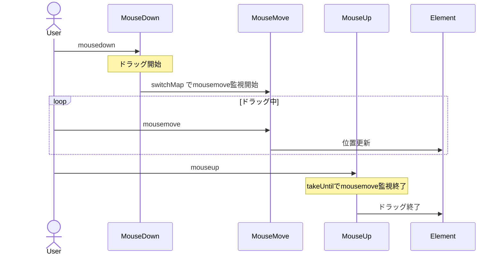
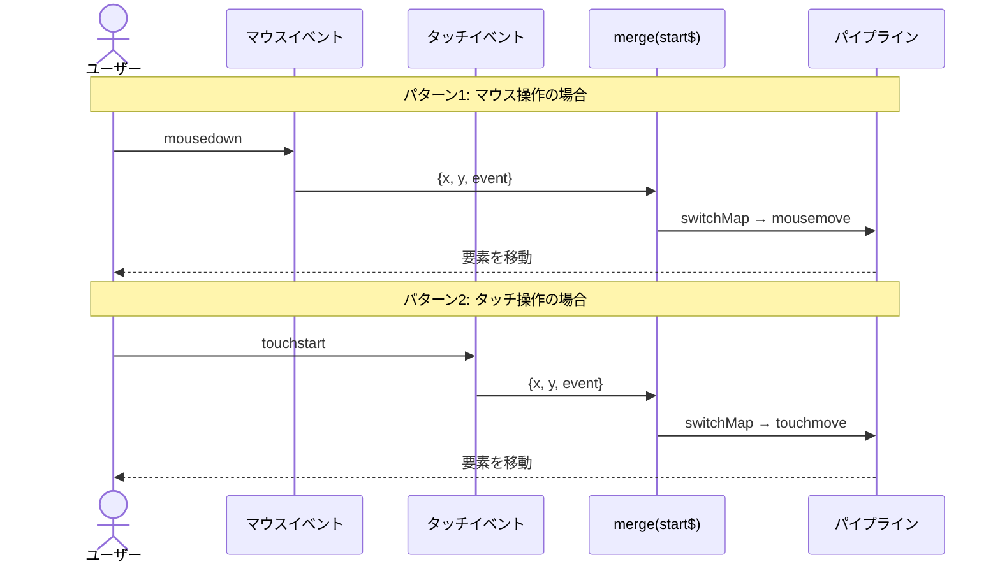

# UIイベント処理パターン

UIイベント処理は、フロントエンド開発において最も頻繁に遭遇する課題の一つです。RxJSを使うことで、複雑なイベント処理を宣言的かつ直感的に実装できます。

この記事では、クリック、スクロール、ドラッグ&ドロップ、キーボード入力など、実務で必要なUIイベント処理の具体的なパターンを解説します。

## この記事で学べること

- クリックイベントの制御（throttle、debounce、distinct）
- スクロールイベントの効率的な処理
- ドラッグ&ドロップの実装
- キーボード入力とオートコンプリート
- マルチタッチ対応
- 複合イベントの組み合わせ

> [!TIP] 前提知識
> この記事は、[Chapter 4: オペレーター](../operators/index.md) の知識を前提としています。特に `debounceTime`, `throttleTime`, `distinctUntilChanged` の理解が重要です。

## クリックイベント処理

### 問題：クリック連打による過剰な処理実行

ボタンを連続でクリックされると、処理が何度も実行されてパフォーマンス問題やバグの原因になります。

### 解決策1：throttleTimeで制御する

一定期間内の最初のクリックのみ処理します。

```typescript
import { fromEvent, throttleTime } from 'rxjs';
const button = document.createElement('button');
button.id = 'submit-button';
button.innerText = 'submit';
document.body.appendChild(button);

if (button) {
  fromEvent(button, 'click').pipe(
    throttleTime(1000) // 1秒間に1回のみ処理
  ).subscribe(() => {
    console.log('送信処理実行');
    submitForm();
  });
}

function submitForm(): void {
  console.log('フォーム送信中...');
  // API呼び出し等
}
```

#### 実行の流れ

```
ユーザーのクリック: ●    ●●●        ●  ●●
                    |    |          |  |
throttleTime(1000): ●              ●
                    |              |
                   処理実行      処理実行
```

> [!NOTE] throttleTimeの特性
> - **最初のイベント**を処理し、一定期間は後続イベントを無視
> - リアルタイム性が重要な場合に適している（スクロール、リサイズ等）

### 解決策2：debounceTimeで制御する

イベントが止まってから一定時間後に処理します。

```typescript
import { fromEvent, debounceTime } from 'rxjs';
// Traditional approach (commented for reference)
// const searchInput = document.querySelector<HTMLInputElement>('#search');

// Self-contained: creates input dynamically
const searchInput = document.createElement('input');
searchInput.id = 'search';
searchInput.type = 'text';
searchInput.placeholder = '検索キーワードを入力...';
searchInput.style.padding = '8px';
searchInput.style.margin = '10px';
searchInput.style.width = '300px';
document.body.appendChild(searchInput);

fromEvent(searchInput, 'input').pipe(
  debounceTime(300) // 入力停止後300ms待つ
).subscribe((event) => {
  const value = (event.target as HTMLInputElement).value;
  console.log('検索実行:', value);
  performSearch(value);
});

function performSearch(query: string): void {
  console.log('検索中...', query);
  // 検索API呼び出し
}
```

#### 実行の流れ

```
ユーザーの入力:  ●●●●●     ●●        ●●●●
                      |            |      |
debounceTime(300):   300ms       300ms  300ms待機
                      |            |      |
                     処理         処理   処理実行
```

> [!NOTE] debounceTimeの特性
> - **最後のイベント**から一定時間待ってから処理
> - 検索、オートコンプリート、リアルタイムバリデーションに適している

### throttleTime vs debounceTime の使い分け

| 用途 | 使うべきオペレーター | 理由 |
|-----|-------------------|------|
| **検索入力** | `debounceTime` | 入力が止まってから検索したい |
| **オートコンプリート** | `debounceTime` | 入力が止まってから候補を表示 |
| **スクロールイベント** | `throttleTime` | スクロール中も定期的に処理したい |
| **ウィンドウリサイズ** | `throttleTime` or `debounceTime` | 要件による |
| **ボタン連打防止** | `throttleTime` or `exhaustMap` | 最初のクリックを即座に処理 |

### 解決策3：distinctUntilChangedで重複排除

直前の値と比較して、同じ値が連続する場合は処理をスキップします。

```typescript
import { fromEvent, map, debounceTime, distinctUntilChanged } from 'rxjs';
const searchInput = document.createElement('input');
searchInput.id = 'search';
searchInput.type = 'text';
searchInput.placeholder = '検索キーワードを入力...';
searchInput.style.padding = '8px';
searchInput.style.margin = '10px';
searchInput.style.width = '300px';
document.body.appendChild(searchInput);

fromEvent(searchInput, 'input').pipe(
  map(event => (event.target as HTMLInputElement).value.trim()),
  debounceTime(300),
  distinctUntilChanged() // 前回と同じ値なら無視
).subscribe(query => {
  console.log('検索実行:', query);
  performSearch(query);
});
```

#### 実行例

```typescript
// ユーザー入力: "RxJS" → Backspace → "RxJS"
// distinctUntilChangedなし: 2回検索実行
// distinctUntilChangedあり: 1回のみ検索実行（同じ値なので2回目はスキップ）
```

> [!TIP] ベストプラクティス
> 検索やオートコンプリートの実装では、以下の3つをセットで使用することが推奨されます。
> 1. `debounceTime()` - 入力停止を待つ
> 2. `distinctUntilChanged()` - 重複排除
> 3. `switchMap()` - 古いリクエストをキャンセル

## スクロールイベント処理

### 問題：スクロールイベントの過剰発火

スクロールイベントは非常に頻繁に発火するため、そのまま処理するとパフォーマンス問題になります。

### 解決策：throttleTimeで間引く

```typescript
import { fromEvent, throttleTime, map } from 'rxjs';
const scrollContainer = document.createElement('div');
scrollContainer.id = 'scroll-container';
scrollContainer.style.width = '400px';
scrollContainer.style.height = '300px';
scrollContainer.style.overflow = 'auto';
scrollContainer.style.border = '1px solid #ccc';
scrollContainer.style.margin = '10px';
scrollContainer.style.padding = '10px';

// Add content to make it scrollable
scrollContainer.innerHTML = Array.from({ length: 100 }, (_, i) =>
  `<p>アイテム ${i + 1}</p>`
).join('');

document.body.appendChild(scrollContainer);

fromEvent(scrollContainer, 'scroll').pipe(
  throttleTime(100), // 100msに1回のみ処理
  map(() => ({
    scrollTop: scrollContainer.scrollTop,
    scrollHeight: scrollContainer.scrollHeight,
    clientHeight: scrollContainer.clientHeight
  }))
).subscribe(({ scrollTop, scrollHeight, clientHeight }) => {
  // スクロール位置の計算
  const scrollPercentage = (scrollTop / (scrollHeight - clientHeight)) * 100;
  console.log(`スクロール位置: ${scrollPercentage.toFixed(1)}%`);

  // 無限スクロール: 90%以上スクロールしたら次のページを読み込む
  if (scrollPercentage > 90) {
    console.log('次のページを読み込み中...');
    loadMoreItems();
  }
});

function loadMoreItems(): void {
  console.log('追加データ取得');
}
```

### 実践例：スクロール方向の検出

```typescript
import { fromEvent, BehaviorSubject, throttleTime, map, pairwise, distinctUntilChanged } from 'rxjs';
type ScrollDirection = 'up' | 'down' | 'none';

const scrollDirection$ = new BehaviorSubject<ScrollDirection>('none');

// Create header element dynamically
const header = document.createElement('div');
header.id = 'header';
header.innerText = 'ヘッダー（スクロールで表示/非表示）';
header.style.position = 'fixed';
header.style.top = '0';
header.style.left = '0';
header.style.width = '100%';
header.style.padding = '20px';
header.style.background = '#333';
header.style.color = '#fff';
header.style.transition = 'transform 0.3s';
document.body.appendChild(header);

// Add scroll content
const scrollContent = document.createElement('div');
scrollContent.style.marginTop = '80px';
scrollContent.innerHTML = Array.from({ length: 100 }, (_, i) =>
  `<p>コンテンツ ${i + 1}</p>`
).join('');
document.body.appendChild(scrollContent);

fromEvent(window, 'scroll').pipe(
  throttleTime(100),
  map(() => window.scrollY),
  pairwise(), // 前回と今回の値をペアで取得
  map(([prev, curr]) => {
    if (curr > prev) return 'down';
    if (curr < prev) return 'up';
    return 'none';
  }),
  distinctUntilChanged() // 方向が変わった時だけ通知
).subscribe(direction => {
  scrollDirection$.next(direction);
  console.log('スクロール方向:', direction);

  // ヘッダーの表示/非表示を切り替える
  if (direction === 'down') {
    header.style.transform = 'translateY(-100%)';
  } else if (direction === 'up') {
    header.style.transform = 'translateY(0)';
  }
});
```

> [!TIP] pairwiseの活用
> `pairwise()` は、前回と今回の値をペアで取得できる便利なオペレーターです。スクロール方向、値の増減判定、差分計算などに活用できます。

## ドラッグ&ドロップの実装

### 問題：マウスイベントの複雑な組み合わせ

ドラッグ&ドロップは、mousedown → mousemove → mouseup の複雑なイベントの組み合わせです。

### 解決策：複数のObservableを組み合わせる

```typescript
import { fromEvent, merge, map, switchMap, takeUntil, tap } from 'rxjs';
interface Position {
  x: number;
  y: number;
}

const draggableElement = document.createElement('div');
draggableElement.id = 'draggable';
draggableElement.innerText = 'ドラッグしてください';
draggableElement.style.position = 'absolute';
draggableElement.style.left = '100px';
draggableElement.style.top = '100px';
draggableElement.style.width = '150px';
draggableElement.style.height = '150px';
draggableElement.style.padding = '20px';
draggableElement.style.background = '#4CAF50';
draggableElement.style.color = '#fff';
draggableElement.style.cursor = 'move';
draggableElement.style.userSelect = 'none';
draggableElement.style.display = 'flex';
draggableElement.style.alignItems = 'center';
draggableElement.style.justifyContent = 'center';
document.body.appendChild(draggableElement);

const mouseDown$ = fromEvent<MouseEvent>(draggableElement, 'mousedown');
const mouseMove$ = fromEvent<MouseEvent>(document, 'mousemove');
const mouseUp$ = fromEvent<MouseEvent>(document, 'mouseup');

// ドラッグ開始時の要素の位置を取得
let initialX = 0;
let initialY = 0;

mouseDown$.pipe(
  tap((event: MouseEvent) => {
    event.preventDefault();
    // 現在の要素の位置を記録
    const rect = draggableElement.getBoundingClientRect();
    initialX = rect.left;
    initialY = rect.top;

    // ドラッグ開始時のマウス位置との差分
    initialX = rect.left - event.clientX;
    initialY = rect.top - event.clientY;

    draggableElement.style.opacity = '0.7';
  }),
  switchMap(() =>
    // mousedownが発生したら、mousemoveを監視開始
    mouseMove$.pipe(
      map((event: MouseEvent): Position => ({
        x: event.clientX + initialX,
        y: event.clientY + initialY
      })),
      // mouseupまたはmouseleaveで監視終了
      takeUntil(
        merge(
          mouseUp$,
          fromEvent(document, 'mouseleave')
        ).pipe(
          tap(() => {
            draggableElement.style.opacity = '1';
          })
        )
      )
    )
  )
).subscribe((position: Position) => {
  // 要素を移動
  draggableElement.style.left = `${position.x}px`;
  draggableElement.style.top = `${position.y}px`;
});
```

#### イベントフロー



> [!IMPORTANT] ドラッグ&ドロップの重要ポイント
> - `switchMap` で mousedown → mousemove の監視開始
> - `takeUntil` で mouseup時に監視終了
> - `preventDefault()` でデフォルトのドラッグ動作を無効化
> - `classList.add/remove` で視覚的フィードバック

### タッチデバイス対応

```typescript
import { fromEvent, merge, map, switchMap, takeUntil, tap } from 'rxjs';
const draggableElement = document.createElement('div');
draggableElement.id = 'draggable';
draggableElement.innerText = 'ドラッグしてください\n（マウス・タッチ対応）';
draggableElement.style.position = 'absolute';
draggableElement.style.left = '100px';
draggableElement.style.top = '100px';
draggableElement.style.width = '150px';
draggableElement.style.height = '150px';
draggableElement.style.padding = '20px';
draggableElement.style.background = '#2196F3';
draggableElement.style.color = '#fff';
draggableElement.style.cursor = 'move';
draggableElement.style.userSelect = 'none';
draggableElement.style.display = 'flex';
draggableElement.style.alignItems = 'center';
draggableElement.style.justifyContent = 'center';
draggableElement.style.textAlign = 'center';
draggableElement.style.whiteSpace = 'pre-line';
document.body.appendChild(draggableElement);

// マウスイベントとタッチイベントを統合
const start$ = merge(
  fromEvent<MouseEvent>(draggableElement, 'mousedown').pipe(
    map(e => ({ x: e.clientX, y: e.clientY, event: e }))
  ),
  fromEvent<TouchEvent>(draggableElement, 'touchstart').pipe(
    map(e => ({
      x: e.touches[0].clientX,
      y: e.touches[0].clientY,
      event: e
    }))
  )
);

const move$ = merge(
  fromEvent<MouseEvent>(document, 'mousemove').pipe(
    map(e => ({ x: e.clientX, y: e.clientY }))
  ),
  fromEvent<TouchEvent>(document, 'touchmove').pipe(
    map(e => ({
      x: e.touches[0].clientX,
      y: e.touches[0].clientY
    }))
  )
);

const end$ = merge(
  fromEvent(document, 'mouseup'),
  fromEvent(document, 'touchend')
);

let initialOffsetX = 0;
let initialOffsetY = 0;

start$.pipe(
  tap(({ x, y, event }) => {
    event.preventDefault();
    const rect = draggableElement.getBoundingClientRect();
    initialOffsetX = rect.left - x;
    initialOffsetY = rect.top - y;
    draggableElement.style.opacity = '0.7';
  }),
  switchMap(() =>
    move$.pipe(
      map(({ x, y }) => ({
        x: x + initialOffsetX,
        y: y + initialOffsetY
      })),
      takeUntil(
        end$.pipe(
          tap(() => {
            draggableElement.style.opacity = '1';
          })
        )
      )
    )
  )
).subscribe(({ x, y }) => {
  draggableElement.style.left = `${x}px`;
  draggableElement.style.top = `${y}px`;
});
```

> [!TIP] マルチデバイス対応
> `merge` を使ってマウスイベントとタッチイベントを統合することで、PC/タブレット/スマートフォンすべてで動作するドラッグ&ドロップを実装できます。

#### イベントフローの比較



このシーケンス図は、マウスイベントとタッチイベントが同じパイプラインに統合され、どちらのデバイスでも同じように動作することを示しています。

## キーボード入力とオートコンプリート

### 問題：入力中の過剰なAPI呼び出し

検索ボックスなど、キーボード入力に応じてAPI呼び出しを行う場合、毎回呼び出すとパフォーマンス問題になります。

例えば、ユーザーが「RxJS」と入力する場合、
- `R` → API呼び出し
- `Rx` → API呼び出し
- `RxJ` → API呼び出し
- `RxJS` → API呼び出し

4文字の入力で4回もAPIが呼ばれてしまいます。これは無駄が多く、サーバーにも負荷がかかります。

### 解決策：debounceTime + switchMap

オートコンプリートを効率的に実装するには、以下の3つのオペレーターを組み合わせます。

1. **debounceTime(300)** - ユーザーが入力を停止してから300ms待つ
2. **distinctUntilChanged()** - 前回と同じ値なら無視（無駄なリクエストを防ぐ）
3. **switchMap()** - 新しい入力があったら古いリクエストをキャンセル

この組み合わせにより、ユーザーが「RxJS」と高速入力しても、入力停止後に1回だけAPIが呼ばれます。

```typescript
import { fromEvent, of, map, debounceTime, distinctUntilChanged, switchMap, catchError } from 'rxjs';
interface SearchResult {
  id: number;
  title: string;
  description: string;
}

const searchInput = document.createElement('input');
searchInput.id = 'search';
searchInput.type = 'text';
searchInput.placeholder = 'オートコンプリート検索...';
searchInput.style.padding = '10px';
searchInput.style.margin = '10px';
searchInput.style.width = '400px';
searchInput.style.fontSize = '16px';
document.body.appendChild(searchInput);

const resultsContainer = document.createElement('div');
resultsContainer.id = 'results';
resultsContainer.style.margin = '10px';
resultsContainer.style.padding = '10px';
resultsContainer.style.border = '1px solid #ddd';
resultsContainer.style.width = '400px';
resultsContainer.style.minHeight = '100px';
document.body.appendChild(resultsContainer);

fromEvent(searchInput, 'input').pipe(
  map(event => (event.target as HTMLInputElement).value.trim()),
  debounceTime(300),           // 入力停止後300ms待つ
  distinctUntilChanged(),      // 前回と同じ値なら無視
  switchMap(query => {
    if (query.length < 2) {
      return of([]); // 2文字未満なら空配列
    }

    console.log('検索実行:', query);
    return searchAPI(query).pipe(
      catchError(err => {
        console.error('検索エラー:', err);
        return of([]);
      })
    );
  })
).subscribe(results => {
  displayResults(results);
});

// 検索API（モック）
function searchAPI(query: string) {
  return of([
    { id: 1, title: `結果1: ${query}`, description: '説明文1' },
    { id: 2, title: `結果2: ${query}`, description: '説明文2' },
    { id: 3, title: `結果3: ${query}`, description: '説明文3' }
  ]);
}

function displayResults(results: SearchResult[]): void {
  if (results.length === 0) {
    resultsContainer.innerHTML = '<p>結果が見つかりませんでした</p>';
    return;
  }

  resultsContainer.innerHTML = results
    .map(
      r => `
      <div class="result-item" style="padding: 10px; border-bottom: 1px solid #eee;">
        <h3 style="margin: 0 0 5px 0;">${r.title}</h3>
        <p style="margin: 0; color: #666;">${r.description}</p>
      </div>
    `
    )
    .join('');
}
```

#### 動作の詳細説明

このコードの各ステップがどのように動作するか、具体例で説明します。

**ユーザーが「RxJS」と高速入力した場合のタイムライン：**

```
時刻  | イベント                | パイプラインの処理
------|------------------------|---------------------------
0ms   | 'R' 入力               | debounceTime待機開始
50ms  | 'Rx' 入力              | 前回の待機キャンセル、新たに待機開始
100ms | 'RxJ' 入力             | 前回の待機キャンセル、新たに待機開始
150ms | 'RxJS' 入力            | 前回の待機キャンセル、新たに待機開始
450ms | (入力停止から300ms経過) | distinctUntilChanged → switchMap → API呼び出し
```

#### 各オペレーターの役割

1. **debounceTime(300)**
   - 入力イベントが連続する間は待機し続ける
   - 入力が止まってから300ms経過したら値を流す
   - 結果：高速タイピング中はAPI呼び出しが発生しない

2. **distinctUntilChanged()**
   - 直前の値と比較し、同じ値なら無視
   - 例：「abc」→（削除）→「abc」と入力した場合、2回目の「abc」は処理されない
   - 結果：無駄なAPI呼び出しを防ぐ

3. **switchMap()**
   - 新しい検索クエリが来たら、実行中の古いリクエストをキャンセル
   - 例：「Rx」で検索中に「RxJS」の検索が来たら、「Rx」のリクエストを中断
   - 結果：常に最新の検索結果のみが表示される

> [!IMPORTANT] switchMapの重要性
> `switchMap` を使わずに `mergeMap` を使うと、古いリクエストもそのまま実行され続けます。その結果、遅いリクエストの結果が後から表示され、UIが不自然になる問題が発生します。
>
> - ❌ **mergeMap**: 「Rx」(遅い) → 「RxJS」(速い) → 「RxJS」の結果 → 「Rx」の結果（古い結果で上書きされる）
> - ✅ **switchMap**: 「Rx」(キャンセル) → 「RxJS」(実行) → 「RxJS」の結果のみ表示

#### 実行例

```typescript
// ユーザーの入力: "R" → "Rx" → "RxJ" → "RxJS" (各50ms間隔)
//
// 出力（コンソール）:
// (450ms後)
// 検索実行: RxJS
//
// API呼び出し: 1回のみ（4文字入力したが、1回だけ！）
```

### 実践例：キーボードショートカット

```typescript
import { fromEvent, filter, map } from 'rxjs';
// Ctrl+S でセーブ
fromEvent<KeyboardEvent>(document, 'keydown').pipe(
  filter(event => event.ctrlKey && event.key === 's'),
  map(event => {
    event.preventDefault();
    return event;
  })
).subscribe(() => {
  console.log('保存処理実行');
  saveDocument();
});

// Ctrl+K でコマンドパレット表示
fromEvent<KeyboardEvent>(document, 'keydown').pipe(
  filter(event => event.ctrlKey && event.key === 'k'),
  map(event => {
    event.preventDefault();
    return event;
  })
).subscribe(() => {
  console.log('コマンドパレット表示');
  showCommandPalette();
});

function saveDocument(): void {
  console.log('ドキュメント保存中...');
}

function showCommandPalette(): void {
  console.log('コマンドパレット表示');
}
```

### 複数キーの組み合わせ

```typescript
import { fromEvent, buffer, debounceTime, map, filter } from 'rxjs';
// ダブルEscapeでモーダルを閉じる
const keydown$ = fromEvent<KeyboardEvent>(document, 'keydown');

keydown$.pipe(
  filter(event => event.key === 'Escape'),
  buffer(keydown$.pipe(debounceTime(300))), // 300ms以内の連続入力をまとめる
  filter(events => events.length >= 2), // 2回以上押された
  map(() => true)
).subscribe(() => {
  console.log('モーダルを閉じる（ダブルEscape）');
  closeAllModals();
});

function closeAllModals(): void {
  console.log('すべてのモーダルを閉じる');
}
```

> [!TIP] キーボードショートカットのベストプラクティス
> - `preventDefault()` でデフォルト動作を防ぐ
> - `event.ctrlKey`, `event.shiftKey`, `event.altKey` で修飾キーを判定
> - `filter` で特定のキーのみ処理
> - ユーザーに分かりやすいショートカット（Ctrl+S等）を優先

## マルチタッチ対応

### 問題：ピンチズームやマルチタッチジェスチャー

タブレットやスマートフォンでのピンチズーム、マルチタッチジェスチャーを実装したい。

### 解決策：touchイベントの監視

```typescript
import { fromEvent, map, pairwise } from 'rxjs';
const imageElement = document.createElement('img');
imageElement.id = 'zoomable-image';
imageElement.src = 'data:image/svg+xml,%3Csvg xmlns="http://www.w3.org/2000/svg" width="300" height="300"%3E%3Crect width="300" height="300" fill="%234CAF50"/%3E%3Ctext x="50%25" y="50%25" text-anchor="middle" dy=".3em" fill="white" font-size="20"%3Eピンチズーム%3C/text%3E%3C/svg%3E';
imageElement.style.width = '300px';
imageElement.style.height = '300px';
imageElement.style.margin = '20px';
imageElement.style.touchAction = 'none';
imageElement.style.userSelect = 'none';
imageElement.style.transition = 'transform 0.1s';
document.body.appendChild(imageElement);

let initialDistance = 0;
let currentScale = 1;

fromEvent<TouchEvent>(imageElement, 'touchstart').pipe(
  map(event => {
    if (event.touches.length === 2) {
      // 2点間の距離を計算
      const touch1 = event.touches[0];
      const touch2 = event.touches[1];
      return getDistance(touch1, touch2);
    }
    return 0;
  })
).subscribe(distance => {
  initialDistance = distance;
});

fromEvent<TouchEvent>(imageElement, 'touchmove').pipe(
  map(event => {
    event.preventDefault();
    if (event.touches.length === 2) {
      const touch1 = event.touches[0];
      const touch2 = event.touches[1];
      return getDistance(touch1, touch2);
    }
    return 0;
  }),
  pairwise()
).subscribe(([prev, curr]) => {
  if (initialDistance > 0 && curr > 0) {
    // ピンチ量に応じてスケールを変更
    const scaleDelta = curr / initialDistance;
    const newScale = currentScale * scaleDelta;

    // スケールの範囲を制限（0.5倍〜3倍）
    const clampedScale = Math.max(0.5, Math.min(3, newScale));

    imageElement.style.transform = `scale(${clampedScale})`;
  }
});

fromEvent<TouchEvent>(imageElement, 'touchend').subscribe(() => {
  // 現在のスケールを記録
  const transform = imageElement.style.transform;
  const match = transform.match(/scale\(([^)]+)\)/);
  if (match) {
    currentScale = parseFloat(match[1]);
  }
});

// 2点間の距離を計算
function getDistance(touch1: Touch, touch2: Touch): number {
  const dx = touch2.clientX - touch1.clientX;
  const dy = touch2.clientY - touch1.clientY;
  return Math.sqrt(dx * dx + dy * dy);
}
```

> [!NOTE] ピンチズームの実装ポイント
> - `touches.length === 2` で2本指タッチを判定
> - `touchstart` で初期距離を記録
> - `touchmove` で現在の距離を計算し、スケールを更新
> - `pairwise()` で前回との差分を計算
> - スケールの範囲を制限してユーザビリティ向上

## 複合イベントパターン

### 実践例：長押し検出

```typescript
import { fromEvent, race, timer, switchMap, takeUntil, tap } from 'rxjs';
const button = document.createElement('button');
button.id = 'long-press-button';
button.innerText = '長押ししてください';
button.style.padding = '15px 30px';
button.style.margin = '10px';
button.style.fontSize = '16px';
button.style.cursor = 'pointer';
document.body.appendChild(button);

const mouseDown$ = fromEvent(button, 'mousedown');
const mouseUp$ = fromEvent(document, 'mouseup');

mouseDown$.pipe(
  switchMap(() =>
    // 500ms待つか、mouseupが来るかのレース
    race(
      timer(500).pipe(
        tap(() => console.log('長押し検出！'))
      ),
      mouseUp$.pipe(
        tap(() => console.log('通常クリック'))
      )
    ).pipe(
      takeUntil(mouseUp$)
    )
  )
).subscribe(() => {
  console.log('イベント完了');
});
```

### 実践例：ダブルクリック検出

```typescript
import { fromEvent, buffer, debounceTime, map, filter } from 'rxjs';
const element = document.createElement('div');
element.id = 'double-click-target';
element.innerText = 'ダブルクリックしてください';
element.style.padding = '40px';
element.style.margin = '10px';
element.style.background = '#FF9800';
element.style.color = '#fff';
element.style.cursor = 'pointer';
element.style.userSelect = 'none';
element.style.display = 'inline-block';
document.body.appendChild(element);

const click$ = fromEvent(element, 'click');

click$.pipe(
  buffer(click$.pipe(debounceTime(250))), // 250ms以内のクリックをまとめる
  map(clicks => clicks.length),
  filter(count => count === 2) // ダブルクリックのみ
).subscribe(() => {
  console.log('ダブルクリック検出！');
  handleDoubleClick();
});

function handleDoubleClick(): void {
  console.log('ダブルクリック処理');
}
```

### 実践例：ホバー遅延表示

```typescript
import { fromEvent, timer, switchMap, takeUntil, mapTo } from 'rxjs';
// Traditional approach (commented for reference)
// const tooltip = document.querySelector<HTMLElement>('#tooltip');
// const target = document.querySelector<HTMLElement>('#hover-target');

// Self-contained: creates tooltip and target dynamically
const target = document.createElement('div');
target.id = 'hover-target';
target.innerText = 'ホバーしてください';
target.style.padding = '20px';
target.style.margin = '10px';
target.style.background = '#9C27B0';
target.style.color = '#fff';
target.style.display = 'inline-block';
target.style.cursor = 'pointer';
target.style.userSelect = 'none';
document.body.appendChild(target);

const tooltip = document.createElement('div');
tooltip.id = 'tooltip';
tooltip.innerText = 'ツールチップ';
tooltip.style.position = 'absolute';
tooltip.style.padding = '10px';
tooltip.style.background = '#333';
tooltip.style.color = '#fff';
tooltip.style.borderRadius = '4px';
tooltip.style.display = 'none';
tooltip.style.pointerEvents = 'none';
tooltip.style.marginTop = '50px';
tooltip.style.marginLeft = '10px';
document.body.appendChild(tooltip);

const mouseEnter$ = fromEvent(target, 'mouseenter');
const mouseLeave$ = fromEvent(target, 'mouseleave');

mouseEnter$.pipe(
  switchMap(() =>
    // 500ms待ってからツールチップ表示
    timer(500).pipe(
      mapTo(true),
      takeUntil(mouseLeave$) // マウスが離れたらキャンセル
    )
  )
).subscribe(() => {
  tooltip.style.display = 'block';
  console.log('ツールチップ表示');
});

mouseLeave$.subscribe(() => {
  tooltip.style.display = 'none';
  console.log('ツールチップ非表示');
});
```

## イベントのクリーンアップ

### 問題：メモリリークを防ぐ

イベントリスナーの購読を適切に解除しないと、メモリリークの原因になります。

### 解決策：takeUntilでクリーンアップ

```typescript
import { fromEvent, Subject, throttleTime, takeUntil } from 'rxjs';
class ScrollTracker {
  private destroy$ = new Subject<void>();

  init(): void {
    fromEvent(window, 'scroll').pipe(
      throttleTime(100),
      takeUntil(this.destroy$) // コンポーネント破棄時に自動解除
    ).subscribe(() => {
      console.log('スクロール位置:', window.scrollY);
    });

    fromEvent(window, 'resize').pipe(
      throttleTime(100),
      takeUntil(this.destroy$)
    ).subscribe(() => {
      console.log('ウィンドウサイズ:', window.innerWidth, window.innerHeight);
    });
  }

  destroy(): void {
    this.destroy$.next();
    this.destroy$.complete();
    console.log('すべてのイベントリスナーを解除');
  }
}

// 使用例
const tracker = new ScrollTracker();
tracker.init();

// ページ遷移時やコンポーネント破棄時
// tracker.destroy();
```

> [!IMPORTANT] メモリリーク対策
> - **すべてのイベント購読に `takeUntil` を適用する**
> - **コンポーネント破棄時に `destroy$` を発火**
> - **グローバルイベント（window, document）は特に注意**
> - **Subscription を明示的に管理する場合は `unsubscribe()` を忘れずに**

## 実践的なUIコンポーネントの例

### 無限スクロール実装

```typescript
import { fromEvent, of, throttleTime, map, filter, exhaustMap, catchError } from 'rxjs';
interface Item {
  id: number;
  title: string;
  content: string;
}

class InfiniteScroll {
  private page = 1;
  private loading = false;
  private hasMore = true;

  init(container: HTMLElement, itemsContainer: HTMLElement): void {
    fromEvent(container, 'scroll').pipe(
      throttleTime(200),
      map(() => {
        const scrollTop = container.scrollTop;
        const scrollHeight = container.scrollHeight;
        const clientHeight = container.clientHeight;
        return (scrollTop + clientHeight) / scrollHeight;
      }),
      filter(ratio => ratio > 0.9 && !this.loading && this.hasMore),
      exhaustMap(() => {
        this.loading = true;
        console.log(`ページ ${this.page} を読み込み中...`);

        return this.loadMoreItems(this.page).pipe(
          catchError(err => {
            console.error('読み込みエラー:', err);
            return of([]);
          })
        );
      })
    ).subscribe(items => {
      this.loading = false;

      if (items.length === 0) {
        this.hasMore = false;
        console.log('すべてのアイテムを読み込み完了');
        return;
      }

      this.page++;
      this.appendItems(itemsContainer, items);
    });
  }

  private loadMoreItems(page: number) {
    // API呼び出しをシミュレート
    return of(
      Array.from({ length: 10 }, (_, i) => ({
        id: (page - 1) * 10 + i + 1,
        title: `アイテム ${(page - 1) * 10 + i + 1}`,
        content: `これはアイテム ${(page - 1) * 10 + i + 1} の内容です`
      }))
    );
  }

  private appendItems(container: HTMLElement, items: Item[]): void {
    const html = items
      .map(
        item => `
        <div class="item">
          <h3>${item.title}</h3>
          <p>${item.content}</p>
        </div>
      `
      )
      .join('');

    container.insertAdjacentHTML('beforeend', html);
  }
}

// 使用例
// Traditional approach (commented for reference)
// const scrollContainer = document.querySelector<HTMLElement>('#scroll-container');
// const itemsContainer = document.querySelector<HTMLElement>('#items');

// Self-contained: creates scroll container and items container dynamically
const scrollContainer = document.createElement('div');
scrollContainer.id = 'scroll-container';
scrollContainer.style.width = '500px';
scrollContainer.style.height = '400px';
scrollContainer.style.overflow = 'auto';
scrollContainer.style.border = '2px solid #333';
scrollContainer.style.margin = '10px';
scrollContainer.style.padding = '10px';
document.body.appendChild(scrollContainer);

const itemsContainer = document.createElement('div');
itemsContainer.id = 'items';
scrollContainer.appendChild(itemsContainer);

// Add initial items
itemsContainer.innerHTML = Array.from({ length: 10 }, (_, i) => `
  <div class="item" style="padding: 15px; border-bottom: 1px solid #eee;">
    <h3 style="margin: 0 0 5px 0;">アイテム ${i + 1}</h3>
    <p style="margin: 0; color: #666;">これはアイテム ${i + 1} の内容です</p>
  </div>
`).join('');

const infiniteScroll = new InfiniteScroll();
infiniteScroll.init(scrollContainer, itemsContainer);
```

> [!TIP] exhaustMapの活用
> `exhaustMap` を使うことで、前のリクエストが完了するまで新しいリクエストを無視できます。これにより、スクロール連打による重複リクエストを防げます。

## テストコード

UIイベント処理のテスト例です。

```typescript
import { debounceTime, map } from 'rxjs';
import { TestScheduler } from 'rxjs/testing';

describe('UIイベント処理', () => {
  let testScheduler: TestScheduler;

  beforeEach(() => {
    testScheduler = new TestScheduler((actual, expected) => {
      expect(actual).toEqual(expected);
    });
  });

  it('debounceTime should delay events', () => {
    testScheduler.run(({ cold, expectObservable }) => {
      const input$ = cold('a-b-c----|', {
        a: 'A',
        b: 'B',
        c: 'C'
      });

      const result$ = input$.pipe(debounceTime(20, testScheduler));

      expectObservable(result$).toBe('-----c----|', { c: 'C' });
    });
  });

  it('should handle search input with debounce', () => {
    testScheduler.run(({ cold, expectObservable }) => {
      const input$ = cold('a-bc---d--|', {
        a: 'R',
        b: 'Rx',
        c: 'RxJ',
        d: 'RxJS'
      });

      const result$ = input$.pipe(
        debounceTime(20, testScheduler),
        map(query => `Search: ${query}`)
      );

      expectObservable(result$).toBe('------c---(d|)', {
        c: 'Search: RxJ',
        d: 'Search: RxJS'
      });
    });
  });
});
```

## まとめ

UIイベント処理パターンをマスターすることで、インタラクティブで快適なユーザー体験を提供できます。

> [!IMPORTANT] 重要なポイント
> - **throttleTime**: 一定期間に1回のみ処理（スクロール、リサイズ）
> - **debounceTime**: イベント停止後に処理（検索、オートコンプリート）
> - **distinctUntilChanged**: 重複排除（同じ値を無視）
> - **switchMap**: 複雑なイベント連鎖（ドラッグ&ドロップ）
> - **takeUntil**: 確実なクリーンアップ（メモリリーク防止）

> [!TIP] ベストプラクティス
> - **パフォーマンス**: throttle/debounceで過剰な処理を防ぐ
> - **ユーザビリティ**: 適切な遅延時間を設定（300ms等）
> - **アクセシビリティ**: キーボード操作にも対応
> - **マルチデバイス**: タッチとマウスの両方をサポート
> - **クリーンアップ**: `takeUntil` で確実にメモリ解放

## 次のステップ

UIイベント処理パターンを習得したら、次は以下のパターンに進みましょう。

- [フォーム処理](./form-handling.md) - リアルタイムバリデーション、複数フィールド連携
- [API呼び出し](./api-calls.md) - UIイベントとAPI呼び出しの統合
- [リアルタイムデータ処理](./real-time-data.md) - WebSocket、SSE
- [キャッシュ戦略](./caching-strategies.md) - イベントデータのキャッシュ

## 関連セクション

- [Chapter 4: フィルタリングオペレーター](../operators/filtering/) - debounceTime, throttleTime の詳細
- [Chapter 4: 変換オペレーター](../operators/transformation/) - switchMap, exhaustMap の詳細
- [Chapter 2: Observable](../observables/what-is-observable.md) - fromEvent の基礎

## 参考リソース

- [RxJS公式: fromEvent](https://rxjs.dev/api/index/function/fromEvent) - fromEvent() の詳細
- [MDN: Touch events](https://developer.mozilla.org/ja/docs/Web/API/Touch_events) - タッチイベントの使い方
- [Learn RxJS: debounceTime](https://www.learnrxjs.io/learn-rxjs/operators/filtering/debouncetime) - debounceTime の実践例
