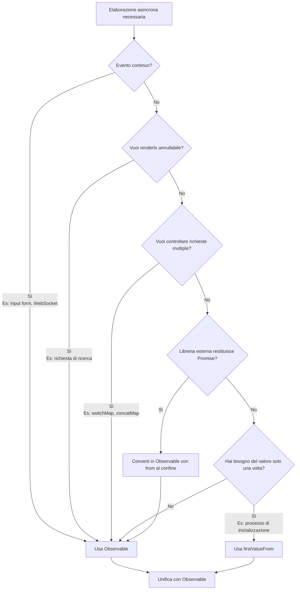

# Anti-pattern della commistione di Promise e Observable

Promise e Observable sono entrambi meccanismi per gestire l'elaborazione asincrona, ma **mescolarli senza confini di progettazione chiari può portare a vari problemi**. Questa pagina descrive in dettaglio gli anti-pattern causati dalla loro commistione e come unificarli in modo appropriato.

## Perché l'unificazione è importante

Mescolare Promise e Observable causa i seguenti problemi.

### 1. Non annullabile

Observable può essere interrotto con `unsubscribe` / `takeUntil`, ma **Promise non può essere interrotto una volta avviato**.

```ts
import { interval, Subject } from 'rxjs';
import { takeUntil } from 'rxjs';

const destroy$ = new Subject<void>();

// ✅ Observable: annullabile
interval(1000).pipe(
  takeUntil(destroy$)
).subscribe(n => console.log(n));

// Annulla quando l'utente lascia la schermata
destroy$.next();
destroy$.complete();
```

```ts
// ❌ Promise: non annullabile
async function fetchData() {
  const response = await fetch('/api/data');
  // fetch non si ferma anche se l'utente lascia la schermata
  return response.json();
}
```

**Impatto:** Richieste inutili durante le transizioni di route, esecuzione di side effect non necessari

### 2. Difficoltà di controllo multiplo

Observable può prevenire richieste multiple dalla serializzazione, dalla cancellazione e dal rientro con `switchMap`/`concatMap`/`exhaustMap` ecc.

```ts
import { fromEvent } from 'rxjs';
import { switchMap, debounceTime } from 'rxjs';

const searchInput = document.getElementById('serch-input')!;

// ✅ Observable: elabora solo la richiesta più recente
fromEvent(searchInput, 'input').pipe(
  debounceTime(300),
  switchMap(event => searchAPI((event.target as HTMLInputElement).value))
  // Le vecchie richieste vengono automaticamente annullate
).subscribe(results => displayResults(results));
function searchAPI(query: string) {
  return fetch(`/api/search?q=${query}`).then(r => r.json());
}

function displayResults(results: unknown) {
  console.log(results);
}
```

Con Promise, tali controlli devono essere implementati manualmente, il che può essere complesso.

### 3. Gestione di eventi multipli

Observable è robusto per i **flussi di valore continui**, come input dei form, WebSocket e eventi.

```ts
import { fromEvent } from 'rxjs';
import { map } from 'rxjs';

// ✅ Observable: elabora eventi continui
fromEvent(document, 'mousemove').pipe(
  map(event => ({ x: (event as MouseEvent).clientX, y: (event as MouseEvent).clientY }))
).subscribe(position => {
  console.log('Mouse position:', position);
});
```

Promise è specializzato per l'elaborazione "una tantum" e non è adatto agli eventi continui.

### 4. Facilità di test

Observable può garantire tempo e concorrenza con i marble test.

```ts
import { TestScheduler } from 'rxjs/testing';

// ✅ Observable: il tempo può essere controllato con i marble test
// ※ Questo codice viene eseguito all'interno di un framework di test (Jasmine/Jest)
describe('Observable Test', () => {
  let scheduler: TestScheduler;

  beforeEach(() => {
    scheduler = new TestScheduler((actual, expected) => {
      expect(actual).toEqual(expected); // Usa expect del framework di test
    });
  });

  it('should emit values over time', () => {
    scheduler.run(({ cold, expectObservable }) => {
      const source$ = cold('a-b-c|');
      expectObservable(source$).toBe('a-b-c|');
    });
  });
});
```

Il codice basato su Promise tende a complicare i test asincroni. Per maggiori informazioni, vedere [Metodologie di test](/it/guide/testing/unit-tests).


## Pattern tipici di "blocco" nella commistione (da evitare)

I seguenti pattern problematici sono comuni nei progetti reali.

### ❌ Anti-pattern 1: mescolare async/await e pipe()

L'uso di `await` nel mezzo di un processo Observable o la commistione di processi Promise e Observable può portare alla non annullabilità.

```ts
import { ajax } from 'rxjs/ajax';
import { firstValueFrom } from 'rxjs';

// ❌ Cattivo esempio: commistione Observable → Promise → Promise
async function fetchUserData() {
  const user = await firstValueFrom(ajax.getJSON('/api/user'));

  // Dopo la conversione in Promise, diventa non annullabile
  return fetch('/api/profile').then(response => response.json());
}
```

```ts
import { of } from 'rxjs';
import { map } from 'rxjs';

// ❌ Cattivo esempio: tentativo di usare await in pipe() (in realtà non funziona)
async function processData() {
  return of(1, 2, 3).pipe(
    map(async (value) => {
      const result = await someAsyncOperation(value);
      return result; // Diventa Observable<Promise<T>>
    })
  );
}

async function someAsyncOperation(value: number): Promise<number> {
  return value * 2;
}
```

#### Problemi
- Diventa non annullabile
- Separazione dei canali di errore (verso `unhandledrejection` invece che `error`)
- Le responsabilità di Promise e Observable diventano ambigue
- Il tipo diventa `Observable<Promise<T>>`

### ❌ Anti-pattern 2: uso di `toPromise()` (deprecato)

```ts
import { interval } from 'rxjs';

// ❌ Cattivo esempio: toPromise() è stato rimosso in RxJS v8
interval(1000).toPromise().then(value => {
  console.log(value);
});
```

**Soluzione:** Usare `firstValueFrom` / `lastValueFrom` (vedere sotto)

### ❌ Anti-pattern 3: `await` in `subscribe`

```ts
import { fromEvent } from 'rxjs';

const button = document.getElementById('btn') as HTMLButtonElement;

// ❌ Cattivo esempio
fromEvent(button, 'click').subscribe(async () => {
  const data = await fetch('/api/data').then(r => r.json());
  console.log(data);
  // Il flusso diventa illeggibile, la gestione degli errori è difficile
});
```

#### Problemi
- Il flusso diventa illeggibile
- Focolaio di richieste duplicate
- Possibili memory leak

### ❌ Anti-pattern 4: annidamento dei subscribe

```ts
import { ajax } from 'rxjs/ajax';

// ❌ Cattivo esempio
ajax.getJSON('/api/users').subscribe(users => {
  ajax.getJSON('/api/settings').subscribe(settings => {
    console.log(users, settings);
    // Callback hell
  });
});
```

#### Problemi
- Aumento della complessità della gestione degli errori
- Difficoltà nel gestire le disiscrizioni

### ❌ Anti-pattern 5: acquisizione parallela degli stessi dati con Promise e Observable

```ts
import { ajax } from 'rxjs/ajax';

// ❌ Cattivo esempio
async function loadData() {
  const userPromise = fetch('/api/user').then(r => r.json());
  const user$ = ajax.getJSON('/api/user');

  // Acquisisce gli stessi dati due volte
}
```

#### Problemi
- Doppia esecuzione
- Conflitti di ordine

### ❌ Anti-pattern 6: restituire Promise all'interno di Observable

L'uso di `async/await` nel costruttore di un Observable rende difficile la gestione degli errori.

```ts
import { Observable } from 'rxjs';

// ❌ Cattivo esempio: usare async function all'interno di Observable
const data$ = new Observable(subscriber => {
  async function fetchData() {
    const response = await fetch('/api/data');
    const data = await response.json();
    subscriber.next(data);
    subscriber.complete();
  }

  fetchData(); // Restituisce Promise, ma non può catturare gli errori
  // Se fetchData() viene reject, subscriber.error() non viene chiamato
});
```

```ts
import { Observable } from 'rxjs';

// ❌ Cattivo esempio: passare Promise a subscriber.next()
const data$ = new Observable(subscriber => {
  const promise = fetch('/api/data').then(r => r.json());
  subscriber.next(promise); // L'oggetto Promise fluisce
  subscriber.complete();
});

// Il lato sottoscrizione riceve Promise
data$.subscribe(value => {
  console.log(value); // Viene stampato Promise { <pending> }
});
```

#### Problemi
- Gli errori della Promise non fluiscono nel canale degli errori dell'Observable
- Possibile `unhandledrejection`
- L'oggetto Promise viene passato a subscriber.next()
- Il sottoscrittore deve fare l'unwrap della Promise

#### Soluzione

```ts
import { from, defer } from 'rxjs';

// ✅ Buon esempio: convertire Promise in Observable con from()
const data$ = from(fetch('/api/data').then(r => r.json()));

// ✅ Buon esempio: valutazione lazy con defer()
const data$ = defer(() => fetch('/api/data').then(r => r.json()));
```


## Guida pratica: conversione pulita al confine

Poiché è difficile evitare del tutto la commistione, la prassi migliore è **convertire correttamente ai confini della progettazione**.

### Pattern 1: Promise → Observable (SDK esterno restituisce Promise)

Se una libreria esterna o un codice legacy restituisce Promise, **convertirla in Observable solo una volta al confine**.

```ts
import { from } from 'rxjs';
import { switchMap } from 'rxjs';

// SDK esterno restituisce Promise
async function externalSDK(): Promise<{ userId: string }> {
  return { userId: '123' };
}

// ✅ Buon esempio: convertire al confine e poi unificare con Observable
const user$ = from(externalSDK());

user$.pipe(
  switchMap(user => from(fetchProfile(user.userId)))
).subscribe(profile => {
  console.log(profile);
});

async function fetchProfile(userId: string): Promise<{ name: string }> {
  return { name: 'John' };
}
```

### Pattern 2: Observable → Promise (contesto sincrono "lo voglio solo una volta")

Usare `firstValueFrom` / `lastValueFrom` quando si ha **bisogno del valore solo una volta**, ad esempio nei processi di inizializzazione o nelle funzioni guard.

```ts
import { ajax } from 'rxjs/ajax';
import { firstValueFrom, shareReplay } from 'rxjs';

// ✅ Buon esempio: cache se si fa await più volte
const config$ = ajax.getJSON('/api/config').pipe(
  shareReplay({ bufferSize: 1, refCount: true })
);

async function initialize() {
  const config = await firstValueFrom(config$);
  console.log('Config loaded:', config);
}

async function validate() {
  const config = await firstValueFrom(config$); // Ottiene dalla cache
  console.log('Validating with config:', config);
}
```

**⚠️ Attenzione:** `firstValueFrom` recupera solo il **primo valore**. **Non va mai usato** per eventi continui (valueChanges, WebSocket, ecc.).

```ts
import { interval } from 'rxjs';
import { firstValueFrom } from 'rxjs';

// ❌ Cattivo esempio: firstValueFrom su stream infinito
const value = await firstValueFrom(interval(1000));
// Ottiene solo un valore e termina (comportamento non intenzionale)
```

### Pattern 3: gestione unificata degli errori

Fare attenzione a non separare i canali di gestione degli errori tra Promise e Observable.

```ts
import { from } from 'rxjs';
import { catchError } from 'rxjs';
import { of } from 'rxjs';

async function riskyOperation(): Promise<string> {
  throw new Error('Something went wrong');
}

// ✅ Buon esempio: unificare con la gestione degli errori di Observable
from(riskyOperation()).pipe(
  catchError(error => {
    console.error('Error caught in Observable pipeline:', error);
    return of('fallback value');
  })
).subscribe(result => {
  console.log(result); // 'fallback value'
});
```


## Esempi di sostituzioni per commistioni comuni

### Esempio 1: Promise nel mezzo → then

#### ❌ Cattivo esempio

```ts
import { ajax } from 'rxjs/ajax';
import { firstValueFrom } from 'rxjs';

async function loadUser() {
  const user = await firstValueFrom(ajax.getJSON('/api/user'));

  // Converti in Promise e continua l'elaborazione con then
  return fetch('/api/profile')
    .then(response => response.json())
    .then(profile => {
      console.log(user, profile);
    });
}
```

#### ✅ Buon esempio A: Observable dall'inizio alla fine

```ts
import { ajax } from 'rxjs/ajax';
import { switchMap } from 'rxjs';

// Elabora come Observable
ajax.getJSON('/api/user').pipe(
  switchMap(user => ajax.getJSON('/api/profile').pipe(
    // Combina user e profile
  ))
).subscribe(profile => {
  console.log(profile);
});
```

#### ✅ Buon esempio B: contesto che richiede solo un await

```ts
import { ajax } from 'rxjs/ajax';
import { shareReplay, firstValueFrom } from 'rxjs';

const user$ = ajax.getJSON('/api/user').pipe(
  shareReplay({ bufferSize: 1, refCount: true })
);

async function loadUserOnce() {
  const user = await firstValueFrom(user$);
  console.log('User loaded once:', user);
}
```


### Esempio 2: await in subscribe

#### ❌ Cattivo esempio

```ts
import { fromEvent } from 'rxjs';

const button = document.getElementById('search-btn') as HTMLButtonElement;

fromEvent(button, 'click').subscribe(async () => {
  const results = await fetch('/api/search').then(r => r.json());
  console.log(results);
});
```

#### ✅ Buon esempio

```ts
import { fromEvent, from } from 'rxjs';
import { switchMap } from 'rxjs';

const button = document.getElementById('search-btn') as HTMLButtonElement;

fromEvent(button, 'click').pipe(
  switchMap(() => from(fetch('/api/search').then(r => r.json())))
).subscribe(results => {
  console.log(results);
});
```


## Diagramma di flusso decisionale (linee guida facili da ricordare)

Una linea guida per i casi in cui non si è sicuri se usare Promise o Observable nel progetto.



### Criteri decisionali specifici

| Condizione | Raccomandato | Motivo |
|---|---|---|
| **Eventi continui** (input form, WebSocket) | Observable | Promise può restituire un valore solo una volta |
| **Vuoi renderlo annullabile** (richiesta di ricerca) | Observable | Promise non può essere annullata |
| **Controllo di richieste multiple** (switchMap, concatMap) | Observable | Difficile da controllare con Promise |
| **Libreria esterna restituisce Promise** | Converti con `from()` | Converti solo una volta al confine |
| **Hai bisogno del valore solo una volta** (processo di inizializzazione) | `firstValueFrom` | Combina con `shareReplay(1)` se necessario |


## Riepilogo

- **La commistione di per sé non è negativa**, ma è giusto **rendere chiari i "confini" della progettazione** e spostarla da una parte
- **Unificare con Observable come standard** e convertire solo il minimo necessario con **`firstValueFrom`/`from()`** ridurrà al minimo i problemi e garantirà testabilità, leggibilità e annullabilità
- **Gli eventi continui (form, WebSocket) non dovrebbero mai essere convertiti in Promise**

## Sezioni correlate

- **[Differenze tra Promise e RxJS](/it/guide/basics/promise-vs-rxjs)** - Metodi di conversione di base
- **[Gestione degli errori](/it/guide/error-handling/strategies)** - Strategie di gestione degli errori Observable
- **[Errori comuni e come affrontarli](/it/guide/anti-patterns/common-mistakes)** - Altri anti-pattern

## Prossimi passi

1. Identificare dove Promise e Observable sono mescolati nel codice esistente
2. Chiarire i confini e unificare con Observable
3. Aggiungere `takeUntil` dove è richiesta la cancellazione
