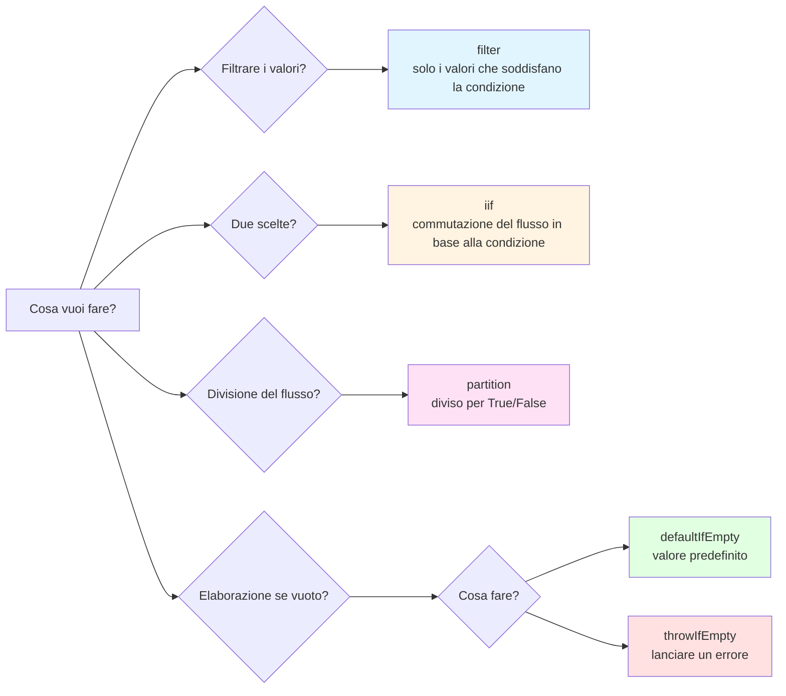

# If-Hell in Subscribe

## Perché questo è un anti-pattern

La "ramificazione condizionale complessa all'interno di subscribe" è un **chiaro anti-pattern** in RxJS. È riconosciuto come un pattern di implementazione da evitare per le seguenti ragioni.

### 1. Va contro la filosofia di progettazione di RxJS

RxJS incoraggia la **programmazione dichiarativa**. "Cosa fare" dovrebbe essere espresso nella pipeline e i dettagli di "come farlo" non dovrebbero essere scritti all'interno della sottoscrizione.

```ts
// ❌ Anti-pattern: programmazione imperativa (procedurale)
userService.getUser(id).subscribe(user => {
  if (user.isActive) {
    if (user.role === 'admin') {
      console.log('Admin user');
    }
  }
});

// ✅ RxJS-like: programmazione dichiarativa
userService.getUser(id).pipe(
  filter(user => user.isActive),
  filter(user => user.role === 'admin'),
  tap(user => console.log('Admin user'))
).subscribe();
```

### 2. Stesso livello di problemi degli anti-pattern esistenti

Come gli altri anti-pattern trattati nel Capitolo 10, causa i seguenti problemi:

| Anti-pattern | Problemi principali |
|---------------|---------|
| **Memory leak** | Dimenticanza di unsubscribe |
| **Inferno delle sottoscrizioni** | Sottoscrizioni annidate |
| **If hell all'interno di subscribe** ← questa pagina | Ramificazione condizionale complessa |

### 3. Problemi specifici

1. **Bassa leggibilità** - annidamento profondo e intento del codice poco chiaro
2. **Difficile da testare** - troppi rami condizionali, con conseguente esplosione dei casi di test
3. **Non riutilizzabile** - la logica è intrappolata all'interno delle sottoscrizioni e non può essere utilizzata altrove
4. **Difficile da debuggare** - il flusso di valori è difficile da seguire e l'identificazione delle aree problematiche richiede molto tempo
5. **Gestione complessa degli errori** - è difficile rintracciare i punti in cui si verificano gli errori

### 4. Ambito accettabile e ambito da evitare

```ts
// ✅ Consentito: semplice ramificazione (1-2 istruzioni if)
subscribe(user => {
  if (user.isAdmin) {
    console.log('Admin user');
  } else {
    console.log('Regular user');
  }
});

// ⚠️ Attenzione: 2-3 annidati
subscribe(user => {
  if (user) {
    if (user.isActive) {
      console.log('Active user');
    }
  }
});

// ❌ Anti-pattern: nidificazione di 3 o più elementi
subscribe(user => {
  if (user) {
    if (user.isActive) {
      if (user.role === 'admin') {
        if (user.permissions.includes('write')) {
          // Questo è un chiaro anti-pattern
        }
      }
    }
  }
});
```

> [!IMPORTANT] Criteri
> - **1-2 istruzioni if**: accettabili (ma gli operatori sono preferibili)
> - **3 o più annidati**: chiaro anti-pattern (deve essere rifattorizzato)
> - **Elaborazione asincrona annidata**: necessita di refactoring immediato


## Pattern comuni errati

### Pattern 1: ramificazione condizionale complessa all'interno delle sottoscrizioni

```ts
// ❌ Cattivo esempio: nidificazione di istruzioni if all'interno di subscribe
userService.getUser(id).subscribe(user => {
  if (user) {
    if (user.isActive) {
      if (user.role === 'admin') {
        // Elaborazione per l'amministratore
        console.log('Admin user:', user.name);
        adminService.loadAdminData().subscribe(adminData => {
          if (adminData) {
            // ulteriore annidamento...
          }
        });
      } else {
        // Elaborazione per gli utenti regolari
        console.log('Regular user:', user.name);
      }
    } else {
      // Utente inattivo
      console.log('Inactive user');
    }
  } else {
    // Utente non trovato
    console.log('User not found');
  }
});
```

### Problemi con questo codice
1. **5 livelli di annidamento** - riduce fortemente la leggibilità
2. **Più subscribe all'interno di subscribe** - rischio di memory leak
3. **Nessuna gestione degli errori** - non si sa dove si verifichino gli errori
4. **Non testabile** - difficile testare tutti i percorsi
5. **Non riutilizzabile** - la logica non può essere usata altrove


## Soluzione che utilizza gli operatori condizionali di RxJS

### Soluzione 1: ramificazione condizionale tramite filter

**Quando usarlo?**: restringere i valori, escludere i valori indesiderati

```ts
import { filter, tap, switchMap } from 'rxjs';

// ✅ Buon esempio: separare le condizioni con filter
userService.getUser(id).pipe(
  filter(user => user !== null),           // controllo null
  filter(user => user.isActive),           // controllo attivo
  filter(user => user.role === 'admin'),   // controllo del ruolo
  tap(user => console.log('Admin user:', user.name)),
  switchMap(user => adminService.loadAdminData())
).subscribe({
  next: adminData => console.log('Admin data loaded', adminData),
  error: err => console.error('Error:', err)
});
```

> [!NOTE] Vantaggi
> - ✅ Ogni condizione è indipendente (facile da leggere)
> - ✅ Ordine chiaro nella pipeline
> - ✅ La gestione degli errori è centralizzata

### Soluzione 2: ramificazione a due scelte con iif

**Quando usarla?**: eseguire diversi Observable a seconda della condizione

```ts
import { iif, of, switchMap } from 'rxjs';

// ✅ Buon esempio: commutare i flussi in base alle condizioni con iif
userService.getUser(id).pipe(
  switchMap(user =>
    iif(
      () => user.role === 'admin',
      adminService.loadAdminData(),    // per gli amministratori
      userService.loadUserData()       // per l'utente normale
    )
  )
).subscribe(data => console.log('Data:', data));
```

> [!NOTE] Vantaggi
> - ✅ Chiara ramificazione tra le due opzioni
> - ✅ Ogni processo è un Observable indipendente
> - ✅ Facile da testare

### Soluzione 3: processo di ramificazione tramite partition

**Quando usarla?**: dividere il flusso in due ed elaborarli separatamente

```ts
import { partition, merge, tap, switchMap, map } from 'rxjs';

// ✅ Buon esempio: partition divide il flusso in due parti
const [activeUsers$, inactiveUsers$] = partition(
  userService.getUsers(),
  user => user.isActive
);

// Elaborare gli utenti attivi
const processedActive$ = activeUsers$.pipe(
  tap(user => console.log('Active:', user.name)),
  switchMap(user => userService.loadProfile(user.id))
);

// Elaborare gli utenti inattivi
const processedInactive$ = inactiveUsers$.pipe(
  tap(user => console.log('Inactive:', user.name)),
  map(user => ({ ...user, status: 'archived' }))
);

// Unire i due flussi
merge(processedActive$, processedInactive$).subscribe(
  result => console.log('Processed:', result)
);
```

> [!NOTE] Vantaggi
> - ✅ Completa separazione tra attivi e inattivi
> - ✅ Possono essere elaborati indipendentemente l'uno dall'altro
> - ✅ Facilità di estensione

### Soluzione 4: defaultIfEmpty per il valore predefinito

**Quando usarlo?**: fornire un valore predefinito se vuoto

```ts
import { defaultIfEmpty, filter } from 'rxjs';

// ✅ Buon esempio: fornire un valore predefinito se vuoto
userService.getUser(id).pipe(
  filter(user => user !== null),
  defaultIfEmpty({ id: 0, name: 'Guest', role: 'guest' })
).subscribe(user => {
  console.log('User:', user.name);
});
```

> [!NOTE] Vantaggi
> - ✅ Non sono necessari controlli su null
> - ✅ Valori predefiniti chiari
> - ✅ Non c'è bisogno di ramificazioni in subscribe

### Soluzione 5: gestione degli errori con throwIfEmpty

**Quando usarlo?**: trattare come errore se vuoto

```ts
import { throwIfEmpty, catchError, filter } from 'rxjs';
import { of } from 'rxjs';

// ✅ Buon esempio: lanciare un errore se vuoto
userService.getUser(id).pipe(
  filter(user => user !== null),
  throwIfEmpty(() => new Error('User not found')),
  catchError(err => {
    console.error('Error:', err.message);
    return of(null);
  })
).subscribe(user => {
  if (user) {
    console.log('User found:', user.name);
  }
});
```

> [!NOTE] Vantaggi
> - ✅ Gestione chiara degli errori
> - ✅ Completa in pipeline
> - ✅ Gestione dei successi solo in subscribe


## Esempio pratico: rifattorizzazione di una logica condizionale complessa

### Prima: if hell in subscribe

```ts
// ❌ Cattivo esempio: logica condizionale complessa (annidamento in 6 passi)
apiService.fetchData().subscribe(data => {
  if (data) {
    if (data.status === 'success') {
      if (data.result) {
        if (data.result.items.length > 0) {
          data.result.items.forEach(item => {
            if (item.isValid) {
              if (item.price > 0) {
                // Elaborazione...
                console.log('Valid item:', item);
              }
            }
          });
        } else {
          console.log('No items found');
        }
      }
    } else {
      console.log('Request failed');
    }
  }
});
```

> [!WARNING] Problemi
> - Nidificazione di 6 passi
> - Ulteriore ramificazione condizionale all'interno di forEach
> - Nessuna gestione degli errori
> - Non testabile
> - Gestione inefficiente degli array

### Dopo: strutturato con operatori

```ts
import { filter, map, defaultIfEmpty, switchMap, tap } from 'rxjs';
import { from } from 'rxjs';

// ✅ Buon esempio: organizzare le condizioni con gli operatori
apiService.fetchData().pipe(
  // 1. verifica l'esistenza dei dati
  filter(data => data !== null),

  // 2. controllare lo stato
  filter(data => data.status === 'success'),

  // 3. controllare l'esistenza del risultato
  filter(data => data.result !== null),

  // 4. espandere l'array
  map(data => data.result.items),
  defaultIfEmpty([]),  // default in caso di array vuoto

  // 5. elaborare ogni elemento singolarmente
  switchMap(items => from(items)),

  // 6. solo gli elementi validi
  filter(item => item.isValid),

  // 7. controllo del prezzo
  filter(item => item.price > 0),

  // 8. log di debug
  tap(item => console.log('Valid item:', item))

).subscribe({
  next: item => console.log('Processing:', item),
  error: err => console.error('Error:', err),
  complete: () => console.log('All items processed')
});
```

> [!TIP] Miglioramenti
> - ✅ L'annidamento è 0 (tutto piatto)
> - ✅ Ogni condizione è indipendente e facile da leggere
> - ✅ Aggiunta la gestione degli errori
> - ✅ Più facile da testare (ogni operatore può essere testato separatamente)
> - ✅ Gestione efficiente degli array (in streaming con from())


## Guida alla selezione dell'operatore condizionale

Il seguente diagramma di flusso aiuta a determinare l'operatore da utilizzare.



| Condizione | Operatore da utilizzare | Motivo |
|-----|----------------|------|
| Filtrare i valori | `filter()` | Passare solo i valori che corrispondono alla condizione |
| Scegliere tra due opzioni | `iif()` | Commutare il flusso in base alla condizione |
| Dividere il flusso in due | `partition()` | Dividere in due flussi con True/False |
| Default se vuoto | `defaultIfEmpty()` | Usare il valore predefinito se il valore è mancante |
| Errore se vuoto | `throwIfEmpty()` | Lanciare un errore se non c'è alcun valore |
| Scelte multiple (più di tre) | Operatore personalizzato | Se sono richiesti più di tre rami |


## Fasi della rifattorizzazione

### Passo 1: identificare le condizioni
Enumerare tutte le istruzioni if nella sottoscrizione

```ts
// Esempio: abbiamo le seguenti condizioni
if (data)                        // ← Condizione 1
if (data.status === 'success')   // ← Condizione 2
if (data.result)                 // ← Condizione 3
if (item.isValid)                // ← Condizione 4
if (item.price > 0)              // ← Condizione 5
```

### Passo 2: classificare le condizioni
- **Condizioni di filtraggio** → `filter()`
- **Biforcazione di due scelte** → `iif()`
- **Divisione dello stream** → `partition()`
- **Valore predefinito** → `defaultIfEmpty()`
- **Condizione di errore** → `throwIfEmpty()`

### Passo 3: conversione in pipeline
Sostituire la condizione con un operatore nella pipeline

```ts
.pipe(
  filter(data => data !== null),              // Condizione 1
  filter(data => data.status === 'success'),  // Condizione 2
  filter(data => data.result !== null),       // Condizione 3
  switchMap(data => from(data.result.items)),
  filter(item => item.isValid),               // Condizione 4
  filter(item => item.price > 0)              // Condizione 5
)
```

### Passo 4: semplificare la sottoscrizione
La sottoscrizione ha solo effetti collaterali (output del log, manipolazione del DOM, ecc.)

```ts
.subscribe({
  next: item => console.log('Valid item:', item),
  error: err => console.error('Error:', err),
  complete: () => console.log('Complete')
});
```

### Passo 5: scrivere i test
Verificare che ogni operatore funzioni come previsto

```ts
// Esempio: testare un filter
it('should filter out null values', () => {
  const source$ = of(null, { id: 1 }, null);
  const result$ = source$.pipe(
    filter(data => data !== null)
  );

  result$.subscribe(data => {
    expect(data).not.toBeNull();
  });
});
```


## Riutilizzo con operatori personalizzati

La logica condizionale complessa può essere riutilizzata se estratta in operatori personalizzati.

```ts
import { pipe } from 'rxjs';
import { filter } from 'rxjs';

// Operatore personalizzato: solo utenti amministratori attivi
function filterActiveAdmins<T extends { isActive: boolean; role: string }>() {
  return pipe(
    filter((user: T) => user.isActive),
    filter((user: T) => user.role === 'admin')
  );
}

// Esempio di utilizzo
userService.getUsers().pipe(
  filterActiveAdmins(),
  tap(user => console.log('Active admin:', user.name))
).subscribe();
```

> [!NOTE] Vantaggi
> - ✅ Riutilizzabile
> - ✅ Facile da testare
> - ✅ L'intento è chiaro dal nome


## Risorse didattiche correlate

Per comprendere questo anti-pattern, vedere anche le seguenti sezioni.

- **[Capitolo 4: Operatori condizionali](/it/guide/operators/conditional/)** - Maggiori informazioni su filter, iif e defaultIfEmpty
- **[Capitolo 10: Anti-pattern](/it/guide/anti-patterns/)** - Altri anti-pattern
- **[Capitolo 11: Barriere alla comprensione concettuale](/it/guide/overcoming-difficulties/conceptual-understanding)** - Comprendere la programmazione dichiarativa
- **[Capitolo 11: Selezione degli operatori](/it/guide/overcoming-difficulties/operator-selection)** - Come scegliere l'operatore giusto


## Checklist per evitare gli anti-pattern

Controllare il codice.

```markdown
- [ ] Non sono annidati più di tre if all'interno di subscribe
- [ ] I rami condizionali sono gestiti da operatori in pipe
- [ ] subscribe esegue solo effetti collaterali (registrazione, manipolazione del DOM)
- [ ] Il filter è usato per escludere i valori non necessari
- [ ] Il caso vuoto è gestito da defaultIfEmpty o throwIfEmpty
- [ ] Le condizioni complesse sono estratte in un operatore personalizzato
- [ ] La gestione degli errori è effettuata con catchError
- [ ] Non ci sono più sottoscrizioni annidate all'interno di sottoscrizioni
```

## Prossimi passi

Una volta compreso questo anti-pattern, si possono imparare i pattern pratici nelle pagine seguenti.

1. **[Errori comuni e come affrontarli](/it/guide/anti-patterns/common-mistakes)** - Imparare altri anti-pattern
2. **[Capitolo 11: Superare le difficoltà](/it/guide/overcoming-difficulties/)** - Superare le difficoltà specifiche di RxJS
3. **[Capitolo 13: Pattern pratici](/it/guide/practical-patterns/)** - Imparare i pattern di implementazione corretti

> [!TIP] Punti chiave
> I rami condizionali complessi nelle sottoscrizioni sono un chiaro anti-pattern contro la filosofia di programmazione dichiarativa di RxJS. Usare operatori come filter, iif e partition per gestire le condizioni nella pipeline.
