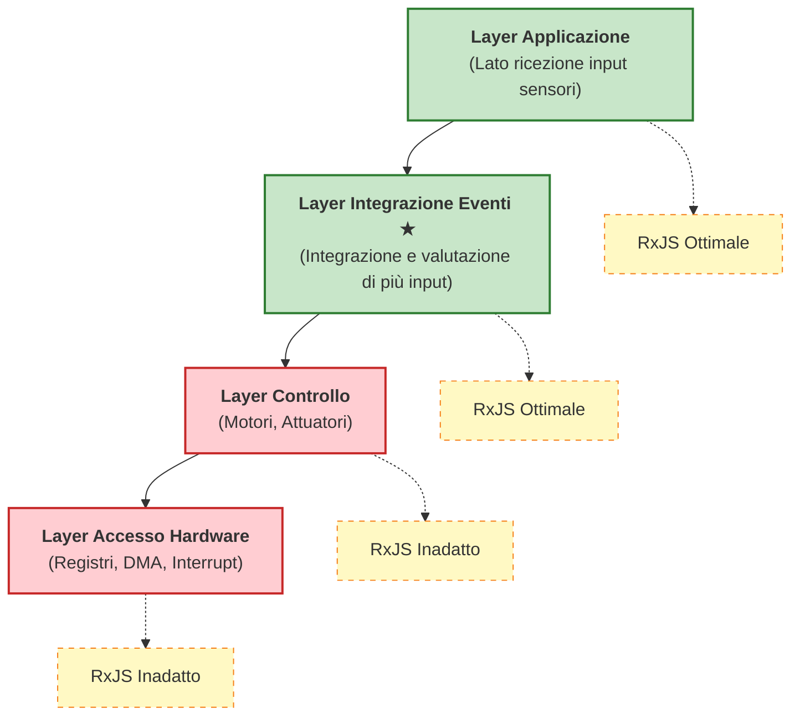

# Embedded e RP

Questo articolo spiega come la programmazione reattiva, in particolare l'elaborazione di stream asincroni come RxJS, può essere utilizzata nei sistemi embedded, le sue possibilità e i suoi vincoli.

## Cos'è la Programmazione Reattiva

La programmazione reattiva è un **approccio dichiarativo che gestisce stream di dati asincroni sull'asse temporale**. Tratta eventi e flussi di dati come "valori che cambiano nel tempo", eseguendo trasformazioni, combinazioni e filtraggio.

Nella programmazione imperativa tradizionale, è necessario descrivere esplicitamente "quando" e "come" elaborare, mentre nella programmazione reattiva si descrive dichiarativamente "cosa" elaborare.

```ts
// Approccio imperativo tradizionale
let sensorValue = 0;
setInterval(() => {
  sensorValue = readSensor();
  if (sensorValue > threshold) {
    handleAlert(sensorValue);
  }
}, 100);

// Approccio reattivo
sensorStream$
  .pipe(
    filter(value => value > threshold)
  )
  .subscribe(value => handleAlert(value));
```

Con l'approccio reattivo, il flusso dei dati e la logica di elaborazione sono chiaramente separati, migliorando la leggibilità e la manutenibilità.

## Sfide nello Sviluppo Embedded

La programmazione reattiva non si è diffusa ampiamente nei sistemi embedded a causa dei seguenti vincoli.

### 1. Vincoli di Prestazioni

Molti sistemi embedded richiedono **risposte nell'ordine dei microsecondi**.

```ts
// ❌ Inadeguato per il layer di controllo embedded
motorControl$
  .pipe(
    map(signal => processSignal(signal)),  // Deve completare entro decine di μs
    filter(value => value > threshold)
  )
  .subscribe(value => actuateMotor(value));
```

::: warning Problemi
- La catena di operatori di RxJS ha un overhead elevato
- Possibilità di garbage collection
- Difficoltà nel prevedere i tempi di risposta
:::

### 2. Limitazioni di Memoria

I sistemi embedded operano con memoria limitata (da pochi KB a pochi MB).

::: warning Problemi
- L'allocazione dinamica della memoria è spesso proibita
- Lo stato interno degli Observable consuma memoria
- Gli operatori di buffering (`buffer`, `window`) utilizzano particolarmente molta memoria
:::

### 3. Alto Livello di Astrazione

La programmazione reattiva ha un alto livello di astrazione ed è inadatta per il controllo a livello hardware.

::: warning Problemi
- Non adatta per operazioni su registri o controllo DMA
- Inadeguata per elaborazioni che richiedono un controllo fine a livello di bit
- Debug complesso (difficile tracciare stream asincroni)
:::

### 4. Compatibilità con RTOS

I Real-Time Operating System (RTOS) eseguono scheduling dei task basato sulle priorità, mentre RxJS è basato su event loop.

::: warning Problemi
- Possibilità di inversione di priorità
- Difficoltà nel prevedere i tempi di esecuzione dei task
- Difficoltà nel garantire la real-time性
:::

## Layer Applicativo Ottimale: Layer di Integrazione Eventi

Nei sistemi embedded, il layer dove la programmazione reattiva è più efficace è il **"layer di integrazione eventi"**.

### Posizione Dove il Modello Reattivo è Più Utile: Lato Ricezione Input Sensori

Nei sistemi embedded, la programmazione reattiva mostra il suo vero valore sul **lato ricezione dati (input sensori)**.

#### Punti di Forza del Modello Reattivo sul Lato Ricezione (Input Sensori)
- Integrazione di dati asincroni da più sensori
- Descrizione dichiarativa delle correlazioni temporali
- Espressione naturale dell'elaborazione event-driven
- Facilità di gestione dello stato e filtraggio

#### Problemi del Modello Reattivo sul Lato Trasmissione (Output Controllo)
- Difficoltà nel garantire la real-time性 (necessaria risposta nell'ordine dei microsecondi)
- Overhead non tollerabile
- Troppo astratto per il controllo diretto dell'hardware

### Caratteristiche e Vantaggi degli Stream di Input Sensori

| Caratteristica | Approccio Imperativo Tradizionale | Approccio Reattivo | Vantaggi |
|------|---------------------|---------------------|------|
| **Integrazione di Più Sensori** | Polling per ogni sensore, sincronizzazione manuale | Integrazione dichiarativa con `combineLatest`, `merge` | Codice conciso, intento chiaro |
| **Aggregazione in Finestre Temporali** | Gestione manuale di timer e buffer | Automazione con `bufferTime`, `windowTime` | Riduzione degli errori di implementazione, migliore manutenibilità |
| **Rimozione Rumore** | Implementazione di media mobile con loop e operazioni su array | Descrizione dichiarativa con `scan` + `map` | Alta leggibilità, riutilizzabile |
| **Rilevamento Anomalie** | Nesting complesso di flag e condizioni | Espressione chiara con `pairwise` + `filter` | Logica facile da seguire |
| **Correlazione Eventi** | Tracciamento eventi con variabili di stato, giudizio manuale | Rilevamento pattern con `merge` + `bufferTime` | Dichiarativo, facile da estendere |
| **Cancellazione Subscription** | Gestione manuale dei flag, facile a leak | Cancellazione automatica con `takeUntil` | Prevenzione memory leak |

### Differenze con il Lato Controllo (Lato Trasmissione)

È importante comprendere le differenze nelle caratteristiche tra "lato ricezione" e "lato trasmissione" nei sistemi embedded.

| Aspetto | Lato Ricezione (Input Sensori) | Lato Trasmissione (Output Controllo) |
|------|---------------------|------------------|
| **Real-time性** | Ordine di millisecondi (relativamente rilassato) | Ordine di microsecondi (rigoroso) |
| **Natura dell'Elaborazione** | Asincrono, event-driven | Sincrono, esecuzione periodica |
| **Complessità** | Integrazione di più sorgenti, gestione stato | Output semplice, priorità alla velocità |
| **Adattabilità RxJS** | ✅ **Ottimale** - Forte nell'integrazione eventi | ❌ **Inadatto** - Overhead elevato |
| **Elaborazione Principale** | Filtraggio, smoothing, rilevamento correlazioni | Controllo PWM, azionamento motori, trasferimento DMA |

::: tip Specializzazione sul Lato Ricezione Input Sensori
La programmazione reattiva è più efficace quando si **integrano e valutano più eventi asincroni sull'asse temporale**. Specializziamoci sul lato ricezione degli input sensori piuttosto che sul lato trasmissione come gli output di controllo.
:::

### Stratificazione dell'Architettura di Sistema



#### Caratteristiche del Layer di Integrazione Eventi
- Integrazione di input da più sensori e sorgenti di eventi
- Valutazione delle correlazioni temporali
- Requisiti di real-time性 relativamente rilassati (ordine di millisecondi)
- Focus su gestione stato e valutazione condizioni

## Esempi di Applicazione Pratica

### 1. Smoothing dei Valori dei Sensori

Smoothing degli input da più sensori per rimuovere il rumore.

```ts
import { interval, combineLatest } from 'rxjs';
import { map, scan, share } from 'rxjs';

// Simulazione di stream sensori
const temperatureSensor$ = interval(100).pipe(
  map(() => 25 + Math.random() * 5), // 25-30℃
  share()
);

const humiditySensor$ = interval(100).pipe(
  map(() => 50 + Math.random() * 10), // 50-60%
  share()
);

// Smoothing con media mobile
function movingAverage(windowSize: number) {
  return scan<number, number[]>((acc, value) => {
    const newWindow = [...acc, value];
    if (newWindow.length > windowSize) {
      newWindow.shift();
    }
    return newWindow;
  }, []).pipe(
    map(window => window.reduce((sum, val) => sum + val, 0) / window.length)
  );
}

const smoothedTemperature$ = temperatureSensor$.pipe(
  movingAverage(5),
  map(value => Math.round(value * 10) / 10)
);

const smoothedHumidity$ = humiditySensor$.pipe(
  movingAverage(5),
  map(value => Math.round(value * 10) / 10)
);

// Dati ambientali integrati
combineLatest([smoothedTemperature$, smoothedHumidity$])
  .pipe(
    map(([temp, humidity]) => ({
      temperature: temp,
      humidity: humidity,
      heatIndex: calculateHeatIndex(temp, humidity),
      timestamp: Date.now()
    }))
  )
  .subscribe(data => {
    console.log('Dati ambientali:', data);
  });

function calculateHeatIndex(temp: number, humidity: number): number {
  // Calcolo semplificato della temperatura percepita
  return temp + (0.5555 * (6.11 * Math.exp(5417.753 * ((1/273.16) - (1/(273.15 + temp)))) - 10));
}
```

> [!NOTE] Vantaggi dell'Integrazione Sensori
> - Elaborazione sincronizzata sull'asse temporale dei valori di più sensori
> - Rimozione del rumore con media mobile
> - Derivazione dichiarativa di valori calcolati (temperatura percepita, ecc.)

### 2. Rilevamento Correlazioni Eventi

Rilevamento quando più eventi si verificano entro una specifica finestra temporale.

```ts
import { Subject, merge } from 'rxjs';
import { filter, bufferTime, map } from 'rxjs';

// Stream di eventi
const motionDetected$ = new Subject<{ sensor: string; timestamp: number }>();
const doorOpened$ = new Subject<{ door: string; timestamp: number }>();
const lightOn$ = new Subject<{ room: string; timestamp: number }>();

// Integrazione di tutti gli eventi
const allEvents$ = merge(
  motionDetected$.pipe(map(e => ({ type: 'motion', ...e }))),
  doorOpened$.pipe(map(e => ({ type: 'door', ...e }))),
  lightOn$.pipe(map(e => ({ type: 'light', ...e })))
);

// Aggregazione degli eventi in finestre temporali di 1 secondo
allEvents$
  .pipe(
    bufferTime(1000),
    filter(events => events.length > 0),
    map(events => {
      const hasMotion = events.some(e => e.type === 'motion');
      const hasDoor = events.some(e => e.type === 'door');
      const hasLight = events.some(e => e.type === 'light');

      return {
        timestamp: Date.now(),
        events,
        pattern: {
          hasMotion,
          hasDoor,
          hasLight
        }
      };
    }),
    filter(result =>
      // Rilevamento pattern di ingresso persona
      result.pattern.hasMotion && result.pattern.hasDoor
    )
  )
  .subscribe(result => {
    console.log('Rilevamento ingresso:', result);
    // Accensione automatica se la luce non è accesa
    if (!result.pattern.hasLight) {
      console.log('→ Accensione automatica illuminazione');
    }
  });

// Simulazione occorrenza eventi
setTimeout(() => motionDetected$.next({ sensor: 'entry', timestamp: Date.now() }), 100);
setTimeout(() => doorOpened$.next({ door: 'front', timestamp: Date.now() }), 200);
```

> [!TIP] Utilizzo delle Correlazioni Eventi
> - Stima della situazione da più eventi entro finestre temporali
> - Rilevamento anomalie in sistemi di sicurezza
> - Logica di automazione smart home

### 3. Rilevamento Anomalie

Rilevamento di pattern anomali nei valori dei sensori.

```ts
import { interval } from 'rxjs';
import { map, pairwise, filter, share } from 'rxjs';

// Simulazione sensore vibrazione
const vibrationSensor$ = interval(50).pipe(
  map(() => {
    // Normalmente 0-10, anomalia 50 o più
    const normal = Math.random() * 10;
    const isAbnormal = Math.random() < 0.05; // Probabilità 5% di anomalia
    return isAbnormal ? 50 + Math.random() * 20 : normal;
  }),
  share()
);

// Logica di rilevamento anomalie
vibrationSensor$
  .pipe(
    pairwise(), // Accoppia due valori consecutivi
    map(([prev, current]) => ({
      prev,
      current,
      delta: Math.abs(current - prev),
      timestamp: Date.now()
    })),
    filter(data =>
      // Superamento soglia o cambiamento brusco
      data.current > 30 || data.delta > 20
    )
  )
  .subscribe(data => {
    console.log('⚠️ Rilevamento anomalia:', {
      ValoreAttuale: data.current.toFixed(2),
      Variazione: data.delta.toFixed(2),
      Orario: new Date(data.timestamp).toISOString()
    });
  });
```

> [!WARNING] Precauzioni per il Rilevamento Anomalie
> - Importante regolare le soglie (dipendono dall'ambiente e dai dispositivi)
> - Necessario filtraggio per ridurre i falsi positivi
> - Efficace emettere allarmi solo quando le anomalie consecutive si verificano un certo numero di volte

### 4. Stima dello Stato

Stima dello stato dei dispositivi da più valori di sensori.

```ts
import { combineLatest, interval } from 'rxjs';
import { map, distinctUntilChanged, share } from 'rxjs';

// Stream sensori
const current$ = interval(100).pipe(
  map(() => 1.5 + Math.random() * 0.5), // Valore corrente 1.5-2.0A
  share()
);

const temperature$ = interval(100).pipe(
  map(() => 40 + Math.random() * 10), // Temperatura 40-50℃
  share()
);

const vibration$ = interval(100).pipe(
  map(() => 5 + Math.random() * 5), // Valore vibrazione 5-10
  share()
);

// Definizione stato
type MachineState = 'idle' | 'running' | 'overload' | 'warning';

interface MachineStatus {
  state: MachineState;
  current: number;
  temperature: number;
  vibration: number;
  timestamp: number;
}

// Logica di stima dello stato
combineLatest([current$, temperature$, vibration$])
  .pipe(
    map(([current, temperature, vibration]): MachineStatus => {
      let state: MachineState = 'idle';

      // Logica di giudizio dello stato
      if (current > 1.8 && temperature > 45 && vibration > 8) {
        state = 'overload';
      } else if (temperature > 48 || vibration > 9) {
        state = 'warning';
      } else if (current > 1.6) {
        state = 'running';
      }

      return {
        state,
        current: Math.round(current * 100) / 100,
        temperature: Math.round(temperature * 10) / 10,
        vibration: Math.round(vibration * 10) / 10,
        timestamp: Date.now()
      };
    }),
    distinctUntilChanged((prev, curr) => prev.state === curr.state) // Notifica solo al cambiamento di stato
  )
  .subscribe(status => {
    console.log(`Stato dispositivo: ${status.state}`, {
      Corrente: `${status.current}A`,
      Temperatura: `${status.temperature}℃`,
      Vibrazione: status.vibration
    });

    // Elaborazione in base allo stato
    switch (status.state) {
      case 'overload':
        console.log('🔴 Rilevamento sovraccarico - Arresto dispositivo');
        break;
      case 'warning':
        console.log('🟡 Avvertimento - Rafforzamento monitoraggio');
        break;
    }
  });
```

> [!IMPORTANT] Punti Chiave nella Stima dello Stato
> - Giudizio dello stato combinando i valori di più sensori
> - Elaborazione solo al cambiamento di stato con `distinctUntilChanged`
> - Partire da regole semplici basate su soglie, incorporare machine learning se necessario

## Best Practice

### 1. Selezione del Layer Applicativo

```ts
// ✅ Buon esempio: Uso nel layer di integrazione eventi
const userActivity$ = merge(
  buttonClick$,
  sensorInput$,
  timerEvent$
).pipe(
  debounceTime(100),
  map(event => processEvent(event))
);

// ❌ Cattivo esempio: Uso nel layer di controllo
const motorControl$ = interval(10).pipe(  // 10ms è lento per il layer di controllo
  map(() => readEncoder()),
  map(value => calculatePID(value))
);
```

### 2. Gestione della Memoria

```ts
// ✅ Assicurarsi di cancellare le subscription
import { Subject } from 'rxjs';
import { takeUntil } from 'rxjs';

class SensorManager {
  private destroy$ = new Subject<void>();

  start() {
    sensorStream$
      .pipe(
        takeUntil(this.destroy$)
      )
      .subscribe(data => this.process(data));
  }

  stop() {
    this.destroy$.next();
    this.destroy$.complete();
  }

  private process(data: any) {
    // Elaborazione
  }
}
```

### 3. Limitazione della Dimensione del Buffer

```ts
// ✅ Limitare esplicitamente la dimensione del buffer
import { bufferTime } from 'rxjs';

sensorStream$
  .pipe(
    bufferTime(1000, null, 100) // Massimo 100 elementi
  )
  .subscribe(batch => processBatch(batch));

// ❌ Evitare buffer illimitati
sensorStream$
  .pipe(
    bufferTime(10000) // Buffer di 10 secondi → Pericolo di insufficienza memoria
  )
  .subscribe(batch => processBatch(batch));
```

### 4. Gestione degli Errori

```ts
import { catchError, retry } from 'rxjs';
import { of } from 'rxjs';

sensorStream$
  .pipe(
    retry({ count: 3, delay: 1000 }),
    catchError(error => {
      console.error('Errore sensore:', error);
      // Restituire valore predefinito o elaborazione di fallback
      return of({ value: 0, error: true });
    })
  )
  .subscribe(data => {
    if (data.error) {
      handleSensorFailure();
    } else {
      processNormalData(data);
    }
  });
```

## Riepilogo

Punti chiave per l'utilizzo della programmazione reattiva nello sviluppo embedded

### Aree Applicabili
- ✅ **Layer di integrazione eventi** - Integrazione input sensori, rilevamento correlazioni eventi
- ✅ **Layer applicazione** - Stima stato, rilevamento anomalie, visualizzazione dati
- ❌ **Layer di controllo** - Controllo motori, attuatori (richiesta real-time性)
- ❌ **Layer accesso hardware** - Operazioni su registri, DMA, gestione interrupt

### Esempi di Applicazione Efficace
- ✅ Smoothing e integrazione valori sensori
- ✅ Rilevamento correlazioni eventi sull'asse temporale
- ✅ Rilevamento pattern anomali
- ✅ Stima stato da più sensori

### Precauzioni
- ⚠️ Monitoraggio e limitazione dell'uso della memoria
- ⚠️ Esecuzione affidabile della cancellazione subscription
- ⚠️ Limitazione esplicita della dimensione del buffer
- ⚠️ Gestione appropriata degli errori

La programmazione reattiva non è applicabile a "tutti i layer" dei sistemi embedded, ma è molto efficace nel **layer di integrazione eventi**. Utilizzandola nei layer appropriati, è possibile migliorare significativamente la leggibilità e la manutenibilità del codice.

## Prospettive Future: La Reattività Diventerà Inevitabile anche nell'Embedded

I sistemi embedded continuano a evolversi e si prevede che l'importanza della programmazione reattiva aumenterà ulteriormente in futuro.

### Aumento Esplosivo del Numero di Sensori

Nei moderni sistemi embedded, specialmente nei dispositivi IoT e nei sistemi intelligenti, il numero di sensori da gestire sta aumentando rapidamente.

#### Complessità dell'Integrazione Sensori
- Automobili: da decine a centinaia di sensori (ADAS, guida autonoma)
- Smart Home: molti sensori tra cui temperatura, umidità, presenza, porte, finestre, telecamere
- Apparecchiature industriali: monitoraggio composito di vibrazione, temperatura, corrente, pressione, posizione
- Dispositivi indossabili: battito cardiaco, accelerazione, giroscopio, GPS, pressione atmosferica, ecc.

#### Limiti dell'Approccio Imperativo Tradizionale
```ts
// ❌ Integrazione di più di 10 sensori con approccio imperativo porta al collasso
let temp1, temp2, temp3, humidity1, humidity2, motion1, motion2;
let lastUpdate1, lastUpdate2, lastUpdate3;
// ... Le variabili aumentano all'infinito

setInterval(() => {
  temp1 = readSensor1();
  temp2 = readSensor2();
  // ... Il codice di polling diventa enorme

  if (temp1 > threshold1 && humidity1 > threshold2 && ...) {
    // ... Le condizioni diventano complesse
  }
}, 100);
```

#### Necessità dell'Approccio Reattivo
```ts
// ✅ Anche aumentando i sensori, si può descrivere in modo dichiarativo
const allSensors$ = combineLatest({
  temp1: temperatureSensor1$,
  temp2: temperatureSensor2$,
  temp3: temperatureSensor3$,
  humidity1: humiditySensor1$,
  humidity2: humiditySensor2$,
  motion1: motionSensor1$,
  motion2: motionSensor2$,
  // Aggiungendo sensori basta aggiungere righe
});

allSensors$
  .pipe(
    map(sensors => evaluateConditions(sensors)),
    filter(result => result.shouldAlert)
  )
  .subscribe(result => handleAlert(result));
```

### Ascesa dell'Edge Computing

Ridurre la dipendenza dal cloud ed elaborare i dati sui dispositivi edge sta diventando importante.

#### Requisiti sull'Edge
- Elaborazione dati in tempo reale da più sensori
- Rilevamento anomalie e riconoscimento pattern locale
- Esecuzione di modelli di machine learning leggeri
- Operazione autonoma in caso di guasto di rete

Questi requisiti sono compatibili con l'**elaborazione di stream asincroni**, rendendo la programmazione reattiva una scelta naturale.

### Evoluzione dell'Hardware

Con il miglioramento delle prestazioni dei processori embedded, l'overhead della programmazione reattiva sta diventando accettabile.

| Periodo | Prestazioni Processore | Memoria | Applicabilità Reattiva |
|------|-------------|--------|-------------------|
| Anni 2000 | Pochi MHz, 8bit | Pochi KB | ❌ Difficile - Overhead elevato |
| Anni 2010 | Da decine a centinaia di MHz, 32bit | Da decine di KB a pochi MB | △ Limitata - Solo layer eventi |
| Anni 2020 in poi | Livello GHz, 64bit, Multi-core | Da centinaia di MB a GB | ✅ **Pratico** - Applicabile in molti layer |

#### Esempi di Processori Embedded Moderni
- Raspberry Pi 4: 1.5GHz Quad-core, fino a 8GB RAM
- ESP32: 240MHz Dual-core, 520KB SRAM
- STM32H7: 480MHz, 1MB RAM

Su questi hardware, l'overhead di RxJS è ampiamente accettabile.

### Inevitabilità della Programmazione Reattiva

Per le seguenti ragioni, la programmazione reattiva sta diventando **non una scelta ma una necessità** anche nei sistemi embedded.

::: info Ragioni per cui la Programmazione Reattiva Diventa Inevitabile

1. **Aumento del numero di sensori** - Gestire decine-centinaia di sensori con approccio imperativo è al limite
2. **Importanza del rilevamento correlazioni temporali** - Il riconoscimento pattern di eventi è essenziale
3. **Ascesa dell'AI sull'Edge** - Ottimale per il pre-processing dei dati sensori
4. **Manutenibilità del codice** - Necessità di descrivere dichiarativamente sistemi complessi
5. **Evoluzione dell'hardware** - L'overhead è diventato accettabile

:::

### Strategia di Migrazione Pratica

Strategia per introdurre la programmazione reattiva nei sistemi embedded esistenti

#### Introduzione Graduale
1. **Fase 1**: Introduzione sperimentale di reattivo in nuove funzionalità (layer di integrazione sensori)
2. **Fase 2**: Sostituzione delle parti di gestione eventi con reattivo
3. **Fase 3**: Reattivoizzazione completa del layer applicazione
4. **Mantenere approccio tradizionale per layer di controllo** - Non modificare le parti che richiedono real-time性

**Approccio Ibrido:**
```ts
// Layer di controllo: Imperativo tradizionale (risposta nell'ordine dei microsecondi)
function controlMotor(speed: number) {
  // Operazione diretta su registri, elaborazione ad alta velocità
  writeRegister(MOTOR_CONTROL_REG, speed);
}

// Layer di integrazione eventi: Reattivo (risposta nell'ordine dei millisecondi)
const motorSpeedCommand$ = combineLatest([
  targetSpeed$,
  currentLoad$,
  temperatureLimit$
]).pipe(
  map(([target, load, tempLimit]) => calculateOptimalSpeed(target, load, tempLimit))
);

motorSpeedCommand$.subscribe(speed => {
  // Passare il valore deciso in modo reattivo alla funzione di controllo tradizionale
  controlMotor(speed);
});
```

In questo modo, combinando appropriatamente **programmazione reattiva (lato ricezione)** e **controllo imperativo tradizionale (lato trasmissione)**, si possono sfruttare i vantaggi di entrambi.

## Pagine Correlate

- [Introduzione a RxJS](/it/guide/introduction) - Concetti base di RxJS
- [Metodi di Creazione Observable](/it/guide/observables/creation) - Creazione stream sensori
- [Operatori di Combinazione](/it/guide/operators/combination/) - Dettagli di combineLatest, merge
- [Operatori di Filtraggio](/it/guide/operators/filtering/) - Utilizzo di filter, debounceTime
- [Gestione degli Errori](/it/guide/error-handling/strategies) - Gestione errori sensori
- [Debug delle Prestazioni](/it/guide/debugging/performance) - Monitoraggio uso memoria

## Materiali di Riferimento

- [GitHub Discussions - Relazione tra Sviluppo Embedded e Programmazione Reattiva](https://github.com/shuji-bonji/RxJS-with-TypeScript/discussions/13)
- [Documentazione Ufficiale RxJS](https://rxjs.dev/)
