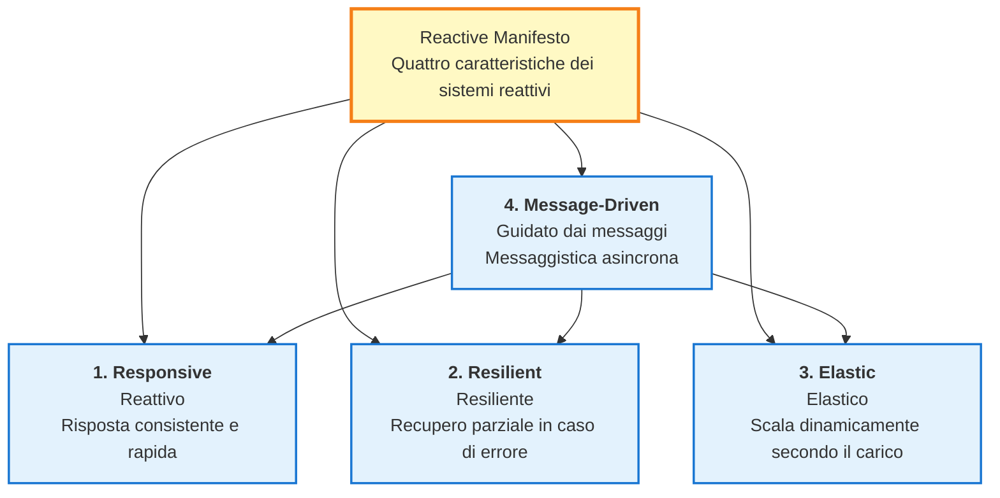
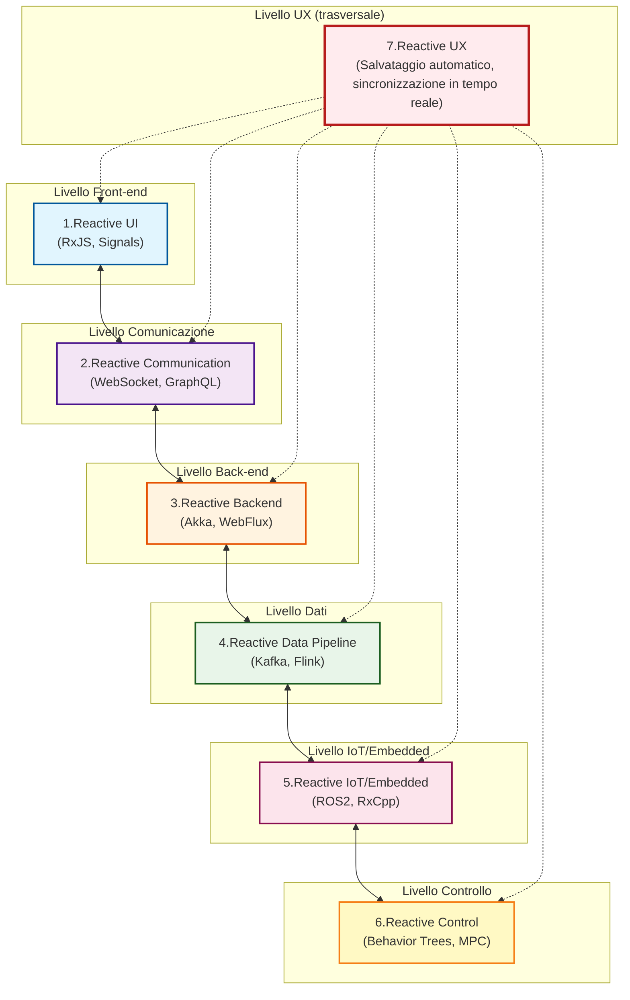
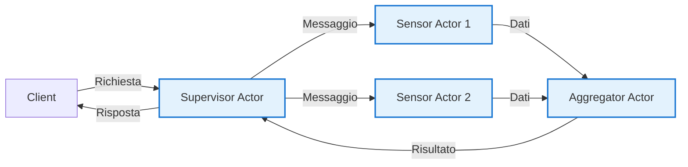
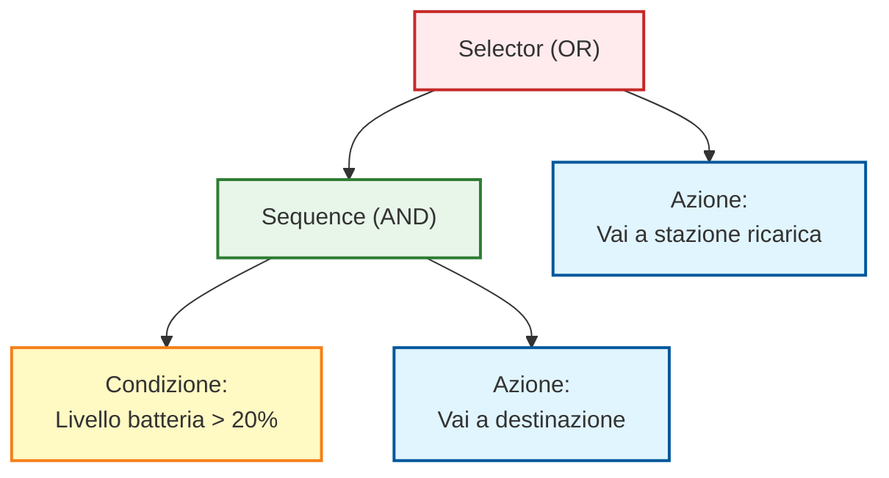
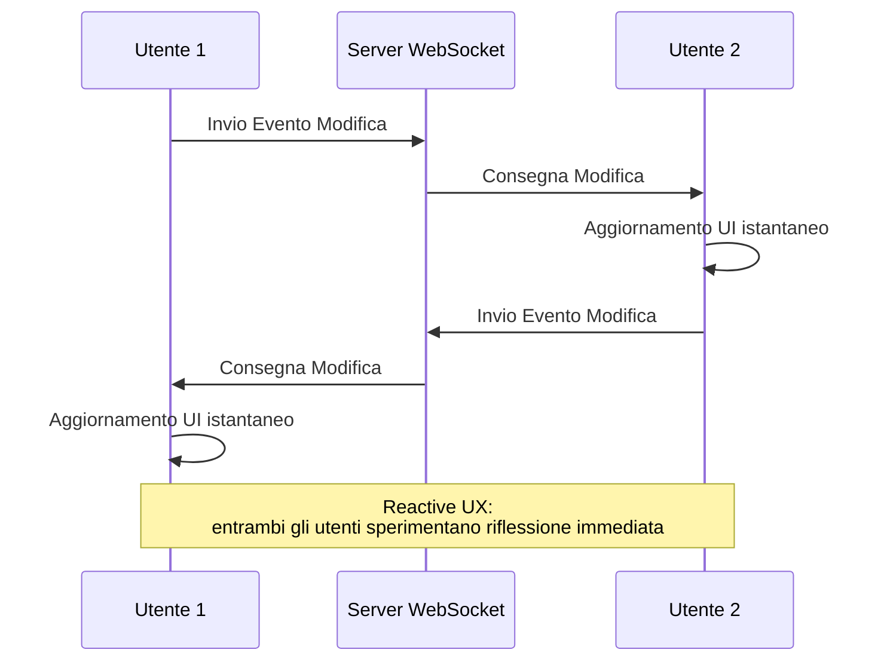

# Mappa Generale dell'Architettura Reattiva

La programmazione reattiva si è evoluta oltre le semplici librerie e framework fino a diventare una **filosofia di architettura di sistema completa**.

Questa pagina spiega sistematicamente il **quadro completo dell'architettura reattiva** in 7 livelli, dall'UI al backend, data pipeline, IoT e sistema di controllo.

## Cos'è l'Architettura Reattiva?

L'architettura reattiva è un approccio alla progettazione di sistemi che si concentra sui **Valori che Cambiano nel Tempo**.

#### Idee Fondamentali
> Tutto, dai click dell'UI ai sensori IoT, flussi di dati e controlli robot, **reagisce a valori che cambiano nel tempo**.

Per realizzare questa ideologia, il [Reactive Manifesto](https://www.reactivemanifesto.org/) definisce quattro caratteristiche chiave.

## Quattro caratteristiche del Reactive Manifesto

Il Reactive Manifesto definisce quattro caratteristiche che un sistema reattivo dovrebbe avere.



### 1. Responsive (Reattivo)

Il sistema risponde **in modo consistente e rapido** agli input dell'utente e ai cambiamenti ambientali.

::: tip Esempi specifici
- Feedback immediato alle azioni UI
- Prevedibilità del tempo di risposta API
- Aggiornamenti dati in tempo reale
:::

### 2. Resilient (Resiliente)

In caso di errore, avviene un **recupero parziale** e l'intero sistema non si arresta.

::: tip Esempi Specifici
- Gestione errori e fallback
- Isolamento dei servizi (microservizi)
- Retry automatici e circuit breaker
:::

### 3. Elastic (Elastico)

Scala in modo efficiente **regolando dinamicamente le risorse** in base al carico.

::: tip Esempi specifici
- Auto-scaling
- Bilanciamento del carico
- Controllo della back pressure
:::

### 4. Message-Driven (Guidato dai Messaggi)

I componenti comunicano tramite **messaggi asincroni** per ottenere un accoppiamento lasco.

::: tip Esempi specifici
- Event bus
- Code di messaggi (Kafka, RabbitMQ)
- Pattern Observable/Subscriber
:::

::: info Importanza del Reactive Manifesto
Queste quattro caratteristiche sono il **fondamento teorico** dell'architettura reattiva; RxJS e ReactiveX sono solo uno degli strumenti per realizzare queste caratteristiche.
:::

## Sette livelli dell'architettura reattiva

L'architettura reattiva è composta dai seguenti sette livelli.

| # | Livelli | Panoramica | Tecnologie Tipiche |
|---|---|------|------------|
| 1 | **Reactive UI** | UI che risponde istantaneamente all'input utente | RxJS, Angular Signals, Svelte Runes, React Hooks |
| 2 | **Reactive Communication** | Comunicazione Stream Client/Server | WebSocket, SSE, GraphQL Subscriptions |
| 3 | **Reactive Backend** | Server event-driven, non-blocking | Akka, Spring WebFlux, Vert.x, Node.js Streams |
| 4 | **Reactive Data Pipeline** | Modello dati di prima classe per stream di eventi | Kafka, Flink, Apache Beam, Reactor |
| 5 | **Reactive IoT/Embedded** | Integrazione e fusione stream sensori | ROS2, RxCpp, RxRust, Zephyr |
| 6 | **Reactive Control** | Loop di feedback da sensore a controllo | Behavior Trees, Digital Twin, MPC |
| 7 | **Reactive UX** | UX a ciclo chiuso su tutti i livelli | Auto-save, co-editing in tempo reale |

### Architettura Generale



## 1. Reactive UI (front end)

Questo è il livello che **aggiorna gli schermi in tempo reale** in risposta all'input utente e alle operazioni asincrone.

### Concetti Fondamentali

> L'UI è una "proiezione di uno stato che cambia nel tempo"

### Stack Tecnologico Tipico

- **RxJS** - Elaborazione stream Observable/Operator
- **Angular Signals** - Primitive reattive Angular 19+
- **Svelte Runes** - $state, $derived in Svelte 5
- **React Hooks** - Gestione stato con useState, useEffect
- **Vue Reactivity** - Reattività con ref, reactive, computed
- **SolidJS** - Reattività fine su infrastruttura Signal

### Esempio di Implementazione (RxJS)

```typescript
import { fromEvent } from 'rxjs';
import { debounceTime, distinctUntilChanged, map } from 'rxjs';

// UI reattiva per casella di ricerca
const searchInput = document.querySelector<HTMLInputElement>('#search');
const resultsDiv = document.querySelector<HTMLDivElement>('#results');

const input$ = fromEvent(searchInput!, 'input').pipe(
  map(event => (event.target as HTMLInputElement).value),
  debounceTime(300),                    // Attendi 300ms (attendi completamento digitazione)
  distinctUntilChanged()                // Ignora se stesso valore del precedente
);

input$.subscribe(async searchTerm => {
  if (searchTerm.length === 0) {
    resultsDiv!.innerHTML = '';
    return;
  }

  // Chiamata API
  const results = await fetch(`/api/search?q=${encodeURIComponent(searchTerm)}`)
    .then(res => res.json());

  // Aggiorna UI immediatamente
  resultsDiv!.innerHTML = results
    .map((r: any) => `<div class="result">${r.title}</div>`)
    .join('');
});
```

::: tip Vantaggi della Reactive UI
- Riduce chiamate API non necessarie con debounce/throttle
- Migliore leggibilità attraverso descrizione dichiarativa
- Facile integrazione di processi asincroni multipli
:::

## 2. Reactive Communication (livello comunicazione)

Questo livello abilita lo **streaming bidirezionale di dati** tra client/server.

### Stack tecnologico tipico

- **WebSocket** - Protocollo di comunicazione full-duplex
- **Server-Sent Events (SSE)** - Stream unidirezionale da server a client
- **GraphQL Subscriptions** - Sottoscrizioni GraphQL in tempo reale
- **tRPC** - Framework RPC type-safe
- **RxDB** - Database reattivo (supporto offline)

### Esempio di Implementazione (WebSocket + RxJS)

```typescript
import { webSocket } from 'rxjs/webSocket';
import { retry, catchError } from 'rxjs';
import { of } from 'rxjs';

// Tratta WebSocket come Observable
const socket$ = webSocket<{ type: string; data: any }>({
  url: 'wss://example.com/socket',
  openObserver: {
    next: () => console.log('✅ Connessione WebSocket riuscita')
  },
  closeObserver: {
    next: () => console.log('❌ WebSocket disconnesso')
  }
});

// Ricevi dati in tempo reale
socket$
  .pipe(
    retry({ count: 3, delay: 1000 }),  // Riconnessione automatica
    catchError(error => {
      console.error('Errore WebSocket:', error);
      return of({ type: 'error', data: error });
    })
  )
  .subscribe(message => {
    switch (message.type) {
      case 'stock_price':
        updateStockChart(message.data);
        break;
      case 'notification':
        showNotification(message.data);
        break;
      // ... altri tipi di messaggio
    }
  });

// Invia messaggio al server
socket$.next({ type: 'subscribe', data: { symbol: 'AAPL' } });
```

::: info Affinità tra WebSocket e Observable
L'evento `onmessage` di WebSocket è il pattern Observable stesso; la funzione webSocket di RxJS lo astrae e rende più facili i retry e la gestione errori.
:::

## 3. Reactive Backend

Questo livello abilita un'architettura server scalabile con **event-driven e I/O non-blocking**.

### Stack Tecnologico Tipico

- **Akka (Scala/Java)** - Framework basato su modello Actor
- **Vert.x (JVM)** - Toolkit reattivo con supporto poliglotta
- **Spring WebFlux (Java)** - Framework web non-blocking basato su Project Reactor
- **Node.js Streams** - Elaborazione I/O basata su stream
- **Elixir/Phoenix LiveView** - Framework real-time su BEAM VM

### Concetto del Modello Actor

Il modello Actor è un modello di concorrenza che combina **isolamento** e **passaggio messaggi asincrono**.



### Esempio di Implementazione (Akka - Scala)

```scala
import akka.actor.{Actor, ActorRef, Props}

// Sensor Actor
class SensorActor extends Actor {
  def receive: Receive = {
    case SensorData(value) =>
      // Elabora dati
      val processed = transform(value)
      // Invia all'Actor padre
      context.parent ! ProcessedData(processed)

    case ErrorOccurred(error) =>
      // Gestione errori
      context.parent ! FailureReport(error)
  }

  private def transform(value: Double): Double = {
    // Logica conversione dati
    value * 2.0
  }
}

// Supervisor Actor
class SupervisorActor extends Actor {
  val sensor1: ActorRef = context.actorOf(Props[SensorActor], "sensor1")
  val sensor2: ActorRef = context.actorOf(Props[SensorActor], "sensor2")

  def receive: Receive = {
    case StartMonitoring =>
      sensor1 ! SensorData(10.5)
      sensor2 ! SensorData(20.3)

    case ProcessedData(value) =>
      println(s"Dati ricevuti: $value")
      // Elaborazione aggregata, ecc.
  }
}

// Definizione messaggi
case class SensorData(value: Double)
case class ProcessedData(value: Double)
case object StartMonitoring
case class ErrorOccurred(error: Throwable)
case class FailureReport(error: Throwable)
```

::: tip Vantaggi del Modello Actor
- **Isolamento dei guasti** - se un Actor fallisce, gli altri non sono influenzati
- **Scalabilità** - gli Actor sono leggeri e possono essere lanciati a milioni
- **Guidato dai messaggi** - aderisce ai principi del Reactive Manifesto
:::

## 4. Reactive Data Pipeline

Questo livello tratta gli **stream di eventi come modello dati di prima classe**.

### Idee Fondamentali

> "Event Stream is the new Database"

È un cambio di paradigma dall'architettura tradizionale centrata sul database a un'**architettura centrata sullo stream di eventi**.

### Stack Tecnologici Tipici

- **Apache Kafka** - Piattaforma di event streaming distribuito
- **Apache Flink** - Motore di elaborazione stream
- **Apache Beam** - Modello unificato di elaborazione batch/stream
- **Apache NiFi** - Automazione flusso dati
- **Project Reactor** - Libreria reattiva sulla JVM
- **Reactive Streams API** - Standard JVM per elaborazione stream

### Pattern Data Pipeline

```
Event Source → Parse → Validate → Enrich → Aggregate → Store/Forward
```

### Esempio di Implementazione (Pseudocodice)

```typescript
// Pipeline stream stile Kafka + Flink
stream
  .map(event => parseJSON(event))           // Parsing
  .filter(data => isValid(data))            // Validazione
  .map(data => enrichWithMetadata(data))    // Assegnazione metadati
  .groupBy(data => data.sensorId)           // Raggruppamento per ID sensore
  .window(10.seconds)                       // Finestra ogni 10 secondi
  .reduce((acc, value) => aggregate(acc, value))  // Aggregazione
  .sink(database)                           // Salva su database
```

### Espressioni corrispondenti in RxJS

```typescript
import { interval } from 'rxjs';
import { map, filter, groupBy, bufferTime, mergeMap } from 'rxjs';

interface SensorEvent {
  sensorId: string;
  value: number;
  timestamp: number;
}

// Simulazione di stream di eventi
const eventStream$ = interval(100).pipe(
  map((): SensorEvent => ({
    sensorId: `sensor-${Math.floor(Math.random() * 3)}`,
    value: Math.random() * 100,
    timestamp: Date.now()
  }))
);

// Data pipeline
eventStream$
  .pipe(
    // Validazione
    filter(event => event.value >= 0 && event.value <= 100),

    // Raggruppamento per ID sensore
    groupBy(event => event.sensorId),

    // Buffering ogni gruppo ogni 10 secondi
    mergeMap(group$ =>
      group$.pipe(
        bufferTime(10000),
        filter(events => events.length > 0),
        map(events => ({
          sensorId: events[0].sensorId,
          avgValue: events.reduce((sum, e) => sum + e.value, 0) / events.length,
          count: events.length,
          timestamp: Date.now()
        }))
      )
    )
  )
  .subscribe(aggregated => {
    console.log('Dati Aggregati:', aggregated);
    // Salva su database
    saveToDatabase(aggregated);
  });

function saveToDatabase(data: any): void {
  // Logica salvataggio database
}
```

::: warning Relazione con Event Sourcing
Event Sourcing è un pattern di design che registra lo stato del sistema come storia di eventi; quando combinato con una piattaforma di event streaming come Kafka, si può costruire una potente data pipeline reattiva.
:::

## 5. Reactive IoT/Embedded

Questo livello abilita l'integrazione e la fusione in tempo reale degli stream dei sensori.

### Stack Tecnologici Tipici

- **ROS2 (Robot Operating System 2)** - Piattaforma sviluppo robot
- **RxCpp** - Versione C++ di ReactiveX
- **RxRust** - Versione Rust di ReactiveX
- **Zephyr RTOS** - OS real-time per IoT
- **TinyOS** - OS per reti di sensori

### Differenze dall'UI

| Prospettive | Reactive UI | Reactive IoT |
|------|------------|--------------|
| **Oggetto della reattività** | Input utente, risposta API | Valori sensori, segnali controllo |
| **Tempo Reale** | Millisecondi (orientato UX) | Microsecondi (orientato controllo) |
| **Elaborazione principale** | Visualizzazione, validazione | Filtraggio, fusione, controllo |

### Esempio di Implementazione (ROS2 - Python)

```python
import rclpy
from rclpy.node import Node
from sensor_msgs.msg import LaserScan
from geometry_msgs.msg import Twist

class ObstacleAvoidance(Node):
    def __init__(self):
        super().__init__('obstacle_avoidance')

        # Sottoscrivi ai dati del sensore LiDAR
        self.subscription = self.create_subscription(
            LaserScan,
            '/scan',
            self.laser_callback,
            10
        )

        # Pubblica comandi velocità
        self.velocity_publisher = self.create_publisher(
            Twist,
            '/cmd_vel',
            10
        )

    def laser_callback(self, msg: LaserScan):
        # Elabora dati sensore (reattivo)
        min_distance = min(msg.ranges)

        # Reattivo al rilevamento ostacolo
        if min_distance < 0.5:  # Ostacolo entro 50 cm
            self.get_logger().warn(f'⚠️ Rilevamento ostacolo: {min_distance:.2f}m')
            self.stop_robot()
        else:
            self.move_forward()

    def stop_robot(self):
        twist = Twist()
        twist.linear.x = 0.0
        twist.angular.z = 0.0
        self.velocity_publisher.publish(twist)

    def move_forward(self):
        twist = Twist()
        twist.linear.x = 0.3  # 0.3 m/s in avanti
        twist.angular.z = 0.0
        self.velocity_publisher.publish(twist)

def main(args=None):
    rclpy.init(args=args)
    node = ObstacleAvoidance()
    rclpy.spin(node)
    rclpy.shutdown()

if __name__ == '__main__':
    main()
```

::: info Sensor Fusion e Reattività
La "sensor fusion", che integra dati da sensori multipli (LiDAR, camera, IMU, GPS), è lo stesso concetto di `combineLatest` e `merge` in RxJS.
:::

## 6. Reactive Control

Questo livello realizza un loop di feedback dal sensore al controllo.

### Stack Tecnologici Tipici

- **Behavior Trees** - Selezione comportamento per robot e AI di giochi
- **Digital Twin** - Repliche digitali di sistemi fisici
- **Model Predictive Control (MPC)** - Controllo predittivo
- **Cyber-Physical Systems (CPS)** - Sistemi cyber-fisici

### Struttura Behavior Tree



**Azione:**
1. Livello batteria superiore al 20% → Vai a destinazione
2. Livello batteria inferiore al 20% → Vai a stazione di ricarica

### Rappresentazione reattiva delle transizioni di stato

Le transizioni di stato nel Behavior Tree possono essere rappresentate da `scan` e `switchMap` in RxJS.

```typescript
import { interval, Subject } from 'rxjs';
import { map, scan, switchMap } from 'rxjs';

type BatteryLevel = number; // 0-100
type RobotState = 'IDLE' | 'MOVING_TO_GOAL' | 'MOVING_TO_CHARGER' | 'CHARGING';

interface RobotStatus {
  state: RobotState;
  batteryLevel: BatteryLevel;
}

// Simulazione livello batteria
const batteryLevel$ = interval(1000).pipe(
  scan((level, _) => Math.max(0, level - 1), 100) // Diminuisce dell'1% al secondo
);

// Logica Behavior Tree
const robotState$ = batteryLevel$.pipe(
  map((batteryLevel): RobotStatus => {
    // Logica Selector (OR)
    if (batteryLevel > 20) {
      // Soddisfa condizioni Sequence (AND)
      return { state: 'MOVING_TO_GOAL', batteryLevel };
    } else {
      // Ricarica necessaria
      return { state: 'MOVING_TO_CHARGER', batteryLevel };
    }
  })
);

robotState$.subscribe(status => {
  console.log(`Stato: ${status.state}, Batteria: ${status.batteryLevel}%`);

  switch (status.state) {
    case 'MOVING_TO_GOAL':
      console.log('→ In movimento verso destinazione');
      break;
    case 'MOVING_TO_CHARGER':
      console.log('⚠️ Batteria scarica! In movimento verso stazione di ricarica');
      break;
  }
});
```

::: tip Sistemi di Controllo e Reattività
Il "loop di feedback" nell'ingegneria del controllo è essenzialmente lo stesso dell'"event-driven" nella programmazione reattiva. Modifica dinamicamente i comandi di controllo in risposta ai cambiamenti nei valori dei sensori.
:::

## 7. Reactive UX (UX a ciclo chiuso)

Questo è il livello più alto di **UX a ciclo chiuso** attraverso tutti i livelli.

### Idee Fondamentali

> La reattività attraverso l'intero sistema crea un'esperienza utente consistente

### Esempi tipici

| Servizi | Caratteristiche Reactive UX |
|---------|-------------------|
| **Google Docs** | Autosave, editing collaborativo in tempo reale |
| **Figma** | Collaborazione multi-utente dal vivo |
| **Firebase** | Sincronizzazione dati in tempo reale |
| **Slack** | Consegna e visualizzazione istantanea messaggi |
| **Notion** | Editing offline e sincronizzazione trasparente |

### Esempio di Implementazione: Funzione Auto Save

```typescript
import { fromEvent, Subject } from 'rxjs';
import { debounceTime, distinctUntilChanged, switchMap, catchError, map } from 'rxjs';
import { of } from 'rxjs';

// Eventi cambio contenuto editor
const editor = document.querySelector<HTMLTextAreaElement>('#editor');
const statusDiv = document.querySelector<HTMLDivElement>('#status');

const editorChange$ = fromEvent(editor!, 'input').pipe(
  map(event => (event.target as HTMLTextAreaElement).value)
);

// Logica Auto Save
const autoSave$ = editorChange$.pipe(
  debounceTime(2000),                    // Attendi 2 secondi che l'input si fermi
  distinctUntilChanged(),                // Se contenuto uguale all'ultimo, non salvare
  switchMap(content => {
    // Indicazione salvataggio in corso
    statusDiv!.textContent = '💾 Salvataggio in corso...';

    // Chiamata API
    return fetch('/api/save', {
      method: 'POST',
      headers: { 'Content-Type': 'application/json' },
      body: JSON.stringify({ content })
    }).then(res => {
      if (!res.ok) throw new Error('Salvataggio Fallito');
      return res.json();
    });
  }),
  catchError(error => {
    statusDiv!.textContent = '❌ Salvataggio fallito';
    return of(null);
  })
);

autoSave$.subscribe(result => {
  if (result) {
    statusDiv!.textContent = '✅ Salvataggio completato';
    setTimeout(() => {
      statusDiv!.textContent = '';
    }, 2000);
  }
});
```

### Come Funziona il Co-Editing in Tempo Reale



::: info Essenza della Reactive UX
La Reactive UX si ottiene quando **tutti i livelli** di UI, comunicazione, backend, data pipeline, IoT e controllo sono consistentemente reattivi. Una vera Reactive UX non può essere ottenuta se solo un livello è reattivo.
:::

## Integrazione tra livelli e ruolo di ReactiveX

Sebbene i sette livelli appaiano indipendenti, sono integrati senza soluzione di continuità con **ReactiveX che agisce come linguaggio comune**.

### Integrazione con ReactiveX

```mermaid
flowchart LR
    ui["Livello UI<br/>(RxJS)"]
    comm["Livello Comunicazione<br/>(WebSocket Observable)"]
    backend["Livello Backend<br/>(Reactor)"]
    data["Livello Dati<br/>(Kafka Streams)"]
    iot["Livello IoT<br/>(RxCpp)"]
    control["Livello Controllo<br/>(Reactive Control)"]

    ui <-->|Observable| comm
    comm <-->|Observable| backend
    backend <-->|Stream| data
    data <-->|Stream| iot
    iot <-->|Observable| control

    classDef layer fill:#e3f2fd,stroke:#1976d2,stroke-width:2px,color:#333

    class ui,comm,backend,data,iot,control layer
```



**Concetti Comuni:**
- **Observable/Stream** - Valori che cambiano nel tempo
- **Operator/Transformation** - Conversione e filtraggio dati
- **Subscribe/Consume** - Consumo eventi
- **Backpressure** - Controllo del carico
- **Error Handling** - Propagazione e gestione errori

::: tip Valore di ReactiveX
ReactiveX permette di trattare **tutto**, dagli eventi click UI ai sensori IoT, stream di dati e controllo robot, con lo stesso concetto (Observable). Questo permette agli ingegneri full-stack di progettare interi sistemi con un modello di pensiero consistente.
:::

## Vantaggi dell'Architettura Reattiva

### 1. Modello concettuale consistente

Puoi usare lo **stesso concetto** in domini diversi (UI, backend, dati, IoT).

**Convenzionale:**
- UI: Event listener
- Backend: Callback
- Dati: Elaborazione batch
- IoT: Polling

**Tipo reattivo:**
- Tutto: **Observable/Stream**

### 2. Gestione uniforme dell'elaborazione asincrona

Promise, callback, eventi e stream possono essere **unificati** in Observable.

```typescript
import { from, fromEvent, ajax } from 'rxjs';

// Streaming Promise
const promise$ = from(fetch('/api/data'));

// Streaming eventi
const click$ = fromEvent(button, 'click');

// Streaming chiamate Ajax
const api$ = ajax('/api/endpoint');

// Tutti possono essere gestiti allo stesso modo.
promise$.subscribe(/*...*/);
click$.subscribe(/*...*/);
api$.subscribe(/*...*/);
```

### 3. Scalabilità e tolleranza ai guasti

Le quattro caratteristiche del Reactive Manifesto permettono di ottenere
- **Responsive** - Tempo di risposta consistente
- **Resilient** - Isolamento e recupero dai guasti
- **Elastic** - Scaling dinamico basato sul carico
- **Message-Driven** - Componenti ad accoppiamento lasco

### 4. Miglioramento delle prestazioni in tempo reale

L'architettura event-driven permette la **propagazione immediata** dei cambiamenti dati.

**Convenzionale (polling):**
```
Client → [Richieste regolari] → Server
```

**Tipo reattivo (push):**
```
Client ← [Notifica immediata dei cambiamenti] ← Server
```

### 5. Miglioramento dell'esperienza sviluppatore

Le dichiarazioni dichiarative rendono **chiaro l'intento del codice**.

```typescript
// ❌ Imperativo: Intenzioni difficili da leggere.
let lastValue = '';
input.addEventListener('input', (e) => {
  const value = e.target.value;
  if (value !== lastValue) {
    setTimeout(() => {
      if (value.length > 0) {
        fetch(`/api/search?q=${value}`)
          .then(/*...*/);
      }
    }, 300);
    lastValue = value;
  }
});

// ✅ Dichiarativo: Intento chiaro a colpo d'occhio
fromEvent(input, 'input')
  .pipe(
    map(e => e.target.value),
    debounceTime(300),
    distinctUntilChanged(),
    filter(value => value.length > 0),
    switchMap(value => ajax(`/api/search?q=${value}`))
  )
  .subscribe(/*...*/);
```

## Riepilogo

L'architettura reattiva è una filosofia di design a livello di sistema che si concentra sui **valori che cambiano nel tempo**.

### Ruolo dei sette livelli

| Livello | Ruolo | Uso di ReactiveX |
|----|------|----------------|
| **1. Reactive UI** | Risposta immediata all'input utente | RxJS, Signals |
| **2. Reactive Communication** | Streaming Client/Server | WebSocket Observable |
| **3. Reactive Backend** | Server event driven | Akka, Reactor |
| **4. Reactive Data Pipeline** | Elaborazione stream eventi | Kafka, Flink |
| **5. Reactive IoT/Embedded** | Integrazione stream sensori | RxCpp, ROS2 |
| **6. Reactive Control** | Controllo loop feedback | Behavior Trees |
| **7. Reactive UX** | Esperienza consistente su tutti i livelli | Integrazione di tutto quanto sopra |

### Importanza del Reactive Manifesto

::: info Quattro caratteristiche

1. **Responsive** - Risposta consistente e rapida
2. **Resilient** - Recupero parziale in caso di errore
3. **Elastic** - Scala dinamicamente con il carico
4. **Message-Driven** - Messaggistica asincrona

:::

### La Natura di ReactiveX

ReactiveX è un linguaggio comune che può gestire questi livelli **in modo trasversale**.

> Dai click UI, ai sensori IoT, ai flussi di dati, ai controlli robot, tutto **reagisce a valori che cambiano nel tempo**.

Questo concetto unificato permette all'ingegnere full-stack di progettare l'intero sistema con un modello di pensiero consistente.

### Prossimi Passi

Per una migliore comprensione dell'architettura reattiva

1. **Inizia in piccolo** - Pratica prima da un livello (Reactive UI)
2. **Espansione graduale** - Espandi ai livelli comunicazione e backend
3. **Impara dai servizi reali** - Osserva il comportamento di Google Docs, Figma, ecc.
4. **Leggi il Reactive Manifesto** - Comprensione delle fondamenta teoriche

## Pagine Correlate

- [Sviluppo Embedded e Programmazione Reattiva](/it/guide/appendix/embedded-reactive-programming) - Dettagli Livello IoT/Embedded
- [Metodi reattivi diversi da ReactiveX](/it/guide/appendix/reactive-patterns-beyond-rxjs) - Metodi di implementazione specifici per ogni livello
- [Introduzione a RxJS](/it/guide/introduction) - Concetti Base di RxJS
- [Cos'è Observable?](/it/guide/observables/what-is-observable) - Fondamenti Observable
- [Operatori di Combinazione](/it/guide/operators/combination/) - Integrazione stream multipli

## Riferimenti

- [GitHub Discussions - Reactive Architecture Overall Map](https://github.com/shuji-bonji/RxJS-with-TypeScript/discussions/15)
- [Reactive Manifesto](https://www.reactivemanifesto.org/) - Definizione dei Sistemi Reattivi
- [Documentazione Ufficiale RxJS](https://rxjs.dev/)
- [Documentazione Ufficiale Akka](https://doc.akka.io/)
- [Documentazione Ufficiale Apache Kafka](https://kafka.apache.org/documentation/)
- [Documentazione Ufficiale ROS2](https://docs.ros.org/)
