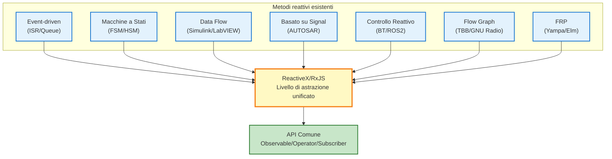

# Metodi reattivi diversi da ReactiveX (prospettiva embedded)

L'idea della programmazione reattiva è stata ampiamente praticata nel campo dei sistemi embedded e dell'ingegneria del controllo anche prima dell'avvento di ReactiveX (RxJS).

Questa pagina organizza sistematicamente i **metodi** che realizzano i principi della programmazione reattiva senza ReactiveX e chiarisce la loro rilevanza per RxJS.

## L'Essenza della Programmazione Reattiva

Al centro della programmazione reattiva ci sono tre principi:

1. **Data Flow** - I dati sono trattati come uno stream che cambia nel tempo
2. **Event-Driven** - L'elaborazione viene eseguita automaticamente quando si verifica un evento
3. **Dichiarativo** - Descrive "cosa fare"; "quando e come" è astratto

Questi principi sono realizzati anche in molti altri metodi oltre a ReactiveX.

::: info Essenza di ReactiveX
ReactiveX non ha **inventato** la reattività, ma piuttosto ha **standardizzato** le pratiche esistenti in un livello di astrazione unificato.
:::

## Metodi reattivi diversi da ReactiveX

Vengono presentati sette metodi reattivi tipici utilizzati nei sistemi embedded e nell'ingegneria del controllo.

| # | Tecnica | Riepilogo | Tool/Framework tipici |
|---|------|------|--------------------------|
| 1 | **Architettura event-driven** | Elaborazione asincrona di eventi con ISR/code | RTOS (FreeRTOS, Zephyr) |
| 2 | **Macchina a stati (FSM/HSM)** | Transizione di stato in base agli eventi | QPC, SCXML, Yakindu |
| 3 | **Programmazione dataflow** | Guida i nodi lungo il flusso dati | Simulink, LabVIEW, SCADE |
| 4 | **Controllo basato su Signal** | Propaga aggiornamenti valori in tutto il sistema | AUTOSAR COM Stack, Simulink |
| 5 | **Sistema di controllo reattivo** | Scelte comportamentali in risposta a cambiamenti ambientali | Behavior Tree, ROS2 |
| 6 | **Libreria Flow Graph** | Parallelizza esplicitamente le dipendenze dati | Intel TBB, GNU Radio, StreamIt |
| 7 | **Programmazione reattiva funzionale** | Tratta i valori variabili nel tempo come funzione | Haskell Yampa, Elm, Dunai |

## 1. Architettura Event-Driven

L'interrupt service routine (ISR) cattura gli eventi e notifica il task tramite una coda di messaggi.

### Esempio di implementazione in C

```c
// Coda eventi (globale)
typedef struct {
    EventType type;
    void* data;
} Event;

Event eventQueue[EVENT_QUEUE_SIZE];
int queueHead = 0;
int queueTail = 0;

// Interrupt Service Routine (ISR)
void ISR_SensorUpdate() {
    // Legge dati dai sensori
    SensorData* data = readSensor();

    // Push sulla coda eventi
    Event e = { EVENT_SENSOR_NEW_DATA, data };
    EventQueue_push(e);
}

// Task principale
void Task_MainLoop() {
    Event e;
    while (1) {
        if (EventQueue_pop(&e)) {
            switch (e.type) {
                case EVENT_SENSOR_NEW_DATA:
                    processSensorData((SensorData*)e.data);
                    break;
                case EVENT_TIMER_EXPIRED:
                    handleTimeout();
                    break;
                // ... Altra elaborazione eventi
            }
        }
    }
}
```

### Corrispondenza con RxJS

| Modello event driven | RxJS |
|-----------------|------|
| `EventQueue` | `Observable` |
| `Task_MainLoop` | `subscribe()` |
| `ISR_SensorUpdate` | `next()` |
| Tipo evento | Tipo valore stream |

::: tip Caratteristiche event-driven
- Ampiamente usato negli RTOS (Real-Time Operating System)
- Chiara separazione tra interrupt e elaborazione task
- Elaborazione asincrona con accodamento
:::

## 2. Macchina a Stati (State Machine / FSM / HSM)

Una Finite State Machine (FSM) o Hierarchical State Machine (HSM) è un pattern che transiziona gli stati in base all'input degli eventi.

### Esempio macchina a stati (linguaggio C)

```c
typedef enum {
    STATE_IDLE,
    STATE_RUNNING,
    STATE_ERROR,
    STATE_SHUTDOWN
} State;

typedef enum {
    EVENT_START,
    EVENT_STOP,
    EVENT_ERROR_DETECTED,
    EVENT_RESET
} Event;

State currentState = STATE_IDLE;

void stateMachine(Event event) {
    switch (currentState) {
        case STATE_IDLE:
            if (event == EVENT_START) {
                currentState = STATE_RUNNING;
                startOperation();
            }
            break;

        case STATE_RUNNING:
            if (event == EVENT_STOP) {
                currentState = STATE_IDLE;
                stopOperation();
            } else if (event == EVENT_ERROR_DETECTED) {
                currentState = STATE_ERROR;
                handleError();
            }
            break;

        case STATE_ERROR:
            if (event == EVENT_RESET) {
                currentState = STATE_IDLE;
                resetSystem();
            }
            break;

        // ... Altre condizioni
    }
}
```

### Tool tipici
- **QPC (Quantum Platform)** - Framework per macchine a stati gerarchiche
- **SCXML (State Chart XML)** - Linguaggio descrizione macchina a stati standard W3C
- **Yakindu Statechart Tools** - Tool di modellazione State Chart

### Espressioni corrispondenti in RxJS

```typescript
import { Subject, scan } from 'rxjs';

type State = 'IDLE' | 'RUNNING' | 'ERROR' | 'SHUTDOWN';
type Event = 'START' | 'STOP' | 'ERROR_DETECTED' | 'RESET';

const events$ = new Subject<Event>();

const state$ = events$.pipe(
  scan((state: State, event: Event): State => {
    switch (state) {
      case 'IDLE':
        return event === 'START' ? 'RUNNING' : state;
      case 'RUNNING':
        if (event === 'STOP') return 'IDLE';
        if (event === 'ERROR_DETECTED') return 'ERROR';
        return state;
      case 'ERROR':
        return event === 'RESET' ? 'IDLE' : state;
      default:
        return state;
    }
  }, 'IDLE' as State)
);

state$.subscribe(state => console.log('Stato corrente:', state));

// Emissione eventi
events$.next('START');   // → RUNNING
events$.next('STOP');    // → IDLE
```

::: info Vantaggi delle Macchine a Stati Gerarchiche (HSM)
Le HSM possono raggruppare stati multipli e hanno una struttura simile a `share` e `shareReplay` in RxJS che "riunisce sottoscrizioni multiple".
:::

## 3. Programmazione Dataflow

Una tecnica di programmazione visuale che guida i nodi secondo il flusso dei dati.

### Tool tipici
- **MATLAB Simulink** - Design e simulazione sistemi di controllo
- **LabVIEW (National Instruments)** - Sviluppo sistemi di misurazione e controllo
- **SCADE (Esterel Technologies)** - Sistemi safety-critical (aerospaziale e ferroviario)

### Immagine dataflow Simulink

```
[Sensore] → [Filtro Passa-basso] → [Soglia] → [Condizione] → [Attuatore]
   ↓              ↓                 ↓              ↓             ↓
Valore grezzo  Valore smussato  Valore decisione True/False   Output
```

### Espressioni corrispondenti in RxJS

```typescript
import { interval } from 'rxjs';
import { map, filter, tap } from 'rxjs';

// Stream sensori
const sensor$ = interval(100).pipe(
  map(() => Math.random() * 100) // Simulazione valori sensore
);

// Pipeline dataflow
sensor$
  .pipe(
    map(value => lowPassFilter(value)),        // Filtro passa-basso
    map(value => value > 50 ? value : 0),      // Sogliatura
    filter(value => value > 0),                // Determinazione condizione
    tap(value => actuate(value))               // Azionamento attuatore
  )
  .subscribe();

function lowPassFilter(value: number): number {
  // Filtro passa-basso semplice (media mobile)
  return value * 0.3 + previousValue * 0.7;
}

function actuate(value: number): void {
  console.log('Output attuatore:', value);
}
```

::: tip Caratteristiche della Programmazione Dataflow
- Il flusso dati visuale può essere afferrato visivamente
- Ampiamente adottata nell'ingegneria del controllo e nell'elaborazione segnali
- Struttura molto simile alla pipeline RxJS (`.pipe()`)
:::

## 4. Controllo Basato su Signal

Un pattern in cui gli aggiornamenti dei valori vengono propagati in tutto il sistema. Esempi tipici sono AUTOSAR COM Stack e Simulink, standardizzati nell'industria automobilistica.

### Immagini dell'AUTOSAR COM Stack

```c
// Definizione Signal
typedef struct {
    uint16_t speed;        // Velocità [km/h]
    uint8_t temperature;   // Temperatura [°C]
    bool doorOpen;         // Stato porta aperta/chiusa
} VehicleSignals;

VehicleSignals currentSignals;

// Aggiornamento Signal
void updateSpeed(uint16_t newSpeed) {
    currentSignals.speed = newSpeed;
    // COM Stack notifica i subscriber
    Com_SendSignal(SIGNAL_ID_SPEED, &currentSignals.speed);
}

// Sottoscrizione Signal
void speedMonitor() {
    uint16_t speed;
    Com_ReceiveSignal(SIGNAL_ID_SPEED, &speed);

    if (speed > 120) {
        triggerSpeedWarning();
    }
}
```

### Supporto in RxJS (BehaviorSubject)

```typescript
import { BehaviorSubject } from 'rxjs';

interface VehicleSignals {
  speed: number;
  temperature: number;
  doorOpen: boolean;
}

// BehaviorSubject - Mantiene valore corrente
const vehicleSignals$ = new BehaviorSubject<VehicleSignals>({
  speed: 0,
  temperature: 20,
  doorOpen: false
});

// Aggiornamento Signal
function updateSpeed(newSpeed: number) {
  const current = vehicleSignals$.value;
  vehicleSignals$.next({ ...current, speed: newSpeed });
}

// Sottoscrizione Signal
vehicleSignals$.subscribe(signals => {
  if (signals.speed > 120) {
    console.log('⚠️ Avviso Eccesso Velocità');
  }
});

updateSpeed(130); // → Warning attivato
```

::: info Caratteristiche del Controllo Basato su Signal
- **Il valore corrente è sempre mantenuto** - Stesse caratteristiche di BehaviorSubject
- Ampiamente usato in AUTOSAR (standard industria automobilistica)
- Usato per comunicazione tra ECU (Electronic Control Units)
:::

## 5. Sistemi di Controllo Reattivi

Un metodo per implementare la selezione di azioni in risposta ai cambiamenti ambientali per robotica e guida autonoma.

### Framework tipici
- **Behavior Tree (BT)** - AI per giochi, Controllo Robot
- **ROS2 (Robot Operating System 2)** - Piattaforma sviluppo robot

### Struttura Behavior Tree

```
Selector (OR)
├─ Sequence (AND)
│  ├─ Condizione: Livello batteria > 20%
│  └─ Azione: Vai a destinazione
└─ Azione: Vai a stazione di ricarica
```

### Pattern Reattivi in ROS2 (Python)

```python
import rclpy
from rclpy.node import Node
from sensor_msgs.msg import LaserScan

class ObstacleDetector(Node):
    def __init__(self):
        super().__init__('obstacle_detector')
        # Sottoscrivi ai dati del sensore LiDAR
        self.subscription = self.create_subscription(
            LaserScan,
            '/scan',
            self.laser_callback,
            10
        )

    def laser_callback(self, msg):
        # Ottieni distanza minima
        min_distance = min(msg.ranges)

        # Reazione al rilevamento ostacolo
        if min_distance < 0.5:  # Entro 50 cm
            self.get_logger().warn('Ostacolo rilevato! Stop')
            self.stop_robot()
```

### Espressioni corrispondenti in RxJS

```typescript
import { fromEvent } from 'rxjs';
import { map, filter } from 'rxjs';

// Stream dati sensore LiDAR
const lidarData$ = fromEvent<LaserScan>(lidarSensor, 'scan');

lidarData$
  .pipe(
    map(scan => Math.min(...scan.ranges)),  // Ottieni distanza minima
    filter(minDistance => minDistance < 0.5) // Entro 50 cm
  )
  .subscribe(() => {
    console.warn('⚠️ Rilevamento ostacolo! Stop.');
    stopRobot();
  });
```

::: tip Applicazioni del Controllo Reattivo
- Evitamento ostacoli per auto a guida autonoma
- Volo autonomo droni
- Controllo sicurezza robot industriali
:::

## 6. Librerie Flow Graph

Librerie che gestiscono esplicitamente le dipendenze dati in ambiente multi-threaded.

### Librerie Tipiche
- **Intel TBB (Threading Building Blocks) Flow Graph**
- **GNU Radio** - Software Defined Radio (SDR)
- **StreamIt (MIT)** - Linguaggio elaborazione stream

### Esempio Intel TBB Flow Graph (C++)

```cpp
#include <tbb/flow_graph.h>
#include <iostream>

int main() {
    tbb::flow::graph g;

    // Broadcast Node (ruolo Observable)
    tbb::flow::broadcast_node<int> source(g);

    // Conversion Node (ruolo simile a map)
    tbb::flow::function_node<int, int> multiply(
        g,
        tbb::flow::unlimited,
        [](int x) { return x * 2; }
    );

    tbb::flow::function_node<int, int> add(
        g,
        tbb::flow::unlimited,
        [](int x) { return x + 10; }
    );

    // Output Node (ruolo simile a subscribe)
    tbb::flow::function_node<int> output(
        g,
        tbb::flow::unlimited,
        [](int x) { std::cout << "Risultato: " << x << std::endl; }
    );

    // Connessione edge
    tbb::flow::make_edge(source, multiply);
    tbb::flow::make_edge(multiply, add);
    tbb::flow::make_edge(add, output);

    // Iniezione dati
    source.try_put(5);  // → Risultato: 20 (5 * 2 + 10)
    g.wait_for_all();

    return 0;
}
```

### Espressioni corrispondenti in RxJS

```typescript
import { of } from 'rxjs';
import { map } from 'rxjs';

of(5)
  .pipe(
    map(x => x * 2),      // multiply
    map(x => x + 10)      // add
  )
  .subscribe(result => {
    console.log('Risultato:', result); // → Risultato: 20
  });
```

::: info Caratteristiche Flow Graph
- **Ottimizzazione dell'esecuzione parallela** - Gestisce esplicitamente le dipendenze dati
- Utilizza efficientemente i multi-core CPU
- Ampiamente usato in elaborazione segnali, elaborazione immagini e sistemi di comunicazione
:::

## 7. Programmazione Reattiva Funzionale (FRP)

La Programmazione Reattiva Funzionale (FRP) è il fondamento teorico della programmazione reattiva.

### Linguaggi e Librerie Rappresentativi
- **Haskell Yampa** - Sviluppo giochi, robotica
- **Elm** - Frontend web (framework type-safe simile a React)
- **Dunai** - Librerie FRP generiche

### Esempio Haskell Yampa

```haskell
import FRP.Yampa

-- Definizione di una Signal Function
-- Conversione dipendente dal tempo da Input a Output
simpleSF :: SF Double Double
simpleSF = arr (\x -> x * 2)       -- Raddoppia il valore
       >>> integral                -- Integrale (cumulativo nel tempo)
       >>> arr (\x -> x + 10)      -- Aggiungi 10

-- Esempio esecuzione
-- Input: valore che cambia nel tempo (es. valore sensore)
-- Output: stream di valori convertiti
```

### Espressioni corrispondenti in RxJS

```typescript
import { interval } from 'rxjs';
import { map, scan } from 'rxjs';

const simpleSF$ = interval(100).pipe(
  map(x => x * 2),                         // arr (\x -> x * 2)
  scan((acc, value) => acc + value, 0),    // integral (integrale = accumulato)
  map(x => x + 10)                         // arr (\x -> x + 10)
);

simpleSF$.subscribe(result => console.log(result));
```

### Concetti Chiave FRP

| Concetto FRP | Descrizione | Corrispondenza RxJS |
|--------|------|----------|
| **Signal** | Valori che cambiano nel tempo | `Observable` |
| **Event** | Eventi discreti | `Subject` |
| **Signal Function (SF)** | Funzioni di trasformazione signal | `pipe()` + Operator |
| **Behavior** | Valore sempre presente variabile nel tempo | `BehaviorSubject` |

::: info Importanza di FRP
FRP è il **fondamento teorico** di ReactiveX; i concetti sviluppati in linguaggi funzionali puri come Haskell sono portati in RxJS e ReactiveX.
:::

## Posizionamento di ReactiveX

L'essenza di ReactiveX diventa chiara quando consideriamo i sette metodi che abbiamo esaminato finora.

### Il Ruolo di ReactiveX



ReactiveX serve come **linguaggio comune** che può funzionare attraverso questi metodi esistenti.

### Vantaggi di ReactiveX

| Prospettiva | Metodi Convenzionali | ReactiveX/RxJS |
|------|-----------|---------------|
| **Costi di apprendimento** | Concetti e tool diversi per campi diversi | API unificata (Observable/Operator) |
| **Portabilità** | Forte dipendenza dalla piattaforma | Concetti comuni tra linguaggi (RxJava, RxSwift, ecc.) |
| **Componibilità** | Difficile combinare tra metodi | Sintetizzabilità flessibile con operatori |
| **Debugging** | Richiede tool specifici per campo | Tool comuni come RxJS DevTools, tap, ecc. |
| **Testing** | Test complessi dei processi asincroni | TestScheduler, Marble Testing |

::: tip La Natura di ReactiveX
ReactiveX non è un'**invenzione, ma un'integrazione**. È importante conoscere i metodi reattivi esistenti e comprenderli come livelli di astrazione che possono essere gestiti in modo unificato.
:::

## Come usarlo in pratica

Ogni metodo ha un'area di applicazione adatta.

### Confronto delle Aree di Applicazione

| Metodo | Applicazione Ottimale | Costo apprendimento | Portabilità |
|------|----------|-----------|--------|
| **Event driven (ISR/Queue)** | Controllo embedded basato su RTOS | Basso | Basso (dipendente dalla piattaforma) |
| **Macchina a Stati (FSM/HSM)** | Controllo che richiede transizioni di stato complesse | Medio | Medio (può essere astratto da QPC, ecc.) |
| **Data Flow (Simulink)** | Design e simulazione sistemi di controllo | Alto | Basso (dipendente dal tool) |
| **Basato su Signal (AUTOSAR)** | Comunicazione tra ECU automobilistiche | Alto | Basso (standard industriale ma specializzato) |
| **Controllo Reattivo (ROS2)** | Robotica, guida autonoma | Medio | Medio (ecosistema ROS2) |
| **Flow Graph (TBB)** | Elaborazione parallela, elaborazione segnali | Medio | Medio (ambiente C++) |
| **FRP (Haskell)** | Orientato alla type safety, ricerca accademica | Alto | Basso (linguaggio funzionale) |
| **ReactiveX (RxJS)** | Web app, elaborazione edge IoT, uso generale | Medio | **Alto (supporto multi-linguaggio)** |

### Linee Guida per la Selezione

::: warning Controllo hard real-time (in microsecondi)
→ **Event driven (ISR/Queue)** o **RTOS Dedicato**

ReactiveX non è adatto (overhead elevato)
:::

::: tip Controllo soft real-time (in millisecondi)
→ **ReactiveX/RxJS** è ottimale

Integrazione sensori, rilevamento correlazione eventi, rilevamento anomalie, ecc.
:::

::: info Se esiste una tool chain esistente
→ **Preferire gli strumenti standard del campo**

Es.: Industria automobilistica → AUTOSAR, Robotica → ROS2
:::

## Riepilogo

L'idea della programmazione reattiva è stata praticata in molti campi prima dell'avvento di ReactiveX.

### Punti Importanti

1. **ReactiveX è un integratore** - un linguaggio comune che può funzionare attraverso metodi esistenti
2. **Soluzione ottimale per ogni campo** - ogni metodo ha un dominio di applicazione adatto
3. **Comunanza concettuale** - event-driven, dataflow, descrizioni dichiarative sono comuni
4. **Sinergia di apprendimento** - una comprensione profonda di un metodo facilita la comprensione degli altri

### Significato dell'apprendimento di ReactiveX

::: info Cosa ottieni imparando ReactiveX

1. **Comprensione trasversale** - concetti comuni tra embedded, web e mobile
2. **Competenze di portabilità** - supporto multi-linguaggio inclusi RxJava, RxSwift, RxKotlin, ecc.
3. **Metodologie unificate di debugging e testing** - RxJS DevTools, Marble Testing
4. **Comprendere la natura delle metodologie esistenti** - fondamenti teorici come event-driven, macchine a stati, ecc.

:::

Che si tratti di sistemi embedded o applicazioni web, **l'essenza della programmazione reattiva rimane la stessa**, e ReactiveX è uno strumento potente che integra queste intuizioni e fornisce astrazioni moderne.

## Pagine Correlate

- [Sviluppo Embedded e Programmazione Reattiva](/it/guide/appendix/embedded-reactive-programming) - Usare RxJS nei Sistemi Embedded
- [Introduzione a RxJS](/it/guide/introduction) - Concetti Base di RxJS
- [Cos'è Observable](/it/guide/observables/what-is-observable) - Le Basi di Observable
- [Cos'è Subject](/it/guide/subjects/what-is-subject) - Dettagli di BehaviorSubject, ecc.
- [Panoramica degli Operatori](/it/guide/operators/) - Conversione e Filtraggio Dati

## Riferimenti

- [GitHub Discussions - Reactive methods other than ReactiveX (embedded perspective)](https://github.com/shuji-bonji/RxJS-with-TypeScript/discussions/14)
- [QPC (Quantum Platform)](https://www.state-machine.com/qpc/) - Framework Macchine a Stati Gerarchiche
- [Intel TBB Flow Graph](https://www.intel.com/content/www/us/en/docs/onetbb/developer-guide-api-reference/2021-14/flow-graph.html)
- [Documentazione ROS2](https://docs.ros.org/en/rolling/)
- [AUTOSAR Classic Platform](https://www.autosar.org/standards/classic-platform/)
- [Functional Reactive Programming (FRP)](https://wiki.haskell.org/Functional_Reactive_Programming)
