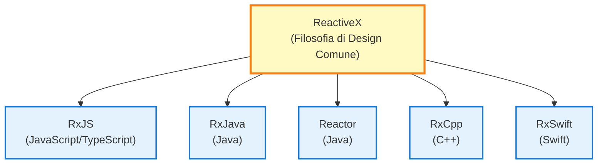
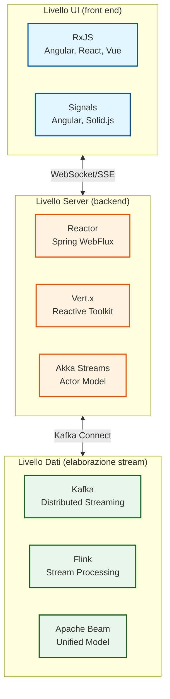
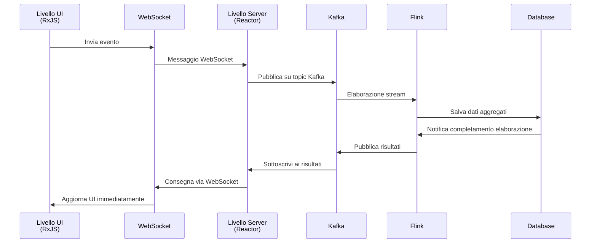

# RxJS e Reactive Streams

Quando si impara RxJS, molti sviluppatori si chiedono: "Come si inserisce RxJS nel quadro generale della Programmazione Reattiva?"

Questa pagina spiega **la differenza tra RxJS e lo standard Reactive Streams**, **l'intero stack tecnologico dal livello UI al livello dati**, e **come le diverse tecnologie lavorano insieme**.

## Posizionamento di RxJS

### Cos'è RxJS?

**RxJS** (Reactive Extensions for JavaScript) è l'implementazione principale della Programmazione Reattiva nell'ambiente **browser e Node.js**.



::: info Caratteristiche di RxJS
- Funziona in browser e Node.js
- La reattività UI è la massima priorità
- Leggero e veloce
- La back pressure è implicita
:::


## RxJS vs standard Reactive Streams

Ci sono due tendenze principali nella Programmazione Reattiva: **RxJS** e lo **standard Reactive Streams**.

### Cos'è lo standard Reactive Streams?

[Reactive Streams](https://www.reactive-streams.org/) è una specifica standard per l'elaborazione stream sulla JVM.

**Implementazioni principali:**
- **Project Reactor** (Spring WebFlux)
- **RxJava 3**
- **Akka Streams**
- **Mutiny** (Quarkus)

**Quattro interfacce standardizzate:**
```java
public interface Publisher<T> {
    void subscribe(Subscriber<? super T> s);
}

public interface Subscriber<T> {
    void onSubscribe(Subscription s);
    void onNext(T t);
    void onError(Throwable t);
    void onComplete();
}

public interface Subscription {
    void request(long n);  // Controllo back pressure
    void cancel();
}

public interface Processor<T, R> extends Subscriber<T>, Publisher<R> {}
```

### Differenza chiave: controllo della back pressure

| Prospettive | RxJS | Standard Reactive Streams |
|------|------|---------------------|
| **Piattaforma** | JavaScript/TypeScript (browser, Node.js) | JVM (Java, Scala, Kotlin) |
| **Backpressure** | Implicita (a livello operatore) | Esplicita (metodo `request(n)`) |
| **Priorità** | Reattività UI | Throughput server |
| **Standardizzazione** | API Comune ReactiveX | Specifica Reactive Streams |

#### Back pressure RxJS (implicita)

```typescript
import { interval } from 'rxjs';
import { bufferTime, take } from 'rxjs';

// La back pressure è controllata dall'operatore
interval(10)  // emette un valore ogni 10 ms
  .pipe(
    bufferTime(1000),  // buffering ogni 1 secondo (controllo implicito)
    take(5)
  )
  .subscribe(batch => console.log('batch:', batch.length));
```

#### Backpressure Reactive Streams (esplicita)

```java
// Project Reactor（Java）
Flux.range(1, 1000)
    .subscribe(new BaseSubscriber<Integer>() {
        @Override
        protected void hookOnSubscribe(Subscription subscription) {
            request(10);  // richiedi i primi 10 (esplicito)
        }

        @Override
        protected void hookOnNext(Integer value) {
            System.out.println("Elaborazione: " + value);
            request(1);  // richiedi il prossimo dopo l'elaborazione (esplicito)
        }
    });
```

> [!IMPORTANT]
> **Differenza nella back pressure**
>
> - **RxJS**: Controllata implicitamente dagli operatori (`bufferTime`, `throttleTime`, `debounceTime`)
> - **Reactive Streams**: controllata esplicitamente dal metodo `request(n)`
>
> Questa differenza riflette la differenza tra i requisiti UI (RxJS) e server (Reactive Streams).

## Stack Tecnologico per Livello

La Programmazione Reattiva forma uno stack tecnologico che attraversa più livelli, dal livello UI al livello dati.

### Architettura Generale



### 1. Livello UI (front end)

**Tecnologie principali: RxJS, Signals**

```typescript
// RxJS (standard livello UI)
import { fromEvent } from 'rxjs';
import { debounceTime, distinctUntilChanged, switchMap } from 'rxjs';

const searchInput$ = fromEvent(input, 'input').pipe(
  map(event => (event.target as HTMLInputElement).value),
  debounceTime(300),
  distinctUntilChanged(),
  switchMap(query => fetch(`/api/search?q=${query}`).then(r => r.json()))
);

searchInput$.subscribe(results => updateUI(results));
```

::: info Caratteristiche:
- Funziona nell'ambiente browser
- La reattività UI è la massima priorità
- Gestione unificata di input utente, eventi DOM e comunicazione HTTP
:::

### 2. Livello Server (backend)

**Tecnologie principali: Project Reactor, Vert.x, Akka Streams**

#### Project Reactor (Spring WebFlux)

```java
// Project Reactor (standard livello server)
@RestController
public class UserController {

    @GetMapping("/users")
    public Flux<User> getUsers() {
        return userRepository.findAll()  // Reactive Repository
            .filter(user -> user.isActive())
            .map(user -> enrichUserData(user))
            .onErrorResume(error -> Flux.empty());
    }

    @GetMapping("/users/{id}")
    public Mono<User> getUser(@PathVariable String id) {
        return userRepository.findById(id)
            .switchIfEmpty(Mono.error(new UserNotFoundException(id)));
    }
}
```


::: info Caratteristiche:
- Conforme allo standard Reactive Streams
- I/O non-blocking
- Alto throughput
- Controllo esplicito della back pressure
:::

#### Akka Streams (Modello Actor)

```scala
// Akka Streams (per sistemi distribuiti)
val source = Source(1 to 100)
val flow = Flow[Int].map(_ * 2)
val sink = Sink.foreach[Int](println)

source.via(flow).to(sink).run()
```


::: info Caratteristiche:
- Basato su modello Actor
- Ideale per sistemi distribuiti
- Isolamento e recupero dai guasti
:::

### 3. Livello Dati (elaborazione stream)

**Tecnologie principali: Kafka, Flink, Apache Beam**

#### Apache Kafka (event streaming)

```java
// Kafka Streams (data pipeline)
StreamsBuilder builder = new StreamsBuilder();

KStream<String, String> source = builder.stream("input-topic");

source
    .filter((key, value) -> value.length() > 10)
    .mapValues(value -> value.toUpperCase())
    .to("output-topic");

KafkaStreams streams = new KafkaStreams(builder.build(), config);
streams.start();
```


::: info Caratteristiche:
- Piattaforma di event streaming distribuita
- Alto throughput, bassa latenza
- Event sourcing, fondamento per pattern CQRS
:::

#### Apache Flink (elaborazione stream)

```java
// Flink (elaborazione stream in tempo reale)
StreamExecutionEnvironment env = StreamExecutionEnvironment.getExecutionEnvironment();

DataStream<Event> events = env.addSource(new KafkaSource<>());

events
    .filter(event -> event.getValue() > threshold)
    .keyBy(Event::getSensorId)
    .timeWindow(Time.seconds(10))
    .reduce((e1, e2) -> new Event(e1.getSensorId(), e1.getValue() + e2.getValue()))
    .addSink(new DatabaseSink());

env.execute("Stream Processing Job");
```


::: info Caratteristiche:
- Motore elaborazione stream in tempo reale
- Garanzia Exactly Once (esattamente una volta)
- Elaborazione event-time e watermarking
:::

## Tecnologia di bridging: coordinamento di livelli diversi

Come coordiniamo tra stack tecnologici diversi?

### 1. Livello UI ⇄ Livello Server: WebSocket / SSE

#### WebSocket (comunicazione bidirezionale)

**Front end (RxJS):**
```typescript
import { webSocket } from 'rxjs/webSocket';

const socket$ = webSocket<Message>('wss://example.com/ws');

// Ricezione
socket$.subscribe(message => console.log('Ricevuto:', message));

// Invio
socket$.next({ type: 'subscribe', channel: 'notifications' });
```

**Backend (Spring WebFlux):**
```java
@Configuration
@EnableWebSocketMessageBroker
public class WebSocketConfig implements WebSocketMessageBrokerConfigurer {

    @Override
    public void configureMessageBroker(MessageBrokerRegistry config) {
        config.enableSimpleBroker("/topic");
        config.setApplicationDestinationPrefixes("/app");
    }

    @Override
    public void registerStompEndpoints(StompEndpointRegistry registry) {
        registry.addEndpoint("/ws").withSockJS();
    }
}

@Controller
public class NotificationController {

    @MessageMapping("/subscribe")
    public Flux<Notification> subscribe(@Payload SubscribeRequest request) {
        return notificationService.getNotificationStream(request.getChannel());
    }
}
```

#### Server-Sent Events (Server → Client)

**Front End (RxJS):**
```typescript
import { Observable } from 'rxjs';

function fromSSE<T>(url: string): Observable<T> {
  return new Observable(subscriber => {
    const eventSource = new EventSource(url);

    eventSource.onmessage = event => {
      subscriber.next(JSON.parse(event.data));
    };

    eventSource.onerror = error => {
      subscriber.error(error);
    };

    return () => eventSource.close();
  });
}

const notifications$ = fromSSE<Notification>('/api/notifications/stream');
notifications$.subscribe(n => console.log('Notifica:', n));
```

**Backend (Spring WebFlux):**
```java
@GetMapping(value = "/notifications/stream", produces = MediaType.TEXT_EVENT_STREAM_VALUE)
public Flux<Notification> streamNotifications() {
    return notificationService.getNotificationStream()
        .delayElements(Duration.ofSeconds(1));
}
```

### 2. Livello Server ⇄ Livello Dati: Kafka Connect

**Livello Server (Reactor) a Kafka:**
```java
// Spring WebFlux + Kafka
@Service
public class EventPublisher {

    private final KafkaTemplate<String, Event> kafkaTemplate;

    public Mono<Void> publishEvent(Event event) {
        return Mono.fromFuture(
            kafkaTemplate.send("events-topic", event.getId(), event)
                .completable()
        ).then();
    }
}
```

**Kafka a livello server (Reactor):**
```java
// Kafka Consumer (Reactive)
@Service
public class EventConsumer {

    @KafkaListener(topics = "events-topic")
    public Mono<Void> consume(Event event) {
        return processEvent(event)
            .then();
    }

    private Mono<Void> processEvent(Event event) {
        return Mono.fromRunnable(() -> {
            System.out.println("Elaborazione evento: " + event);
        });
    }
}
```

### 3. Pipeline reattiva end-to-end



## Linee Guida per la Selezione Tecnologica

Quale tecnologia dovrebbe essere usata a quale livello?

### Selezione del livello UI (front end)

| Requisiti | Tecnologia Consigliata | Motivi |
|------|---------|------|
| Flusso Asincrono Complesso | **RxJS** | Operatori ricchi, API Unificata |
| Reattività semplice | **Angular Signals** / **Solid.js** | Basso costo apprendimento, intuitivo |
| Standard del framework | **React Hooks** / **Vue Composition API** | Integrazione con framework |

```typescript
// Esempio del perché dovresti scegliere RxJS: Flusso asincrono complesso
combineLatest([
  userInput$,
  apiStatus$,
  validation$
]).pipe(
  debounceTime(300),
  distinctUntilChanged(),
  switchMap(([input, status, isValid]) =>
    isValid ? submitData(input) : of(null)
  )
).subscribe(/*...*/);

// Esempio di come Signals dovrebbe essere scelto: Gestione stato semplice
const count = signal(0);
const doubled = computed(() => count() * 2);
```

### Selezione del livello server (backend)

| Requisiti | Tecnologia Consigliata | Motivi |
|------|---------|------|
| API ad Alto Throughput | **Spring WebFlux** (Reactor) | Ecosistema JVM, librerie ricche |
| Micro Servizi | **Vert.x** / **Quarkus** (Mutiny) | Leggero, avvio veloce |
| Sistema Distribuito | **Akka Streams** | Modello Actor, Isolamento Guasti |
| Ambiente Node.js | **RxJS** / **Node.js Streams** | Unificazione JavaScript |

```java
// Spring WebFlux (API ad alto throughput)
@GetMapping("/users")
public Flux<User> getUsers() {
    return userRepository.findAll()
        .filter(User::isActive)
        .map(this::enrichData);
}
```

### Selezione del livello dati (elaborazione stream)

| Requisiti | Tecnologia Consigliata | Motivi |
|------|---------|------|
| Event Streaming | **Apache Kafka** | Alto Throughput, Distribuito, Persistente |
| Elaborazione Real-Time | **Apache Flink** | Bassa Latenza, Gestione Stato |
| Integrazione Batch + stream | **Apache Beam** | Modello API unificato |
| Elaborazione Dati IoT | **Kafka + Flink** | Scalabilità, Affidabilità |

```java
// Kafka + Flink (elaborazione dati IoT)
StreamExecutionEnvironment env = StreamExecutionEnvironment.getExecutionEnvironment();

DataStream<SensorReading> sensorData = env
    .addSource(new FlinkKafkaConsumer<>("sensors", deserializer, properties));

sensorData
    .keyBy(SensorReading::getSensorId)
    .timeWindow(Time.minutes(5))
    .aggregate(new AverageAggregator())
    .addSink(new FlinkKafkaProducer<>("aggregated-data", serializer, properties));
```

## Comunanza e Differenze nella Sintassi degli Operatori

RxJS, Reactor e Kafka Streams hanno **sintassi simile** ma **semantica diversa**.

### Comunanza: pipeline dichiarativa

**RxJS (livello UI):**
```typescript
source$
  .pipe(
    filter(x => x > 10),
    map(x => x * 2),
    take(5)
  )
  .subscribe(console.log);
```

**Reactor (livello server):**
```java
source
    .filter(x -> x > 10)
    .map(x -> x * 2)
    .take(5)
    .subscribe(System.out::println);
```

**Kafka Streams (livello dati):**
```java
stream
    .filter((key, value) -> value > 10)
    .mapValues(value -> value * 2)
    .to("output-topic");
```

### Differenza: Modello di Esecuzione e Semantica

| Punto di vista | RxJS | Reactor | Kafka Streams |
|------|------|---------|---------------|
| **Ambiente di Esecuzione** | Single Threaded (Event Loop) | Multi-threadabile | Elaborazione Distribuita |
| **Scheduling** | Implicito (default sincronizzazione) | Esplicito (Schedulers) | Auto-distribuito |
| **Gestione Errori** | `catchError` | `onErrorResume` | Garanzia Exactly-once |
| **Backpressure** | Livello Operatore | `request(n)` | Controllo Automatico |

> [!WARNING]
> ** Solo perché la sintassi degli operatori è simile non significa che funzionino allo stesso modo. ** È importante comprendere il modello di esecuzione e la semantica di ogni tecnologia.

## Punti di Forza e Aree di Applicazione di RxJS

### Aree dove RxJS è più forte

1. **Elaborazione UI nel browser**
   - Elaborazione unificata di input utente, eventi DOM e comunicazione HTTP

2. **I/O asincrono Node.js**
   - Operazioni su file, comunicazioni di rete streaming

3. **Integrazione di processi asincroni multipli**
   - Flussi complessi in `combineLatest`, `merge`, `switchMap`, ecc.

### Limitazioni di RxJS

1. **Elaborazione server ad alto throughput**
   - Reactor, Akka Streams basati su JVM sono più vantaggiosi

2. **Elaborazione stream distribuita**
   - Kafka, Flink sono più adatti

3. **Controllo strict della backpressure**
   - Richiede `request(n)` esplicito nello standard Reactive Streams

> [!TIP]
> **RxJS è più forte al livello UI, ma altre tecnologie potrebbero essere più adatte ai livelli server e dati.** Non è necessario usare RxJS a tutti i livelli.

## Riepilogo

### Posizionamento di RxJS

> [!IMPORTANT]
> RxJS è l'implementazione principale della **Programmazione Reattiva nell'ambiente **browser e Node.js**, dando priorità alla reattività UI e impiegando controllo implicito della backpressure.

### Panoramica dell'Ecosistema Reactive Streams

```
Livello UI        : RxJS, Signals
Livello Comunicazione : WebSocket, SSE
Livello Server    : Reactor, Vert.x, Akka Streams
Livello Dati      : Kafka, Flink, Apache Beam
```

### Linea Guida Selezione Tecnologica

| Livelli | Tecniche Consigliate | Motivi |
|----|---------|------|
| **Livello UI** | RxJS, Signals | Reattività UI, Operatori Ricchi |
| **Livello Server** | Reactor, Vert.x | Alto throughput, standard Reactive Streams |
| **Livello Dati** | Kafka, Flink | Elaborazione distribuita, scalabilità |

### Tecnologia di Bridging

- **UI ⇄ Server**: WebSocket, SSE
- **Server ⇄ Dati**: Kafka Connect, Reactive Kafka

### Comunanza della sintassi degli operatori

RxJS, Reactor e Kafka Streams hanno sintassi simile, ma **modelli di esecuzione e semantica diversi**. È importante comprendere le caratteristiche di ogni tecnologia e usarle in modo diverso.

> [!TIP]
> ** Non c'è bisogno di unificare tutti i livelli con RxJS.** Selezionando la tecnologia più appropriata per ogni livello e collegandole insieme con tecnologia di bridging, si può costruire un sistema reattivo end-to-end.

## Pagine Correlate

- [Mappa Architettura Reattiva](/it/guide/appendix/reactive-architecture-map) - Dettagli dei 7 livelli
- [Programmazione Reattiva Riconsiderata](/it/guide/appendix/reactive-programming-reconsidered) - Punti di forza e limitazioni di RP
- [Operatori di Combinazione](/it/guide/operators/combination/) - Integrazione di stream multipli
- [Gestione Errori](/it/guide/error-handling/strategies) - Gestione errori RxJS

## Riferimenti

- [GitHub Discussion #16 - Reactive Streams Ecosystem and RxJS Positioning](https://github.com/shuji-bonji/RxJS-with-TypeScript/discussions/16)
- [Sito ufficiale Reactive Streams](https://www.reactive-streams.org/)
- [Documentazione Ufficiale Project Reactor](https://projectreactor.io/docs)
- [Documentazione Ufficiale Apache Kafka](https://kafka.apache.org/documentation/)
- [Documentazione ufficiale Apache Flink](https://flink.apache.org/docs/)
- [Documentazione Ufficiale RxJS](https://rxjs.dev/)
