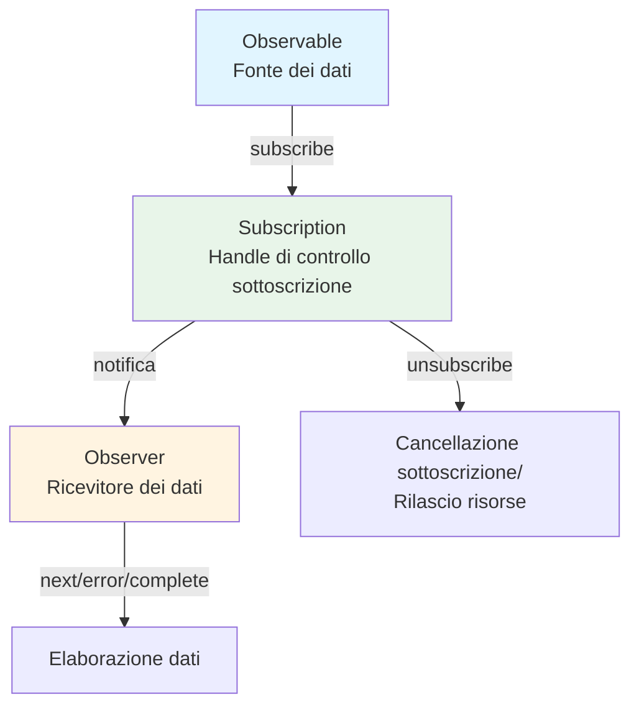

# Cos'è uno stream?

## Definizione di stream

Uno "stream" si riferisce a **un flusso di dati che si verifica sequenzialmente nel tempo**. Può essere considerato come una raccolta di dati che appaiono uno dopo l'altro in un certo ordine.

### Esempi tipici di stream nella programmazione tradizionale
- Dati dalla lettura di file (es. ReadableStream in Node.js)
- Comunicazioni di rete (es. risposte HTTP)
- Input ed eventi dell'utente (movimenti del mouse, clic, input da tastiera)

## Stream in RxJS

RxJS utilizza **Observable** per gestire i dati che si verificano nel tempo come stream. Observable è un meccanismo per astrarre tutti i dati asincroni, dati sincroni, eventi, elaborazioni basate sul tempo, ecc. come "stream".

### Vantaggi degli Observable
- Scrittura type-safe (compatibilità con TypeScript)
- Espressione dichiarativa del flusso di dati
- Concatenamento di operazioni tramite `pipe()`
- Sottoscrizione esplicita con `subscribe()`
- Cancellazione con `unsubscribe()`

## Confronto con stream tradizionali

| Caratteristica | Stream tradizionali | Observable RxJS |
|------|------------------|-------------------|
| Ambito | Tende a essere limitato a file/rete, ecc. | Qualsiasi async/evento/cambio di stato |
| Gestione eventi | Gestiti singolarmente con event listener | Convertiti in stream con `fromEvent` |
| Cancellazione | Metodi vari | Gestione unificata con `unsubscribe()` |
| Composizione/Trasformazione | Implementazione individuale con codice procedurale | Descrizione concisa con operatori (`map`, `filter`, ecc.) |

## Relazione con Observer e Subscription

- **Observable**: Fonte dei dati (sorgente dello stream)
- **Observer**: Ricevitore dei dati (ha next, error, complete)
- **Subscription**: Handle di controllo della sottoscrizione (sottoscrizione, cancellazione, gestione risorse)

Observable e Observer sono collegati tramite callback e controllati da Subscription.

### Diagramma delle relazioni base

## Riepilogo

Il concetto di "stream", che è il cuore di RxJS, è uno strumento potente per gestire l'elaborazione asincrona. Utilizzando Observable, è possibile gestire varie fonti di dati in modo unificato e descrivere i flussi di dati in modo dichiarativo e flessibile.

## Relazione con l'elaborazione degli eventi

In RxJS, anche gli eventi DOM possono essere gestiti come stream utilizzando `fromEvent`.
Confrontando le differenze con gli event listener tradizionali, il concetto di stream diventa più chiaro.

> [!TIP]
> Per un confronto tra la gestione tradizionale degli eventi e RxJS con codice reale, vedere [Streaming degli eventi](/it/guide/observables/events.md#confronto-tra-gestione-tradizionale-degli-eventi-e-rxjs).
