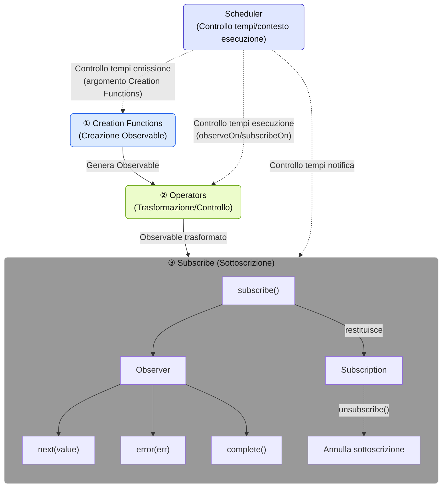
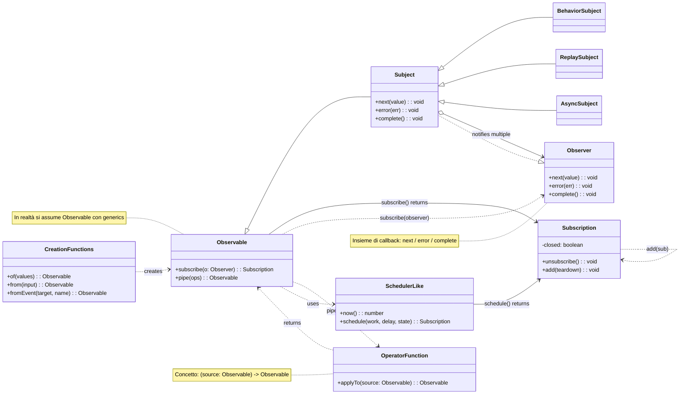

# Cos'è RxJS?

## Panoramica

[RxJS (Reactive Extensions for JavaScript)](https://rxjs.dev) è una libreria per la "programmazione reattiva" in JavaScript.

> ### Cos'è la programmazione reattiva?
> La programmazione reattiva è un metodo per creare programmi che si aggiornano automaticamente in risposta alle variazioni dei dati.
> È un tipo di programmazione guidata dagli eventi, con particolare attenzione alla gestione di flussi di dati asincroni. Si concentra sui flussi di dati (stream) e costruisce i programmi in modo da reagire a questi flussi.

In altre parole, RxJS è una libreria per la gestione di eventi e flussi di dati asincroni (stream) in stile funzionale, che utilizza il pattern Observable e fornisce potenti strumenti per la gestione di flussi di dati asincroni.

> Observable è un costrutto fondamentale di RxJS per rappresentare eventi e flussi di dati asincroni (stream). Un Observable è un "flusso di dati" che pubblica valori nel tempo. È possibile ricevere il valore sottoscrivendolo (subscribe).

> [!TIP]
> Se vi state chiedendo "Cos'è uno stream?", consultate anche [Cos'è uno stream?](/it/guide/basics/what-is-a-stream).

## Esempio semplice di utilizzo

```ts
import { fromEvent } from 'rxjs';

fromEvent(document, 'click').subscribe(event => {
  console.log('Cliccato:', event);
});
```

## Componenti base di RxJS

Per padroneggiare RxJS, è importante comprendere i seguenti componenti fondamentali:

| Componente | Panoramica |
|------|------|
| [`Observable`](../observables/what-is-observable.md) | La sorgente di stream che rappresenta dati che si verificano in modo asincrono o nel tempo. |
| [`Observer`](../observables/observable-lifecycle.md#observer)[^observer] | L'entità che sottoscrive e riceve dati dall'Observable. |
| [`Subscription`](../observables/observable-lifecycle.md#subscription) | Gestisce la sottoscrizione e la cancellazione di un Observable. |
| [`Creation Functions`](../creation-functions/index.md) | Un insieme di funzioni per creare e combinare Observable. |
| [`Operator`](../operators/index.md) | Un insieme di funzioni per trasformare e controllare Observable. |
| [`Subject`](../subjects/what-is-subject.md)[^1] | Un relay con proprietà sia di Observable che di Observer. |
| [`Scheduler`](../schedulers/async-control.md)[^2] | Un meccanismo per controllare i tempi di esecuzione degli Observable. |

[^observer]: Nell'implementazione viene utilizzata la classe Subscriber. Per maggiori dettagli, vedere [Differenza tra Observer e Subscriber](../observables/observer-vs-subscriber.md).
[^1]: Subject è un'entità speciale che può agire sia come Observable che emette valori, sia come Observer che riceve valori.
[^2]: Scheduler viene utilizzato per controllare i tempi e il contesto dell'esecuzione asincrona, ed è utile anche per il debugging e la gestione delle prestazioni.

Questi componenti hanno funzioni indipendenti ma lavorano insieme.
Ad esempio, le Creation Functions creano e combinano gli Observable, gli Operator li trasformano e controllano, gli Observer li sottoscrivono e gli Scheduler ne controllano i tempi di esecuzione, costituendo così l'elaborazione del flusso nel suo complesso.

#### Componenti RxJS e flusso di dati



※ L'uso dettagliato e gli esempi di ciascun componente sono spiegati separatamente nei rispettivi capitoli dedicati.

### Diagramma delle classi



## Vantaggi di RxJS

| Vantaggio | Descrizione |
|---|---|
| Codice dichiarativo[^3] | Descrive "cosa si vuole fare" con `map`, `filter`, ecc. evitando descrizioni procedurali come i cicli for |
| Semplificazione dell'elaborazione asincrona | Evita l'annidamento di `Promise` e callback, permettendo di scrivere in modo intuitivo |
| Gestione degli errori | Gestione uniforme degli errori nei flussi con `.pipe(catchError(...))`, ecc. |
| Cancellabile | I flussi possono essere interrotti con `Subscription.unsubscribe()` |
| Operatori diversificati | Trasformazione e composizione con numerosi operatori come `debounceTime`, `mergeMap`, `combineLatest`, ecc. |

[^3]: > - Codice dichiarativo: Codice che descrive direttamente "quale risultato si desidera"
      > - Codice procedurale: Codice che descrive "quali calcoli eseguire per ottenere il risultato desiderato"

## Casi d'uso

RxJS è utile in tutte le situazioni in cui si gestiscono "dati che cambiano nel tempo". Di seguito sono riportate le principali aree di utilizzo.

### Comunicazione in tempo reale e streaming

RxJS è particolarmente potente quando si tratta di comunicazioni in tempo reale come WebSocket e Server-Sent Events (SSE).

| Utilizzo | Descrizione | Operatori principali |
|------|------|-------------------|
| Comunicazione WebSocket | Chat, notifiche, aggiornamenti azionari, ecc. | [`webSocket`](../observables/creation.md#websocket), [`filter`](../operators/filtering/filter.md), [`map`](../operators/transformation/map.md) |
| Server-Sent Events | Notifiche push dal server | [`fromEvent`](../observables/events.md), [`retry`](../operators/utility/retry.md) |
| Monitoraggio sensori IoT | Elaborazione continua di dati dei sensori | [`debounceTime`](../operators/filtering/debounceTime.md), [`distinctUntilChanged`](../operators/filtering/distinctUntilChanged.md) |

#### Esempio semplice

```ts
import { webSocket } from 'rxjs/webSocket';
import { filter } from 'rxjs';

const socket$ = webSocket('wss://example.com/chat');

socket$.pipe(
  filter(msg => msg.type === 'message')
).subscribe(msg => console.log('Nuovo:', msg.text));
```

### Gestione UI/stato e controllo form

Permette di gestire in modo reattivo gli input dell'utente e i cambiamenti di stato.

> [!NOTE] Relazione con i framework
> I moderni framework front-end (Angular Signals, React hooks, Vue Composition API, Svelte Runes, ecc.) forniscono ciascuno il proprio sistema reattivo. RxJS, come libreria indipendente dal framework, può essere utilizzato insieme a questi o separatamente. L'integrazione di meccanismi specifici dei framework con RxJS è spiegata in dettaglio nel Capitolo 15 "Integrazione con i framework" (in preparazione).

| Utilizzo | Descrizione | Operatori principali |
|------|------|-------------------|
| Controllo form di input | Autocompletamento ricerca, validazione in tempo reale | [`debounceTime`](../operators/filtering/debounceTime.md), [`distinctUntilChanged`](../operators/filtering/distinctUntilChanged.md), [`switchMap`](../operators/transformation/switchMap.md) |
| Collegamento di più elementi form | Aggiornamento di campi di input dipendenti | [`combineLatest`](../creation-functions/combination/combineLatest.md), [`withLatestFrom`](../operators/combination/withLatestFrom.md) |
| Comunicazione tra componenti | Event bus e gestione stato personalizzata | [`Subject`](../subjects/what-is-subject.md), [`share`](../operators/multicasting/share.md) |
| Elaborazione eventi UI | Click, scroll, drag & drop | [`fromEvent`](../observables/events.md), [`takeUntil`](../operators/utility/takeUntil.md) |

#### Esempio semplice

```ts
import { fromEvent, combineLatest } from 'rxjs';
import { debounceTime, map, switchMap } from 'rxjs';

const searchInput = document.querySelector('#search') as HTMLInputElement;
const sortSelect = document.querySelector('#sort') as HTMLInputElement;

const search$ = fromEvent(searchInput, 'input').pipe(
  map(e => (e.target as HTMLInputElement).value)
);

const sort$ = fromEvent(sortSelect, 'change').pipe(
  map(e => (e.target as HTMLSelectElement).value)
);

combineLatest([search$, sort$]).pipe(
  debounceTime(300),
  switchMap(([query, order]) =>
    fetch(`/api/search?q=${query}&sort=${order}`).then(r => r.json())
  )
).subscribe(results => console.log(results));
```

### Supporto offline e PWA

Può essere utilizzato per il supporto offline e la gestione dello stato della rete nelle Progressive Web App (PWA).

| Utilizzo | Descrizione | Operatori principali |
|------|------|-------------------|
| Monitoraggio stato rete | Rilevamento online/offline | [`fromEvent`](../observables/events.md), [`merge`](../creation-functions/combination/merge.md) |
| Riprova quando offline | Risincronizzazione automatica al ripristino della connessione | [`retry`](../operators/utility/retry.md), [`retryWhen`](../error-handling/retry-catch.md) |
| Controllo cache | Integrazione con Service Worker | [`switchMap`](../operators/transformation/switchMap.md), [`catchError`](../error-handling/retry-catch.md) |

#### Esempio semplice

```ts
import { fromEvent, merge } from 'rxjs';
import { map, startWith } from 'rxjs';

const online$ = fromEvent(window, 'online').pipe(map(() => true));
const offline$ = fromEvent(window, 'offline').pipe(map(() => false));

merge(online$, offline$).pipe(
  startWith(navigator.onLine)
).subscribe(isOnline => {
  console.log(isOnline ? 'Online' : 'Offline');
});
```

### API AI/Streaming

Ideale anche per gestire le risposte di API in streaming come OpenAI.

| Utilizzo | Descrizione | Operatori principali |
|------|------|-------------------|
| Output sequenziale token | Visualizzazione in tempo reale delle risposte AI | [`concatMap`](../operators/transformation/concatMap.md), [`scan`](../operators/transformation/scan.md) |
| Elaborazione streaming | Elaborazione Server-Sent Events | [`fromEvent`](../observables/events.md), [`map`](../operators/transformation/map.md) |
| Integrazione backend | Utilizzo con NestJS (RxJS integrato) | Vari operatori |

### Comunicazione HTTP e gestione errori

Permette di gestire elegantemente la comunicazione HTTP asincrona.

| Utilizzo | Descrizione | Operatori principali |
|------|------|-------------------|
| Richieste API | Comunicazione con API RESTful | [`switchMap`](../operators/transformation/switchMap.md), [`mergeMap`](../operators/transformation/mergeMap.md) |
| Gestione errori | Retry e fallback | [`catchError`](../error-handling/retry-catch.md), [`retry`](../operators/utility/retry.md) |
| Controllo timeout | Limiti di tempo per le risposte | [`timeout`](../operators/utility/timeout.md) |
| Cancellazione | Interruzione di richieste non necessarie | [`takeUntil`](../operators/utility/takeUntil.md), `unsubscribe()` |

### Gestione stato e architettura

Può essere utilizzato anche per la progettazione dell'architettura generale dell'applicazione.

| Utilizzo | Descrizione | Operatori principali |
|------|------|-------------------|
| Librerie di gestione stato | NgRx, Redux-Observable, ecc. | [`scan`](../operators/transformation/scan.md), [`share`](../operators/multicasting/share.md) |
| Gestione flusso eventi | Utilizzo in DDD (Domain Driven Design) | [`Subject`](../subjects/what-is-subject.md), [`shareReplay`](../operators/multicasting/shareReplay.md) |
| Separazione data layer | Clean Architecture | Vari operatori |

---

> [!TIP]
> Per informazioni su come scegliere tra Promise e RxJS, vedere anche [Differenze tra Promise e RxJS](./promise-vs-rxjs.md).

## Riepilogo

RxJS offre un approccio potente alla programmazione asincrona e basata sugli eventi. Il concetto di flusso di dati incentrato sugli Observable è particolarmente utile quando si gestisce un'elaborazione asincrona complessa.
